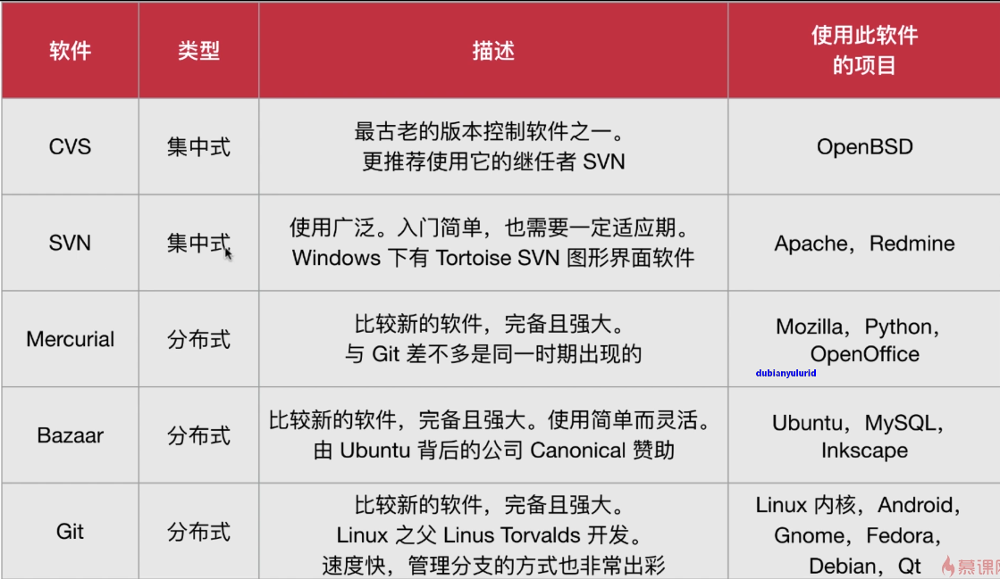

# Vim文本编辑与版本控制

## 高级文本编辑器，安装启动Vim
### Vim
- Vi文本编辑器的进阶版
- 是Vi iMproved的缩写,表示“改进了的vi”
### Emacs
- 著名的开源先驱 Richard stallman开发的文本编辑器
- 后来有很多人参与改进 Emacs 
### vimtutor:vim的教程程序
- vim中内嵌了一个教程小程序
- 输入以下命令就可以执行
- vimtutor
### Vim的多种模式
- #### 交互模式
    - 交互模式: Interactive Mode;也称为正常模式( Normal Mode)
    - 这是Vim的默认模式
    - 每次运行Vim程序的时候,就会进入这个模式
    - 在这个模式中,你不能输入文本
    - 它可以让我们在文本间移动,删除一行文本,复制粘贴文本跳转到指定行,销操作,等等
- #### 插入模式
    - 进入这种模式按i
    - 为了退出这种模式,只需要按下Esc键(一般在键盘左上角)
- #### 命令模式
    - 为了进入这个模式,需要首先处于交互模式下
    - 按下冒号键(在一般的键盘上就是按下 Shift键+分号键)
- #### 可视模式
    - 可视模式( Visual Mode)相当于高亮选取文本后的交互/正常模式
    - 配合d键可以实现删除操作
    - v可视模式 V行可视模式 Ctrl+v:块可视模式
## Vim的多种模式和基本操作
- 0:移动到行首
- $:移动到行末
- w:一个单词一个单词地移动
- :W保存文件
- :q退出
- :q!没保存就直接退出
- :wq/:x  保存并退出
## Vim的标准和高级操作
- 交互模式下 x:删除字符 数字+x删除数字个字母
- 交互模式下 d:删除单词，行，等等
- 交互模式下 dd:删除行 数字+dd删除数字个行
- 交互模式下 dw:删除一个单词 数字+dw
- 交互模式下 d0和d$:删除行首或行末
- 交互模式下 yy:复制行到内存中
- 交互模式下 yw:复制一个单词
- 交互模式下 p:粘贴 会复制到光标下一行
- 交互模式下 r + x 会替换光标处为x 
- 交互模式下 u:撤销操作 数字+u
- 交互模式下 ctrl+r:重做 和 u相反
- 交互模式下 g:跳转到指定行
- 命令模式下 set nu 显示行号
- 交互模式下 要跳转到最后一行,按下G(大写的G,Shit+g)
- 交互模式下 要跳转到第一行,按下gg(按两次g键)
### 交互模式下的查找，分屏，合并等等
- /:查找，从光标处向后，？从光标处向前查找
- :s:查找并替换 
- 例如:s/旧字符串/新字符串 可以替换所在行第一个  
- +/g可以替换所在行所有匹配的
- :#,# S/旧字符串/新字符串/g 可以替换某行到某行的字符串
- :%s/旧字符串/新字符串 替换文件中所有的可以匹配的字符串
- :r合并文件 例如 :r 另一个文件名
- :sp横向分屏 如果要打开不同的文件可以在 :sp 之后空一格，再输入要打开的另一个文件
- :vsp垂直分屏
- 分屏模式下的主要快捷键:
- Ctrl+W然后再按Ctrl+w 从一个 viewport移动光标到另一个 viewport
- Ctrl+W 也可以和方向键结合
- Ctrl+“+” 扩大viewport
- Ctrl+W+o 保留当年的窗口关闭其他的
- Ctrl+W+q/:quit/:close 关闭当前的窗口
- :!+command(命令) 在不关闭当前窗口的情况下运行外部命令

## Vim的配置
### 以命令模式激活选项参数
- :set 选项名 / set no选项名
- 可以通过/ect/vimrc 来全局配置 或者在home目录下创建/.vimrc
- syntax:配置语法高亮
- showcmd:显示当前命令
- ignorecase:在查找时忽略大小写
- mouse:鼠标支持 set mouse=a

## Git 和其他版本控制软件

## 安装和配置Git
[CentOS7中安装Git](https://note.youdao.com/web/#/file/recent/note/wcp1582477242208715/)
