# 管理服务器和服务
[toc]
## 守护进程和初始化进程服务
### 守护进程/服务
- 守护进程也被称为 service(服务)
- 服务器软件大多都是以守护进程的形式运行的
- 守护进程的名字通常会在最后有一个d,表示 daemon
- 例如systemd,httpd,smbd等等
### Linux操作系统的开机过程
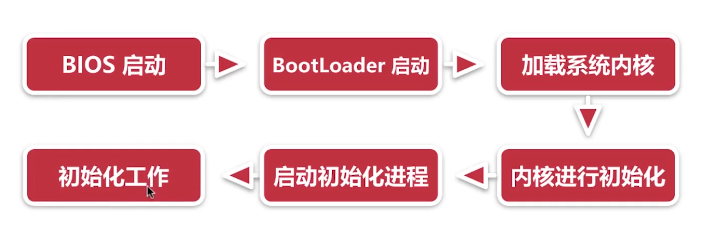
## 用systemd管理系统服务
- systemd并不是一个命令,它包含了一组命令
- systemd是基于事件的
- systemd可以使进程并行启动
[Systemd 入门教程：命令篇](http://www.ruanyifeng.com/blog/2016/03/systemd-tutorial-commands.html)
## 安装Apache服务程序
- sudo yum install httpd
- 在 Centos等 Red Hat一族中, Apache程序的名字叫htpd
```
sudo systemctl start httpd # 启动Apache服务
sudo systemctl stop httpd # 停止Apache服务
sudo systemctl restart httpd # 重启Apache服务
sudo systemctl reload httpd # 重启加载Apache服务的配置文件
sudo systemctl status httpd # 查看Apache服务的状态
sudo systemctl enable httpd # 设置开机自动启动Apache服务
sudo systemctl disable httpd # 设置开机不自动启动Apache服务
firewall-cmd --list-all # 查询防火墙
firewall-cmd reload # 重载配置的防火墙策略

[root@VM_0_14_centos gallery]# sudo systemctl start httpd
[root@VM_0_14_centos gallery]# ps -aux | grep httpd
root     20591  1.5  0.2 224052  5004 ?        Rs   00:39   0:00 /usr/sbin/httpd -DFOREGROUND
apache   20592  0.0  0.1 226136  3104 ?        S    00:39   0:00 /usr/sbin/httpd -DFOREGROUND
apache   20593  0.0  0.1 226136  3104 ?        S    00:39   0:00 /usr/sbin/httpd -DFOREGROUND
apache   20594  0.0  0.1 226136  3104 ?        S    00:39   0:00 /usr/sbin/httpd -DFOREGROUND
apache   20595  0.0  0.1 226136  3104 ?        S    00:39   0:00 /usr/sbin/httpd -DFOREGROUND
apache   20596  0.0  0.1 226136  3104 ?        S    00:39   0:00 /usr/sbin/httpd -DFOREGROUND

```
## 配置Apache服务 
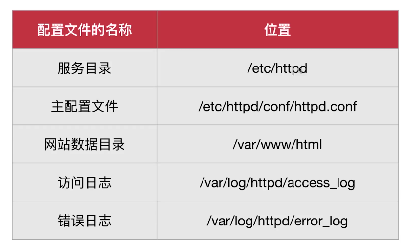
### httpd主配置文件的三种信息类型
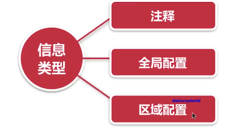
### 配置httpd服务的常用参数
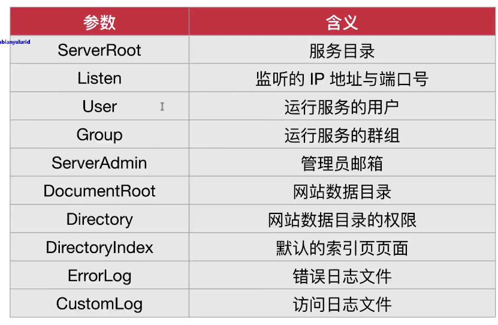

## SELINUX安全子系统
- Selinux是 Security- Enhanced linux的缩写
- 表示“安全增强型 Linux
- 美国国家安全局在 Linux开源社区帮助下开发的MAC的安全子系统
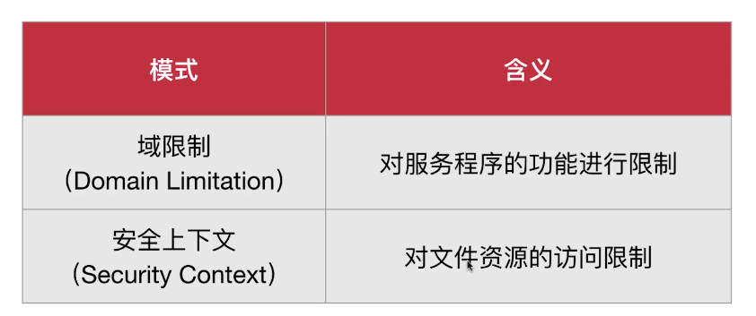
### MAC
- MAC是 Mandatory Access Control的缩写
- 表示“强制访问控制”
- 指一种由操作系统约束的访问控制
### 防火墙和 Selinux的区别
- 防火墙就像“防盗门”,用于抵御外部的危险
- SELINUX就像“保险柜”,用于保护內部的资源
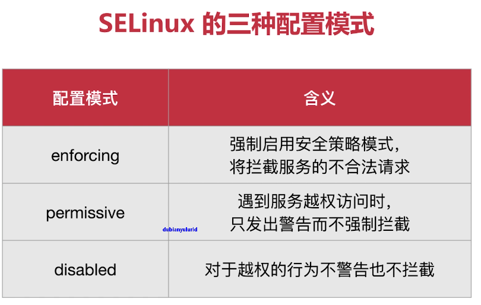
```
[root@VM_0_14_centos ~]# sestatus
SELinux status:                 disabled
```
### semanage命令
- semanage是 Selinux manage的缩写
- 表示“管理 Selinux",用于管理 Selinux的策略
- 命令格式为 semanage[选项][文件]
- yum install policycoreutils-python
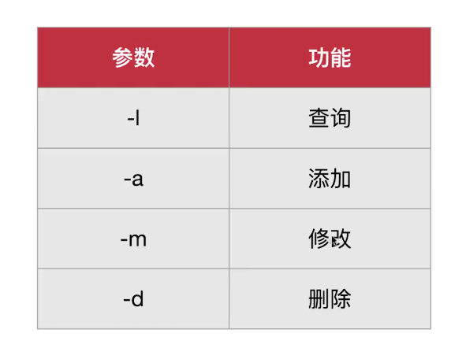

## Apache的虚拟主机功能，基于IP地址的配置

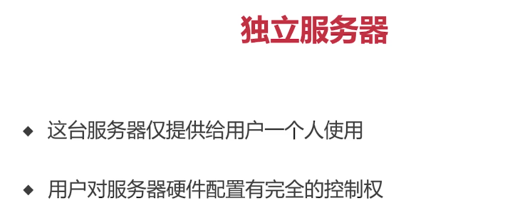
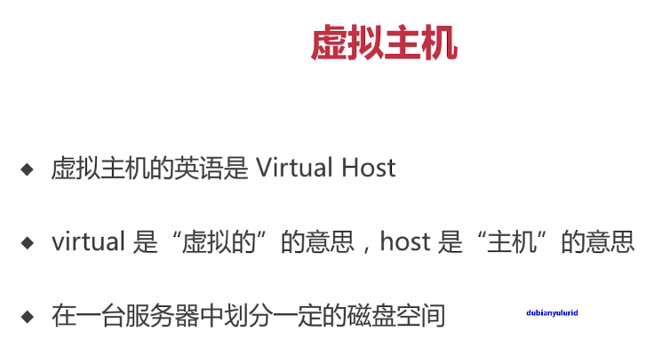
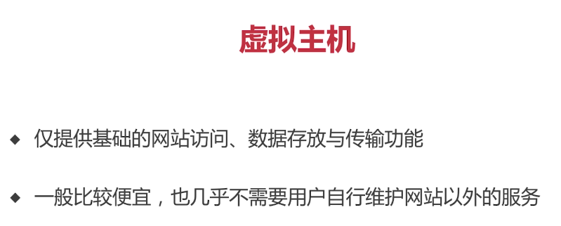
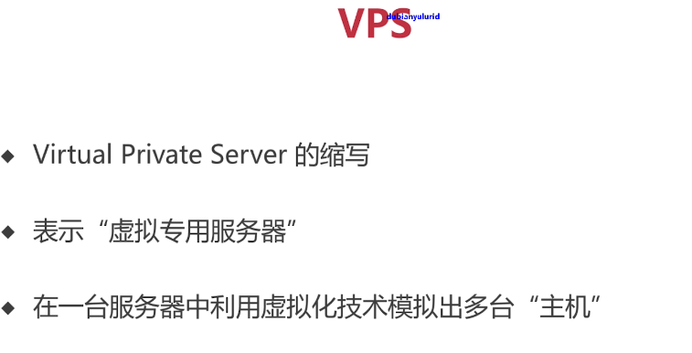
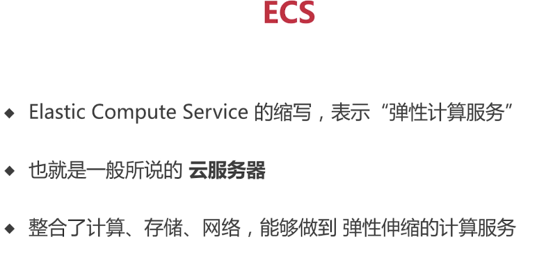
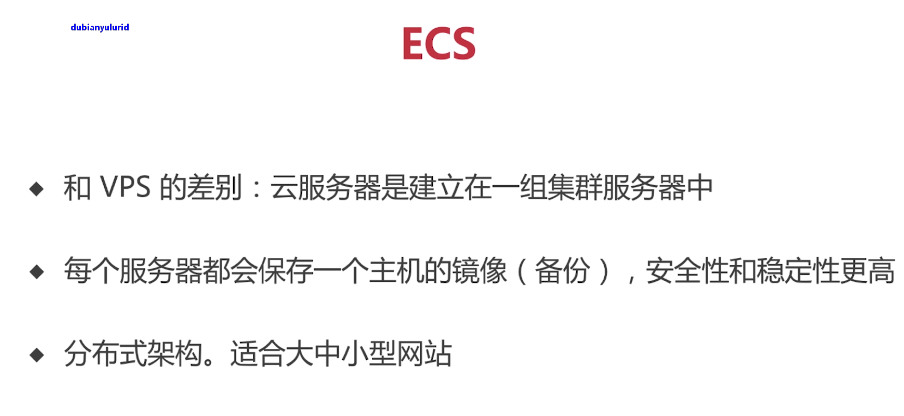