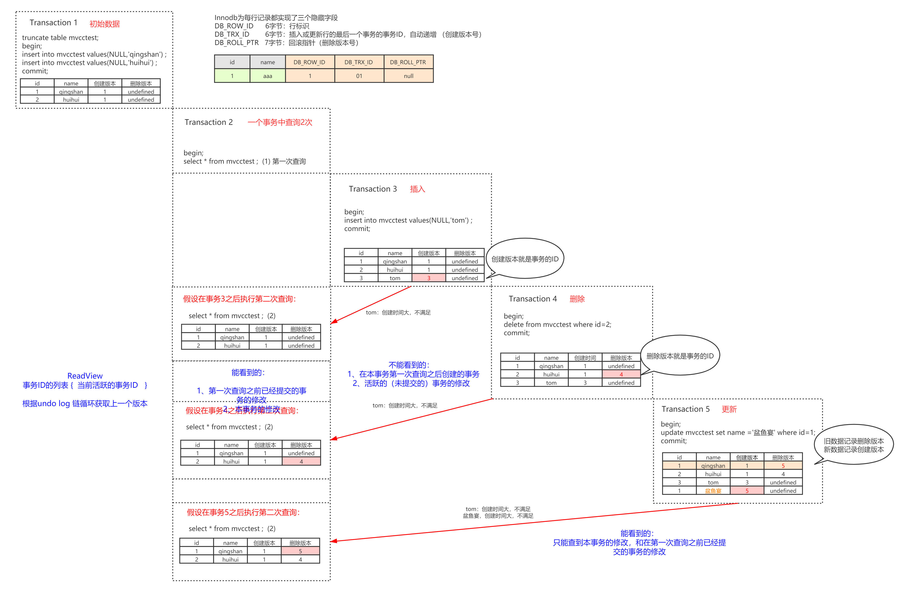

# 1.什么是数据库的事务

```sql
select version();
show variables like '%engine%';
show global variables like "tx_isolation";
```

## 1.1 事务的定义

事务是数据库管理系统(DBMS) 执行过程中的一个逻辑单位，由一个有限的数据库操作序列构成。

1. 所谓的逻辑单位，意味着它是数据库最小的工作单元，是不可以再分的。
2. 它可能包含了一个或者一系列的DML语句，包括 insert delete update.

## 1.2 哪些存储引擎支持事务

除了做集群的NDB 之外，只有Inn oDB支持事务，这个也是它成为默认的存储引擎
的 一个重要原因。

## 1.3 事务的四大特性

- 原子性: 要么都成功要么都失败
	实现： 通过undo log 来实现的，它记录了数据修改之前的值(逻 辑日志)，一旦发生异常，就可以用undo 10g 来实现回滚操作。
- 隔离性：很多个的事务，对表或者行的并发操作，应该是透明的，互相不干扰的。
	实现：
	1. 对于普通的select使用快照(snapshot read),底层使用Multi version currency control(mvcc)来实现.
	2. 加锁的select,底层使用记录锁，或者间隙锁，临键锁。
- 持久性: 
	实现：redolog和doublewritebuffer (双写缓冲)来实现的，先写到内存的buffer pool 里面，同时记录redo log，如果在刷盘之前 出现要特，在理高后說阿以续现redo1oo12各，一入到裝理，(保近数据的父性。
- 一致性： 数据库的完整性约束没有被破坏 ，事务执行的前后都是合法的数据状态。

## 1.4 数据库什么时候会出现事务

增删改的语句会自动开启事务，当然是一条SQL一个事务。注意每个事务都是有编号的，这个编号是一个整数，有递增的特性。

如果要把多条SQL 放在一个事务里面，就要手动开启事务。手动开启事务有两种方式:一种是用begin; 一种是用start transaction。

结束也有两种方式:第一种是回滚事务roll back，事务结束。第二种就是提交一个事务，commit ，事务结束。

如果我们把autocommit 设置成false/off，那么数据库的事务就需要我们手动地结束，用rolback 或者commit。如果客户端断开连接，事务也会结束。

## 1.5 事务并发会带來什么问题?

- 脏读


- 不可重复读


- 幻读


> 事务并发的三大问题其实都是数据库读一致性问题，必须由数据库提供一定的事务隔离机制来解决。

## 1.6 SQL92标准

- Read Uncommitted(RU未提交读) - 未解决任何并发问题 - 事务未提交的数据对其他事务也是可见的，会出现脏读
- Read Committed(RC已提交读) - 解决脏读问题 - 一个事务开始之后，只能看到已提交的事务所做的修改，会出现不可重复读
- Repeatable Read(RR可重复读) - 解决不可重复读问题 - 在同一个事务中多次读取同样的数据结果是一样的，这种隔离级别未解决幻读的问题
- Serializable(串行化) - 解决所有问题 - 最高的隔离级别，通过强制事务的串行执行


## 1.7 MySQL InnoDB对隔离级别的支持


## 1.8 两大实现方案

解決读一致性的问题，保证—个事务中前后两次读取数据结果一致，实现事务隔离，应该怎么做?

### 1.8.1 LBCC

既然要保证前后两次读取数据一致，那么锁定我要操作的数据，不允许其他的事务修改就行了。这种方案我们叫做基于锁的并发控制Lock Based Concurrency Control (LBCC)

如果仅仅是基于锁来实现事务隔离，一个事务读取的时候不允许其他时候修改，那就意味着不支持并发的读写操作，而我们的大多数应用都是读多写少的，这样会极大地影响操作数据的效率。

### 1.8.2 MVCC

要让一个事务前后两次读取的数据保持一致，那么我们可以在修改数据的之前给它建立一个备份或者叫快照，后面再来读取这个快照就行了。这种方案我们叫做多版本的并发控制Multi Version Concurrency Control(MVCC)

- MVCC的原则：
	- 一个事务能看到的数据版本：
		1. 第一次查询之前已经提交的事务的修改
		2. 本事务的修改
	- 一个事务不能看见的数据版本：
		1. 在本事务第一次查询之后创建的事务（事务ID比我的事务ID大）
		2. 活跃的（未提交的）事务的修改

不管别的事务做任何增删改查的操作，它只能看到第一次查询时看到的数据版本。

### 1.8.3 MVCC的实现原理

InnoDB的事务都下是有编号的，会不断递增。InnoDB 为每行记录都实现了两个隐藏字段:
- DB_TRX_ID，6 字节:事务ID ，数据是在哪个事务插入或者修改为新数据的，就记录为当前事务ID。
- DB_ROLL_PTR,7字节：回滚指针（我们把它理解为删除版本号，数据被删除或记录为旧数据的时候，记录当前事务D,没有修改或者删除的时候是空)。




InnoDB中，一条数据的旧版本，是存放在哪里的呢？undo log。因为修改了多次，这些undo log会形成一个链条，叫做undo log链。

DB_ROLL_PTR，它其实就是指向undo log链的指针。

我们必须要有一个数据结构，把本事务1D、活跃事务1D、当前系统最大事务ID 存起来，这样才能实现判断。这个数据结构就叫Read View (可见性视图)，每个事务都维护一个自己的Read View。


- m_ids:表示在生成ReadView时当前系统中活跃的读写事务的事务id列表。
- min_trx_id:表示在生成ReadView时当前系统中活跃的读写事务中最小的事务id,也就是mids中的最小值。
- max_trx_id:表示生成ReadView时系统中应该分配给下一个事务的id值。
- creator_trx_id:表示生成该ReadView的事务的事务id。

根据这个数据结构，事务判断可见性的规则：
1. 从数据的最早版本开始判断 （undo log）
2. 数据版本的trx_id=creator_trx_id,本事务修改，可以访问
3. 数据版本的trx_id<min_trx_id(未提交事务的最小ID),说明这个版本在生成ReadView已经提交，可以访问
4. 数据版本的trx_id>max_trx_id(下一个事务ID),这个版本是生成ReadView之后才开启的事务建立的，不能访问
5.  数据版本的trx_id在min_trxid和max_trx_id之间 ，看看是否在mids中。 如果在，不可以。如果不在，可以。
6. 如果当前版本不可见，就找undo 1og链中的下一个版本。

> RR中ReadView是事务第一次查询的时候建立的。RC的Read View是事务每次查询的时候建立的。
> 锁和MVCC是协同使用的，并不互斥。

# 2.MySQL InnoDB锁的基本类型

## 2.1锁的粒度

锁定粒度:表锁 >行锁
加锁效率:表锁 >行锁 
冲突概率:表锁 >行锁
并发性能:表锁 <行锁

## 2.2 锁的类型

官网把锁分成了8类。我们把前面的两个行级别的锁 (Shared and ExclusiveLocks) ，和两个表级别的锁(Intention Locks)称为锁的基本模式。

Record Locks、Gap Locks、Next-Key Locks，我们把它们叫做锁的算法， 也就是分别在什么情况下锁定什么范围。

- 插入意向锁：是一个特殊的间隙锁。间隙锁不允许插入数据，但是插入意向锁允许多个事务同时插入数据到同一个范围。比如(4,7)，一个事务插入5，一个事务插入6，不会发生锁等待。

- 自增锁：是一种特殊的表锁，用来防止自增字段重复，数据插入以后就会释放，不需要等到事务提交才释放。如果需要选择更快的自增值生成速度或者更加连续的自增值，就要通过修改自增锁的模式改变。

```sql
show variables like 'innodb_autoinc_lock_mode';
```

- 0:traditonal(每次都会产生表锁)
- 1:consecutive（会产生一个轻量锁，simple insert会获得批量的锁，保证连续插入，默认值)
- 2: interleaved (不会锁表，来一个处理一个，并发最高)

## 2.3 共享锁

第一个行锁是：Shared Lock 共享锁，多个事务可以共享一把读锁。
- 共享锁的作用:因为共享锁会阻塞其他事务的修改，所以可以用在不允许其他事务修改数据的情况。
- 可以用select ..... lock in share mode;的方式手工加上一把读锁。

## 2.4 排它锁

第二个行锁是：Exclusive Locks 排它锁。只要一个事务获取了一行数据的排它锁，其他的事务就不能再获取这一行数据的共享锁和排它锁。

- 排它锁的加锁方式有两种，第一种是自动加排他锁，增删改，都会默认加上一个排它锁。
- 还有一种是手工加锁，我们用一个FOR UPDATE给一行数据加上一个排它锁，这个无论是在我们的代码里面还是操作数据的工具里面，都比较常用。

## 2.5 意向锁

由数据库自己维护的。
- 当我们给一行数据加上共享锁之前，数据库会自动在这张表上面加一个意向共享锁。
- 当我们给一行数据加上排他锁之前，数据库会自动在这张表上面加一个意向排他锁。
- 如果一张表上面至少有一个意向共享锁，说明有其他的事务给其中的某些数据行加上了共享锁。
- 如果一张表上面至少有一个意向排他锁，说明有其他的事务给其中的某些数据行加上了排他锁。
- 意向锁跟意向锁是不冲突的，意向锁跟行锁也不冲突。

两个表级锁存在的意义是：
1. 当我们给一张表加上表锁，我们要判断其他的事务有没有锁定某些行，有就不能加表锁。那么加表锁要扫描整个表，效率太低。
2. 引入意向锁，只需要判断表上有没有意向锁，如果有就返回失败，没有就加锁成功。InnoDB的表锁就是一个标志，用来提高加锁效率的。

> 锁是用来解决事务对数据的并发访问的问题的。

# 3. 行锁的原理

## 3.1 没有索引的表(假设锁住记录)

首先我们有三张表， 一张没有索引的t1，一张有主键索引l的t2，一张有唯一索引的t3。

**我们会发现在没有索引的表上锁住一条记录就是锁住整张表。**

## 3.2 有主键索引的表

可以锁住id相同的，不能锁住id相同的。

## 3.3 唯一索引（假设锁住字段）

**InnoDB的行锁，就是通过锁住索引来实现的。**


1. 为什么表里面没有索引的时候，锁住一行数据会导致锁表?
	- 因为查询没有使用索引，会进行全表扫描，然后把每一个隐藏的聚集索引都锁佳了。
2. 为什么通过唯一索引给数据行加锁，主键索引也会被锁住?
	- 在辅助索引里面，索引存储的是二级索引和主键的值。比如name=4,存储的是name的索引和主键id的值4。
	- 主键索引里面除了索引之外，还存储了完整的数据。所以我们通过辅助索锁定一行数据的时候，它跟我们检索数据的步骤是一样的，会通过主键值找到主键索引，然后也锁定。
	- 本质上是因为锁定的是同一行数据，是相互冲突的。

# 4. 锁的算法


## 4.1 记录锁

第一种情况，当我们对于唯一性的索引（包括唯一索引和主键索引)使用等值查询精准匹配到一条记录的时候，这个时候使用的就是记录锁。


## 4.2 间隙锁

第二种情况，当我们查询的记录不存在，没有命中任何一个record,无论是用等值查询还是范国查询的时候，它使用的都是间隙锁。


> 当查询的记录不存在的时候，使用间隙锁。问隙锁 主要是阻塞插入in ser t。相同的问隙锁之间不冲突。

## 4.3 临键锁

第三种情况，当我们使用了范围查询，不仅仅命中了Record记录，还包含了Gap间隙，在这种情况下我们使用的就是临键锁，它是MySQL里面默认的行锁算法，相当于记录锁加上间隙锁。

> 唯一性索引，等值查询匹配到一条记录的时候，退化成记录锁。

> 没有匹配到任何记录的时候，退化成间隙锁。


## 4.4 小结：隔离级别的实现


