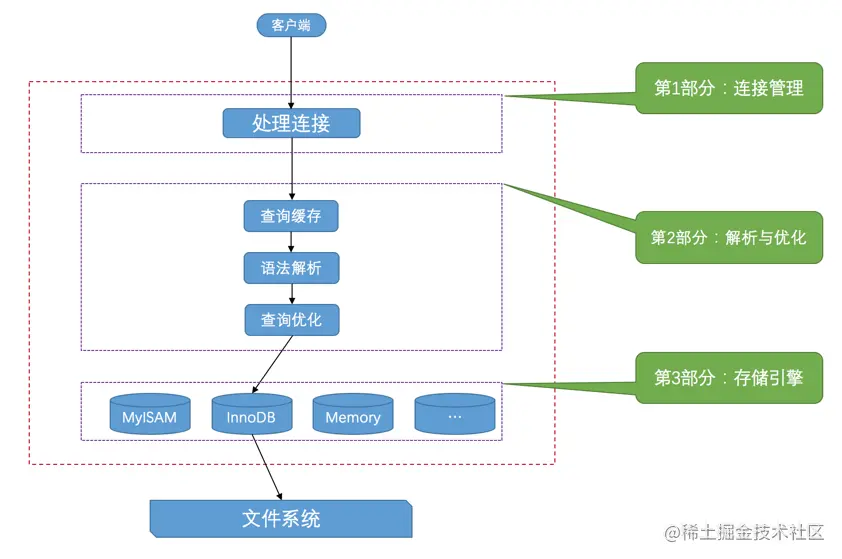

## 1、MySQL语句的执行流程
### 1. 客户端与服务端链接
通信类型：同步/异步 通常是同步
连接方式：长连接/短连接 通常是长连接
协议：TCP/Unix Socket 客户端是TCP 本机是Unix Socket

### 2. 一条查询SQL语句是如何执行的?


#### 2.1 连接
查看 MySQL 当前有多少个连接:
```sql
show global status like 'Thread%';
```
客户端每产生 一个连接或者一个会话，在服务端就会创建一个线程来处理。反过来如果要杀死会话，就是Kill 线程。服务器并不会立即线程销毁掉，而是把它缓存起来，在另一个新的客户端再进行连接时，把这个缓存的线程分配给该新客户端。

分配线程的话，保持连接肯定会消耗服务端的资源。MySQL 会把那些长时间不活动的 (SLEEP)连接自动断开。

```sql
show global variables like 'wait_timeout'; --非交互式超时时间， 如JDBC 程序 

show global variables like 'interactive_timeout' ; -- 交互式超时时间，如数据库工具
```

默认都为8小时。默认最大连接数是151个，最大可以为100000个。

> MySQL中的参数 (变量)分为session 和global级别，分别是在当前会话中生效和全局生效。当没有带参数的时候，默认是session 级别，包括查询和修改。

#### 2.2 查询缓存
如果两个查询请求在任何字符上的不同（例如：空格、注释、大小写），都会导致缓存不会命中。另外，如果查询请求中包含某些系统函数、用户自定义变量和函数、一些系统表,那这个请求就不会被缓存。

缓存这一块，我们还是交给ORM框架 (比如MyBatis 默 认 开 启 了一 级 缓 存 ) ， 或独立的缓存服务，比如Redis来处理更台适。

 > 检索，查询请求处理完需要更新查询缓存，维护该查询缓存对应的内存区域。5.5之后开始默认关闭，并在MySQL 8.0中删除。

#### 2.3 语法解析和预处理

1. 词法解析：把一个完整的SQL语句打碎成一个个的单词
2. 语法解析：语法分析会对SQL做一些语法检查，比如单弓1号有没有闭合， 然后根据 MySQL定义的语法规则，生成解析树
3. 预处理器：检查生成的解析树，比如检查表名是否存在


#### 2.4 查询优化

查询优化器的目的就是根据解析树生成不同的执行计划(ExecutionPlan) ，然后选 择一种最优的执行计划，Mys QL 里面使用的是基于开销 (cost )的优化器，那种执行计
划开销最小，就用哪种。

优化器最终会把解析树变成 一个查询执行计划， 查询执行计划是 一个数据结构。

```sql
# 查看开销
show status like 'Last _query_cost';

# 查看执行计划
EXPLAIN select name from user where id=1;
```

> 我们写的==MySQL==语句执行起来效率可能并不是很高，==MySQL==的优化程序会对我们的语句做一些优化，如外连接转换为内连接

#### 2.5 存储引擎
MySQL服务器把数据的存储和提取操作都封装到了一个叫存储引擎的模块里。

人们把**连接管理、查询缓存、语法解析、查询优化**这些并不涉及真实数据存储的功能划分为MySQL server的功能，把真实存取数据的功能划分为存储引擎的功能。各种不同的存储引擎向上边的==MySQL server==层提供统一的调用接口（也就是存储引擎API）。

#### 2.6 执行引擎

利用存储引擎提供的相应的API 来完成操作,最后把数据返回给客户端。

### 3. 存储引擎
#### 3.1 存储引擎比较

- MyISAM (3 个文件): 应用范围比较小。 表级锁定限制 了读/ 写的性能 ，因此在 Web 和数据仓库配置中，它通常用于只读或以读为主的工作。拥有较高的插入和查询速度。

> 怎么快速向数据库插入100万条数据?我们有一种先用MyISAM插入数据 ，然后修改存储引擎为InnoDB的操作。

- InnoDB (2 个文件): mysql5.7中的默认存储引擎。事务安全、具有提交、回滚和崩溃恢复功能、行级锁提高了多用户并发性和性能。
- Memory (1个文件): 将所有数据存储在RAM中，以便在需要快速查找非关键数据的环境中快速访问。
- CSV (3 个文件): 它的表实际上是带有逗号分隔值的文本文件。
- Archive(2个文件): 这些紧湊的未索引l的表用于存储和检索大量很少引用的历史、存档或安全車计信息。

#### 3.2 如何选择存储引擎

- 如果对数据一致性要求比较高，需要事务支持，可以选择InnoDB。
- 如果数据查询多更新少，对查询性能要求比较高，可以选择MyISAM。
- 如果需要一个用于查询的临时表，可以选择Memory。
- 如果所有的存储引擎都不能满足你的需求，并且技术能力足够，可以根据官网内部手册用C语言开发一个存储引擎


## 2、MySQL体系架构与内部模块

### 2.1 架构分层

可以把MySQL分成三层，跟客户端对接的连接层，真正执行操作的服务层，和跟硬件打交道的存储引擎层


## 3、InnoDB存储引擎的磁盘与内存结构

### 3.1  一条 更 新 S Q L 是 如 何 执 行 的

在数据库里面，我们说的update操作其实包括了更新、插入和删除。MyBatis的源码，应该知道Executor里面也只有doQuery()和doUpdate()的方法没有doDelete()和dolnsert()。

基本流程一致，区别是拿到符合的数据之后的操作。

### 3.2 缓冲池Buffer Pool

对于Inno DB 存储引擎来说，数据都是放在磁盘上的，存储引擎要操作数据，必须先把磁盘里面的数据加载到内存里面才可以操作。

当磁盘上的一块数据被读取的时候，很有可能它附近的位置也会马上被读取到，这个就叫做局部性原理。

InnoDB设定了一个存储引擎从磁盘读取数据到内存的最小的单位，叫做页。操作系统也有页的概念。操作系统的页大小一般是4K,而在InnoDB里面，这个最小的单位默认是16KB 大小。


修改数据的时候，也是先写入到buffer pool，而不是直接写到磁盘。内存的数据页 和磁盘数据不一致的时候，我们把它叫做脏页。有专门的后台线程把buffer pool的数据刷入磁盘，每隔一段时间批量写入磁盘，叫刷脏。

> 缓存的作用， Buffer Pool 的作用是为了提高读写的效率。

### 3.3 Redo log

刷脏不是实时的，如果Buffer Pool 里面的脏页还没有刷入磁盘
时，数据库宕机或者重启，这些数据就会丢失。

为了避免这个问题，InnoDB把所有对页面的修改操作专门写入一个日志文件。

如果有未同步到磁盘的数据，数据库在启动的时候，会从这个日志文件进行恢复操作（实现crash-safe)。我们说的事务的ACID里面D(持久性），就是用它来实现的。


写日志文件和和写到数据文件有什么区别?为什么不直接写到数据文件。


刷密是随机1/0，而记录日志是顺序1/0 (连续写的)，顺序1/0效率更高，本质上是数据集中存储和分散存储的区别。因此先把修改写入日志文件，在保证了内存数据的 安全性的情况下，可以延迟刷盘时机，进而提升系统吞吐。

默认2个文件， 每个48M。

```sql
show variables like 'innodb _log%';
```

1. redo log 是Inn oDB存储引擎实现的，并不是所有存储引擎都有。支持崩溃恢复是InnoDB的一个特性。
2. redolog不是记录数据页更新之后的状态，而是记录的是 "在某个数据页上做了什么修改” 。属于物理日志。
3. redolog的大小是固定的，前面的内容会被覆盖，一旦写满，就会触发buffer pool到磁密的同步，以便腾出空间记录后面的修改。

### 3.4 undo log

undo log(撤销日志或回滚日志)记录了事务发生之前的数据状态，分为insert undo log 和update undo log。如果修改数据时出现异常，可以回滚操作(保持原子性)。

ndolog记录的是反向的操作，比如insert会记录delete，跟redolog 记录做了什么操作不同，所以叫做逻辑格式的日志。

```sql
show global variables like %und0%;
```

> redo log和undo 1og 与事务密切相关，统称为事务日志。


### 3.5 更新过程

1. 事务开始，从内存 (buffer pool)或磁盘(datafile) 取到包含这条数据的数据页，返回给执行器;
2. 执行器修改数据页的数据
3. 记录原来的到undolog， 记录现在到redolog
4. 调用存储引擎的接口，记录数据页到Buffer Pool
5. 事务提交

### 3.6 InnoDB总体架构


#### 3.6.1 内存结构

Buffer Pool主要分为3个部分：Buffer Pool、Change Buffer、Adaptive Hash Index、(redo)log bufer。

##### 1、 Buffer Pool

BufferPool 缓存的是页面信息，包括数据页、索引页。
Buffer Pool默认大小是128M，可以调整。

```sql
# 查看系统变量
SHOW VARIABLES like '%innodb_buffer_pool%';
# 查看服务器状态
SHOW STATUS LIKE '%innodb_buffer_pool%';
```

##### 2、 LRU

InnoDB用LRU算法来管理缓冲池（链表实现，不是传统的LRU,分成了young和old),经过淘汰的数据就是热点数据。


InnoDB 有一个预读机制 (read ahead) 。也就是说，设计者认为访问某个page的数据的时候，相邻的一些page 可能会很快被访问到，所以先把这些page 放到buf fer pool 中缓存起来。


把LRU list分成两部分，靠近head的叫做new sublist,用来放热数据。靠近tail的叫做old sublist,用来放冷数据。中间的分割线叫做midpoint。也就是对buffer pool做一个冷热分离。所有新数据加入到buffer pool的时候，一律先放到冷数据区的head。


可以设置冷却时间，避免刚进来的数据太大，直接提到热区，导致数据被污染。

##### 3、  Change Buffer 写缓冲

如果这个数据页不是唯一索引，不存在数据重复的情况，也就不需要从磁盘加载索引页判断数据是不是重复（唯一性检查）。这种情况下可以先把修改记录在内存的缓冲池中，从而提升更新语句(Insert、Delete、Update)的执行速度。

##### 4、 Adaptive Hash Index

##### 5、 Redo Log Buffer

Redo 1og 也不是每一次都直接写入磁盘，在Buffer Pool 里面有一块内存区域(Log Buffer )专门用来保存即将要写入日志文件的数据，默认16M，它一样可以节省磁盘IO 。

刷盘时机
```sql
SHOW VARIABLES LIKE 'innodb_flush_log_at _trx_commit';
```


刷盈越快，越安全，但是也会越消耗性能。

#### 3.6.2 磁盘结构

##### 1、系统表空间system tab|espace

Inn ODB 系统表空间包含InnODB 数据字典和双写缓冲区, Change Buffer和Und o Logs，如果没有指定file-per-table，也包含用户创建的表和素引数据。

1. undo也可以设置独立的表空间
2. 数据字典：由内部系统表组成，存储表和索引的元数据（定义信息）。
3. 双写缓冲(InnoDB的一大特性)：InnoDB的页和操作系统的页大小不一致，Inn oDB页大小一般为 15K，操作系统页 大小为 4K，Inn o D B 的页写入到磁盘时，一个页需要分 4 次写。
	如果存储引擎正在写入页的数据到磁盘时发生了宕机，可能出现页只写了一部分的。可能导致数据丢失，如果这个页本身已经损坏了，用redo log来做崩溃恢复是没有意义的，就用页的副本来还原这个页，然后再应用redolog。页的副本就是double write, InnoDB的双写技术。通过它实现了数据页的可靠性。

> double write 由两部分组成，一部分是内存的double write, 一个部分是磁盘上的double write。因为double write是顺序写入的，不会带来很大的开销。


##### 2、独占表空间fiIe-per-table tablespaces

我们可以让每张表独占一个表空间。这个开关通过innodb_file_per_table 设置，默认开启。这个文件就是数据目录下的ibd 文件。存放数据和索引。


##### 3、通用表空间general tablespaces

通用表空间也是一种共享的表空间，可以创建一个通用的表空间，用来存储不同数据库的表，数据路径和文件可以自定义。

> 不同表空间的数据是可以移动的。

##### 4、临时表空间temporary tablespaces

存储临时表的数据，包括用户创建的临时表，和磁盘的内部临时表。数据库关闭删除，开启创建。

##### 5、Redo log

前面有

##### 6、Undo表空间

前面有


#### 3.6.3 后台线程

后台线程的主要作用是负责刷新内存池中的数据和把修改的数据页刷新到磁盘。后 台线程分为:master thread, Io thread, purge thread, page cleaner thread.

1. master thread负责刷新缓存数据到磁盘并协调调度其它后台进程。
2. lO thread分为insert buffer、.log、read、write进程。分别用来处理insert buffer、重做日志、读写请求的IO回调。
3. page cleaner thread用来刷新脏页
4. purge thread用来回收undo页。

### 3.7 Binlog

Server 层也有一个日志文件，叫做binlog，它可以被所有的存储引擎使用。

binlog以事件的形式记录了所有的DDL和DML语句（因为它记录的是操作而不是数据值，属于逻辑日志)，可以用来做主从复制和数据恢复。

