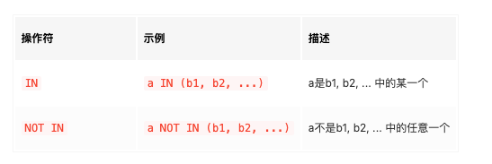
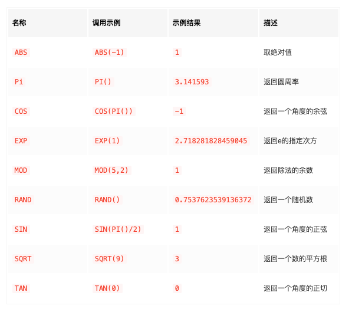

# MySQL是怎样使用的

## MySQL概述
### 关系型数据库管理系统
表格也简称为表，它是由行和列组成的。有一种类型的数据库管理系统就是通过表来存放数据的，而且不同的表可以通过某种关系联系起来(例子中学生成绩表通过学号和学生基本信息表联系起来)，我们把这种数据库管理系统称为 ==关系型数据库管理系统== ，本书的主角儿 ==MySQL== 就是一种关系型数据库管理系统。
### MySQL的优势
使用由行和列组成的表来存放数据的关系型数据库管理系统有好多种，比方说甲骨文的Oracle，IBM的DB2，微软的SQL Server，开源的PostgreSQL和MySQL等等等等。
- 免费
- 开源
- 跨平台
- 高性能

### MySQL命令行操作
#### 使用\c放弃本次操作
如果你想放弃本次编写的命令，可以在输入的命令后边加上\c，比如这样：
```sql
mysql> SELECT NOW()\c
mysql>
```
如果不使用\c，那客户端会以为这是一个多行命令，还在一直傻傻的等你输入命令～

#### 字符串的表示
在命令里有时会使用到字符串，我们可以使用单引号''或者双引号""把字符串内容引起来，比如这样：
```sql
mysql> SELECT 'aaa';
+-----+
| aaa |
+-----+
| aaa |
+-----+
1 row in set (0.00 sec)

mysql>
```
建议最好使用单引号来表示字符串～

## MySQL数据类型
### MySQL整数类型
使用的字节数越多，意味着能表示的数值范围就越大，但是也就越耗费存储空间。根据表示一个数占用字节数的不同，MySQL把整数划分成如下所示的类型：


| 类型 | 占用的存储空间（单位：字节） | 无符号数取值范围 | 有符号数取值范围 | 含义 |
| --- | --- | --- | --- | --- |
|==TINYINT==| 1 | 0 ~ 2⁸-1 | -2⁷ ~ 2⁷-1 | 非常小的整数 |
| ==SMALLINT== | 2 | 0 ~ 2¹⁶-1 | -2¹⁵ ~ 2¹⁵-1 | 小的整数 |
| ==MEDIUMINT== | 3 | 0 ~ 2²⁴-1 | 	-2²³ ~ 2²³-1 | 中等大小的整数 |
| ==INT== | 4 | 0 ~ 2³²-1 | -2³¹ ~ 2³¹-1 | 标准的整数 |
| ==BIGINT== | 8 | 0 ~ 2⁶⁴-1 | -2⁶³ ~ 2⁶³-1 | 大整数 |

### MySQL浮点数类型
我们表示一个浮点数使用的字节数越多，表示尾数和指数的范围就越大，也就是说可以表示的小数范围就越大，设计MySQL的大叔根据表示一个小数需要的不同字节数定义了如下的两种浮点数类型：

| 类型 | 占用的存储空间（单位：字节） | 绝对值最小非0值 | 绝对值最大非0值 | 含义 |
| --- | --- | --- | --- | --- |
| ==FLOAT== | 4 | ±1.175494351E-38 | ±3.402823466E+38 | 单精度浮点数 |
| ==DOUBLE== | 8 | ±2.2250738585072014E-308 | ±1.7976931348623157E+308 | 双精度浮点数 |


#### 设置最大位数和小数位数
在定义浮点数类型时，还可以在FLOAT或者DOUBLE后边跟上两个参数，就像这样：
```sql
FLOAT(M, D)
DOUBLE(M, D)
```
对于我们用户而言，使用的都是十进制小数。如果我们事先知道表中的某个列要存储的小数在一定范围内，我们可以使用FLOAT(M, D)或者DOUBLE(M, D)来限制可以存储到本列中的小数范围。其中：
- M表示该小数最多需要的十进制有效数字个数。
- D表示该小数的小数点后的十进制数字个数。


可以看到，在D相同的情况下，M越大，该类型的取值范围越大；在M相同的情况下，D越大，该类型的取值范围越小。当然，M和D的取值也不是无限大的，M的取值范围是1~255，D的取值范围是0~30，而且D的值必须不大于M。M和D都是可选的，如果我们省略了它们，那它们的值按照机器支持的最大值来存储。

### 定点数类型
正因为用浮点数表示小数可能会有不精确的情况，在一些情况下我们必须保证小数是精确的，所以设计MySQL的大叔们提出一种称之为定点数的数据类型，它也是存储小数的一种方式：

| 类型 | 占用的存储空间（单位：字节） | 取值范围 |
| --- | --- | --- |
| ==DECIMAL(M, D)== | 取决于M和D | 取决于M和D |

定点数是一种精确的小数，为了达到精确的目的我们就不能把它转换成二进制小数之后再存储(因为有很多十进制小数转为二进制小数后需要进行舍入操作，导致二进制小数表示的数值是不精确的)。我们只要把小数点左右的两个十进制整数给存储起来，那不就是精确的了么。比方说对于十进制小数2.38来说，我们可以把这个小数的小数点左右的两个整数，也就是2和38分别保存起来。

对于给定M、D值的DECIMAL(M, D)类型，比如DEMCIMAL(16, 4)来说：
- 首先确定小数点左边的整数最多需要存储的十进制位数是12位，小数点右边的整数需要存储的十进制位数是4位，如图所示：
- 
- 从小数点位置出发，每个整数每隔9个十进制位划分为1组，效果就是这样：

- 针对每个组中的十进制数字，将其转换为二进制数字进行存储，根据组中包含的十进制数字位数不同，所需的存储空间大小也不同，具体见下表：


存储一个负数,需要每一个比特位都执行一个取反操作

> 与浮点数相比，定点数需要更多的空间来存储数据，所以如果不是在某些需要存储精确小数的场景下，一般的小数用浮点数表示就足够了。    

**另外M的范围是1-65，D的范围是0-30，且D的值不能超过M**。

### 无符号数值类型的表示
MySQL给我们提供了一个表示无符号数值类型的方式，就是在原数值类型后加一个单词UNSIGNED：
```sql
数值类型 UNSIGNED
```
大家可以把它当成一种新类型对待，比如==INT UNSIGNED==就表示无符号整数，==FLOAT UNSIGNED==表示无符号浮点数，==DECIMAL UNSIGNED==表示无符号定点数。

> 小贴士： 在使用的存储空间大小相同的情况下，无符号整数可以表示的正整数范围比有符号整数能表示的正整数范围大一倍。不过受浮点数和定点数具体的存储格式影响，无符号浮点数和定点数并不能提升正数的表示范围。

### 日期和时间类型
MySQL为我们提供了多种关于时间和日期的类型，各种类型能表示的范围如下：


在MySQL5.6.4这个版本之后，TIME、DATETIME、TIMESTAMP这几种类型添加了对毫秒、微秒的支持。由于毫秒、微秒都不到1秒，所以也被称为小数秒，MySQL最多支持6位小数秒的精度，各个位代表的意思如下：


比如DATETIME(0)表示精确到秒，DATETIME(3)表示精确到毫秒，DATETIME(5)表示精确到10微秒。如果你在选择TIME、DATETIME、TIMESTAMP这几种类型的时候添加了对小数秒的支持，那么所需的存储空间需要相应的扩大，保留不同的小数秒位数，那么增加的存储空间大小也不同，如下表：


MySQL5.6.4这个版本之后的各个类型需要的存储空间和取值范围就如下：


> DATETIME类型占用的存储空间从原来的8字节变成了5字节

#### YEAR
YEAR类型也可以写成YEAR(4)，它单纯表示一个年份值，取值范围为1901 ～ 2155，仅仅占用1个字节大小而已。因为可以存储的年份值有限，如果我们想存储更大范围的年份值，可以不使用MySQL自带的YEAR类型，换成SMALLINT（2字节）或者字符串类型啥的都可以。

#### DATE、TIME和DATETIME
顾名思义，DATE表示日期，格式是YYYY-MM-DD；TIME表示时间，格式是hh:mm:ss[.uuuuuu]或者hhh:mm:ss[.uuuuuu]（有时候要存储的小时值是三位数），DATETIME表示日期+时间，格式是YYYY-MM-DD hh:mm:ss[.uuuuuu]。其中的YYYY、MM、DD、hh、mm、ss、uuuuuu分别表示年、月、日、时、分、秒、小数秒。
> 需要注意的是，DATETIME中的时间部分表示的是一天内的时间(00:00:00 ~ 23:59:59)，而 TIME表示的是一段时间，而且可以表示负值。

#### TIMESTAMP
1970-01-01 00:00:00注定是一个特殊的时刻，我们把某个时刻距离1970-01-01 00:00:00的秒数称为时间戳。比方说当前时间是2018-01-24 11:39:21，距离1970-01-01 00:00:00的秒数为1516765161，那么2018-01-24 11:39:21这个时刻的时间戳就是1516765161。不过在MySQL5.6.4之后，时间戳的值也可以加入小数秒。

**用时间戳存储时间的好处就是，它展示的值可以随着时区的变化而变化**。比方说我们把2018-01-24 11:39:21这个时刻存储到一个TIMESTAMP的列中，那么在中国你看到的时间就是2018-01-24 11:39:21，如果你去了日本，他们哪里的使用的是东京时间，比北京时间早一个小时，所以他们那显示的就是2018-01-24 12:39:21。而如果你用DATETIME存储2018-01-24 11:39:21的话，那不同时区看到的时间值都是一样的。

### 字符串类型
字符可以大致分为两种，一种叫==可见字符==，一种叫==不可见字符==。
#### 字符编码简介
字符是面向人的概念，字节是面向计算机的概念。如果你想在计算机中表示字符，那就需要将该字符与一个特定的字节序列对应起来，这个映射过程称之为编码。
根据表示一个字符使用的字节数量是不是固定的，编码方案可以分为下边两种：
- 固定长度的编码方案
    表示不同的字符所需要的字节数量是相同的。比方说ASCII编码方案采用1个字节来编码一个字符，ucs2采用2个字节来编码一个字符。
- 变长的编码方案
    表示不同的字符所需要的字节数量是不同的。比方说utf8编码方案采用1~3个字节来编码一个字符，gb2312采用1~2个字节来编码一个字符。

> 小贴士： 正宗的utf8字符集是使用1~4个字节来编码一个字符的，不过MySQL中对utf8字符集做了阉割，编码一个字符最多使用3个字节。如果我们之后有存储使用4个字节来编码的字符的情景，可以使用一种称之为utf8mb4的字符集，它才是正宗的utf8字符集。

### MySQL的字符串类型
其中==M==代表该数据类型最多能存储的字符数量，==L==代表我们实际向该类型的属性中存储的字符串在特定字符集下所占的字节数，==W==代表在该特定字符集下，编码一个字符最多需要的字节数


#### CHAR(M)
CHAR(M)中的M代表该类型最多可以存储的字符数量，注意，是字符数量，不是字节数量。
如果省略掉M的值，那它的默认值就是1，也就是说CHAR和CHAR(1)是一个意思。CHAR(0)是一种特别的类型，它只能存储空字符串''或者NULL值。
**CHAR(M)在不同的字符集下需要的存储空间也是不一样的。**

#### VARCHAR(M)
VARCHAR(M)中的M也是代表该类型最多可以存储的字符数量，理论上的取值范围是1~65535。但是MySQL中还有一个规定，表中某一行包含的所有列中存储的数据大小总共不得超过65535个字节（注意是字节），也就是说VARCHAR(M)类型实际能够容纳的字符数量是小于65535的。

一个VARCHAR(M)类型表示的数据其实是由这么两部分组成：
1. 真正的字符串内容。
    假设真正的字符串在特定字符集编码后占用的字节数为L。
2. 占用字节数。
    假设VARCHAR(M)类型采用的字符集编码一个字符最多需要W个字节，那么：
    - 当M×W < 256时，只需要一个字节来表示占用的字节数。

    - 当M×W >= 256且M×W < 65536时，需要两个字节来表示占用的字节数。

VARCHAR(5) M × W= 5×3 = 15，而15 < 256

VARCHAR(100) M × W= 100×3 = 300，而300 > 256


#### 各种TEXT类型
它们也都是变长类型，也就是说这些类型占用的存储空间由实际内容和内容占用的字节长度两部分构成。
- 因为TINYTEXT最多可以存储2⁸-1个字节，所以内容占用的字节长度用1个字节就可以表示

- TEXT最多可以存储2¹⁶-1个字节，所以内容占用的字节长度用2个字节就可以表示。

- MEDIUMTEXT最多可以存储2²⁴-1个字节，所以内容占用的字节长度用3个字节就可以表示。

- LONGTEXT最多可以存储2³²-1个字节，所以内容占用的字节长度用4个字节就可以表示。

### ENUM类型和SET类型
```sql
ENUM('str1', 'str2', 'str3' ⋯)

SET('str1', 'str2', 'str3' ⋯)
```
它表示在给定的字符串列表里选择一个。比如我们的性别一列可以定义成ENUM('男', '女')类型。这个的意思就是性别一列只能在'男'或者'女'这两个字符串之间选择一个，相当于一个单选框～

它表示可以在给定的字符串列表里选择多个。我们的兴趣一列就可以定义成SET('打球', '画画', '扯犊子', '玩游戏')类型。这个的意思就是兴趣一列可以在给定的这几个字符串中选择一个或多个，相当于一个多选框～

### 二进制类型
#### BIT类型

MySQL是以字节为单位存储数据的，一个字节拥有8个比特位。BIT(9)类型仅仅需要存储9个比特位的数据，但是MySQL会为其申请(9+7)/8 = 2个字节。

#### BINARY(M)与VARBINARY(M)
BINARY(M)和VARBINARY(M)对应于我们前边提到的CHAR(M)和VARCHAR(M)，都是前者是固定长度的类型，后者是可变长度的类型，只不过**BINARY(M)和VARBINARY(M)是用来存放字节的**，其中的M代表该类型最多能存放的字节数量，而CHAR(M)和VARCHAR(M)是用来存储字符的，其中的M代表该类型最多能存放的字符数量。

## 数据库的基本操作

### 创建数据库
```sql
CREATE DATABASE 数据库名;
```
### 查有哪些数据库
```sql
SHOW DATABASES;
```

### IF NOT EXISTS
一个数据库已经存在的情况下再使用CREATE DATABASE去创建这个数据库会产生错误,如果我们并不清楚数据库是否存在，可以使用下边的语句来创建数据库：
```sql
CREATE DATABASE IF NOT EXISTS 数据库名;
```

### 切换当前数据库
对于每一个连接到MySQL服务器的客户端，都有一个当前数据库的概念（也可以称之为默认数据库），我们创建的表默认都会被放到当前数据库中。
```sql
USE 数据库名称;
```

### 删除数据库
```sql
DROP DATABASE 数据库名;
```

### IF EXISTS
如果某个数据库并不存在，我们仍旧调用DROP DATABASE语句去删除它，会报错,如果想避免这种报错，可以使用这种形式的语句来删除数据库：
```sql
DROP DATABASE IF EXISTS 数据库名;
```

## 表的基本操作
### 展示当前数据库中的表
```sql
SHOW TABLES;
```
### 创建表
#### 基本语法
1. 给表起个名。
2. 给表定义一些列，并且给这些列都起个名。
3. 每一个列都需要定义一种数据类型。
4. 如果有需要的话，可以给这些列定义一些列的属性，比如不许存储NULL，设置默认值等等，具体列可以设置哪些属性我们稍后详细唠叨。
MySQL中创建表的基本语法就是这样的：
```sql
CREATE TABLE 表名 (
    列名1    数据类型    [列的属性],
    列名2    数据类型    [列的属性],
    ...
    列名n    数据类型    [列的属性]
);
```
- 列名、数据类型、列的属性之间用空白字符分开就好，然后各个列的信息之间用逗号,分隔开。

#### 为建表语句添加注释
我们可以在创建表时将该表的用处以注释的形式添加到语句中，只要在建表语句最后加上COMMENT语句就好，如下：
```sql
CREATE TABLE 表名 (
    各个列的信息 ...
) COMMENT '表的注释信息';
```
#### IF NOT EXISTS
逻辑与创建数据库一致
```sql
CREATE TABLE IF NOT EXISTS 表名(
    各个列的信息 ...
);
```

### 删除表
```sql
DROP TABLE 表1, 表2, ..., 表n;
```
#### IF EXISTS
```sql
DROP TABLE IF EXISTS 表名;
```

#### 查看表结构
```sql
DESCRIBE 表名;
DESC 表名;
EXPLAIN 表名;
SHOW COLUMNS FROM 表名;
SHOW FIELDS FROM 表名;
// 会显示出建表语句
SHOW CREATE TABLE 表名;
```

#### 没有选择当前数据库时对表的操作
```sql
SHOW TABLES FROM xiaohaizi;

数据库名.表名

SHOW CREATE TABLE xiaohaizi.first_table\G
```

### 修改表
在表创建好之后如果对表的结构不满意，比如想增加或者删除一列，想修改某一列的数据类型或者属性，想对表名或者列名进行重命名，这些操作统统都算是修改表结构。MySQL给我们提供了一系列修改表结构的语句。

#### 修改表名
```sql
ALTER TABLE 旧表名 RENAME TO 新表名;

RENAME TABLE 旧表名1 TO 新表名1, 旧表名2 TO 新表名2, ... 旧表名n TO 新表名n;
```
如果在修改表名的时候指定了数据库名，还可以将该表转移到对应的数据库。
```sql
mysql> ALTER TABLE first_table RENAME TO first_table1
    -> ;
Query OK, 0 rows affected (0.01 sec)

mysql> show tables;
+---------------------+
| Tables_in_xiaohaizi |
+---------------------+
| first_table1        |
| student_info        |
| student_score       |
+---------------------+
3 rows in set (0.00 sec)

mysql> CREATE DATABASE dahaizi;
Query OK, 1 row affected (0.00 sec)

mysql> ALTER TABLE first_table1 RENAME TO dahaizi.first_table1;
Query OK, 0 rows affected (0.01 sec)

mysql> SHOW TABLES;
+---------------------+
| Tables_in_xiaohaizi |
+---------------------+
| student_info        |
| student_score       |
+---------------------+
2 rows in set (0.00 sec)

mysql> SHOW TABLES FROM dahaizi;
+-------------------+
| Tables_in_dahaizi |
+-------------------+
| first_table1      |
+-------------------+
1 row in set (0.00 sec)

mysql> RENAME TABLE dahaizi.first_table1 TO xiaohaizi.first_table;
Query OK, 0 rows affected (0.01 sec)
```
#### 增加列
```sql
ALTER TABLE 表名 ADD COLUMN 列名 数据类型 [列的属性];
```
#### 增加列到特定位置
```sql
// 添加到第一列：
ALTER TABLE 表名 ADD COLUMN 列名 列的类型 [列的属性] FIRST;

// 添加到指定列的后边
ALTER TABLE 表名 ADD COLUMN 列名 列的类型 [列的属性] AFTER 指定列名;
```
#### 删除列
```sql
ALTER TABLE 表名 DROP COLUMN 列名;
```

#### 修改列信息
```sql
// 方式一：
ALTER TABLE 表名 MODIFY 列名 新数据类型 [新属性];

// 方式二：
ALTER TABLE 表名 CHANGE 旧列名 新列名 新数据类型 [新属性];
// 可以看到这种修改方式需要我们填两个列名，也就是说在修改数据类型和属性的同时也可以修改列名
```

#### 修改列排列位置
```sql
// 将列设为表的第一列：
ALTER TABLE 表名 MODIFY 列名 列的类型 列的属性 FIRST;

// 将列放到指定列的后边：
ALTER TABLE 表名 MODIFY 列名 列的类型 列的属性 AFTER 指定列名;
```
#### 一条语句中包含多个修改操作
```sql
ALTER TABLE 表名 操作1, 操作2, ..., 操作n;

ALTER TABLE first_table DROP COLUMN third_column, DROP COLUMN fourth_column, DROP COLUMN fifth_column;
```

## 列的属性
### 默认值
```sql
列名 列的类型 DEFAULT 默认值

CREATE TABLE first_table (
    first_column INT,
    second_column VARCHAR(100) DEFAULT 'abc'
);
```

### NOT NULL属性
有时候我们需要要求表中的某些列中必须有值，不能存放NULL，那么可以用这样的语法来定义这个列：
```sql
列名 列的类型 NOT NULL
```

### 主键
有时候在我们的表里可以通过**某个列或者某些列**确定唯一的一条记录，我们就可以把这个列或者这些列称为候选键。

一个表可能有多个候选键，我们可以选择一个候选键作为表的**主键**。一个表最多只能有一个主键，主键的值不能重复，通过主键可以找到唯一的一条记录。如果我们的表中有定义主键的需求可以选用下边这两种方式之一来指定主键：
1. 如果主键只是单个列的话，可以直接在该列后声明PRIMARY KEY，比如我们把学生信息表student_info的学号列声明为主键可以这么写：
```sql
CREATE TABLE student_info (
    number INT PRIMARY KEY,
    name VARCHAR(5),
    sex ENUM('男', '女'),
    id_number CHAR(18),
    department VARCHAR(30),
    major VARCHAR(30),
    enrollment_time DATE
);
```
2. 我们也可以把主键的声明单独提取出来，用这样的形式声明：
```sql
PRIMARY KEY (列名1, 列名2, ...)

CREATE TABLE student_info (
    number INT,
    name VARCHAR(5),
    sex ENUM('男', '女'),
    id_number CHAR(18),
    department VARCHAR(30),
    major VARCHAR(30),
    enrollment_time DATE,
    PRIMARY KEY (number)
);
// 值得注意的是，对于多个列的组合作为主键的情况，必须使用这种单独声明的形式
CREATE TABLE student_score (
    number INT,
    subject VARCHAR(30),
    score TINYINT,
    PRIMARY KEY (number, subject)
);
```
> 主键列默认是有NOT NULL属性，也就是必填的，如果填入NULL值会报错。

### UNIQUE属性
对于不是主键的其他候选键，如果也想让MySQL在我们向表中插入新记录的时候帮助我们校验一下某个列或者列组合的值是否重复，那么我们可以把这个列或列组合添加一个UNIQUE属性，表明该列或者列组合的值是不允许重复的。与我们在建表语句中声明主键的方式类似，为某个列声明UNIQUE属性的方式也有两种：
1. 如果我们想为单个列声明UNIQUE属性，可以直接在该列后填写UNIQUE或者UNIQUE KEY
```sql
CREATE TABLE student_info (
    number INT PRIMARY KEY,
    name VARCHAR(5),
    sex ENUM('男', '女'),
    id_number CHAR(18) UNIQUE,
    department VARCHAR(30),
    major VARCHAR(30),
    enrollment_time DATE
);

```
2. 我们也可以把UNIQUE属性的声明单独提取出来，用这样的形式声明：
```sql
UNIQUE [约束名称] (列名1, 列名2, ...)

UNIQUE KEY [约束名称] (列名1, 列名2, ...)

// 不过值得注意的是，对于多个列的组合具有UNIQUE属性的情况，必须使用这种单独声明的形式。

CREATE TABLE student_info (
    number INT PRIMARY KEY,
    name VARCHAR(5),
    sex ENUM('男', '女'),
    id_number CHAR(18),
    department VARCHAR(30),
    major VARCHAR(30),
    enrollment_time DATE,
    UNIQUE KEY uk_id_number (id_number)
);
```
> 为某个列添加一个UNIQUE属性也可以认为是为这个表添加了一个约束，我们就称之为UNIQUE约束。每个约束都可以有一个名字，像主键也算是一个约束，它的名字就是默认的PRIMARY。不过约束名称是被中括号[]扩起来的，意味着我们写不写都可以。

### 主键和UNIQUE约束的区别
1. 一张表中只能定义一个主键，却可以定义多个UNIQUE约束！
2. 规定：主键列不允许存放NULL，而声明了UNIQUE属性的列可以存放NULL，而且NULL可以重复地出现在多条记录中！
> 小贴士： 一个表的某个列声明了UNIQUE属性，那这个列的值不就不可以重复了么, NULL其实并不是一个值，它代表不确定，我们平常说某个列的值为NULL，意味着这一列的值尚未被填入。

### 外键
插入到学生成绩表student_score中的number(学号)列中的值必须能在学生基本信息表student_info中的number列中找到，否则如果一个学号只在成绩表里出现，而在基本信息表里找不到相应的记录的话，就相当于插入了不知道是哪个学生的成绩，这显然是荒谬的。为了防止这样荒谬的情况出现，MySQL给我们提供了外键约束机制。定义外键的语法是这样的：
```sql
CONSTRAINT [外键名称] FOREIGN KEY(列1, 列2, ...) REFERENCES 父表名(父列1, 父列2, ...);

CREATE TABLE student_score (
    number INT,
    subject VARCHAR(30),
    score TINYINT,
    PRIMARY KEY (number, subject),
    CONSTRAINT FOREIGN KEY(number) REFERENCES student_info(number)
);
```
- 如果A表中的某个列或者某些列依赖与B表中的某个列或者某些列，那么就称A表为子表，B表为父表。
- 这样，在对student_score表插入数据的时候，MySQL都会为我们检查一下插入的学号是否能在student_info表中找到，如果找不到则会报错。
> 小贴士：父表中被子表依赖的列或者列组合必须建立索引，如果该列或者列组合已经是主键或者有UNIQUE属性，那么它们也就被默认建立了索引。

### AUTO_INCREMENT属性
AUTO_INCREMENT翻译成中文可以理解为自动增长，简称自增。如果一个表中的某个列的数据类型是整数类型或者浮点数类型，那么这个列可以设置AUTO_INCREMENT属性。当我们把某个列设置了AUTO_INCREMENT属性之后，如果我们在插入新记录的时候不指定该列的值，或者将该列的值显式地指定为NULL或者0，那么新插入的记录在该列上的值就是当前该列的最大值加1后的值。
```sql
列名 列的类型 AUTO_INCREMENT

DROP TABLE first_table;

mysql> CREATE TABLE first_table (
    ->     id INT UNSIGNED AUTO_INCREMENT PRIMARY KEY,
    ->     first_column INT,
    ->     second_column VARCHAR(100) DEFAULT 'abc'
    -> );
```
1. 一个表中最多有一个具有AUTO_INCREMENT属性的列。
2. 具有AUTO_INCREMENT属性的列必须建立索引。主键和具有UNIQUE属性的列会自动建立索引。
3. 拥有AUTO_INCREMENT属性的列就不能再通过指定DEFAULT属性来指定默认值。
4. 一般拥有AUTO_INCREMENT属性的列都是作为主键的属性，来自动生成唯一标识一条记录的主键值。

### 列的注释
```sql
CREATE TABLE first_table (
    id int UNSIGNED AUTO_INCREMENT PRIMARY KEY COMMENT '自增主键',
    first_column INT COMMENT '第一列',
    second_column VARCHAR(100) DEFAULT 'abc' COMMENT '第二列'
) COMMENT '第一个表';
```
### 影响展示外观的ZEROFILL属性
对于无符号整数类型的列，我们可以在查询数据的时候让数字左边补0，如果想实现这个效果需要给该列加一个ZEROFILL属性（也可以理解为这是一个属于数据类型的属性），就像这样：
```sql
mysql> CREATE TABLE zerofill_table (
    ->     i1 INT UNSIGNED ZEROFILL,
    ->     i2 INT UNSIGNED
    -> );
Query OK, 0 rows affected (0.03 sec)

/// INT(5) 括号里面代表显示宽度
mysql> CREATE TABLE zerofill_table (
    ->     i1 INT(5) UNSIGNED ZEROFILL,
    ->     i2 INT UNSIGNED
    -> );
Query OK, 0 rows affected (0.02 sec)

mysql> INSERT INTO zerofill_table(i1, i2) VALUES(1, 1);
Query OK, 1 row affected (0.01 sec)

mysql> SELECT * FROM zerofill_table;
+-------+------+
| i1    | i2   |
+-------+------+
| 00001 |    1 |
+-------+------+
1 row in set (0.00 sec)
```
- 该列必须是整数类型的
- 该列必须有UNSIGNED ZEROFILL的属性
- 该列的实际值的位数必须小于显示宽度
- 每个整数类型都会有默认的显示宽度。
- 显示宽度并不会影响实际类型的实际存储空间。
- **只有列的实际值的位数小于显示宽度时才会补0，实际值的位数大于显示宽度时照原样输出**。

> MySQL现在只支持对无符号整数进行自动补0的操作

### 一个列同时具有多个属性
每个列可以同时具有多个属性，属性声明的顺序无所谓。
### 标识符的命名
不欢迎下边的这几种命名：
1. 名称中全都是数字。
2. 名称中有空白字符
3. 名称使用了MySQL中的保留字
虽然某些名称可能会导致歧义，但是如果你坚持要使用的话，也不是不行，你可以使用反引号``来将你定义的名称扩起来。
```sql
// 使用反引号会让语意更清楚
CREATE TABLE `first_table` (
    `id` int UNSIGNED AUTO_INCREMENT PRIMARY KEY,
    `first_column` INT,
    `second_column` VARCHAR(100) DEFAULT 'abc'
);
```

## 简单查询
### 简单的查询和插入的语句
```sql
SELECT * FROM 表名;

INSERT INTO 表名(列1, 列2, ...) VALUES(列1的值，列2的值, ...);

INSERT INTO 表名(列1,列2, ...) VAULES(列1的值，列2的值, ...), (列1的值，列2的值, ...), (列1的值，列2的值, ...), ...;
```

### 查询单个列
```sql
SELECT 列名 FROM 表名;
```
### 查询多个列
```sql
SELECT 列名1, 列名2, ... 列名n FROM 表名;
```
### 列的别名
```sql
SELECT 列名 [AS] 列的别名 FROM 表名;

SELECT number AS 学号, name AS 姓名, id_number AS 身份证号, major AS 专业 FROM student_info;
```
> 别名只是在本次查询的到的结果集中展示，而不会改变真实表中的列名。

### 查询结果去重
```sql
// 去除单列的重复结果
SELECT DISTINCT 列名 FROM 表名;

SELECT DISTINCT department FROM student_info;

// 去除多列的重复结果
// 对于查询多列的情况，两条结果重复的意思是：两条结果的每一个列中的值都相同。
SELECT DISTINCT 列名1, 列名2, ... 列名n  FROM 表名;


```

### 限制查询结果条数
有时候查询结果的条数会很多，都显示出来可能会撑爆屏幕～ 所以MySQL给我们提供了一种限制结果集中的记录条数的方式，就是在查询语句的末尾使用这样的语法：
```sql
LIMIT 开始行, 限制条数;
// 开始行指的是我们想从第几行数据开始查询，限制条数是结果集中最多包含多少条记录。
// 如果指定的开始行大于结果中的行数，那查询结果就什么都没有：

// LIMIT后边也可以只有一个参数，那这个参数就代表着限制行数。默认的开始行就是第0行。
SELECT number, name, id_number, major FROM student_info LIMIT 3;
```

### 对查询结果排序
#### 按照单个列的值进行排序
```sql
ORDER BY 列名 ASC|DESC
```

#### 按照多个列的值进行排序
```sql
ORDER BY 列1 ASC|DESC, 列2 ASC|DESC ...
```
>  ORDER BY 语句必须放在 LIMIT 语句前边

#### if在查询中
```sql
MySQL IF 根据表达式的某个条件或值结果来执行一组 SQL 语句。

语法结构如下：

IF(expr,v1,v2)

其中：表达式 expr 得到不同的结果，当 expr 为真是返回 v1 的值，否则返回 v2.

```
## 带搜索条件的查询
### 简单搜索条件
```sql
SELECT number, name, id_number, major FROM student_info WHERE name = '范剑';

```


### 匹配列表中的元素
有时候搜索条件中指定的匹配值并不是单个值，而是一个列表，只要匹配到列表中的某一项就算匹配成功，这种情况可以使用IN操作符：

```sql
SELECT number, name, id_number, major FROM student_info WHERE major IN ('软件工程', '飞行器设计');

+----------+-----------+--------------------+-----------------+
| number   | name      | id_number          | major           |
+----------+-----------+--------------------+-----------------+
| 20180103 | 范统      | 17156319980116959X | 软件工程        |
| 20180104 | 史珍香    | 141992199701078600 | 软件工程        |
| 20180105 | 范剑      | 181048199308156368 | 飞行器设计      |
+----------+-----------+--------------------+-----------------+
```

### 匹配NULL值
需要专业判断值是否是NULL的操作符：


### 多个搜索条件的查询
#### AND操作符
在给定多个搜索条件的时候，我们有时需要某条记录只在符合所有搜索条件的时候才将其加入结果集，这种情况我们可以使用AND操作符来连接多个搜索条件。

#### OR操作符
在给定多个搜索条件的时候，我们有时需要某条记录在符合某一个搜索条件的时候就将其加入结果集中，这种情况我们可以使用OR操作符来连接多个搜索条件。

#### 更复杂的搜索条件的组合
AND操作符的优先级高于OR操作符，也就是说在判断某条记录是否符合条件时会先检测AND操作符两边的搜索条件。
**在一个查询中有多个搜索条件时最好使用小括号()来显式的指定各个搜索条件的检测顺序**。

### 通配符
MySQL中使用下边这两个操作符来支持模糊查询：

既然我们不能完整描述要查询的信息，那就用某个符号来替代这些模糊的信息，这个符号就被称为通配符。MySQL中支持下边这两个通配符：
1. %：代表任意一个字符串。
```sql
SELECT number, name, id_number, major FROM student_info WHERE name LIKE '杜%';

SELECT number, name, id_number, major FROM student_info WHERE name LIKE '%香%';
```
2. _：代表任意一个字符。
```sql
SELECT number, name, id_number, major FROM student_info WHERE name LIKE '范_';
```
> 小贴士： LIKE或者NOT LIKE操作符只用于字符串匹配。另外，通配符不能代表NULL，如果需要匹配NULL的话，需要使用IS NULL或者IS NOT NULL。

### 转义通配符
如果匹配字符串中需要普通字符'%'或者'_'的话，需要在它们前边加一个反斜杠\来和通配符区分开来，也就是说：
- '\%'代表普通字符'%'
- '\_'代表普通字符'_' 比方说这样：
```sql
mysql> SELECT number, name, id_number, major FROM student_info WHERE name LIKE '范\_';
Empty set (0.00 sec)
```

## 表达式和函数
### 操作符
1. 算术操作符

2. 比较操作符
就是在搜索条件中有比较操作符的描述。
3. 逻辑操作符


### 表达式的使用
只要把这些操作数和操作符相互组合起来就可以组成一个表达式。表达式主要以下边这两种方式使用：
1. 放在查询列表中
```sql
mysql> SELECT  number, subject, score + 100 FROM student_score;
+----------+-----------------------------+-------------+
| number   | subject                     | score + 100 |
+----------+-----------------------------+-------------+
| 20180101 | 母猪的产后护理              |         178 |
| 20180101 | 论萨达姆的战争准备          |         188 |
| 20180102 | 母猪的产后护理              |         200 |
| 20180102 | 论萨达姆的战争准备          |         198 |
| 20180103 | 母猪的产后护理              |         159 |
| 20180103 | 论萨达姆的战争准备          |         161 |
| 20180104 | 母猪的产后护理              |         155 |
| 20180104 | 论萨达姆的战争准备          |         146 |
+----------+-----------------------------+-------------+
8 rows in set (0.00 sec)

mysql> SELECT  number, subject, score + 100 AS score FROM student_score;
+----------+-----------------------------+-------+
| number   | subject                     | score |
+----------+-----------------------------+-------+
| 20180101 | 母猪的产后护理              |   178 |
| 20180101 | 论萨达姆的战争准备          |   188 |
| 20180102 | 母猪的产后护理              |   200 |
| 20180102 | 论萨达姆的战争准备          |   198 |
| 20180103 | 母猪的产后护理              |   159 |
| 20180103 | 论萨达姆的战争准备          |   161 |
| 20180104 | 母猪的产后护理              |   155 |
| 20180104 | 论萨达姆的战争准备          |   146 |
+----------+-----------------------------+-------+
8 rows in set (0.00 sec)

mysql> SELECT 1 FROM student_info;
+---+
| 1 |
+---+
| 1 |
| 1 |
| 1 |
| 1 |
| 1 |
| 1 |
+---+
// 因为student_info中有6条记录，所以结果集中也就展示了6条结果，不过我们的查询列表处只有一个常数1，所以所有的结果的值也都是常数1。

情况下，我们甚至可以省略掉FROM子句后边的表名，就像这样：

mysql> SELECT 1;
+---+
| 1 |
+---+
| 1 |
+---+
1 row in set (0.00 sec)
```
2. 作为搜索条件
```sql
mysql> SELECT number, name, id_number, major FROM student_info WHERE 2 > 1;
+----------+-----------+--------------------+--------------------------+
| number   | name      | id_number          | major                    |
+----------+-----------+--------------------+--------------------------+
| 20180101 | 杜子腾    | 158177199901044792 | 计算机科学与工程         |
| 20180102 | 杜琦燕    | 151008199801178529 | 计算机科学与工程         |
| 20180103 | 范统      | 17156319980116959X | 软件工程                 |
| 20180104 | 史珍香    | 141992199701078600 | 软件工程                 |
| 20180105 | 范剑      | 181048199308156368 | 飞行器设计               |
| 20180106 | 朱逸群    | 197995199501078445 | 电子信息                 |
+----------+-----------+--------------------+--------------------------+
6 rows in set (0.00 sec)

```

### 函数
我们在使用MySQL过程中经常会有一些需求，比方说将给定文本中的小写字母转换成大写字母，把某个日期数据中的月份值提取出来等等。
- UPPER函数是用来把给定的文本中的小写字母转换成大写字母。
- MONTH函数是用来把某个日期数据中的月份值提取出来。
- NOW函数用来获取当前的日期和时间。
如果我们想使用这些函数，可以在函数名后加一个小括号()就好，表示调用一下这个函数，简称函数调用。

#### 文本处理函数

```sql
mysql> SELECT SUBSTRING('abc123', 2, 3);
+---------------------------+
| SUBSTRING('abc123', 2, 3) |
+---------------------------+
| bc1                       |
+---------------------------+
1 row in set (0.00 sec)
```
我们前边在唠叨表达式的说过，函数调用也算是一种表达式的操作数，它可以和其他操作数用操作符连接起来组成一个表达式来作为查询列表的一部分或者放到搜索条件中。
```sql
mysql> SELECT CONCAT('学号为', number, '的学生在《', subject, '》课程的成绩是：', score) AS 成绩描述 FROM student_score;
+---------------------------------------------------------------------------------------+
| 成绩描述                                                                              |
+---------------------------------------------------------------------------------------+
| 学号为20180101的学生在《母猪的产后护理》课程的成绩是：78                              |
| 学号为20180101的学生在《论萨达姆的战争准备》课程的成绩是：88                          |
| 学号为20180102的学生在《母猪的产后护理》课程的成绩是：100                             |
| 学号为20180102的学生在《论萨达姆的战争准备》课程的成绩是：98                          |
| 学号为20180103的学生在《母猪的产后护理》课程的成绩是：59                              |
| 学号为20180103的学生在《论萨达姆的战争准备》课程的成绩是：61                          |
| 学号为20180104的学生在《母猪的产后护理》课程的成绩是：55                              |
| 学号为20180104的学生在《论萨达姆的战争准备》课程的成绩是：46                          |
+---------------------------------------------------------------------------------------+
8 rows in set (0.00 sec)
```
##### concat函数的衍生：group_concat函数
group_concat用法：
```sql
group_concat([去重：distinct] '字符串' [排序：order by 该字符串 asc/desc] 分隔符：separator ',')
```
理解：group_concat()函数，顾名思义与group by 有关，功能：将group by产生的同一个分组中的值连接起来，返回一个字符串结果。
#### 日期和时间处理函数


- 在使用DATE_ADD和DATE_SUB这两个函数时需要注意，增加或减去的时间间隔单位可以自己定义，下边是MySQL支持的一些时间单位：

```sql
mysql> SELECT DATE_ADD('2019-08-16 17:10:43', INTERVAL 2 MINUTE);
+----------------------------------------------------+
| DATE_ADD('2019-08-16 17:10:43', INTERVAL 2 MINUTE) |
+----------------------------------------------------+
| 2019-08-16 17:12:43                                |
+----------------------------------------------------+
1 row in set (0.00 sec)

```
- 在使用DATE_FORMAT函数时需要注意，我们可以通过一些所谓的格式符来自定义日期和时间的显示格式，下边是MySQL中常用的一些日期和时间的格式符以及它们对应的含义：


```sql
mysql> SELECT DATE_FORMAT(NOW(),'%b %d %Y %h:%i %p');
+----------------------------------------+
| DATE_FORMAT(NOW(),'%b %d %Y %h:%i %p') |
+----------------------------------------+
| Aug 16 2019 05:10 PM                   |
+----------------------------------------+
1 row in set (0.00 sec)

```

#### 数值处理函数


#### 聚集函数
有些函数是用来统计数据的，比方说统计一下表中的行数，某一列数据的最大值是什么，我们把这种函数称之为**聚集函数**。

> 小贴士： 聚集函数这个名儿不太直观，把它理解为统计函数可能更符合中国人的理解习惯。

##### COUNT函数
COUNT函数使用来统计行数的，它有下边两种使用方式：
1. COUNT函数使用来统计行数的，它有下边两种使用方式：
2. COUNT(列名)：对特定的列进行计数，会忽略掉该列为NULL的行。
> 两者的区别是会不会忽略统计列的值为NULL的行！两者的区别是会不会忽略统计列的值为NULL的行

##### MAX函数
MAX函数是用来查询某列中数据的最大值
```sql
mysql> SELECT MAX(score) FROM student_score;
+------------+
| MAX(score) |
+------------+
|        100 |
+------------+
1 row in set (0.00 sec)

```

##### MIN函数
MIN函数是用来查询某列中数据的最小值
```
mysql> SELECT MIN(score) FROM student_score;
```

##### SUM函数
SUM函数是用来计算某列数据的和
```sql
SELECT SUM(score) FROM student_score;
```

##### AVG函数
AVG函数是用来计算某列数据的平均数

#### 给定搜索条件下聚集函数的使用
聚集函数并不是一定要统计一个表中的所有记录，我们也可以指定搜索条件来限定这些聚集函数作用的范围。
```sql
SELECT AVG(score) FROM student_score WHERE subject = '母猪的产后护理';
```

#### 聚集函数中DISTINCT的使用
默认情况下，上边介绍的聚集函数将计算指定列的所有非NULL数据，如果我们指定的列中有重复数据的话，可以选择使用DISTINCT来过滤掉这些重复数据。比方说我们想查看一下student_info表中存储了多少个专业的学生信息，就可以这么写：
```sql
mysql> SELECT COUNT(DISTINCT major) FROM student_info;
+-----------------------+
| COUNT(DISTINCT major) |
+-----------------------+
|                     4 |
+-----------------------+
1 row in set (0.01 sec)
```

#### 组合聚集函数
这些聚集函数也可以集中在一个查询中使用，比如这样：
```sql
SELECT COUNT(*) AS 成绩记录总数, MAX(score) AS 最高成绩, MIN(score) AS 最低成绩, AVG(score) AS 平均成绩 FROM student_score;
```

### 隐式类型转换
#### 隐式类型转换的场景
只要某个值的类型与上下文要求的类型不符，MySQL就会根据上下文环境中需要的类型对该值进行类型转换，由于这些类型转换都是MySQL自动完成的，所以也可以被称为隐式类型转换。我们列举几种常见的==隐式类型转换==的场景：
1. 把操作数类型转换为适合操作符计算的相应类型。
比方说对于加法操作符+来说，它要求两个操作数都必须是数字才能进行计算，所以如果某个操作数不是数字的话，会将其隐式转换为数字，比方说下边这几个例子：
```sql
1 + 2       →   3
'1' + 2     →   3
'1' + '2'   →   3

mysql> SELECT 1 + 2, '1' + 2, '1' + '2';
+-------+---------+-----------+
| 1 + 2 | '1' + 2 | '1' + '2' |
+-------+---------+-----------+
|     3 |       3 |         3 |
+-------+---------+-----------+
1 row in set (0.00 sec)
```
2. 将函数参数转换为该函数期望的类型。
```sql
mysql> SELECT CONCAT('1', '2'), CONCAT('1', 2), CONCAT(1, 2);
+------------------+----------------+--------------+
| CONCAT('1', '2') | CONCAT('1', 2) | CONCAT(1, 2) |
+------------------+----------------+--------------+
| 12               | 12             | 12           |
+------------------+----------------+--------------+
1 row in set (0.00 sec)
```
3. 存储数据时，把某个值转换为某个列需要的类型。
```sql
CREATE TABLE t (
    i1 TINYINT,
    i2 TINYINT,
    s VARCHAR(100)
);

INSERT INTO t(i1, i2, s) VALUES('100', '100', 200);

mysql> SELECT * FROM t;
+------+------+------+
| i1   | i2   | s    |
+------+------+------+
|  100 |  100 | 200  |
+------+------+------+
```

#### 类型转换的注意事项
1. MySQL会尽量把值转换为表达式中需要的类型，而不是产生错误。
按理说'23sfd'这个字符串无法转换为数字，但是MySQL规定只要字符串的开头部分包含数字，那么就把这个字符串转换为开头的数字，如果开头并没有包含数字，那么将被转换成0，比方说这样：
```sql
'23sfd'         →   23
'2019-08-28'    →   2019
'11:30:32'      →   11
'sfd'           →   0

mysql> SELECT '23sfd' + 0, 'sfd' + 0;
+-------------+-----------+
| '23sfd' + 0 | 'sfd' + 0 |
+-------------+-----------+
|          23 |         0 |
+-------------+-----------+
1 row in set, 2 warnings (0.00 sec)
```
不过需要注意的是，这种强制转换不能用于**存储数据**中，比方说这样：
```sql
mysql> INSERT INTO t(i1, i2, s) VALUES('sfd', 'sfd', 'aaa');
ERROR 1366 (HY000): Incorrect integer value: 'sfd' for column 'i1' at row 1
mysql>
```

2. 在运算时会自动提升操作数的类型。
我们知道不同数据类型能表示的数值范围是不一样的，在小的数据类型经过算数计算后得出的结果可能大于该可以表示的范围。

其实在运算的过程中，MySQL自动将整数类型的操作数提升到了BIGINT，这样就不会产生运算结果太大超过TINYINT能表示的数值范围的尴尬情况了。类似的，有浮点数的运算过程会把操作数自动转型为DOUBLE类型。

## 分组查询
### 分组数据
#### 创建分组
subject列中有多少不重复的课程，那就会有多少个分组。幸运的是，只要我们在GROUP BY子句中添加上分组列就好了，MySQL会帮助我们自动建立分组来方便我们统计信息，具体语句如下：
```sql
mysql> SELECT subject, AVG(score) FROM student_score GROUP BY subject;
+-----------------------------+------------+
| subject                     | AVG(score) |
+-----------------------------+------------+
| 母猪的产后护理              |    73.0000 |
| 论萨达姆的战争准备          |    73.2500 |
+-----------------------------+------------+
2 rows in set (0.01 sec)
```
在使用分组的时候必须要意识到，分组的存在仅仅是为了方便我们分别统计各个分组中的信息，所以**我们只需要把分组列和聚集函数放到查询列表处就好**！当然，如果非分组列出现在查询列表中会出现什么情况呢？比如下边这个查询：
```sql
mysql> SELECT number, subject, AVG(score) FROM student_score GROUP BY subject;
ERROR 1055 (42000): Expression #1 of SELECT list is not in GROUP BY clause and contains nonaggregated column 'xiaohaizi.student_score.number' which is not functionally dependent on columns in GROUP BY clause; this is incompatible with sql_mode=only_full_group_by
mysql>
```

#### 带有WHERE子句的分组查询
```sql
mysql> SELECT subject, AVG(score) FROM student_score WHERE score >= 60 GROUP BY subject;
+-----------------------------+------------+
| subject                     | AVG(score) |
+-----------------------------+------------+
| 母猪的产后护理              |    89.0000 |
| 论萨达姆的战争准备          |    82.3333 |
+-----------------------------+------------+
2 rows in set (0.00 sec)
```
1. 将记录进行过滤后分组。
2. 分别对各个分组进行数据统计。

#### 作用于分组的过滤条件
有时候某个带有GROUP BY子句的查询中可能会产生非常多的分组，假设student_score表中存储了100门学科的成绩，也就是subject列中有100个不重复的值，那就会产生100个分组，也就意味着这个查询的结果集中会产生100条记录。如果我们不想在结果集中得到这么多记录，只想把那些符合某些条件的分组加入到结果集，从而减少结果集中记录的条数，那就需要把针对分组的条件放到HAVING子句了。比方说老师想要查询平均分大于73分的课程，就可以这么写：
```sql
mysql> SELECT subject, AVG(score) FROM student_score GROUP BY subject HAVING AVG(score) > 73;
+-----------------------------+------------+
| subject                     | AVG(score) |
+-----------------------------+------------+
| 论萨达姆的战争准备          |    73.2500 |
+-----------------------------+------------+
1 row in set (0.00 sec)

```
并不是HAVING子句中只能放置在查询列表出现的那些聚集函数，只要是针对这个分组进行统计的聚集函数都可以
```sql
SELECT subject, AVG(score) FROM student_score GROUP BY subject having subject = '母猪的产后护理';

SELECT subject, AVG(score) FROM student_score GROUP BY subject HAVING MAX(score) > 98;
+-----------------------+------------+
| subject               | AVG(score) |
+-----------------------+------------+
| 母猪的产后护理        |    73.0000 |
+-----------------------+------------+
1 row in set (0.00 sec)
```

### 分组和排序
如果我们想对各个分组查询出来的统计数据进行排序，需要为查询列表中有聚集函数的表达式添加别名，比如想按照各个学科的平均分从大到小降序排序，可以这么写：
```sql
mysql> SELECT subject, AVG(score) AS avg_score FROM student_score GROUP BY subject ORDER BY avg_score DESC;
+-----------------------------+-----------+
| subject                     | avg_score |
+-----------------------------+-----------+
| 论萨达姆的战争准备          |   73.2500 |
| 母猪的产后护理              |   73.0000 |
+-----------------------------+-----------+
2 rows in set (0.01 sec)

```

### 嵌套分组
有时候按照某个列进行分组太笼统，一个分组内可以被继续划分成更小的分组。比方说对于student_info表来说，我们可以先按照department来进行分组，所以可以被划分为2个分组：

我们觉得这样按照department分组后，各个分组可以再按照major来继续分组，从而划分成更小的分组，所以再次分组之后的样子就是这样：


我们把这种对大的分组下继续分组的的情形叫做嵌套分组，如果你乐意，你可以继续把小分组划分成更小的分组。我们只需要在GROUP BY子句中把各个分组列依次写上，用逗号,分隔开就好了。比如这样：
```sql
mysql> SELECT department, major, COUNT(*) FROM student_info GROUP BY department, major;
+-----------------+--------------------------+----------+
| department      | major                    | COUNT(*) |
+-----------------+--------------------------+----------+
| 航天学院        | 电子信息                 |        1 |
| 航天学院        | 飞行器设计               |        1 |
| 计算机学院      | 计算机科学与工程         |        2 |
| 计算机学院      | 软件工程                 |        2 |
+-----------------+--------------------------+----------+
4 rows in set (0.00 sec)

```
### 使用分组注意事项
1. 如果分组列中含有NULL值，那么NULL也会作为一个独立的分组存在。

2.** 如果存在多个分组列，也就是嵌套分组，聚集函数将作用在最后的那个分组列上**。

3. 如果查询语句中存在WHERE子句和ORDER BY子句，那么GROUP BY子句必须出现在WHERE子句之后，ORDER BY子句之前。

4. 非分组列不能单独出现在检索列表中(可以被放到聚集函数中)。

5. GROUP BY子句后也可以跟随表达式(但不能是聚集函数)。
上边介绍的GROUP BY后跟随的都是表中的某个列或者某些列，其实一个表达式也可以，比如这样：
```sql
mysql> SELECT concat('专业：', major), COUNT(*) FROM student_info GROUP BY concat('专业：', major);
+-----------------------------------+----------+
| concat('专业：', major)           | COUNT(*) |
+-----------------------------------+----------+
| 专业：电子信息                    |        1 |
| 专业：计算机科学与工程            |        2 |
| 专业：软件工程                    |        2 |
| 专业：飞行器设计                  |        1 |
+-----------------------------------+----------+
4 rows in set (0.00 sec)
```
MySQL会根据这个表达式的值来对记录进行分组，使用表达式进行分组的时候需要特别注意，查询列表中的表达式和GROUP BY子句中的表达式必须完全一样。

6. WHERE子句和HAVING子句的区别。
**WHERE子句在分组前进行过滤，作用于每一条记录，WHERE子句过滤掉的记录将不包括在分组中。而HAVING子句在数据分组后进行过滤，作用于整个分组。**

### 简单查询语句中各子句的顺序
我们上边介绍了查询语句的各个子句，但是除了SELECT之外，其他的子句全都是可以省略的。如果在一个查询语句中出现了多个子句，那么它们之间的顺序是不能乱放的，顺序如下所示：
```sql
SELECT [DISTINCT] 查询列表
[FROM 表名]
[WHERE 布尔表达式]
[GROUP BY 分组列表 ]
[HAVING 分组过滤条件]
[ORDER BY 排序列表]
[LIMIT 开始行, 限制条数]
```
其中中括号[]中的内容表示可以省略，我们在书写查询语句的时候各个子句必须严格遵守这个顺序，不然会报错的！

## 子查询
### 多表查询的需求
```sql
// 不用子查询
mysql> SELECT number FROM student_info WHERE name = '杜琦燕';
+----------+
| number   |
+----------+
| 20180102 |
+----------+
1 row in set (0.00 sec)

mysql> SELECT * FROM student_score WHERE number = 20180102;
+----------+-----------------------------+-------+
| number   | subject                     | score |
+----------+-----------------------------+-------+
| 20180102 | 母猪的产后护理              |   100 |
| 20180102 | 论萨达姆的战争准备          |    98 |
+----------+-----------------------------+-------+
2 rows in set (0.00 sec)


```
### 标量子查询
为了书写简便，我们可以把这两条语句合并到一条语句中，从而减少了把第一条查询语句的结果复制粘贴到第二条查询语句中的步骤，就像这样：
```sql
mysql> SELECT * FROM student_score WHERE number = (SELECT number FROM student_info WHERE name = '杜琦燕');
+----------+-----------------------------+-------+
| number   | subject                     | score |
+----------+-----------------------------+-------+
| 20180102 | 母猪的产后护理              |   100 |
| 20180102 | 论萨达姆的战争准备          |    98 |
+----------+-----------------------------+-------+
2 rows in set (0.01 sec)
```
我们把第二条查询语句用小括号()扩起来作为一个操作数放到了第一条的搜索条件处，这样就起到了合并两条查询语句的作用。小括号中的查询语句也被称为子查询或者内层查询，使用内层查询的结果作为搜索条件的操作数的查询称为外层查询。如果你在一个查询语句中需要用到更多的表的话，那么在一个子查询中可以继续嵌套另一个子查询，在执行查询语句时，将按照从内到外的顺序依次执行这些查询。

在这个例子中的子查询的结果只有一个值(也就是'杜琦燕'的学号)，这种子查询称之为标量子查询。正因为标量子查询单纯的代表一个值，所以它可以作为表达式的操作数来参与运算，它除了用在外层查询的搜索条件中以外，也可以被放到查询列表处，比如这样：
```sql
mysql> SELECT (SELECT number FROM student_info WHERE name = '杜琦燕') AS 学号;
+----------+
| 学号     |
+----------+
| 20180102 |
+----------+
1 row in set (0.00 sec)

```
标量子查询单纯的代表一个值，由标量子查询作为的操作数组成的搜索条件只要符合表达语法就可以。比方说我们来查询学号大于'杜琦燕'的学号的学生成绩，可以这么写：
```sql
mysql> SELECT * FROM student_score WHERE number > (SELECT number FROM student_info WHERE name = '杜琦燕');
+----------+-----------------------------+-------+
| number   | subject                     | score |
+----------+-----------------------------+-------+
| 20180103 | 母猪的产后护理              |    59 |
| 20180103 | 论萨达姆的战争准备          |    61 |
| 20180104 | 母猪的产后护理              |    55 |
| 20180104 | 论萨达姆的战争准备          |    46 |
+----------+-----------------------------+-------+
4 rows in set (0.00 sec)

```

### 列子查询
```sql
mysql> SELECT number FROM student_info WHERE major = '计算机科学与工程';
+----------+
| number   |
+----------+
| 20180101 |
| 20180102 |
+----------+
2 rows in set (0.00 sec)

mysql> SELECT * FROM student_score WHERE number IN (20180101, 20180102);
+----------+-----------------------------+-------+
| number   | subject                     | score |
+----------+-----------------------------+-------+
| 20180101 | 母猪的产后护理              |    78 |
| 20180101 | 论萨达姆的战争准备          |    88 |
| 20180102 | 母猪的产后护理              |   100 |
| 20180102 | 论萨达姆的战争准备          |    98 |
+----------+-----------------------------+-------+
4 rows in set (0.00 sec)
```
第二条查询语句的搜索条件也是用到了第一条查询语句的查询结果，我们自然可以想到把第一条查询语句作为内层查询，把第二条查询语句作为外层查询来将这两个查询语句合并为一个查询语句，就像这样：
```sql
mysql> SELECT * FROM student_score WHERE number IN (SELECT number FROM student_info WHERE major = '计算机科学与工程');
+----------+-----------------------------+-------+
| number   | subject                     | score |
+----------+-----------------------------+-------+
| 20180101 | 母猪的产后护理              |    78 |
| 20180101 | 论萨达姆的战争准备          |    88 |
| 20180102 | 母猪的产后护理              |   100 |
| 20180102 | 论萨达姆的战争准备          |    98 |
+----------+-----------------------------+-------+
4 rows in set (0.00 sec)
```
因为列子查询得到的结果是多个值，相当于一个列表。我们前边的章节中说过，IN和NOT IN操作符正好是用来匹配列表的，上边使用的例子是使用IN操作符和子查询的结果组成表达式来作为外层查询的搜索条件的。

### 行子查询
只要子查询的结果集中最多只包含一条记录，而且这条记录中有超过一个列的数据（如果该条记录只包含一个列的话，该子查询就成了标量子查询），那么这个子查询就可以被称之为行子查询，比如这样：
```sql
SELECT * FROM student_score WHERE (number, subject) = (SELECT number, '母猪的产后护理' FROM student_info LIMIT 1);
```
> 小贴士： 在想要得到标量子查询或者行子查询，但又不能保证子查询的结果集只有一条记录时，应该使用LIMIT 1子句来限制记录数量。

### 表子查询
如果子查询结果集中包含多行多列，那么这个子查询也可以被称之为表子查询，比如这样：
```sql
mysql> SELECT * FROM student_score WHERE (number, subject) IN (SELECT number, '母猪的产后护理' FROM student_info WHERE major = '计算机科学与工程');
+----------+-----------------------+-------+
| number   | subject               | score |
+----------+-----------------------+-------+
| 20180101 | 母猪的产后护理        |    78 |
| 20180102 | 母猪的产后护理        |   100 |
+----------+-----------------------+-------+
2 rows in set (0.00 sec)
```

### EXISTS和NOT EXISTS子查询
有时候外层查询并不关心子查询中的结果是什么，而只关心子查询的结果集是不是为空集，这时可以用到下边这两个操作符：

```sql
mysql> SELECT * FROM student_score WHERE EXISTS (SELECT * FROM student_info WHERE number = 20180108);
Empty set (0.00 sec)

```
其中子查询的意思是在student_info表中查找学号为20180108的学生信息，很显然并没有学号为20180108的学生，所以子查询的结果集是一个空集，于是EXISTS表达式的结果为FALSE，所以外层查询也就不查了，直接返回了一个Empty set，表示没有结果。

### 不相关子查询和相关子查询
前边介绍的子查询和外层查询都没有依赖关系，也就是说子查询可以独立运行并产生结果之后，再拿结果作为外层查询的条件去执行外层查询，这种子查询称为不相关子查询，比如下边这个查询：
```sql
mysql> SELECT * FROM student_score WHERE number = (SELECT number FROM student_info WHERE name = '杜琦燕');
+----------+-----------------------------+-------+
| number   | subject                     | score |
+----------+-----------------------------+-------+
| 20180102 | 母猪的产后护理              |   100 |
| 20180102 | 论萨达姆的战争准备          |    98 |
+----------+-----------------------------+-------+
2 rows in set (0.00 sec)

```
有时候我们需要在子查询的语句中引用到外层查询的值，这样的话子查询就不能当作一个独立的语句去执行，这种子查询被称为相关子查询。比方说我们想查看一些学生的基本信息，但是前提是这些学生在student_score表中有成绩记录，那可以这么写：
```sql
mysql> SELECT number, name, id_number, major FROM student_info WHERE EXISTS (SELECT * FROM student_score WHERE student_score.number = student_info.number);
+----------+-----------+--------------------+--------------------------+
| number   | name      | id_number          | major                    |
+----------+-----------+--------------------+--------------------------+
| 20180101 | 杜子腾    | 158177199901044792 | 计算机科学与工程         |
| 20180102 | 杜琦燕    | 151008199801178529 | 计算机科学与工程         |
| 20180103 | 范统      | 17156319980116959X | 软件工程                 |
| 20180104 | 史珍香    | 141992199701078600 | 软件工程                 |
+----------+-----------+--------------------+--------------------------+
4 rows in set (0.00 sec)
```
> 小贴士： student_info和student_score表里都有number列，所以在子查询的WHERE语句中书写number = number会造成二义性，也就是让服务器懵逼，不知道这个number列到底是哪个表的，所以为了区分，在列名前边加上了表名，并用点.连接起来，这种显式的将列所属的表名书写出来的名称称为该列的全限定名。

这个例子中的相关子查询的查询过程是这样的：
- 先执行外层查询获得到student_info表的第一条记录，发现它的number值是20180101。把20180101当作参数传入到子查询，此时子查询的意思是判断student_score表的number字段是否有20180101这个值存在，子查询的结果是该值存在，所以整个EXISTS表达式的值为TRUE，那么student_info表的第一条记录可以被加入到结果集。
- 再执行外层查询获得到student_info表的第二条记录，发现它的number值是20180102，与上边的步骤相同，student_info表的第二条记录也可以被加入到结果集。

### 对同一个表的子查询

其实不只是在涉及多个表查询的时候会用到子查询，在只涉及单个表的查询中有时也会用到子查询。
```sql
mysql> SELECT * FROM student_score WHERE subject = '母猪的产后护理' AND score > AVG(score);
ERROR 1111 (HY000): Invalid use of group function
// 错误的 聚集函数不能放到WHERE子句中！！！

mysql>  SELECT * FROM student_score WHERE subject = '母猪的产后护理' AND score > (SELECT AVG(score) FROM student_score WHERE subject = '母猪的产后护理');
+----------+-----------------------+-------+
| number   | subject               | score |
+----------+-----------------------+-------+
| 20180101 | 母猪的产后护理        |    78 |
| 20180102 | 母猪的产后护理        |   100 |
+----------+-----------------------+-------+
2 rows in set (0.01 sec)
```
如果我们想实现上边的需求，就需要搞一个student_score表的副本，就相当于有了两个student_score表，在一个表上使用聚集函数统计，统计完了之后拿着统计结果再到另一个表中进行过滤。

## 连接查询
### 多个表合在一起的问题
1. 问题一：浪费存储空间。
2. 问题二：当修改某个学生的基本信息时必须修改多处，很容易造成信息的不一致，增大维护的困难。

### 连接的概念
一个查询语句结果集中展示多个表的信息的方式，连接查询承担了这个艰巨的历史使命。

**连接**的本质就是把各个表中的记录都取出来依次匹配的组合加入结果集并返回给用户。我们把t1和t2两个表连接起来的过程如下图所示：


这个过程看起来就是把t1表的记录和t2表的记录连起来组成新的更大的记录，所以这个查询过程称之为连接查询。连接查询的结果集中包含一个表中的每一条记录与另一个表中的每一条记录相互匹配的组合，像这样的结果集就可以称之为**笛卡尔积**。

在MySQL中，连接查询的语法也很随意，只要在FROM语句后边跟多个用逗号,隔开的表名就好了，比如我们把t1表和t2表连接起来的查询语句可以写成这样：
```sql
SELECT * FROM t1, t2;
SELECT t1.m1, t1.n1, t2.m2, t2.n2 FROM t1, t2;
SELECT m1, n1, m2, n2 FROM t1, t2;
SELECT t1.*, t2.* FROM t1, t2;
```

### 连接过程简介
如果我们乐意，我们可以连接任意数量张表，但是如果没有任何限制条件的话，这些表连接起来产生的笛卡尔积可能是非常巨大的。比方说3个100行记录的表连接起来产生的笛卡尔积就有100×100×100=1000000行数据！所以在连接的时候过滤掉特定记录组合是有必要的，在连接查询中的过滤条件可以分成两种：
- 涉及单表的条件
这种只涉及单表的过滤条件我们之前都提到过一万遍了，我们之前也一直称为搜索条件，比如t1.m1 > 1是只针对t1表的过滤条件，t2.n2 < 'd'是只针对t2表的过滤条件。

- 涉及两表的条件
这种过滤条件我们之前没见过，比如t1.m1 = t2.m2、t1.n1 > t2.n2等，这些条件中涉及到了两个表。

首先确定第一个需要查询的表，这个表称之为驱动表。从驱动表每获取到一条记录，都需要到被驱动表中查找匹配的记录，所谓匹配的记录，指的是符合过滤条件的记录。

### 内连接和外连接
那如果老师想查看所有同学的考试成绩，即使是缺考的同学也应该展示出来，但是到目前为止我们介绍的连接查询是无法完成这样的需求的。
其本质是想：驱动表中的记录即使在被驱动表中没有匹配的记录，也仍然需要加入到结果集。为了解决这个问题，就有了**内连接和外连接**的概念：

- 对于内连接的两个表，驱动表中的记录在被驱动表中找不到匹配的记录，该记录不会加入到最后的结果集，我们上边提到的连接都是所谓的内连接。
- 对于外连接的两个表，驱动表中的记录即使在被驱动表中没有匹配的记录，也仍然需要加入到结果集。
    在MySQL中，根据选取驱动表的不同，外连接仍然可以细分为2种：
    - 左外连接
        选取左侧的表为驱动表。
    - 右外连接
        选取右侧的表为驱动表。

可是这样仍然存在问题，即使对于外连接来说，有时候我们也并不想把驱动表的全部记录都加入到最后的结果集。这就犯难了，有时候匹配失败要加入结果集，有时候又不要加入结果集，把过滤条件分为两种不就解决了这个问题了么，所以放在不同地方的过滤条件是有不同语义的：
- **WHERE**子句中的过滤条件
WHERE子句中的过滤条件就是我们平时见的那种，不论是内连接还是外连接，凡是不符合WHERE子句中的过滤条件的记录都不会被加入最后的结果集。
- **ON**子句中的过滤条件
对于外连接的驱动表的记录来说，如果无法在被驱动表中找到匹配ON子句中的过滤条件的记录，那么该记录仍然会被加入到结果集中，对应的被驱动表记录的各个字段使用NULL值填充。
需要注意的是，这个ON子句是专门为外连接驱动表中的记录在被驱动表找不到匹配记录时应不应该把该记录加入结果集这个场景下提出的，所以如果把ON子句放到内连接中，MySQL会把它和WHERE子句一样对待，也就是说：内连接中的WHERE子句和ON子句是等价的。

一般情况下，我们都把只涉及单表的过滤条件放到WHERE子句中，把涉及两表的过滤条件都放到ON子句中，我们也一般把放到ON子句中的过滤条件也称之为连接条件。

### 左（外）连接的语法
```sql
SELECT * FROM t1 LEFT [OUTER] JOIN t2 ON 连接条件 [WHERE 普通过滤条件];

mysql> SELECT student_info.number, name, major, subject, score FROM student_info LEFT JOIN student_score ON student_info.number = student_score.number;
+----------+-----------+--------------------------+-----------------------------+-------+
| number   | name      | major                    | subject                     | score |
+----------+-----------+--------------------------+-----------------------------+-------+
| 20180101 | 杜子腾    | 计算机科学与工程         | 母猪的产后护理              |    78 |
| 20180101 | 杜子腾    | 计算机科学与工程         | 论萨达姆的战争准备          |    88 |
| 20180102 | 杜琦燕    | 计算机科学与工程         | 母猪的产后护理              |   100 |
| 20180102 | 杜琦燕    | 计算机科学与工程         | 论萨达姆的战争准备          |    98 |
| 20180103 | 范统      | 软件工程                 | 母猪的产后护理              |    59 |
| 20180103 | 范统      | 软件工程                 | 论萨达姆的战争准备          |    61 |
| 20180104 | 史珍香    | 软件工程                 | 母猪的产后护理              |    55 |
| 20180104 | 史珍香    | 软件工程                 | 论萨达姆的战争准备          |    46 |
| 20180105 | 范剑      | 飞行器设计               | NULL                        |  NULL |
| 20180106 | 朱逸群    | 电子信息                 | NULL                        |  NULL |
+----------+-----------+--------------------------+-----------------------------+-------+
10 rows in set (0.00 sec)
```
其中中括号里的OUTER单词是可以省略的。对于LEFT JOIN类型的连接来说，我们把放在左边的表称之为外表或者驱动表，右边的表称之为内表或者被驱动表。所以上述例子中t1就是外表或者驱动表，t2就是内表或者被驱动表。需要注意的是，对于左（外）连接和右（外）连接来说，必须使用ON子句来指出连接条件。

### 右（外）连接的语法
```sql
SELECT * FROM t1 RIGHT [OUTER] JOIN t2 ON 连接条件 [WHERE 普通过滤条件];
```

### 内连接的语法
内连接和外连接的根本区别就是在驱动表中的记录不符合ON子句中的连接条件时不会把该记录加入到最后的结果集，我们最开始唠叨的那些连接查询的类型都是内连接。不过之前仅仅提到了一种最简单的内连接语法，就是直接把需要连接的多个表都放到FROM子句后边。其实针对内连接，MySQL提供了好多不同的语法，我们以t1和t2表为例瞅瞅：
```sql
SELECT * FROM t1 [INNER | CROSS] JOIN t2 [ON 连接条件] [WHERE 普通过滤条件];
// 下面三种写法等价
SELECT * FROM t1 JOIN t2;

SELECT * FROM t1 INNER JOIN t2;

SELECT * FROM t1 CROSS JOIN t2;

SELECT * FROM t1, t2;
```

### 自连接
我们上边说的都是多个不同的表之间的连接，其实同一个表也可以进行连接。比方说我们可以对两个t1表来生成笛卡尔积，就像这样：
```sql
mysql> SELECT * FROM t1, t1;
ERROR 1066 (42000): Not unique table/alias: 't1'
// 允许FROM子句中出现相同的表名。
// 我们这里需要的是两张一模一样的t1表进行连接，为了把两个一样的表区分一下，需要为表定义别名。
mysql> SELECT * FROM t1 AS table1, t1 AS table2;
+------+------+------+------+
| m1   | n1   | m1   | n1   |
+------+------+------+------+
|    1 | a    |    1 | a    |
|    2 | b    |    1 | a    |
|    3 | c    |    1 | a    |
|    1 | a    |    2 | b    |
|    2 | b    |    2 | b    |
|    3 | c    |    2 | b    |
|    1 | a    |    3 | c    |
|    2 | b    |    3 | c    |
|    3 | c    |    3 | c    |
+------+------+------+------+
9 rows in set (0.00 sec)

mysql> SELECT s2.number, s2.name, s2.major FROM student_info AS s1 INNER JOIN student_info AS s2 WHERE s1.major = s2.major AND s1.name = '史珍香' ;
+----------+-----------+--------------+
| number   | name      | major        |
+----------+-----------+--------------+
| 20180103 | 范统      | 软件工程     |
| 20180104 | 史珍香    | 软件工程     |
+----------+-----------+--------------+
```
### 连接查询与子查询的转换
有的查询需求既可以使用连接查询解决，也可以使用子查询解决，比如
```sql
SELECT * FROM student_score WHERE number IN (SELECT number FROM student_info WHERE major = '计算机科学与工程');

SELECT s2.* FROM student_info AS s1 INNER JOIN student_score AS s2 WHERE s1.number = s2.number AND s1.major = '计算机科学与工程';
```

## 组合查询
其实多条查询语句产生的结果集查也可以被合并成一个大的结果集，这种将多条查询语句产生的结果集合并起来的查询方式称为**合并查询，或者组合查询**。

### 涉及单表的组合查询
```sql
mysql> SELECT m1 FROM t1 WHERE m1 < 2 OR m1 > 2;
+------+
| m1   |
+------+
|    1 |
|    3 |
+------+
2 rows in set (0.00 sec)

// 使用UNION来将两个查询语句连在一起
mysql> SELECT m1 FROM t1 WHERE m1 < 2 UNION SELECT m1 FROM t1 WHERE m1 > 2;
+------+
| m1   |
+------+
|    1 |
|    3 |
+------+
2 rows in set (0.01 sec)

// 多个查询语句也直接用UNION来连起来
mysql> SELECT m1 FROM t1 WHERE m1 < 2 UNION SELECT m1 FROM t1 WHERE m1 > 2 UNION SELECT m1 FROM t1 WHERE m1 = 2;
+------+
| m1   |
+------+
|    1 |
|    3 |
|    2 |
+------+
3 rows in set (0.00 sec)

// 有多个表达式也是可以的，只要数量相同就可以了
mysql> SELECT m1, n1 FROM t1 WHERE m1 < 2 UNION SELECT m1, n1 FROM t1 WHERE m1 > 2;
+------+------+
| m1   | n1   |
+------+------+
|    1 | a    |
|    3 | c    |
+------+------+
2 rows in set (0.00 sec)

// 如果不匹配的话，MySQL将会自动的进行类型转换，比方说下边这个组合查询语句：
mysql> SELECT m1, n1 FROM t1 WHERE m1 < 2 UNION SELECT n1, m1 FROM t1 WHERE m1 > 2;
+------+------+
| m1   | n1   |
+------+------+
| 1    | a    |
| c    | 3    |
+------+------+
2 rows in set (0.01 sec)
```

### 涉及不同表的组合查询
```sql
mysql> SELECT m1, n1 FROM t1 WHERE m1 < 2 UNION SELECT m2, n2 FROM t2 WHERE m2 > 2;
+------+------+
| m1   | n1   |
+------+------+
|    1 | a    |
|    3 | c    |
|    4 | d    |
+------+------+
3 rows in set (0.01 sec)
```

### 包含或去除重复的行
```sql
mysql> SELECT m1, n1 FROM t1;
+------+------+
| m1   | n1   |
+------+------+
|    1 | a    |
|    2 | b    |
|    3 | c    |
+------+------+
3 rows in set (0.00 sec)

mysql> SELECT m2, n2 FROM t2;
+------+------+
| m2   | n2   |
+------+------+
|    2 | b    |
|    3 | c    |
|    4 | d    |
+------+------+
3 rows in set (0.00 sec)

mysql> SELECT m1, n1 FROM t1 UNION SELECT m2, n2 FROM t2;
+------+------+
| m1   | n1   |
+------+------+
|    1 | a    |
|    2 | b    |
|    3 | c    |
|    4 | d    |
+------+------+
4 rows in set (0.00 sec)

```
为什么合并后的结果只剩下了4条记录呢？因为使用UNION来合并多个查询的记录会默认过滤掉重复的记录。由于t1表和t2表都有(2, b)、(3, c)这两条记录，所以合并后的结果集就把他俩去重了。如果我们想要保留重复记录，可以使用**UNION ALL**来连接多个查询：
```sql
mysql> SELECT m1, n1 FROM t1 UNION ALL SELECT m2, n2 FROM t2;
+------+------+
| m1   | n1   |
+------+------+
|    1 | a    |
|    2 | b    |
|    3 | c    |
|    2 | b    |
|    3 | c    |
|    4 | d    |
+------+------+
6 rows in set (0.00 sec)
```
### 组合查询中的ORDER BY和LIMIT子句
组合查询会把各个查询的结果汇总到一块，如果我们相对最终的结果集进行排序或者只保留几行的话，可以在组合查询的语句末尾加上ORDER BY和LIMIT子句
```sql
mysql> (SELECT m1, n1 FROM t1) UNION (SELECT m2, n2 FROM t2) ORDER BY m1 DESC LIMIT 2;
+------+------+
| m1   | n1   |
+------+------+
|    4 | d    |
|    3 | c    |
+------+------+
2 rows in set (0.01 sec)

```
> 这里需要注意的一点是，由于最后的结果集展示的列名是第一个查询中给定的列名，所以ORDER BY子句中指定的排序列也必须是第一个查询中给定的列名（别名也可以）。

## 数据的插入、删除和更新
### 插入数据
在关系型数据库中，数据一般都是以记录(或者说行)为单位被插入到表中的。
#### 插入完整的记录
在插入完整的一条记录时，需要我们指定要插入表的名称和该条记录中全部列的具体数据，完整的语法是这样：
```sql
INSERT INTO 表名 VALUES(列1的值，列2的值, ..., 列n的值);

INSERT INTO first_table VALUES(1, 'aaa');

mysql> INSERT INTO first_table(first_column, second_column) VALUES (3, 'ccc');
Query OK, 1 row affected (0.00 sec)

mysql> INSERT INTO first_table(second_column, first_column) VALUES ('ddd', 4);
Query OK, 1 row affected (0.01 sec)

```
如果我们不知道向某个列填什么值，可以使用填入NULL（前提是该列没有声明NOT NULL属性）。

#### 插入记录的一部分
我们在插入记录的时候，某些列的值可以被省略，但是这个列必须满足下边列出的某个条件之一：
- 该列允许存储NULL值
- 该列有DEFAULT属性，给出了默认值

#### 批量插入记录
```sql
mysql> INSERT INTO first_table(first_column, second_column) VALUES(7, 'ggg'), (8, 'hhh');
Query OK, 2 rows affected (0.00 sec)
Records: 2  Duplicates: 0  Warnings: 0
```

#### 将某个查询的结果集插入表中
```sql
mysql> INSERT INTO second_table(s, i) SELECT second_column, first_column FROM first_table WHERE first_column < 5;
Query OK, 4 rows affected (0.00 sec)
Records: 4  Duplicates: 0  Warnings: 0
```

#### INSERT IGNORE
对于那些是主键或者具有UNIQUE约束的列或者列组合来说，如果表中已存在的记录中没有与待插入记录在这些列或者列组合上重复的值，那么就把待插入记录插到表中，否则忽略此次插入操作。
```sql
mysql> INSERT IGNORE INTO first_table(first_column, second_column) VALUES(1, '哇哈哈') ;
Query OK, 0 rows affected, 1 warning (0.00 sec)
```

#### INSERT ON DUPLICATE KEY UPDATE
对于主键或者有唯一性约束的列或列组合来说，新插入的记录如果和表中已存在的记录重复的话，我们可以选择的策略不仅仅是忽略该条记录的插入，也可以选择更新这条重复的旧记录。比如我们想在first_table表中插入一条记录，内容是(1, '哇哈哈')，我们想要的效果是：对于那些是主键或者具有UNIQUE约束的列或者列组合来说，如果表中已存在的记录中没有与待插入记录在这些列或者列组合上重复的值，那么就把待插入记录插到表中，否则按照规定去更新那条重复的记录中某些列的值。
```sql
mysql> INSERT INTO first_table (first_column, second_column) VALUES(1, '哇哈哈') ON DUPLICATE KEY UPDATE second_column = '雪碧';
Query OK, 2 rows affected (0.00 sec)
```
对于那些是主键或者具有UNIQUE约束的列或者列组合来说，如果表中已存在的记录中有与待插入记录在这些列或者列组合上重复的值，我们可以使用 **VALUES(列名)** 的形式来引用待插入记录中对应列的值，比方说下边这个INSERT语句：
```sql
mysql> INSERT INTO first_table (first_column, second_column) VALUES(1, '哇哈哈') ON DUPLICATE KEY UPDATE second_column = VALUES(second_column);
Query OK, 2 rows affected (0.00 sec)
```
其中的 **VALUES(second_column)** 就代表着待插入记录中second_column的值，本例中就是'哇哈哈'。
```sql
mysql> INSERT INTO first_table (first_column, second_column) VALUES(2, '红牛'), (3, '橙汁儿') ON DUPLICATE KEY UPDATE second_column = VALUES(second_column);
Query OK, 4 rows affected (0.00 sec)
Records: 2  Duplicates: 2  Warnings: 0
```

### 删除数据
如果某些记录我们不想要了，那可以使用下边的语句把它们给删除掉：
```sql
DELETE FROM 表名 [WHERE 表达式];

mysql> DELETE FROM first_table WHERE first_column > 4;
Query OK, 4 rows affected (0.00 sec)

// 如果不加WHERE子句的话，意味着删除表中所有数据
mysql> DELETE FROM second_table;
Query OK, 4 rows affected (0.01 sec)

mysql> DELETE FROM first_table ORDER BY first_column DESC LIMIT 1;
Query OK, 1 row affected (0.00 sec)
```

### 更新数据
```sql
UPDATE 表名 SET 列1=值1, 列2=值2, ...,  列n=值n [WHERE 布尔表达式];

// 我们也可以使用LIMIT子句来限制想要更新的记录数量，使用ORDER BY子句来指定符合条件的记录的更新顺序
mysql> UPDATE first_table SET second_column='爽歪歪' ORDER BY first_column DESC LIMIT 1;
Query OK, 1 row affected (0.00 sec)
```
> 如果我们不指定WHERE子句，那么表中所有的记录都会被更新，否则的话只有符合WHERE子句中的条件的记录才可以被更新。

## 视图
### 创建视图
我们查询出了一些男学生的基本信息和成绩信息，如果下次还想得到这些信息，我们就不得不把这个又臭又长的查询语句再敲一遍，不过设计MySQL的大叔们很贴心的为我们提供了一个称之为视图(英文名VIEW)的东东来帮助我们以很容易的方式来复用这些查询语句。
```sql
CREATE VIEW 视图名 AS 查询语句

mysql> CREATE VIEW male_student_view AS SELECT s1.number, s1.name, s1.major, s2.subject, s2.score FROM student_info AS s1 INNER JOIN student_score AS s2 WHERE s1.number = s2.number AND s1.sex = '男';
Query OK, 0 rows affected (0.02 sec)
```

### 使用视图
视图也可以被称为虚拟表，因为我们可以对视图进行一些类似表的增删改查操作，只不过我们对视图的相关操作都会被映射到那个又臭又长的查询语句对应的底层的表上。

我们平时怎么从真实表中查询信息，就可以怎么从视图中查询信息，比如这么写：
```sql
mysql> SELECT * FROM male_student_view;
+----------+-----------+--------------------------+-----------------------------+-------+
| number   | name      | major                    | subject                     | score |
+----------+-----------+--------------------------+-----------------------------+-------+
| 20180101 | 杜子腾    | 计算机科学与工程         | 母猪的产后护理              |    78 |
| 20180101 | 杜子腾    | 计算机科学与工程         | 论萨达姆的战争准备          |    88 |
| 20180103 | 范统      | 软件工程                 | 母猪的产后护理              |    59 |
| 20180103 | 范统      | 软件工程                 | 论萨达姆的战争准备          |    61 |
+----------+-----------+--------------------------+-----------------------------+-------+
4 rows in set (0.00 sec)
```
> 视图其实就相当于是某个查询语句的别名！创建视图的时候并不会把那个又臭又长的查询语句的结果集维护在硬盘或者内存里！在对视图进行查询时，MySQL服务器将会帮助我们把对视图的查询语句转换为对底层表的查询语句然后再执行。

**视图还可以和真实表一起使用。**

### 利用视图来创建新视图
我们前边说视图是某个查询语句的别名，其实这个查询语句不仅可以从真实表中查询数据，也可以从另一个视图中查询数据，只要是个合法的查询语句就好了。比方说我们利用male_student_view视图来创建另一个新视图可以这么写：
```sql
mysql> CREATE VIEW by_view AS SELECT number, name, score FROM male_student_view;
Query OK, 0 rows affected (0.02 sec)
```

### 创建视图时指定自定义列名
我们前边说过视图的虚拟列其实是这个视图对应的查询语句的查询列表，我们也可以在创建视图的时候为它的虚拟列自定义列名，这些自定义列名写到视图名后边，用逗号,分隔就好了，不过需要注意的是，自定义列名一定要和查询列表中的表达式一一对应。比如我们新创建一个自定义列名的视图：
```sql
mysql> CREATE VIEW student_info_view(no, n, m) AS SELECT number, name, major FROM student_info;
Query OK, 0 rows affected (0.02 sec)

// 我们的自定义列名列表是no, n, m，分别对应查询列表中的number, name, major。

mysql> SELECT no, n, m FROM student_info_view;
+----------+-----------+--------------------------+
| no       | n         | m                        |
+----------+-----------+--------------------------+
| 20180101 | 杜子腾    | 计算机科学与工程         |
| 20180102 | 杜琦燕    | 计算机科学与工程         |
| 20180103 | 范统      | 软件工程                 |
| 20180104 | 史珍香    | 软件工程                 |
| 20180105 | 范剑      | 飞行器设计               |
| 20180106 | 朱逸群    | 电子信息                 |
+----------+-----------+--------------------------+
6 rows in set (0.00 sec)
```
> 如果仍旧使用与视图对应的查询语句的查询列表中的列名就会报错。

### 查看和删除视图
我们创建视图时默认是将其放在当前数据库下的，如果我们想查看当前数据库中有哪些视图的话，其实和查看有哪些表的命令是一样的：
```sql
mysql> SHOW TABLES;
```
#### 查看视图的定义
图是一张虚拟表，用来查看视图结构的语句和用来查看表结构的语句比较类似，是这样的：
```sql
SHOW CREATE VIEW 视图名;

mysql> SHOW CREATE VIEW student_info_view\G
*************************** 1. row ***************************
                View: student_info_view
         Create View: CREATE ALGORITHM=UNDEFINED DEFINER=`root`@`localhost` SQL SECURITY DEFINER VIEW `student_info_view` AS select `student_info`.`number` AS `no`,`student_info`.`name` AS `n`,`student_info`.`major` AS `m` from `student_info`
character_set_client: utf8
collation_connection: utf8_general_ci
1 row in set (0.00 sec)
```

### 可更新的视图
其实有些视图是可更新的，也就是在视图上执行INSERT、DELETE、UPDATE语句。对视图执行INSERT、DELETE、UPDATE语句的本质上是对该视图对应的底层表中的数据进行增、删、改操作。

不过并不是可以在所有的视图上执行更新语句的，在生成视图的时候使用了下边这些语句的都不能进行更新：
- 聚集函数（比如SUM(), MIN(), MAX(), COUNT()等等）
- DISTINCT
- GROUP BY
- HAVING
- UNION 或者 UNION ALL
- 某些子查询
- 某些连接查询

### 删除视图
```sql
DROP VIEW 视图名
```

## 自定义变量和语句结束分隔符
### 存储程序
有时候为了完成一个常用的功能需要执行许多条语句，每次都在客户端里一条一条的去输入这么多语句是很烦的。设计MySQL的大叔非常贴心的给我们提供了一种称之为存储程序的东东，这个所谓的存储程序可以封装一些语句，然后给用户提供一种简单的方式来调用这个存储程序，从而间接地执行这些语句。根据调用方式的不同，我们可以把存储程序分为存储例程、触发器和事件这几种类型。其中，存储例程又可以被细分为存储函数和存储过程。我们画个图表示一下：


### 自定义变量简介
在MySQL中，我们可以通过SET语句来自定义一些我们自己的变量，比方说这样：
设计MySQL的大叔规定，在我们的自定义变量前边必须加一个@符号
```sql
mysql> SET @a = 1;
Query OK, 0 rows affected (0.00 sec)

mysql> SELECT @a;
+------+
| @a   |
+------+
|    1 |
+------+
1 row in set (0.00 sec)

mysql> SET @a = '哈哈哈';
Query OK, 0 rows affected (0.01 sec)

mysql> SELECT @a;
+-----------+
| @a        |
+-----------+
| 哈哈哈    |
+-----------+
1 row in set (0.00 sec)

mysql> SET @b = @a;
Query OK, 0 rows affected (0.00 sec)

mysql> select @b;
+-----------+
| @b        |
+-----------+
| 哈哈哈    |
+-----------+
1 row in set (0.00 sec)

// 我们还可以将某个查询的结果赋值给一个变量，前提是这个查询的结果只有一个值：

mysql> SET @a = (SELECT m1 FROM t1 LIMIT 1);
Query OK, 0 rows affected (0.00 sec)

// 另一种形式
mysql> SELECT n1 FROM t1 LIMIT 1 INTO @b;
Query OK, 1 row affected (0.00 sec)

```
如果我们的查询结果是一条记录，该记录中有多个列的值的话，我们想把这几个值分别赋值到不同的变量中，只能使用INTO语句了：
```sql
mysql> SELECT m1, n1 FROM t1 LIMIT 1 INTO @a, @b;
Query OK, 1 row affected (0.00 sec)
```

### 语句结束分隔符
在MySQL客户端的交互界面处，当我们完成键盘输入并按下回车键时，MySQL客户端会检测我们输入的内容中是否包含;、\g或者\G这三个符号之一，如果有的话，会把我们输入的内容发送到服务器。这样一来，如果我们想一次性给服务器发送多条的话，就需要把这些语句写到一行中，比如这样：
```sql
mysql> SELECT * FROM t1 LIMIT 1;SELECT * FROM t2 LIMIT 1;SELECT * FROM t3 LIMIT 1;

```
造成这一不便的原因在于，MySQL客户端检测输入结束用的符号和分隔各个语句的符号是一样的！其实我们也可以用==delimiter==命令来自定义MySQL的检测语句输入结束的符号，也就是所谓的语句结束分隔符，比如这样：
```sql
mysql> delimiter $
mysql> SELECT * FROM t1 LIMIT 1;
    -> SELECT * FROM t2 LIMIT 1;
    -> SELECT * FROM t3 LIMIT 1;
    -> $
    
mysql> delimiter EOF
mysql> SELECT * FROM t1 LIMIT 1;
    -> SELECT * FROM t2 LIMIT 1;
    -> SELECT * FROM t3 LIMIT 1;
    -> EOF
```
delimiter $命令意味着修改语句结束分隔符为$，也就是说之后MySQL客户端检测用户语句输入结束的符号为$。

> 小贴士： 我们应该避免使用反斜杠（\）字符作为语句结束分隔符，因为这是MySQL的转义字符。

## 存储函数和存储过程
我们前边说可以将某个常用功能对应的的一些语句封装成一个所谓的==存储程序==，之后只要调用这个==存储程序==就可以完成这个常用功能，省去了我们每次都要写好多语句的麻烦。存储程序可以被分为==存储例程==、==触发器==、==事件==这几种类型，其中==存储例程==需要我们去手动调用，而触发器和事件都是MySQL服务器在特定条件下自己调用的。

### 存储函数
#### 创建存储函数
存储函数其实就是一种函数，只不过在这个函数里可以执行MySQL的语句而已。
```sql
CREATE FUNCTION 存储函数名称([参数列表])
RETURNS 返回值类型
BEGIN
    函数体内容
END

mysql> delimiter $
mysql> CREATE FUNCTION avg_score(s VARCHAR(100))
    -> RETURNS DOUBLE
    -> BEGIN
    ->     RETURN (SELECT AVG(score) FROM student_score WHERE subject = s);
    -> END $
Query OK, 0 rows affected (0.00 sec)
```
我们定义了一个名叫avg_score的函数，它接收一个VARCHAR(100)类型的参数，声明的返回值类型是DOUBLE，需要注意的是，我们在RETURN语句后边写了一个SELECT语句，表明这个函数的返回结果就是根据这个查询语句产生的，也就是返回了指定科目的平均成绩。

#### 存储函数的调用
我们自定义的函数和系统内置函数的使用方式是一样的，都是在函数名后加小括号()表示函数调用，调用有参数的函数时可以把参数写到小括号里边。函数调用可以放到查询列表或者作为搜索条件，或者和别的操作数一起组成更复杂的表达式，我们现在来调用一下刚刚写好的这个名为avg_score的函数吧：
```sql
mysql> SELECT avg_score('母猪的产后护理');
+------------------------------------+
| avg_score('母猪的产后护理')        |
+------------------------------------+
|                                 73 |
+------------------------------------+
1 row in set (0.00 sec)

mysql> SELECT avg_score('论萨达姆的战争准备');
+------------------------------------------+
| avg_score('论萨达姆的战争准备')          |
+------------------------------------------+
|                                    73.25 |
+------------------------------------------+
1 row in set (0.00 sec)
```

#### 查看和删除存储函数
```sql
SHOW FUNCTION STATUS [LIKE 需要匹配的函数名]

// 想查看某个函数的具体是怎么定义的
SHOW CREATE FUNCTION 函数名
```

如果想删除某个存储函数，使用这个语句：
```sql
DROP FUNCTION 函数名

mysql> DROP FUNCTION avg_score;
Query OK, 0 rows affected (0.00 sec)
```

### 函数体的定义
#### 在函数体中定义局部变量
在存储函数的函数体中使用变量前必须先声明这个变量，声明方式如下：
```sql
DECLARE 变量名1, 变量名2, ... 数据类型 [DEFAULT 默认值];

mysql> delimiter $;
mysql> CREATE FUNCTION var_demo()
-> RETURNS INT
-> BEGIN
->     DECLARE c INT;
->     SET c = 5;
->     RETURN c;
-> END $
Query OK, 0 rows affected (0.00 sec)

mysql> delimiter ;
```
这些在函数体内声明的变量只在该函数体内有用，当存储函数执行完成后，就不能访问到这些变量了，所以这些变量也被称为局部变量。

函数体中的局部变量名不允许加@前缀。

我们可以将某个查询语句的结果赋值给局部变量的情况，比如我们改写一下前边的avg_score函数：
```sql
CREATE FUNCTION avg_score(s VARCHAR(100))
RETURNS DOUBLE
BEGIN
    DECLARE a DOUBLE;
    SET a = (SELECT AVG(score) FROM student_score WHERE subject = s);
    return a;
END
```
> 小贴士： 在存储函数的函数体中，DECLARE语句必须放到其他语句的前边。

#### 在函数体中使用自定义变量
除了局部变量外，也可以在函数体中使用我们之前用过的自定义变量，比方说这样：
```sql
mysql> delimiter $
mysql>
mysql> CREATE FUNCTION user_defined_var_demo()
    -> RETURNS INT
    -> BEGIN
    ->     SET @abc = 10;
    ->     return @abc;
    -> END $
Query OK, 0 rows affected (0.00 sec)

mysql>
mysql> delimiter ;

mysql> SELECT user_defined_var_demo();
+-------------------------+
| user_defined_var_demo() |
+-------------------------+
|                      10 |
+-------------------------+
1 row in set (0.01 sec)

```

#### 存储函数的参数
在定义存储函数的时候，可以指定多个参数，每个参数都要指定对应的数据类型，就像这样：
```sql
参数名 数据类型
```
> 函数参数不可以指定默认值，我们在调用函数的时候，必须显式的指定所有的参数，并且参数类型也一定要匹配。

#### 判断语句的编写
像其他的编程语言一样，在存储函数的函数体里也可以使用判断的语句，语法格式如下：
```sql
IF 表达式 THEN
    处理语句列表
[ELSEIF 表达式 THEN
    处理语句列表]
... # 这里可以有多个ELSEIF语句
[ELSE
    处理语句列表]
END IF;

mysql> delimiter $
mysql> CREATE FUNCTION condition_demo(i INT)
-> RETURNS VARCHAR(10)
-> BEGIN
->     DECLARE result VARCHAR(10);
->     IF i = 1 THEN
->         SET result = '结果是1';
->     ELSEIF i = 2 THEN
->         SET result = '结果是2';
->     ELSEIF i = 3 THEN
->         SET result = '结果是3';
->     ELSE
->         SET result = '非法参数';
->     END IF;
->     RETURN result;
-> END $
Query OK, 0 rows affected (0.00 sec)

mysql> delimiter ;
mysql>
```

#### 循环语句的编写
除了判断语句，MySQL还支持循环语句的编写，不过提供了3种形式的循环语句，我们一一道来：
- WHILE循环语句：
```sql
WHILE 表达式 DO
    处理语句列表
END WHILE;

mysql> delimiter $
mysql> CREATE FUNCTION sum_all(n INT UNSIGNED)
-> RETURNS INT
-> BEGIN
->     DECLARE result INT DEFAULT 0;
->     DECLARE i INT DEFAULT 1;
->     WHILE i <= n DO
->         SET result = result + i;
->         SET i = i + 1;
->     END WHILE;
->     RETURN result;
-> END $
Query OK, 0 rows affected (0.00 sec)

mysql> delimiter ;
```
- REPEAT循环语句
```sql
REPEAT
    处理语句列表
UNTIL 表达式 END REPEAT;

CREATE FUNCTION sum_all(n INT UNSIGNED)
RETURNS INT
BEGIN
    DECLARE result INT DEFAULT 0;
    DECLARE i INT DEFAULT 1;
    REPEAT
        SET result = result + i;
        SET i = i + 1;
    UNTIL i > n END REPEAT;
    RETURN result;
END
```
- LOOP循环语句
不过这种循环语句有一点比较奇特，它没有判断循环终止的条件？那这个循环语句怎么停止下来呢？其实可以把循环终止的条件写到处理语句列表中然后使用RETURN语句直接让函数结束就可以达到停止循环的效果。
```sql
LOOP
    处理语句列表
END LOOP;

CREATE FUNCTION sum_all(n INT UNSIGNED)
RETURNS INT
BEGIN
    DECLARE result INT DEFAULT 0;
    DECLARE i INT DEFAULT 1;
    LOOP
        IF i > n THEN
            RETURN result;
        END IF;
        SET result = result + i;
        SET i = i + 1;
    END LOOP;
END
```
如果我们仅仅想结束循环，而不是使用RETURN语句直接将函数返回，那么可以使用LEAVE语句。不过使用LEAVE时，需要先在LOOP语句前边放置一个所谓的标记，比方说我们使用LEAVE语句再改写sum_all函数：
```sql
CREATE FUNCTION sum_all(n INT UNSIGNED)
RETURNS INT
BEGIN
    DECLARE result INT DEFAULT 0;
    DECLARE i INT DEFAULT 1;
    flag:LOOP
        IF i > n THEN
            LEAVE flag;
        END IF;
        SET result = result + i;
        SET i = i + 1;
    END LOOP flag;
    RETURN result;
END
```
> 小贴士： 其实也可以在BEGIN ... END、REPEAT和WHILE这些语句上打标记，标记主要是为了在这些语句发生嵌套时可以跳到指定的语句中使用的。

## 存储过程
### 创建存储过程
==存储函数==和==存储过程==都属于==存储例程==，都是对某些语句的一个封装。存储函数侧重于执行这些语句并返回一个值，而存储过程更侧重于单纯的去执行这些语句。先看一下存储过程的定义语句：
```sql
CREATE PROCEDURE 存储过程名称([参数列表])
BEGIN
    需要执行的语句
END

mysql> delimiter $
mysql> CREATE PROCEDURE t1_operation(
    ->     m1_value INT,
    ->     n1_value CHAR(1)
    -> )
    -> BEGIN
    ->     SELECT * FROM t1;
    ->     INSERT INTO t1(m1, n1) VALUES(m1_value, n1_value);
    ->     SELECT * FROM t1;
    -> END $
Query OK, 0 rows affected (0.00 sec)

mysql> delimiter ;
```
**与存储函数最直观的不同点就是，存储过程的定义不需要声明返回值类型。**

### 存储过程的调用
==存储函数==执行语句并返回一个值，所以常用在表达式中。==存储过程==偏向于执行某些语句，并不能用在表达式中，我们需要显式的使用CALL语句来调用一个存储过程：
```sql
CALL 存储过程([参数列表]);

mysql> CALL t1_operation(4, 'd');
+------+------+
| m1   | n1   |
+------+------+
|    1 | a    |
|    2 | b    |
|    3 | c    |
+------+------+
3 rows in set (0.00 sec)

+------+------+
| m1   | n1   |
+------+------+
|    1 | a    |
|    2 | b    |
|    3 | c    |
|    4 | d    |
+------+------+
4 rows in set (0.00 sec)

Query OK, 0 rows affected (0.00 sec)
```
### 查看和删除存储过程
```sql
// 查看当前数据库中创建的存储过程都有哪些的语句：
SHOW PROCEDURE STATUS [LIKE 需要匹配的存储过程名称]

// 查看某个存储过程具体是怎么定义的语句：
SHOW CREATE PROCEDURE 存储过程名称

// 删除存储过程的语句：
DROP PROCEDURE 存储过程名称
```

### 存储过程的参数前缀
比==存储函数==强大的一点是，==存储过程==在定义参数的时候可以选择添加一些前缀，就像是这个样子：
```sql
参数类型 [IN | OUT | INOUT] 参数名 数据类型
```

```sql
// IN参数只能被用于读取，对它赋值是不会被调用者看到的。
mysql> delimiter $
mysql> CREATE PROCEDURE p_in (
->     IN arg INT
-> )
-> BEGIN
->     SELECT arg;
->     SET arg = 123;
-> END $
Query OK, 0 rows affected (0.00 sec)

mysql> delimiter ;


// OUT参数只能用于赋值(不能被读取)，对它赋值是可以被调用者看到的。
mysql> delimiter $
mysql> CREATE PROCEDURE p_out (
->     OUT arg INT
-> )
-> BEGIN
->     SELECT arg;
->     SET arg = 123;
-> END $
Query OK, 0 rows affected (0.00 sec)

mysql> delimiter ;
mysql>
```
> 如果我们不写明参数前缀的话，默认的前缀是IN！

```sql
mysql> delimiter $
mysql> CREATE PROCEDURE get_score_data(
    ->     OUT max_score DOUBLE,
    ->     OUT min_score DOUBLE,
    ->     OUT avg_score DOUBLE,
    ->     s VARCHAR(100)
    -> )
    -> BEGIN
    ->     SELECT MAX(score), MIN(score), AVG(score) FROM student_score WHERE subject = s INTO max_score, min_score, avg_score;
    -> END $
Query OK, 0 rows affected (0.02 sec)

mysql> delimiter ;

mysql> CALL get_score_data(@a, @b, @c, '母猪的产后护理');
Query OK, 1 row affected (0.01 sec)

mysql> SELECT @a, @b, @c;
+------+------+------+
| @a   | @b   | @c   |
+------+------+------+
|  100 |   55 |   73 |
+------+------+------+
1 row in set (0.00 sec)

```
### 存储过程和存储函数的不同点
- 存储函数在定义时需要显式用RETURNS语句标明返回的数据类型，而且在函数体中必须使用RETURN语句来显式指定返回的值，存储过程不需要。
- 存储函数只支持IN参数，而存储过程支持IN参数、OUT参数、和INOUT参数。
- 存储函数只能返回一个值，而存储过程可以通过设置多个OUT参数或者INOUT参数来返回多个结果。
- 存储函数执行过程中产生的结果集并不会被显示到客户端，而存储过程执行过程中产生的结果集会被显示到客户端。
- 存储函数直接在表达式中调用，而存储过程只能通过CALL语句来显式调用。

## 游标的使用
### 游标简介
截止到现在为止，我们只能使用SELECT ... INTO ...语句将一条记录的各个列值赋值到多个变量里，比如在前边的get_score_data存储过程里有这样的语句：
```sql
SELECT MAX(score), MIN(score), AVG(score) FROM student_score WHERE subject = s INTO max_score, min_score, avg_score;
```
但是如果某个查询语句的结果集中有多条记录的话，我们就无法把它们赋值给某些变量了～ 所以为了方便我们去访问这些有多条记录的结果集，MySQL中引入了游标的概念。
```sql
mysql> SELECT m1, n1 FROM t1;
+------+------+
| m1   | n1   |
+------+------+
|    1 | a    |
|    2 | b    |
|    3 | c    |
|    4 | d    |
+------+------+
4 rows in set (0.00 sec)
```
这个SELECT m1, n1 FROM t1查询语句对应的结果集有4条记录，游标其实就是用来标记结果集中我们正在访问的某一条记录。初始状态下它标记结果集中的第一条记录，就像这样：


我们可以根据这个游标取出它对应记录的信息，随后再移动游标，让它执向下一条记录。游标既可以用在存储函数中，也可以用在存储过程中，我们下边以存储过程为例来说明游标的使用方式，它的使用大致分成这么四个步骤：
1. 创建游标
2. 打开游标
3. 通过游标访问记录
4. 关闭游标

### 创建游标
在创建游标的时候，需要指定一下与游标关联的查询语句，语法如下：
```sql
DECLARE 游标名称 CURSOR FOR 查询语句;

CREATE PROCEDURE cursor_demo()
BEGIN
    DECLARE t1_record_cursor CURSOR FOR SELECT m1, n1 FROM t1;
END
```
> 小贴士： 如果存储程序中也有声明局部变量的语句，创建游标的语句一定要放在局部变量声明后头。

### 打开和关闭游标
在创建完游标之后，我们需要手动打开和关闭游标，语法也简单：
```sql
OPEN 游标名称;

CLOSE 游标名称;

CREATE PROCEDURE cursor_demo()
BEGIN
    DECLARE t1_record_cursor CURSOR FOR SELECT m1, n1 FROM t1;

    OPEN t1_record_cursor;

    CLOSE t1_record_cursor;
END
```
打开游标意味着执行查询语句，创建一个该查询语句得到的结果集关联起来的游标，关闭游标意味着会释放该游标相关的资源，所以一旦我们使用完了游标，就要把它关闭掉。当然如果我们不显式的使用CLOSE语句关闭游标的话，在该存储过程的END语句执行完之后会自动关闭的。

### 使用游标获取记录
在知道怎么打开和关闭游标之后，我们正式来唠叨一下如何使用游标来获取结果集中的记录，获取记录的语句长这样：
```sql
FETCH 游标名 INTO 变量1, 变量2, ... 变量n

CREATE PROCEDURE cursor_demo()
BEGIN
    DECLARE m_value INT;
    DECLARE n_value CHAR(1);

    DECLARE t1_record_cursor CURSOR FOR SELECT m1, n1 FROM t1;

    OPEN t1_record_cursor;

    FETCH t1_record_cursor INTO m_value, n_value;
    SELECT m_value, n_value;

    CLOSE t1_record_cursor;
END $

mysql> CALL cursor_demo();
+---------+---------+
| m_value | n_value |
+---------+---------+
|       1 | a       |
+---------+---------+
1 row in set (0.00 sec)

Query OK, 0 rows affected (0.00 sec)


CREATE PROCEDURE cursor_demo()
BEGIN
    DECLARE m_value INT;
    DECLARE n_value CHAR(1);
    DECLARE record_count INT;
    DECLARE i INT DEFAULT 0;

    DECLARE t1_record_cursor CURSOR FOR SELECT m1, n1 FROM t1;

    SELECT COUNT(*) FROM t1 INTO record_count;

    OPEN t1_record_cursor;

    WHILE i < record_count DO
        FETCH t1_record_cursor INTO m_value, n_value;
        SELECT m_value, n_value;
        SET i = i + 1;
    END WHILE;

    CLOSE t1_record_cursor;
END

```

### 遍历结束时的执行策略
也可以不用事先获得记录数。其实在FETCH语句获取不到记录的时候会触发一个事件，从而我们可以得知所有的记录都被获取过了，然后我们就可以去主动的停止循环。MySQL中响应这个事件的语句如下：
```sql
DECLARE CONTINUE HANDLER FOR NOT FOUND 处理语句;

CREATE PROCEDURE cursor_demo()
BEGIN
    DECLARE m_value INT;
    DECLARE n_value CHAR(1);
    DECLARE not_done INT DEFAULT 1;

    DECLARE t1_record_cursor CURSOR FOR SELECT m1, n1 FROM t1;

    DECLARE CONTINUE HANDLER FOR NOT FOUND SET not_done = 0;

    OPEN t1_record_cursor;

    flag: LOOP
        FETCH t1_record_cursor INTO m_value, n_value;
        IF not_done = 0 THEN
            LEAVE flag;
        END IF;
        SELECT m_value, n_value, not_done;
    END LOOP flag;

    CLOSE t1_record_cursor;
END
```
not_done变量的值为1时表明遍历结果集的过程还没有结束，当FETCH语句无法获取更多记录时，就会触发一个事件，从而导致MySQL服务器主动调用上边的这个语句将not_done变量的值改为0。

## 触发器和事件
我们前边说过存储程序包括存储例程（存储函数与存储过程）、触发器和事件，其中存储例程是需要我们手动调用的，而触发器和事件是MySQL服务器在特定情况下自动调用的。
### 触发器

### 创建触发器
```sql
CREATE TRIGGER 触发器名
{BEFORE|AFTER}
{INSERT|DELETE|UPDATE}
ON 表名
FOR EACH ROW
BEGIN
    触发器内容
END
```
> 小贴士：由大括号`{}`包裹并且内部用竖线`|`分隔的语句表示必须在给定的选项中选取一个值，比如`{BEFORE|AFTER}`表示必须在`BEFORE`、`AFTER`这两个之间选取一个。

其中 =={BEFORE|AFTER}== 表示触发器内容执行的时机，它们的含义如下：

=={INSERT|DELETE|UPDATE}== 表示具体的语句，MySQL中目前只支持对==INSERT==、==DELETE==、==UPDATE==这三种类型的语句设置触发器。

FOR EACH ROW BEGIN ... END表示对具体语句影响的每一条记录都执行我们自定义的触发器内容：
- 对于INSERT语句来说，FOR EACH ROW影响的记录就是我们准备插入的那些新记录。
- 对于DELETE语句和UPDATE语句来说，FOR EACH ROW影响的记录就是符合WHERE条件的那些记录（如果语句中没有WHERE条件，那就是代表全部的记录）。
> 小贴士： 如果触发器内容只包含一条语句，那也可以省略BEGN、END这两个词儿。

因为MySQL服务器会对某条语句影响的所有记录依次调用我们自定义的触发器内容，所以针对每一条受影响的记录，我们需要一种访问该记录中的内容的方式，MySQL提供了NEW和OLD两个单词来分别代表新记录和旧记录，它们在不同语句中的含义不同：
- 对于INSERT语句设置的触发器来说，NEW代表准备插入的记录，OLD无效。
- 对于DELETE语句设置的触发器来说，OLD代表删除前的记录，NEW无效。
- 对于UPDATE语句设置的触发器来说，NEW代表修改后的记录，OLD代表修改前的记录。

```sql
mysql> delimiter $
mysql> CREATE TRIGGER bi_t1
    -> BEFORE INSERT ON t1
    -> FOR EACH ROW
    -> BEGIN
    ->     IF NEW.m1 < 1 THEN
    ->         SET NEW.m1 = 1;
    ->     ELSEIF NEW.m1 > 10 THEN
    ->         SET NEW.m1 = 10;
    ->     END IF;
    -> END $
Query OK, 0 rows affected (0.02 sec)

mysql> delimiter ;

mysql> INSERT INTO t1(m1, n1) VALUES(5, 'e'), (100, 'z');
Query OK, 2 rows affected (0.00 sec)
Records: 2  Duplicates: 0  Warnings: 0

mysql> SELECT * FROM t1;
+------+------+
| m1   | n1   |
+------+------+
|    1 | a    |
|    2 | b    |
|    3 | c    |
|    4 | d    |
|    5 | e    |
|   10 | z    |
+------+------+
6 rows in set (0.00 sec)
```
### 查看和删除触发器
```sql
// 查看当前数据库中定义的所有触发器的语句：
SHOW TRIGGERS;

// 查看某个具体的触发器的定义：
SHOW CREATE TRIGGER 触发器名;

// 删除触发器：
DROP TRIGGER 触发器名;

```
### 触发器使用注意事项
- 触发器内容中不能有输出结果集的语句。
- 触发器内容中NEW代表记录的列的值可以被更改，OLD代表记录的列的值无法更改。
- 在BEFORE触发器中，我们可以使用SET NEW.列名 = 某个值的形式来更改待插入记录或者待更新记录的某个列的值，但是这种操作不能在AFTER触发器中使用，因为在执行AFTER触发器的内容时记录已经被插入完成或者更新完成了。
- 如果我们的BEFORE触发器内容执行过程中遇到了错误，那这个触发器对应的具体语句将无法执行；如果具体的操作语句执行过程中遇到了错误，那与它对应的AFTER触发器的内容将无法执行。

### 事件
有时候我们想让MySQL服务器在某个时间点或者每隔一段时间自动地执行一些语句，这时候就需要去创建一个事件。
### 创建事件
```sql
CREATE EVENT 事件名
ON SCHEDULE
{
    AT 某个确定的时间点| 
    EVERY 期望的时间间隔 [STARTS datetime][END datetime]
}
DO
BEGIN
    具体的语句
END
```
事件支持两种类型的自动执行方式：
1. 在某个确定的时间点执行。
```sql
CREATE EVENT insert_t1_event
ON SCHEDULE
AT '2019-09-04 15:48:54'
DO
BEGIN
    INSERT INTO t1(m1, n1) VALUES(6, 'f');
END


CREATE EVENT insert_t1
ON SCHEDULE
AT DATE_ADD(NOW(), INTERVAL 2 DAY)
DO
BEGIN
    INSERT INTO t1(m1, n1) VALUES(6, 'f');
END
```
2. 每隔一段时间执行一次。
```sql
CREATE EVENT insert_t1
ON SCHEDULE
EVERY 1 HOUR
DO
BEGIN
    INSERT INTO t1(m1, n1) VALUES(6, 'f');
END

CREATE EVENT insert_t1
ON SCHEDULE
EVERY 1 HOUR STARTS '2019-09-04 15:48:54' ENDS '2019-09-16 15:48:54'
DO
BEGIN
    INSERT INTO t1(m1, n1) VALUES(6, 'f');
END
```

### 查看和删除事件
```sql
// 查看当前数据库中定义的所有事件的语句：
SHOW EVENTS;

// 查看某个具体的事件的定义：
SHOW CREATE EVENT 事件名;

// 删除事件：
DROP EVENT 事件名;
```

### 事件使用注意事项
默认情况下，MySQL服务器并不会帮助我们执行事件，除非我们使用下边的语句手动开启该功能：
```sql
mysql> SET GLOBAL event_scheduler = ON;
Query OK, 0 rows affected (0.00 sec)
```
小贴士： event_scheduler其实是一个系统变量，它的值也可以在MySQL服务器启动的时候通过启动参数或者通过配置文件来设置event_scheduler的值。