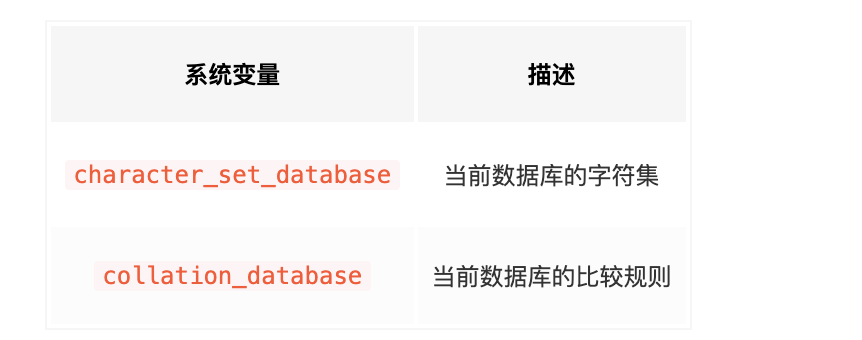
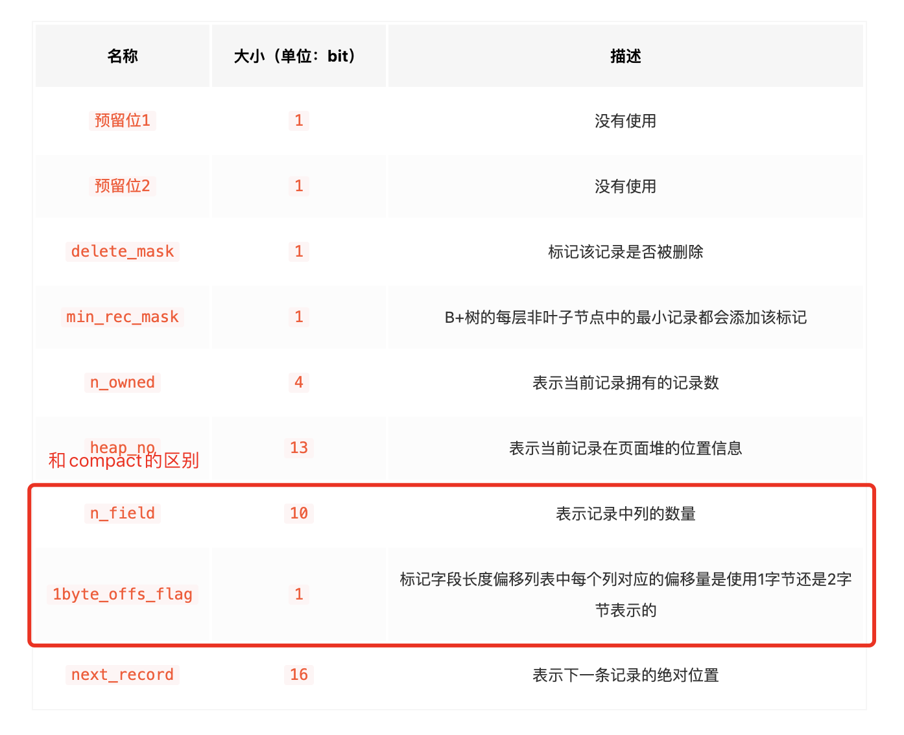

# MySQL的基础设置

## bin目录下MySQL服务器程序

*   ==mysqld== 这个可执行文件就代表着MySQL服务器程序，运行这个可执行文件就可以直接启动一个服务器进程。但这个命令不常用。
*   ==mysqld\_safe== 是一个启动脚本，它会间接的调用mysqld，而且还顺便启动了另外一个监控进程，这个监控进程在服务器进程挂了的时候，可以帮助重启它。另外，使用mysqld\_safe启动服务器程序时，它会将服务器程序的出错信息和其他诊断信息重定向到某个文件中，产生出错日志，这样可以方便我们找出发生错误的原因。
*   mysql.server 也是一个启动脚本，它会间接的调用mysqld\_safe，在调用mysql.server时在后边指定start参数就可以启动服务器程序了。
    ```sql
    mysql.server start
    mysql.server stop
    ```
*   mysqld\_multi 我们一台计算机上也可以运行多个服务器实例，也就是运行多个MySQL服务器进程。mysql\_multi可执行文件可以对每一个服务器进程的启动或停止进行监控。

## 客户端与服务器连接的过程

### 通信方式

#### TCP/IP

真实环境中，数据库服务器进程和客户端进程可能运行在不同的主机中，它们之间必须通过网络来进行通讯。MySQL采用TCP作为服务器和客户端之间的网络通信协议。在网络环境下，每台计算机都有一个唯一的IP地址，如果某个进程有需要采用TCP协议进行网络通信方面的需求，可以向操作系统申请一个端口号，这是一个整数值，它的取值范围是0\~65535。这样在网络中的其他进程就可以通过IP地址 + 端口号的方式来与这个进程连接，这样进程之间就可以通过网络进行通信了。

如果3306端口号已经被别的进程占用了或者我们单纯的想自定义该数据库实例监听的端口号，那我们可以在启动服务器程序的命令行里添加-P参数来明确指定一下端口号，比如这样：

```sql
mysqld -P3307

# 大写P
mysql -h127.0.0.1 -uroot -P3307 -p

```

#### 命名管道和共享内存

如果你是一个Windows用户，那么客户端进程和服务器进程之间可以考虑使用命名管道或共享内存进行通信。不过启用这些通信方式的时候需要在启动服务器程序和客户端程序时添加一些参数：

*   使用命名管道来进行进程间通信
    需要在启动服务器程序的命令中加上--enable-named-pipe参数，然后在启动客户端程序的命令中加入--pipe或者--protocol=pipe参数。
*   使用共享内存来进行进程间通信
    需要在启动服务器程序的命令中加上--shared-memory参数，在成功启动服务器后，共享内存便成为本地客户端程序的默认连接方式，不过我们也可以在启动客户端程序的命令中加入--protocol=memory参数来显式的指定使用共享内存进行通信。

> 使用共享内存的方式进行通信的服务器进程和客户端进程必须在同一台Windows主机中。

#### Unix域套接字文件

如果我们的服务器进程和客户端进程都运行在同一台操作系统为类Unix的机器上的话，我们可以使用Unix域套接字文件来进行进程间通信。如果我们在启动客户端程序的时候指定的主机名为localhost，或者指定了--protocol=socket的启动参数，那服务器程序和客户端程序之间就可以通过Unix域套接字文件来进行通信了。MySQL服务器程序默认监听的Unix域套接字文件路径为/tmp/mysql.sock，客户端程序也默认连接到这个Unix域套接字文件。如果我们想改变这个默认路径，可以在启动服务器程序时指定socket参数，就像这样：

```sql
mysqld --socket=/tmp/a.txt

mysql -hlocalhost -uroot --socket=/tmp/a.txt -p
```

### 服务器处理客户端请求


从图中我们可以看出，服务器程序处理来自客户端的查询请求大致需要经过三个部分，分别是连接管理、解析与优化、存储引擎。

#### 连接管理

每当有一个客户端进程连接到服务器进程时，服务器进程都会创建一个线程来专门处理与这个客户端的交互，当该客户端退出时会与服务器断开连接，服务器并不会立即把与该客户端交互的线程销毁掉，而是把它缓存起来，在另一个新的客户端再进行连接时，把这个缓存的线程分配给该新客户端。这样就起到了不频繁创建和销毁线程的效果，从而节省开销。

在客户端程序发起连接的时候，需要携带主机信息、用户名、密码，服务器程序会对客户端程序提供的这些信息进行认证，如果认证失败，服务器程序会拒绝连接。如果客户端程序和服务器程序不运行在一台计算机上，我们还可以采用使用了==SSL==（安全套接字）的网络连接进行通信，来保证数据传输的安全性。

#### 解析与优化

*   查询缓存
*   语法解析
*   查询优化

##### 查询缓存

查询缓存可以在不同客户端之间共享，也就是说如果客户端A刚刚查询了一个语句，而客户端B之后发送了同样的查询请求，那么客户端B的这次查询就可以直接使用查询缓存中的数据。

如果两个查询请求在任何字符上的不同（例如：空格、注释、大小写），都会导致缓存不会命中。另外，如果查询请求中包含某些系统函数、用户自定义变量和函数、一些系统表，如 mysql 、information\_schema、 performance\_schema 数据库中的表，那这个请求就不会被缓存。比如Now函数，储存了，再拿出来反而不符合要求。

不过既然是缓存，那就有它缓存失效的时候。MySQL的缓存系统会监测涉及到的每张表，只要该表的结构或者数据被修改，如对该表使用了INSERT、 UPDATE、DELETE、TRUNCATE TABLE、ALTER TABLE、DROP TABLE或 DROP DATABASE语句，那使用该表的所有高速缓存查询都将变为无效并从高速缓存中删除！

> 检索，查询请求处理完需要更新查询缓存，维护该查询缓存对应的内存区域。从MySQL 5.7.20开始，不推荐使用查询缓存，并在MySQL 8.0中删除。

##### 语法解析

如果查询缓存没有命中，接下来就需要进入正式的查询阶段了。==MySQL==服务器程序首先要对这段文本做分析，判断请求的语法是否正确，然后从文本中将要查询的表、各种查询条件都提取出来放到MySQL服务器内部使用的一些数据结构上来。

> 这个从指定的文本中提取出我们需要的信息本质上算是一个编译过程，涉及词法解析、语法分析、语义分析等阶段

##### 查询优化

语法解析之后，服务器程序获得到了需要的信息，比如要查询的列是哪些，表是哪个，搜索条件是什么等等。因为我们写的==MySQL==语句执行起来效率可能并不是很高，==MySQL==的优化程序会对我们的语句做一些优化，如外连接转换为内连接、表达式简化、子查询转为连接。优化的结果就是生成一个执行计划，这个执行计划表明了应该使用哪些索引进行查询，表之间的连接顺序是啥样的。我们可以使用EXPLAIN语句来查看某个语句的执行计划。

##### 存储引擎

MySQL服务器把数据的存储和提取操作都封装到了一个叫存储引擎的模块里。我们知道表是由一行一行的记录组成的，但这只是一个逻辑上的概念，物理上如何表示记录，怎么从表中读取数据，怎么把数据写入具体的物理存储器上，这都是存储引擎负责的事情。为了实现不同的功能，MySQL提供了各式各样的存储引擎，不同存储引擎管理的表具体的存储结构可能不同，采用的存取算法也可能不同。

人们把**连接管理、查询缓存、语法解析、查询优化**这些并不涉及真实数据存储的功能划分为MySQL server的功能，把真实存取数据的功能划分为存储引擎的功能。各种不同的存储引擎向上边的==MySQL server==层提供统一的调用接口（也就是存储引擎API），包含了几十个底层函数，像"读取索引第一条内容"、"读取索引下一条内容"、"插入记录"等等。

### 常用存储引擎


> 最常用的就是InnoDB和MyISAM，有时会提一下Memory。其中InnoDB是MySQL默认的存储引擎

### 关于存储引擎的一些操作

**查看当前服务器程序支持的存储引擎**

```sql
查看当前服务器程序支持的存储引擎

SHOW ENGINES;

+--------------------+---------+----------------------------------------------------------------+--------------+------+------------+
| Engine             | Support | Comment                                                        | Transactions | XA   | Savepoints |
+--------------------+---------+----------------------------------------------------------------+--------------+------+------------+
| ARCHIVE            | YES     | Archive storage engine                                         | NO           | NO   | NO         |
| BLACKHOLE          | YES     | /dev/null storage engine (anything you write to it disappears) | NO           | NO   | NO         |
| MRG_MYISAM         | YES     | Collection of identical MyISAM tables                          | NO           | NO   | NO         |
| FEDERATED          | NO      | Federated MySQL storage engine                                 | NULL         | NULL | NULL       |
| MyISAM             | YES     | MyISAM storage engine                                          | NO           | NO   | NO         |
| PERFORMANCE_SCHEMA | YES     | Performance Schema                                             | NO           | NO   | NO         |
| InnoDB             | DEFAULT | Supports transactions, row-level locking, and foreign keys     | YES          | YES  | YES        |
| MEMORY             | YES     | Hash based, stored in memory, useful for temporary tables      | NO           | NO   | NO         |
| CSV                | YES     | CSV storage engine                                             | NO           | NO   | NO         |
+--------------------+---------+----------------------------------------------------------------+--------------+------+------------+
9 rows in set (4.27 sec)
```

> Transactions列代表该存储引擎是否支持事务处理。XA列代表着该存储引擎是否支持分布式事务。Savepoints代表着该存储引擎是否支持部分事务回滚。

### 设置表的存储引擎

**不同的表可以有不同的物理存储结构，不同的提取和写入方式**。

#### 创建表时指定存储引擎

之前创建表的语句都没有指定表的存储引擎，那就会使用默认的存储引擎==InnoDB==

```sql
CREATE TABLE 表名(
    建表语句;
) ENGINE = 存储引擎名称;

CREATE TABLE 表名(
    建表语句;
) ENGINE = 存储引擎名称;

```

#### 修改表的存储引擎

```sql
ALTER TABLE 表名 ENGINE = 存储引擎名称;

mysql> ALTER TABLE engine_demo_table ENGINE = InnoDB;
Query OK, 0 rows affected (0.05 sec)
Records: 0  Duplicates: 0  Warnings: 0

mysql> SHOW CREATE TABLE engine_demo_table\G
*************************** 1. row ***************************
       Table: engine_demo_table
Create Table: CREATE TABLE `engine_demo_table` (
  `i` int(11) DEFAULT NULL
) ENGINE=InnoDB DEFAULT CHARSET=utf8
1 row in set (0.01 sec)
```

## MySQL启动选项和系统变量

### 在命令行上使用选项

如果我们在启动客户端程序时在-h参数后边紧跟服务器的IP地址，这就意味着客户端和服务器之间需要通过TCP/IP网络进行通信。如果我们在启动服务器程序的时候就禁止各客户端使用TCP/IP网络进行通信，可以在启动服务器程序的命令行里添加==skip-networking==启动选项，就像这样：

```sql
mysqld --skip-networking
# 两个单词之间-和_都可以
mysqld --skip_networking
```

如果在创建表的语句中没有显式指定表的存储引擎的话，那就会默认使用InnoDB作为表的存储引擎。如果我们想改变表的默认存储引擎的话，可以这样写启动服务器的命令行：

```sql
mysqld --default-storage-engine=MyISAM
```

启动服务器程序的命令行后边指定启动选项的通用格式就是这样的：

```sql
--启动选项1[=值1] --启动选项2[=值2] ... --启动选项n[=值n]
```

> 使用mysql --help可以看到mysql程序支持的启动选项，mysqld\_safe --help可以看到mysqld\_safe程序支持的启动选项。查看mysqld支持的启动选项有些特别，需要使用mysqld --verbose --help。

### 选项的长形式和短形式


### 配置文件中使用选项

我们把需要设置的启动选项都写在这个配置文件中，每次启动服务器的时候都从这个文件里加载相应的启动选项。

#### 配置文件的路径

##### Windows操作系统的配置文件


*   配置文件可以使用.ini的扩展名，也可以使用.cnf的扩展名。
*   %WINDIR%指的是你机器上Windows目录的位置，通常是C:\WINDOWS
*   BASEDIR指的是MySQL安装目录的路径
*   第四个路径指的是我们在启动程序时可以通过指定defaults-extra-file参数的值来添加额外的配置文件路径
*   %APPDATA%表示Windows应用程序数据目录的值，可以使用下列命令查看：
*   列表中最后一个名为.mylogin.cnf配置文件有点儿特殊，它不是一个纯文本文件（其他的都是纯文本文件），而是使用mysql\_config\_editor实用程序创建的加密文件。文件中只能包含一些用于启动客户端软件时连接服务器的一些选项，包括 host、user、password、port和 socket。而且它只能被客户端程序所使用。

> mysql\_config\_editor实用程序其实是MySQL安装目录下的bin目录下的一个可执行文件，这个实用程序有专用的语法来生成或修改 .mylogin.cnf 文件中的内容

##### 类Unix操作系统中的配置文件

在类UNIX操作系统中，MySQL会按照下列路径来寻找配置文件：


> mysqld\_safe程序处理不了的启动项，会传递给mysqld程序处理。

#### 配置文件的内容

配置文件中的启动选项被划分为若干个组，每个组有一个组名，用中括号\[]扩起来。

```scss
[server]
(具体的启动选项...)

[mysqld]
(具体的启动选项...)

[mysqld_safe]
(具体的启动选项...)

[client]
(具体的启动选项...)

[mysql]
(具体的启动选项...)

[mysqladmin]
(具体的启动选项...)


[server]
option1     #这是option1，该选项不需要选项值
option2 = value2      #这是option2，该选项需要选项值
# 上面等同于下面
--option1 --option2=value2
```

*   \[server]组下边的启动选项将作用于所有的服务器程序。

*   \[client]组下边的启动选项将作用于所有的客户端程序。


> 如果我们想指定mysql.server程序的启动参数，则必须将它们放在配置文件中，而不是放在命令行中。mysql.server仅支持start和stop作为命令行参数。

### 特定MySQL版本的专用选项组

可以定义一个\[mysqld-5.7]的选项组

### 配置文件的优先级

多个配置文件中设置了相同的启动选项，那以最后一个配置文件中的为准。

### 同一个配置文件中多个组的优先级

同一个配置文件中多个组的优先级。

### defaults-file的使用

不让默认有效，可以输入如下命令：

```ini
mysqld --defaults-file=/tmp/myconfig.txt
```

> 注意`defaults-extra-file`和`defaults-file`的区别，使用`defaults-extra-file`可以指定额外的配置文件搜索路径.

### 命令行和配置文件中启动选项的区别

命令行起作用。

### 系统变量

#### 系统变量简介

MySQL服务器程序运行过程中会用到许多影响程序行为的变量，它们被称为MySQL系统变量，比如允许同时连入的客户端数量用系统变量max\_connections表示，表的默认存储引擎用系统变量default\_storage\_engine表示。

大多数的系统变量的值也可以在程序运行过程中修改，而无需停止并重新启动它。

#### 查看系统变量

**因为系统变量太多，需要用匹配模式。**
SHOW VARIABLES \[LIKE 匹配的模式];

```sql
mysql> SHOW VARIABLES like 'max_connections';
+-----------------+-------+
| Variable_name   | Value |
+-----------------+-------+
| max_connections | 151   |
+-----------------+-------+
1 row in set (0.03 sec)
```

#### 设置系统变量

*   通过启动选项设置
    *   通过命令行添加启动选项
    *   通过配置文件添加启动选项
*   服务器程序运行过程中设置

#### 设置不同作用范围的系统变量

==作用范围==分为这两种：

*   ==GLOBAL==：全局变量，影响服务器的整体操作。
*   ==SESSION==：会话变量，影响某个客户端连接的操作。（注：SESSION有个别名叫LOCAL）

**服务器启动时，会初始化全局变量，同时为每个连接维护一个会话变量（默认用全局变量初始化）。**

```ini
# 默认语法
SET [GLOBAL|SESSION] 系统变量名 = 值;
SET [@@(GLOBAL|SESSION).]var_name = XXX;

# 设置全局变量
语句一：SET GLOBAL default_storage_engine = MyISAM;
语句二：SET @@GLOBAL.default_storage_engine = MyISAM;

# 设置局部变量
语句一：SET SESSION default_storage_engine = MyISAM;
语句二：SET @@SESSION.default_storage_engine = MyISAM;
语句三：SET default_storage_engine = MyISAM;
```

#### 查看不同作用范围的系统变量

```ini
# 不写默认查看 session变量
SHOW [GLOBAL|SESSION] VARIABLES [LIKE 匹配的模式];
```

> 如果某个客户端改变了某个系统变量在`GLOBAL`作用范围的值，并不会影响该系统变量在当前已经连接的客户端作用范围为`SESSION`的值，只会影响后续连入的客户端在作用范围为`SESSION`的值。

*   并不是所有系统变量都具有GLOBAL和SESSION的作用范围。
*   有些系统变量是只读的，并不能设置值。

#### 启动选项和系统变量的区别

*   大部分的系统变量都可以被当作启动选项
*   有些系统变量是系统生成不能设置
*   有些启动选项也不是系统变量，比如defaults-file

### 状态变量

==状态变量==是用来显示服务器程序运行状况的，例如已经连接了多少客户端。

```ini
SHOW [GLOBAL|SESSION] STATUS [LIKE 匹配的模式];

mysql> SHOW STATUS LIKE 'thread%';
+-------------------+-------+
| Variable_name     | Value |
+-------------------+-------+
| Threads_cached    | 0     |
| Threads_connected | 1     |
| Threads_created   | 1     |
| Threads_running   | 2     |
+-------------------+-------+
4 rows in set (0.01 sec)
```

## 字符集和比较规则

### 字符集简介

人们抽象出一个==字符集==的概念来描述某个字符范围的编码规则。将字符映射成二进制。

### 比较规则简介

字符集表示字符的范围以及编码规则后，比较两个字符的大小。直接比较这两个字符对应的二进制编码的大小，这种比较规则被称为二进制比较规则。

### 一些重要的字符集

*   ASCII字符集
    共收录128个字符，包括空格、标点符号、数字、大小写字母和一些不可见字符。由于总共才128个字符，所以可以使用1个字节来进行编码，我们看一些字符的编码方式：'L' ->  01001100（十六进制：0x4C，十进制：76）
*   ISO 8859-1字符集
    共收录256个字符，是在ASCII字符集的基础上又扩充了128个西欧常用字符(包括德法两国的字母)，也可以使用1个字节来进行编码。这个字符集也有一个别名latin1。
*   GB2312字符集
    收录了汉字以及拉丁字母、希腊字母、日文平假名及片假名字母、俄语西里尔字母。其中收录汉字6763个，其他文字符号682个。同时这种字符集又兼容ASCII字符集，所以在编码方式上显得有些奇怪：
    *   如果该字符在ASCII字符集中，则采用1字节编码。
    *   否则采用2字节编码。
*   GBK字符集
    GBK字符集只是在收录字符范围上对GB2312字符集作了扩充，编码方式上兼容GB2312。
*   utf8字符集
    这种字符集兼容ASCII字符集，采用变长编码方式，编码一个字符需要使用1～4个字节。

> 这种表示一个字符需要的字节数可能不同的编码方式称为变长编码方式。

### MySQL中支持的字符集和排序规则

*   MySQL中的utf8和utf8mb4
    *   utf8mb3：阉割过的utf8字符集，只使用1～3个字节表示字符。
    *   utf8mb4：正宗的utf8字符集，使用1～4个字节表示字符。

> 在MySQL中utf8是utf8mb3的别名，如果有emoji，要用mb4。

#### 字符集的查看

```sql
SHOW (CHARACTER SET|CHARSET) [LIKE 匹配的模式];

mysql> SHOW CHARSET;
+----------+---------------------------------+---------------------+--------+
| Charset  | Description                     | Default collation   | Maxlen |
+----------+---------------------------------+---------------------+--------+
| armscii8 | ARMSCII-8 Armenian              | armscii8_general_ci |      1 |
| ascii    | US ASCII                        | ascii_general_ci    |      1 |
| big5     | Big5 Traditional Chinese        | big5_chinese_ci     |      2 |
| binary   | Binary pseudo charset           | binary              |      1 |
| cp1250   | Windows Central European        | cp1250_general_ci   |      1 |
| cp1251   | Windows Cyrillic                | cp1251_general_ci   |      1 |
| cp1256   | Windows Arabic                  | cp1256_general_ci   |      1 |
| cp1257   | Windows Baltic                  | cp1257_general_ci   |      1 |
| cp850    | DOS West European               | cp850_general_ci    |      1 |
| cp852    | DOS Central European            | cp852_general_ci    |      1 |
| cp866    | DOS Russian                     | cp866_general_ci    |      1 |
| cp932    | SJIS for Windows Japanese       | cp932_japanese_ci   |      2 |
| dec8     | DEC West European               | dec8_swedish_ci     |      1 |
| eucjpms  | UJIS for Windows Japanese       | eucjpms_japanese_ci |      3 |
| euckr    | EUC-KR Korean                   | euckr_korean_ci     |      2 |
| gb18030  | China National Standard GB18030 | gb18030_chinese_ci  |      4 |
| gb2312   | GB2312 Simplified Chinese       | gb2312_chinese_ci   |      2 |
| gbk      | GBK Simplified Chinese          | gbk_chinese_ci      |      2 |
| geostd8  | GEOSTD8 Georgian                | geostd8_general_ci  |      1 |
| greek    | ISO 8859-7 Greek                | greek_general_ci    |      1 |
| hebrew   | ISO 8859-8 Hebrew               | hebrew_general_ci   |      1 |
| hp8      | HP West European                | hp8_english_ci      |      1 |
| keybcs2  | DOS Kamenicky Czech-Slovak      | keybcs2_general_ci  |      1 |
| koi8r    | KOI8-R Relcom Russian           | koi8r_general_ci    |      1 |
| koi8u    | KOI8-U Ukrainian                | koi8u_general_ci    |      1 |
| latin1   | cp1252 West European            | latin1_swedish_ci   |      1 |
| latin2   | ISO 8859-2 Central European     | latin2_general_ci   |      1 |
| latin5   | ISO 8859-9 Turkish              | latin5_turkish_ci   |      1 |
| latin7   | ISO 8859-13 Baltic              | latin7_general_ci   |      1 |
| macce    | Mac Central European            | macce_general_ci    |      1 |
| macroman | Mac West European               | macroman_general_ci |      1 |
| sjis     | Shift-JIS Japanese              | sjis_japanese_ci    |      2 |
| swe7     | 7bit Swedish                    | swe7_swedish_ci     |      1 |
| tis620   | TIS620 Thai                     | tis620_thai_ci      |      1 |
| ucs2     | UCS-2 Unicode                   | ucs2_general_ci     |      2 |
| ujis     | EUC-JP Japanese                 | ujis_japanese_ci    |      3 |
| utf16    | UTF-16 Unicode                  | utf16_general_ci    |      4 |
| utf16le  | UTF-16LE Unicode                | utf16le_general_ci  |      4 |
| utf32    | UTF-32 Unicode                  | utf32_general_ci    |      4 |
| utf8     | UTF-8 Unicode                   | utf8_general_ci     |      3 |
| utf8mb4  | UTF-8 Unicode                   | utf8mb4_0900_ai_ci  |      4 |
+----------+---------------------------------+---------------------+--------+
41 rows in set (0.01 sec)
```

> Default collation列表示这种字符集中一种默认的比较规则, Maxlen 表示一个字符最多需要几个字节。

#### 比较规则的查看

```sql
SHOW COLLATION [LIKE 匹配的模式];

mysql> SHOW COLLATION LIKE 'utf8\_%';
+--------------------------+---------+-----+---------+----------+---------+
| Collation                | Charset | Id  | Default | Compiled | Sortlen |
+--------------------------+---------+-----+---------+----------+---------+
| utf8_general_ci          | utf8    |  33 | Yes     | Yes      |       1 |
| utf8_bin                 | utf8    |  83 |         | Yes      |       1 |
| utf8_unicode_ci          | utf8    | 192 |         | Yes      |       8 |
| utf8_icelandic_ci        | utf8    | 193 |         | Yes      |       8 |
```

*   比较规则名称以与其关联的字符集的名称开头
*   后边紧跟着该比较规则主要作用于哪种语言，比如utf8\_polish\_ci表示以波兰语的规则比较，utf8\_general\_ci是一种通用的比较规则。
*   名称后缀意味着该比较规则是否区分语言中的重音、大小写啥的
    

#### 字符集和比较规则的应用

*   各级别的字符集和比较规则：
    *   服务器级别
    *   数据库级别
    *   表级别
    *   列级别

##### 服务器级别


```sql
mysql> SHOW VARIABLES LIKE 'character_set_server';
+----------------------+---------+
| Variable_name        | Value   |
+----------------------+---------+
| character_set_server | utf8mb4 |
+----------------------+---------+
1 row in set (0.01 sec)

mysql> SHOW VARIABLES LIKE 'collation_server';
+------------------+--------------------+
| Variable_name    | Value              |
+------------------+--------------------+
| collation_server | utf8mb4_0900_ai_ci |
+------------------+--------------------+
1 row in set (0.00 sec)
```

##### 数据库级别

```sql
CREATE DATABASE 数据库名
    [[DEFAULT] CHARACTER SET 字符集名称]
    [[DEFAULT] COLLATE 比较规则名称];

ALTER DATABASE 数据库名
    [[DEFAULT] CHARACTER SET 字符集名称]
    [[DEFAULT] COLLATE 比较规则名称];
```



> character\_set\_database 和 collation\_database 这两个系统变量是只读的

##### 表级别

```sql
CREATE TABLE 表名 (列的信息)
    [[DEFAULT] CHARACTER SET 字符集名称]
    [COLLATE 比较规则名称]]

ALTER TABLE 表名
    [[DEFAULT] CHARACTER SET 字符集名称]
    [COLLATE 比较规则名称]
```

##### 列级别

同一个表中的不同的列也可以有不同的字符集和比较规则。

```sql
CREATE TABLE 表名(
    列名 字符串类型 [CHARACTER SET 字符集名称] [COLLATE 比较规则名称],
    其他列...
);

ALTER TABLE 表名 MODIFY 列名 字符串类型 [CHARACTER SET 字符集名称] [COLLATE 比较规则名称];
```

#### 仅修改字符集或仅修改比较规则

*   只修改字符集，则比较规则将变为修改后的字符集默认的比较规则。
*   只修改比较规则，则字符集将变为修改后的比较规则对应的字符集。

> 列默认->表默认->数据库默认->服务器默认

### 客户端和服务器通信中的字符集

*   编码和解码使用的字符集不一致会出现乱码，解析不一致。
*   MySQL中从客户端发往服务器的请求伴随着多次的字符串转换（默认utf8）
    
    
*   要保证character\_set\_results和character\_set\_client与客户端的字符集一样。

```sql
SET NAMES 字符集名;
# 上面一条等于下面三条
SET character_set_client = 字符集名;
SET character_set_connection = 字符集名;
SET character_set_results = 字符集名;

# 启动文件可以设置
[client]
default-character-set=utf8
```

#### 比较规则的应用

==比较规则==的作用通常体现比较字符串大小的表达式以及对某个字符串列进行排序中。

# 存储引擎InnoDB

## InnoDB记录结构

### InnoDB页简介

*   处理数据过程发生在内存，存储在硬盘
*   InnoDB将数据划分为若干个页，以页作为磁盘和内存之间交互的基本单位
*   InnoDB中页的大小一般为 16 KB。每次读取和写入最少也是16KB。

### InnoDB行格式

**InnoDB存储引擎设计了四种行格式**，分别是Compact、Redundant、Dynamic和Compressed行格式

#### 指定行格式的语法

```sql
CREATE TABLE 表名 (列的信息) ROW_FORMAT=行格式名称
    
ALTER TABLE 表名 ROW_FORMAT=行格式名称
```

#### COMPACT行格式


一条完整的记录其实可以被分为==记录的额外信息==和==记录的真实数据==两大部分

##### 记录的额外信息

*   ==变长字段长度列表==：如VARCHAR(M)、VARBINARY(M)等存储字节不固定的数据，需要把占用字节也存起来。
    *   真正的数据内容
    *   占用的字节数
        存放在记录的开头部位，按照列的顺序**逆序存放**。M是varchar(M),最多存储的字符数。W是Maxlen列，字符集一个字符最多需要字节数。L是实际存储的字符数，应该小于等于M。
        *   如果M×W <= 255，那么使用1个字节来表示真正字符串占用的字节数。
        *   如果M×W > 255，则分为两种情况：如果L <= 127，则用1个字节来表示真正字符串占用的字节数。如果L > 127，则用2个字节来表示真正字符串占用的字节数。
        *   如果该可变字段允许存储的最大字节数（M×W）超过255字节并且真实存储的字节数（L）超过127字节，则使用2个字节，否则使用1个字节。
        *   值为 NULL 的列的长度是不储存的 。

> InnoDB在读记录的变长字段长度列表时先查看表结构，如果某个变长字段允许存储的最大字节数大于255时，该字节的第一个二进制位作为标志位：如果该字节的第一个位为0，那该字节就是一个单独的字段长度（使用一个字节表示不大于127的二进制的第一个位都为0），如果该字节的第一个位为1，那该字节就是半个字段长度。

> 并不是所有记录都有变长字段长度列表 部分，比方说表中所有的列都不是变长的数据类型的话，这一部分就没有。

*   ==NULL值列表==
    *   统计表中允许存储NULL的列
    *   每个允许存储NULL的列对应一个二进制位，逆序排列，1为NULL
    *   NULL值列表必须用整数个字节的位表示，高位补零
*   ==记录头信息==
    *   由固定的5个字节40位组成。
        
        

##### 记录的真实数据

MySQL会为每个记录默认的添加一些列（也称为隐藏列）


> row\_id在没有自定义主键以及Unique键的情况下才会添加该列

##### CHAR(M)列的存储格式

使用变长字符集时至少占M个字节（utf84 4M个），包括空字符，有效预防内存碎片。

#### Redundant行格式

**`MySQL5.0`之前用的一种行格式**


*   字段长度偏移列表

    *   会把记录中所有列（隐藏列）的长度信息逆序存储
    *   两个相邻数值的差值是各个列值的长度
*   记录头信息

    *   `Redundant`行格式的记录头信息占用`6`字节，`48`个二进制位
    *   
    *   多了`n_field`和`1byte_offs_flag`，没有`record_type`
    *   `1byte_offs_flag`的值是怎么选择的

        *   真实数据占用的字节数不大于127（十六进制`0x7F`，二进制`01111111`），1字节。
        *   真实数据占用的字节数大于127，但不大于32767（十六进制`0x7FFF`，二进制`0111111111111111`），2字节
        *   更大时，会只保留前`768`个字节和20个字节的溢出页面地址
    *   `Redundant`行格式中`NULL`值的处理

        *   将列对应的偏移量值的第一个比特位作为是否为`NULL`的依据，该比特位也可以被称之为`NULL比特位`
        *   解释了为什么只要记录的真实数据大于127（十六进制`0x7F`，二进制`01111111`）时，就采用2个字节来表示一个列对应的偏移量
        *   定长占用空间，变长不占用空间
*   CHAR(M)列的存储格式

    *   不管该列使用的字符集是啥，Mx字符集最多需要字节数

#### 行溢出数据

##### VARCHAR(M)最多能存储的数据

VARCHAR(M)类型的列最多可以占用65535个字节，只是理论上，实际上不行，实际为以下3部分存储空间：

*   真实数据
*   真实数据占用字节的长度
*   NULL值标识，如果该列有NOT NULL属性则可以没有这部分存储空间

> 上述所言在列的值允许为NULL的情况下，ascii最大65532，gbk字符集下M的最大取值就是32766，utf8字符集下M的最大取值就是21844，这都是在表中只有一个字段的情况下说的，一定要记住一个行中的所有列（不包括隐藏列和记录头信息）占用的字节长度加起来不能超过65535个字节！

##### 溢出页

在`Compact`和`Redundant`行格式中，对于占用存储空间非常大的列，在`记录的真实数据`处只会存储该列的一部分数据，把剩余的数据分散存储在几个其他的页中，然后`记录的真实数据`处用20个字节存储指向这些页的地址（当然这20个字节中还包括这些分散在其他页面中的数据的占用的字节数），从而可以找到剩余数据所在的页，如图所示：


> 不只是 ***VARCHAR(M)*** 类型的列，其他的 ***TEXT***、***BLOB*** 类型的列在存储数据非常多的时候也会发生`行溢出`。

#### &#x20;Dynamic和Compressed行格式

这两种行格式类似于`COMPACT行格式`，只不过在处理行溢出数据时有点儿分歧，它们不会在记录的真实数据处存储字符串的前768个字节，而是把所有的字节都存储到其他页面中，只在记录的真实数据处存储其他页面的地址。

另外，`Compressed`行格式会采用压缩算法对页面进行压缩。

## 不同类型的页介绍

**索引页也是数据页**

### 数据页结构的快速浏览

16KB的数据页被分为多个部分，如下：


InnoDB数据页被分为七个部分，占用的字节数，有的确定有的不确定。

| 名称                   | 中文名       | 占用空间大小 | 简单描述         |
| :------------------- | :-------- | :----- | :----------- |
| `File Header`        | 文件头部      | `38`字节 | 页的一些通用信息     |
| `Page Header`        | 页面头部      | `56`字节 | 数据页专有的一些信息   |
| `Infimum + Supremum` | 最小记录和最大记录 | `26`字节 | 两个虚拟的行记录     |
| `User Records`       | 用户记录      | 不确定    | 实际存储的行记录内容   |
| `Free Space`         | 空闲空间      | 不确定    | 页中尚未使用的空间    |
| `Page Directory`     | 页面目录      | 不确定    | 页中的某些记录的相对位置 |
| `File Trailer`       | 文件尾部      | `8`字节  | 校验页是否完整      |

### 记录在页中的存储

存储的记录会将指定的`行格式`存储到`User Records`部分。一开始没有`User Records`这个部分，会从`Free Space`部分申请一个记录大小的空间，当空间被全部申请完后，这个页就使用完了，需要申请新的页。


### 记录头信息的介绍

**占用五个字节的空间。**


| 名称             | 大小（单位：bit） | 描述                                                     |
| :------------- | :--------- | :----------------------------------------------------- |
| `预留位1`         | `1`        | 没有使用                                                   |
| `预留位2`         | `1`        | 没有使用                                                   |
| `delete_mask`  | `1`        | 标记该记录是否被删除                                             |
| `min_rec_mask` | `1`        | B+树的每层非叶子节点中的最小记录都会添加该标记                               |
| `n_owned`      | `4`        | 表示当前记录拥有的记录数                                           |
| `heap_no`      | `13`       | 表示当前记录在记录堆的位置信息                                        |
| `record_type`  | `3`        | 表示当前记录的类型，`0`表示普通记录，`1`表示B+树非叶节点记录，`2`表示最小记录，`3`表示最大记录 |
| `next_record`  | `16`       | 表示下一条记录的相对位置                                           |


*   delete\_mask

&#x9;当前记录是否被删掉。被删除记录不会被立即删除，而是打一个删除标记，组成一个`垃圾链表`，这个链表占用的空间是`可重用空间`，新插入的数据可以覆盖这部分空间。

*   min\_rec\_mask

&#x9;B+树的每层非叶子节点中的最小记录都会添加该标记

*   `heap_no`

&#x9;记录在本页中的位置，从记录2开始，0和1是两条\*\*\*虚拟记录，\*\*\*一个代表最小记录，一个代表最大记录。记录比较的是`主键`的大小。这两条记录由5字节的`记录头信息`和8字节的固定部分组成。	不存放在User Records，存放在`Infimum + Supremum。`

&#x9;


*   record\_type

&#x9;表示当前记录的类型。

*   next\_record

&#x9;记录当前真实记录下一条真实记录的地址偏移量。（指的是主键从小到大的下一条）

&#x9;***Infimum记录（也就是最小记录）*** 的下一条记录就是本页中主键值最小的记录，本页中主键值最大的记录的下一条就是 ***Supremum记录（也就是最大记录）*** 

&#x9;不论我们怎么对页中的记录做增删改操作，InnoDB始终会维护一条记录的单链表，链表中的各个节点是按照主键值由小到大的顺序连接起来的。

&#x9;


> **小贴士：**
>
> 你会不会觉得next\_record这个指针有点儿怪，为啥要指向记录头信息和真实数据之间的位置呢？
>
> 为啥不干脆指向整条记录的开头位置，也就是记录的额外信息开头的位置呢？ 因为这个位置刚刚好，向左读取就是记录头信息，向右读取就是真实数据。我们前边还说过变长字段长度列表、NULL值列表中的信息都是逆序存放，这样可以使记录中位置靠前的字段和它们对应的字段长度信息在内存中的距离更近

### Page Directory（页目录）

类似于字典的目录，制作过程为下面这样：

1.  将正常记录划分为几个组，虚拟记录和未删除的记录。
2.  每个组的最后一条记录（也就是组内最大的那条记录）的头信息中的`n_owned`属性表示该记录拥有多少条记录，也就是该组内共有几条记录。
3.  将每个组的最后一条记录的地址偏移量单独提取出来按顺序存储到靠近`页`的尾部的地方，这个地方就是所谓的`Page Directory`，也就是`页目录。`

    页面目录中的这些地址偏移量被称为`槽`（英文名：`Slot`），所以这个页面目录就是由`槽`组成的。

    比方说现在的`page_demo`表中正常的记录共有6条，`InnoDB`会把它们分成两组，第一组中只有一个最小记录，第二组中是剩余的5条记录，看下边的示意图：

    

    

`InnoDB`的对每个分组中的记录条数是有规定的：最小记录分组只能有 ***1*** 条记录，最大记录分组只能在 ***1\~8*** 条，剩下的分组中记录的条数只能在是 ***4\~8*** 条。所以分组是按照下边的步骤进行的：

*   初始情况下一个数据页里只有最小记录和最大记录两条记录，它们分属于两个分组。
*   之后每插入一条记录，都会从`页目录`中找到主键值比本记录的主键值大并且差值最小的槽，然后把该槽对应的记录的`n_owned`值加1，表示本组内又添加了一条记录，直到该组中的记录数等于8个。
*   在一个组中的记录数等于8个后再插入一条记录时，会将组中的记录拆分成两个组，一个组中4条记录，另一个5条记录。这个过程会在`页目录`中新增一个`槽`来记录这个新增分组中最大的那条记录的偏移量。

在一个数据页中查找指定主键值的记录的过程分为两步：

1.  通过二分法确定该记录所在的槽，并找到该槽所在分组中主键值最小的那条记录。
2.  通过记录的`next_record`属性遍历该槽所在的组中的各个记录。

```


```

### Page Header（页面头部）

一个数据页中存储的记录的状态信息，比如本页中已经存储了多少条记录，第一条记录的地址是什么。56个字节。

| 名称                  | 占用空间大小 | 描述                                                                 |
| :------------------ | :----- | :----------------------------------------------------------------- |
| `PAGE_N_DIR_SLOTS`  | `2`字节  | 在页目录中的槽数量                                                          |
| `PAGE_HEAP_TOP`     | `2`字节  | 还未使用的空间最小地址，也就是说从该地址之后就是`Free Space`                               |
| `PAGE_N_HEAP`       | `2`字节  | 本页中的记录的数量（包括最小和最大记录以及标记为删除的记录）                                     |
| `PAGE_FREE`         | `2`字节  | 第一个已经标记为删除的记录地址（各个已删除的记录通过`next_record`也会组成一个单链表，这个单链表中的记录可以被重新利用） |
| `PAGE_GARBAGE`      | `2`字节  | 已删除记录占用的字节数                                                        |
| `PAGE_LAST_INSERT`  | `2`字节  | 最后插入记录的位置                                                          |
| `PAGE_DIRECTION`    | `2`字节  | 记录插入的方向                                                            |
| `PAGE_N_DIRECTION`  | `2`字节  | 一个方向连续插入的记录数量                                                      |
| `PAGE_N_RECS`       | `2`字节  | 该页中记录的数量（不包括最小和最大记录以及被标记为删除的记录）                                    |
| `PAGE_MAX_TRX_ID`   | `8`字节  | 修改当前页的最大事务ID，该值仅在二级索引中定义                                           |
| `PAGE_LEVEL`        | `2`字节  | 当前页在B+树中所处的层级                                                      |
| `PAGE_INDEX_ID`     | `8`字节  | 索引ID，表示当前页属于哪个索引                                                   |
| `PAGE_BTR_SEG_LEAF` | `10`字节 | B+树叶子段的头部信息，仅在B+树的Root页定义                                          |
| `PAGE_BTR_SEG_TOP`  | `10`字节 | B+树非叶子段的头部信息，仅在B+树的Root页定义                                         |

*   PAGE\_DIRECTION

&#x9;假如新插入的一条记录的主键值比上一条大，这条记录的插入方向是右边，反之则是左边。

*   PAGE\_N\_DIRECTION

&#x9;连续几次插入新记录的方向都是一致的，`InnoDB`会把沿着同一个方向插入记录的条数记下来。

### File Header（文件头部）

`File Header`针对各种类型的页都通用，描述了一些各种页的通用信息。38个字节。

| 名称                                 | 占用空间大小 | 描述                                          |
| :--------------------------------- | :----- | :------------------------------------------ |
| `FIL_PAGE_SPACE_OR_CHKSUM`         | `4`字节  | 页的校验和（checksum值）                            |
| `FIL_PAGE_OFFSET`                  | `4`字节  | 页号                                          |
| `FIL_PAGE_PREV`                    | `4`字节  | 上一个页的页号                                     |
| `FIL_PAGE_NEXT`                    | `4`字节  | 下一个页的页号                                     |
| `FIL_PAGE_LSN`                     | `8`字节  | 页面被最后修改时对应的日志序列位置（英文名是：Log Sequence Number） |
| `FIL_PAGE_TYPE`                    | `2`字节  | 该页的类型                                       |
| `FIL_PAGE_FILE_FLUSH_LSN`          | `8`字节  | 仅在系统表空间的一个页中定义，代表文件至少被刷新到了对应的LSN值           |
| `FIL_PAGE_ARCH_LOG_NO_OR_SPACE_ID` | `4`字节  | 页属于哪个表空间                                    |

*   FIL\_PAGE\_SPACE\_OR\_CHKSUM

&#x9;通过某种算法来计算一个比较短的值来代表这个很长的字节串，这个比较短的值就称为`校验和`。校验和不同肯定字符串不同，省去了直接比较两个比较长的字节串的时间损耗。

*   FIL\_PAGE\_OFFSET

&#x9;唯一确定一个页。

*   FIL\_PAGE\_TYPE

| 类型名称                      | 十六进制   | 描述                |
| :------------------------ | :----- | :---------------- |
| `FIL_PAGE_TYPE_ALLOCATED` | 0x0000 | 最新分配，还没使用         |
| `FIL_PAGE_UNDO_LOG`       | 0x0002 | Undo日志页           |
| `FIL_PAGE_INODE`          | 0x0003 | 段信息节点             |
| `FIL_PAGE_IBUF_FREE_LIST` | 0x0004 | Insert Buffer空闲列表 |
| `FIL_PAGE_IBUF_BITMAP`    | 0x0005 | Insert Buffer位图   |
| `FIL_PAGE_TYPE_SYS`       | 0x0006 | 系统页               |
| `FIL_PAGE_TYPE_TRX_SYS`   | 0x0007 | 事务系统数据            |
| `FIL_PAGE_TYPE_FSP_HDR`   | 0x0008 | 表空间头部信息           |
| `FIL_PAGE_TYPE_XDES`      | 0x0009 | 扩展描述页             |
| `FIL_PAGE_TYPE_BLOB`      | 0x000A | 溢出页               |
| `FIL_PAGE_INDEX`          | 0x45BF | 索引页，也就是我们所说的`数据页` |

*   `FIL_PAGE_PREV`和`FIL_PAGE_NEXT`


### File Trailer

`8`个字节，检测当前页的完整性。

*   前4个字节代表页的校验和

    和`File Header`中的校验和相对应的，修改页从file header开始写，写到后面如果会写入页尾，如果写了一半儿断电了，那么在`File Header`中的校验和就代表着已经修改过的页，而在`File Trailer`中的校验和代表着原先的页，二者不同则意味着同步中间出了错。
*   后4个字节代表页面被最后修改时对应的日志序列位置（LSN）

## B+树索引

### 没有索引的查找

#### 在一个页中查找

假设目前表中的记录比较少，所有的记录都可以被存放到一个页中：

*   以主键为搜索条件 - 在页目录中使用二分法快速定位槽进行查找。
*   以其他列作为搜索条件 - 从最小记录开始一次往上遍历。

#### 在很多页中查找

在很多页中查找记录的话可以分为两个步骤：

1.  定位到记录所在的页。
2.  从所在的页内中查找相应的记录。

> 在没有索引的情况下，只能从第一个页沿着双向链表一直往下找。

### 索引

#### 一个简单的索引方案

为快速定位记录所在的数据页而建立一个别的目录，建这个目录必须完成下边这些事儿：

*   **下一个数据页中用户记录的主键值必须大于上一个页中用户记录的主键值**。通过记录移动的操作来始终保持这个状态，叫做页分裂。
*   **给所有的页建立一个目录项**。

    如果想从这么多页中根据主键值快速定位某些记录所在的页，需要给它们做个目录，每个页对应一个目录项，每个目录项包括下边两个部分：

    *   页的用户记录中最小的主键值，我们用`key`来表示。
    *   页号，我们用`page_no`表示。
*   查找过程分为两步：

    *   二分找到记录所在页
    *   在页中定位具体的记录

    


#### InnoDB中的索引方案

上边之所以称为一个简易的索引方案，是因为我们为了在根据主键值进行查找时使用二分法快速定位具体的目录项而假设所有目录项都可以在物理存储器上连续存储，但是这样做有几个问题：

*   `InnoDB`是使用页来作为管理存储空间的基本单位，也就是最多能保证`16KB`的连续存储空间，而随着表中记录数量的增多，需要非常大的连续的存储空间才能把所有的目录项都放下，这对记录数量非常多的表是不现实的。
*   我们时常会对记录进行增删，假设我们把`页28`中的记录都删除了，`页28`也就没有存在的必要了，那意味着`目录项2`也就没有存在的必要了，这就需要把`目录项2`后的目录项都向前移动一下，非常耗费时间。

`目录项`和用户记录差不多，`目录项`中的两个列是`主键`和`页号`，复用了之前存储用户记录的数据页来存储目录项，同时使用`record_type`来进行区分用户记录和目录项记录。

*   0：普通的用户记录
*   1：目录项记录
*   2：最小记录
*   3：最大记录


> 只有在存储目录项记录的页中的主键值最小的目录项记录的min\_rec\_mask值为1，其他别的记录的min\_rec\_mask值都是0。

根据某个主键值去查找记录的步骤就可以大致拆分成下边两步：&#x20;

1.  先到存储`目录项记录`的页，二分查找快速定位对应目录项。
2.  再到存储用户记录的页中二分查找主键值的用户记录。

当目录项记录超过1个页时，会重新分配一个新的页。

根据某个主键值去查找记录的步骤就变为三步：

1.  确定`目录项记录`页-根据min\_rec\_mask定位页
2.  通过`目录项记录`页确定用户记录真实所在的页。
3.  在真实存储用户记录的页中定位到具体的记录。

**假如目录项记录的页非常多怎么办？同时他们是不连续的，那么我们就再生成一个目录。**


> 这就是B+树，既存放用户记录的数据页，还存放目录项记录的数据页。
>
> 一般情况下，我们用到的`B+`树都不会超过4层，那我们通过主键值去查找某条记录最多只需要做4个页面内的查找（查找3个目录项页和一个用户记录页），又因为在每个页面内有所谓的`Page Directory`（页目录），所以在页面内也可以通过二分法实现快速定位记录。

#### 聚簇索引

`B+`树有两个特点：

1.  使用记录主键值的大小进行记录和页的排序，这包括三个方面的含义：

    *   页内的记录是按照主键的大小顺序排成一个单向链表。
    *   各个存放用户记录的页也是根据页中用户记录的主键大小顺序排成一个双向链表。
    *   存放目录项记录的页分为不同的层次，在同一层次中的页也是根据页中目录项记录的主键大小顺序排成一个双向链表。
2.  `B+`树的叶子节点存储的是完整的用户记录。

具有这两种特性的`B+`树称为`聚簇索引`，所有完整的用户记录都存放在这个`聚簇索引`的叶子节点处。

> `聚簇索引`并不需要我们在`MySQL`语句中显式的使用`INDEX`语句去创建。`InnoDB`存储引擎会自动的为我们创建聚簇索引。数据即索引，索引即数据。

#### 二级索引

`聚簇索引`只能在搜索条件是主键值时才能发挥作用，因为`B+`树中的数据都是按照主键进行排序的。可以多建几棵`B+`树，不同的`B+`树中的数据采用不同的排序规则。

*   `B+`树的叶子节点存储的并不是完整的用户记录，而只是`c2列+主键`这两个列的值。
*   目录项记录中不再是`主键+页号`的搭配，而变成了`c2列+页号`的搭配。

用二级索引查找过程：

1.  确定`目录项记录`页
2.  通过`目录项记录`页确定用户记录真实所在的页。
3.  在真实存储用户记录的页中定位到具体的记录。
4.  这个`B+`树的叶子节点中的记录只存储了`c2`和`c1`（也就是`主键`）两个列，所以我们必须再根据主键值去聚簇索引中再查找一遍完整的用户记录。

#### 联合索引

同时以多个列的大小作为排序规则。先根据A排序，A相等根据B排序。联合索引也是二级索引，也是B+树。

### InnoDB的B+树索引的注意事项

*   一个B+树索引的根节点自诞生之日起，便不会再移动。会被记录在某个地方，每次用再取出来。当数据加多时会复制给新页，进行页分裂。
*   内节点中目录项记录的唯一性。—需要保证在B+树的同一层内节点的目录项记录除`页号`这个字段以外是唯一的。二级索引的目录项实际是：索引列+主键值+页号
*   `InnoDB`的一个数据页至少可以存放两条记录

### MyISAM中的索引方案简单介绍

`MyISAM`的索引方案也是B+树，将索引和数据***分开存储。***

*   将表中的记录按照记录的插入顺序单独存储在一个文件中，称之为`数据文件`。我们可以通过行号而快速访问到一条记录。
*   使用`MyISAM`存储引擎的表会把索引信息另外存储到一个称为`索引文件`的另一个文件中。`MyISAM`会单独为表的主键创建一个索引，`主键值 + 行号`的组合。

> `MyISAM`中建立的索引相当于全部都是`二级索引`！

### MySQL创建和删除索引的语句

```sql
CREATE TALBE 表名 (
    各种列的信息 ··· , 
    [KEY|INDEX] 索引名 (需要被索引的单个列或多个列)
)

ALTER TABLE 表名 ADD [INDEX|KEY] 索引名 (需要被索引的单个列或多个列);

ALTER TABLE 表名 DROP [INDEX|KEY] 索引名;

CREATE TABLE index_demo(
    c1 INT,
    c2 INT,
    c3 CHAR(1),
    PRIMARY KEY(c1),
    INDEX idx_c2_c3 (c2, c3)
);
```

> key和index是同义词

## B+树索引的使用

### 索引的代价

*   空间上的代价 - B树的每一个节点都是一个数据页16KB
*   时间上的代价 - 进行增、删、改操作时，都需要去修改各个`B+`树索引。

> 一个表上索引建的越多，就会占用越多的存储空间，在增删改记录的时候性能就越差。

### B+树索引适用的条件

#### 全值匹配

**搜索条件中的列和索引列一致的话，这种情况就称为全值匹配。**

> 搜索条件中的列的顺序是没影响的，因为有查询优化器。

#### 匹配最左边的列

**搜索语句中可以不用包含全部联合索引中的列，只包含左边的一个或多个列。**

> 如果搜索条件中有左边的有右边的没有中间的，那么只会调用左边的索引。

#### 匹配列前缀

以`'As'`开头的记录，可以匹配左边的字符串索引。

```sql
SELECT * FROM person_info WHERE name LIKE 'As%';
```

> '%As%' 和 '%com' 后缀匹配是无法调用索引的，所以如果想要后缀匹配调用索引，需要将其转变为前缀索引，数据倒着存入数据库。

#### 匹配范围值

对于索引进行范围的匹配。如果对多个列同时进行范围查找的话，只有对索引最左边的那个列进行范围查找的时候才能用到`B+`树索引

#### 精确匹配某一列并范围匹配另外一列

精确匹配左边的，然后左边的右边一列可以范围匹配。

#### 用于排序和分组

如果排序和分组是索引就不用在内容进行快速排序了。

#### 使用联合索引进行排序注意事项

*   `ORDER BY`的子句后边的列的顺序也必须按照索引列的顺序
*   `ORDER BY`索引左边的列的形式可以使用部分的`B+`树索引

### 不可以使用索引进行排序的几种情况

*   ASC、DESC混用
*   排序列包含非同一个索引的列
*   排序列使用了复杂的表达式——用函数修饰过

### 回表的代价

如果二级索引有90%多的`id`值需要回表，还不如直接去扫描聚簇索引（也就是全表扫描）。

> 查询优化器会事先对表中的记录计算一些统计数据，然后再利用这些统计数据根据查询的条件来计算一下需要回表的记录数，需要回表的记录数越多，就越倾向于使用全表扫描，反之倾向于使用`二级索引 + 回表`的方式。

### 覆盖索引

为了彻底告别`回表`操作带来的性能损耗，我们建议：最好在查询列表里只包含索引列，这样可以不用回表。

### 建立索引的建议

*   最好为那些列的基数大（数据不重复）的列建立索引
*   索引列的类型尽量小，主键也是
*   索引字符串值的前缀—只索引字符串前几个字符
*   让索引列在比较表达式中单独出现
*   主键按顺序插入
*   减少冗余和重复索引

## MySQL的数据目录

MySQL服务器程序在启动时会到文件系统的某个目录下加载一些文件，之后在运行过程中产生的数据也都会存储到这个目录下的某些文件中，这个目录就称为`数据目录。`

```sql
mysql>  SHOW VARIABLES LIKE 'datadir';
+---------------+------------------------+
| Variable_name | Value                  |
+---------------+------------------------+
| datadir       | /usr/local/mysql/data/ |
+---------------+------------------------+
1 row in set (0.01 sec)
```

### 数据库在文件系统中的表示

新建一个数据库时，`MySQL`会帮我们做这两件事儿：

1.  在`数据目录`下创建一个和数据库名同名的子目录（或者说是文件夹）。
2.  在该与数据库名同名的子目录下创建一个名为`db.opt`的文件，这个文件中包含了该数据库的各种属性，比方说该数据库的字符集和比较规则。

### 表在文件系统中的表示

每个表的信息其实可以分为两种：

1.  表结构的定义 - 表名.frm 二进制文件
2.  表中的数据 - `表空间`或者`文件空间`（英文名：`table space`或者`file space`）

#### 系统表空间（system tablespace）

默认情况下，`InnoDB`会在`数据目录`下创建一个名为`ibdata1，`大小为`12M`的**自扩展文件。**

这个文件就是对应的`系统表空间`在文件系统上的表示。可以对应多个文件。

```sql
[server]
innodb_data_file_path=data1:512M;data2:512M:autoextend
```

#### 独立表空间(file-per-table tablespace)

在MySQL5.6.6以及之后的版本中，`InnoDB`并不会默认的把各个表的数据存储到系统表空间中，而是为每一个表建立一个独立表空间，在所属子目录下创建了一个如下的文件：

```sql
表名.ibd

# 可以自己指定使用系统表空间还是独立表空间来存储数据 0是系统表空间，1是独立表空间，只对新建表起作用。
[server]
innodb_file_per_table=0

# 系统表空间中的表转移到独立表空间
ALTER TABLE 表名 TABLESPACE [=] innodb_file_per_table;
# 独立表空间中的表转移到系统表空间
ALTER TABLE 表名 TABLESPACE [=] innodb_system;
```

#### 其他类型的表空间

通用表空间（general tablespace）、undo表空间（undo tablespace）、临时表空间（temporary tablespace）

### MyISAM是如何存储表数据的

`MyISAM`并没有什么所谓的`表空间`一说，表数据都存放到对应的数据库子目录下。（数据和索引是分开的）

    test.frm
    test.MYD # 数据文件
    test.MYI # 索引文件

### 视图在文件系统中的表示

视图是虚拟的表，就是某个查询语句的一个别名。不需要存储真实的数据和表一样，在目录下存储一个`视图名.frm`的文件。

### 其他的文件

*   服务器进程文件。

    `MySQL`服务器会把自己的进程ID写入到一个文件中。
*   服务器日志文件。
*   默认/自动生成的SSL和RSA证书和密钥文件。

### &#x20;文件系统对数据库的影响

*   数据库名称和表名称不得超过文件系统所允许的最大长度。
*   特殊字符的问题
*   文件长度受文件系统最大长度限制

### MySQL系统数据库简介

这几个数据库包含了MySQL服务器运行过程中所需的一些信息以及一些运行状态信息

*   mysql

    存储了MySQL的用户账户和权限信息，一些存储过程、事件的定义信息，一些运行过程中产生的日志信息，一些帮助信息以及时区信息等。
*   information\_schema

    MySQL服务器维护的所有其他数据库的信息，比如有哪些表、哪些视图、哪些触发器、哪些列。不是真实的用户数据，是描述性信息，元数据。
*   performance\_schema

    对MySQL服务器的一个性能监控。包括统计最近执行了哪些语句，在执行过程的每个阶段都花费了多长时间，内存的使用情况等等信息。
*   sys

    通过视图的形式把`information_schema `和`performance_schema`结合起来

## InnoDB表空间

对于系统表空间来说，对应着文件系统中一个或多个实际文件；对于每个独立表空间来说，对应着文件系统中一个名为`表名.ibd`的实际文件。

可以把表空间想象成被切分为许许多多个`页`的池子，当我们想为某个表插入一条记录的时候，就从池子中捞出一个对应的页来把数据写进去。

### 页面通用部分


*   `File Header`：记录页面的一些通用信息

*   `File Trailer`：校验页是否完整，保证从内存到磁盘刷新时内容的一致性。

*   表空间中的每一个页都对应着一个页号，也就是`FIL_PAGE_OFFSET`，这个页号由4个字节组成，也就是32个比特位，所以一个表空间最多可以拥有2³²个页，如果按照页的默认大小16KB来算，一个表空间最多支持64TB的数据。表空间的第一个页的页号为0，之后的页号分别是1，2，3...依此类推

### 独立表空间结构

#### 区（extent）的概念

对于16KB的页来说，连续的64个页就是一个`区`，也就是说一个区默认占用1MB空间大小。不论是系统表空间还是独立表空间，都可以看成是由若干个区组成的，每256个区被划分成一组。画个图表示就是这样：


这些组的头几个页面的类型都是类似的，就像这样：


*   第一个组最开始的3个页面的类型是固定的，也就是说`extent 0`这个区最开始的3个页面的类型是固定的，分别是：

    *   `FSP_HDR`类型：这个类型的页面是用来登记整个表空间的一些整体属性以及本组所有的`区`，也就是`extent 0` \~ `extent 255`这256个区的属性，一个表空间只有一个FSP\_HDR.
    *   `IBUF_BITMAP`类型：这个类型的页面是存储本组所有的区的所有页面关于`INSERT BUFFER`的信息。
    *   `INODE`类型：这个类型的页面存储了许多称为`INODE`的数据结构。
*   其余各组最开始的2个页面的类型是固定的，也就是说`extent 256`、`extent 512`这些区。

    *   `XDES`类型：全称是`extent descriptor`，用来登记本组256个区的属性，和`FSP_HDR`类型的页面的作用类似，只不过`FSP_HDR`类型的页面还会额外存储一些表空间的属性。
    *   `IBUF_BITMAP`类型

### 段（segment）的概念

如果链表中相邻的两个页物理位置离得非常远，就是所谓的`随机I/O`。`随机I/O`是非常慢的，所以我们应该尽量让链表中相邻的页的物理位置也相邻，这样进行范围查询的时候才可以使用所谓的`顺序I/O`。

所以才引入了`区`（`extent`）的概念，一个区就是在物理位置上连续的64个页。在表中数据量大的时候，为某个索引分配空间的时候就不再按照页为单位分配了，而是按照`区`为单位分配，甚至在表中的数据十分非常特别多的时候，可以一次性分配多个连续的区。**从性能角度看，可以消除很多的随机`I/O。`**

存放叶子节点的区的集合就算是一个`段`（`segment`），存放非叶子节点的区的集合也算是一个`段`。也就是说一个索引会生成2个段，一个叶子节点段，一个非叶子节点段。

默认情况下一个使用`InnoDB`存储引擎的表只有一个聚簇索引，一个索引会生成2个段，而段是以区为单位申请存储空间的，一个区默认占用1M存储空间，所以默认情况下一个只存了几条记录的小表也需要2M的存储空间么？这样比较浪费空间。

`InnoDB`提出了一个碎片（fragment）区的概念，也就是在一个碎片区中，并不是所有的页都是为了存储同一个段的数据而存在的，而是碎片区中的页可以用于不同的目的，比如有些页用于段A，有些页用于段B，有些页甚至哪个段都不属于。碎片区直属于表空间，并不属于任何一个段。所以此后为某个段分配存储空间的策略是这样的：

*   在刚开始向表中插入数据的时候，段是从某个碎片区以单个页面为单位来分配存储空间的。
*   当某个段已经占用了32个碎片区页面之后，就会以完整的区为单位来分配存储空间。

### 区的分类

| 状态名         | 含义         |
| :---------- | :--------- |
| `FREE`      | 空闲的区       |
| `FREE_FRAG` | 有剩余空间的碎片区  |
| `FULL_FRAG` | 没有剩余空间的碎片区 |
| `FSEG`      | 附属于某个段的区   |

> *   附属于某个段的区。每一个索引都可以分为叶子节点段和非叶子节点段，除此之外InnoDB还会另外定义一些特殊作用的段，在这些段中的数据量很大时将使用区来作为基本的分配单位。
> *   如果把表空间比作是一个集团军，段就相当于师，区就相当于团。一般的团都是隶属于某个师的，就像是处于\`FSEG\`的区全都隶属于某个段，而处于\`FREE\`、\`FREE\_FRAG\`以及\`FULL\_FRAG\`这三种状态的区却直接隶属于表空间，就像独立团直接听命于军部一样。

为了方便管理这些区，设计了一个称为`XDES Entry`的结构（全称就是Extent Descriptor Entry），每一个区都对应着一个`XDES Entry`结构，这个结构记录了对应的区的一些属性。


`XDES Entry`是一个40个字节的结构，大致分为4个部分，各个部分的释义如下：

*   `Segment ID`（8字节）

    每一个段都有一个唯一的编号，用ID表示，此处的`Segment ID`字段表示就是该区所在的段。当然前提是该区已经被分配给某个段了，不然的话该字段的值没啥意义。
*   `List Node`（12字节）

    这个部分可以将若干个`XDES Entry`结构串联成一个链表。

    
*   `State`（4字节）

    这个字段表明区的状态。可选的值就是我们前边说过的那4个，分别是：`FREE`、`FREE_FRAG`、`FULL_FRAG`和`FSEG`。
*   `Page State Bitmap`（16字节）

    这个部分共占用16个字节，也就是128个比特位。我们说一个区默认有64个页，这128个比特位被划分为64个部分，每个部分2个比特位，对应区中的一个页。这两个比特位的第一个位表示对应的页是否是空闲的，第二个比特位还没有用。

#### XDES Entry链表

上面这么多概念的初心仅仅是想提高向表插入数据的效率又不至于数据量少的表浪费空间。

回到最初的起点，捋一捋向某个段中插入数据的过程：

*   当段中数据较少的时候，首先会查看表空间中是否有状态为`FREE_FRAG`的区，也就是找还有空闲空间的碎片区，如果找到了，那么从该区中取一些零散的页把数据插进去；否则到表空间下申请一个状态为`FREE`的区，也就是空闲的区，把该区的状态变为`FREE_FRAG`，然后从该新申请的区中取一些零散的页把数据插进去。之后不同的段使用零散页的时候都会从该区中取，直到该区中没有空闲空间，然后该区的状态就变成了`FULL_FRAG`。
*   现在的问题是你怎么知道表空间里的哪些区是`FREE`的，哪些区的状态是`FREE_FRAG`的，哪些区是`FULL_FRAG`的？

    *   把状态为`FREE`的区对应的`XDES Entry`结构通过`List Node`来连接成一个链表，这个链表我们就称之为`FREE`链表。
    *   把状态为`FREE_FRAG`的区对应的`XDES Entry`结构通过`List Node`来连接成一个链表，这个链表我们就称之为`FREE_FRAG`链表。
    *   把状态为`FULL_FRAG`的区对应的`XDES Entry`结构通过`List Node`来连接成一个链表，这个链表我们就称之为`FULL_FRAG`链表。
*   当段中数据已经占满了32个零散的页后，就直接申请完整的区来插入数据了。

    设计`InnoDB`的大叔们为每个段中的区对应的`XDES Entry`结构建立了三个链表：

    *   `FREE`链表：同一个段中，所有页面都是空闲的区对应的`XDES Entry`结构会被加入到这个链表。注意和直属于表空间的`FREE`链表区别开了，此处的`FREE`链表是附属于某个段的。
    *   `NOT_FULL`链表：同一个段中，仍有空闲空间的区对应的`XDES Entry`结构会被加入到这个链表。
    *   `FULL`链表：同一个段中，已经没有空闲空间的区对应的`XDES Entry`结构会被加入到这个链表。

```sql
CREATE TABLE t (
    c1 INT NOT NULL AUTO_INCREMENT,
    c2 VARCHAR(100),
    c3 VARCHAR(100),
    PRIMARY KEY (c1),
    KEY idx_c2 (c2)
)ENGINE=InnoDB;
```

这个表`t`共有两个索引，一个聚簇索引，一个二级索引`idx_c2`，所以这个表共有4个段，每个段都会维护上述3个链表，总共是12个链表，加上我们上边说过的直属于表空间的3个链表，整个独立表空间共需要维护15个链表。所以段在数据量比较大时插入数据的话，会先获取`NOT_FULL`链表的头节点，直接把数据插入这个头节点对应的区中即可，如果该区的空间已经被用完，就把该节点移到`FULL`链表中。

#### 链表基节点

怎么找到某个链表的头节点或者尾节点在表空间中的位置呢？设计`InnoDB`的大叔当然考虑了这个问题，他们设计了一个叫`List Base Node`的结构，翻译成中文就是链表的基节点。


*   `List Length`表明该链表一共有多少节点
*   `First Node Page Number`和`First Node Offset`表明该链表的头节点在表空间中的位置。
*   `Last Node Page Number`和`Last Node Offset`表明该链表的尾节点在表空间中的位置。

> 一般我们把某个链表对应的`List Base Node`结构放置在表空间中固定的位置

#### 链表小结

综上所述，表空间是由若干个区组成的，每个区都对应一个`XDES Entry`的结构，直属于表空间的区对应的`XDES Entry`结构可以分成`FREE`、`FREE_FRAG`和`FULL_FRAG`这3个链表；每个段可以附属若干个区，每个段中的区对应的`XDES Entry`结构可以分成`FREE`、`NOT_FULL`和`FULL`这3个链表。每个链表都对应一个`List Base Node`的结构，这个结构里记录了链表的头、尾节点的位置以及该链表中包含的节点数。

### 段的结构

段其实不对应表空间中某一个连续的物理区域，而是一个逻辑上的概念，由若干个零散的页面以及一些完整的区组成。像每个区都有对应的`XDES Entry`来记录这个区中的属性一样，设计`InnoDB`的大叔为每个段都定义了一个`INODE Entry`结构来记录一下段中的属性。


*   Segment ID - 指这个`INODE Entry`结构对应的段的编号（ID）。
*   NOT\_FULL\_N\_USED - 指的是在`NOT_FULL`链表中已经使用了多少个页面。
*   3个`List Base Node - `分别为段的`FREE`链表、`NOT_FULL`链表、`FULL`链表定义了`List Base Node`
*   `Magic Number `- 用来标记这个`INODE Entry`是否已经被初始化（97937874表示已经初始化）
*   `Fragment Array Entry - `每个`Fragment Array Entry`结构都对应着一个零散的页面，这个结构一共4个字节，表示一个零散页面的页号。

### 各类型页面详细情况

#### `FSP_HDR`类型

第一个组的第一个页面，页号为0，存储了表空间的一些整体属性以及第一个组内256个区的对应的`XDES Entry`结构，直接看这个类型的页面的示意图：


| 名称                  | 中文名    | 占用空间大小    | 简单描述             |
| :------------------ | :----- | :-------- | :--------------- |
| `File Header`       | 文件头部   | `38`字节    | 页的一些通用信息         |
| `File Space Header` | 表空间头部  | `112`字节   | 表空间的一些整体属性信息     |
| `XDES Entry`        | 区描述信息  | `10240`字节 | 存储本组256个区对应的属性信息 |
| `Empty Space`       | 尚未使用空间 | `5986`字节  | 用于页结构的填充，没啥实际意义  |
| `File Trailer`      | 文件尾部   | `8`字节     | 校验页是否完整          |

##### File Space Header部分


| 名称                                        | 占用空间大小 | 描述                                                 |
| :---------------------------------------- | :----- | :------------------------------------------------- |
| `Space ID`                                | `4`字节  | 表空间的ID                                             |
| `Not Used`                                | `4`字节  | 这4个字节未被使用，可以忽略                                     |
| `Size`                                    | `4`字节  | 当前表空间占有的页面数                                        |
| `FREE Limit`                              | `4`字节  | 尚未被初始化的最小页号，大于或等于这个页号的区对应的XDES Entry结构都没有被加入FREE链表 |
| `Space Flags`                             | `4`字节  | 表空间的一些占用存储空间比较小的属性                                 |
| `FRAG_N_USED`                             | `4`字节  | FREE\_FRAG链表中已使用的页面数量                              |
| `List Base Node for FREE List`            | `16`字节 | FREE链表的基节点                                         |
| `List Base Node for FREE_FRAG List`       | `16`字节 | FREE\_FRAG链表的基节点                                   |
| `List Base Node for FULL_FRAG List`       | `16`字节 | FULL\_FRAG链表的基节点                                   |
| `Next Unused Segment ID`                  | `8`字节  | 当前表空间中下一个未使用的 Segment ID                           |
| `List Base Node for SEG_INODES_FULL List` | `16`字节 | SEG\_INODES\_FULL链表的基节点                            |
| `List Base Node for SEG_INODES_FREE List` | `16`字节 | SEG\_INODES\_FREE链表的基节点                            |

*   `List Base Node for FREE List`、`List Base Node for FREE_FRAG List`、`List Base Node for FULL_FRAG List`。

    分别是直属于表空间的`FREE`链表的基节点、`FREE_FRAG`链表的基节点、`FULL_FRAG`链表的基节点，这三个链表的基节点在表空间的位置是固定的，就是在表空间的第一个页面（也就是`FSP_HDR`类型的页面）的`File Space Header`部分。
*   FREE Limit

    啥时候用到啥时候初始化，在该字段表示的页号之前的区都被初始化了，之后的区尚未被初始化。
*   Space Flags

    表空间对于一些布尔类型的属性，或者只需要寥寥几个比特位搞定的属性都放在了这个`Space Flags`中存储，虽然它只有4个字节，32个比特位大小，却存储了好多表空间的属性，详细情况如下表：

    | 标志名称            | 占用的空间（单位：bit） | 描述                     |
    | :-------------- | :------------ | :--------------------- |
    | `POST_ANTELOPE` | 1             | 表示文件格式是否大于`ANTELOPE`   |
    | `ZIP_SSIZE`     | 4             | 表示压缩页面的大小              |
    | `ATOMIC_BLOBS`  | 1             | 表示是否自动把值非常长的字段放到BLOB页里 |
    | `PAGE_SSIZE`    | 4             | 页面大小                   |
    | `DATA_DIR`      | 1             | 表示表空间是否是从默认的数据目录中获取的   |
    | `SHARED`        | 1             | 是否为共享表空间               |
    | `TEMPORARY`     | 1             | 是否为临时表空间               |
    | `ENCRYPTION`    | 1             | 表空间是否加密                |
    | `UNUSED`        | 18            | 没有使用到的比特位              |
*   `List Base Node for SEG_INODES_FULL List`和`List Base Node for SEG_INODES_FREE List`

    每个段对应的`INODE Entry`结构会集中存放到一个类型为`INODE`的页中，如果表空间中的段特别多，则会有多个`INODE Entry`结构，可能一个页放不下，这些`INODE`类型的页会组成两种列表：

    *   `SEG_INODES_FULL`链表，该链表中的`INODE`类型的页面都已经被`INODE Entry`结构填充满了，没空闲空间存放额外的`INODE Entry`了。
    *   `SEG_INODES_FREE`链表，该链表中的`INODE`类型的页面仍有空闲空间来存放`INODE Entry`结构。&#x9;

##### XDES Entry部分

把256个区划分成一组，在每组的第一个页面中存放256个`XDES Entry`结构。

在区的数量非常多时，一个单独的页可能就不够存放足够多的`XDES Entry`结构，所以我们把表空间的区分为了若干个组，每组开头的一个页面记录着本组内所有的区对应的`XDES Entry`结构。


> 与`FSP_HDR`类型的页面对比，除了少了`File Space Header`部分之外，其余的部分是一样一样的。

#### `IBUF_BITMAP`类型

这种类型的页里边记录了一些有关`Change Buffer`的东西。

#### `INODE`类型

每个段拥有一个`INODE Entry`结构


| 名称                              | 中文名    | 占用空间大小    | 简单描述                       |
| :------------------------------ | :----- | :-------- | :------------------------- |
| `File Header`                   | 文件头部   | `38`字节    | 页的一些通用信息                   |
| `List Node for INODE Page List` | 通用链表节点 | `12`字节    | 存储上一个INODE页面和下一个INODE页面的指针 |
| `INODE Entry`                   | 段描述信息  | `16320`字节 |                            |
| `Empty Space`                   | 尚未使用空间 | `6`字节     | 用于页结构的填充，没啥实际意义            |
| `File Trailer`                  | 文件尾部   | `8`字节     | 校验页是否完整                    |

`List Node for INODE Page List`这个玩意儿，因为一个表空间中可能存在超过85个段，所以可能一个`INODE`类型的页面不足以存储所有的段对应的`INODE Entry`结构，所以就需要额外的`INODE`类型的页面来存储这些结构。还是为了方便管理这些`INODE`类型的页面，设计`InnoDB`的大叔们将这些`INODE`类型的页面串联成两个不同的链表：

*   `SEG_INODES_FULL`链表：该链表中的`INODE`类型的页面中已经没有空闲空间来存储额外的`INODE Entry`结构了。
*   `SEG_INODES_FREE`链表：该链表中的`INODE`类型的页面中还有空闲空间来存储额外的`INODE Entry`结构了。

这两个链表的基节点就存储在`File Space Header`里边，也就是说这两个链表的基节点的位置是固定的，所以我们可以很轻松的访问到这两个链表。以后每当我们新创建一个段（创建索引时就会创建段）时，都会创建一个`INODE Entry`结构与之对应，存储`INODE Entry`的大致过程就是这样的：

*   先看看`SEG_INODES_FREE`链表是否为空，如果不为空，直接从该链表中获取一个节点，也就相当于获取到一个仍有空闲空间的`INODE`类型的页面，然后把该`INODE Entry`结构放到该页面中。当该页面中无剩余空间时，就把该页放到`SEG_INODES_FULL`链表中。
*   如果`SEG_INODES_FREE`链表为空，则需要从表空间的`FREE_FRAG`链表中申请一个页面，修改该页面的类型为`INODE`，把该页面放到`SEG_INODES_FREE`链表中，与此同时把该`INODE Entry`结构放入该页面。

### Segment Header 结构的运用

我们知道一个索引会产生两个段，分别是叶子节点段和非叶子节点段，而每个段都会对应一个`INODE Entry`结构，那我们怎么知道某个段对应哪个`INODE Entry`结构呢？所以得找个地方记下来这个对应关系。希望你还记得我们在唠叨数据页，也就是`INDEX`类型的页时有一个`Page Header`部分，当然我不能指望你记住，所以把`Page Header`部分再抄一遍给你看：

| 名称                  | 占用空间大小 | 描述                      |
| :------------------ | :----- | :---------------------- |
| ...                 | ...    | ...                     |
| `PAGE_BTR_SEG_LEAF` | `10`字节 | B+树叶子段的头部信息，仅在B+树的根页定义  |
| `PAGE_BTR_SEG_TOP`  | `10`字节 | B+树非叶子段的头部信息，仅在B+树的根页定义 |

其中的`PAGE_BTR_SEG_LEAF`和`PAGE_BTR_SEG_TOP`都占用10个字节，它们其实对应一个叫`Segment Header`的结构，该结构图示如下：


| 名称                               | 占用字节数 | 描述                     |
| :------------------------------- | :---- | :--------------------- |
| `Space ID of the INODE Entry`    | `4`   | INODE Entry结构所在的表空间ID  |
| `Page Number of the INODE Entry` | `4`   | INODE Entry结构所在的页面页号   |
| `Byte Offset of the INODE Ent`   | `2`   | INODE Entry结构在该页面中的偏移量 |

`PAGE_BTR_SEG_LEAF`记录着叶子节点段对应的`INODE Entry`结构的地址是哪个表空间的哪个页面的哪个偏移量，`PAGE_BTR_SEG_TOP`记录着非叶子节点段对应的`INODE Entry`结构的地址是哪个表空间的哪个页面的哪个偏移量。这样子索引和其对应的段的关系就建立起来了。不过需要注意的一点是，因为一个索引只对应两个段，所以只需要在索引的根页面中记录这两个结构即可。

### 系统表空间

由于整个MySQL进程只有一个系统表空间，在系统表空间中会额外记录一些有关整个系统信息的页面，所以会比独立表空间多出一些记录这些信息的页面。因为这个系统表空间最牛逼，相当于是表空间之首，所以它的`表空间 ID`（Space ID）是`0`。

#### 系统表空间的整体结构

系统表空间与独立表空间的一个非常明显的不同之处就是在表空间开头有许多记录整个系统属性的页面，如图：


| 页号  | 页面类型      | 英文描述                   | 描述                   |
| :-- | :-------- | :--------------------- | :------------------- |
| `3` | `SYS`     | Insert Buffer Header   | 存储Insert Buffer的头部信息 |
| `4` | `INDEX`   | Insert Buffer Root     | 存储Insert Buffer的根页面  |
| `5` | `TRX_SYS` | Transction System      | 事务系统的相关信息            |
| `6` | `SYS`     | First Rollback Segment | 第一个回滚段的页面            |
| `7` | `SYS`     | Data Dictionary Header | 数据字典头部信息             |

除了这几个记录系统属性的页面之外，系统表空间的`extent 1`和`extent 2`这两个区，也就是页号从`64`\~`191`这128个页面被称为`Doublewrite buffer`，也就是双写缓冲区。

#### InnoDB数据字典

MySQL除了保存着我们插入的用户数据之外，还需要保存许多额外的信息，比方说：

*   某个表属于哪个表空间，表里边有多少列
*   表对应的每一个列的类型是什么
*   该表有多少索引，每个索引对应哪几个字段，该索引对应的根页面在哪个表空间的哪个页面
*   该表有哪些外键，外键对应哪个表的哪些列
*   某个表空间对应文件系统上文件路径是什么

这些数据被称为***元数据***。InnoDB存储引擎特意定义了一些列的内部系统表（internal system table）来记录这些这些`元数据`：

| 表名                 | 描述                               |
| :----------------- | :------------------------------- |
| `SYS_TABLES`       | 整个InnoDB存储引擎中所有的表的信息             |
| `SYS_COLUMNS`      | 整个InnoDB存储引擎中所有的列的信息             |
| `SYS_INDEXES`      | 整个InnoDB存储引擎中所有的索引的信息            |
| `SYS_FIELDS`       | 整个InnoDB存储引擎中所有的索引对应的列的信息        |
| `SYS_FOREIGN`      | 整个InnoDB存储引擎中所有的外键的信息            |
| `SYS_FOREIGN_COLS` | 整个InnoDB存储引擎中所有的外键对应列的信息         |
| `SYS_TABLESPACES`  | 整个InnoDB存储引擎中所有的表空间信息            |
| `SYS_DATAFILES`    | 整个InnoDB存储引擎中所有的表空间对应文件系统的文件路径信息 |
| `SYS_VIRTUAL`      | 整个InnoDB存储引擎中所有的虚拟生成列的信息         |

其中`SYS_TABLES`、`SYS_COLUMNS`、`SYS_INDEXES`、`SYS_FIELDS`这四个表尤其重要，称之为基本系统表（basic system tables）。

##### SYS\_TABLES表

| 列名           | 描述                       |
| :----------- | :----------------------- |
| `NAME`       | 表的名称                     |
| `ID`         | InnoDB存储引擎中每个表都有一个唯一的ID  |
| `N_COLS`     | 该表拥有列的个数                 |
| `TYPE`       | 表的类型，记录了一些文件格式、行格式、压缩等信息 |
| `MIX_ID`     | 已过时，忽略                   |
| `MIX_LEN`    | 表的一些额外的属性                |
| `CLUSTER_ID` | 未使用，忽略                   |
| `SPACE`      | 该表所属表空间的ID               |

`SYS_TABLES`表有两个索引：

*   以`NAME`列为主键的聚簇索引
*   以`ID`列建立的二级索引

##### SYS\_COLUMNS表

| 列名         | 描述                                                          |
| :--------- | :---------------------------------------------------------- |
| `TABLE_ID` | 该列所属表对应的ID                                                  |
| `POS`      | 该列在表中是第几列                                                   |
| `NAME`     | 该列的名称                                                       |
| `MTYPE`    | main data type，主数据类型，就是那堆INT、CHAR、VARCHAR、FLOAT、DOUBLE之类的东东 |
| `PRTYPE`   | precise type，精确数据类型，就是修饰主数据类型的那堆东东，比如是否允许NULL值，是否允许负数啥的     |
| `LEN`      | 该列最多占用存储空间的字节数                                              |
| `PREC`     | 该列的精度，不过这列貌似都没有使用，默认值都是0                                    |

##### SYS\_COLUMNS表

| 列名         | 描述                                                          |
| :--------- | :---------------------------------------------------------- |
| `TABLE_ID` | 该列所属表对应的ID                                                  |
| `POS`      | 该列在表中是第几列                                                   |
| `NAME`     | 该列的名称                                                       |
| `MTYPE`    | main data type，主数据类型，就是那堆INT、CHAR、VARCHAR、FLOAT、DOUBLE之类的东东 |
| `PRTYPE`   | precise type，精确数据类型，就是修饰主数据类型的那堆东东，比如是否允许NULL值，是否允许负数啥的     |
| `LEN`      | 该列最多占用存储空间的字节数                                              |
| `PREC`     | 该列的精度，不过这列貌似都没有使用，默认值都是0                                    |

SYS\_COLUMNS表只有一个聚集索引：

*   以(TABLE\_ID, POS)列为主键的聚簇索引

##### SYS\_INDEXES表

| 列名                | 描述                                             |
| :---------------- | :--------------------------------------------- |
| `TABLE_ID`        | 该索引所属表对应的ID                                    |
| `ID`              | InnoDB存储引擎中每个索引都有一个唯一的ID                       |
| `NAME`            | 该索引的名称                                         |
| `N_FIELDS`        | 该索引包含列的个数                                      |
| `TYPE`            | 该索引的类型，比如聚簇索引、唯一索引、更改缓冲区的索引、全文索引、普通的二级索引等等各种类型 |
| `SPACE`           | 该索引根页面所在的表空间ID                                 |
| `PAGE_NO`         | 该索引根页面所在的页面号                                   |
| `MERGE_THRESHOLD` | 如果页面中的记录被删除到某个比例，就把该页面和相邻页面合并，这个值就是这个比例        |

`SYS_INDEXES`表只有一个聚集索引：

*   以`(TABLE_ID, ID)`列为主键的聚簇索引

##### SYS\_FIELDS表

| 列名         | 描述             |
| :--------- | :------------- |
| `INDEX_ID` | 该索引列所属的索引的ID   |
| `POS`      | 该索引列在某个索引中是第几列 |
| `COL_NAME` | 该索引列的名称        |

这个`SYS_FIELDS`表只有一个聚集索引：

*   以`(INDEX_ID, POS)`列为主键的聚簇索引

#### Data Dictionary Header页面

只要有了上述4个基本系统表，也就意味着可以获取其他系统表以及用户定义的表的所有元数据。

*   到`SYS_TABLES`表中根据表名定位到具体的记录，就可以获取到`SYS_TABLESPACES`表的`TABLE_ID`
*   使用这个`TABLE_ID`到`SYS_COLUMNS`表中就可以获取到属于该表的所有列的信息。
*   使用这个`TABLE_ID`还可以到`SYS_INDEXES`表中获取所有的索引的信息，索引的信息中包括对应的`INDEX_ID`，还记录着该索引对应的`B+`数根页面是哪个表空间的哪个页面。
*   使用`INDEX_ID`就可以到`SYS_FIELDS`表中获取所有索引列的信息。

也就是说这4个表是表中之表，只能把这4个表的元数据，就是它们有哪些列、哪些索引等信息硬编码到代码中，然后设计`InnoDB`的大叔又拿出一个固定的页面来记录这4个表的聚簇索引和二级索引对应的`B+树`位置，这个页面就是页号为`7`的页面，类型为`SYS`，记录了`Data Dictionary Header`，也就是数据字典的头部信息。除了这4个表的5个索引的根页面信息外，这个页号为`7`的页面还记录了整个InnoDB存储引擎的一些全局属性。


| 名称                       | 中文名      | 占用空间大小    | 简单描述                               |
| :----------------------- | :------- | :-------- | :--------------------------------- |
| `File Header`            | 文件头部     | `38`字节    | 页的一些通用信息                           |
| `Data Dictionary Header` | 数据字典头部信息 | `56`字节    | 记录一些基本系统表的根页面位置以及InnoDB存储引擎的一些全局信息 |
| `Segment Header`         | 段头部信息    | `10`字节    | 记录本页面所在段对应的INODE Entry位置信息         |
| `Empty Space`            | 尚未使用空间   | `16272`字节 | 用于页结构的填充，没啥实际意义                    |
| `File Trailer`           | 文件尾部     | `8`字节     | 校验页是否完整                            |

可以看到这个页面里竟然有`Segment Header`部分，意味着设计InnoDB的大叔把这些有关数据字典的信息当成一个段来分配存储空间，我们就姑且称之为`数据字典段`吧。由于目前我们需要记录的数据字典信息非常少（可以看到`Data Dictionary Header`部分仅占用了56字节），所以该段只有一个碎片页，也就是页号为`7`的这个页。

*   `Max Row ID`：我们说过如果我们不显式的为表定义主键，而且表中也没有`UNIQUE`索引，那么`InnoDB`存储引擎会默认为我们生成一个名为`row_id`的列作为主键。因为它是主键，所以每条记录的`row_id`列的值不能重复。原则上只要一个表中的`row_id`列不重复就可以了，也就是说表a和表b拥有一样的`row_id`列也没啥关系，不过设计InnoDB的大叔只提供了这个`Max Row ID`字段，不论哪个拥有`row_id`列的表插入一条记录时，该记录的`row_id`列的值就是`Max Row ID`对应的值，然后再把`Max Row ID`对应的值加1，也就是说这个`Max Row ID`是全局共享的。
*   `Max Table ID`：InnoDB存储引擎中的所有的表都对应一个唯一的ID，每次新建一个表时，就会把本字段的值作为该表的ID，然后自增本字段的值。
*   `Max Index ID`：InnoDB存储引擎中的所有的索引都对应一个唯一的ID，每次新建一个索引时，就会把本字段的值作为该索引的ID，然后自增本字段的值。
*   `Max Space ID`：InnoDB存储引擎中的所有的表空间都对应一个唯一的ID，每次新建一个表空间时，就会把本字段的值作为该表空间的ID，然后自增本字段的值。
*   `Mix ID Low(Unused)`：这个字段没啥用，跳过。

##### information\_schema系统数据库

用户是不能直接访问`InnoDB`的这些内部系统表的，除非你直接去解析系统表空间对应文件系统上的文件。不过设计InnoDB的大叔考虑到查看这些表的内容可能有助于大家分析问题，所以在系统数据库`information_schema`中提供了一些以`innodb_sys`开头的表：

```sql
mysql> USE information_schema;
Database changed

mysql> SHOW TABLES LIKE 'innodb_sys%';
+--------------------------------------------+
| Tables_in_information_schema (innodb_sys%) |
+--------------------------------------------+
| INNODB_SYS_DATAFILES                       |
| INNODB_SYS_VIRTUAL                         |
| INNODB_SYS_INDEXES                         |
| INNODB_SYS_TABLES                          |
| INNODB_SYS_FIELDS                          |
| INNODB_SYS_TABLESPACES                     |
| INNODB_SYS_FOREIGN_COLS                    |
| INNODB_SYS_COLUMNS                         |
| INNODB_SYS_FOREIGN                         |
| INNODB_SYS_TABLESTATS                      |
+--------------------------------------------+
10 rows in set (0.00 sec)
```

在`information_schema`数据库中的这些以`INNODB_SYS`开头的表并不是真正的内部系统表，而是在存储引擎启动时读取这些以`SYS`开头的系统表，然后填充到这些以`INNODB_SYS`开头的表中。


# 查询优化

`MySQL Server`有一个称为`查询优化器`的模块，一条查询语句进行语法解析之后就会被交给查询优化器来进行优化，优化的结果就是生成一个所谓的`执行计划`，这个执行计划表明了应该使用哪些索引进行查询，表之间的连接顺序是啥样的，最后会按照执行计划中的步骤调用存储引擎提供的方法来真正的执行查询，并将查询结果返回给用户。

## 单表访问方法

### 访问方法（access method）的概念

对于单个表的查询，查询的执行方式分为下面两种：

*   使用全表扫描进行查询

    把表的每一行记录都扫一遍嘛，把符合搜索条件的记录加入到结果集就完了。
*   使用索引进行查询

    查询语句中的搜索条件可以使用到某个索引，那直接使用索引来执行查询可能会加快查询执行的时间。索引查询分为一下几类：

    *   针对主键或唯一二级索引的等值查询
    *   针对普通二级索引的等值查询
    *   针对索引列的范围查询
    *   直接扫描整个索引

> `MySQL`执行查询语句的方式称之为`访问方法`或者`访问类型`。

### const

```sql
SELECT * FROM single_table WHERE id = 1438;
```

`MySQL`会直接利用主键值在聚簇索引中定位对应的用户记录，就像这样：


唯一二级索引列来定位一条记录的速度也很快：


> 把这种通过主键或者唯一二级索引列来定位一条记录的访问方法定义为：`const`，意思是常数级别的，代价是可以忽略不计的。
>
> 二级索引是可以为NULL的，所以如果二级唯一索引匹配NULL值，查询记录不唯一，不是const的访问方式。

### ref

使用二级索引来执行查询的代价取决于等值匹配到的二级索引记录条数。如果匹配的记录较少，则回表的代价还是比较低的。

这种搜索条件为二级索引列与常数等值比较，采用二级索引来执行查询的访问方法称为：`ref`。


需要注意下边两种情况：

*   二级索引列值为`NULL`的情况

    不论是普通的二级索引，还是唯一二级索引，它们的索引列对包含`NULL`值的数量并不限制，所以我们采用`key IS NULL`这种形式的搜索条件最多只能使用`ref`的访问方法，而不是`const`的访问方法。
*   对于多个索引列的二级索，只要是最左边的连续索引列是与常数的等值比较就可能采用`ref`的访问方法，比方说下边这几个查询：

    ```sql
    SELECT * FROM single_table WHERE key_part1 = 'god like';

    SELECT * FROM single_table WHERE key_part1 = 'god like' AND key_part2 = 'legendary';

    SELECT * FROM single_table WHERE key_part1 = 'god like' AND key_part2 = 'legendary' AND key_part3 = 'penta kill';
    ```
*   如果最左边的连续索引列并不全部是等值比较的话，它的访问方法就不能称为`ref`

### ref\_or\_null

```sql
SELECT * FROM single_table WHERE key1 = 'abc' OR key1 IS NULL;
```

当使用二级索引而不是全表扫描的方式执行该查询时，这种类型的查询使用的访问方法就称为`ref_or_null`，这个`ref_or_null`访问方法的执行过程如下：


### range

这种利用索引进行范围匹配的访问方法称之为：`range`。

### index

```sql
SELECT key_part1, key_part2, key_part3 FROM single_table WHERE key_part2 = 'abc';
```

`key_part2`并不是联合索引`idx_key_part`最左索引列，所以我们无法使用`ref`或者`range`访问方法来执行这个语句。但是这个查询符合下边这两个条件：

*   它的查询列表只有3个列：`key_part1`, `key_part2`, `key_part3`，而索引`idx_key_part`又包含这三个列。
*   搜索条件中只有`key_part2`列。这个列也包含在索引`idx_key_part`中。

我们可以直接通过遍历`idx_key_part`索引的叶子节点的记录来比较`key_part2 = 'abc'`这个条件是否成立，把匹配成功的二级索引记录的`key_part1`, `key_part2`, `key_part3`列的值直接加到结果集中就行了。由于二级索引记录比聚簇索记录小的多（聚簇索引记录要存储所有用户定义的列以及所谓的隐藏列，而二级索引记录只需要存放索引列和主键），而且这个过程也不用进行回表操作，所以直接遍历二级索引比直接遍历聚簇索引的成本要小很多。

> 把这种采用遍历二级索引记录的执行方式称之为：`index`。

### all

把这种使用全表扫描执行查询的方式称之为：`all`。

### 注意事项

#### 重温 二级索引 + 回表

*   步骤1：使用二级索引定位记录的阶段，也就是根据条件`1`从索引1代表的`B+`树中找到对应的二级索引记录。
*   步骤2：回表阶段，也就是根据上一步骤中找到的记录的主键值进行`回表`操作，也就是到聚簇索引中找到对应的完整的用户记录，再根据条件`2`用户记录继续过滤。将最终符合过滤条件的记录返回给用户。

> 一个使用到索引的搜索条件和没有使用该索引的搜索条件使用`OR`连接起来后是无法使用该索引的。会导致搜索条件无限大，导致回表的成本比全表搜索都大。

#### 复杂搜索条件下找出范围匹配的区间

首先找到可以使用索引的列，然后把这个列的条件提取出来，其他无关条件替换为True然后进行合并。

```bash
(key1 > 'xyz' AND TRUE ) OR
(key1 < 'abc' AND key1 > 'lmn') OR
(TRUE AND key1 > 'zzz' AND (TRUE OR TRUE))

# 替换为下面的
(key1 > 'xyz') OR (key1 > 'zzz')
```

### 索引合并

一般情况下执行一个查询时最多只会用到单个二级索引， 特殊情况下在一个查询中使用到多个二级索引，使用到多个索引来完成一次查询的执行方法称之为：`index merge。`

#### Intersection合并

`Intersection`翻译过来的意思是`交集`。这里是说某个查询可以使用多个二级索引，将从多个二级索引中查询到的结果取交集，比方说下边这个查询：

```sql
SELECT * FROM single_table WHERE key1 = 'a' AND key3 = 'b';
```

假设这个查询使用`Intersection`合并的方式执行的话，那这个过程就是这样的：

*   从`idx_key1`二级索引对应的`B+`树中取出`key1 = 'a'`的相关记录。
*   从`idx_key3`二级索引对应的`B+`树中取出`key3 = 'b'`的相关记录。
*   二级索引的记录都是由`索引列 + 主键`构成的，所以我们可以计算出这两个结果集中`id`值的交集。
*   按照上一步生成的`id`值列表进行回表操作，也就是从聚簇索引中把指定`id`值的完整用户记录取出来，返回给用户。

> 如果只读取一个二级索引时需要回表的记录数特别多，而读取多个二级索引之后取交集的记录数非常少，当节省的因为`回表`而造成的性能损耗比访问多个二级索引带来的性能损耗更高时，读取多个二级索引后取交集比只读取一个二级索引的成本更低。

`MySQL`在某些特定的情况下才可能会使用到`Intersection`索引合并：

*   情况一：二级索引列是等值匹配的情况，对于联合索引来说，在联合索引中的每个列都必须等值匹配，不能出现只匹配部分列的情况。
*   情况二：主键列可以是范围匹配

#### Union合并

`Intersection`是交集的意思，这适用于使用不同索引的搜索条件之间使用`AND`连接起来的情况；`Union`是并集的意思，适用于使用不同索引的搜索条件之间使用`OR`连接起来的情况。与`Intersection`索引合并类似，`MySQL`在某些特定的情况下才可能会使用到`Union`索引合并：

*   情况一：二级索引列是等值匹配的情况，对于联合索引来说，在联合索引中的每个列都必须等值匹配，不能出现只出现匹配部分列的情况。
*   情况二：主键列可以是范围匹配
*   情况三：使用`Intersection`索引合并的搜索条件

#### Sort-Union合并

先按照二级索引记录的主键值进行排序，之后按照`Union`索引合并方式执行的方式称之为`Sort-Union`索引合并，很显然，这种`Sort-Union`索引合并比单纯的`Union`索引合并多了一步对二级索引记录的主键值排序的过程。

## 连接的原理

### 连接过程简介

```sql
SELECT * FROM t1, t2 WHERE t1.m1 > 1 AND t1.m1 = t2.m2 AND t2.n2 < 'd';
```


### 连接的原理

#### 嵌套循环连接（Nested-Loop Join）

对于两表连接来说，驱动表只会被访问一遍，但被驱动表却要被访问到好多遍，具体访问几遍取决于对驱动表执行单表查询后的结果集中的记录条数。对于内连接来说，选取哪个表为驱动表都没关系，而外连接的驱动表是固定的，也就是说左（外）连接的驱动表就是左边的那个表，右（外）连接的驱动表就是右边的那个表。

如果有3个表进行连接的话，那么`步骤2`中得到的结果集就像是新的驱动表，然后第三个表就成为了被驱动表，重复上边过程。

> 这个过程就像是一个嵌套的循环，所以这种驱动表只访问一次，但被驱动表却可能被多次访问，访问次数取决于对驱动表执行单表查询后的结果集中的记录条数的连接执行方式称之为`嵌套循环连接`（`Nested-Loop Join`）。

#### 使用索引加快连接速度

可以对被驱动表查询的条件进行索引的优化。

#### 基于块的嵌套循环连接（Block Nested-Loop Join）

扫描一个表的过程其实是先把这个表从磁盘上加载到内存中，然后从内存中比较匹配条件是否满足。内存里可能并不能完全存放的下表中所有的记录，所以在扫描表前边记录的时候后边的记录可能还在磁盘上，等扫描到后边记录的时候可能内存不足，所以需要把前边的记录从内存中释放掉。

采用`嵌套循环连接`算法的两表连接过程中，被驱动表可是要被访问好多次的，如果这个被驱动表中的数据特别多而且不能使用索引进行访问，那就相当于要从磁盘上读好几次这个表，这个`I/O`代价就非常大了，所以我们得想办法：尽量减少访问被驱动表的次数。

`join buffer`就是执行连接查询前申请的一块固定大小的内存，先把若干条驱动表结果集中的记录装在这个`join buffer`中，然后开始扫描被驱动表，每一条被驱动表的记录一次性和`join buffer`中的多条驱动表记录做匹配，因为匹配的过程都是在内存中完成的，所以这样可以显著减少被驱动表的`I/O`代价。使用`join buffer`的过程如下图所示：


这种加入了`join buffer`的嵌套循环连接算法称之为`基于块的嵌套连接`（Block Nested-Loop Join）算法。

这个`join buffer`的大小是可以通过启动参数或者系统变量`join_buffer_size`进行配置，默认大小为`262144字节`（也就是`256KB`），最小可以设置为`128字节`。当然，对于优化被驱动表的查询来说，最好是为被驱动表加上效率高的索引，如果实在不能使用索引，并且自己的机器的内存也比较大可以尝试调大`join_buffer_size`的值来对连接查询进行优化。

> 另外需要注意的是，驱动表的记录并不是所有列都会被放到`join buffer`中，只有查询列表中的列和过滤条件中的列才会被放到`join buffer`中，所以再次提醒我们，最好不要把`*`作为查询列表，只需要把我们关心的列放到查询列表就好了，这样还可以在`join buffer`中放置更多的记录呢哈。

## 基于成本的优化

`MySQL`执行一个查询可以有不同的执行方案，它会选择其中成本最低，或者说代价最低的那种方案去真正的执行查询。

*   `I/O`成本

    从磁盘到内存这个加载的过程损耗的时间称之为`I/O`成本。
*   `CPU`成本

    读取以及检测记录是否满足对应的搜索条件、对结果集进行排序等这些操作损耗的时间称之为`CPU`成本。

### 单表查询的成本

#### 基于成本的优化步骤

在一条单表查询语句真正执行之前，`MySQL`的查询优化器会找出执行该语句所有可能使用的方案，对比之后找出成本最低的方案，这个成本最低的方案就是所谓的`执行计划`，之后才会调用存储引擎提供的接口真正的执行查询，这个过程总结一下就是这样：

1.  根据搜索条件，找出所有可能使用的索引
2.  计算全表扫描的代价
3.  计算使用不同索引执行查询的代价
4.  对比各种执行方案的代价，找出成本最低的那一个

#### 1. 根据搜索条件，找出所有可能使用的索引

对于`B+`树索引来说，只要索引列和常数使用`=`、`<=>`、`IN`、`NOT IN`、`IS NULL`、`IS NOT NULL`、`>`、`<`、`>=`、`<=`、`BETWEEN`、`!=`（不等于也可以写成`<>`）或者`LIKE`操作符连接起来，就可以产生一个所谓的`范围区间`（`LIKE`匹配字符串前缀也行），也就是说这些搜索条件都可能使用到索引，设计`MySQL`的大叔把一个查询中可能使用到的索引称之为`possible keys`。

#### 2. 计算全表扫描的代价

对于`InnoDB`存储引擎来说，全表扫描的意思就是把聚簇索引中的记录都依次和给定的搜索条件做一下比较，把符合搜索条件的记录加入到结果集，所以需要将聚簇索引对应的页面加载到内存中，然后再检测记录是否符合搜索条件。由于查询成本=`I/O`成本+`CPU`成本，所以计算全表扫描的代价需要两个信息：

*   聚簇索引占用的页面数
*   该表中的记录数

`SHOW TABLE STATUS`语句来查看表的统计信息，如果要看指定的某个表的统计信息，在该语句后加对应的`LIKE`语句就好了，比方说我们要查看`single_table`这个表的统计信息可以这么写：

```sql
mysql> USE xiaohaizi;
Database changed

mysql> SHOW TABLE STATUS LIKE 'single_table'\G
*************************** 1. row ***************************
           Name: single_table
         Engine: InnoDB
        Version: 10
     Row_format: Dynamic
           Rows: 9693 # 表中记录数
 Avg_row_length: 163
    Data_length: 1589248 # 占用的存储空间字节数， Data_length = 聚簇索引的页面数量 x 每个页面的大小 Data_length ÷ 16 ÷ 1024 = 聚簇索引的页面数量
Max_data_length: 0
   Index_length: 2752512
      Data_free: 4194304
 Auto_increment: 10001
    Create_time: 2018-12-10 13:37:23
    Update_time: 2018-12-10 13:38:03
     Check_time: NULL
      Collation: utf8_general_ci
       Checksum: NULL
 Create_options:
        Comment:
1 row in set (0.01 sec)
```

`MySQL`在真实计算成本时会进行一些`微调`，这些微调的值是直接硬编码到代码里的，由于没有注释，也不知道这些微调值是个啥子意思，但是由于这些微调的值十分的小，并不影响我们分析，所以我们也没有必要在这些微调值上纠结了。现在可以看一下全表扫描成本的计算过程：

*   `I/O`成本

```sql
97 x 1.0 + 1.1 = 98.1
# 97指的是聚簇索引占用的页面数，1.0指的是加载一个页面的成本常数，后边的1.1是一个微调值，我们不用在意。
```

*   `CPU`成本：

```sql
9693 x 0.2 + 1.0 = 1939.6
# 9693指的是统计数据中表的记录数，对于InnoDB存储引擎来说是一个估计值，0.2指的是访问一条记录所需的成本常数，后边的1.0是一个微调值，我们不用在意。
```

*   总成本：

```sql
98.1 + 1939.6 = 2037.7
```

综上所述，对于`single_table`的全表扫描所需的总成本就是`2037.7`。

#### 3. 计算使用不同索引执行查询的代价

从第1步分析我们得到，上述查询可能使用到`idx_key1`和`idx_key2`这两个索引，我们需要分别分析单独使用这些索引执行查询的成本，最后还要分析是否可能使用到索引合并。这里需要提一点的是，`MySQL`查询优化器先分析使用唯一二级索引的成本，再分析使用普通索引的成本，所以我们也先分析`idx_key2`的成本，然后再看使用`idx_key1`的成本。

##### 使用idx\_key2执行查询的成本分析

`idx_key2`对应的搜索条件是：`key2 > 10 AND key2 < 1000`，也就是说对应的范围区间就是：`(10, 1000)`，使用`idx_key2`搜索的示意图就是这样子：


对于使用`二级索引 + 回表`方式的查询，设计`MySQL`的大叔计算这种查询的成本依赖两个方面的数据：

*   范围区间数量

```sql
# 不论某个范围区间的二级索引到底占用了多少页面，查询优化器粗暴的认为读取索引的一个范围区间的I/O成本和读取一个页面是相同的。
# 本例中使用idx_key2的范围区间只有一个：(10, 1000)，所以相当于访问这个范围区间的二级索引付出的I/O成本就是：
1 x 1.0 = 1.0
```

*   需要回表的记录数

    优化器需要计算二级索引的某个范围区间到底包含多少条记录，对于本例来说就是要计算`idx_key2`在`(10, 1000)`这个范围区间中包含多少二级索引记录，计算过程是这样的：

    *   步骤1：先根据`key2 > 10`这个条件访问一下`idx_key2`对应的`B+`树索引，找到满足`key2 > 10`这个条件的第一条记录，我们把这条记录称之为`区间最左记录`。我们前头说过在`B+`数树中定位一条记录的过程是贼快的，是常数级别的，所以这个过程的性能消耗是可以忽略不计的。
    *   步骤2：然后再根据`key2 < 1000`这个条件继续从`idx_key2`对应的`B+`树索引中找出最后一条满足这个条件的记录，我们把这条记录称之为`区间最右记录`，这个过程的性能消耗也可以忽略不计的。
    *   步骤3：如果`区间最左记录`和`区间最右记录`相隔不太远（在`MySQL 5.7.21`这个版本里，只要相隔不大于10个页面即可），那就可以精确统计出满足`key2 > 10 AND key2 < 1000`条件的二级索引记录条数。否则只沿着`区间最左记录`向右读10个页面，计算平均每个页面中包含多少记录，然后用这个平均值乘以`区间最左记录`和`区间最右记录`之间的页面数量就可以了。那么问题又来了，怎么估计`区间最左记录`和`区间最右记录`之间有多少个页面呢？解决这个问题还得回到`B+`树索引的结构中来：

        

        不过还有问题，如果`页b`和`页c`之间的页面实在太多，以至于`页b`和`页c`对应的目录项记录都不在一个页面中该咋办？继续递归啊，也就是再统计`页b`和`页c`对应的目录项记录所在页之间有多少个页面。之前我们说过一个`B+`树有4层高已经很了不得了，所以这个统计过程也不是很耗费性能。

    根据上述算法测得`idx_key2`在区间`(10, 1000)`之间大约有`95`条记录。读取这`95`条二级索引记录需要付出的`CPU`成本就是：

    ```sql
    95 x 0.2 + 0.01 = 19.01
    # 其中95是需要读取的二级索引记录条数，0.2是读取一条记录成本常数，0.01是微调。
    ```

    在通过二级索引获取到记录之后，还需要干两件事儿：

    *   根据这些记录里的主键值到聚簇索引中做回表操作

        ```sql
        # 每次回表操作都相当于访问一个页面，也就是说二级索引范围区间有多少记录，就需要进行多少次回表操作，也就是需要进行多少次页面I/O。
        95 x 1.0 = 95.0
        # 其中95是预计的二级索引记录数，1.0是一个页面的I/O成本常数。
        ```
    *   回表操作后得到的完整用户记录，然后再检测其他搜索条件是否成立

        设计`MySQL`的大叔只计算这个查找过程所需的`I/O`成本，也就是我们上一步骤中得到的`95.0`，在内存中的定位完整用户记录的过程的成本是忽略不计的。在定位到这些完整的用户记录后，需要检测除`key2 > 10 AND key2 < 1000`这个搜索条件以外的搜索条件是否成立，这个比较过程花费的`CPU`成本就是：

        ```sql
        95 x 0.2 = 19.0
        ```

所以本例中使用`idx_key2`执行查询的成本就如下所示：

*   `I/O`成本：

    ```sql
    1.0 + 95 x 1.0 = 96.0 (范围区间的数量 + 预估的二级索引记录条数)
    ```
*   `CPU`成本：

    ```sql
    95 x 0.2 + 0.01 + 95 x 0.2 = 38.01 （读取二级索引记录的成本 + 读取并检测回表后聚簇索引记录的成本）
    ```

综上所述，使用`idx_key2`执行查询的总成本就是：

```sql
96.0 + 38.01 = 134.01
```

##### 使用idx\_key1执行查询的成本分析

`idx_key1`对应的搜索条件是：`key1 IN ('a', 'b', 'c')`，也就是说相当于3个单点区间，使用`idx_key1`搜索的示意图就是这样子：


*   范围区间数量

    使用`idx_key1`执行查询时很显然有3个单点区间，所以访问这3个范围区间的二级索引付出的I/O成本就是：

    ```
    3 x 1.0 = 3.0

    ```
*   需要回表的记录数

    由于使用`idx_key1`时有3个单点区间，所以每个单点区间都需要查找一遍对应的二级索引记录数：

    *   查找单点区间`['a', 'a']`对应的二级索引记录数

        计算单点区间对应的二级索引记录数和计算连续范围区间对应的二级索引记录数是一样的，都是先计算`区间最左记录`和`区间最右记录`，然后再计算它们之间的记录数，具体算法上边都唠叨过了，就不赘述了。最后计算得到单点区间`['a', 'a']`对应的二级索引记录数是：`35`。
    *   查找单点区间`['b', 'b']`对应的二级索引记录数

        与上同理，计算得到本单点区间对应的记录数是：`44`。
    *   查找单点区间`['c', 'c']`对应的二级索引记录数

        与上同理，计算得到本单点区间对应的记录数是：`39`。

    所以，这三个单点区间总共需要回表的记录数就是：

    ```sql
    35 + 44 + 39 = 118

    ```

    读取这些二级索引记录的`CPU`成本就是：

    ```sql
    118 x 0.2 + 0.01 = 23.61

    ```

    得到总共需要回表的记录数之后，就要考虑：

    *   根据这些记录里的主键值到聚簇索引中做回表操作

        所需的`I/O`成本就是：

        ```sql
        118 x 1.0 = 118.0

        ```
    *   回表操作后得到的完整用户记录，然后再比较其他搜索条件是否成立

        此步骤对应的`CPU`成本就是：

        ```sql
        118 x 0.2 = 23.6

        ```

所以本例中使用`idx_key1`执行查询的成本就如下所示：

*   `I/O`成本：

    ```sql
    3.0 + 118 x 1.0 = 121.0 (范围区间的数量 + 预估的二级索引记录条数)

    ```
*   `CPU`成本：

    ```sql
    118 x 0.2 + 0.01 + 118 x 0.2 = 47.21 （读取二级索引记录的成本 + 读取并检测回表后聚簇索引记录的成本）

    ```

综上所述，使用`idx_key1`执行查询的总成本就是：

```sql
121.0 + 47.21 = 168.21
```

#### 4. 对比各种执行方案的代价，找出成本最低的那一个

下边把执行本例中的查询的各种可执行方案以及它们对应的成本列出来：

*   全表扫描的成本：`2037.7`
*   使用`idx_key2`的成本：`134.01`
*   使用`idx_key1`的成本：`168.21`

很显然，使用`idx_key2`的成本最低，所以当然选择`idx_key2`来执行查询喽。

### 基于索引统计数据的成本计算

有时候使用索引执行查询时会有许多单点区间，比如使用`IN`语句就很容易产生非常多的单点区间，可以通过`index dive获取单点区间里的记录数。`

这种通过直接访问索引对应的`B+`树来计算某个范围区间对应的索引记录条数的方式称之为`index dive`。如果in后面太多了，会影响性能，甚至比全表扫描都费时间。
