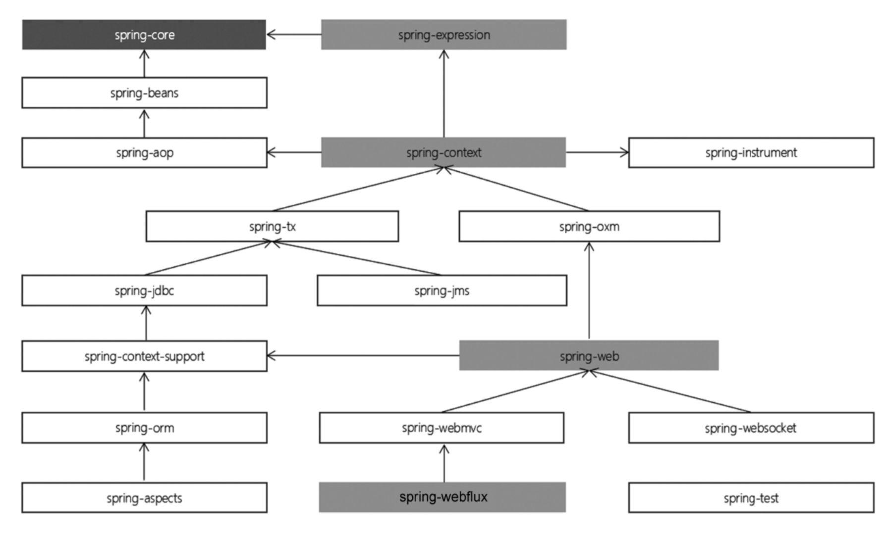

## Spring的设计思想
Spring是为降低企业级应用开发的复杂性而设计的，所有的这些基本理念都可以追溯到一个最根本的使命：简化开发。它主要采取了4个关键策略：
（1）基于POJO的轻量级和最小侵入性编程。
（2）通过依赖注入和面向接口实现松耦合。
（3）基于切面和惯性进行声明式编程。
（4）通过切面和模板减少样板式代码。
以上策略主要是通过面向Bean（BOP）、依赖注入（DI）及面向切面（AOP）这三种方式来实现的。

### BOP编程伊始

Spring是面向Bean的编程（Bean Oriented Programming，BOP），Bean在Spring中才是真正的主角。Bean对于Spring的意义就像Object对于OOP的意义一样，Spring中没有Bean也就没有Spring存在的意义。Spring IoC容器通过配置文件或者注解的方式来管理对象之间的依赖关系。

在典型的 IoC 场景中，容器创建了所有对象，并设置必要的属性将它们连接在一起，决定什么时间调用方法。

### Spring编程思想总结

| Spring思想 | 应用场景（特点）                                                                                                                                                                                   | 一句话归纳         |
| ---------- | -------------------------------------------------------------------------------------------------------------------------------------------------------------------------------------------------- | ------------------ |
| OOP        | Object Oriented Programming(面向对象编程)用程序归纳总结生活中一切事物。                                                                                                                            | 封装、继承、多态。 |
| BOP        | Bean Oriented Programming(面向Bean编程)面向Bean(普通的Java类)设计程序，解放程序员。                                                                                                                | 一切从Bean开始     |
| AOP        | Aspect Oriented Programming(面向切面编程)找出多个类中有一定规律的代码，开发时拆开，运行时再合并。                                                                                                  | 解耦，专人做专事。 |
| IOC        | Inversion of Control(控制反转)将new对象的动作交给Spring管理，并由Spring保存已创建的对象(IOC容器)。                                                                                                 | 转移控制权         |
| DI/DL      | Dependency Injection(依赖注入)或者Dependency Lookup(依赖查找)依赖注入、依赖查找，Spring不仅保存自己创建的对象，而且保存对象与对象之间的关系。注入即赋值，主要三种方式构造方法、set方法、直接赋值。 | 赋值               | 

## Spring5 系统架构

### Spring5模块结构图

### Spring5核心模块

| 模块名称               | 主要功能                                  |
| ---------------------- | ----------------------------------------- |
| spring-core            | 依赖注入IOC与D的最基本实现                |
| spring-beans           | Bean工厂与Bean的装配                      |
| spring-context         | 定义基础的Spring的Context.上下文即IOC容器 |
| spring-context-support | 对Spring IOC容器的扩展支持，以及IOC子容器 |
| spring-context-indexer | Spring的类管理组件和Classpath扫描         |
| spring-expression      | Spring表达式语言                          | 

### Spring5切面编程

| 模块名称          | 主要功能                                        |
| ----------------- | ----------------------------------------------- |
| spring-aop        | 面向切面编程的应用模块，整合Asm,CGLIb、JDKProxy |
| spring-aspects    | 集成Aspectj,AOP应用框架                         |
| spring-instrument | 动态Class Loading模块                           | 

### Spring5通信报文模块

| 模块名称         | 主要功能                                                                          |
| ---------------- | --------------------------------------------------------------------------------- |
| spring-messaging | 从Spring4开始新加入的一个模块，主要职责是为Spring框架集成一些基础的报文传送应用。 | 

### Spring5数据访问与集成模块

| 模块名称    | 主要功能                                                            |
| ----------- | ------------------------------------------------------------------- |
| spring-jdbc | Spring提供的DBC抽象框架的主要实现模块，用于简化Spring JDBC操作      |
| spring-tx   | Spring JDBC事务控制实现模块                                         |
| spring-orm  | 主要集成Hibernate,Java Persistence API(JPA)和Java Data Objects(JDO) |
| spring-oxm  | 将java对象映射成XML数据，或者将XML数据映射成java对象                |
| spring-jms  | Java Messaging Service能够发送和接收信息                            | 

### Spring5web模块

| 模块名称         | 主要功能                                                                            |
| ---------------- | ----------------------------------------------------------------------------------- |
| spring-web       | 提供了最基础Web支持，主要建立于核心容器之上，通过Servlet Listeners来初始化IOC容器。 |
| spring-webmvc    | 实现了Spring MVC(model-view-Controller)的Web应用。                                  |
| spring-websocket | 主要是与Web前端的全双工通讯的协议。                                                 |
| spring-webflux   | 一个新的非堵塞函数式Reactive Web框架，可以用来建立异步的非阻塞，事件驱动的服务。    | 

### Spring集成测试模块

| 模块名称    | 主要功能               |
| ----------- | ---------------------- |
| spring-test | 主要为测试提供支持的。 |

### Spring集成兼容模块

| 模块名称             | 主要功能                                                 |
| -------------------- | -------------------------------------------------------- |
| spring-framework-bom | Bill of Materials.解决Spring的不同模块依赖版本不同问题。 | 

### Spring各模块之间依赖关系

## Spring版本命名规则
