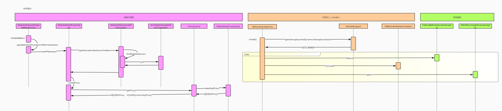
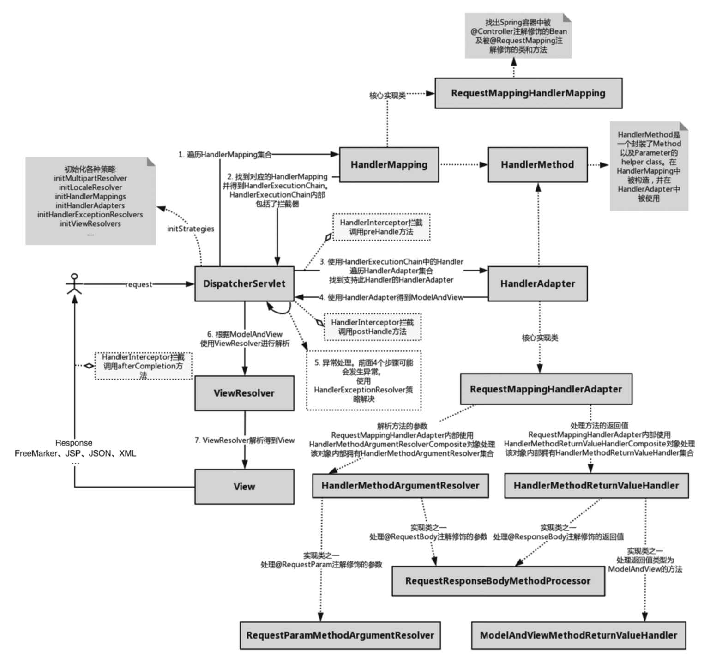

### Spring核心容器类图

#### 1.BeanFactory
Spring中Bean的创建是典型的工厂模式，这一系列的Bean工厂，即IoC容器，为开发者管理对象之间的依赖关系提供了很多便利和基础服务，在Spring中有许多IoC容器的实现供用户选择，其相互关系如下图所示。

其中，BeanFactory作为最顶层的一个接口类，定义了IoC容器的基本功能规范，BeanFactory有三个重要的子类：ListableBeanFactory、HierarchicalBeanFactory和AutowireCapableBeanFactory。但是从类图中我们可以发现最终的默认实现类是DefaultListableBeanFactory，它实现了所有的接口。那么为何要定义这么多层次的接口呢？查阅这些接口的源码和说明发现，每个接口都有它的使用场合，主要是为了区分在Spring内部操作过程中对象的传递和转化，对对象的数据访问所做的限制。例如，ListableBeanFactory接口表示这些Bean可列表化，而HierarchicalBeanFactory表示这些Bean 是有继承关系的，也就是每个 Bean 可能有父 Bean。AutowireCapableBeanFactory 接口定义Bean的自动装配规则。这三个接口共同定义了Bean的集合、Bean之间的关系及Bean行为。

在BeanFactory里只对IoC容器的基本行为做了定义，根本不关心你的Bean是如何定义及怎样加载的。Spring提供了许多IoC容器实现，比如GenericApplicationContext、ClasspathXmlApplicationContext等。
ApplicationContext是Spring提供的一个高级的IoC容器，它除了能够提供IoC容器的基本功能，还为用户提供了以下附加服务。
（1）支持信息源，可以实现国际化（实现MessageSource接口）。
（2）访问资源（实现ResourcePatternResolver接口，后面章节会讲到）。
（3）支持应用事件（实现ApplicationEventPublisher接口）。

#### 2.BeanDefinition
Spring IoC容器管理我们定义的各种Bean对象及其相互关系，Bean对象在Spring实现中是以BeanDefinition来描述的，其继承体系如下图所示。

#### 3.BeanDefinitionReader
Bean的解析过程非常复杂，功能被分得很细，因为这里需要被扩展的地方很多，必须保证足够的灵活性，以应对可能的变化。Bean的解析主要就是对Spring配置文件的解析。这个解析过程主要通过BeanDefinitionReader来完成，看看Spring中BeanDefinitionReader的类结构图，如下图所示。

## IoC分析

### IoC容器初始化三步曲

### 基于XML的定位、加载和注册

IoC容器的初始化包括BeanDefinition的Resource定位、加载和注册三个基本的过程。

Application继承图：

Spring IoC容器对Bean配置资源的载入是从refresh（）方法开始的。refresh（）方法是一个模板方法，规定了 IoC 容器的启动流程，有些逻辑要交给其子类实现。

refresh（）方法的主要作用是：在创建IoC容器前，如果已经有容器存在，需要把已有的容器销毁和关闭，以保证在refresh（）方法之后使用的是新创建的IoC容器。它类似于对IoC容器的重启，在新创建的容器中对容器进行初始化，对Bean配置资源进行载入。

### 基于XML的IoC运行时序图

### IoC容器初始化小结

1. 初始化的入口由容器实现中的refresh（）方法调用来完成。
2. 对Bean定义载入IoC容器使用的方法是loadBeanDefinition（）。

大致过程如下：通过 ResourceLoader 来完成资源文件的定位，DefaultResourceLoader 是默认的实现，同时上下文本身就给出了ResourceLoader的实现，可以通过类路径、文件系统、URL等方式来定位资源。如果是XmlBeanFactory作为IoC容器，那么需要为它指定Bean定义的资源，也就是说Bean定义文件时通过抽象成Resource来被IoC容器处理，容器通过BeanDefinitionReader来完成定义信息的解析和 Bean 信息的注册，往往使用 XmlBeanDefinitionReader 来解析 Bean 的XML 定义文件—实际的处理过程是委托给 BeanDefinitionParserDelegate 来完成的，从而得到Bean的定义信息，这些信息在Spring中使用BeanDefinition来表示—这个名字可以让我们想到loadBeanDefinition（）、registerBeanDefinition（）这些相关方法。它们都是为处理BeanDefinition服务的，容器解析得到BeanDefinition以后，需要在IoC容器中注册，这由IoC实现BeanDefinitionRegistry接口来实现。注册过程就是在IoC容器内部维护的一个HashMap来保存得到的BeanDefinition的过程。这个HashMap是IoC容器持有Bean信息的场所，以后对Bean的操作都是围绕这个HashMap来实现的。

## DI分析

### 依赖注入执行细节

### 依赖注入发生的时间
依赖注入在以下两种情况下发生：
（1）用户第一次调用getBean（）方法时，IoC容器触发依赖注入。
（2）当用户在配置文件中将＜bean＞元素配置了 lazy-init=false 属性时，即让容器在解析注册Bean定义时进行预实例化，触发依赖注入。

BeanFactory接口中定义了几个getBean（）方法，用于用户向IoC容器索取被管理的Bean的方法。

在Spring中如果Bean定义为单例模式（Singleton）的，则容器在创建之前先从缓存中查找，以确保整个容器中只存在一个实例对象。如果Bean定义为原型模式（Prototype）的，则容器每次都会创建一个新的实例对象。

### 依赖注入的细节

依赖注入实现其实就在以下两个方法中：
（1）createBeanInstance（）方法，生成Bean所包含的Java对象实例。
（2）populateBean（）方法，对Bean属性的依赖注入进行处理。

- 执行Bean实例化
	- 如果Bean的方法被覆盖了，则使用CGLib进行实例化，否则使用JDK的反射机制进行实例化。
	- JDK的动态代理只能针对接口，如果一个类没有实现任何接口，要对其进行动态代理只能使用CGLib。
- 准备依赖注入
	- 属性的注入过程分以下两种情况：
		（1）属性值类型不需要强制转换时，不需要解析属性值，直接进行依赖注入。
		（2）属性值类型需要进行强制转换时，如对其他对象的引用等，首先需要解析属性值，然后对解析后的属性值进行依赖注入。
				（1）对于集合类型的属性，将属性值解析为目标类型的集合后直接赋值给属性。
				（2）对于非集合类型的属性，大量使用JDK的反射机制，通过属性的getter（）方法获取指定属性注入前的值，同时调用属性的setter（）方法为属性设置注入后的值。

> Bean方法被覆盖意味着有子类，JDK反射只能生成接口或类的代理对象，不能生成子类的代理对象。CGLib可以生成子类的代理对象，它可以对类进行增强，即在运行时动态生成一个子类，并在子类中添加需要的方法和属性。

### 运行时序图

createBeanInstance() --> 用反射创建了个对象实例-->封装成BeanWrapper

populateBean() -->根据beanName、BeanDefiniton、BeanWrpper找到需要赋值的属性
把需要赋值的属性封装成了一个集合PropertyValues,集合的元素Propertyvalue,Propertyvalue需要赋值的bean,赋值需要调用的方法，要赋什么值。

applyPropertyvalues() --> 循环PropertyValye,挨个调用BeanWrapper的setvalue()方法，用反射调用setter方法完成赋值

## AOP分析

### 主要流程

### 源码分析

Spring AOP是由接入BeanPostProcessor后置处理器开始的，它是Spring IoC容器经常使用的一个特性，这个Bean后置处理器是一个监听器，可以监听容器触发的Bean声明周期事件。向容器注册后置处理器以后，容器中管理的Bean就具备了接收IoC容器回调事件的能力。

BeanPostProcessor后置处理器的调用发生在Spring IoC容器完成Bean实例对象的创建和属性的依赖注入之后。为 Bean 实例对象添加 BeanPostProcessor 后置处理器的入口是initializeBean（）方法。

### 核心功能

AOP就两个最核心的类MethodInterceptor、MethodInvocation
其他的都是起辅助作用

MethodInterceptor有一个方法叫做invoke()
MethodInvocation有一个方法叫做proceed()
proceed()串联起了整个Interceptor调用链

- Advice: 切面接口，定义了切面属性
	- AbstractAspectJAdvice: 继承自Advice, 保存有切面和切面方法，执行切面的具体方法在这个抽象类，在执行前会对传递参数进行配置。
		- AfterReturningAdviceInterceptor
		- AspectJAfterThrowingAdvice
		- MethodBeforeAdviceInterceptor
- AopConfig: 读取的Aop的配置信息，例如before调哪个方法

### 运行时序图

## MVC分析

### SpringMVC请求处理流程

### 核心组件运行步骤

### 运行时序图

