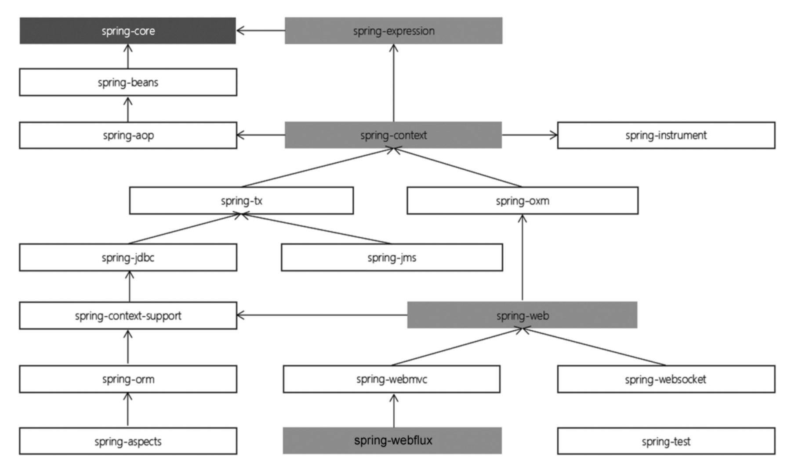

## Spring的设计思想
Spring是为降低企业级应用开发的复杂性而设计的，所有的这些基本理念都可以追溯到一个最根本的使命：简化开发。它主要采取了4个关键策略：
（1）基于POJO的轻量级和最小侵入性编程。
（2）通过依赖注入和面向接口实现松耦合。
（3）基于切面和惯性进行声明式编程。
（4）通过切面和模板减少样板式代码。
以上策略主要是通过面向Bean（BOP）、依赖注入（DI）及面向切面（AOP）这三种方式来实现的。

### BOP编程伊始

Spring是面向Bean的编程（Bean Oriented Programming，BOP），Bean在Spring中才是真正的主角。Bean对于Spring的意义就像Object对于OOP的意义一样，Spring中没有Bean也就没有Spring存在的意义。Spring IoC容器通过配置文件或者注解的方式来管理对象之间的依赖关系。

在典型的 IoC 场景中，容器创建了所有对象，并设置必要的属性将它们连接在一起，决定什么时间调用方法。

### Spring编程思想总结

| Spring思想 | 应用场景（特点）                                                                                                                                                                                   | 一句话归纳         |
| ---------- | -------------------------------------------------------------------------------------------------------------------------------------------------------------------------------------------------- | ------------------ |
| OOP        | Object Oriented Programming(面向对象编程)用程序归纳总结生活中一切事物。                                                                                                                            | 封装、继承、多态。 |
| BOP        | Bean Oriented Programming(面向Bean编程)面向Bean(普通的Java类)设计程序，解放程序员。                                                                                                                | 一切从Bean开始     |
| AOP        | Aspect Oriented Programming(面向切面编程)找出多个类中有一定规律的代码，开发时拆开，运行时再合并。                                                                                                  | 解耦，专人做专事。 |
| IOC        | Inversion of Control(控制反转)将new对象的动作交给Spring管理，并由Spring保存已创建的对象(IOC容器)。                                                                                                 | 转移控制权         |
| DI/DL      | Dependency Injection(依赖注入)或者Dependency Lookup(依赖查找)依赖注入、依赖查找，Spring不仅保存自己创建的对象，而且保存对象与对象之间的关系。注入即赋值，主要三种方式构造方法、set方法、直接赋值。 | 赋值               | 

## Spring5 系统架构

### Spring5模块结构图


### Spring5核心模块


| 模块名称               | 主要功能                                  |
| ---------------------- | ----------------------------------------- |
| spring-core            | 依赖注入IOC与DI的最基本实现                |
| spring-beans           | Bean工厂与Bean的装配                      |
| spring-context         | 定义基础的Spring的Context.上下文即IOC容器 |
| spring-context-support | 对Spring IOC容器的扩展支持，以及IOC子容器 |
| spring-context-indexer | Spring的类管理组件和Classpath扫描         |
| spring-expression      | Spring表达式语言                          | 

### Spring5切面编程

| 模块名称          | 主要功能                                        |
| ----------------- | ----------------------------------------------- |
| spring-aop        | 面向切面编程的应用模块，整合Asm,CGLIb、JDKProxy |
| spring-aspects    | 集成Aspectj,AOP应用框架                         |
| spring-instrument | 动态Class Loading模块                           | 


### Spring5通信报文模块

| 模块名称         | 主要功能                                                                          |
| ---------------- | --------------------------------------------------------------------------------- |
| spring-messaging | 从Spring4开始新加入的一个模块，主要职责是为Spring框架集成一些基础的报文传送应用。 | 


### Spring5数据访问与集成模块

| 模块名称    | 主要功能                                                            |
| ----------- | ------------------------------------------------------------------- |
| spring-jdbc | Spring提供的DBC抽象框架的主要实现模块，用于简化Spring JDBC操作      |
| spring-tx   | Spring JDBC事务控制实现模块                                         |
| spring-orm  | 主要集成Hibernate,Java Persistence API(JPA)和Java Data Objects(JDO) |
| spring-oxm  | 将java对象映射成XML数据，或者将XML数据映射成java对象                |
| spring-jms  | Java Messaging Service能够发送和接收信息                            | 


### Spring5web模块

| 模块名称         | 主要功能                                                                            |
| ---------------- | ----------------------------------------------------------------------------------- |
| spring-web       | 提供了最基础Web支持，主要建立于核心容器之上，通过Servlet Listeners来初始化IOC容器。 |
| spring-webmvc    | 实现了Spring MVC(model-view-Controller)的Web应用。                                  |
| spring-websocket | 主要是与Web前端的全双工通讯的协议。                                                 |
| spring-webflux   | 一个新的非堵塞函数式Reactive Web框架，可以用来建立异步的非阻塞，事件驱动的服务。    | 

### Spring集成测试模块

| 模块名称    | 主要功能               |
| ----------- | ---------------------- |
| spring-test | 主要为测试提供支持的。 |

### Spring集成兼容模块

| 模块名称             | 主要功能                                                 |
| -------------------- | -------------------------------------------------------- |
| spring-framework-bom | Bill of Materials.解决Spring的不同模块依赖版本不同问题。 | 

### Spring各模块之间依赖关系




## Spring版本命名规则

### 语义化版本命名通行规则


### 商业软件中常见的修饰词


### Spring版本命名规则


## 300行Mini版Spring

> 面试题：Spring中的Bean是线程安全的吗，Spring中的bean本质是你写的，和Spring没关系，它也不自己设计Bean，取决于你是否写的线程安全。

### Mini版Spring实现思路


### Minin版Spring v1

#### 定义application.properties

定义需要扫描的包

```properties
scanPackage=com.wychmod.demo
```

#### web.xml

1. 定义环境变量在application.properties中读取
2. 定义servlet的启动类是哪个，在启动的时候会默认运行该启动类

```xml
<?xml version="1.0" encoding="UTF-8"?>  
<web-app xmlns:xsi="http://www.w3.org/2001/XMLSchema-instance"  
   xmlns="http://java.sun.com/xml/ns/j2ee" xmlns:javaee="http://java.sun.com/xml/ns/javaee"  
   xmlns:web="http://java.sun.com/xml/ns/javaee/web-app_2_5.xsd"  
   xsi:schemaLocation="http://java.sun.com/xml/ns/j2ee http://java.sun.com/xml/ns/j2ee/web-app_2_4.xsd"  
   version="2.4">  
   <display-name>Web Application</display-name>  
   <servlet>  
      <servlet-name>wymvc</servlet-name>  
      <servlet-class>com.wychmod.mvcframework.servlet.WYDispatchServlet</servlet-class>  
      <init-param>  
         <param-name>contextConfigLocation</param-name>  
         <param-value>application.properties</param-value>  
      </init-param>  
  
      <load-on-startup>1</load-on-startup>  
   </servlet>  
   <servlet-mapping>  
      <servlet-name>wymvc</servlet-name>  
      <url-pattern>/*</url-pattern>  
   </servlet-mapping>  
</web-app>
```

#### WYDispatchServlet(实现ioc/di的功能，简易spring)
流程如下：
1. 加载配置文件
2. 扫描相关的类
3. 初始化Ioc容器，将扫描到的相关类实例化，保存到Ioc容器中
4. 完成依赖注入
5. 初始化HandlerMapping
6. 委派，根据URL去找到一个对应的Method并通过response返回

```java
package com.gupaoedu.mvcframework.v2.servlet;  
  
import com.sun.org.apache.bcel.internal.generic.NEW;  
  
import javax.servlet.ServletConfig;  
import javax.servlet.ServletException;  
import javax.servlet.http.HttpServlet;  
import javax.servlet.http.HttpServletRequest;  
import javax.servlet.http.HttpServletResponse;  
import java.io.File;  
import java.io.IOException;  
import java.io.InputStream;  
import java.lang.annotation.Annotation;  
import java.lang.reflect.Field;  
import java.lang.reflect.InvocationTargetException;  
import java.lang.reflect.Method;  
import java.net.URL;  
import java.util.*;  
  
/**  
 * @description: 300行Spring  
 * @author: wychmod  
 * @date: 2023/6/20  
 */public class WYDispatchServlet extends HttpServlet {  
    /**  
     * Properties类，读取和写入属性文件的工具类  
     */  
    private Properties contextConfig = new Properties();  
  
    /**  
     * 缓存所有的类名，享元模式  
     */  
    private List<String> classNames = new ArrayList<String>();  
  
    /**  
     * IoC容器，key默认是类名首字母小写，value就是对应的实例对象  
     */  
    private Map<String, Object> ioc = new HashMap<String, Object>();  
  
    /**  
     * 保存所有的Url和方法的映射关系  
     */  
    private Map<String, Method> handlerMapping = new HashMap<String, Method>();  
  
    @Override  
    protected void doGet(HttpServletRequest req, HttpServletResponse resp) throws ServletException, IOException {  
        this.doPost(req, resp);  
    }  
  
    @Override  
    protected void doPost(HttpServletRequest req, HttpServletResponse resp) throws ServletException, IOException {  
  
        // 6. 委派，根据URL去找到一个对应的Method并通过response返回  
        try {  
            doDispatch(req, resp);  
        } catch (Exception e) {  
            e.printStackTrace();  
            resp.getWriter().write("500 Exception, Detail: " + Arrays.toString(e.getStackTrace()));  
        }  
    }  
    private void doDispatch(HttpServletRequest req, HttpServletResponse resp) throws IOException, InvocationTargetException, IllegalAccessException {  
        // 绝对路径  
        String url = req.getRequestURI();  
        // 处理成相对路径  
        String contextPath = req.getContextPath();  
        url = url.replaceAll(contextPath, "").replaceAll("/+", "/");  
  
        if (!this.handlerMapping.containsKey(url)) {  
            resp.getWriter().write("404 Not Found!!!");  
            return;  
        }  
  
        Method method = this.handlerMapping.get(url);  
  
        // 从request中拿到url传过来的参数  
        Map<String, String[]> params = req.getParameterMap();  
  
        // 获取方法的形参列表  
        Class<?>[] parameterTypes = method.getParameterTypes();  
  
        // 保存赋值参数的位置  
        Object[] paramValues = new Object[parameterTypes.length];  
  
        // 根据参数位置动态赋值  
        for (int i = 0; i < parameterTypes.length; i++) {  
            Class parameterType = parameterTypes[i];  
  
            if (parameterType == HttpServletRequest.class) {  
                paramValues[i] = req;  
                continue;  
            } else if (parameterType == HttpServletResponse.class) {  
                paramValues[i] = resp;  
                continue;  
            } else if (parameterType == String.class) {  
                // 提取方法中加了注解的参数, 通过运行时的状态去拿到你的参数  
                Annotation[][] pa = method.getParameterAnnotations();  
                for (int j = 0; j < pa.length; j++) {  
                    for (Annotation a : pa[j]) {  
                        if (a instanceof WYRequestParam) {  
                            String paramName = ((WYRequestParam) a).value();  
                            if (!"".equals(paramName.trim())) {  
                                String value = Arrays.toString(params.get(paramName))  
                                        .replaceAll("\\[|\\]", "")  
                                        .replaceAll("\\s", ",");  
                                paramValues[i] = value;  
                            }  
                        }                    }                }            }        }  
        //暂时硬编码  
        String beanName = toLowerFirstCase(method.getDeclaringClass().getSimpleName());  
        //赋值实参列表  
        method.invoke(ioc.get(beanName),paramValues);  
          
  
    }  
  
    @Override  
    public void init(ServletConfig config) throws ServletException {  
        // 1. 加载配置文件  
        doLoadConfig(config.getInitParameter("contextConfigLocation"));  
  
        // 2. 扫描相关的类  
        doScanner(contextConfig.getProperty("scanPackage"));  
  
        //===========IOC部分===========  
  
        // 3. 初始化Ioc容器，将扫描到的相关类实例化，保存到Ioc容器中  
        doInstance();  
  
        // AOP,新生成的代理对象  
  
        //===========DI部分===========  
  
        // 4. 完成依赖注入  
        doAutowired();  
  
        //===========MVC部分===========  
  
        // 5. 初始化HandlerMapping  
        doInitHandlerMapping();  
  
        System.out.println("WY Spring framework is init.");  
    }  
  
    /**  
     * 初始化url和Method的一对一对应关系  
     */  
    private void doInitHandlerMapping() {  
        if(ioc.isEmpty()){return;}  
  
        for (Map.Entry<String, Object> entry : ioc.entrySet()) {  
            Class<?> clazz = entry.getValue().getClass();  
  
            if(!clazz.isAnnotationPresent(Controller.class)){continue;}  
  
            // 获取保存写在类上面的@RequestMapping("/demo")  
            String baseUrl = "";  
            if(clazz.isAnnotationPresent(RequestMapping.class)){  
                RequestMapping requestMapping = clazz.getAnnotation(RequestMapping.class);  
                baseUrl = requestMapping.value();  
            }  
  
            // 获取所有的public方法  
            for (Method method : clazz.getMethods()) {  
                if(!method.isAnnotationPresent(RequestMapping.class)){continue;}  
  
                RequestMapping requestMapping = method.getAnnotation(RequestMapping.class);  
                String url = ("/" + baseUrl + "/" + requestMapping.value()).replaceAll("/+", "/");  
                handlerMapping.put(url, method);  
                System.out.println("Mapped : " + url + "," + method);  
            }  
        }  
    }  
    private void doAutowired() {  
        if(ioc.isEmpty()){return;}  
  
        for (Map.Entry<String, Object> entry : ioc.entrySet()) {  
            // 获取所有字段，包括private、protected、default类型的  
            Field[] fields = entry.getValue().getClass().getDeclaredFields();  
  
            for (Field field : fields) {  
                // 判断是否有Autowired注解，有的进行注入  
                if (!field.isAnnotationPresent(Autowired.class)) {  
                    continue;  
                }  
  
                Autowired autowired = field.getAnnotation(Autowired.class);  
                String beanName = autowired.value().trim();  
                // 如果用户没有自定义的beanName，就默认根据类型注入  
                if ("".equals(beanName)) {  
                    // 获取字段的类型，作为key待会拿这个key到ioc容器中去取值  
                    beanName = field.getType().getName();  
                }  
  
                // 如果是public以外的类型，只要加了@Autowired注解，都要强制赋值  
                // 反射中叫做暴力访问  
                field.setAccessible(true);  
  
                try {  
                    // 用反射机制动态给字段赋值  
                    field.set(entry.getValue(), ioc.get(beanName));  
                } catch (IllegalAccessException e) {  
                    e.printStackTrace();  
                }  
            }        }    }  
    private void doInstance() {  
        if (classNames.isEmpty()) {  
            return;  
        }  
  
        try {  
            for (String className : classNames) {  
                Class<?> clazz = Class.forName(className);  
  
                if (clazz.isAnnotationPresent(Controller.class)) {  
                    // 默认将首字母小写作为beanName，保存到ioc容器中  
                    String beanName = toLowerFirstCase(clazz.getSimpleName());  
                    Object instance = clazz.newInstance();  
                    ioc.put(beanName, instance);  
                } else if (clazz.isAnnotationPresent(Service.class)) {  
                    // 1.在多个包下出现相同的类名，自己在注解上起一个全局唯一名字  
                    String beanName = clazz.getAnnotation(Service.class).value();  
                    if ("".equals(beanName.trim())) {  
                        beanName = toLowerFirstCase(clazz.getSimpleName());  
                    }  
  
                    // 2. 默认的类名首字母小写  
                    Object instance = clazz.newInstance();  
                    ioc.put(beanName, instance);  
  
                    // 3. 如果是接口，判断有多少个实现类，一个就放入ioc容器中，多个就抛出异常  
                    for (Class<?> anInterface : clazz.getInterfaces()) {  
                        if (ioc.containsKey(anInterface.getName())) {  
                            throw new Exception("The " + anInterface.getName() + " is exists!");  
                        }  
                        // 把接口的类型直接当成key了  
                        ioc.put(anInterface.getName(), instance);  
  
                    }  
                } else {  
                    continue;  
                }  
            }        } catch (  
                Exception e) {  
            e.printStackTrace();  
        }  
    }  
    /**  
     * 将类名首字母小写  
     */  
    private String toLowerFirstCase(String simpleName) {  
        char[] chars = simpleName.toCharArray();  
        chars[0] += 32;  
        return String.valueOf(chars);  
    }  
  
    private void doLoadConfig(String contextConfigLocation) {  
        InputStream inputStream = this.getClass().getClassLoader().getResourceAsStream(contextConfigLocation);  
        try {  
            contextConfig.load(inputStream);  
        } catch (IOException e) {  
            e.printStackTrace();  
        } finally {  
            if (null != inputStream) {  
                try {  
                    inputStream.close();  
                } catch (IOException e) {  
                    e.printStackTrace();  
                }  
            }        }    }  
    private void doScanner(String scanPackage) {  
        // 找到资源的完整路径  
        URL url = this.getClass().getClassLoader().getResource("/" + scanPackage.replaceAll("\\.", "/"));  
        File classPath = new File(url.getFile());  
  
        //当成是一个ClassPath文件夹下的所有文件，递归的扫描每一个文件  
        for (File file : classPath.listFiles()) {  
            if (file.isDirectory()) {  
                doScanner(scanPackage + "." + file.getName());  
            } else {  
                // 不是class文件直接跳过  
                if (!file.getName().endsWith(".class")) {  
                    continue;  
                }  
                // 全类名 = 包名.类名  
                String className = (scanPackage + "." + file.getName().replace(".class", ""));  
                classNames.add(className);  
            }  
        }  
    }}
```


## 完整版Spring
### 1.从Servlet到ApplicationContext


