# Vue3 + Vue CLI项目搭建
[toc]
## 介绍Vue和VueCLI简介
Vue CLI 是一个基于 Vue.js 进行快速开发的完整系统。
## 创建VueCLI项目
```
npm install -g @vue/cli
# OR
yarn global add @vue/cli

vue --version

vue create xxx
```

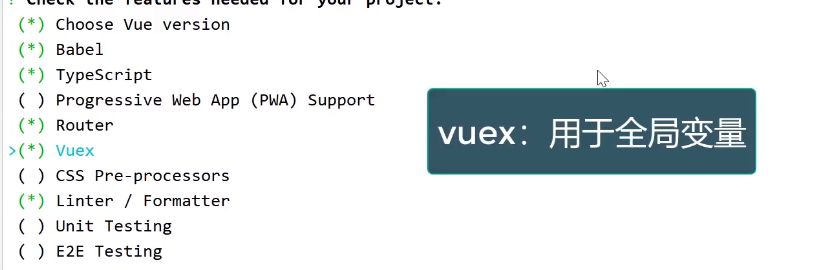
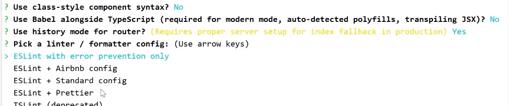
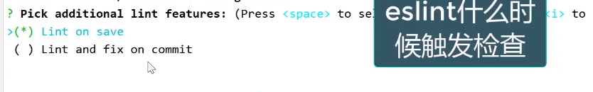
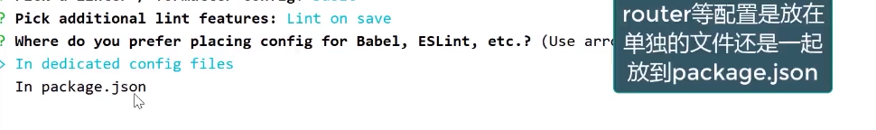
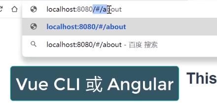
**不使用历史模式会在地址里带#号**
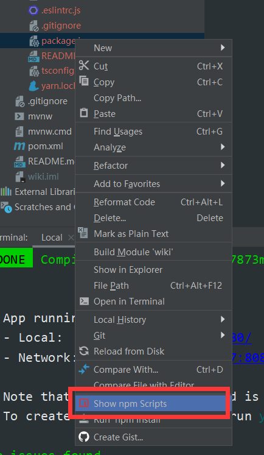
**快速启动npm**
## 讲解VueCLI项目结构
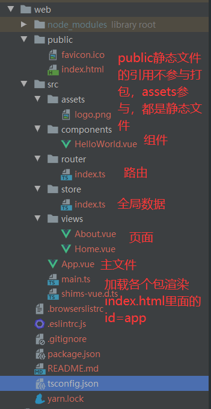
## 集成 Ant Design Vue 
```
npm install ant-design-vue@next --save

# 完整引入
import { createApp } from 'vue';
import Antd from 'ant-design-vue';
import App from './App';
import 'ant-design-vue/dist/antd.css';

const app = createApp();
app.config.productionTip = false;

app.use(Antd);
```

## 路由开发
**点击路由router-view会转变内容**
```
<div id="nav">
    <router-link to="/">Home</router-link> |
    <router-link to="/about">About</router-link>
</div>
<router-view/>


import { createRouter, createWebHistory, RouteRecordRaw } from 'vue-router'
import Home from '../views/Home.vue'

const routes: Array<RouteRecordRaw> = [
  {
    path: '/',
    name: 'Home',
    component: Home
  },
  {
    path: '/about',
    name: 'About',
    // route level code-splitting
    // this generates a separate chunk (about.[hash].js) for this route
    // which is lazy-loaded when the route is visited.
    component: () => import(/* webpackChunkName: "about" */ '../views/About.vue')
  }
]

const router = createRouter({
  history: createWebHistory(process.env.BASE_URL),
  routes
})

export default router

```
## 制作Vue自定义组件
**引入自定义组件**
```
<script lang="ts">
  import { defineComponent } from 'vue';
  import TheHeader from '@/components/the-header.vue';
  import TheFooter from '@/components/the-footer.vue';

  export default defineComponent({
    name: 'app',
    components: {
      TheHeader,
      TheFooter,
    },
  });
</script>
```
**到处组件**
```
<script lang="ts">
import { defineComponent } from 'vue';

export default defineComponent({
  name: 'the-header',
});
</script>
```
## 集成HTTP库axios
```
npm install axios --save
```
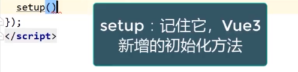
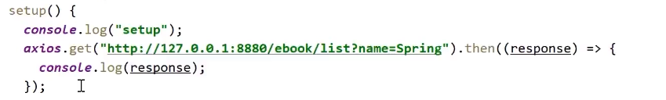
### 在main.ts对axios进行全局配置
```
import axios from 'axios';

axios.defaults.baseURL = process.env.VUE_APP_SERVER;
```
### 使用axios拦截器打印前端日志
```
import axios from 'axios';

axios.defaults.baseURL = process.env.VUE_APP_SERVER;

/**
 * axios拦截器
 */
axios.interceptors.request.use(function (config) {
  console.log('请求参数：', config);
  const token = store.state.user.token;
  if (Tool.isNotEmpty(token)) {
    config.headers.token = token;
    console.log("请求headers增加token:", token);
  }
  return config;
}, error => {
  return Promise.reject(error);
});
axios.interceptors.response.use(function (response) {
  console.log('返回结果：', response);
  return response;
}, error => {
  console.log('返回错误：', error);
  const response = error.response;
  const status = response.status;
  if (status === 401) {
    // 判断状态码是401 跳转到首页或登录页
    console.log("未登录，跳到首页");
    store.commit("setUser", {});
    message.error("未登录或登录超时");
    router.push('/');
  }
  return Promise.reject(error);
});
```

## Vue3数据绑定
### Vue2数据绑定的方式
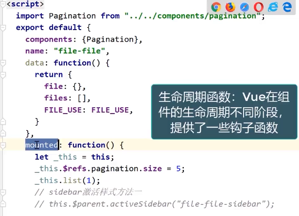
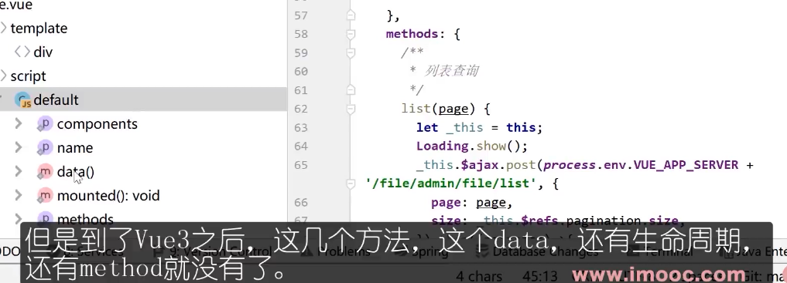

### setup方法替代了data(),mounted(),methods方法
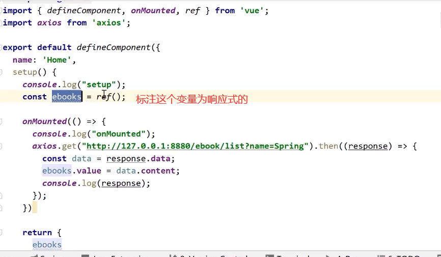
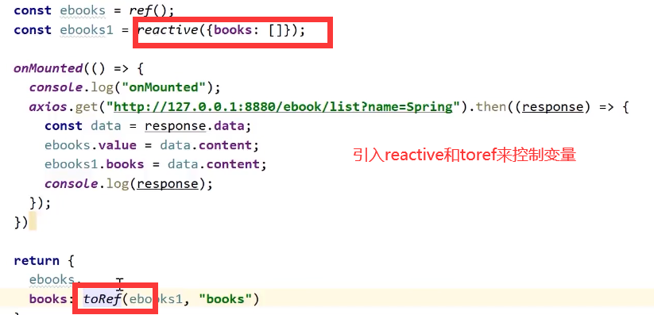

## scoped样式只在当前页面生效
```
<style scoped>
  .ant-avatar {
    width: 50px;
    height: 50px;
    line-height: 50px;
    border-radius: 8%;
    margin: 5px 0;
  }
</style>
```

## Vue CLI多环境配置
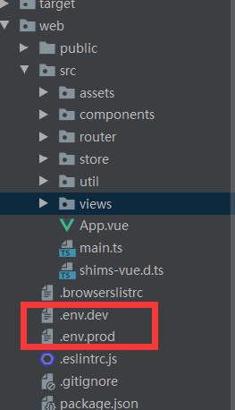
```
NODE_ENV=development
VUE_APP_SERVER=http://127.0.0.1:8880
VUE_APP_WS_SERVER=ws://127.0.0.1:8880

package.json
"serve-dev": "vue-cli-service serve --mode dev --port 8080",
"serve-prod": "vue-cli-service serve --mode prod",
"build-dev": "vue-cli-service build --mode dev",
"build-prod": "vue-cli-service build --mode prod",

main.ts
console.log('环境：', process.env.NODE_ENV);
console.log('服务端：', process.env.VUE_APP_SERVER);
```
