目标检测是人工智能的一个重要应用，就是在图片中要将里面的物体识别出来，并标出物体的位置，一般需要经过两个步骤：

1、分类，识别物体是什么

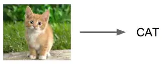

image

2、定位，找出物体在哪里

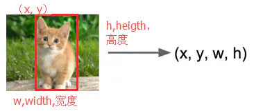

image

除了对单个物体进行检测，还要能支持对多个物体进行检测，如下图所示：

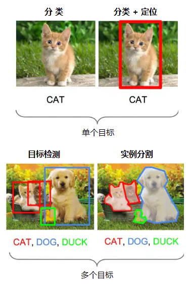

image

这个问题并不是那么容易解决，由于物体的尺寸变化范围很大、摆放角度多变、姿态不定，而且物体有很多种类别，可以在图片中出现多种物体、出现在任意位置。因此，目标检测是一个比较复杂的问题。

最直接的方法便是构建一个深度神经网络，将图像和标注位置作为样本输入，然后经过CNN网络，再通过一个分类头（Classification head）的全连接层识别是什么物体，通过一个回归头（Regression head）的全连接层回归计算位置，如下图所示：

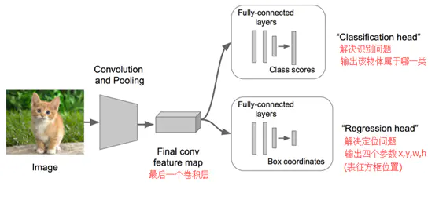

image

但“回归”不好做，计算量太大、收敛时间太长，应该想办法转为“分类”，这时容易想到套框的思路，即取不同大小的“框”，让框出现在不同的位置，计算出这个框的得分，然后取得分最高的那个框作为预测结果，如下图所示：

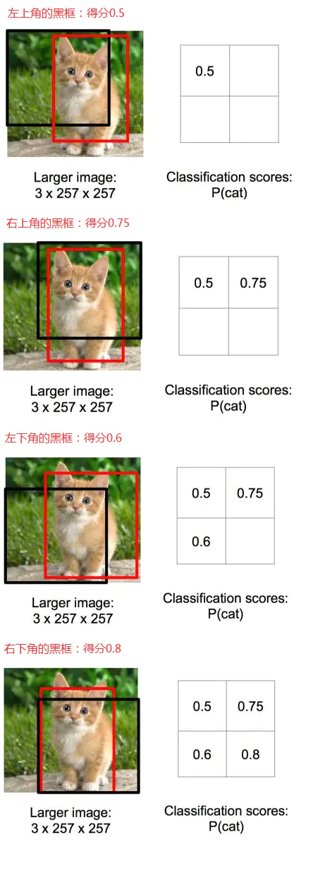

image

根据上面比较出来的得分高低，选择了右下角的黑框作为目标位置的预测。

但问题是：框要取多大才合适？太小，物体识别不完整；太大，识别结果多了很多其它信息。那怎么办？那就各种大小的框都取来计算吧。

如下图所示（要识别一只熊），用各种大小的框在图片中进行反复截取，输入到CNN中识别计算得分，最终确定出目标类别和位置。

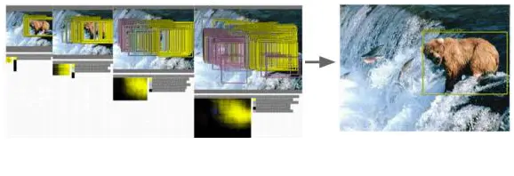

image

这种方法效率很低，实在太耗时了。那有没有高效的目标检测方法呢？

一、R-CNN 横空出世

R-CNN（Region CNN，区域卷积神经网络）可以说是利用深度学习进行目标检测的开山之作，作者Ross Girshick多次在PASCAL VOC的目标检测竞赛中折桂，2010年更是带领团队获得了终身成就奖，如今就职于Facebook的人工智能实验室（FAIR）。

R-CNN算法的流程如下

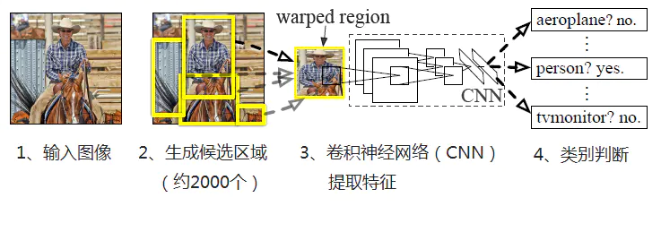

image

1、输入图像

2、每张图像生成1K~2K个候选区域

3、对每个候选区域，使用深度网络提取特征（AlextNet、VGG等CNN都可以）

4、将特征送入每一类的SVM 分类器，判别是否属于该类

5、使用回归器精细修正候选框位置

下面展开进行介绍

1、生成候选区域

使用Selective Search（选择性搜索）方法对一张图像生成约2000-3000个候选区域，基本思路如下：

（1）使用一种过分割手段，将图像分割成小区域

（2）查看现有小区域，合并可能性最高的两个区域，重复直到整张图像合并成一个区域位置。优先合并以下区域：

- 颜色（颜色直方图）相近的

- 纹理（梯度直方图）相近的

- 合并后总面积小的

- 合并后，总面积在其BBOX中所占比例大的

在合并时须保证合并操作的尺度较为均匀，避免一个大区域陆续“吃掉”其它小区域，保证合并后形状规则。

（3）输出所有曾经存在过的区域，即所谓候选区域

2、特征提取

使用深度网络提取特征之前，首先把候选区域归一化成同一尺寸227×227。

使用CNN模型进行训练，例如AlexNet，一般会略作简化，如下图：

image

3、类别判断

对每一类目标，使用一个线性SVM二类分类器进行判别。输入为深度网络（如上图的AlexNet）输出的4096维特征，输出是否属于此类。

4、位置精修

目标检测的衡量标准是重叠面积：许多看似准确的检测结果，往往因为候选框不够准确，重叠面积很小，故需要一个位置精修步骤，对于每一个类，训练一个线性回归模型去判定这个框是否框得完美，如下图：

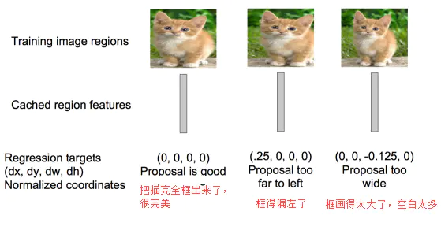

image

R-CNN将深度学习引入检测领域后，一举将PASCAL VOC上的检测率从35.1%提升到53.7%。

二、Fast R-CNN大幅提速

继2014年的R-CNN推出之后，Ross Girshick在2015年推出Fast R-CNN，构思精巧，流程更为紧凑，大幅提升了目标检测的速度。

Fast R-CNN和R-CNN相比，训练时间从84小时减少到9.5小时，测试时间从47秒减少到0.32秒，并且在PASCAL VOC 2007上测试的准确率相差无几，约在66%-67%之间。

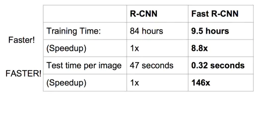

image

Fast R-CNN主要解决R-CNN的以下问题：

1、训练、测试时速度慢

R-CNN的一张图像内候选框之间存在大量重叠，提取特征操作冗余。而Fast R-CNN将整张图像归一化后直接送入深度网络，紧接着送入从这幅图像上提取出的候选区域。这些候选区域的前几层特征不需要再重复计算。

2、训练所需空间大

R-CNN中独立的分类器和回归器需要大量特征作为训练样本。Fast R-CNN把类别判断和位置精调统一用深度网络实现，不再需要额外存储。

下面进行详细介绍

1、在特征提取阶段，通过CNN（如AlexNet）中的conv、pooling、relu等操作都不需要固定大小尺寸的输入，因此，在原始图片上执行这些操作后，输入图片尺寸不同将会导致得到的feature map（特征图）尺寸也不同，这样就不能直接接到一个全连接层进行分类。

在Fast R-CNN中，作者提出了一个叫做ROI Pooling的网络层，这个网络层可以把不同大小的输入映射到一个固定尺度的特征向量。ROI Pooling层将每个候选区域均匀分成M×N块，对每块进行max pooling。将特征图上大小不一的候选区域转变为大小统一的数据，送入下一层。这样虽然输入的图片尺寸不同，得到的feature map（特征图）尺寸也不同，但是可以加入这个神奇的ROI Pooling层，对每个region都提取一个固定维度的特征表示，就可再通过正常的softmax进行类型识别。

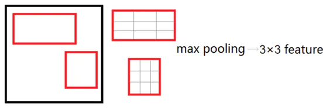

image

2、在分类回归阶段，在R-CNN中，先生成候选框，然后再通过CNN提取特征，之后再用SVM分类，最后再做回归得到具体位置（bbox regression）。而在Fast R-CNN中，作者巧妙的把最后的bbox regression也放进了神经网络内部，与区域分类合并成为了一个multi-task模型，如下图所示：

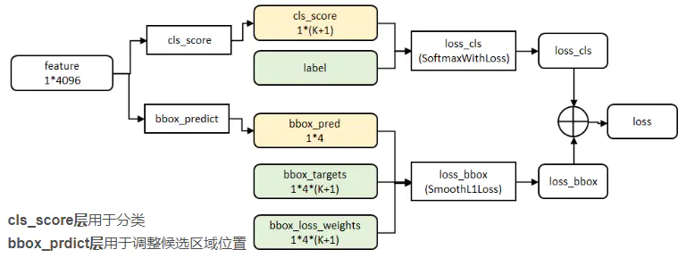

image

实验表明，这两个任务能够共享卷积特征，并且相互促进。

Fast R-CNN很重要的一个贡献是成功地让人们看到了Region Proposal+CNN（候选区域+卷积神经网络）这一框架实时检测的希望，原来多类检测真的可以在保证准确率的同时提升处理速度。

三、Faster R-CNN更快更强

继2014年推出R-CNN，2015年推出Fast R-CNN之后，目标检测界的领军人物Ross Girshick团队在2015年又推出一力作：Faster R-CNN，使简单网络目标检测速度达到17fps，在PASCAL VOC上准确率为59.9%，复杂网络达到5fps，准确率78.8%。

在Fast R-CNN还存在着瓶颈问题：Selective Search（选择性搜索）。要找出所有的候选框，这个也非常耗时。那我们有没有一个更加高效的方法来求出这些候选框呢？

在Faster R-CNN中加入一个提取边缘的神经网络，也就说找候选框的工作也交给神经网络来做了。这样，目标检测的四个基本步骤（候选区域生成，特征提取，分类，位置精修）终于被统一到一个深度网络框架之内。如下图所示：

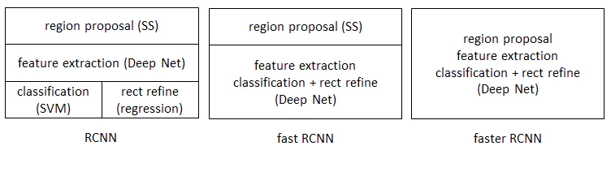

image

Faster R-CNN可以简单地看成是“区域生成网络+Fast R-CNN”的模型，用区域生成网络（Region Proposal Network，简称RPN）来代替Fast R-CNN中的Selective Search（选择性搜索）方法。

如下图

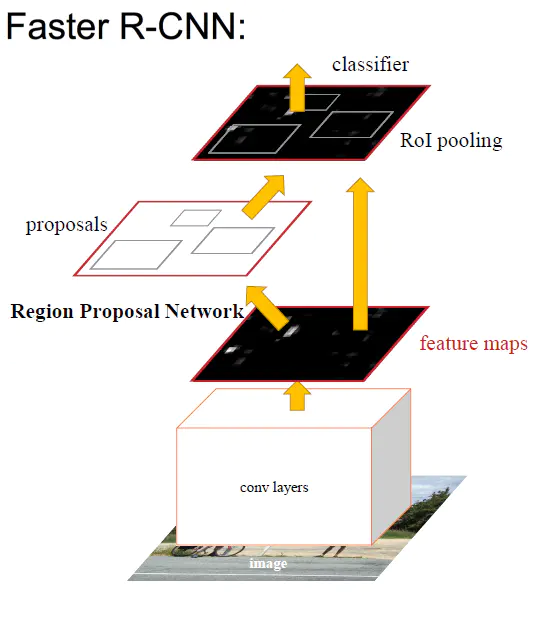

image

RPN如下图：

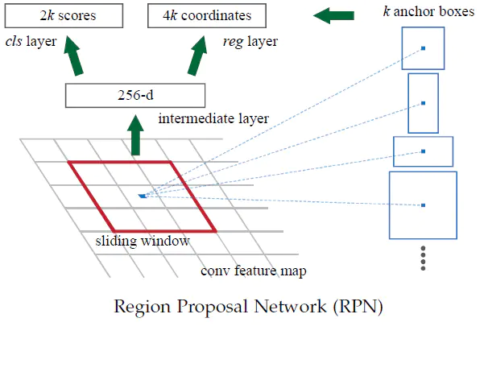

image

RPN的工作步骤如下：

- 在feature map（特征图）上滑动窗口

- 建一个神经网络用于物体分类+框位置的回归

- 滑动窗口的位置提供了物体的大体位置信息

- 框的回归提供了框更精确的位置

Faster R-CNN设计了提取候选区域的网络RPN，代替了费时的Selective Search（选择性搜索），使得检测速度大幅提升，下表对比了R-CNN、Fast R-CNN、Faster R-CNN的检测速度：

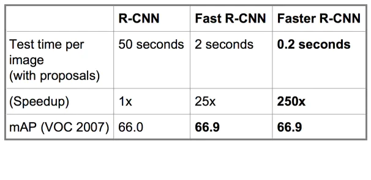

image

总结

R-CNN、Fast R-CNN、Faster R-CNN一路走来，基于深度学习目标检测的流程变得越来越精简、精度越来越高、速度也越来越快。基于region proposal（候选区域）的R-CNN系列目标检测方法是目标检测技术领域中的最主要分支之一。

为了更加精确地识别目标，实现在像素级场景中识别不同目标，利用“图像分割”技术定位每个目标的精确像素，如下图所示（精确分割出人、汽车、红绿灯等）：

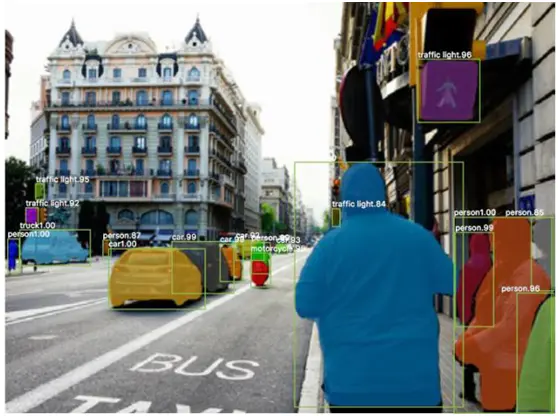

image

Mask R-CNN便是这种“图像分割”的重要模型。

Mask R-CNN的思路很简洁，既然Faster R-CNN目标检测的效果非常好，每个候选区域能输出种类标签和定位信息，那么就在Faster R-CNN的基础上再添加一个分支从而增加一个输出，即物体掩膜（object mask），也即由原来的两个任务（分类+回归）变为了三个任务（分类+回归+分割）。如下图所示，Mask R-CNN由两条分支组成：

image

Mask R-CNN的这两个分支是并行的，因此训练简单，仅比Faster R-CNN多了一点计算开销。

如下图所示，Mask R-CNN在Faster R-CNN中添加了一个全卷积网络的分支（图中白色部分），用于输出二进制mask，以说明给定像素是否是目标的一部分。所谓二进制mask，就是当像素属于目标的所有位置上时标识为1，其它位置标识为 0

image

从上图可以看出，二进制mask是基于特征图输出的，而原始图像经过一系列的卷积、池化之后，尺寸大小已发生了多次变化，如果直接使用特征图输出的二进制mask来分割图像，那肯定是不准的。这时就需要进行了修正，也即使用RoIAlign替换RoIPooling

image

如上图所示，原始图像尺寸大小是128x128，经过卷积网络之后的特征图变为尺寸大小变为 25x25。这时，如果想要圈出与原始图像中左上方15x15像素对应的区域，那么如何在特征图中选择相对应的像素呢？

从上面两张图可以看出，原始图像中的每个像素对应于特征图的25/128像素，因此，要从原始图像中选择15x15像素，则只需在特征图中选择2.93x2.93像素（15x25/128=2.93），在RoIAlign中会使用双线性插值法准确得到2.93像素的内容，这样就能很大程度上，避免了错位问题。

修改后的网络结构如下图所示（黑色部分为原来的Faster R-CNN，红色部分为Mask R-CNN修改的部分）

image

从上图可以看出损失函数变为

image

损失函数为分类误差+检测误差+分割误差，分类误差和检测（回归）误差是Faster R-CNN中的，分割误差为Mask R-CNN中新加的。

对于每个MxM大小的ROI区域，mask分支有KxMxM维的输出（K是指类别数量）。对于每一个像素，都是用sigmod函数求二值交叉熵，也即对每个像素都进行逻辑回归，得到平均的二值交叉熵误差Lmask。通过引入预测K个输出的机制，允许每个类都生成独立的mask，以避免类间竞争，这样就能解耦mask和种类预测。

对于每一个ROI区域，如果检测得到属于哪一个分类，就只使用该类的交叉熵误差进行计算，也即对于一个ROI区域中KxMxM的输出，真正有用的只是某个类别的MxM的输出。如下图所示：

image

例如目前有3个分类：猫、狗、人，检测得到当前ROI属于“人”这一类，那么所使用的Lmask为“人”这一分支的mask。

Mask R-CNN将这些二进制mask与来自Faster R-CNN的分类和边界框组合，便产生了惊人的图像精确分割，如下图所示：

image

Mask R-CNN是一个小巧、灵活的通用对象实例分割框架，它不仅可以对图像中的目标进行检测，还可以对每一个目标输出一个高质量的分割结果。另外，Mask R-CNN还易于泛化到其他任务，比如人物关键点检测，如下图所示：

image

从R-CNN、Fast R-CNN、Faster R-CNN到Mask R-CNN，每次进步不一定是跨越式的发展，这些进步实际上是直观的且渐进的改进之路，但是它们的总和却带来了非常显著的效果。

最后，总结一下目标检测算法模型的发展历程，如下图所示：

image

