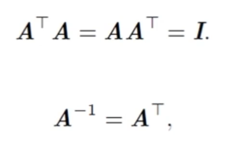
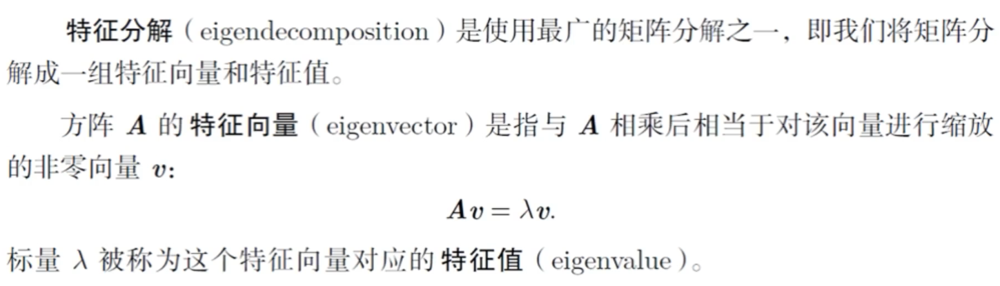

# 线性代数基础-1
[toc]
## 标量、向量、矩阵、张量
### 标量（scalar）
- 一个单独的数：自然数、整数、实数......

- 用斜体的小写字母表示标量

### 向量(vector)
- 有序列的一列数，一般指纵向量
- 通常用粗体的小写变量名称表示向量
- 向量的元素用带角标的斜体表示


### 矩阵(matrix)
- 二位数组
- 用粗体的大写变量名称表示矩阵

### 张量(tensor)
- 超过二位的数组
- 比如shape是(2,3,4)的张量
- Tensorflow: 张量流
- 标量，向量，矩阵也都是特殊的张量

### 转置
- 以对角线为轴的镜像
- 转置的数学符号是大写的T
- 行向量的转置就是列向量

### 矩阵加法
- 矩阵的加法必须行列相同
- 满足交换律与结合律
- 矩阵减法是矩阵加法的特殊形式

### 数乘矩阵


### 矩阵乘法

- 是不满足交换律的
- 满足结合律和分配率

### 元素对应乘积


### 单位矩阵


### 逆矩阵

- 可以用来求Ax=b


## 用代码来实现标量、向量、矩阵
```python
import numpy as np

n = np.arange(6) # 生成一个一维向量
n.shape # 向量的个数

(6,) # 一维向量的个数
————————————————————————————————————————————
np.arange(6).reshape(1, 6).shape # 改变成一行六列的行向量 二维

(1, 6)
————————————————————————————————————————————
col_vector = np.arange(6).reshape(6, 1) # 改变成六行一列的二维向量
print(col_vector, col_vector.shape)

[[0]
 [1]
 [2]
 [3]
 [4]
 [5]] (6, 1)
 ————————————————————————————————————————————
np.array([1,2,3,4,5]) # 初始化一维数组，也可以作为向量 list初始化
array([1, 2, 3, 4, 5])
————————————————————————————————————————————
np.array((1,2,3,4,5)) # tuple初始化一维数组
array([1, 2, 3, 4, 5])
————————————————————————————————————————————
# 一维list也可以直接作为向量
list1 = [1,2,3,4]
————————————————————————————————————————————
m1 = np.array([[1,2],[3,4],[5,6]]) # 三行两列的矩阵
m1, m1.shape
(array([[1, 2],
        [3, 4],
        [5, 6]]),
 (3, 2))
————————————————————————————————————————————
m2 = np.array([1,2,3,4,5,6]) # 一维数组转二维
m2.reshape(3,2)
array([[1, 2],
       [3, 4],
       [5, 6]])
————————————————————————————————————————————
# matrix = mat np包里专门有矩阵操作的包
b1 = np.mat([[1,2],[3,4]])
b1, b1.shape
(matrix([[1, 2],
         [3, 4]]),
 (2, 2))
————————————————————————————————————————————
b1.T # 矩阵的转置
matrix([[1, 3],
        [2, 4]])
————————————————————————————————————————————
# 多维张量
z1 = np.arange(8).reshape(2,2,2)
z1,z1.shape
(array([[[0, 1],
         [2, 3]],
 
        [[4, 5],
         [6, 7]]]),
 (2, 2, 2))
 
 print(z1[0,:,:])
print(z1[1,:,:])


[[0 1]
 [2 3]]
[[4 5]
 [6 7]]

 ———————————————————————————————————————————— 
# 点积点乘
a = np.array([1,2,3])
b = np.array([4,5,6])
np.dot(a,b)

32

 ————————————————————————————————————————————
# 矩阵的加法和乘法
a = np.mat([[1,2],[3,4]])
b = np.mat([[1,2],[3,4]])
print(a+b)
np.dot(a,b) # dot 和 a*b 一样

[[2 4]
 [6 8]]
matrix([[ 7, 10],
        [15, 22]])
———————————————————————————————————————————— 
# 对应元素的乘 （哈达玛乘法）
np.multiply(a, b)

matrix([[ 1,  4],
        [ 9, 16]])

```

## 线性相关
### 向量的线性组合、线性表示
- 对于两个n维向量α、β，若存在一常熟α = kβ，则称向量α、β成比例。


### 向量组的线性相关与线性无关

- 否则，则称为线性无关

## 线性空间及其子空间
### 线性空间定义


- 线性空间的0元素是唯一的
- 线性空间中任一元素的负元素是唯一的
### 线性子空间

- 基中向量的数量等于线性空间的维数

## 范数


- 有时候我们会统计向量中非零元素的个数来衡量向量的大小。


## 特殊类型的矩阵和向量
### 对角矩阵


### 对称矩阵

### 单位向量


### 正交矩阵
- 是指行向量和列向量是分别标准正交的方阵



## Python求向量的范数，使用对角矩阵对向量进行缩放
```
# 定义一个一维数组作为向量，包括两个元素
import numpy as np
a = np.array([2, 3])
a.shape, a

((2,), array([2, 3]))
______________________________________________
# 2阶范数
np.linalg.norm(a, ord=2)

3.605551275463989
______________________________________________
# 1阶范数
np.linalg.norm(a, ord=1)

5.0
______________________________________________
# 无穷阶范数，取向量元素中最大值
np.linalg.norm(a, ord=np.inf)

3.0
______________________________________________
# 产生一个对角矩阵
d = np.diag((1,0.5,3))
d

array([[1. , 0. , 0. ],
       [0. , 0.5, 0. ],
       [0. , 0. , 3. ]])
______________________________________________
# 对角矩阵对向量进行缩放运算
m = np.array([1, 1, 1])
print(m)
print(m.shape)
print(np.dot(d,m))

[1 1 1]
(3,)
[1.  0.5 3. ]
```
## 特征分解（特征向量和特征值）




### 几何意义


## 奇异值分解
### 基本概念


