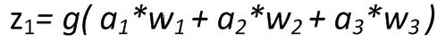
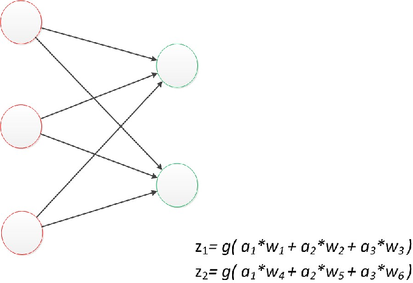
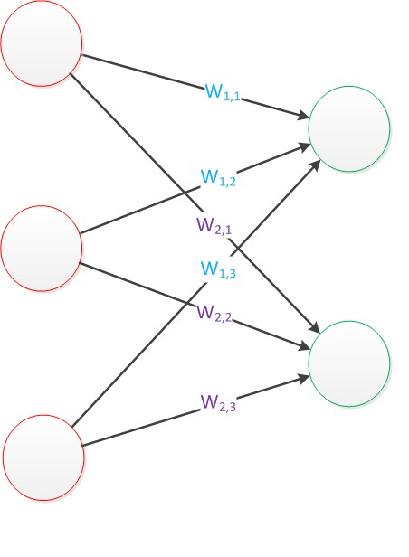
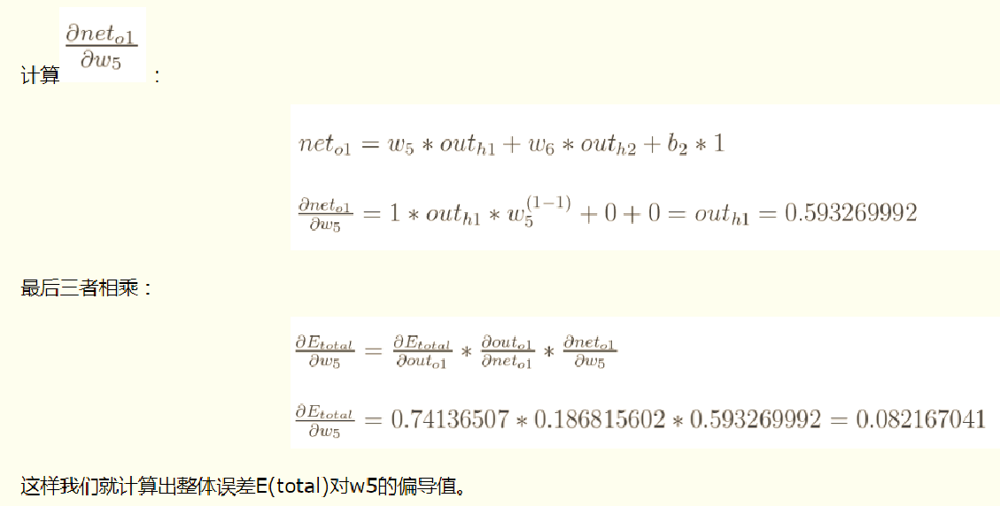

# 人工智能-神经网络-10
[toc]
## 神经网络基础
### 神经网络发展史
- 1943年，心理学家McCulloch和数学家Pitts合作提出了形式神经元的数学模型。这一模型一般被简称M-P神经网络模型，可以说，人工神经网络的研究时代，就由此开始了。
- 1949年，心理学家Hebb提出神经系统的学习规则，为神经网络的学习算法奠定了基础。 
- 1957年，F.Rosenblatt提出“感知器”(Perceptron)模型，第一次把神经网络的研究从纯理论的探讨付诸工程实践，掀起了人工神经网络研究的第一次高潮。
- 20世纪60年代以后，数字计算机的发展达到全盛时期，人们误以为数字计算机可以解决人工智能、专家系统、模式识别问题，而放松了对“感知器”的研究。人工神经网络的研究进入了低潮。
- 1982年，美国加州工学院物理学家Hopfield提出了离散的神经网络模型，标志着神经网络的研究又进入了一个新高潮。
- 1986年，Rumelhart和Meclelland提出多层网络的误差反传(back propagation)学习算法，简称BP算法。BP算法是目前最为重要、应用最广的人工神经网络算法之一。 
- 90年代中期，由Vapnik等人发明的SVM（Support Vector Machines，支持向量机）算法诞生，成为主流。SVM不是
真正的神经网络，但是线性分类部分与神经网络类似。
- 2006年，深度学习开始发展，产生深度置信网络DBN。
- 2012年，卷积神经网络CNN快速发展，并成为当前人工
智能研究的重要方向。 

### 神经网络基本概念
**生物神经元的基本结构**
- 一个神经元通常具有多个树突，主要用来接受传入信息；而轴突只有一条，轴突尾端有许多轴突末梢可以给其他多个神经元传递信息。轴突末梢跟其他神经元的树突产生连接，叫做突触，从而传递信号。

**真正的生物神经元到底如何系统工作，这个谜还未揭开。**

**模仿已知的部分建立简单的数学模型。**
- 神经元模型是一个包含输入，输出与计算功能的模型。输入可以类比为神经元的树突，而输出可以类比为神经元的轴突，计算则可以类比为细胞核。

**下图是一个典型的神经元模型：包含有3个输入，1个输出，以及2个计算功能。**
- 注意中间的箭头线。这些线称为“连接”。每个上有一个“权值”。

- ==连接==是神经元中最重要的东西。每一个连接上都有一个==权重==。
- 一个神经网络的**训练算法**就是让权重的值**调整到最佳**，以使得整个网络的预测效果最好。
- 使用a来表示输入，用w来表示权值。一个表示连接的有向箭头可以这样理解：在初端，传递的信号大小仍然是a，端中间有加权参数w，经过这个加权后的信号会变成a*w，因此在连接的末端，信号的大小就变成了a*w。
- 在其他绘图模型里，有向箭头可能表示的是值的不变传递。而在神经元模型里，每个有向箭头表示的是值的加权传递。

**如果我们将神经元图中的所有变量用符号表示，并且写出输出的计算公式的话，就是下图。**

经典的神经网络：这是一个包含三个层次的神经网络。红色的是输入层，绿色的是输出层，紫色的是中间层（也叫隐藏层）。输入层有3个输入单元，隐藏层有4个单元，输出层有2个单元。
- 设计一个神经网络时，输入层与输出层的节点数往往是固定的，中间层则可以自由指定；
- 神经网络结构图中的拓扑与箭头代表着预测过程时数据的流向，跟训练时的数据流有一定的区别；
- 结构图里的关键不是圆圈（代表“神经元”），而是连接线（代表“神经元”之间的连接）。每个连接线对应一个不同的权重（其值称为权值），**这是需要训练得到的**。

**从下到上的神经网络结构图**

## 简单神经网络
### MP模型
**z是在输入和权值的线性加权和叠加了一个函数g的值。在MP模型里，函数g是sgn函数，也就是取符号函数。这个函数当输入大于0时，输出1，否则输出0。**

- 对神经元模型的图进行一些扩展。sum函数与sgn函数合并到一个圆圈里，代表神经元的内部计算。输入a与输出z写到连接线的左上方，便于后面画复杂的网络。最后说明，一个神经元可以引出多个代表输出的有向箭头，但值都是一样的。
- 神经元可以看作一个计算与存储单元。计算是神经元对其的输入进行计算功能。存储是神经元会暂存计算结果，并传递到下一层。

### 理解神经元模型
- 我们有一个数据，称之为**样本**。样本有四个属性，其中三个属性已知，一个属性未知。我们需要做的就是通过三个已知属性**预测**未知属性。
- 具体办法就是使用神经元的公式进行计算。三个已知属性的值是a1，a2，a3，未知属性的值是z。z可以通过公式计算出来。
- 这里，已知的属性称之为**特征**，未知的属性称之为**目标**。假设特征与目标之间确实是线性关系，并且我们已经得到表示这个关系的权值w1，w2，w3。那么，我们就可以通过神经元模型预测新样本的目标。

### 感知器模型
- 首先在原来MP模型的“输入”位置添加神经元节点，标志其为“输入单元”。
- 在“感知器”中，有两个层次。分别是输入层和输出层。输入层里的“输入单元”只负责传输数据，不做计算。输出层里的“输出单元”则需要对前面一层的输入进行计算。
- 把需要计算的层次称之为“计算层”，并把拥有一个计算层的网络称之为“单层神经网络”

- **假如我们要预测的目标不再是一个值，而是一个向量，例如[2,3]。那么可以在输出层再增加一个“输出单元”。**

- **整个网络输出**

- 表达公式有一点不让人满意的就是：w4，w5，w6是后来加的，很难表现出跟原先的w1，w2，w3的关系。
- 改用二维的下标，用wx,y来表达一个权值。下标中的x代表后一层神经元的序号，而y代表前一层神经元的序号（序号的顺序从上到下）。
- 例如，w1,2代表后一层的第1个神经元与前一层的第2个神经元的连接的权值。

- 这两个公式就是线性代数方程组。因此可以用矩阵乘法来表达这两个公式。
- 例如，输入的变量是[a1，a2，a3]T（代表由a1，a2，a3组成的列向量），用向量a来表示。方程的左边是[z1，z2]T，用向量z来表示。
- 系数则是矩阵W（2行3列的矩阵，排列形式与公式中的一样）。
- 于是，输出公式可以改写成：g(W * a) = z;
- 这个公式就是神经网络中从前一层计算后一层的**矩阵运算**。

**感知器可以训练出一个线性分类器，对于线性可分的类别进行分类**

## 多层神经网络
### 两层神经网络
- 两层神经网络可以进行非线性的划分。两层是一个突破。
- 两层神经网络除了包含一个输入层，一个输出层以外，还增加了一个中间层。
- 权值矩阵增加到了两个，用上标来区分不同层次之间的变量。
- ax(y)代表第y层的第x个节点。

- 算最终输出z的方式是利用了中间层的a1(2)，a2(2)和第二个权值矩阵计算得到的

- 如果预测目标是一个向量，那么与前面类似，只需要在“输出层”再增加节点即可。
- 使用向量和矩阵来表示层次中的变量。a(1)，a(2)，z是网络中传输的向量数据。W(1)和W(2)是网络的矩阵参数。
- 使用矩阵运算来表达整个计算公式的话如下：

	g(W(1) * a(1)) = a(2); 
	g(W(2) * a(2)) = z;

- 至今为止，对神经网络的结构图的讨论中都没有提到偏置节点（bias unit）。事实上，这些节点是默认存在的。
- 它本质上是一个只含有存储功能，且存储值永远为1的单元。
- 在神经网络的每个层次中，除了输出层以外，都会含有这样一个偏置单元。正如线性回归模型与逻辑回归模型中的一样。
- 偏置单元与后一层的所有节点都有连接，设这些参数值为向量b，称之为偏置

- 偏置节点很好认，因为其没有输入（前一层中没有箭头指向它）。有些神经网络的结构图中会把偏置节点明显画出来，有些不会。一般情况下，都不会明确画出偏置节点。 
- 在考虑了偏置以后的一个神经网络的矩阵运算如下：

	g(W(1) * a(1) + b(1)) = a(2); 
	g(W(2) * a(2) + b(2)) = z;

### 激活函数
- 在神经网络中，把函数g称作激活函数（active function），对线性加权结果进行一个非线性的变换
- 常见的激活函数
    1. sigmod函数
    2. tanh函数
    3. ReLU函数
    4. ELU函数
    5. PReLU函数

#### sigmod函数

#### tanh函数

#### ReLU函数
- 目前比较火的一个激活函数，相比于sigmod函数和tanh函数，它有以下几个优点：
    1)  在输入为正数的时候，不存在梯度消失等问题（梯度消失等问题是sigmod函数本身的性质引起的）。
    2)  计算速度要快很多。ReLU函数只有线性关系，不管是前向传播还是反向传播，都比sigmod和tanh要快很多。（sigmod和tanh要计算指数，计算速度会比较慢）

#### ELU函数

#### PReLU函数

## 训练与损失
- 机器学习模型训练的目的，就是使得参数尽可能的与真实的模型逼近。
- 具体做法:
    1. 首先给所有参数赋上随机值。
    2. 使用这些随机生成的参数值，来预测训练数据中的样本。样本的预测目标为yp，真实目标为y。那么，定义一个值loss:  
          loss = (yp - y)²
    目标就是使对所有训练数据的损失和尽可能的小

## 梯度下降
- 训练的本质是损失函数的优化问题：什么样的权重参数可以使得函数值最小？
    1. 首先记住：权重初始值是随机的
    2. 要迭代的更新权重
    3. 为了加快训练速度，希望尽快到达最小值
    4. 假设右边是变量的损失函数图，可以看到梯度方向上函数值变化最快

- 梯度：数学上的求导。
- 一般来说解决这个优化问题使用的是**梯度下降**算法
- 梯度下降算法每次计算参数在当前的梯度，然后让参数向着梯度的反方向前进一段距离，不断重复，直到梯度接近零时截止。一般这个时候，所有的参数恰好达到使损失函数达到一个最低值的状态
- 在神经网络模型中，由于结构复杂，每次计算梯度的代价很大。因此还需要使用**反向传播**算法。

## 反向传播
- 反向传播算法是利用了神经网络的结构进行的计算。
- 不一次计算所有参数的梯度，而是从后往前。
- 首先计算输出层的梯度，然后是第二个参数矩阵的梯度，接着是中间层的梯度，再然后是第一个参数矩阵的梯度，最后是输入层的梯度。
- 计算结束以后，所要的参数矩阵的梯度就都有了。

## 反向传播例子
- 假设有这样一个网络层
    1. 第一层是输入层，包含两个神经元i1，i2，和截距项b1
    2. 第二层是隐含层，包含两个神经元h1,h2和截距项b2
    3. 第三层是输出o1,o2，每条线上标的wi是层与层之间连接的权重
    4. 激活函数为sigmoid函数

- 现在对他们赋上初值
- 输入数据  i1=0.05，i2=0.10;
- 输出数据 o1=0.01, o2=0.99;
- 初始权重 
    w1=0.15,w2=0.20,w3=0.25,w4=0.30;
    w5=0.40,w6=0.45,w7=0.50,w8=0.55
- 目标：给出输入数据i1,i2(0.05和0.10)，使输出尽可能与原始输出o1,o2(0.01和0.99)接近。

### 前向传播

### 反向传播

