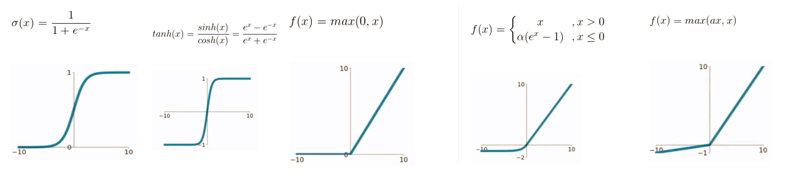

# 人工智能-深度学习-基本知识-11
[toc]
## 卷积神经网络基本原理
### 一维卷积
    长度为5，值为[1,2,-1,1,-3]
    卷积核大小为3，值为[1,0,-1]
    在没有填充的情况下，两端的值无法运算，中间三个值与卷积核的值相加求和
    1*1+0*2+(-1)*(-1) = 2
    1*2+0*(-1)+(-1)*1 = 1
    1*(-1)+0*1+(-1)*(-3) =2 

    输出维度与输入维度保持一致，需要填充padding
    输入长度为5，值为[1,2,-1,1,-3]
    卷积核大小为3，值为[1,0,-1]
    

    输入长度为5，值为[1,2,-1,1,-3]
    卷积核大小为3，值为[1,0,-1]
    步长：stride下面分别是步长1和步长2

### 二维卷积

**二维卷积的padding**

    图像就是像素组成的矩阵，常见有灰度和
    彩色图像，彩色是RGB三通道，灰度一个
    通道。
    对于一个通道来说，每个像素的值是
    0-255，0是黑色，255是白色

    图像是一个像素的二维矩阵，可以看到不同的卷积后
    *可以获取到图像不同的特征，卷积的本质是获取图像的特征，*
    不同的卷积核，获取不同的特征

**ConvNet 有四个主要操作：**

    1. 卷积
    2. 激活/非线性处理（ReLU，Sigmoid，tanh等）
    3. 池化或者亚采样
    4. 分类（全连接层）

**在神经网络中，激活函数对线性加权结果进行一个非线性的变换，常见的激活函数包括：sigmod函数，tanh函数，ReLU函数，ELU函数，PReLU函数**

#### 空间池化
- 空间池化（Spatial Pooling）（也叫做亚采用或者下采样）降低了各个特征图的维度，但可以保持大部分重要的信息。空间池化有下面几种方式：**最大化、平均化、加和**等等。
- 对于最大池化（Max Pooling），定义一个空间邻域（比如，2x2 的窗口），并从窗口内的修正特征图中取出最大的元素。除了取最大元素，也可以取平均（Average Pooling）或者对窗口内的元素求和。在实际中，最大池化被证明效果更好一些。
- 下面的图展示了使用 2x2 窗口在修正特征图（在卷积 + ReLU 操作后得到）使用最大池化的例子。
在实际应用中也有先卷积+池化，然后进行激活/非线性操作的，根据实际应用和项目进行实验哪个效果更好。

在下图展示的网络中，池化操作是分开应用到各个特征图的（注意，因为这样的操作，可以从三个输入图中得到三个输出图）。

**在 ReLU 操作后得到的修正特征图的池化操作的效果如下图。**

池化函数可以逐渐降低输入表示的空间尺度。特别地，池化还有其他重要功能：
1. 使输入表示（特征维度）变得更小，并且网络中的参数和计算的数量更加可控的减小，因此，可以控制过拟合
2. 使网络对于输入图像中更小的变化、冗余和变换变得不变性（输入的微小冗余将不会改变池化的输出——因为在局部邻域中使用了最大化/平均值的操作。）
3. 帮助获取图像最大程度上的尺度不变性。它非常的强大，因为可以检测图像中的物体，无论它们位置在哪里

#### 全连接层
全连接层就是传统的多层感知器/人工神经网络，在输出层使用的是 softmax 激活函数进行分类。全连接（Fully Connected / FC）这个词表明前面层的所有神经元都与下一层的所有神经元连接，这就是传统神经网络的连接方式。卷积和池化层的输出表示了输入图像的高级特征。全连接层的目的是为了使用这些特征把输入图像基于训练数据集进行分类。

首先看最后一个卷积层的结果是16@5x5，表示有16个5x5大小的特征图像。如果要进行全连接，需要将这些特征图像按照顺序拉伸到一维空间并进行合并， 16@5x5就有16x5x5=400个像素点，组成一个一维的特征向量，有400个特征，对应400个神经元，全连接两个隐藏层，神经元分别是120和84，最后输出的10个神经元进行分类，**整体网络结构是(400,120,84,10)**

### 损失函数

**均方误差**(Mean Square Error, MSE)是最常用的回归损失函数，计算方法是求预测值与真实值之间距离的平方和

**对数损失**（Log Loss）亦被称为逻辑回归损失（Logistic regression loss）或**交叉熵损失**（Cross-entropy loss）,是最常用的分类损失函数

## 深度学习框架与网络模型
### 人工智能、机器学习与深度学习

### 深度学习的流程
- 训练阶段:
    - 输入大量带标注动物图片，训练网络学会辨别
- 推理阶段：
    - 输入未标注图片
    - 提取图片内容的低层特征，如轮廓
    - 分析提取高层的结构特征，如四肢
    - 分析获得顶层的抽象概念，如动物类型
    - 基于前期训练结果，预测图片内容

### 深度学习的算法
- 深度学习典型算法为卷积神经网络，以2层卷积为例，算法为：
    - 输入图像与滤波器、偏置进行卷积，产生卷积层的特征映射图
    - 卷积层特征映射图经求和，加权值，偏置，函数处理得到采样层
    - 采样层重复上述流程处理后产生新的采样层
    - 全连接层提取归类获得足够好的高层特征表达信息

- 一层卷积学到的特征是局部的，层数越高，特征就越全局化。

### 深度学习的开源框架
- 深度学习开源框架层出不穷，用来实现深度学习算法
    - 避免重复工作，降低算法门槛
    - Google、Microsoft、Facebook 等均发布深度学习框架
- 谷歌TensorFlow占绝对优势
    - 强大的人工智能研发水平、快速的迭代更新
- 谷歌2015年底发布开源深度学习框架TensorFlow
    - Tensor（张量）：多维数组在高维空间的数学运算
    - Flow（流）：基于数据流图的计算
- TensorFlow关键特性
    - 代码简洁多语言支持
    - 分布式算法执行效率高
    - 移值灵活伸缩性好
    - 支持多种神经网络算法

### 深度学习硬件加速方式
- 当前深度学习硬件加速方式主要有 CPU、GPU 、FPGA 、DSP、ASIC

#### CPU
- 通用级加速方式，高度灵活性和易用性
- 架构上有先天弱势
    - 运算能力较弱
    - 访存带宽受限
- 代表：Intel Xeon Phi系列芯片、高通骁龙820
- 案例：Google Brain项目用16000个CPU Core的并行计算平台保证训练算法速度，通过观看YouTube的视频，识别出猫

#### GPU
- SIMD方式，计算能力强，并行度支持好
- 通用性，并非针对深度学习
    - 运行效率受影响
    - 能耗仍较大
- 代表： NVIDIA Tesla P100 GPU
- 案例：基于GPU深度学习加速受到谷歌、微软、IBM以及百度等企业青睐；在汽车和先进驾驶辅助系统(ADAS)方面与众多车企进行合作

#### FPGA
- 能效较高且硬件配置灵活
    - 顶级GPU性能的1/5，能效相当
    - 相比CPU，性能提升1个数量级，能效提升2个数量级
    - 增长的门资源和内存带宽带来更大的设计空间
    - 省去ASIC方案所需流片过程
    - 代表：DeephiTech（深鉴科技）、Xilinx 、Altera
- 案例：微软用Altera FPGA 实现基于卷积神经网络的数据中心加速，效能优异。算法用于图像分类、图像识别及自然语言处理

#### DSP
- 用传统SIMD/DSP架构来适配
- 运算逻辑作修改，以适用卷积神经网络
- 对深度学习全面计算能力支持不足
- 核心数量较少，并行性支持较差
- 代表：Cadence的Tensilica Vision P5处理器、Synopsys的EV处理器、中星微视频处理芯片星光智能一号
- 案例：星光智能一号广泛应用于高清视频监控、智能驾驶辅助、无人机、机器人等嵌入式机器视觉领域

#### ASIC
- 阻碍深度学习发展的瓶颈仍是算法速度
- 传统处理器需要多条指令才能完成一个神经元的处理
- ASIC根据深度学习算法定制：处理效率、能效均最高
- 代表：Cambricon（寒武纪科技）DianNao芯片、谷歌的TPU芯片、Horizon Robotics（地平线机器人）BPU芯片
- 案例：基于TPU的AlphaGo与围棋冠军李世石人机大战，总比分4:1获胜

### 深度学习硬件加速方式比较
加速方式 | 优点 | 缺点
---|---|---
CPU | 通用结构、可独立工作 | 通用性导致效率和能效比低
GPU | 强大的并行计算能力 | 通用性导致效率受影响、能耗大
FPGA | 灵活性好、设计空间大、省去流片过程 | 效能与功耗上不能更紧密适配算法、成本高
DSP | 改动小、计算能力较高 | 缺乏深度学习全面计算能力、核心数量较少，并行性支持较差
ASIC | 能效比最好 | 灵活性差、缺乏通用潜力、成本较高

### 其他人工神经网络芯片
- 上述均为基于深度学习的加速芯片。作为人工神经网络芯片，还有另外一支，是从类似或模拟生物神经系统来实现的神经形态网络芯片（类脑芯片）
- 代表：IBM TrueNorth（真北）、Brainchip等

