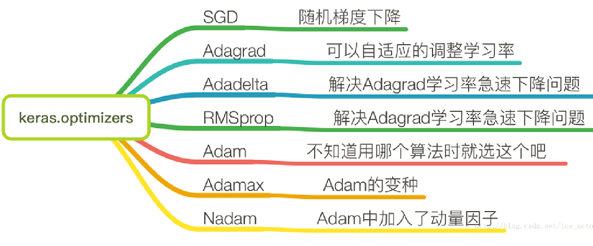

# 人工智能-深度学习-keras知识-13
[toc]
## Keras简介
英文官网 https://keras.io/

对应中文 https://keras-cn.readthedocs.io/en/latest/

Keras是基于Tensorflow等的一个深度学习框架，它的设计参考了Torch，用Python语言编写，是一个高度模块化的神经网络库，支持GPU和CPU。2015年流行起来的，使用中遇到的困惑或者问题可以提交到
      github：https://github.com/fchollet/keras。

Keras主要包括14个模块包，可参见文档https://keras.io/layers/ ，主要包  
    括Models、Layers、Initializations、Activations、Objectives、Optimizers 
    、Preprocessing、metrics等。具体模块的应用会融入到我们的具体应用
     例子中来。

## Keras顺序模型
**keras构建的第一个单层的神经网络：**

	1. 输入层的神经元个数（维度）为784，输出层神经元个数（维度）为10
	2. 从输入层到输出层的维度变化结构为：(784,10)

将单层网络扩展为多层网络。构建四层神经网络，将原有的单层神经网络（784,10）加宽和加深，其他参数都不变。从输入层到输出层的维度变为：（784,400,200,100,10）

中间增加了三个隐含层，神经元个数分别为400，200，100


## 模型的基本评估方法
### 训练集，验证集与测试集


### N折/倍交叉验证

> 注意：如果数据量过大，则不适合过多的交叉验证，耗时太多，适于小样本集

### 使用sklearn的分割数据对keras模型进行交叉认证
```
"""
直接使用sklearn的分割数据对keras模型进行交叉认证
"""

from keras.models import Sequential
from keras.layers import Dense
import numpy as np
from sklearn.model_selection import StratifiedKFold
import keras
from keras.layers.core import Dense, Dropout, Activation  
from keras.optimizers import SGD  

path='F:/2019-notebook/2017_2018_2/python_code/MTrain/MachineLearn/3_ML/8_deeplearning/1_1_keras_basic/3.1_seq_eval/mnist.npz'
f = np.load(path)
X_train, Y = f['x_train'], f['y_train']
f.close()

# 由于mist的输入数据维度是(num, 28, 28)，这里需要把后面的维度直接拼起来变成784维  
X = X_train.reshape(X_train.shape[0], X_train.shape[1] * X_train.shape[2]) 

# 交叉验证分成五分 shuffle表示随机划分
k_fold = StratifiedKFold(n_splits=5, random_state=1, shuffle=True)
cv_scores = []

# 创建模型
model = Sequential()
# 开始快速构建一个单层的神经网络：一个输入和一个输出层
# 一般来说，输入层不进行计算，只是传输数据，不能算作一层
model.add(Dense(10,input_shape=(784,))) 
model.add(Activation('softmax')) 

# 设置训练参数
model.compile(loss=keras.metrics.categorical_crossentropy, optimizer=keras.optimizers.Adadelta(), metrics=['accuracy'])

for train, val in k_fold.split(X, Y): # Y [0,9]
    # 转为one-hot数据
    Y_train = keras.utils.np_utils.to_categorical(Y[train], 10)

    # 训练模型
    model.fit(X[train], Y_train, epochs=5, batch_size=200, verbose=0)

    Y_val = keras.utils.np_utils.to_categorical(Y[val], 10)

    # 评估模型
    scores = model.evaluate(X[val], Y_val, verbose=0)

    # 输出评估结果
    print('%s: %.2f%%' % (model.metrics_names[1], scores[1] * 100))
    cv_scores.append(scores[1] * 100)

# 输出均值和标准差
print('%.2f%% (+/- %.2f%%)' % (np.mean(cv_scores), np.std(cv_scores)))
```

### verbose学习和从训练集中自动获取一定的比例的数据同步验证模型，手动划分一定比例从验证模型
```
import keras
from keras.models import Sequential  
from keras.layers.core import Dense, Dropout, Activation  
from keras.optimizers import SGD  
from keras.datasets import mnist  
import numpy

"""
构建四层神经网络，将原有的单层神经网络784,10加宽和加深，其他参数都不变
从输入层到输出层的维度为：784,400,200,100,10
"""

# 选择模型 
model = Sequential()

# 开始快速构建一个四层的神经网络：三个隐藏层和一个输出层
# 一般来说，输入层不进行计算，只是传输数据，不能算作一层

# 创建第一个隐藏层，输入神经元28*28（784）个，隐藏层神经元400个
model.add(Dense(400,input_shape=(784,))) 
model.add(Activation('tanh'))  

# 创建第二个隐藏层，神经元200个
model.add(Dense(200))
model.add(Activation('tanh'))  

# 创建第三个隐藏层，神经元100个
model.add(Dense(100))
model.add(Activation('tanh'))  
model.add(Dropout(0.5))

# 创建输出层，输出的结果是10个数字类别，所以输出层是10个神经元的维度
model.add(Dense(10))   
model.add(Activation('softmax')) 

# 设置训练参数
model.compile(loss=keras.metrics.categorical_crossentropy, optimizer=keras.optimizers.Adadelta(), metrics=['accuracy'])

# 网络下载需要翻墙，先从网上下载数据集后再处理
path='F:/2019-notebook/2017_2018_2/python_code/MTrain/MachineLearn/3_ML/8_deeplearning/1_1_keras_basic/3.1_seq_eval/mnist.npz'
f = numpy.load(path)
X_train, y_train = f['x_train'], f['y_train']
X_test, y_test = f['x_test'], f['y_test']
f.close()


# 由于mist的输入数据维度是(num, 28, 28)，这里需要把后面的维度直接拼起来变成784维  
X_train = X_train.reshape(X_train.shape[0], X_train.shape[1] * X_train.shape[2]) 
X_test = X_test.reshape(X_test.shape[0], X_test.shape[1] * X_test.shape[2])  

# 转为one-hot数据
Y_train = keras.utils.np_utils.to_categorical(y_train, 10)
Y_test = keras.utils.np_utils.to_categorical(y_test, 10)

# 开始训练
# model.fit(X_train,Y_train,batch_size=200,epochs=10,shuffle=True,verbose=1)

# 学习增加验证部分，从训练集中自动获取一定的比例的数据同步验证模型
model.fit(X_train,Y_train,batch_size=200,epochs=10,shuffle=True,verbose=2,validation_split=0.2)

# X_train_new, X_validation, Y_train_new, Y_validation = train_test_split(X_train, Y_train, test_size=0.2, random_state=1)
# model.fit(X_train_new, Y_train_new, validation_data=(X_validation, Y_validation), epochs=10, batch_size=200, verbose=1)
```

## scikit_learn内容（为keras做准备）
### scikit_learn介绍
为何要对scikit_learn进行介绍和部分内容的学习？

因为keras对该模块的模型评估和调参等部分进行了封装，所以对该部分了解后，再学习keras封装后的部分就一目了然了！

1. SciPy，SciPy是一个开源的基于Python的科学计算工具包。
2. Scikits，基于SciPy针对不同的应用领域发展出众多的分支版本，他们统一称为Scikits，即SciPy工具包的意思
3. Scikit-learn，是基于SciPy针对机器学习领域发展出的一个分支版本
4. **Scikit-learn本身不支持深度学习**
5. **Scikit-learn不支持GPU加速**

scikit-learn的基本功能主要被分为六大部分：分类，回归，聚类，数据降维，模型选择和数据预处理

### 基于流水线的工作流
可以将定义好的多个步骤统一执行
比如下面代码将数据标准化，PCA降维，逻辑归回定义到一个pipeline统一执行。
```
pipe_lr = make_pipeline(StandardScaler(),   
                        PCA(n_components=2),
                        LogisticRegression(random_state=1))
```

**代码演示**
```
"""
为了衔接作用，讲下sklearn中进行模型评估和调参的总结，下一部分看到，keras中做了类似封装
这样使得keras中评估和调参也很方便
"""

# In[3]:
import os
import pandas as pd

root_dir = 'C:/video/机器学习/12 （必修）第八部分：深度学习/5 文本分类之课件 1_1_keras_basic/3.2_Scikit_Eval_Tuning/'
df = pd.read_csv(root_dir + 'wdbc.data', header=None)

df.head()


# In[4]:

df.shape


# In[5]:

from sklearn.preprocessing import LabelEncoder

# .values使dataframe数据变成数组数据，如果不用.values将是dataframe数据
X = df.loc[:, 2:].values
y = df.loc[:, 1].values
le = LabelEncoder()
# 类别从0开始编码数值
y = le.fit_transform(y)


# In[7]:


from sklearn.model_selection import train_test_split

X_train, X_test, y_train, y_test =     train_test_split(X, y, 
                     test_size=0.20,
                     stratify=y,
                     random_state=1)


# In[8]:

# 使用sklearn的pipeline方法，可以看出非常方便和简洁
from sklearn.preprocessing import StandardScaler
from sklearn.decomposition import PCA
from sklearn.linear_model import LogisticRegression
from sklearn.pipeline import make_pipeline

pipe_lr = make_pipeline(StandardScaler(),
                        PCA(n_components=2),
                        LogisticRegression(random_state=1))

pipe_lr.fit(X_train, y_train)
y_pred = pipe_lr.predict(X_test)
print('Test Accuracy: %.3f' % pipe_lr.score(X_test, y_test))


# In[9]:

import numpy as np
from sklearn.model_selection import StratifiedKFold
# 交叉验证方法1    
kfold = StratifiedKFold(n_splits=5, random_state=1).split(X_train, y_train)

scores = []
for k, (train, test) in enumerate(kfold):
    pipe_lr.fit(X_train[train], y_train[train])
    score = pipe_lr.score(X_train[test], y_train[test])
    scores.append(score)
    print('Fold: %2d, Class dist.: %s, Acc: %.3f' % (k+1,
          np.bincount(y_train[train]), score))
    
print('\nCV accuracy: %.3f +/- %.3f' % (np.mean(scores), np.std(scores)))
```

### 使用k折交叉验证评估模型性能
一个专门的交叉验证方法：cross_val_score


**留一法：leave one out**

K折交叉验证的特例

每次一个样本用于验证，其他样本用于训练，适于数据集非常小的情况。

当数据量比较大的时候，实验证明留一法与一般的交叉验证性能基本没有区别。

```
# In[9]:

import numpy as np
from sklearn.model_selection import StratifiedKFold
# 交叉验证方法1    
kfold = StratifiedKFold(n_splits=5, random_state=1, shuffle=True).split(X_train, y_train)

scores = []
for k, (train, test) in enumerate(kfold):
    pipe_lr.fit(X_train[train], y_train[train])
    score = pipe_lr.score(X_train[test], y_train[test])
    scores.append(score)
    print('Fold: %2d, Class dist.: %s, Acc: %.3f' % (k+1,
          np.bincount(y_train[train]), score))
    
print('\nCV accuracy: %.3f +/- %.3f' % (np.mean(scores), np.std(scores)))


# In[13]:

# 交叉验证方法2
from sklearn.model_selection import cross_val_score

# n_jobs表示使用处理器数量
scores = cross_val_score(estimator=pipe_lr,
                         X=X_train,
                         y=y_train,
                         cv=5,
                         n_jobs=1)
print('CV accuracy scores: %s' % scores)
print('CV accuracy: %.3f +/- %.3f' % (np.mean(scores), np.std(scores)))
```

### 通过学习及验证曲线来调试算法
#### 学习曲线
使用学习曲线判定方差与偏差问题


通过图可以发现，模型在验证集上表现良好。但是，训练准确率和验证准确率还是存在较小的差距，这意味着，模型存在轻微的过拟合


#### 验证曲线
准确率与模型参数之间的关系

看一个例子

最优点在C=0.1附近


```
# In[15]:
# 绘制学习曲线：是观察随着数据集数量的增加，对训练集和验证集性能影响
import matplotlib.pyplot as plt
from sklearn.model_selection import learning_curve

pipe_lr = make_pipeline(StandardScaler(), LogisticRegression(penalty='l2', random_state=1))

# cv代表交叉验证
train_sizes, train_scores, test_scores = learning_curve(estimator=pipe_lr,
                               X=X_train,
                               y=y_train,
                               train_sizes=np.linspace(0.1, 1.0, 10),
                               cv=10,
                               n_jobs=1)
# In[]
# train_sizes 表示每一次训练集的大小，下面表示将训练集分成10个大小，
# 每次训练分别取总数据的0.1，0.2直到1（表示取所有数据）
np.linspace(0.1, 1.0, 10)

# In[]
# 返回每次训练的样本数，及训练和验证的准确率
train_sizes, train_scores, test_scores


# In[]
train_mean = np.mean(train_scores, axis=1)
train_std = np.std(train_scores, axis=1)
test_mean = np.mean(test_scores, axis=1)
test_std = np.std(test_scores, axis=1)

plt.plot(train_sizes, train_mean,
         color='blue', marker='o',
         markersize=5, label='training accuracy')

plt.fill_between(train_sizes,
                 train_mean + train_std,
                 train_mean - train_std,
                 alpha=0.15, color='blue')

plt.plot(train_sizes, test_mean,
         color='green', linestyle='--',
         marker='s', markersize=5,
         label='validation accuracy')

plt.fill_between(train_sizes,
                 test_mean + test_std,
                 test_mean - test_std,
                 alpha=0.15, color='green')

plt.grid()
plt.xlabel('Number of training samples')
plt.ylabel('Accuracy')
plt.legend(loc='lower right')
plt.ylim([0.8, 1.03])
plt.tight_layout()
#plt.savefig('images/06_05.png', dpi=300)
plt.show()


# In[16]:
# 绘制验证曲线：观察超参数对于性能的影响
# 下面是观察逻辑回归的正则化系数
from sklearn.model_selection import validation_curve


param_range = [0.001, 0.01, 0.1, 1.0, 10.0, 100.0]
train_scores, test_scores = validation_curve(
                estimator=pipe_lr, 
                X=X_train, 
                y=y_train, 
                param_name='logisticregression__C', 
                param_range=param_range,
                cv=10)

train_mean = np.mean(train_scores, axis=1)
train_std = np.std(train_scores, axis=1)
test_mean = np.mean(test_scores, axis=1)
test_std = np.std(test_scores, axis=1)

plt.plot(param_range, train_mean, 
         color='blue', marker='o', 
         markersize=5, label='training accuracy')

plt.fill_between(param_range, train_mean + train_std,
                 train_mean - train_std, alpha=0.15,
                 color='blue')

plt.plot(param_range, test_mean, 
         color='green', linestyle='--', 
         marker='s', markersize=5, 
         label='validation accuracy')

plt.fill_between(param_range, 
                 test_mean + test_std,
                 test_mean - test_std, 
                 alpha=0.15, color='green')

plt.grid()
plt.xscale('log')
plt.legend(loc='lower right')
plt.xlabel('Parameter C')
plt.ylabel('Accuracy')
plt.ylim([0.8, 1.0])
plt.tight_layout()
# plt.savefig('images/06_06.png', dpi=300)
plt.show()

```
### 使用网格搜索调优机器学习模型
#### 网格搜索
在机器学习中，有两类参数：一类通过**训练数据学习得到的参数**，比如神经网络的权重参数。另一类即为**调优参数，也称超参**。比如神经网络的层数，每层神经元个数，正则化系数，决策树的深度等。

一种功能强大的超参数优化技巧：网格搜索，它通过寻找最优的超参值得组合以进一步提高模型得性能。

网格搜索法非常简单，它通过对我们指定得不同超参列表进行暴力穷举搜索，并计算估计每个组合对模型性能的影响，以获得参数的最优组合

看一个代码例子

```
# In[17]:
### 直接使用5倍交叉验证进行网格搜索调参

from sklearn.model_selection import GridSearchCV
from sklearn.svm import SVC

pipe_svc = make_pipeline(StandardScaler(),
                         SVC(random_state=1))

param_range = [0.0001, 0.001, 0.01, 0.1, 1.0, 10.0, 100.0, 1000.0]

param_grid = [{'svc__C': param_range, 
               'svc__kernel': ['linear']},
              {'svc__C': param_range, 
               'svc__gamma': param_range, 
               'svc__kernel': ['rbf']}]

gs = GridSearchCV(estimator=pipe_svc, 
                  param_grid=param_grid, 
                  scoring='accuracy', 
                  cv=5,
                  n_jobs=-1)
gs = gs.fit(X_train, y_train)
print(gs.best_score_)
print(gs.best_params_)


# In[18]:
# 测试集上进行测试
clf = gs.best_estimator_
clf.fit(X_train, y_train)
print('Test accuracy: %.3f' % clf.score(X_test, y_test))
```

#### 嵌套交叉验证
上个例子是结合网格搜索进行k折交叉验证，通过超参数值的改动对机器学习模型进行调优。

如果需要在不同机器学习算法之间做选择，则可以使用嵌套交叉验证。**研究表明：使用嵌套交叉验证，估计的真实误差与在测试集上得到的结果几乎没有差距**

方法：
在嵌套交叉验证的外围循环中，将数据划分为训练块及测试块，**用于模型参数训练（第一类参数）和模型验证**。在内部循环中，则基于这些训练块使用网格搜索k折交叉验证进行**超参调优（第二类参数）**

完成模型选择后，使用测试块进行模型性能的评估

图示为5个外围块和2个内部块的嵌套交叉验证。称作5x2交叉验证。外围循环使用分层5折交叉验证，将训练数据划分为5组。每组的训练块传入网格搜索，之后通过网格搜索获得最优的模型。**5组数据对应5个模型，之后使用对应的测试块测试准确率，并将5个模型的准确率结果求平均作为该算法的表现。**

```
# In[20]:

## 对多个机器模型进行选择
## 由于如果参数过多的话，网格搜索比较费时间，为了再一定程度上进行减少训练时间
## 一种常见的方案是网格搜索的时候使用小数值的交叉验证，比如cv=2
## 低于最佳模型，使用更高的比如cv=5的交叉验证
gs = GridSearchCV(estimator=pipe_svc,
                  param_grid=param_grid,
                  scoring='accuracy',
                  cv=2)

scores = cross_val_score(gs, X_train, y_train, 
                         scoring='accuracy', cv=5)
print('CV accuracy: %.3f +/- %.3f' % (np.mean(scores),
                                      np.std(scores)))


# In[21]:

#  换成决策树模型，进行同样的调参方法
from sklearn.tree import DecisionTreeClassifier

gs = GridSearchCV(estimator=DecisionTreeClassifier(random_state=0),
                  param_grid=[{'max_depth': [1, 2, 3, 4, 5, 6, 7, None]}],
                  scoring='accuracy',
                  cv=2)

scores = cross_val_score(gs, X_train, y_train, 
                         scoring='accuracy', cv=5)
print('CV accuracy: %.3f +/- %.3f' % (np.mean(scores), 
                                      np.std(scores)))

```

### 不同的性能评价指标
**参考前面的内容**
```
# In[23]:
### 混淆矩阵

from sklearn.metrics import confusion_matrix

pipe_svc.fit(X_train, y_train)
y_pred = pipe_svc.predict(X_test)
confmat = confusion_matrix(y_true=y_test, y_pred=y_pred)
print(confmat)


# In[24]:


fig, ax = plt.subplots(figsize=(2.5, 2.5))
ax.matshow(confmat, cmap=plt.cm.Blues, alpha=0.3)
for i in range(confmat.shape[0]):
    for j in range(confmat.shape[1]):
        ax.text(x=j, y=i, s=confmat[i, j], va='center', ha='center')

plt.xlabel('Predicted label')
plt.ylabel('True label')

plt.tight_layout()
#plt.savefig('images/06_09.png', dpi=300)
plt.show()


# In[28]:

# 更多的分类评价性能

from sklearn.metrics import precision_score, recall_score, f1_score

print('Precision: %.3f' % precision_score(y_true=y_test, y_pred=y_pred))
print('Recall: %.3f' % recall_score(y_true=y_test, y_pred=y_pred))
print('F1: %.3f' % f1_score(y_true=y_test, y_pred=y_pred))


# In[30]:
## 在交叉验证中使用f1_score评价

from sklearn.metrics import make_scorer

scorer = make_scorer(f1_score, pos_label=0)

c_gamma_range = [0.01, 0.1, 1.0, 10.0]

param_grid = [{'svc__C': c_gamma_range,
               'svc__kernel': ['linear']},
              {'svc__C': c_gamma_range,
               'svc__gamma': c_gamma_range,
               'svc__kernel': ['rbf']}]

gs = GridSearchCV(estimator=pipe_svc,
                  param_grid=param_grid,
                  scoring=scorer,
                  cv=5,
                  n_jobs=-1)
gs = gs.fit(X_train, y_train)
print(gs.best_score_)
print(gs.best_params_)
```

## scikit_learn的keras封装
### 简介
**Keras**专注于快速构建深度学习模型

**Scikit-learn**是非常优秀的机器学习库，前面已经对模型评估做了一个比较详细的介绍

**Scikit-learn**所提供的很多模型评估方法同样适用于深度学习

**Keras**对**Scikit-learn**进行了封装，提供一个封装类**Wrapper**，这样就可以方便的调用**scikit-learn**中的方法。

两个重要的封装模型：**kerasClassifier**，用于分类模型；**kerasRegressor**，用于回归模型。

### keras封装的交叉验证
```
"""
keras对sklearn方法的封装，可以非常方便的将sklearn的方法用到keras
"""

from keras.models import Sequential
from keras.layers import Dense
import numpy as np
from sklearn.model_selection import cross_val_score
from sklearn.model_selection import StratifiedKFold
from keras.wrappers.scikit_learn import KerasClassifier

# 模型
def create_model():
    model = Sequential()
    model.add(Dense(units=8, input_dim=8, activation='tanh'))
    model.add(Dense(units=8, activation='tanh'))
    model.add(Dense(units=1, activation='sigmoid'))
    model.compile(loss='binary_crossentropy', optimizer='adam', metrics=['accuracy'])
    return model

# 数据
root_dir = 'C:/PycharmProjects/py366/3.3_Wrap_Scikit/'
dataset = np.loadtxt(root_dir + 'pima-indians-diabetes.csv', delimiter=',')
x = dataset[:, 0 : 8]
Y = dataset[:, 8]

# 模型封装
model = KerasClassifier(build_fn=create_model, epochs=2, batch_size=10, verbose=0)

# 交叉验证
kfold = StratifiedKFold(n_splits=5, shuffle=True, random_state=1)
results = cross_val_score(model, x, Y, cv=kfold)
print(results.mean())

```
### keras封装的网格搜索
**对超参数的搜索**
```
from keras.models import Sequential
from keras.layers import Dense,Activation
import numpy as np
from sklearn.model_selection import GridSearchCV
from keras.wrappers.scikit_learn import KerasClassifier
import keras

# data
root_dir = 'C:/PycharmProjects/py366/3.3_Wrap_Scikit/'
path = root_dir + 'mnist.npz'
f = np.load(path)
X_train, Y_train = f['x_train'], f['y_train']
f.close()

X_train = X_train[0:500][:][:]
Y_train = Y_train[0:500]

# 转一维数据
X_train = X_train.reshape(X_train.shape[0], X_train.shape[1] * X_train.shape[2]) 
# 转为one-hot数据
Y_train = keras.utils.np_utils.to_categorical(Y_train, 10)

# model
def create_model(optimizer='adam', init='glorot_uniform'):
    model = Sequential()
    model.add(Dense(10, kernel_initializer=init, input_shape=(784,))) 
    model.add(Activation('softmax')) 
    model.compile(loss=keras.metrics.categorical_crossentropy, optimizer=optimizer, metrics=['accuracy'])
    return model

# wrap scikit-learn model，如果是回归模型使用 KerasRegressor
model = KerasClassifier(build_fn=create_model, verbose=0)

# 调参的参数
param_grid = {}
param_grid['optimizer'] = ['rmsprop', 'adam']
param_grid['init'] = ['glorot_uniform', 'normal']
param_grid['epochs'] = [1, 3]
param_grid['batch_size'] = [5, 10]

# 调参
grid = GridSearchCV(estimator=model, param_grid=param_grid)
results = grid.fit(X_train, Y_train)

# 输出
print('Best: %f using %s' % (results.best_score_, results.best_params_))
means = results.cv_results_['mean_test_score']
stds = results.cv_results_['std_test_score']
params = results.cv_results_['params']

for mean, std, param in zip(means, stds, params):
    print('%f (%f) with: %r' % (mean, std, param))
```
**对神经网络层数以及每层的神经元数的调参设置**
```
"""
网格搜索增加了对神经网络层数以及每层的神经元数的调参设置
"""

from sklearn import datasets
import numpy as np
from keras.models import Sequential
from keras.layers import Dense,Activation
from keras.wrappers.scikit_learn import KerasRegressor,KerasClassifier
from sklearn.model_selection import cross_val_score
from sklearn.model_selection import KFold
from sklearn.preprocessing import StandardScaler
from sklearn.pipeline import Pipeline
from sklearn.model_selection import GridSearchCV
import keras

# 数据
root_dir = 'F:/2019-notebook/2017_2018_2/python_code/MTrain/MachineLearn/3_ML/20_TransferLearn/'
path = root_dir + 'mnist.npz'

f = np.load(path)
X_train, Y_train = f['x_train'], f['y_train']
f.close()

# 实验为了快速运行仅仅获取前面部分数据
X_train = X_train[0:300][:][:]
Y_train = Y_train[0:300]

# 转一维数据
X_train = X_train.reshape(X_train.shape[0], X_train.shape[1] * X_train.shape[2]) 
# 转为one-hot数据
Y_train = keras.utils.np_utils.to_categorical(Y_train, 10)

# 创建模型
def create_model(units_list=[5],optimizer='adam', init='normal'):
    model = Sequential()
    units = units_list[0]
    # 一个隐藏层
    model.add(Dense(units=units, activation='relu',  input_shape=(784,), kernel_initializer=init))
    # 更多隐藏层
    for units in units_list[1:]:
        model.add(Dense(units=units, activation='relu', kernel_initializer=init))

    model.add(Dense(10, kernel_initializer=init))
    model.add(Activation('softmax')) 
    model.compile(loss=keras.metrics.categorical_crossentropy, optimizer=optimizer, metrics=['accuracy'])
    return model

model = KerasClassifier(build_fn=create_model, epochs=5, batch_size=50, verbose=0)

# 增加了对神经网络层数的调参设置
param_grid = {}
param_grid['units_list'] = [[3], [3, 3]]

param_grid['optimizer'] = ['rmsprop', 'adam']
param_grid['init'] = ['glorot_uniform', 'normal']
param_grid['epochs'] = [2, 5]
param_grid['batch_size'] = [100, 200]

# 调参
grid = GridSearchCV(estimator=model, param_grid=param_grid)
results = grid.fit(X_train, Y_train)

# 输出
print('Best: %f using %s' % (results.best_score_, results.best_params_))
if False:
    means = results.cv_results_['mean_test_score']
    stds = results.cv_results_['std_test_score']
    params = results.cv_results_['params']

    for mean, std, param in zip(means, stds, params):
        print('%f (%f) with: %r' % (mean, std, param))
```

## keras-数据保存
### json保存模型数据
1. json是一种轻量级的数据交换格式，便于保存、交换和解析
2. 建立的神经网络模型可以保存到json格式的文件，重新读取后可以复用。

### yaml保存模型数据
1. 以数据为中心的标记语言
2. 类似于json，广泛的应用于数据的交互和保存等

### hdf5保存权重数据
1. HDF5是一种全新的分层数据格式产品，由数据格式规范和支持库实现组成
2. 是一种为存储和处理大容量科学数据设计的文件格式及相应库文件
3. HDF5 拥有一系列的优异特性，使其特别适合进行大量科学数据的存储和操作，如它支持非常多的数据类型，灵活，通用，跨平台，可扩展，高效的 I/O 性能，支持几乎无限量（高达 EB）的单文件存储等，详见其官方介绍：https://support.hdfgroup.org/HDF5/ 
4. 订单Python 中有一系列的工具可以操作和使用 HDF5 数据

### json保存模型 mdf5保存权重
```
from keras.utils import to_categorical
from keras.models import model_from_json
from sklearn import datasets
import numpy as np
from keras.models import Sequential
from keras.layers import Dense
import keras
from keras.layers import Conv2D, MaxPooling2D
from keras.layers import Dense, Dropout, Flatten
import os

root_dir = 'F:/2019-notebook/2017_2018_2/python_code/MTrain/MachineLearn/3_ML/20_TransferLearn/'

def load_data():
    path = root_dir + 'mnist.npz'
    f = np.load(path)
    x_train, y_train = f['x_train'], f['y_train']
    f.close()
    # 讲课中为了快速测试，取部分数据
    x_train = x_train[0:500,:,:]
    y_train = y_train[0:500]
    # 1为一个通道
    x_train = x_train.reshape(x_train.shape[0], 28, 28, 1)
    # 数据归一化
    x_train = x_train.astype('float32')
    x_train /= 255
    # one-hot格式
    y_train = keras.utils.np_utils.to_categorical(y_train, 10)
    return x_train,y_train    

def create_model():
    model = Sequential()
    # conv2d 指的是卷积操作 32代表一个图像变成了32个3x3的图像 row col 3 是 3x3的卷积核
    model.add(Conv2D(32,
                    activation='relu',
                    input_shape=(28,28,1),
                    nb_row=3,
                    nb_col=3))
    model.add(Conv2D(64, activation='relu',
                    nb_row=3,
                    nb_col=3))
    # 池化 每2x2个里面取一个最大值
    model.add(MaxPooling2D(pool_size=(2, 2)))
    # 随机关闭百分之五十的神经元
    model.add(Dropout(0.5))
    # 拉平
    model.add(Flatten())
    model.add(Dense(128, activation='relu'))
    model.add(Dropout(0.5))
    model.add(Dense(10, activation='softmax'))
    model.compile(loss=keras.metrics.categorical_crossentropy,
                optimizer=keras.optimizers.Adadelta(),
                metrics=['accuracy'])
    return model

# main
x, y = load_data()
model = create_model()
model.fit(x, y, epochs=2, batch_size=64, verbose=2)
scores = model.evaluate(x, y, verbose=0)
print('%s: %.2f%%' % (model.metrics_names[1], scores[1] * 100))

# to Json file
model_json = model.to_json()
with open('model1.json', 'w') as file:
    file.write(model_json)

# 保存权重
model.save_weights('model1.h5')

# 读Json文件
with open('model1.json', 'r') as file:
    model_json_from = file.read()

# 加载模型
new_model = model_from_json(model_json_from)
new_model.load_weights('model1.h5')

# 编译模型
new_model.compile(loss=keras.metrics.categorical_crossentropy,
                optimizer=keras.optimizers.Adadelta(),
                metrics=['accuracy'])

# 评估新模型
scores = new_model.evaluate(x, y, verbose=0)
print('%s: %.2f%%' % (model.metrics_names[1], scores[1] * 100))
```

### yaml保存模型 mdf5保存权重
```
from keras.utils import to_categorical
from keras.models import model_from_yaml
from sklearn import datasets
import numpy as np
from keras.models import Sequential
from keras.layers import Dense
import keras
from keras.layers import Conv2D, MaxPooling2D
from keras.layers import Dense, Dropout, Flatten
import os

root_dir = 'F:/2019-notebook/2017_2018_2/python_code/MTrain/MachineLearn/3_ML/20_TransferLearn/'

def load_data():
    path=root_dir+'mnist.npz'
    f = np.load(path)
    x_train, y_train = f['x_train'], f['y_train']
    f.close()
    # 讲课中为了快速测试，取部分数据
    x_train = x_train[0:500,:,:]
    y_train = y_train[0:500]
    x_train = x_train.reshape(x_train.shape[0], 28, 28, 1)
    # 数据归一化
    x_train = x_train.astype('float32')
    x_train /= 255
    # one-hot格式
    y_train = keras.utils.np_utils.to_categorical(y_train, 10)
    return x_train,y_train    

def create_model():
    model = Sequential()
    model.add(Conv2D(32,
                    activation='relu',
                    input_shape=(28,28,1),
                    nb_row=3,
                    nb_col=3))
    model.add(Conv2D(64, activation='relu',
                    nb_row=3,
                    nb_col=3))
    model.add(MaxPooling2D(pool_size=(2, 2)))
    model.add(Dropout(0.5))
    model.add(Flatten())
    model.add(Dense(128, activation='relu'))
    model.add(Dropout(0.5))
    model.add(Dense(10, activation='softmax'))
    model.compile(loss=keras.metrics.categorical_crossentropy,
                optimizer=keras.optimizers.Adadelta(),
                metrics=['accuracy'])
    return model

# main
x, y = load_data()
model = create_model()
model.fit(x, y, epochs=2, batch_size=64, verbose=2)
scores = model.evaluate(x, y, verbose=0)
print('%s: %.2f%%' % (model.metrics_names[1], scores[1] * 100))

# to file
model_yaml = model.to_yaml()
with open('model1.yaml', 'w') as file:
    file.write(model_yaml)

# 保存权重
model.save_weights('model1.h5')

# 读文件
with open('model1.yaml', 'r') as file:
    model_yaml_from = file.read()

# 加载模型
new_model = model_from_yaml(model_yaml_from)
new_model.load_weights('model1.h5')

# 编译模型
new_model.compile(loss=keras.metrics.categorical_crossentropy,
                optimizer=keras.optimizers.Adadelta(),
                metrics=['accuracy'])

# 评估新模型
scores = new_model.evaluate(x, y, verbose=0)
print('%s: %.2f%%' % (model.metrics_names[1], scores[1] * 100))
```

### mdf5保存最好那一轮的权重
```
from keras.utils import to_categorical
from keras.models import model_from_json
from sklearn import datasets
import numpy as np
from keras.models import Sequential
from keras.layers import Dense
import keras
from keras.layers import Conv2D, MaxPooling2D
from keras.layers import Dense, Dropout, Flatten
import os
from keras.callbacks import ModelCheckpoint

root_dir = 'F:/2019-notebook/2017_2018_2/python_code/MTrain/MachineLearn/3_ML/20_TransferLearn/'
def load_data():
    path=root_dir + 'mnist.npz'
    f = np.load(path)
    x_train, y_train = f['x_train'], f['y_train']
    f.close()
    # 讲课中为了快速测试，取部分数据
    x_train = x_train[0:500,:,:]
    y_train = y_train[0:500]
    x_train = x_train.reshape(x_train.shape[0], 28, 28, 1)
    # 数据归一化
    x_train = x_train.astype('float32')
    x_train /= 255
    # one-hot格式
    y_train = keras.utils.np_utils.to_categorical(y_train, 10)
    return x_train,y_train    

def create_model():
    model = Sequential()
    model.add(Conv2D(32,
                    activation='relu',
                    input_shape=(28,28,1),
                    nb_row=3,
                    nb_col=3))
    model.add(Conv2D(64, activation='relu',
                    nb_row=3,
                    nb_col=3))
    model.add(MaxPooling2D(pool_size=(2, 2)))
    model.add(Dropout(0.5))
    model.add(Flatten())
    model.add(Dense(128, activation='relu'))
    model.add(Dropout(0.5))
    model.add(Dense(10, activation='softmax'))
    model.compile(loss=keras.metrics.categorical_crossentropy,
                optimizer=keras.optimizers.Adadelta(),
                metrics=['accuracy'])
    return model

# main
x, y = load_data()
model = create_model()

filepath = 'best_weights.h5'
# val_acc and mode max表示保存准确率最高的那一轮的权重
checkpoint = ModelCheckpoint(filepath=filepath, monitor='val_acc', verbose=1, save_best_only=True, mode='max')
callback_list = [checkpoint]
model.fit(x, y, validation_split=0.2, epochs=3, batch_size=64, verbose=0, callbacks=callback_list)


```
### mdf5加载最好那一轮的权重
```
from keras.utils import to_categorical
from keras.models import model_from_json
from sklearn import datasets
import numpy as np
from keras.models import Sequential
from keras.layers import Dense
import keras
from keras.layers import Conv2D, MaxPooling2D
from keras.layers import Dense, Dropout, Flatten
import os
from keras.callbacks import ModelCheckpoint

root_dir = 'F:/2019-notebook/2017_2018_2/python_code/MTrain/MachineLearn/3_ML/20_TransferLearn/'
def load_data():
    path=root_dir + 'mnist.npz'
    f = np.load(path)
    x_train, y_train = f['x_train'], f['y_train']
    f.close()
    # 讲课中为了快速测试，取部分数据
    x_train = x_train[0:500,:,:]
    y_train = y_train[0:500]
    x_train = x_train.reshape(x_train.shape[0], 28, 28, 1)
    # 数据归一化
    x_train = x_train.astype('float32')
    x_train /= 255
    # one-hot格式
    y_train = keras.utils.np_utils.to_categorical(y_train, 10)
    return x_train,y_train    

def create_model():
    model = Sequential()
    model.add(Conv2D(32,
                    activation='relu',
                    input_shape=(28,28,1),
                    nb_row=3,
                    nb_col=3))
    model.add(Conv2D(64, activation='relu',
                    nb_row=3,
                    nb_col=3))
    model.add(MaxPooling2D(pool_size=(2, 2)))
    model.add(Dropout(0.5))
    model.add(Flatten())
    model.add(Dense(128, activation='relu'))
    model.add(Dropout(0.5))
    model.add(Dense(10, activation='softmax'))

    filepath = './best_weights.h5'
    model.load_weights(filepath=filepath)

    model.compile(loss=keras.metrics.categorical_crossentropy,
                optimizer=keras.optimizers.Adadelta(),
                metrics=['accuracy'])
    return model

# main
x, y = load_data()
model = create_model()
# 评估模型
scores = model.evaluate(x, y, verbose=0)
print('%s: %.2f%%' % (model.metrics_names[1], scores[1] * 100))


```

### mdf5保存每一轮的权重
```
from keras.utils import to_categorical
from keras.models import model_from_json
from sklearn import datasets
import numpy as np
from keras.models import Sequential
from keras.layers import Dense
import keras
from keras.layers import Conv2D, MaxPooling2D
from keras.layers import Dense, Dropout, Flatten
import os
from keras.callbacks import ModelCheckpoint

root_dir = 'F:/2019-notebook/2017_2018_2/python_code/MTrain/MachineLearn/3_ML/20_TransferLearn/'
def load_data():
    path=root_dir + 'mnist.npz'
    f = np.load(path)
    x_train, y_train = f['x_train'], f['y_train']
    f.close()
    # 讲课中为了快速测试，取部分数据
    x_train = x_train[0:500,:,:]
    y_train = y_train[0:500]
    x_train = x_train.reshape(x_train.shape[0], 28, 28, 1)
    # 数据归一化
    x_train = x_train.astype('float32')
    x_train /= 255
    # one-hot格式
    y_train = keras.utils.np_utils.to_categorical(y_train, 10)
    return x_train,y_train    

def create_model():
    model = Sequential()
    model.add(Conv2D(32,
                    activation='relu',
                    input_shape=(28,28,1),
                    nb_row=3,
                    nb_col=3))
    model.add(Conv2D(64, activation='relu',
                    nb_row=3,
                    nb_col=3))
    model.add(MaxPooling2D(pool_size=(2, 2)))
    model.add(Dropout(0.5))
    model.add(Flatten())
    model.add(Dense(128, activation='relu'))
    model.add(Dropout(0.5))
    model.add(Dense(10, activation='softmax'))
    model.compile(loss=keras.metrics.categorical_crossentropy,
                optimizer=keras.optimizers.Adadelta(),
                metrics=['accuracy'])
    return model

# main
x, y = load_data()
model = create_model()

filepath = 'weights-improvement3-{epoch:02d}-{val_acc:.2f}-{val_loss:.2f}.h5'
checkpoint = ModelCheckpoint(filepath=filepath, monitor='val_acc', verbose=1, save_best_only=False, mode='max')
callback_list = [checkpoint]
model.fit(x, y, validation_split=0.2, epochs=3, batch_size=64, verbose=0, callbacks=callback_list)

```

### 增量训练
```
from keras.utils import to_categorical
from keras.models import model_from_json
from sklearn import datasets
import numpy as np
from keras.models import Sequential
from keras.layers import Dense
import keras
from keras.layers import Conv2D, MaxPooling2D
from keras.layers import Dense, Dropout, Flatten
import os
from keras.callbacks import ModelCheckpoint

root_dir = 'F:/2019-notebook/2017_2018_2/python_code/MTrain/MachineLearn/3_ML/20_TransferLearn/'
def load_data():
    path= root_dir + 'mnist.npz'
    f = np.load(path)
    x_train, y_train = f['x_train'], f['y_train']
    f.close()
    # 讲课中为了快速测试，取部分数据
    x_train = x_train[0:1000,:,:]
    y_train = y_train[0:1000]
    x_train = x_train.reshape(x_train.shape[0], 28, 28, 1)
    # 数据归一化
    x_train = x_train.astype('float32')
    x_train /= 255
    # one-hot格式
    y_train = keras.utils.np_utils.to_categorical(y_train, 10)
    return x_train,y_train    

def create_model():
    model = Sequential()
    model.add(Conv2D(32,
                    activation='relu',
                    input_shape=(28,28,1),
                    nb_row=3,
                    nb_col=3))
    model.add(Conv2D(64, activation='relu',
                    nb_row=3,
                    nb_col=3))
    model.add(MaxPooling2D(pool_size=(2, 2)))
    model.add(Dropout(0.5))
    model.add(Flatten())
    model.add(Dense(128, activation='relu'))
    model.add(Dropout(0.5))
    model.add(Dense(10, activation='softmax'))
    model.compile(loss=keras.metrics.categorical_crossentropy,
                optimizer=keras.optimizers.Adadelta(),
                metrics=['accuracy'])
    return model

# main
x_base, y_base = load_data()
x, y = x_base[0:500], y_base[0:500]
x_new, y_new = x_base[500:], y_base[500:]

model = create_model()
model.fit(x, y, epochs=3, batch_size=64, verbose=2)
scores = model.evaluate(x, y, verbose=0)
print('%s: %.2f%%' % (model.metrics_names[1], scores[1] * 100))

# model to json
model_json = model.to_json()
with open('model.json', 'w') as file:
    file.write(model_json)
# 保存权重值
model.save_weights('model.h5')

# 从Json加载模型
with open('model.json', 'r') as file:
    model_json = file.read()

new_model = model_from_json(model_json)
new_model.load_weights('model.h5')

new_model.compile(loss=keras.metrics.categorical_crossentropy,
                optimizer=keras.optimizers.Adadelta(),
                metrics=['accuracy'])

# 用新数据在原有基础上增量训练
new_model.fit(x_new, y_new, epochs=3, batch_size=64, verbose=2)
scores = new_model.evaluate(x_new, y_new, verbose=0)
print('Increment %s: %.2f%%' % (model.metrics_names[1], scores[1] * 100))
```

### 显示训练历史
```
from keras.utils import to_categorical
from keras.models import model_from_json
from sklearn import datasets
import numpy as np
from keras.models import Sequential
from keras.layers import Dense
import keras
from keras.layers import Conv2D, MaxPooling2D
from keras.layers import Dense, Dropout, Flatten
import os
from keras.callbacks import ModelCheckpoint
import matplotlib.pyplot as plt

root_dir = 'F:/2019-notebook/2017_2018_2/python_code/MTrain/MachineLearn/3_ML/20_TransferLearn/'
def load_data():
    path=root_dir + 'mnist.npz'
    f = np.load(path)
    x_train, y_train = f['x_train'], f['y_train']
    f.close()
    # 讲课中为了快速测试，取部分数据
    x_train = x_train[0:500,:,:]
    y_train = y_train[0:500]
    x_train = x_train.reshape(x_train.shape[0], 28, 28, 1)
    # 数据归一化
    x_train = x_train.astype('float32')
    x_train /= 255
    # one-hot格式
    y_train = keras.utils.np_utils.to_categorical(y_train, 10)
    return x_train,y_train    

def create_model():
    model = Sequential()
    model.add(Conv2D(32,
                    activation='relu',
                    input_shape=(28,28,1),
                    nb_row=3,
                    nb_col=3))
    model.add(Conv2D(64, activation='relu',
                    nb_row=3,
                    nb_col=3))
    model.add(MaxPooling2D(pool_size=(2, 2)))
    model.add(Dropout(0.5))
    model.add(Flatten())
    model.add(Dense(128, activation='relu'))
    model.add(Dropout(0.5))
    model.add(Dense(10, activation='softmax'))
    model.compile(loss=keras.metrics.categorical_crossentropy,
                optimizer=keras.optimizers.Adadelta(),
                metrics=['accuracy'])
    return model

# main
x, y = load_data()
model = create_model()
history = model.fit(x, y, validation_split=0.2, epochs=3, batch_size=64, verbose=0)
scores = model.evaluate(x, y, verbose=0)
print('%s: %.2f%%' % (model.metrics_names[1], scores[1] * 100))

# Hisotry
print(history.history.keys())

# accuracy history
plt.plot(history.history['acc'])
plt.plot(history.history['val_acc'])
plt.title('model accuracy')
plt.ylabel('accuracy')
plt.xlabel('epoch')
plt.legend(['train', 'validation'], loc='upper left')
plt.show()

# loss history
plt.plot(history.history['loss'])
plt.plot(history.history['val_loss'])
plt.title('model loss')
plt.ylabel('loss')
plt.xlabel('epoch')
plt.legend(['train', 'validation'], loc='upper left')
plt.show()
```

## 优化器


这里的随机梯度下降，从严格意义上说应该是**Mini-batch**梯度下降，即每次用一小批样本进行计算，这样一方面具有梯度下降更新参数时低方差的特性，同时也兼顾了随机梯度下降参数更新的效率。

随机梯度下降不能保证很好的收敛性，如果**learning rate**选择过大会在极小值点震荡，如果选择过小收敛速度太慢，而且对于非凸函数而言该算法容易陷入局部最优。

加入**moment**（动量因子）加快收敛，减小震荡，一般动量取值0.9左右。

### LearningRate
常见的设置方法：

**初始值**：在0和1之间，常见的一般初始化为0.1

**更新方法**： LearningRate = LearningRate * 1/(1 + DecayRate * epoch)

**DecayRate设置**：

1.按照固定的值减少，即每次减少一个DecayRate值，比如每次减少0.001

    Epoch	Learning Rate
    1	    0.1
    2	    0.0999000999
    3   	0.0997006985
    4   	0.09940249103
    5   	0.09900646517

2.通过epoch次数设置，一般设置为
      DecayRate = 初始learningRate / epochs


3.自己写一个动态的设置方法，比如下面方法，希望开始时候快些，越接近极值点越慢


### Adagrad
- 很好的提高了SGD的鲁棒性
- 公式两个参数一般的初始值：
ϵ是平滑因子防止出现除0的情况，一般取值1e-8，η默认设定为0.01

### Adadelta
- 该算法是对Adagrad算法的改进
- 参数设置：
γ类似于动量因子，通常设置为0.9左右

### RMSprop
- 一种自适应学习率的算法，和Adadelta一样都是对Adagrad改进
- 参数设置：
γ设置为0.9，η设置为0.001

### Adam
- 也是一种自适应的学习率方法
- 参数设置：
β1设置为0.9, β2设置为 0.999


**正如我们以前所说：**

**从SGD，Momentum 到 AdaGrad，RMSProp和Adam到底哪个略胜一筹，目前事实上并没有定论，没有哪一个特别的超出哪一个。**

**选择很多时候==取决于使用者对优化方法的熟悉程度==，从而可以熟练的掌握参数不同设置进行优化。**

### SGD优化器代码
#### SGD固定学习率的衰减率
```
from keras.utils import to_categorical
from keras.models import model_from_json
from sklearn import datasets
import numpy as np
from keras.models import Sequential
from keras.layers import Dense
import keras
from keras.layers import Conv2D, MaxPooling2D
from keras.layers import Dense, Dropout, Flatten
import os
from keras.optimizers import SGD

root_dir = 'F:/2019-notebook/2017_2018_2/python_code/MTrain/MachineLearn/3_ML/20_TransferLearn/'
def load_data():
    path=root_dir+'mnist.npz'
    f = np.load(path)
    x_train, y_train = f['x_train'], f['y_train']
    f.close()
    # 讲课中为了快速测试，取部分数据
    x_train = x_train[0:500,:,:]
    y_train = y_train[0:500]
    x_train = x_train.reshape(x_train.shape[0], 28, 28, 1)
    # 数据归一化
    x_train = x_train.astype('float32')
    x_train /= 255
    # one-hot格式
    y_train = keras.utils.np_utils.to_categorical(y_train, 10)
    return x_train,y_train    

def create_model():
    model = Sequential()
    model.add(Conv2D(32,
                    activation='relu',
                    input_shape=(28,28,1),
                    nb_row=3,
                    nb_col=3))
    model.add(Conv2D(64, activation='relu',
                    nb_row=3,
                    nb_col=3))
    model.add(MaxPooling2D(pool_size=(2, 2)))
    model.add(Dropout(0.5))
    model.add(Flatten())
    model.add(Dense(128, activation='relu'))
    model.add(Dropout(0.5))
    model.add(Dense(10, activation='softmax'))

    learningRate = 0.1
    momentum = 0.9
    # 固定的学习率的衰减率 每次固定减少0.0005
    decay_rate = 0.0005
    sgd = SGD(lr=learningRate, momentum=momentum, decay=decay_rate, nesterov=False)
    model.compile(loss=keras.metrics.categorical_crossentropy,optimizer=sgd,metrics=['accuracy'])
    return model

# main
x, y = load_data()
model = create_model()
model.fit(x, y, epochs=5, batch_size=64, verbose=2)
```

#### 根据epoch数量设置学习率的衰减率
```
from keras.utils import to_categorical
from keras.models import model_from_json
from sklearn import datasets
import numpy as np
from keras.models import Sequential
from keras.layers import Dense
import keras
from keras.layers import Conv2D, MaxPooling2D
from keras.layers import Dense, Dropout, Flatten
import os
from keras.optimizers import SGD

epochs = 5
root_dir = 'F:/2019-notebook/2017_2018_2/python_code/MTrain/MachineLearn/3_ML/20_TransferLearn/'
def load_data():
    path=root_dir+'mnist.npz'
    f = np.load(path)
    x_train, y_train = f['x_train'], f['y_train']
    f.close()
    # 讲课中为了快速测试，取部分数据
    x_train = x_train[0:500,:,:]
    y_train = y_train[0:500]
    x_train = x_train.reshape(x_train.shape[0], 28, 28, 1)
    # 数据归一化
    x_train = x_train.astype('float32')
    x_train /= 255
    # one-hot格式
    y_train = keras.utils.np_utils.to_categorical(y_train, 10)
    return x_train,y_train    

def create_model():
    model = Sequential()
    model.add(Conv2D(32,
                    activation='relu',
                    input_shape=(28,28,1),
                    nb_row=3,
                    nb_col=3))
    model.add(Conv2D(64, activation='relu',
                    nb_row=3,
                    nb_col=3))
    model.add(MaxPooling2D(pool_size=(2, 2)))
    model.add(Dropout(0.5))
    model.add(Flatten())
    model.add(Dense(128, activation='relu'))
    model.add(Dropout(0.5))
    model.add(Dense(10, activation='softmax'))

    learningRate = 0.1
    momentum = 0.9
    # 根据epoch数量设置学习率的衰减率 每次减少learningRate / epochs 在epochs训练完学习率正好为0
    decay_rate = learningRate / epochs
    
    sgd = SGD(lr=learningRate, momentum=momentum, decay=decay_rate, nesterov=False)
    model.compile(loss=keras.metrics.categorical_crossentropy,optimizer=sgd,metrics=['accuracy'])
    return model

# main
x, y = load_data()
model = create_model()
model.fit(x, y, epochs=epochs, batch_size=64, verbose=2)
```

#### 自定义更复杂的方法衰减学习率-指数衰减
```
"""
自定义更复杂的方法衰减学习率
下面是学习率指数衰减
"""

from keras.utils import to_categorical
from keras.models import model_from_json
from sklearn import datasets
import numpy as np
from keras.models import Sequential
from keras.layers import Dense
import keras
from keras.layers import Conv2D, MaxPooling2D
from keras.layers import Dense, Dropout, Flatten
import os
from keras.optimizers import SGD
from math import floor
from keras.callbacks import LearningRateScheduler

epochs = 10
root_dir = 'C:/PycharmProjects/py366/3.5_Optimizer/'
def load_data():
    path=root_dir+'mnist.npz'
    f = np.load(path)
    x_train, y_train = f['x_train'], f['y_train']
    f.close()
    # 讲课中为了快速测试，取部分数据
    x_train = x_train[0:500,:,:]
    y_train = y_train[0:500]
    x_train = x_train.reshape(x_train.shape[0], 28, 28, 1)
    # 数据归一化
    x_train = x_train.astype('float32')
    x_train /= 255
    # one-hot格式
    y_train = keras.utils.np_utils.to_categorical(y_train, 10)
    return x_train,y_train    

def create_model():
    model = Sequential()
    model.add(Conv2D(32,
                    activation='relu',
                    input_shape=(28,28,1),
                    nb_row=3,
                    nb_col=3))
    model.add(Conv2D(64, activation='relu',
                    nb_row=3,
                    nb_col=3))
    model.add(MaxPooling2D(pool_size=(2, 2)))
    model.add(Dropout(0.5))
    model.add(Flatten())
    model.add(Dense(128, activation='relu'))
    model.add(Dropout(0.5))
    model.add(Dense(10, activation='softmax'))

    learningRate = 0.1
    momentum = 0.9
    decay_rate = 0.0
    # nesterov是针对控制momentum的选项
    sgd = SGD(lr=learningRate, momentum=momentum, decay=decay_rate, nesterov=False)
    model.compile(loss=keras.metrics.categorical_crossentropy,optimizer=sgd,metrics=['accuracy'])
    return model

def step_decay(epoch):
    init_lrate = 0.1
    drop = 0.5
    lrate = init_lrate * pow(drop, floor(1 + epoch) / epochs)
    print('lr: %f' % lrate)
    return lrate

# main
x, y = load_data()
model = create_model()
lrate = LearningRateScheduler(step_decay)
model.fit(x, y, epochs=epochs, batch_size=64, verbose=2,callbacks=[lrate])

```

#### 根据参数定义更多的学习率衰减方法
```
"""
根据参数定义更多的学习率衰减方法
"""

from keras.utils import to_categorical
from keras.models import model_from_json
from sklearn import datasets
import numpy as np
from keras.models import Sequential
from keras.layers import Dense
import keras
from keras.layers import Conv2D, MaxPooling2D
from keras.layers import Dense, Dropout, Flatten
import os
from keras.optimizers import SGD
from math import floor
from keras.callbacks import LearningRateScheduler

epochs = 5

def load_data():
    path='./mnist.npz'
    f = np.load(path)
    x_train, y_train = f['x_train'], f['y_train']
    f.close()
    # 讲课中为了快速测试，取部分数据
    x_train = x_train[0:500,:,:]
    y_train = y_train[0:500]
    x_train = x_train.reshape(x_train.shape[0], 28, 28, 1)
    # 数据归一化
    x_train = x_train.astype('float32')
    x_train /= 255
    # one-hot格式
    y_train = keras.utils.np_utils.to_categorical(y_train, 10)
    return x_train,y_train    

def create_model():
    model = Sequential()
    model.add(Conv2D(32,
                    activation='relu',
                    input_shape=(28,28,1),
                    nb_row=3,
                    nb_col=3))
    model.add(Conv2D(64, activation='relu',
                    nb_row=3,
                    nb_col=3))
    model.add(MaxPooling2D(pool_size=(2, 2)))
    model.add(Dropout(0.5))
    model.add(Flatten())
    model.add(Dense(128, activation='relu'))
    model.add(Dropout(0.5))
    model.add(Dense(10, activation='softmax'))

    learningRate = 0.1
    momentum = 0.9
    decay_rate = 0.0
    sgd = SGD(lr=learningRate, momentum=momentum, decay=decay_rate, nesterov=False)
    model.compile(loss=keras.metrics.categorical_crossentropy,optimizer=sgd,metrics=['accuracy'])
    return model

def step_decay(epoch, mode='power_decay'):
    lr_base = 0.1
    lr_power = 0.9
    if mode is 'power_decay':
        # original lr scheduler
        lr = lr_base * ((1 - float(epoch) / epochs) ** lr_power)
    if mode is 'exp_decay':
        # exponential decay
        lr = (float(lr_base) ** float(lr_power)) ** float(epoch + 1)
    # adam default lr
    if mode is 'adam':
        lr = 0.001

    if mode is 'progressive_drops':
        # drops as progression proceeds, good for sgd
        if epoch > 0.9 * epochs:
            lr = 0.0001
        elif epoch > 0.75 * epochs:
            lr = 0.001
        elif epoch > 0.5 * epochs:
            lr = 0.01
        else:
            lr = 0.1

    print('lr: %f' % lr)
    return lr

# main
x, y = load_data()
model = create_model()
lrate = LearningRateScheduler(step_decay)
model.fit(x, y, epochs=epochs, batch_size=64, verbose=2,callbacks=[lrate])

```

## keras层layer
### 张量
**就是一个多维数组，在python中可以用numpy对象进行表示。**
- 0阶张量，即标量，也就是一个数。 8，1.3，45
- 1阶张量，也就是一个向量。 [1,3,5,7]
- 2阶张量，也就是一个矩阵。
- n阶张量，更高维度的数组。

### shape
**表示张量维度的大小。**
- 0阶张量，即标量，shape是空
- 1阶张量，也就是一个向量，shape为向量长度。 
[1,3,5,7]的shape是4
- 2阶张量，也就是一个矩阵。
shape是每个维度值，下面矩阵shape是(2,3)
- n阶张量，更高维度的数组。shape与矩阵类似
```
# In[]
import numpy as np

n1 = np.array(range(6))
n1
# In[]
n1.shape

# In[]
n2 = n1.reshape([2,3])
n2

# In[]
n2.shape

# In[]
n3 = n1.reshape([3,2])

# In[]
n3

# In[]
n3.shape

# In[]
n4 = n2.reshape([1,3,2])
n4
# In[]
n4.shape

# In[]
n5 = n2.reshape([3,2,1])
n5

# In[]
n5.shape
```
### layer层
- layer层，在keras中是一个很重要的概念
- 所谓keras中的层，就是定义了数据（多维数组/张量）的走势流程
- 在这个流程中会进行维度/shape变化，也可以在不同层间进行各种需要的运算
- 为了方便观察层之间shape的变化，可以对网络模型进行可视化！
- 需要安装包pydot，pydot_ng和graphviz包
- 引入RepeatVector类
- from keras.layers import RepeatVector
- 作用是将输入的矢量重复/复制n次，产生一个二维的矩阵/张量


**reshape**
```
"""
 reshape: 改变层的维度
 所谓层，就是定义了数据（多维数组/张量）的走势流程，
 在这个流程中会进行维度变化，也可以在不同层间进行各种需要的运算

 需要安装 pip install pydot

 install GraphViz (https://www.graphviz.org/) 下载window安装包
 安装后，把bin目录设置到环境变量  $PATH.中，
 我的机器是 C:\graphviz\release\bin 你们的不一定，按照自己的目录
 环境变量配置后，需要重新启动vscode，会重新读取环境变量的值。

 如果还不行，需要执行下面命令：
 conda install GraphViz --channel conda-forge -y
"""


# In[]
from keras.layers import Reshape
from keras.models import Sequential
from keras.utils.vis_utils import plot_model

# In[]
model = Sequential()
model.add(Reshape((3, 4), input_shape=(12,)))
model.add(Reshape((6, 2)))
# -1 表示自动补全
model.add(Reshape((-1, 2, 2)))

#  (None, 3, 2, 2), None一般表示batch的维度，就是(3,2,2)张量的数量
print(model.output_shape)

# In[]
# 把模型的所有层可视化，需要安装pydot pydot_ng和graphviz（window需要单独下载安装） 
plot_model(model, to_file='model1.png',show_shapes=True)
```
**repeatVector**
```
# 重复输入层作为新的层
from keras.models import Sequential
from keras.layers import RepeatVector
from keras.layers import Dense
from keras.utils.vis_utils import plot_model

model = Sequential()
model.add(Dense(32, input_dim=32))

# 表示对输入数据input重复3次，输入的是一个一维向量32，重复三次就是
# [3,32]，加上未知的第0维就是[None, 3, 32]
model.add(RepeatVector(3))
print(model.output_shape)

if True:
    plot_model(model, to_file='model2.png',show_shapes=True)
```
**Permute**
```
# 对层的维度进行交换
# In[]:
from keras.models import Sequential
from keras.layers import Permute
from keras.layers import Reshape
from keras.layers.core import Flatten
from keras.layers import RepeatVector

model = Sequential()
# 对于keras中的层，不仅仅是计算，也可以有各种变化
# 这里就是将层中的维度进行对换
# 索引从 1 开始, (2, 1) 置换输入的第一和第二个维度
model.add(Permute((2, 1), input_shape=(10, 64)))

#  输出是(None, 64, 10)，同样第0维表示batch size
print(model.output_shape)

# In[]:
model.add(Reshape((1,64,10)))
print(model.output_shape)

# In[]:
# 再进行维度的交换
model.add(Permute((2, 3, 1)))
print(model.output_shape)
# In[]:
# 把多维的输入一维化
model.add(Flatten())
print(model.output_shape)

# In[]:
# 重复一维向量，本质是转为每一行数据相同的二维向量
model.add(RepeatVector(10))
print(model.output_shape)

```
**ActivityRegularization正则化**
```
# 需要对L1和L2正则化有一定的了解

# 保持输入不变，在代价函数基础上增加一项针对input activity的L1和L2规则化项。
# 注意代价函数是变量w的函数，可以通过增加w的L1或L2范式来增加一定的偏差
# 从而减少一定的方差，即减少过拟合。
# 该方法的目的是在代价函数中增加该输入上w到L1或L2范式

# 目的是减少该层权重w对目标函数/代价函数的影响，将w稀疏化，具体说
# 可以将部分w变得的很少，或者是0，不在对前面的输入产生影响

import numpy as np
import random
from sklearn.preprocessing import MinMaxScaler
import matplotlib.pyplot as plt
from keras.models import Sequential
from keras.layers import Dense,Activation
from keras.optimizers import Adam,SGD
from keras.layers import ActivityRegularization
from keras.utils.vis_utils import plot_model

def my_function(x_train,y_train):
    model = Sequential()
    model.add(Dense(1000,input_dim = 1))
    model.add(Activation('relu'))

    # 注意先观察把下面屏蔽没有正则化的输出 系数越大正则化越强
    # l2=0.0001，0.05  
    if True:
        model.add(ActivityRegularization(l2=0.0001))

    model.add(Dense(1))
    model.add(Activation('sigmoid'))
    adam = Adam(lr = 0.001)
    model.compile(optimizer = adam,loss = 'mse')

    print('-------------training--------------')
    # 注意训练epoch 100次，前面部分会拟合的好，但是后面的还不好
    # 如果到500次，都会拟合的很好！由于花费时间不再演示
    model.fit(x_train,y_train,batch_size= 12,nb_epoch = 50,shuffle=True)

    Y_train_pred=model.predict(x_train)
    plt.scatter(x_train,y_train)
    plt.plot(x_train,Y_train_pred,'r-',lw=5)
    plt.show()
    return model

# main
# 向量shape (1000,)
X = np.linspace(1,20,1000)
print(X.shape)
# 二维矩阵(1000,1),表示有1000个样本，每个样本的特征数是1
X = X[:,np.newaxis]
print(X.shape)

# 每个样本，产生一个对应的y值，即其sin(x)值加上一个正态分布随机值
# np.random.normal(0,0.08,(1000,1))有三个参数，均值，方差，以及生成的张量shape，
# 因为有1000个样本，正态分布值产生的结果也是（1000，1）
y = np.sin(X) + np.random.normal(0,0.08,(1000,1))
# MinMaxScaler数据归一化，数据范围缩小到0-1之间
min_max_scaler = MinMaxScaler((0,1))
y_train = min_max_scaler.fit_transform(y)
x_train = min_max_scaler.fit_transform(X)

model = my_function(x_train,y_train)


if True:
    plot_model(model, to_file='model3.png',show_shapes=True)
```

### Lambda层
**首先看python中的lambda**

匿名函数lambda：是指一类无需定义标识符（函数名）的函数或子程序。

lambda 函数可以接收任意多个参数 (包括可选参数) 并且返回单个表达式的值。

**Lambda层与python中的Lambda是一样的道理。用隐函数的方式对层中的数据进行变换。**

通过函数用任意的表达来作为层的对象，对当前层流的数据和shape/维度进行变化

如果只是想对流经该层的数据做个变换，而这个变换本身没有什么需要学习的参数，那么直接用Lambda Layer是最合适的了。

Lambda函数接受两个参数，第一个是输入张量对输出张量的映射函数， 第二个是输入的shape对输出的shape的映射函数。

**Lambda第一个例子**
```
# 通过函数用任意的表达来作为层的对象，对当前层流的数据和shape/维度进行变化

# 如果你只是想对流经该层的数据做个变换，而这个变换本身没有什么需要学习的参数，
# 那么直接用Lambda Layer是最合适的了。

# Lambda函数接受两个参数，第一个是输入张量对输出张量的映射函数，
# 第二个是输入的shape对输出的shape的映射函数。

# In[]:
from keras.models import Sequential
from keras.layers import Lambda
from keras.layers import Dense
from keras.utils.vis_utils import plot_model
from keras import backend as K
import numpy as np
from keras import initializers

model = Sequential()
# 初始化一个正态分布的权重值，均值是0方差是1，种子是1
wInit = initializers.RandomNormal(mean=0.0, stddev=1, seed=1)
# dense是全连接层，输入3 链接2个神经元
model.add(Dense(2, kernel_initializer=wInit, input_dim=3))

data = np.arange(12) #表示0-11个值
# 表示有4个样本，每个样本有3个特征值
data = data.reshape((4,3))
data

# batch size为4, 输出经过第一个全连接后的值
res1=model.predict(data)
print(res1)

# In[]:
"""
[[ 0.2638262 -1.2602556]
 [-1.6763952 -2.360899 ]
 [-3.6166167 -3.461543 ]
 [-5.556838  -4.5621853]]
""" 

# In[]:
def antirectifier(x):
    # 该层每个值减去均值
    x -= K.mean(x, axis=1, keepdims=True)
    # L2范数:向量各个元素的平方求和然后求平方根
    # l2_normalize表示L2范数规范化，每个向量值除以L2范数
    x = K.l2_normalize(x, axis=1)
    # relu函数为max(x,0),正值保留，其他为0
    pos = K.relu(x)
    neg = K.relu(-x)
    return K.concatenate([pos, neg], axis=1)

# 第二层的维度是2，通过该函数将输出维度变为4
# 也就是说，建立一个映射/函数，输入值是该层的shape，
# 以该层的shape作为变量，计算出输出的shape
# 输出的shape之所以要变为原来的两倍，是由于
# antirectifier函数中值的扩展
def antirectifier_output_shape(input_shape):
    shape = list(input_shape)
    assert len(shape) == 2
    shape[-1] *= 2 # -1表示最后一个维度
    return tuple(shape)

# In[]:
model.add(Lambda(antirectifier, output_shape=antirectifier_output_shape))

# 经过两层的输出值，第二层通过Lambda加入，antirectifier函数对该层的值进行运算
# antirectifier_output_shape对shape进行变化
res2=model.predict(data)
print(res2)
"""
[[0.7071068  0.         0.         0.7071068 ]
 [0.7071071  0.         0.         0.7071066 ]
 [0.         0.70710677 0.70710677 0.        ]
 [0.         0.7071067  0.7071067  0.        ]]
"""

"""
举例变化过程
[ 0.2638262 -1.2602556] -> 均值是 -0.4982147

每个值减去均值
[0.7620409 -0.7620409]

求L2范数
sqrt(0.7620409*0.7620409 + -0.7620409*-0.7620409)
 = 1.0776885

L2范数规范化
[0.7620409/1.0776885  -0.7620409/1.0776885]
 = [0.7071068 -0.7071068]

计算  pos = K.relu(x)
pos = [0.7071068 0]

计算 neg = K.relu(-x)
neg = [0 0.7071068]

合并向量
K.concatenate([pos, neg], axis=1)
就是最后的输出结果
[[0.7071068  0.         0.         0.7071068 ]

这也是为什么该层输出的shape要从2变为4
"""


if True:
    plot_model(model, to_file='model4-1.png',show_shapes=True)
```
**Lambda第二个例子**
```

# In[]:
from keras.models import Sequential
from keras.layers import Lambda
from keras.layers import Dense
from keras.utils.vis_utils import plot_model
from keras import backend as K
import numpy as np
from keras.utils.vis_utils import plot_model
from keras import initializers

model = Sequential()

# 缺省情况下，kernel_initializer='glorot_uniform'，每次值是根据分布随机的
# 为了观察数据的变化，这里把权重/核值设置为固定值
model.add(Dense(2, kernel_initializer=initializers.Ones(), input_dim=3))

data = np.arange(12)
data = data.reshape((4,3))

# predict是根据设定的层顺序和设定的每层运算一直运算到最后输出
# 由于model的input_dim是3，对于输入来说，batch size就是4
# 对4个长度是3的一维张量进行运算

# 计算第一层全连接的结果
res1=model.predict(data)
print(res1)
print()
"""
[[ 3.  3.]
 [12. 12.]
 [21. 21.]
 [30. 30.]]
""" 
# In[]:
# 构建第二层，流经该层的数据会被减去平均值，那么可以这样定义
def sub_mean(x):
    x -= K.mean(x,axis=1,keepdims=True)
    return x

# 第二层进行的运算是：每个值减去平均值，输出的维度shape不变
if False:
    model.add(Lambda(sub_mean,output_shape=lambda input_shape:input_shape))
else:
    # 注意Lambda中第一个函数是对层中数据的运算，第二个是对shape的变化
    # 第二个是使用python的隐函数lambda，注意第一个字母是小写
    # 如果写成正常的显函数，如下，结果是一样的

    # 输入的是原有的shape
    def equal_shape(input_shape):
        return input_shape

    model.add(Lambda(sub_mean,output_shape=equal_shape))

# 计算经过两层的输出
res2=model.predict(data)
print(res2)
"""
[[0. 0.]
 [0. 0.]
 [0. 0.]
 [0. 0.]]
"""


# 模型层数可视化
if True:
    plot_model(model, to_file='model4-2.png',show_shapes=True)


```

### Merge层
**from keras.layers import Merge**

**Merge层实现两个模型合并输出**

合并模式，包括：{“sum”，“mul”，“concat”，“ave”，“cos”，“dot”，“max”}
即：**张量的求和，求乘，直接连接，求平均，余弦相似度，点乘，取最大值**

除了concat连接合并模式，其他模式要求张量的shape要保持一致

**如果上述已有的合并模型中没有你需要的，可以自定义一个
函数来实现需要的合并模式**


```
# In[]:
import keras
from keras.models import Sequential
# 注意在新的keras版本中，Merge接口已经去除，由新的接口方法代替
#from keras.layers import Merge
from keras.layers import Add
from keras.layers import add
from keras.layers import Subtract
from keras.layers import Multiply
from keras.layers import Maximum
from keras.layers import Minimum
from keras.layers import Concatenate
from keras.layers import Dot
from keras.layers import Dense, Activation
import numpy as np

# In[]:
model_left= Sequential()  

# 定义权重w和偏置b，权重设置为全是1，b设置为0，最后的三个输出结果都是5
model_left.add(Dense(3, input_shape=(5,),
                kernel_initializer='ones',
                bias_initializer='zeros'))  
model_left.add(Activation('relu'))  

# 测试用，输入5个1,一维数组[1,1,1,1,1]
test_data = np.zeros(5)+1
# 进行reshape，输入数据需要是2维的，行是样本数，列是特征数
test_data_left = test_data.reshape([1,5])

# 模型输出的shape，和预测的结果，即利用当前权重w和b计算的结果
model_left.output_shape, model_left.predict(test_data_left)

# In[]:
# 输入多组值，即一个batch size的样本
test_data2 = np.zeros(10)+1
test_data_left2 = test_data2.reshape([2,5])

model_left.predict(test_data_left2)

# In[]:
model_right = Sequential()  
model_right.add(Dense(3, input_shape=(4,),
                    kernel_initializer='ones',
                    bias_initializer='zeros'))  
model_right.add(Activation('relu'))

test_data = np.zeros(4)+2
# 进行reshape，输入数据需要是2维的，行是样本数，列是特征数
test_data_right = test_data.reshape([1, 4])

# 模型输出的shape，和预测的结果，即利用当前权重w和b计算的结果
model_right.output_shape, model_right.predict(test_data_right)

# In[]:
# 输入多组值，即一个batch size的样本
test_data2 = np.zeros(8)+2
test_data_right2 = test_data2.reshape([2,4])

model_right.predict(test_data_right2)

# In[]:
# 举一个add的例子，其他merge操作是类似的。
import keras
input1 = keras.layers.Input(shape=(16,))
x1 = keras.layers.Dense(8, activation='relu')(input1)
input2 = keras.layers.Input(shape=(32,))
x2 = keras.layers.Dense(8, activation='relu')(input2)
# equivalent to added = keras.layers.add([x1, x2])
added = keras.layers.Add()([x1, x2])

out = keras.layers.Dense(4)(added)
model = keras.models.Model(inputs=[input1, input2], outputs=out)
model.summary()


############################################################
# In[]:
# 下面是keras老的接口方式，需要Merge接口，已经被其单个接口替代

# mode: {“sum”，“mul”，“concat”，“ave”，“cos”，“dot”,"max"}
# concat连接，按照顺序进行拼接  concat_axis=-1
model1 = Sequential()  
model1.add(Merge([model_left,model_right], mode='concat'))  
model1.output_shape, model1.predict([test_data_left,test_data_right]),'\n', \
model1.predict([test_data_left2,test_data_right2])                    


# In[]:
# concat_axis=1
model1 = Sequential()  
model1.add(Merge([model_left,model_right], mode='concat', concat_axis=1))  
model1.predict([test_data_left,test_data_right]),'\n', \
model1.predict([test_data_left2,test_data_right2]) 
  


# In[]:
# 将网络模型输出到图像
from keras.utils.vis_utils import plot_model
plot_model(model1, to_file='model1.png',show_shapes=True)

# In[]:
# 不同mode值得测试
# sum 直接加，shape要一致
model2 = Sequential()  
model2.add(Merge([model_left,model_right], mode='sum'))  
model2.output_shape, model2.predict([test_data_left,test_data_right]), '\n', \
model2.predict([test_data_left2,test_data_right2])                    

# In[]:
# mul 直接乘，shape要一致
model3 = Sequential()  
model3.add(Merge([model_left,model_right], mode='mul'))  
model3.output_shape, model3.predict([test_data_left,test_data_right]),'\n', \
model3.predict([test_data_left2,test_data_right2])                    

# In[]:
# ave 两组值相加求平均值，shape要一致
model4 = Sequential()  
model4.add(Merge([model_left,model_right], mode='ave'))  
model4.output_shape, model4.predict([test_data_left,test_data_right]), '\n', \
model4.predict([test_data_left2,test_data_right2])                 

# In[]:
# cos,cosine similarity求出两个向量的余弦相似度，shape要一致
model5 = Sequential()  
model5.add(Merge([model_left,model_right], mode='cos'))  
model5.output_shape, model5.predict([test_data_left,test_data_right]),'\n', \
model5.predict([test_data_left2,test_data_right2])                 


# In[]:
# dot 向量点乘，shape要一致
model6 = Sequential()  
model6.add(Merge([model_left,model_right], mode='dot'))  
model6.output_shape, model6.predict([test_data_left,test_data_right]),'\n', \
model6.predict([test_data_left2,test_data_right2])   


# In[]:
# dot_axes=1
model1 = Sequential()  
model1.add(Merge([model_left,model_right], mode='dot', dot_axes=1))  
model1.predict([test_data_left,test_data_right]), \
model1.predict([test_data_left2,test_data_right2]) 

# In[]:
# max 向量点乘，shape要一致
model6 = Sequential()  
model6.add(Merge([model_left,model_right], mode='max'))  
model6.output_shape, model6.predict([test_data_left,test_data_right]), '\n', \
model6.predict([test_data_left2,test_data_right2])   
```