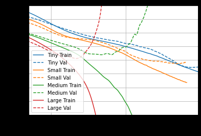
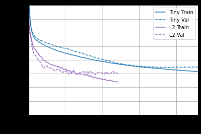
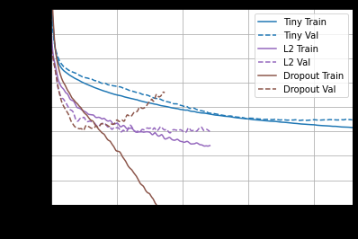
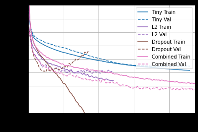

# 人工智能-深度学习-Tensorflow例子-14
[toc]
## 回归Basic regression
https://tensorflow.google.cn/tutorials/keras/regression
```
"""
在 回归 (regression) 问题中，我们的目的是预测出如价格或概率这样连续值的输出。相对于分类(classification) 问题，
分类(classification) 的目的是从一系列的分类出选择出一个分类 
（如，给出一张包含苹果或橘子的图片，识别出图片中是哪种水果）。

本 notebook 使用经典的 Auto MPG 数据集，构建了一个用来预测70年代末到80年代初汽车燃油效率的模型。
为了做到这一点，我们将为该模型提供许多那个时期的汽车描述。
这个描述包含：气缸数，排量，马力以及重量。
"""
# 使用 seaborn 绘制矩阵图 (pairplot)
pip install -q seaborn

import pathlib

import matplotlib.pyplot as plt
import pandas as pd
import seaborn as sns

import tensorflow as tf

from tensorflow import keras
from tensorflow.keras import layers

print(tf.__version__)

# 获取数据
dataset_path = keras.utils.get_file("auto-mpg.data", "http://archive.ics.uci.edu/ml/machine-learning-databases/auto-mpg/auto-mpg.data")
dataset_path
# 使用 pandas 导入数据集。
column_names = ['MPG','Cylinders','Displacement','Horsepower','Weight',
                'Acceleration', 'Model Year', 'Origin']
raw_dataset = pd.read_csv(dataset_path, names=column_names,
                      na_values = "?", comment='\t',
                      sep=" ", skipinitialspace=True)

dataset = raw_dataset.copy()
dataset.tail()

# 数据清洗
# 数据集中包括一些未知值
dataset.isna().sum()

# 为了保证这个初始示例的简单性，删除这些行。
dataset = dataset.dropna()

# "Origin" 列实际上代表分类，而不仅仅是一个数字。所以把它转换为独热码 （one-hot）:
origin = dataset.pop('Origin')
dataset['USA'] = (origin == 1)*1.0
dataset['Europe'] = (origin == 2)*1.0
dataset['Japan'] = (origin == 3)*1.0
dataset.tail()

# 拆分训练数据集和测试数据集
train_dataset = dataset.sample(frac=0.8,random_state=0)
test_dataset = dataset.drop(train_dataset.index)

# 数据检查
# 快速查看训练集中几对列的联合分布。
sns.pairplot(train_dataset[["MPG", "Cylinders", "Displacement", "Weight"]], diag_kind="kde")
# 也可以查看总体的数据统计:
train_stats = train_dataset.describe()
train_stats.pop("MPG")
train_stats = train_stats.transpose()
train_stats
# 从标签中分离特征
# 将特征值从目标值或者"标签"中分离。 这个标签是你使用训练模型进行预测的值。
train_labels = train_dataset.pop('MPG')
test_labels = test_dataset.pop('MPG')

# 数据规范化
# 使用不同的尺度和范围对特征归一化是好的实践。
def norm(x):
  return (x - train_stats['mean']) / train_stats['std']
normed_train_data = norm(train_dataset)
normed_test_data = norm(test_dataset)

# 构建模型
# 让我们来构建我们自己的模型。这里，我们将会使用一个“顺序”模型，其中包含两个紧密相连的隐藏层，以及返回单个、连续值得输出层。模型的构建步骤包含于一个名叫 'build_model' 的函数中，稍后我们将会创建第二个模型。 两个密集连接的隐藏层。
def build_model():
  model = keras.Sequential([
    layers.Dense(64, activation='relu', input_shape=[len(train_dataset.keys())]),
    layers.Dense(64, activation='relu'),
    layers.Dense(1)
  ])

  optimizer = tf.keras.optimizers.RMSprop(0.001)

  model.compile(loss='mse',
                optimizer=optimizer,
                metrics=['mae', 'mse'])
  return model

model = build_model()

# 检查模型
# 使用 .summary 方法来打印该模型的简单描述。
model.summary()
# 从训练数据中批量获取‘10’条例子并对这些例子调用 model.predict 。
example_batch = normed_train_data[:10]
example_result = model.predict(example_batch)
example_result

# 训练模型
# 对模型进行1000个周期的训练，并在 history 对象中记录训练和验证的准确性。
# 通过为每个完成的时期打印一个点来显示训练进度
class PrintDot(keras.callbacks.Callback):
  def on_epoch_end(self, epoch, logs):
    if epoch % 100 == 0: print('')
    print('.', end='')

EPOCHS = 1000

history = model.fit(
  normed_train_data, train_labels,
  epochs=EPOCHS, validation_split = 0.2, verbose=0,
  callbacks=[PrintDot()])
  
# 使用 history 对象中存储的统计信息可视化模型的训练进度。
hist = pd.DataFrame(history.history)
hist['epoch'] = history.epoch
hist.tail()

def plot_history(history):
  hist = pd.DataFrame(history.history)
  hist['epoch'] = history.epoch

  plt.figure()
  plt.xlabel('Epoch')
  plt.ylabel('Mean Abs Error [MPG]')
  plt.plot(hist['epoch'], hist['mae'],
           label='Train Error')
  plt.plot(hist['epoch'], hist['val_mae'],
           label = 'Val Error')
  plt.ylim([0,5])
  plt.legend()

  plt.figure()
  plt.xlabel('Epoch')
  plt.ylabel('Mean Square Error [$MPG^2$]')
  plt.plot(hist['epoch'], hist['mse'],
           label='Train Error')
  plt.plot(hist['epoch'], hist['val_mse'],
           label = 'Val Error')
  plt.ylim([0,20])
  plt.legend()
  plt.show()


plot_history(history)

# 让我们更新 model.fit 调用，当验证值没有提高上是自动停止训练。 我们将使用一个 EarlyStopping callback 来测试每个 epoch 的训练条件。如果经过一定数量的 epochs 后没有改进，则自动停止训练。
model = build_model()

# patience 值用来检查改进 epochs 的数量
early_stop = keras.callbacks.EarlyStopping(monitor='val_loss', patience=10)

history = model.fit(normed_train_data, train_labels, epochs=EPOCHS,
                    validation_split = 0.2, verbose=0, callbacks=[early_stop, PrintDot()])

plot_history(history)

# mse是均方误差 mae是平均绝对误差 都是用于回归模型的损失函数
loss, mae, mse = model.evaluate(normed_test_data, test_labels, verbose=2)

print("Testing set Mean Abs Error: {:5.2f} MPG".format(mae))

# 做预测
# 最后，使用测试集中的数据预测 MPG 值:
test_predictions = model.predict(normed_test_data).flatten()

plt.scatter(test_labels, test_predictions)
plt.xlabel('True Values [MPG]')
plt.ylabel('Predictions [MPG]')
plt.axis('equal')
plt.axis('square')
plt.xlim([0,plt.xlim()[1]])
plt.ylim([0,plt.ylim()[1]])
_ = plt.plot([-100, 100], [-100, 100])

# 误差分布
error = test_predictions - test_labels
plt.hist(error, bins = 25)
plt.xlabel("Prediction Error [MPG]")
_ = plt.ylabel("Count")

"""
本笔记本 (notebook) 介绍了一些处理回归问题的技术。

均方误差（MSE）是用于回归问题的常见损失函数（分类问题中使用不同的损失函数）。
类似的，用于回归的评估指标与分类不同。 常见的回归指标是平均绝对误差（MAE）。
当数字输入数据特征的值存在不同范围时，每个特征应独立缩放到相同范围。
如果训练数据不多，一种方法是选择隐藏层较少的小网络，以避免过度拟合。
早期停止是一种防止过度拟合的有效技术。
"""
```
## 过拟合和欠拟合
https://tensorflow.google.cn/tutorials/keras/overfit_and_underfit#conclusions
- 增加更多数据
- 添加正则化
- 添加dropout
- 减少网络的神经元容量
```
# 不同的网络神经元
# Tiny model
tiny_model = tf.keras.Sequential([
    layers.Dense(16, activation='elu', input_shape=(FEATURES,)),
    layers.Dense(1)
])
# Small model
small_model = tf.keras.Sequential([
    # `input_shape` is only required here so that `.summary` works.
    layers.Dense(16, activation='elu', input_shape=(FEATURES,)),
    layers.Dense(16, activation='elu'),
    layers.Dense(1)
])
# Medium model
medium_model = tf.keras.Sequential([
    layers.Dense(64, activation='elu', input_shape=(FEATURES,)),
    layers.Dense(64, activation='elu'),
    layers.Dense(64, activation='elu'),
    layers.Dense(1)
])
# Large model
large_model = tf.keras.Sequential([
    layers.Dense(512, activation='elu', input_shape=(FEATURES,)),
    layers.Dense(512, activation='elu'),
    layers.Dense(512, activation='elu'),
    layers.Dense(512, activation='elu'),
    layers.Dense(1)
])

# 正则化 Add weight regularization
l2_model = tf.keras.Sequential([
    layers.Dense(512, activation='elu',
                 kernel_regularizer=regularizers.l2(0.001),
                 input_shape=(FEATURES,)),
    layers.Dense(512, activation='elu',
                 kernel_regularizer=regularizers.l2(0.001)),
    layers.Dense(512, activation='elu',
                 kernel_regularizer=regularizers.l2(0.001)),
    layers.Dense(512, activation='elu',
                 kernel_regularizer=regularizers.l2(0.001)),
    layers.Dense(1)
])

regularizer_histories['l2'] = compile_and_fit(l2_model, "regularizers/l2")

# Add dropout
dropout_model = tf.keras.Sequential([
    layers.Dense(512, activation='elu', input_shape=(FEATURES,)),
    layers.Dropout(0.5),
    layers.Dense(512, activation='elu'),
    layers.Dropout(0.5),
    layers.Dense(512, activation='elu'),
    layers.Dropout(0.5),
    layers.Dense(512, activation='elu'),
    layers.Dropout(0.5),
    layers.Dense(1)
])

regularizer_histories['dropout'] = compile_and_fit(dropout_model, "regularizers/dropout")

# Combined L2 + dropout
combined_model = tf.keras.Sequential([
    layers.Dense(512, kernel_regularizer=regularizers.l2(0.0001),
                 activation='elu', input_shape=(FEATURES,)),
    layers.Dropout(0.5),
    layers.Dense(512, kernel_regularizer=regularizers.l2(0.0001),
                 activation='elu'),
    layers.Dropout(0.5),
    layers.Dense(512, kernel_regularizer=regularizers.l2(0.0001),
                 activation='elu'),
    layers.Dropout(0.5),
    layers.Dense(512, kernel_regularizer=regularizers.l2(0.0001),
                 activation='elu'),
    layers.Dropout(0.5),
    layers.Dense(1)
])

regularizer_histories['combined'] = compile_and_fit(combined_model, "regularizers/combined")
```





## 保存和恢复模型
https://tensorflow.google.cn/tutorials/keras/save_and_load
```
# 安装并导入
# 安装并导入Tensorflow和依赖项：
pip install -q pyyaml h5py  # 以 HDF5 格式保存模型所必须
import os

import tensorflow as tf
from tensorflow import keras

print(tf.version.VERSION)

# 获取示例数据集
# 要演示如何保存和加载权重，您将使用 MNIST 数据集. 要加快运行速度，请使用前1000个示例：
(train_images, train_labels), (test_images, test_labels) = tf.keras.datasets.mnist.load_data()

train_labels = train_labels[:1000]
test_labels = test_labels[:1000]

train_images = train_images[:1000].reshape(-1, 28 * 28) / 255.0
test_images = test_images[:1000].reshape(-1, 28 * 28) / 255.0

# 定义模型
# 定义一个简单的序列模型
def create_model():
  model = tf.keras.models.Sequential([
    keras.layers.Dense(512, activation='relu', input_shape=(784,)),
    keras.layers.Dropout(0.2),
    keras.layers.Dense(10)
  ])

  model.compile(optimizer='adam',
                loss=tf.losses.SparseCategoricalCrossentropy(from_logits=True),
                metrics=['accuracy'])

  return model

# 创建一个基本的模型实例
model = create_model()

# 显示模型的结构
model.summary()

# 在训练期间保存模型（以 checkpoints 形式保存）
"""
您可以使用训练好的模型而无需从头开始重新训练，或在您打断的地方开始训练，以防止训练过程没有保存。
tf.keras.callbacks.ModelCheckpoint 允许在训练的过程中和结束时回调保存的模型。
"""
# Checkpoint 回调用法
# 创建一个只在训练期间保存权重的 tf.keras.callbacks.ModelCheckpoint 回调：

checkpoint_path = "training_1/cp.ckpt"
checkpoint_dir = os.path.dirname(checkpoint_path)

# 创建一个保存模型权重的回调
cp_callback = tf.keras.callbacks.ModelCheckpoint(filepath=checkpoint_path,
                                                 save_weights_only=True,
                                                 verbose=1)

# 使用新的回调训练模型
model.fit(train_images, 
          train_labels,  
          epochs=10,
          validation_data=(test_images,test_labels),
          callbacks=[cp_callback])  # 通过回调训练

# 这可能会生成与保存优化程序状态相关的警告。
# 这些警告（以及整个笔记本中的类似警告）
# 是防止过时使用，可以忽略。

# 创建一个新的未经训练的模型。仅恢复模型的权重时，必须具有与原始模型具有相同网络结构的模型。
# 未经训练的模型将在机会水平（chance levels）上执行（准确度约为10％）：
# 创建一个基本模型实例
model = create_model()

# 评估模型
loss, acc = model.evaluate(test_images,  test_labels, verbose=2)
print("Untrained model, accuracy: {:5.2f}%".format(100*acc))

# 加载权重
model.load_weights(checkpoint_path)

# 重新评估模型
loss,acc = model.evaluate(test_images,  test_labels, verbose=2)
print("Restored model, accuracy: {:5.2f}%".format(100*acc))

# 在文件名中包含 epoch (使用 `str.format`)
checkpoint_path = "training_2/cp-{epoch:04d}.ckpt"
checkpoint_dir = os.path.dirname(checkpoint_path)

# 创建一个回调，每 5 个 epochs 保存模型的权重
cp_callback = tf.keras.callbacks.ModelCheckpoint(
    filepath=checkpoint_path, 
    verbose=1, 
    save_weights_only=True,
    period=5)

# 创建一个新的模型实例
model = create_model()

# 使用 `checkpoint_path` 格式保存权重
model.save_weights(checkpoint_path.format(epoch=0))

# 使用新的回调训练模型
model.fit(train_images, 
          train_labels,
          epochs=50, 
          callbacks=[cp_callback],
          validation_data=(test_images,test_labels),
          verbose=0)
          
latest = tf.train.latest_checkpoint(checkpoint_dir)
latest

# 创建一个新的模型实例
model = create_model()

# 加载以前保存的权重
model.load_weights(latest)

# 重新评估模型
loss, acc = model.evaluate(test_images,  test_labels, verbose=2)
print("Restored model, accuracy: {:5.2f}%".format(100*acc))

"""
上述代码将权重存储到 checkpoint—— 格式化文件的集合中，这些文件仅包含二进制格式的训练权重。 Checkpoints 包含：

一个或多个包含模型权重的分片。
索引文件，指示哪些权重存储在哪个分片中。
如果你只在一台机器上训练一个模型，你将有一个带有后缀的碎片： .data-00000-of-00001
"""

# 手动保存权重
"""
您将了解如何将权重加载到模型中。使用 Model.save_weights 方法手动保存它们同样简单。
默认情况下， tf.keras 和 save_weights 特别使用 TensorFlow checkpoints 格式 .ckpt 扩展名和 ( 保存在 HDF5 扩展名为 .h5 保存并序列化模型)：
"""
# 保存权重
model.save_weights('./checkpoints/my_checkpoint')

# 创建模型实例
model = create_model()

# 恢复权重
model.load_weights('./checkpoints/my_checkpoint')

# 评估模型
loss,acc = model.evaluate(test_images,  test_labels, verbose=2)
print("Restored model, accuracy: {:5.2f}%".format(100*acc))

"""
保存整个模型
调用 model.save 将保存模型的结构，权重和训练配置保存在单个文件/文件夹中。这可以让您导出模型，
以便在不访问原始 Python 代码*的情况下使用它。因为优化器状态（optimizer-state）已经恢复，
您可以从中断的位置恢复训练。

整个模型可以以两种不同的文件格式（SavedModel 和 HDF5）进行保存。需要注意的是 TensorFlow 的 SavedModel 格式是 TF2.x. 中的默认文件格式。
但是，模型仍可以以 HDF5 格式保存。下面介绍了以两种文件格式保存整个模型的更多详细信息。

保存完整模型会非常有用——您可以在 TensorFlow.js（Saved Model, HDF5）加载它们，然后在 web 浏览器中训练和运行它们，
或者使用 TensorFlow Lite 将它们转换为在移动设备上运行（Saved Model, HDF5）
"""

"""
SavedModel 格式是序列化模型的另一种方法。以这种格式保存的模型，可以使用 tf.keras.models.load_model 还原，并且模型与 TensorFlow Serving 兼容。
"""
# 创建并训练一个新的模型实例。
model = create_model()
model.fit(train_images, train_labels, epochs=5)

# 将整个模型另存为 SavedModel。
!mkdir -p saved_model
model.save('saved_model/my_model') 

new_model = tf.keras.models.load_model('saved_model/my_model')

# 检查其架构
new_model.summary()

# 评估还原的模型
loss, acc = new_model.evaluate(test_images,  test_labels, verbose=2)
print('Restored model, accuracy: {:5.2f}%'.format(100*acc))

print(new_model.predict(test_images).shape)

# HDF5 格式 Keras使用 HDF5 标准提供了一种基本的保存格式。
# 创建并训练一个新的模型实例
model = create_model()
model.fit(train_images, train_labels, epochs=5)

# 将整个模型保存为 HDF5 文件。
# '.h5' 扩展名指示应将模型保存到 HDF5。
model.save('my_model.h5') 

# 重新创建完全相同的模型，包括其权重和优化程序
new_model = tf.keras.models.load_model('my_model.h5')

# 显示网络结构
new_model.summary()

loss, acc = new_model.evaluate(test_images,  test_labels, verbose=2)
print('Restored model, accuracy: {:5.2f}%'.format(100*acc))

```
Keras 通过检查网络结构来保存模型。这项技术可以保存一切:

* 权重值
* 模型的架构
* 模型的训练配置(您传递给编译的内容)
* 优化器及其状态（如果有的话）（这使您可以在中断的地方重新开始训练）

Keras 无法保存 `v1.x` 优化器（来自 `tf.compat.v1.train`），因为它们与检查点不兼容。对于 v1.x 优化器，您需要在加载-失去优化器的状态后，重新编译模型。

### 保存自定义对象

如果使用的是 SavedModel 格式，则可以跳过此部分。HDF5 和 SavedModel 之间的主要区别在于，HDF5 使用对象配置保存模型结构，而 SavedModel 保存执行图。因此，SavedModel 能够保存自定义对象，例如子类化模型和自定义层，而无需原始代码。

要将自定义对象保存到 HDF5，必须执行以下操作:

1. 在对象中定义一个 `get_config` 方法，以及可选的 `from_config` 类方法。
  * `get_config(self)` 返回重新创建对象所需的参数的 JSON 可序列化字典。
  * `from_config(cls, config)` 使用从 get_config 返回的 config 来创建一个新对象。默认情况下，此函数将使用 config 作为初始化 kwargs（`return cls(**config)`）。
2. 加载模型时，将对象传递给 `custom_objects` 参数。参数必须是将字符串类名称映射到 Python 类的字典。例如，`tf.keras.models.load_model(path, custom_objects={'CustomLayer': CustomLayer})`

有关自定义对象和 `get_config` 的示例，请参见[从头开始编写层和模型](https://tensorflow.google.cn/guide/keras/custom_layers_and_models)教程。


## 卷积神经网络例子1-自定义模型识别图像
```
"""
使用卷积神经网络进行分类
"""
# In[]:
import tensorflow as tf
from tensorflow import keras
import numpy as np
import matplotlib.pyplot as plt
from keras.utils.data_utils import get_file
import gzip
from tensorflow.examples.tutorials.mnist import input_data
from tensorflow.python.keras.models import Sequential
from tensorflow.python.keras.layers import Dense, Dropout, Flatten
from tensorflow.python.keras.layers import Conv2D, MaxPooling2D

#print(tf.__version__)
print('Import OK')

# In[]:
# 可以用下面读入数据，也可以用keras提供的方法
def load_data():
    base = "F:/2019-notebook/2017_2018_2/python_code/MTrain/MachineLearn/3_ML/8_deeplearning/9_CNN/fasion_minst_data/"
    files = [
        'train-labels-idx1-ubyte.gz', 'train-images-idx3-ubyte.gz',
        't10k-labels-idx1-ubyte.gz', 't10k-images-idx3-ubyte.gz'
    ]

    paths = []
    for fname in files:
        paths.append(get_file(fname, origin=base + fname))

    with gzip.open(paths[0], 'rb') as lbpath:
        y_train = np.frombuffer(lbpath.read(), np.uint8, offset=8)

    with gzip.open(paths[1], 'rb') as imgpath:
        x_train = np.frombuffer(
            imgpath.read(), np.uint8, offset=16).reshape(len(y_train), 28, 28)

    with gzip.open(paths[2], 'rb') as lbpath:
        y_test = np.frombuffer(lbpath.read(), np.uint8, offset=8)

    with gzip.open(paths[3], 'rb') as imgpath:
        x_test = np.frombuffer(
            imgpath.read(), np.uint8, offset=16).reshape(len(y_test), 28, 28)

    return (x_train, y_train), (x_test, y_test)

print('Load data function OK')

# In[ ]:
# 从网上下载很慢，或者不成功
if False:
    fashion_mnist = keras.datasets.fashion_mnist
    (train_images, train_labels), (test_images, test_labels) = fashion_mnist.load_data()
else:    
    #(train_images, train_labels), (test_images, test_labels) = load_data()
    MNIST_data_folder = "C:/PycharmProjects/py366/fasion_minst_data"
    fashion_mnist = input_data.read_data_sets(MNIST_data_folder,one_hot=True)

# In[]:
train_images, train_labels = fashion_mnist.train.images,fashion_mnist.train.labels  
test_images, test_labels = fashion_mnist.test.images, fashion_mnist.test.labels  
print('Load data OK')

# In[ ]:
class_names = ['T-shirt/top', 'Trouser', 'Pullover', 'Dress', 'Coat', 
               'Sandal', 'Shirt', 'Sneaker', 'Bag', 'Ankle boot']

# In[ ]:
train_images.shape

# In[ ]:
len(train_labels)

# In[ ]:
train_labels.shape

# In[ ]:
test_images.shape

# In[ ]:
len(test_labels)

# In[ ]:
train_images = train_images.reshape(-1, 28, 28,1).astype('float32')  
test_images = test_images.reshape(-1,28, 28,1).astype('float32')

# In[]:
train_images.shape, test_images.shape

# In[ ]:
train_images = train_images / 255.0
test_images = test_images / 255.0

print('Norm OK')

# In[ ]:
in_shape = (28,28,1)

model = Sequential()
model.add(Conv2D(32,3,3,activation='relu',input_shape=in_shape))
model.add(Conv2D(64,3,3,activation='relu'))
model.add(MaxPooling2D(pool_size=(2, 2)))
model.add(Dropout(0.5))
model.add(Flatten())
model.add(Dense(128, activation='relu'))
model.add(Dropout(0.5))
model.add(Dense(10, activation='softmax'))

print('Build model OK')


# In[ ]:
model.compile(optimizer=tf.train.AdamOptimizer(), 
              loss='categorical_crossentropy',
              metrics=['accuracy'])
model.summary()

# In[ ]:
model.fit(train_images, train_labels, batch_size=32,epochs=1,
          verbose=1, validation_data=(test_images, test_labels))

# In[ ]:
test_loss, test_acc = model.evaluate(test_images, test_labels)

print('Test accuracy:', test_acc)

# In[ ]:
predictions = model.predict(test_images)
print('Predict OK')

# In[ ]:
predictions[0]


# In[ ]:
np.argmax(predictions[0])


# In[ ]:
test_labels[0]
```
## 卷积神经网络例子2-经典模型识别图像
```


import tensorflow as tf
from tensorflow import keras
from tensorflow.python.keras.preprocessing.image import ImageDataGenerator
from tensorflow.python.keras.applications.inception_v3 import InceptionV3
from tensorflow.python.keras.applications.vgg16 import VGG16
from tensorflow.python.keras.applications.resnet50 import ResNet50
from tensorflow.python.keras.applications.xception import Xception
from tensorflow.python.keras.applications.nasnet import NASNetMobile
from tensorflow.python.keras.applications.densenet import DenseNet201
from tensorflow.python.keras.optimizers import SGD, Adam
from tensorflow.python.keras.layers import Dropout, Flatten, Dense, GlobalAveragePooling2D, Average, Input, Concatenate, GlobalMaxPooling2D
import datetime
import numpy as np
import os

print('Import OK')

def create_model(net_type):
    # weights='imagenet'会从网站自动下载在imagenet训练好的权重文件
    # 也可以自己网上找到权重文件下载后，在weights参数中指定文件路径即可
    # include_top false表示只使用卷积层不使用分类的全连接层
    if net_type == 'ResNet50':
        base_model = ResNet50(weights='imagenet',include_top=False)
    if net_type == 'VGG16':
        base_model = VGG16(weights='imagenet',include_top=False)
    if net_type == 'InceptionV3':
        base_model = InceptionV3(weights='imagenet',include_top=False)

    x = base_model.output
    # GlobalAveragePooling2D 将卷积层变成一维数据
    x = keras.layers.GlobalAveragePooling2D()(x)
    x = keras.layers.Dropout(0.5)(x)
    x = keras.layers.Dense(512, activation='relu')(x)
    x = keras.layers.Dropout(0.5)(x)

    predictions = keras.layers.Dense(2, activation='softmax')(x)
    model = keras.Model(inputs=base_model.input, outputs=predictions)  

    # fine-tune
    # 指定卷积层是否训练，如果false则只是训练全链接层
    for layer in base_model.layers:  
        layer.trainable = True #False     
    
    model.compile(optimizer=Adam(lr=0.0001, decay=0.00001),  
              loss='categorical_crossentropy',
              metrics=['accuracy'])

    return model

def train(train_data_dir, validation_data_dir):
    img_height, img_width = 200, 200 
    nb_train_samples = 78
    nb_validation_samples = 24 
    epochs = 200
    batch_size = 16
    # 分批读取目录 要求目录结构按种类分层 图像数据生成器
    train_datagen = ImageDataGenerator(
            rescale=1./255
        )

    val_datagen = ImageDataGenerator(rescale=1./255)

    train_generator = train_datagen.flow_from_directory(
            train_data_dir,
            target_size=(img_height, img_width),
            batch_size=32,
            class_mode='categorical')
    print('train_generator:', train_generator)

    validation_generator = val_datagen.flow_from_directory(
            validation_data_dir,
            target_size=(img_height, img_width),
            batch_size=32,
            class_mode='categorical')
    print('validation_generator:', validation_generator)

    # 保存模型和权重
    model_dir = 'F:/2019-notebook/2017_2018_2/python_code/MTrain/MachineLearn/3_ML/8_deeplearning/9_CNN/'
    checkpoint_path = model_dir + "model.h5"
    # monitor val_acc 监视验证集的准确率
    checkpoint = tf.keras.callbacks.ModelCheckpoint(checkpoint_path, monitor='val_acc', verbose=2,
                save_weights_only=False, save_best_only=True, mode='max')
    
    model = create_model('VGG16')
    model.summary()

    model.fit_generator(
            train_generator,
            steps_per_epoch=nb_train_samples // batch_size,
            epochs=epochs,
            validation_data=validation_generator,
            validation_steps=nb_validation_samples // batch_size,
            callbacks=[checkpoint], 
            verbose=2)
    
if __name__=='__main__':
    # train和val下面的目录结构是一样的
    #  比如
    #  ./train/
    #        /dog
    #        /cat
    #   ./val/
    #        /dog
    #        /cat
    # dog和cat目录下分别是狗和猫的图片
    root_dir = 'F:/2019-notebook/2017_2018_2/python_code/MTrain/MachineLearn/3_ML/8_deeplearning/9_CNN/dog_cat/'
    targetTrainPath = root_dir + 'train/'
    targetValPath = root_dir + 'val/'
    
    train(targetTrainPath, targetValPath)

    
    
```