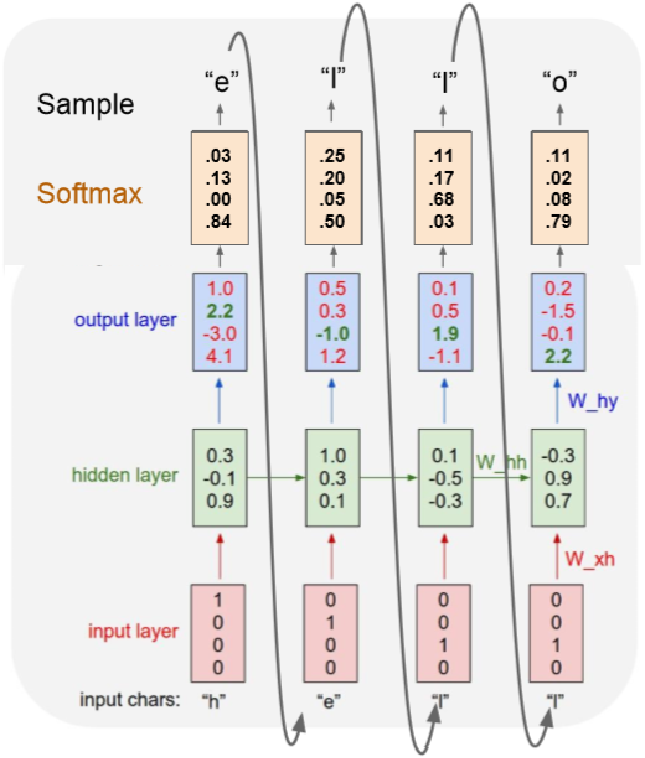

# 人工智能-深度学习-循环神经网络-15
[toc]
## RNN的类别

- **图像字幕** （一对多）
    - 图像 → 词序
- **情绪分类** （多对一）
    - 词序 → 情绪
- **机器翻译** （多对多）
    - 字数 → 字数

## RNN的经典应用
- 时间序列分析：网站流量预测

- 股票预测

- NLP自然语言处理
    - 她这个人真有意思(funny)。
    - 她说：“他这个人怪有意思的(funny)。”于是人们以为他们有了意思(wish)，并让他向她意思意思(express)。他火了：“我根本没有那个意思(thought)！”她也生气了：“你们这么说是什么意思(intention)？”事后有人说：“真有意思(funny)。”也有人说：“真没意思(nonsense)”。
        - 原文见《生活报》1994.11.13.第六版)［吴尉天，1999］
        - ——《统计自然语言处理》
- Sequence to Sequence

## 基本运算
- **每次迭代使用相同的参数和函数**

## RNN的计算


### One to Many

### Many to One

### Many to Many


## RNN进行翻译的简单模型

每一时刻的输入为A,B,C,D，最后的_表示翻译结束符，翻译结果为X，Y，Z
注意，在翻译过程中，Y依然依赖于翻译结果X，而Z依然依赖翻译结果X和Y。

循环神经网络可以被看作是同一神经网络结构在时间序列上被复制多次的结果
这个被复制多次的结构被称之为循环体。

如何设计循环体的网络结构是解决实际问题的关键。
和卷积神经网络过滤器中参数是共享类似，循环网络结构中参数在不同时刻也是
共享的。
## RNN前向传播的过程


### 例子Character-level Language Model


> 注意，这里的隐含层是3个神经元，而且只有一个隐含层，RNN和普通神经网络一样，神经元的个数与层数都是超参数，可以根据需要设置不同



## 例子电量预测-lstm神经网络
```
# 电量消费预测

# -*- coding: utf-8 -*-
# In[]:
from __future__ import division, print_function
from keras.layers.core import Dense
from keras.layers.recurrent import LSTM
from keras.models import Sequential
from sklearn.preprocessing import MinMaxScaler
import numpy as np
import math
import os

# In[]:
DATA_DIR = "C:/PycharmProjects/py366"

data = np.load(os.path.join(DATA_DIR, "LD_250.npy"))

# In[]:
# 只有一个特征值，并显示前面10个数据
data.shape, data[:10]

# (sample_num,feature_num)
# In[]:
# 设置无状态lstm参数 有状态无状态差别不大
STATELESS = True

# 前四十个数据预测第21个数据
NUM_TIMESTEPS = 20
# 隐藏层神经元的数量
HIDDEN_SIZE = 10
BATCH_SIZE = 256
# 训练5次
NUM_EPOCHS = 5

# In[]:
# scale the data to be in the range (0, 1)
# 140256 to (140256,1)
# 为了适应训练参数，将一维的数据转为二维数据，行是样本数，列是特征数
data = data.reshape(-1, 1)
data.shape

# In[]:
# 数据归一化
scaler = MinMaxScaler(feature_range=(0, 1), copy=False)
data = scaler.fit_transform(data)
data[:10]

# In[]:
# 按照NUM_TIMESTEPS大小，将输入特征转为连续的NUM_TIMESTEPS大小数量特征
# 开始全部初始化0，此时样本的数量不变，维度从1转为NUM_TIMESTEPS
X = np.zeros((data.shape[0], NUM_TIMESTEPS))
X.shape


# In[]:
# 初始化label值，也全部初始化0
# 就是用连续的数据X来预测Y
Y = np.zeros((data.shape[0], 1))
Y.shape

# In[]:
# 140256 - 20 = 140236
# 实际有效训练数据的数量
# 比如abcde五个数，假设NUM_TIMESTEPS=2，就是说用前面2个预测第3个数据
# 构造的训练数据如下，实际的训练数据数量是5-2=3，同样的道理
# x  y
# ab c
# bc d
# cd e
len(data) - NUM_TIMESTEPS


# In[]:
# 根据时间序列数据构造训练集特征与label目标值
for i in range(len(data) - NUM_TIMESTEPS):
    X[i] = data[i:i + NUM_TIMESTEPS].T
    Y[i] = data[i + NUM_TIMESTEPS]

# In[]:
# 查看X的shape
X.shape

# In[]:
# reshape X to three dimensions (samples, timesteps, features)
# 根据循环神经网络训练格式的需要，需要的shape是(samples, timesteps, features)
# 即（样本数量，时间数，特征数），由于这个例子中的特征只有一个值，
# 所以直接用下面方法就可以了
X = np.expand_dims(X, axis=2)
X.shape

# In[]:
# split into training and test sets (add the extra offsets so 
# we can use batch size of 5)
# 设置训练与测试集
sp = int(0.7 * len(data))
Xtrain, Xtest, Ytrain, Ytest = X[0:sp], X[sp:], Y[0:sp], Y[sp:]
print(Xtrain.shape, Xtest.shape, Ytrain.shape, Ytest.shape)

# In[]:
# 所谓有状态与无状态，指的是每个训练的batch之间是否有时间的相关性
# 如果有，就是有状态，否则就是无状态。一般来说，尽量多使用无状态的训练
# 有状态情况下，要考虑所有batch之间的相关性
# 多数情况下，只要设计的好，两种情况，性能差别不大。
# 由于无状态更加灵活，选择更多。
STATELESS = True
STATELESS

# In[]:
if STATELESS:
    # stateless
    print('stateless')
    model = Sequential()

    model.add(LSTM(HIDDEN_SIZE,
            input_shape=(NUM_TIMESTEPS, 1), 
            return_sequences=False))

    model.add(Dense(1))
else:
    # stateful
    print('stateful')
    model = Sequential()

    model.add(LSTM(HIDDEN_SIZE,
                   stateful=True,
                   batch_input_shape=(BATCH_SIZE, NUM_TIMESTEPS, 1), 
                   return_sequences=False))

    model.add(Dense(1))

model.compile(loss="mean_squared_error", optimizer="adam",
              metrics=["mean_squared_error"])

# In[]:
if STATELESS:
    # stateless
    # 无状态用的更多，尽量使用无状态的预测
    model.fit(Xtrain, Ytrain, epochs=NUM_EPOCHS, batch_size=BATCH_SIZE,
              validation_data=(Xtest, Ytest),
              shuffle=False)
else:
    # stateful
    # need to make training and test data to multiple of BATCH_SIZE
    # 注意：所谓有状态的循环神经网络，就是每个batch训练后的状态可以作为下个batch的初始状态值
    # 让训练数据和测试数据的数量都是BATCH_SIZE的整数倍
    train_size = (Xtrain.shape[0] // BATCH_SIZE) * BATCH_SIZE
    test_size = (Xtest.shape[0] // BATCH_SIZE) * BATCH_SIZE
    Xtrain, Ytrain = Xtrain[0:train_size], Ytrain[0:train_size]
    Xtest, Ytest = Xtest[0:test_size], Ytest[0:test_size]
    print(Xtrain.shape, Xtest.shape, Ytrain.shape, Ytest.shape)
    for i in range(NUM_EPOCHS):
        print("Epoch {:d}/{:d}".format(i+1, NUM_EPOCHS))
        model.fit(Xtrain, Ytrain, batch_size=BATCH_SIZE, epochs=1,
                  validation_data=(Xtest, Ytest),
                  shuffle=False)
        model.reset_states()

# In[]:
score, _ = model.evaluate(Xtest, Ytest, batch_size=BATCH_SIZE)
rmse = math.sqrt(score)
print("\nMSE: {:.3f}, RMSE: {:.3f}".format(score, rmse))

```