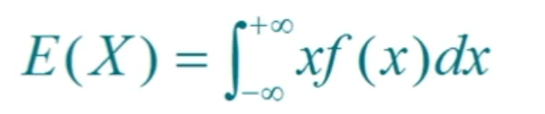
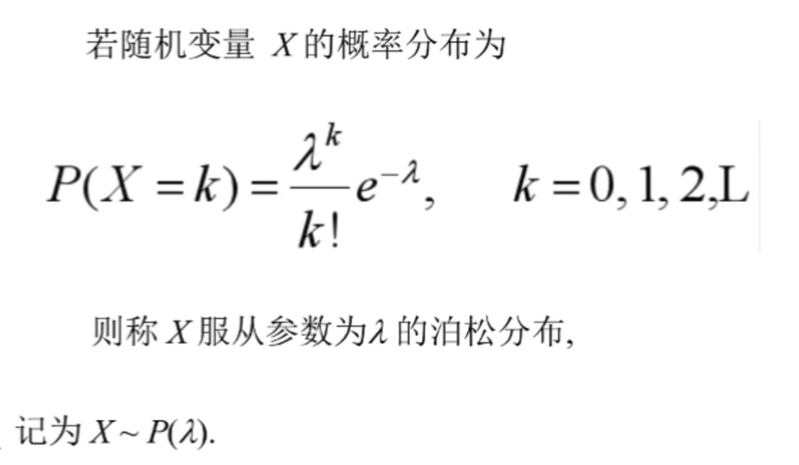

# 人工智能-概率论基础-2
[toc]
## 为什么使用概率
- 概率论是用于表示不确定性声明的数学框架。它不仅提供了量化不确定性的方法,也提供了用于导出新的不确定性声明( statement)的公理。在人工智能领域,概率论主要有两种用途。首先,概率法则告诉我们AI系统如何推理,据此我们设计些算法来计算或者估算由概率论导出的表达式。其次,我们可以用概率和统计从理论上分析我们提出的AI系统的行为。
- 概率论是众多科学学科和工程学科的基本工具。
- 概率论使我们能够提出不确定的声明以及在不确定性存在的情况下进行推理,而信息论使我们能够量化概率分布中的不确定性总量。
- 计算机科学的许多分支处理的实体大部分都是完全确定且必然的。程序员通常可以安全地假定CPU将完美地执行每条机器指令。虽然硬件错误确实会发生,但它们足够罕见,以致于大部分软件应用在设计时并不需要考虑这些因素的影响。鉴于许多计算机科学家和软件工程师在一个相对干净和确定的环境中工作,机器学习对于概率论的大量使用是很令人吃惊的。
- 这是因为机器学习通常必须处理不确定量,有时也可能需要处理随机(非确定性的)量。不确定性和随机性可能来自多个方面。至少从20世纪80年代开始,研究人员就对使用概率论来量化不确定性提岀了令人信服的论据。

### 不确定性有三种可能的来源
1. **被建模系统内在的随机**。例如,大多数量子力学的解释,都将亚原子粒子的动力学描述为概率的。我们还可以创建一些我们假设具有随机动态的理论情境,例如一个假想的纸牌游戏,在这个游戏中我们假设纸牌被真正混洗成了随机顺序。
2. **不完全观测**。即使是确定的系统,当我们不能观测到所有驱动系统行为的变量时,该系统也会呈现随机性。例如,在 Monty Hal问题中,一个游戏节目的参与者被要求在三个门之间选择,并且会赢得放置在选中门后的奖品。其中两扇门通向山羊,第三扇门通向一辆汽车。选手的每个选择所导致的结果是确定的,但是站在选手的角度,结果是不确定的。
3. **不完全建模**。当我们使用一些必须舍弃某些观测信息的模型时,舍弃的信息会导致模型的预测出现不确定性。例如,假设我们制作了一个机器人,它可以准确地观察周围每一个对象的位置。在对这些对象将来的位置进行预测,如果机器人采用的是离散化的空间,那么离散化的方法将使得机器无法确定对象们的精确位置:因为每个对象都可能处于它被观测到的离散单元的任何一个角。
> 在很多情况下,使用一些简单而不确定的规则要比复杂而确定的规则更为实用即使真正的规则是确定的并且我们建模的系统可以足够精确地容纳复杂的规则。例如,“多数鸟儿都会飞”这个简单的规则描述起来很简单很并且使用广泛,而正式的规则—“除了那些还没学会飞翔的幼鸟,因为生病或是受伤而失去了飞翔能力的鸟,包括食火鸟( cassowary)、鸵鸟( ostrich)、几维(kiwi,一种新西兰产的无翼鸟)等不会飞的鸟类……以外,鸟儿会飞”,很难应用、维护和沟通,即使经过这么多的努力,这个规则还是很脆弱而且容易失效。

尽管我们的确需要一种用以对不确定性进行表示和推理的方法,但是概率论并不能明显地提供我们在人工智能领域需要的所有工具。概率论最初的发展是为了分析事件发生的频率。我们可以很容易地看出概率论,对于像在扑克牌游戏中抽出手特定的牌这种事件的研究中,是如何使用的。这类事件往往是可以重复的。当我们说一个结果发生的概率为p,这意味着如果我们反复实验(例如,抽取一手牌)无限次,有p的比例可能会导致这样的结果。

==这种推理并不适合那些不可重复的命题。==

如果一个医生诊断了病人,并说该病人患流感的几率为40%,这意味着非常不同的事情——我们既不能让病人有无穷多的副本,也没有任何理由去相信病人的不同副本在具有不同的潜在条件下表现出相同的症状。在医生诊断病人的例子中,我们用概率来表示一种**信任度**( degree of belief),其中1表示非常肯定病人患有流感,而0表示非常肯定病人没有流感。前面那种概率,直接与事件发生的频率相联系,被称为**频率派概率**( frequentist probability);而后者,涉及到确定性水平,被称为**贝叶斯概率**( Bayesian probability)

概率可以被看作是用于处理不确定性的逻辑扩展。逻辑提供了一套形式化的规则,可以在给定某些命题是真或假的假设下,判断另外一些命题是真的还是假的。概率论提供了一套形式化的规则,可以在给定一些命题的似然后,计算其他命题为真的似然。

## 随机变量
- **随机变量**( random variable)是可以随机地取不同值的变量。我们通常用无格式字体( plain typeface)中的小写字母来表示随机变量本身,而用手写体中的小写字母来表示随机变量能够取到的值。例如,x1和x2都是随机变量x可能的取值。对于向量值变量,我们会将随机变量写成ⅹ,它的一个可能取值为c。就其本身而言一个随机变量只是对可能的状态的描述;它必须伴随着一个概率分布来指定每个状态的可能性。
- 随机变量可以是离散的或者连续的。离散随机变量拥有有限或者可数无限多的状态。注意这些状态不一定非要是整数;它们也可能只是一些被命名的状态而没有数值。连续随机变量伴随着实数值。

## 概率分布
- **概率分布**( probability distribution)用来描述随机变量或一簇随机变量在每一个可能取到的状态的可能性大小。我们描述概率分布的方式取决于随机变量是离散的还是连续的。

### 离散型变量和概率质量函数
- 离散型变量的概率分布可以用**概率质量函数**( probability mass function,PMF)来描述。我们逦常用大写字母P来表示概率质量函数。通常每一个随机变量都会有一个不同的概率质量函数,并且读者必须根据随机变量来推断所使用的PME,而不是根据函数的名称来推断;例如,P(x)通常和P(y)不一样。
- 概率质量函数将随机变量能够取得的每个状态映射到随机变量取得该状态的概率。X=x的概率用P(x)来表示,概率为1表示x=x是确定的,概率为0表示x=是不可能发生的。有时为了使得PMF的使用不相互混淆,我们会明确写出随机变量的名称:P(x=x)。有时我们会先定义一个随机变量,然后用~符号来说明它遵循的分布:x~P(x)
- 概率质量函数可以同时作用于多个随机变量。这种多个变量的概率分布被称为联合概率分布( joint probability distribution)。P(x=x,y=y)表示x=x和y=y同时发生的概率。我们也可以简写为P(x,y)。

### 如果一个函数p是随机变量x的PMF，必须满足下面这几个条件：
- P的定义域必须是x所有可能状态的集合。
- x∈x,0≤P(x)≤1.不可能发生的事件概率为0,并且不存在比这概率更低的状态。类似的,能够确保一定发生的事件概率为1,而且不存在比这概率更高的状态。
- ∑x∈xP(x)=1.我们把这条性质称之为**归一化的**( normalized)如果没有这条性质,当我们计算很多事件其中之一发生的概率时可能会得到大于1的概率。


### 连续型变量和概率密度函数
当我们研究的对象是连续型随机变量时,我们用**概率密度函数**( probabilitydensity function,PDF)而不是概率质量函数来描述它的概率分布。如果一个函数p是概率密度函数,必须满足下面这几个条件：
- P的定义域必须是x所有可能状态的集合。
- 任何x∈x,p(x)≥0.注意,我们并不要求p(x)≤1
- ∫p(x)dx=1

概率密度函数p(x)并没有直接对特定的状态给出概率,相对的,它给出了落在面积为6x的无限小的区域内的概率为p(x)6x。

我们可以对概率密度函数求积分来获得点集的真实概率质量。特别地,x落在集合S中的概率可以通过p(x)对这个集合求积分来得到。

## 边缘概率
- 有时候,我们知道了一组变量的联合概率分布,但想要了解其中一个子集的概率分布。这种定义在子集上的概率分布被称为**边缘概率分布**( marginal probabilitydistribution)。
- 例如,假设有离散型随机变量x和y,并且我们知道P(x,y)。我们可以依据下面的**求和法则**( sum rule)来计算P(x):
- 对于连续型变量，我们需要用积分代替求和：

## 条件概率
- 在很多情况下,我们感兴趣的是某个事件,在给定其他事件发生时出现的概率。这种概率叫做条件概率。我们将给定ⅹ=x,y=y发生的条件概率记为P(y=y|x=x)。这个条件概率可以通过下面的公式计算：


## 独立性和条件独立性
- 两个随机变量ⅹ和y,如果它们的概率分布可以表示成两个因子的乘积形式,并且一个因子只包含ⅹ另一个因子只包含y,我们就称这两个随机变量是**相互独立的**independent：

- 如果关于x和y的条件概率分布对于z的每一个值都可以写成乘积的形式,那么这两个随机变量ⅹ和y在给定随机变量z时是条件独立的（conditionallyindependent）：

- 我们可以采用一种简化形式来表示独立性和条件独立性:x⊥y表示x和y相互独立,x⊥y|z表示x和y在给定z时条件独立。

## 随机变量的数字特征
- 分布函数能完整地描述随机变量的统计特性,但实际应用中,有时并不需要知道分布函数而只需知道随机变量的某些特征.
### 方差和标准差


## 数学期望


## 常见的概率分布
### 伯努利分布
- Bernoulli分布( Bernoulli distribution)是单个二值随机变量的分布。它由单个参数φ∈0,1控制,φ给出了随机变量等于1的概率。它具有如下的一些性质：


### 二项分布
- 二项分布是重复n次的伯努利试验,当n等于1时,为伯努利分布。在每次试验中只有两种可能的结果(0或者1),而且两种结果发生与否互相对立,相互独立。
- 例子：抛硬币

### 泊松分布


> 在某些情况下二项分布近似于泊松分布

### 几何分布

- X为独立重复的伯努里试验中“首次成功”时的试验次数

### 常见的离散分布的数学期望


### 正态分布
- 最重要的一种连续型随机变量的分布—正态分布
- 现实世界中有许多事件服从或者近似服从这一分布


> u是均值 o是标准差

## 条件概率
### 生男孩生女孩引例

### 定义


## 乘法公式


## 样本空间的划分


## 全概率公式


## 贝叶斯公式

- 普遍是知道先验概率，然后由贝叶斯公式得出后验概率。


## 二项分布的代码
```
from scipy.stats import binom # 二项分布的包
import matplotlib.pyplot as plt
import numpy as np
 
# 事件总的次数
n = 20
# 事件发生的概率
p = 0.3
# 求事件发生k次的概率
k = np.arange(1, 21)
# pmf 对于离散的来说是概率质量函数 连续型是概率密度函数
binomial = binom.pmf(k, n, p)
print(binomial)
 
plt.plot(k, binomial, 'o-')
plt.title('Binomial: n = %i, p=%0.2f' % (n, p),fontsize = 15)
plt.xlabel('Number of successes')
plt.ylabel('Probability of sucesses', fontsize = 15)
plt.show()

```

## 正态分布的代码
```
import numpy as np
from scipy import stats
import matplotlib.pyplot as plt

# 生成一个均值是5，标准差是3的正太分布对象
norm_dis = stats.norm(5, 3)
# 在区间[-5, 15]上均匀的取101个点
x = np.linspace(-5, 15, 101)  

# 计算该分布在x中个点的概率密度分布函数值(PDF)
pdf = norm_dis.pdf(x)

# 下面是利用matplotlib画图
plt.figure(1)

# plot pdf
plt.plot(x, pdf, 'b-',  label='pdf')
plt.ylabel('Prob Density')
plt.title('PDF of normal distribution')
plt.text(-5.0, .12, r'$\mu=5,\ \sigma=3$')
# （-5.0, .12）是文本显示的起始坐标值 
# Matplotlib中支持LaTex语法，后面字符串是LaTex显示语法，更好的显示希腊字母
# 'r'是防止字符转义的，为了保证正确的LaTex语法
"""
例：

s=r'\tt'
print(s)
Output:
'\tt'
 
s='\tt'
print(s)
Output:
'        t'
"""
plt.legend(loc='best', frameon=False)
plt.show()
```