# 人工智能-机器学习简介-3

## 1 引言、基本术语、假设空间
### Python中的机器学习包
- scikit-learn(简记sklearn)，是用python实现的机器学习算法库。
- sklearn可以实现数据预处理、分类、回归、降维、模型选择等常用的机器学习算法。
- sklearn是基于NumPy, SciPy, matplotlib的。
- anaconda已经包含了sklearn，可以直接使用

### 什么是机器学习？
- 让机器从数据中学习，进而得到一个更加符合现实规律的模型，通过对模型的使用使得机器比以往表现的更好，这就是机器学习。
- 数据：从现实生活抽象出来的一些事物或者规律的特征进行数字化得到。
- 学习：在数据的基础上让机器重复执行一套特定的步骤（学习算法）进行事物特征的萃取，得到一个更加逼近于现实的描述（这个描述是一个模型它的本身可能就是一个函数）。我们把大概能够描述现实的这个函数称作我们学到的模型。
- 更好：我们通过对模型的使用就能更好的解释世界，解决与模型相关的问题。

### 机器学习的过程
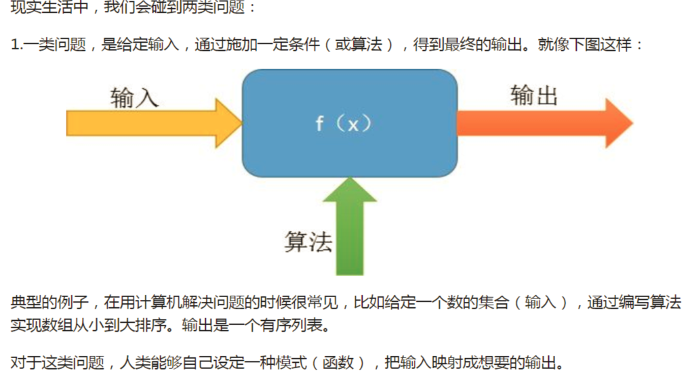
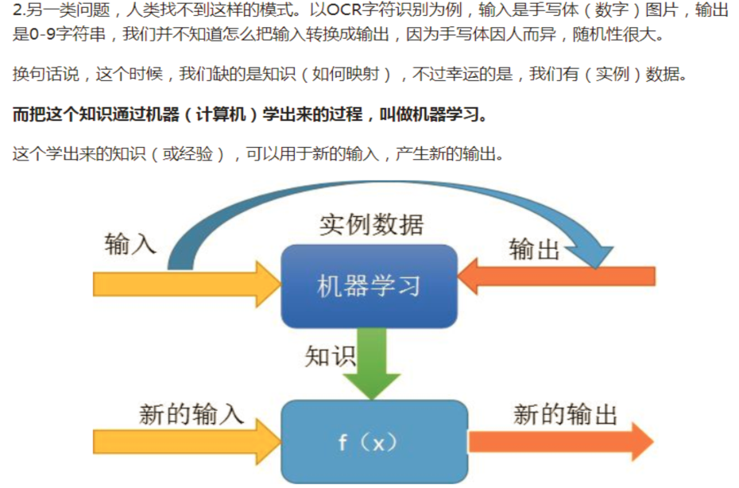
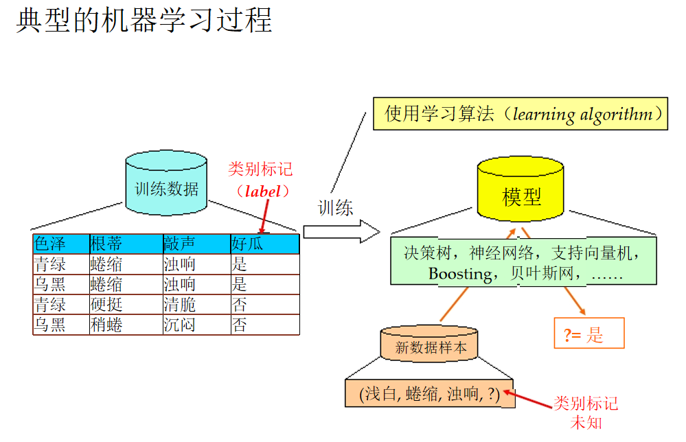

### 基本术语
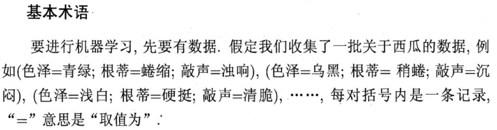
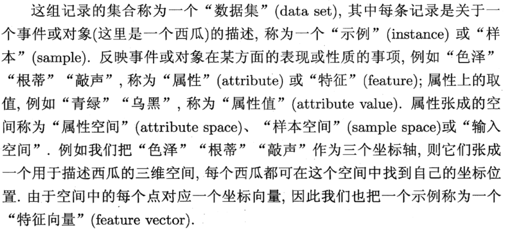
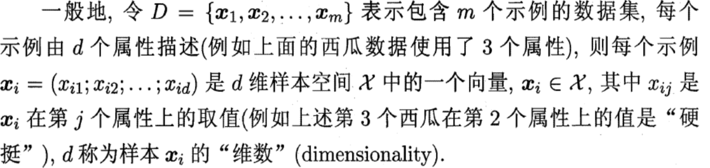
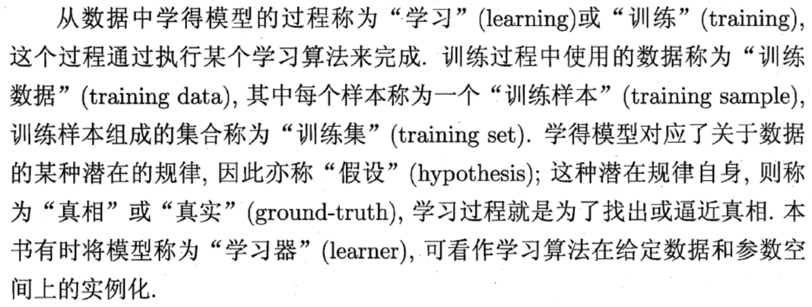  
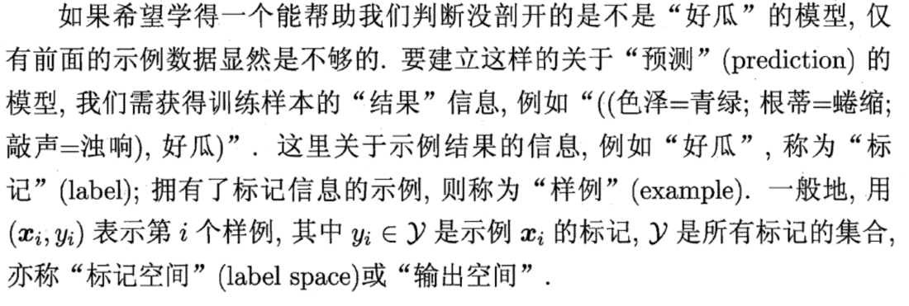
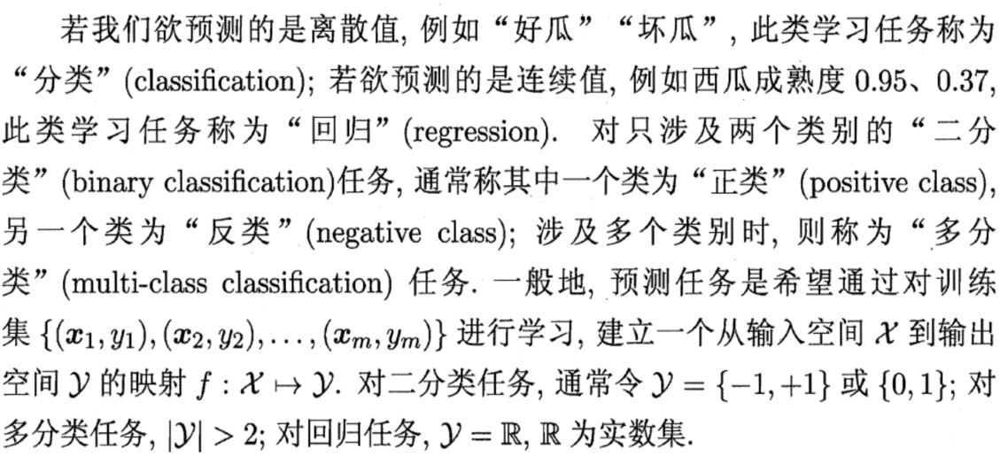
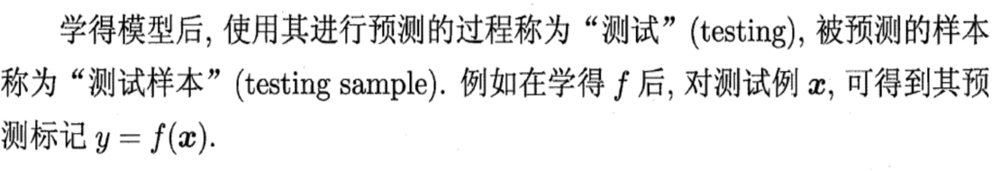
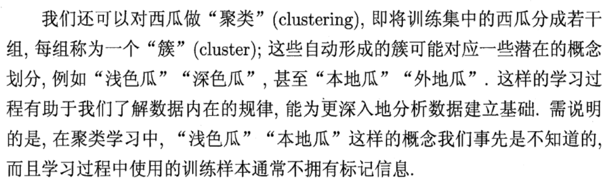
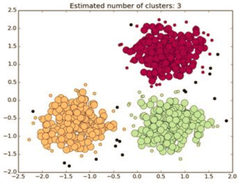
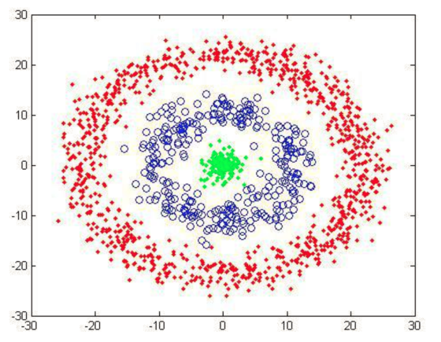
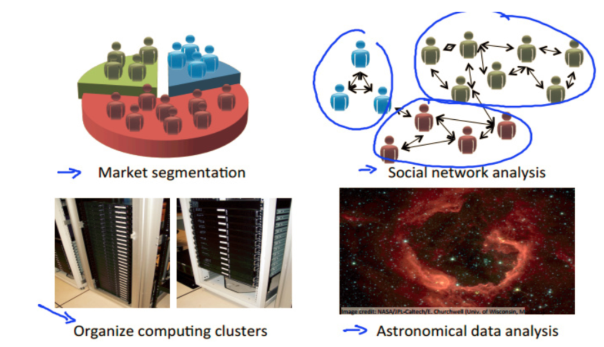
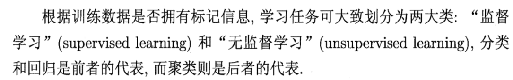
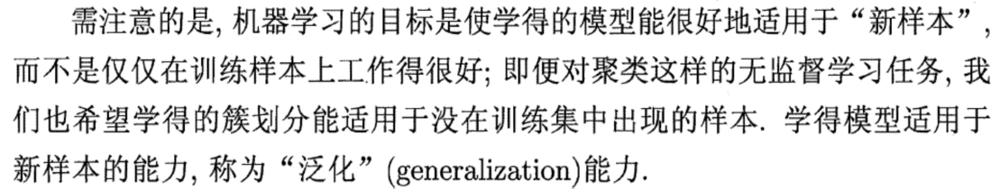
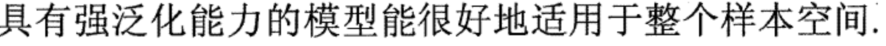
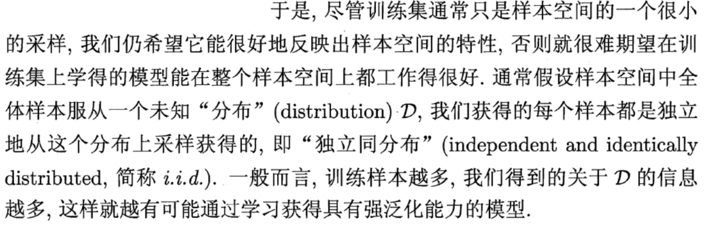
### 假设空间
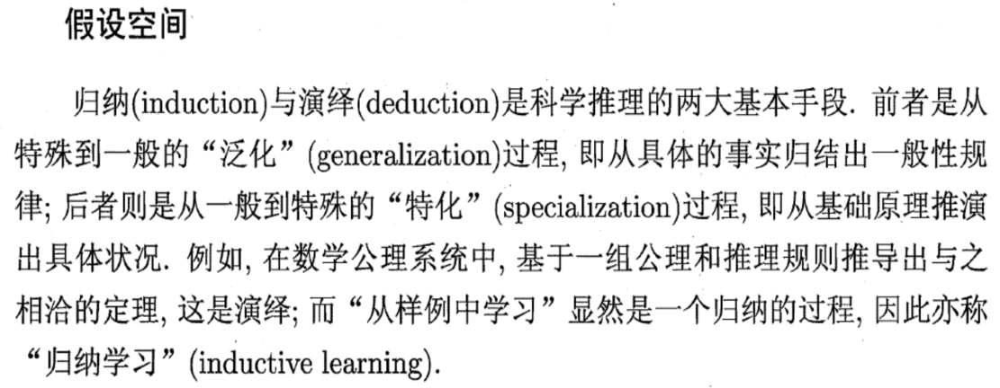
- 监督学习（supervised learning）的任务是学习一个模型，使模型能够对任意给定的输入，对其相应的输出做出 一 个好的预测。

- 模型属于由输入空间到输出空间的映射的集合，这个集合就是假设空间(hypothesis space)。我们也可以将学习过程看作一个在所有假设组成的空间中进行搜索的过程，搜索目标是找到与训练集"匹配"的假设。
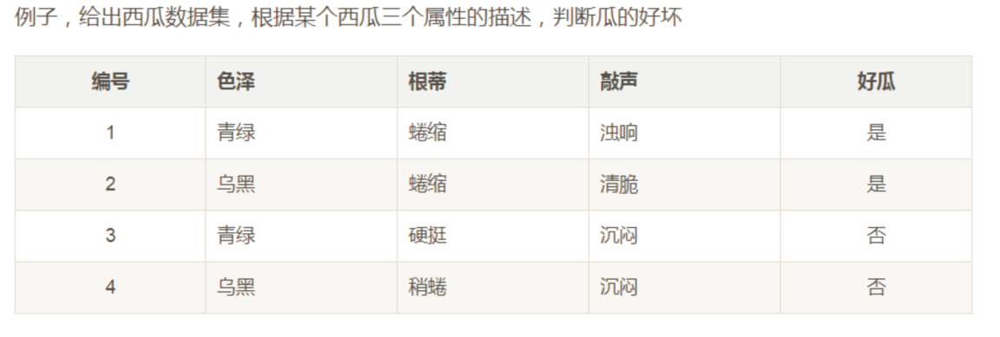
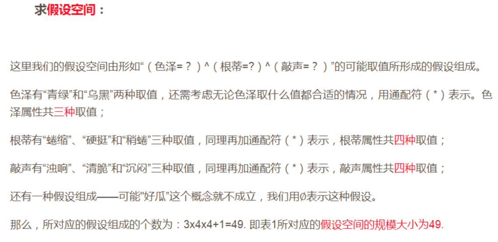
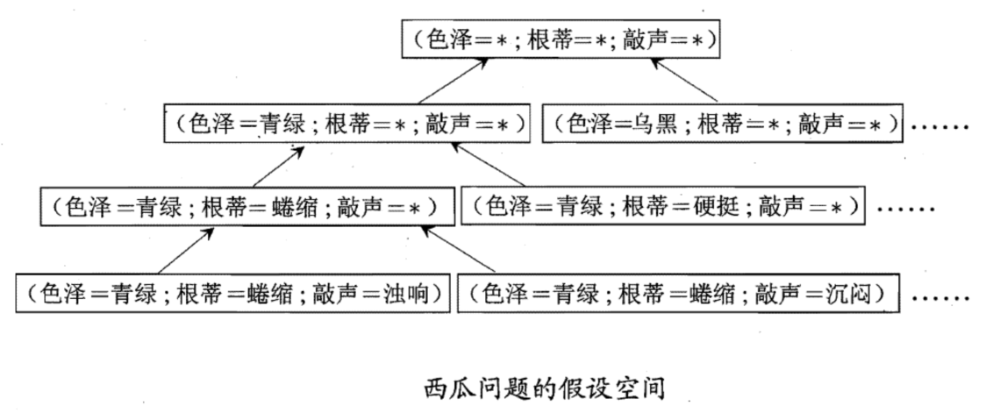
## 2 归纳偏好、发展历程、应用现状
### 归纳偏好
#### 为什么会产生归纳偏好
- 假设现在有三个与训练集一致的假设，但是与它们对应的模型在面临新的一个样本时，会产生不同的输出。这时明显是不合适的。这时我们需要对其得到的假设进行筛选，因此就产生了归纳偏好.
- 深入理解：  实质上，其归纳偏好只是一种判断当一个训练集面对多种假设时的一种思想。
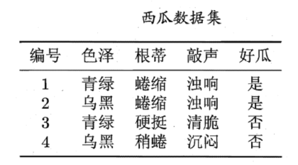
- 上表展示的是一个西瓜的数据集,首先要明确,这是一个二分类问题,我们的目的就是判断一个新的拿来的瓜究竟是不是好瓜,我们将判断好瓜的标准暂且就由三种属性进行判定(色泽,根蒂,敲声)
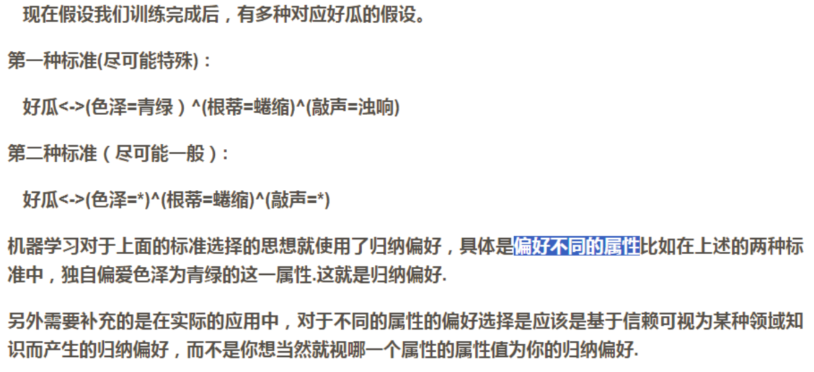
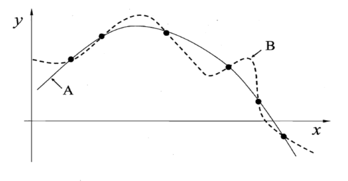
- 归纳偏好的作用在这个回归学习图示中可能更直观.这里的每个训练样本是图中的一个点(x,y),要学得一个与训练集一致的模型,相当于找到条穿过所有训练样本点的曲线显然,对有限个样本点组成的训练集,存在着很多条曲线与其一致.我们的学习算法必须有某种偏好,才能产出它认为“正确”的模型.例如,若认为相似的样本应有相似的输出(例如,在各种属性上都很相像的西瓜,成熟程度应该比较接近),则对应的学习算法可能偏好图中比较“平滑”的曲线A而不是比较“崎岖”的曲线B。
- 归纳偏好可看作学习算法自身在一个可能很庞大的假设空间中对假设进行选择的启发式或“价值观”.那么,有没有一般性的原则来引导算法确立“正确的”偏好呢?“奥卡姆剃刀”(Ocam' s razor)是一种常用的、自然科学研究中最基本的原则,即“若有多个假设与观察一致,则选最简单的那个”,如果采用这个原则,并且假设我们认为“更平滑”意味着“更简单”。
- 事实上,归纳偏好对应了学习算法本身所做出的关于“什么样的模型更好”的假设.在具体的现实问题中,这个假设是否成立,即算法的归纳偏好是否与问题本身匹配,大多数时候直接决定了算法能否取得好的性能。
- 数据分布的复杂性，基本原则并非都是一定有效的。
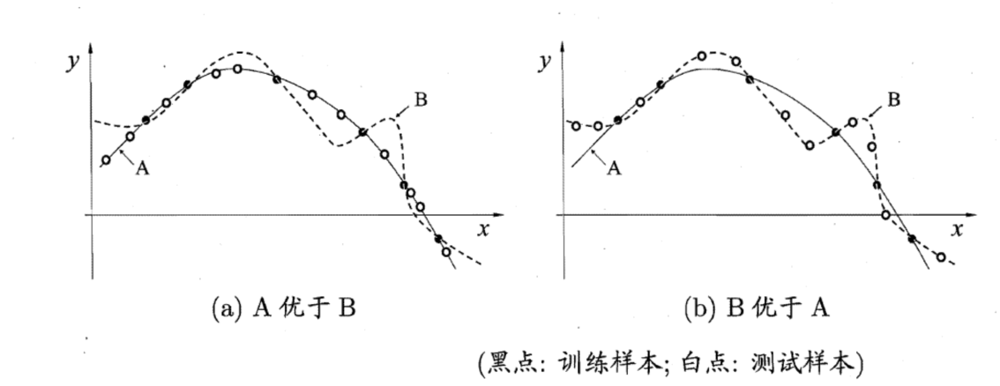
### 发展历程
**机器学习是人工智能应用研究比较重要的分支，它的发展过程大体上可分为4个阶段：**
- 第一阶段是在50年代中叶到60年代中叶，属于热烈时期；
- 第二阶段在60年代中叶至70年代中叶，被称为机器学习的冷静时期；
- 第三阶段从70年代中叶至80年代中叶，称为复兴时期；
- 机器学习的最新阶段始于1986年。一方面，由于神经网络研究的重新兴起，另一方面，对实验研究和应用研究得到前所未有的重视。我国的机器学习研究开始进入稳步发展和逐渐繁荣的新时期。

### 应用现状
- 在搜索引擎方面Google的成功，使得Internet搜索引擎成为新兴产业。机器学习技术正在支撑着各类搜索引擎；
- DARPA(美国国防先进研究项目局)于2003年开始启动5年期PAL计划，这是一个以机器学习为核心的计划(涉及到AI的其他分支，如知识表示和推理、自然语言处理等)；
- 汽车自动驾驶。机器学习的主要任务是从立体视觉中学习如何行驶，根据观察人类的驾驶行为记录各种图像和操纵指令，并将它们进行正确分类；
- 在对天文物体进行分类、计算机系统性能预测、信用卡盗用检测、邮政服务属性识别、网络文档自动分类等方面，机器学习也在快速发展壮大。
- 在企业数据应用的场景下，人们最常用的可能就是监督式学习和无监督式学习的模型。
- 在图像识别等领域，由于存在大量的非标识的数据和少量的可标识数据，目前半监督式学习是一个很热的话题。
- 强化学习更多地应用在机器人控制及其他需要进行系统控制的领域。

### 机器学习的种类
#### 监督学习
- 监督学习是从给定的训练数据集中学习一个函数（模型），当新的数据到来时，可以根据这个函数（模型）预测结果;
- 在监督式学习下，输入数据被称为“训练数据”，每组训练数据有一个明确的标识或结果，如，对防垃圾邮件系统中“垃圾邮件”、“非垃圾邮件”;
- 在建立模型时，监督式学习建立一个学习过程，将预测结果与“测试数据”的实际结果进行比较，不断调整预测模型，直到模型的预测结果达到一个预期的准确率。常见的监督学习算法包括回归分析和统计分类。

#### 无监督学习
- 在无监督式学习中，数据并不被特别标识，学习模型是为了推断出数据的一些内在结构；
- 常见的应用场景包括关联规则的学习以及聚类等。常见算法包括Apriori算法和k-Means算法。
- 监督学习和无监督学习的区别：训练集目标是否被标注。他们都有训练集，且都有输入和输出。

#### 半监督学习
- 半监督学习是==介于监督学习与无监督学习之间==一种机器学习方式，主要考虑如何利用==少量的标注样本==和==大量的未标注样本==进行训练和分类的问题；
- 应用场景包括分类和回归，算法包括一些对常用监督式学习算法的延伸，这些算法首先试图对未标识数据进行建模，在此基础上再对标识的数据进行预测，如图论推理算法（Graph Inference）或者拉普拉斯支持向量机（Laplacian SVM）等；
- 半监督学习从诞生以来，主要用于处理人工合成数据，无噪声干扰的样本数据是当前大部分半监督学习方法使用的数据，而在实际生活中用到的数据却大部分不是无干扰的，通常都比较难以得到纯样本数据。

#### 强化学习
- 强化学习通过观察来学习动作的完成，每个动作都会对环境有所影响，学习对象根据观察到的周围环境的反馈来做出判断；
- 在强化学习下，输入数据直接反馈到模型，模型必须对此立刻做出调整；
- 常见的应用场景包括动态系统以及机器人控制等。常见算法包括Q-Learning 以及时间差学习（Temporal difference learning）。

### 算法分类
- 回归算法（监督学习）
- 神经网络（监督学习）
- SVM支持向量机（监督学习）
- 聚类算法（无监督学习）
- 降维算法（无监督学习）
- 推荐算法（特殊）
- 其他算法

#### 回归算法
- 回归算法有两个重要的子类：即线性回归和逻辑回归；
- 线性回归就是如何拟合出一条直线最佳匹配所有的数据，逻辑回归是一种与线性回归非常类似的算法；
- 线性回归处理的问题类型与逻辑回归不一致：
    1. 线性回归处理的是数值问题，也就是最后预测出的结果是数字，例如房价。
    2. 逻辑回归属于分类算法
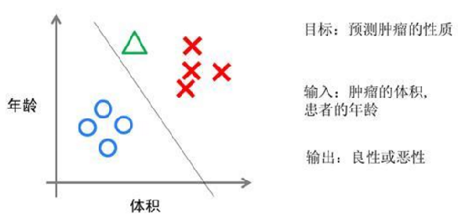
- 假设有一组肿瘤患者的数据，这些患者的肿瘤中有些是良性的(图中的蓝色点)，有些是恶性的(图中的红色点)。这里肿瘤的红蓝色可以被称作数据的“标签”。同时每个数据包括两个“特征”：患者的年龄与肿瘤的大小。我们将这两个特征与标签映射到这个二维空间上，形成了上图的数据。
- 当有一个绿色的点时，该判断这个肿瘤是恶性的还是良性的呢？根据红蓝点我们训练出了一个逻辑回归模型，也就是图中的分类线。这时，根据绿点出现在分类线的右侧，因此我们判断它的标签应该是红色，也就是说属于恶性肿瘤。
- 逻辑回归算法划出的分类线基本都是线性的(也有划出非线性分类线的逻辑回归，不过那样的模型在处理数据量较大的时候效率会很低)，这意味着当两类之间的界线不是线性时，逻辑回归的表达能力就不足。

#### 神经网络
- 神经网络(也称之为人工神经网络，ANN)的诞生起源于对大脑工作机理的研究。早期生物界学者们使用神经网络来模拟大脑，后来，机器学习的学者们使用神经网络进行机器学习的实验，发现在视觉与语音的识别上效果都相当好。
- 神经网络算法是80年代机器学习界非常流行的算法。不过，进入90年代，神经网络的发展进入了一个瓶颈期。其主要原因是神经网络的训练过程很困难。
- 现在，携着“深度学习”之势，神经网络重装归来，重新成为最强大的机器学习算法之一。

#### SVM算法
- SVM算法是诞生于统计学习界，同时在机器学习界大放光彩的经典算法。
- 从某种意义上来说，支持向量机算法是逻辑回归算法的强化：通过给予逻辑回归算法更严格的优化条件，支持向量机算法可以获得比逻辑回归更好的分类界线。
支持向量机是一种数学成分很浓的机器学习算法（相对的，神经网络则有生物科学成分）。- 通过支持向量机算法，既可以保持计算效率，又可以获得非常好的分类效果。因此支持向量机在90年代后期一直占据着机器学习中最核心的地位，基本取代了神经网络算法。直到现在神经网络借着深度学习重新兴起，两者之间才又发生了微妙的平衡转变。
- 通过跟高斯函数的结合，支持向量机可以表达出非常复杂的分类界线，从而达成很好的分类效果。比如，可以将低维的空间映射到高维的空间。
- 如何在二维平面划分出一个圆形的分类界线？在二维平面可能会很困难，但是通过高斯函数可以将二维空间映射到三维空间，然后使用一个线性平面就可以达成类似效果。
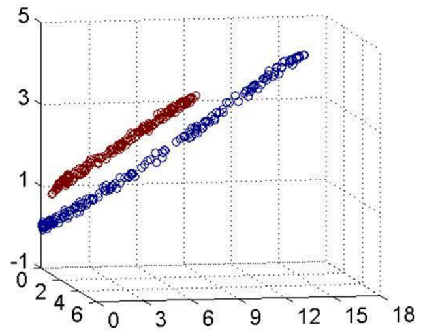

#### 聚类算法
- 聚类算法是无监督学习算法中最典型的代表。
- 聚类算法就是计算种群中的距离，根据距离的远近将数据划分为多个族群。
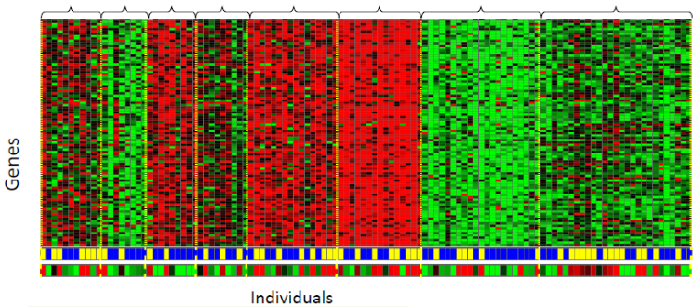
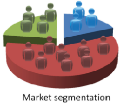

#### 降维算法
- 降维算法也是一种无监督学习算法，主要特征是将数据从高维降低到低维。维度表示数据的特征量的大小。例如，房价包含房子的长、宽、面积与房间数量四个特征，也就是维度为4维的数据。可以看出来，长与宽事实上与面积表示的信息重叠了，例如面积=长 × 宽。通过降维算法，可以去除冗余信息，将特征减少为面积与房间数量两个特征，即从4维的数据压缩到2维。这样，不仅利于表示，同时提高计算的性能。
- 降维算法的主要作用是压缩数据与提升机器学习的效率。通过降维算法，可以将具有几千个特征的数据压缩至若干个特征。另外，降维算法的另一个好处是数据的可视化，例如将5维的数据压缩至2维，然后可以用二维平面来可视。降维算法的主要代表是PCA算法(即主成分分析算法)。

#### 推荐算法
- 推荐算法是目前业界非常火的一种算法，如亚马逊，天猫，京东等都在广泛地运用。推荐算法的主要特征就是可以自动向用户推荐他们最感兴趣的东西，从而增加购买率，提升效益。

- 推荐算法有两个主要的类别：
    1. 一类是基于物品内容的推荐，是将与用户购买的内容近似的物品推荐给用户，这样的前提是每个物品都得有若干个标签，因此才可以找出与用户购买物品类似的物品，这样推荐的好处是关联程度较大。
    2. 另一类是基于用户相似度的推荐，则是将与目标用户兴趣（注：用户画像）相同的其他用户购买的东西推荐给目标用户，例如小A历史上买了物品B和C，经过算法分析，发现另一个与小A近似的用户小D购买了物品E，于是将物品E推荐给小A。
- 两类推荐都有各自的优缺点，在一般的电商应用中，一般是两类混合使用。推荐算法中最有名的算法就是协同过滤算法。

#### 其他算法
- 除了以上算法之外，机器学习界还有其他的如高斯判别，朴素贝叶斯，决策树等等算法。但是上面列的六个算法是使用最多，影响最广，种类最全的典型。机器学习界的一个特色就是算法众多，发展百花齐放。
- 除了这些算法以外，有一些算法的名字在机器学习领域中也经常出现。但他们本身并不算是一个机器学习算法，而是为了解决某个子问题而诞生的。可以理解他们为以上算法的子算法，用于大幅度提高训练过程。其中的代表有：梯度下降法，主要运用在线性回归，逻辑回归，神经网络，推荐算法中；牛顿法，主要运用在线性回归中；BP算法，主要运用在神经网络中；SMO算法，主要运用在SVM中。

### 人工智能操作流程
- 计算机从给定的数据中学习规律，即从观测数据（样本）中寻找规律、建立模型，并利用学习到的规律（模型）对未知或无法观测的数据进行预测。
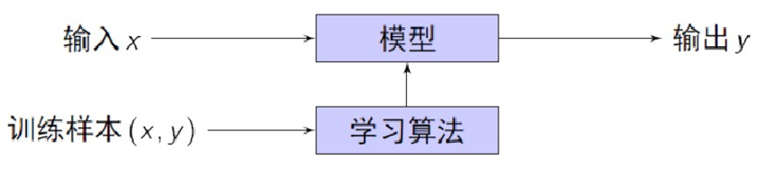
- 操作流程主要分7步:
    1. 数据导入；
    2. 数据预处理；
    3. 特征工程；
    4. 拆分；
    5. 训练模型；
    6. 评估模型；
    7. 预测新数据。

### 人工智能应用
- 机器学习已广泛应用于数据挖掘、计算机视觉、自然语言处理、生物特征识别、搜索引擎、医学诊断、检测信用卡欺诈、证券市场分析、DNA序列测序、语音和手写识别、战略游戏和机器人等领域。

### Spark在机器学习方面：
- Spark MLlib是Spark对常用的机器学习算法的实现库，同时包括相关的测试和数据生成器。
- MLlib目前支持4种常见的机器学习问题: 分类、回归、聚类和协同过滤。
- 机器学习算法一般都有很多个步骤迭代计算的过程，迭代时如果使用Hadoop的MapReduce计算框架，每次计算都要读/写磁盘以及任务的启动等工作，这回导致非常大的I/O和CPU消耗。而Spark基于内存的计算模型天生就擅长迭代计算，多个步骤计算直接在内存中完成，只有在必要时才会操作磁盘和网络。
- 从通信的角度讲，如果使用Hadoop的MapReduce计算框架，JobTracker和TaskTracker之间由于是通过Heartbeat的方式来进行的通信和传递数据，会导致非常慢的执行速度，而Spark具有出色而高效的Akka和Netty通信系统，通信效率极高。
- Logistic Regression的运算场景下，Spark比Hadoop快了100倍以上！
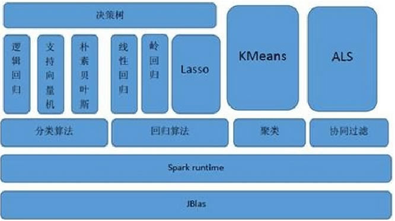
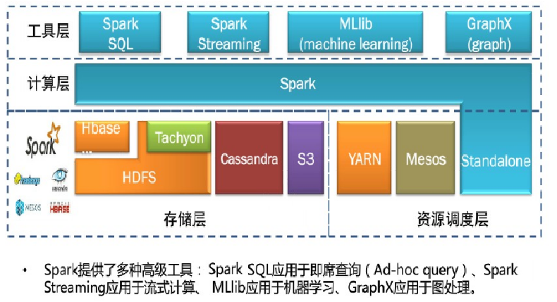