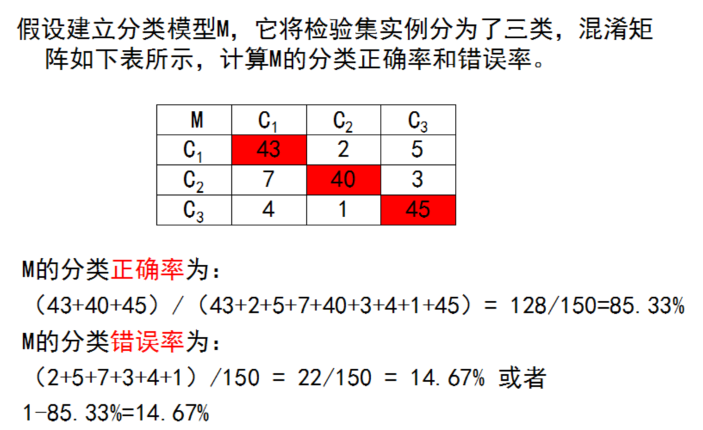

# 人工智能-模型评估与选择-4

## 经验误差与过拟合
- 通常我们把分类错误的样本数占样本总数的比例称为“错误率”(erorrate),即如果在m个样本中有a个样本分类错误,则错误率E=a/m;相应的,1-a/m称为“精度”( accuracy),即“精度=1-错误率”,更一般地,我们把学习器的实际预测输出与样本的真实输出之间的差异称为“误差”(eror)
- 学习器在训练集上的误差称为“训练误差”( training error)或“经验误差”( (empirical error),在新样本上的误差称为“泛化误差”( generalizationeror).显然,我们希望得到泛化误差小的学习器.然而,我们事先并不知道新样本是什么样,实际能做的是努力使经验误差最小化在很多情况下,我们可以学得一个经验误差很小、在训练集上表现很好的学习器,例如甚至对所有训练样本都分类正确,即分类错误率为零,分类精度为100%,但这是不是我们想要的学习器呢?遗憾的是,这样的学习器在多数情况下都不好。

## 评估方法
- 我们实际希望的,是在新样本上能表现得很好的学习器.为了达到这个目的,应该从训练样本中尽可能学出适用于所有潜在样本的“普遍规律”,这样才能在遇到新样本时做出正确的判别然而,当学习器把训练样本学得“太好”了的时候,很可能已经把训练样本自身的一些特点当作了所有潜在样本都会具有的一般性质,这样就会导致泛化性能下降.这种现象在机器学习中称为“过拟合”( overfitting.与“过拟合”相对的是“欠拟合”( underfitting),这是指对训练样本的一般性质尚未学好。

- 有多种因素可能导致过拟合,其中最常见的情况是由于学习能力过于强大以至于把训练样本所包含的不太一般的特性都学到了,而欠拟合则通常是由于学习能力低下而造成的.欠拟合比较容易克服,例如在决策树学习中扩展分支、在神经网络学习中增加训练轮数等,而过拟合则很麻烦.在后面的学习中我们将看到,过拟合是机器学习面临的关键障碍,各类学习算法都必然带有些针对过拟合的措施;然而必须认识到,过拟合是无法彻底避免的,我们所能做的只是“缓解”,或者说减小其风险。

### 方差(bias)与偏差(variance)的角度进行理解


## 评估方法
### 留出法
- “留出法”( nold-out直接将数据集D划分为两个互斥的集合,其中一个集合作为训练集S,另一个作为测试集T,即D=SUT,S∩T=.在S上训练出模型后,用T来评估其测试误差,作为对泛化误差的估计。
- 以二分类任务为例,假定D包含1000个样本,将其划分为S包含700个样本,T包含300个样本,用S进行训练后,如果模型在T上有90个样本分类错误,那么其错误率为(90/300)×100%=30%,相应的,精度为1-30%=70%
- 需注意的是,训练/测试集的划分要尽可能保持数据分布的一致性,避免因数据划分过程引入额外的偏差而对最终结果产生影响,例如在分类任务中至少要保持样本的类别比例相似如果从采样( sampling)的角度来看待数据集的划分过程,则保留类别比例的.样方式通常称为“分层采样”( stratifiedsampling)
- 例如通过对D进行分层采样而获得含70%样本的训练集S和含30%样本的测试集T,若D包含500个正例、500个反例,则分层样得到的S应包含350个正例、350个反例,而T则包含150个正例和150个反例;若S、T中样本类别比例差别很大,则误差估计将由于训练/测试数据分布的差异而产生偏差。
- 另一个需注意的问题是,即便在给定训练测试集的样本比例后,仍存在多种划分方式对初始数据集D进行分割例如在上面的例子中,可以把D中的样本排序,然后把前350个正例放到训练集中,也可以把最后350个正例放到训练集中,……这些不同的划分将导致不同的训练/测试集,相应的,模型评估的结果也会有差别因此,单次使用留出法得到的估计结果往往不够稳定可靠,在使用留出法时,一般要采用若干次随机划分、重复进行实验评估后取平均值作为留出法的评估结果例如进行100次随机划分,每次产生一个训练/测试集用于实验评估,100次后就得到100个结果,而留出法返回的则是这100个结果的平均。
- 常见做法是将大约2/3~4/5的样本用于训练,剩余样本用于测试。

### 留出法代码演示
```
# 留出法
# In[]
# import numpy as np
# import pandas as pd
import numpy as np
import pandas as pd

# 读入数据，为dataframe格式
# df = pd.read_csv('iris.data', header=None)
# 显示前面行
# df.head()
data_dir = 'C:/video/机器学习/6 （必修）第二部分：模型评估与选择/'
df = pd.read_csv(data_dir + 'iris.data', header=None)
df.head()

# In[]
# 显示后面行
# df.tail()
df.tail()

# In[]
# 取dataframe中的数据到数组array
# y = df.iloc[:, 4].values
# 长度和类别
# len(y), np.unique(y)
y = df.iloc[:, 4].values
len(y), np.unique(y)

# In[]
# 把类别转为整数
# from sklearn.preprocessing import LabelEncoder
from sklearn.preprocessing import LabelEncoder

# le = LabelEncoder()
# y_i = le.fit_transform(y)
# np.unique(y_i)
le = LabelEncoder()
y_i = le.fit_transform(y)
# np.unique(y_i)
y_i

# In[]
# 前50个数据和最后50个数据
# y_i[:50], y_i[-50:]
y_i[:50], y_i[-50:]

# In[]
# 获取两列特征数据
# x = df.iloc[:, [2, 3]].values
# shape和前10行
# x.shape, x[:10]
x = df.iloc[:, [2, 3]].values
x.shape, x[:10]

# In[]
# 分割训练集和测试集
# from sklearn.model_selection import train_test_split
# from sklearn.preprocessing import StandardScaler
# from sklearn.linear_model import LogisticRegression
from sklearn.model_selection import train_test_split
from sklearn.preprocessing import StandardScaler
from sklearn.linear_model import LogisticRegression

# 测试次数 
print('留出法')
# n = 10
# scores = 0.0
n = 10
scores = 0.0

# In[]:
# for i in range(n):
for i in range(n):
    # x_train, x_test, y_train, y_test = train_test_split(
    #    x, y_i, test_size=0.3, stratify=y)
    x_train, x_test, y_train, y_test = train_test_split(
        x, y_i, test_size=0.3, stratify=y)

    # sc = StandardScaler()
    # sc.fit(x_train)
    # x_train_std = sc.transform(x_train)
    # x_test_std = sc.transform(x_test)
    sc = StandardScaler()
    sc.fit(x_train)
    x_train_std = sc.transform(x_train)
    x_test_std = sc.transform(x_test)

    # 逻辑回归进行训练
    lr = LogisticRegression(C=100.0, random_state=1)
    lr.fit(x_train_std, y_train)
    s = lr.score(x_test_std, y_test)
    scores = scores + s
    print('%d -- Accuracy: %.2f' % (i + 1, s))

# In[]
print('Average accuracy is %.2f' % (scores / n))
```
### 交叉验证法

#### leave-one-out留一法 ---- 特殊的K折交叉验证(适合小数据)
- 每次只有一个样本用于验证，其他样本用于训练，适于数据集非常小的情况。比如只有50个样本，每次1个样本用于验证，其他49个进行训练，一共进行50次。

- 当数据量比较大的时候，留一法的计算复杂度会过高！
而且实验已经证明，在数据量较大的时候，留一法与一般的交叉验证的性能基本没有区别。

#### 交叉验证代码展示
```
# In[]:
# 10折/倍交叉验证
import numpy as np
from sklearn.model_selection import StratifiedKFold

print('\n\n交叉验证')
y = y_i

# kfold = StratifiedKFold(n_splits=10,random_state=1).split(x, y)
kfold = StratifiedKFold(n_splits=10, random_state=1, shuffle=True).split(x, y)

# In[]
scores = []
lr = LogisticRegression(C=100.0, random_state=1)

# In[]
# for k, (train, test) in enumerate(kfold):
for k, (train, test) in enumerate(kfold):
    lr.fit(x[train], y[train])
    score = lr.score(x[test], y[test])
    scores.append(score)
    print('Fold: %2d, Acc: %.3f' % (k + 1, score))

print('\nCV accuracy: %.3f +/- %.3f' % (np.mean(scores), np.std(scores)))
```

### 自助法
- 我们希望评估的是用D训练出的模型.但在留出法和交叉验证法中,由于保留了一部分样本用于测试,因此实际评估的模型所使用的训练集比D小,这必然会引入一些因训练样本规模不同而导致的估计偏差.留一法受训练样本规模变化的影响较小,但计算复杂度又太高了.有没有什么办法可以减少训练样本规模不同造成的影响,同时还能比较高效地进行实验估计呢?
- “自助法”( bootstrapping)是一个比较好的解决方案,它直接以自助采样法( bootstrap sampling)为基础 Sfron and tibshirani,1993.给定包含m个样本的数据集D,我们对它进行采样产生数据集D:每次随机从D中挑选一个样本,将其拷贝放入D′,然后再将该样本放回初始数据集D中,使得该样本在下次采样时仍有可能被采到;这个过程重复执行m次后,我们就得到了包含m个样本的数据集D,这就是自助采样的结果.显然,D中有一部分样本会在D中多次出现,而另一部分样本不出现.
- 通过自助采样,初始数据集D中约有36.8%的样本未出现在采样数据集D中.于是我们可将D用作训练集,D\D用作测试集;这样,实际评估的模型与期望评估的模型都使用m个训练样本,而我们仍有数据总量约1/3的、没在训练集中出现的样本用于测试这样的测试结果,亦称“包外估计” out-of-bagestimate)
- 自助法在数据集较小、难以有效划分训练/测试集时很有用;此外,自助法能从初始数据集中产生多个不同的训练集,这对集成学习等方法有很大的好处然而,自助法产生的数据集改变了初始数据集的分布,这会引入估计偏差.因此,在初始数据量足够时,留出法和交叉验证法更常用一些。

### 自助法代码展示
```
import random
from sklearn.linear_model import LogisticRegression

print('\n\n自助法\n')


# In[]
def BootStrap(num):
    slice = []

    while len(slice) < num:
        p = random.randrange(0, num)  # [0,num)
        slice.append(p)

    return slice


def GetDataByIndex(x, y, index):
    new_x = []
    new_y = []

    for i in index:
        new_x.append(x[i])
        new_y.append(y[i])

    new_x = np.array(new_x)
    new_y = np.array(new_y)
    return new_x, new_y


# In[]
# 随机处理次数
times = 10

# 样本数量
y = y_i
num = len(y)
all_index = set(np.arange(num))

scores = []
lr = LogisticRegression(C=100.0, random_state=1)

# In[]
for i in range(times):
    print()
    train_index = BootStrap(num)
    print(train_index)

    # 找出未出现的索引号

    # 首先去除重复
    print('去除重复')
    unique_index = list(set(train_index))
    print(unique_index)

    # 未出现索引数据
    print('补集，未出现数据索引')
    test_index = list(all_index - set(unique_index))
    print(test_index)

    # 根据索引获取训练数据和测试数据
    x_train, y_train = GetDataByIndex(x, y, train_index)
    x_test, y_test = GetDataByIndex(x, y, test_index)

    lr.fit(x_train, y_train)
    score = lr.score(x_test, y_test)
    scores.append(score)
    print('次数: %2d, 准确率: %.3f' % (i + 1, score))

print('\n平均准确率: %.3f +/- %.3f' % (np.mean(scores), np.std(scores)))
```

### 调参与最终模型
- 大多数学习算法都有些参数( parameter)需要设定,参数配置不同,学得模型的性能往往有显著差别因此,在进行模型评估与选择时,除了要对适用学习算法进行选择,还需对算法参数进行设定,这就是通常所说的“参数调节”或简称“调参”( parameter tuning)
- 有一点需注意:学习算法的很多参数是在实数范围内取值,因此,对每种参数配置都训练出模型来是不可行的.现实中常用的做法,是对每个参数选定一个范围和变化步长,例如在[0,0.2]范围内以0.05为步长,则实际要评估的候选参数值有5个,最终是从这5个候选值中产生选定值显然,这样选定的参数值往往不是“最佳”值,但这是在计算开销和性能估计之间进行折中的结果,通过这个折中,学习过程才变得可行.事实上,即便在进行这样的折中后,调参往往仍很困难.可以简单估算一下:假定算法有3个参数,每个参数仅考虑5个候选值,这样对每一组训练测试集就有53=125个模型需考察;很多强大的学习算法有大量参数需设定,这将导致极大的调参工程量,以至于在不少应用任务中,参数调得好不好往往对最终模型性能有关键性影响.
- 给定包含m个样本的数据集D,在模型评估与选择过程中由于需要留出部分数据进行评估测试,事实上我们只使用了一部分数据训练模型.因此,在模型选择完成后,学习算法和参数配置已选定,此时应该用数据集D重新训练模型.这个模型在训练过程中使用了所有m个样本,这才是我们最终提交给用户的模型。
- 另外,需注意的是,我们通常把学得模型在实际使用中遇到的数据称为测试数据,为了加以区分,模型评估与选择中用于评估测试的数据集常称为“验证集”( validation set).例如,在研究对比不同算法的泛化性能时,我们用测试集上的判别效果来估计模型在实际使用时的泛化能力,而把训练数据另外划分为训练集和验证集,基于验证集上的性能来进行模型选择和调参。

## 性能度量
### 混淆矩阵




### 混淆矩阵代码展示
```
# 性能度量方法
# In[]
import numpy as np
import pandas as pd

# 读入数据，为dataframe格式
data_dir = 'F:/2019-notebook/2017_2018_2/python_code/MTrain/MachineLearn/3_ML/1.6/'
df = pd.read_csv(data_dir+'iris.data', header=None)
# 显示前面行和后面行
df.head()

# In[]
# 取dataframe中的数据到数组array，展示二分类性能度量，取后100个数据
y_org = df.iloc[-100:, 4].values 
# 长度和类别
len(y_org), np.unique(y_org)

# In[]
# 取特征数据
x = df.iloc[-100:,[2,3]].values
x.shape,x[:10]


# In[]
# 把类别转为整数
from sklearn.preprocessing import LabelEncoder
# 将两类'Iris-versicolor', 'Iris-virginica'转为整数
# 关心的分类为positive类,注意在python包中，缺省的认为1是positive类
le = LabelEncoder()
# fit是设置参数，这里找到所有类别，按照字母顺序排序后，以0为索引给类别分配数字
# 所以'Iris-versicolor', 'Iris-virginica'分别是0和1类
le.fit(y_org)
le.classes_


# In[]
# transform是根据fit的参数进行转换，将y_org中的所有类别值根据设置好的整数类别值进行转换
# 'Iris-virginica'是1值，是二分类中的positive类
y_i =  le.transform(y_org)
le.classes_

# In[]
np.unique(y_i)

# In[]
y_org

# In[]
y_i

# In[]
# 由于1表示positive类，如果关注的是'Iris-versicolor'类，需要把该类设置为1即可
# 思路很简单，将y_i中的1设置0，0设置为1即可,当然方法有很多种，编程实现即可
y_t = y_i.copy()
y_t[:50] = 1
y_t[50:] = 0
y_t

# In[]
y_i

# In[]
import numpy as np
from sklearn.model_selection import StratifiedKFold
from sklearn.preprocessing import StandardScaler
from sklearn.linear_model import LogisticRegression
from sklearn.metrics import confusion_matrix
from sklearn.metrics import precision_score, recall_score, f1_score

print('\n\n交叉验证\n')
y = y_i
kfold = StratifiedKFold(n_splits=10, random_state=1).split(x, y)

scores = []
lr = LogisticRegression(C=100.0, random_state=1)

for k, (train, test) in enumerate(kfold):
    lr.fit(x[train], y[train])
    print('Fold: %2d' % (k+1))
    # 注意！！在python中，认为1是positive，所以关注的类，要赋值为1
    # 混淆矩阵
    y_pred = lr.predict(x[test])
    confmat = confusion_matrix(y_true=y[test], y_pred=y_pred)
    print(confmat)
    print()

    # 以Fold 2为例，混淆矩阵如下，1表示positive
    #    0  1 
    # 0  5  0
    # 1  1  4
    # TP = 4, TN = 5, FP = 0, FN = 1, 下面套公式计算即可

    # 可以看出混淆矩阵的缺省排序是从0开始，由于1是positive，从1开始和所讲的就保持一致了
    confmat2 = confusion_matrix(y_true=y[test], y_pred=y_pred, labels=[1, 0])
    print(confmat2)

    # 仍以Fold 2为例，混淆矩阵如下，1表示positive
    #    1  0 
    # 1  4  1
    # 0  0  5
    # TP = 4, TN = 5, FP = 0, FN = 1, 下面套公式计算即可

    # 准确率度量
    score = lr.score(x[test], y[test])
    scores.append(score)
    print('Acc: %.3f' % (score))

    # 精确度
    print('Precision: %.3f' % precision_score(y_true=y[test], y_pred=y_pred))
    # 召回率/敏感度/真正率/真阳性率
    print('Recall: %.3f' % recall_score(y_true=y[test], y_pred=y_pred))
    # F1-score
    print('F1: %.3f' % f1_score(y_true=y[test], y_pred=y_pred))

    # 以Fold 2为例，混淆矩阵如下，1表示positive
    #    0  1 
    # 0  5  0
    # 1  1  4
    # TP = 4, TN = 5, FP = 0, FN = 1, 下面套公式计算即可

    # 特异度/真负率/真阴性率，可以通过混淆矩阵直接运算出来,事实上，其他的性能指标都可以通过混淆矩阵计算
    tn = confmat[0,0]
    fp = confmat[0,1]
    spec = float(tn)/(float(tn)+float(fp))
    print('Spec: %.3f' % spec)

    print('\n')
```

## 分类回归小例子
```python
# 显示当前路径
import os
os.getcwd()
import numpy as np
import pandas as pd
# 读入数据，为dataframe格式
data_path = 'C:\\video\\'
df = pd.read_csv(data_path + 'iris.data', header=None)
# 显示前面行
df.head()

Out[6]: 
     0    1    2    3            4
0  5.1  3.5  1.4  0.2  Iris-setosa
1  4.9  3.0  1.4  0.2  Iris-setosa
2  4.7  3.2  1.3  0.2  Iris-setosa
3  4.6  3.1  1.5  0.2  Iris-setosa
4  5.0  3.6  1.4  0.2  Iris-setosa

# 显示后面行
df.tail()

Out[7]: 
       0    1    2    3               4
145  6.7  3.0  5.2  2.3  Iris-virginica
146  6.3  2.5  5.0  1.9  Iris-virginica
147  6.5  3.0  5.2  2.0  Iris-virginica
148  6.2  3.4  5.4  2.3  Iris-virginica
149  5.9  3.0  5.1  1.8  Iris-virginica

# In[]
type(df)
Out[8]: pandas.core.frame.DataFrame

# 取dataframe中的数据到数组array iloc[行，列]
y = df.iloc[:, 4].values 
type(y)

Out[9]: numpy.ndarray

# 长度和类别 unique进行去重
len(y), np.unique(y)

Out[10]: 
(150,
 array(['Iris-setosa', 'Iris-versicolor', 'Iris-virginica'], dtype=object))
 
y.shape
Out[11]: (150,)

# 把类别转为整数
from sklearn.preprocessing import LabelEncoder

le = LabelEncoder()
y_i = le.fit_transform(y)
np.unique(y_i)

Out[12]: array([0, 1, 2])

# 前50个数据和最后50个数据
y_i[:50], y_i[50:100], y_i[-50:]

(array([0, 0, 0, 0, 0, 0, 0, 0, 0, 0, 0, 0, 0, 0, 0, 0, 0, 0, 0, 0, 0, 0,
        0, 0, 0, 0, 0, 0, 0, 0, 0, 0, 0, 0, 0, 0, 0, 0, 0, 0, 0, 0, 0, 0,
        0, 0, 0, 0, 0, 0]),
 array([1, 1, 1, 1, 1, 1, 1, 1, 1, 1, 1, 1, 1, 1, 1, 1, 1, 1, 1, 1, 1, 1,
        1, 1, 1, 1, 1, 1, 1, 1, 1, 1, 1, 1, 1, 1, 1, 1, 1, 1, 1, 1, 1, 1,
        1, 1, 1, 1, 1, 1]),
 array([2, 2, 2, 2, 2, 2, 2, 2, 2, 2, 2, 2, 2, 2, 2, 2, 2, 2, 2, 2, 2, 2,
        2, 2, 2, 2, 2, 2, 2, 2, 2, 2, 2, 2, 2, 2, 2, 2, 2, 2, 2, 2, 2, 2,
        2, 2, 2, 2, 2, 2]))


# 获取两列特征数据
x = df.iloc[:, [2, 3]].values
# shape和前10行
x.shape

Out[14]: (150, 2)

x[:10]

array([[1.4, 0.2],
       [1.4, 0.2],
       [1.3, 0.2],
       [1.5, 0.2],
       [1.4, 0.2],
       [1.7, 0.4],
       [1.4, 0.3],
       [1.5, 0.2],
       [1.4, 0.2],
       [1.5, 0.1]])
       
# 分割训练集和测试集
from sklearn.model_selection import train_test_split

x_train, x_test, y_train, y_test = train_test_split(
    x, y_i, test_size=0.3, random_state=1, stratify=y)
len(y_train),len(y_test)

Out[16]: (105, 45)

# 统计每一种类型数量
for t in np.unique(y_train):
    print(t)
    print(list(y_train).count(t))
    
0
35
1
35
2
35

for t in np.unique(y_test):
    print(t)
    print(list(y_test).count(t))
    
0
15
1
15
2
15

# 数据标准化
from sklearn.preprocessing import StandardScaler

sc = StandardScaler()
sc.fit(x_train)
x_train_std = sc.transform(x_train)
x_test_std = sc.transform(x_test)

x_train_std[:10]

Out[19]: 
array([[-1.33269725, -1.30380366],
       [-1.16537974, -1.30380366],
       [ 0.84243039,  1.44465434],
       [ 1.0655204 ,  1.18289644],
       [-1.44424226, -1.30380366],
       [ 1.0097479 ,  1.57553329],
       [ 1.56747294,  1.18289644],
       [-1.44424226, -1.30380366],
       [ 1.12129291,  0.52850167],
       [ 0.45202286,  0.13586482]])


# 使用逻辑回归进行分类
from sklearn.linear_model import LogisticRegression

lr = LogisticRegression(C=100.0, random_state=1)
# 训练
lr.fit(x_train_std, y_train)

Out[20]: LogisticRegression(C=100.0, random_state=1)


```