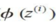

# 人工智能-线性模型-5
[toc]
## 线性回归
### 定义
- 线性回归是回归问题中的一种，线性回归假设目标值与特征之间线性相关，即满足一个多元一次方程。通过构建损失函数，来求解损失函数最小时的参数w和b。通长我们可以表达成如下公式：
- 
- y^为预测值，自变量x和因变量y是已知的，而我们想实现的是预测新增一个x，其对应的y是多少。因此，为了构建这个函数关系，目标是通过已知数据点，求解线性模型中w和b两个参数。
- 基于前面所定义的线性方程,线性回归可看作是求解样本点的最佳拟合直线,如下图所示：
- 
- 这条最佳拟合线也被称为回归线( regression line),回归线与样本点之间的垂直连线即所谓的偏移(offset)或残差( residual)-—预测的误差。
- 在只有一个解释变量的特殊情况下，线性回归也称为简单线性回归（simple linear regression）
- 当然，我们可以将线性回归模型扩展为多个解释变量。此时，即为所谓的多元线性回归（multiple linear regression）：
- 
- 

### 目标/损失函数
- 求解最佳参数，需要一个标准来对结果进行衡量，为此我们需要定量化一个目标函数式，使得计算机可以在求解过程中不断地优化。
- 针对任何模型求解问题，都是最终都是可以得到一组预测值y^ ，对比已有的真实值 y ，数据行数为 n ，可以将损失函数定义如下：
- 
- 即预测值与真实值之间的平均的平方距离，统计中一般称其为MAE(mean square error)均方误差。把之前的函数式代入损失函数，并且将需要求解的参数w和b看做是函数L的自变量，可得
- 
- 现在的任务是求解最小化L时w和b的值，即核心目标优化式为
- 

### 基于最小二乘法构建线性回归模型
- 可将线性回归模型看作通过训练数据的样本点来寻找一条最佳拟合直线。不过，在此既没有对最佳拟合做出定义，也没有研究拟合类似模型的各种技术。在接
下来的部分中，通过最小二乘法估计回归曲线的参数，使得回归曲线到样本点垂直距离（残差或误差）的平方和最小。

### 通过梯度下降计算回归参数
- 
- 
- 预测函数：
- 
- 预测函数是线性函数，是连续型函数，连续性函数的主要优点在于：其代价函数/目标函数J(w)是可导的。而且是一个凸函数；这样，可以通过简单、高效的梯度下降优
化算法来得到权重，且能保证在训练集样本中的代价函数最小。
- 如下图所示，将梯度下降的原理形象地描述为下山，直到获得一个局部或者全局最小值。在每次迭代中，根据给定的学习速率和梯度的斜率，能够确定每次移动的步幅，按照步幅沿着梯度方向前进一步。
- 
- 
- 
- 

### 代码实现线性回归
- 本质是实现以下的函数：
- 线性回归函数：
- 损失函数：
- 特征权重：
- 权重增量：
```
# 线性回归的实现类，通过梯度下降来更新权重
import numpy as np


class LinearRegressionGD(object):
    # eta=学习率 n_iter=迭代次数
    def __init__(self, eta=0.001, n_iter=20):
        self.eta = eta
        self.n_iter = n_iter

    def net_input(self, x):
        """
        y = w0x0 + w1x1 + ... + wnxn
        :param x:样本特征值，可以是一组特征向量，也可以是多组特征向量,如果有m个用于预测的特征，对于一组，即一个输入样本，shape是1行m列，
        shape是(1,m),如果是多个输入样本同时处理，假设是n个样本，则是n行m列，shape是(n,m)
        :key w_:用来存储特征值的权重，通过随机梯度下降法的优化方法求出。w_是一个向量，长度是特征个数加1，因为每个特征对应一个权重，
        还有一个特殊的权重，表示偏移的常量b，一般用w0表示，对应的x0是常数1。根据上面描述，有m个特征，所以w_的shape是m+1，这个值是在fit函数中初始化
        :keyword np.dot:用于向量点乘或矩阵乘法（矩阵乘法的本质也是行与列的点乘）
        所以代码的意思就是输入n个样本特征，并根据线性公式计算出对应的y值，即线性回归的预测值。
        :return: y
        """
        return np.dot(x, self.w_[1:]) + self.w_[0]

    def fit(self, x, y):
        """
        :keyword: fit:拟合就是训练的意思，输入的是样本特征数据X，和每个样本特征对应的真实标签值y。
        :keyword: self.w_ = np.zeros(1 + X.shape[1]) 根据刚才讲的，w_用来存储特征值的权重，是一个向量，长度是特征个数加1，
        因为每个特征对应一个权重,还有一个特殊的权重，表示偏移的常量，一般用w0表示X.shape为(n,m)，n是样本数，m是特征数，
        所以X.shape[1]就是特征数，1 + X.shape[1]就是特征数加1.全部初始化为0.
        :keyword: self.cost_ = [] 用来保存每一次的预测误差，就是代价函数J(w)的结果，很明显，这个cost的值是越小越好
        :return:
        """

        self.w_ = np.zeros(1 + x.shape[1])
        self.cost_ = []

        """
        1. 一般来说，都要训练多次来找到最佳的w值，使得cost最小或接近最小。n_iter是训练的次数，也是循环的次数。
        2. output = self.net_input(X) 根据刚才讲的内容，output是线性函数的预测结果
        3. errors = (y - output) y是X特征的真实标签结果，所以真实值减去预测值就是误差errors
        4. self.w_[1:] += self.eta * X.T.dot(errors) 对每个特征值对应的权重w进行更新操作，不包括偏移值w0，与权重更新公式对应理解
            根据权重更新公式，wj的变化delta为：学习率eta乘以每个样本的误差(y-output)乘以对应特征值xj的和，再对比更新公式。
        5. 公式就是与self.eta * X.T.dot(errors)对应，这里T表示转置的意思。
        6. self.w_[0] += self.eta * errors.sum() 对w0偏移量单独更新，因为特殊，w0对应的特征值x0是一个常数1，所以对应w的更新公式，
        更新结果就是eta乘以所有样本y-output=errors的和，直接用sum函数求和。公式中的xj就是x0，为常数1值。
        7. cost = (errors**2).sum() / 2.0完全对应代价函数，error误差的平方后求和除以2
        8. self.cost_.append(cost)记录每一次训练后的代价值
        """

        for i in range(self.n_iter):
            output = self.net_input(x)
            errors = (y-output)
            self.w_[1:] += self.eta * x.T.dot(errors)
            self.w_[0] += self.eta * errors.sum()
            cost = (errors**2).sum() / 2.0
            self.cost_.append(cost)
        return self

```

### 波士顿房屋数据集例子
- 在实现第一个线性回归模型之前，先介绍一个新的数据集：波士顿房屋数据集（Housing Dataset），它是由D.Harrison和D.L.Rubinfeld于1978年收集的波士顿郊区房屋的信息。此房屋数据集可免费使用。
- 
- 我们将以房屋价格（MEDV）作为目标变量——使用其他13个变量中的一个或多个值作为解释变量对其进行预测。

#### 可视化数据的重要特征
- **探索性数据分析（Exploratory Data Analysis，EDA）是机器学习模型训练之前的一个重要步骤。**

- **借助EDA图形工具箱中那些简单且有效的技术，可以帮助我们直观地发现数据中的异常情况、数据的分布情况，以及特征间的相互关系。**

- 首先，借助散点图矩阵，可视化的方法汇总显示各不同特征两两之间的关系。为了绘制散点图矩阵，需要用到seaborn库中的pairplot函数它是在matplotlib基础上绘制统计图像的Python库。


- **通过此散点图矩阵，可以快速了解数据是如何分布的，以及其中是否包含异常值。例如，可直观看出RM和房屋价格MEDV（第5列和第4行）之间存在线性关系。此外，从MEDV直方图（散点图矩阵的右下角子图）中可以发现：MEDV看似呈正态分布，但包含几个异常值。**

> 注意：导入seaborn库后，会覆盖当前Python会话中matplotlib默认的图像显示方式。如果不希望使用seaborn风格的设置，可以通过如下命令重设为matplotlib的风格：sns.reset_orig()

- 为了量化特征之间的关系，需要创建一个相关系数矩阵，与协方差矩阵是密切相关的。直观上来看，可以把相关系数矩阵看作协方差矩阵的标准化版本。实际上，相关系数矩阵就是在将数据标准化后得到的协方差矩阵。

- **此处，我们需要掌握的是**：
相关系数矩阵是一个包含皮尔逊积矩相关系数（Pearson product-moment correlation coefficient的方阵，它用来衡量两两特征间的线性依赖关系


- 从结果图像中可见，相关系数矩阵提供了另外一种有用的图形化数据描述方式，
由此可以根据各特征间的线性相关性进行特征选择：

- 为了拟合线性回归模型，主要关注那些跟目标变量MEDV高度相关的特征。观察前面的相关系数矩阵，可以发现MEDV与变量LSTAT的相关性最大（-0.74）。大家应该还记得，前面的散点图矩阵显示LSTAT和MEDV之间存在明显的非线性关系。另一方面，正如散点图矩阵所示，RM和MEDV间的相关性也较高（0.70），考虑到从散点图中观察到了这两个变量之间的线性关系，因此，在后续中使用RM作为解释变量进行简单线性回归模型训练，是一个较好的选择。

#### 波士顿房价的代码演示
```
# In[]:
from IPython.display import Image
import pandas as pd

data_dir = 'C:/video/机器学习/7 （必修）第三部分：线性模型/'
df = pd.read_csv(data_dir + 'housing.data.txt',
                 header=None,
                 sep='\s+')  # '\s+'表示匹配任意的空白字符/空格

df.columns = ['CRIM', 'ZN', 'INDUS', 'CHAS',
              'NOX', 'RM', 'AGE', 'DIS', 'RAD',
              'TAX', 'PTRATIO', 'B', 'LSTAT', 'MEDV']
df.head()

# ## Visualizing the important characteristics of a dataset

# In[]:
import matplotlib.pyplot as plt
import seaborn as sns

cols = ['LSTAT', 'INDUS', 'NOX', 'RM', 'MEDV']

sns.pairplot(df[cols], height=2.5)
plt.tight_layout()
# plt.savefig('img.png', dpi=300)
plt.show()

# In[]:
import numpy as np

cm = np.corrcoef(df[cols].values.T)
# sns.set(font_scale=1.5)
hm = sns.heatmap(cm,
                 cbar=True,
                 annot=True,
                 square=True,
                 fmt='.2f',
                 annot_kws={'size': 15},
                 yticklabels=cols,
                 xticklabels=cols)

plt.tight_layout()
plt.show()


# In[]:
class LinearRegressionGD(object):

    def __init__(self, eta=0.001, n_iter=20):
        self.eta = eta
        self.n_iter = n_iter

    def fit(self, X, y):
        self.w_ = np.zeros(1 + X.shape[1])
        self.cost_ = []

        for i in range(self.n_iter):
            output = self.net_input(X)
            errors = (y - output)
            self.w_[1:] += self.eta * X.T.dot(errors)
            self.w_[0] += self.eta * errors.sum()
            cost = (errors ** 2).sum() / 2.0

            self.cost_.append(cost)
        return self

    def net_input(self, X):
        return np.dot(X, self.w_[1:]) + self.w_[0]

    def predict(self, X):
        return self.net_input(X)


# In[]:
# 数据格式化，将数据都统一到某个范围
from sklearn.preprocessing import StandardScaler

# 取X值使用两个[]为了将一维数据转为二维数据，转为n行1列
X = df[['RM']].values
y = df['MEDV'].values
X.shape, y.shape
# ((506, 1), (506,))

# In[]:
sc_x = StandardScaler()
sc_y = StandardScaler()
X_std = sc_x.fit_transform(X)
# 转为二维数据进行标准化，然后调用flatten再转为一维
y_std = sc_y.fit_transform(y[:, np.newaxis]).flatten()
y_std
# In[]:
lr = LinearRegressionGD()
lr.fit(X_std, y_std)

# In[]:
# 显示每次训练和对应的cost值
plt.plot(range(1, lr.n_iter + 1), lr.cost_)
plt.ylabel('SSE')
plt.xlabel('Epoch')
plt.tight_layout()
plt.show()


# In[]:
# 散点图是原始数据，直线式拟合后的结果
def lin_regplot(X, y, model):
    plt.scatter(X, y, c='steelblue', edgecolor='white', s=70)
    plt.plot(X, model.predict(X), color='black', lw=2)
    return


lin_regplot(X_std, y_std, lr)
plt.xlabel('Average number of rooms [RM] (standardized)')
plt.ylabel('Price in $1000s [MEDV] (standardized)')
plt.show()

# In[]:
# 由于只有一个变量，下面参数分别对应直线的斜率slope和截距Intercept
print('Slope: %.3f' % lr.w_[1])
print('Intercept: %.3f' % lr.w_[0])

# In[]:
# 输入一个特征值5，并进行标准化
num_rooms_std = sc_x.transform(np.array([[5.0]]))
# 使用训练好的模型进行预测,预测结果也是标准化的数据
price_std = lr.predict(num_rooms_std)
print(price_std)
# 通过inverse_transform反向操作，将标准化值转为真实的价格数据
print("Price in $1000s: %.3f" % sc_y.inverse_transform(price_std))

# 使用python模型库的线性回归模型做一样的事情
# ## Estimating the coefficient of a regression model via scikit-learn

# In[]:
from sklearn.linear_model import LinearRegression

slr = LinearRegression()
slr.fit(X, y)
y_pred = slr.predict(X)
print('Slope: %.3f' % slr.coef_[0])
print('Intercept: %.3f' % slr.intercept_)

# In[]:
lin_regplot(X, y, slr)
plt.xlabel('Average number of rooms [RM]')
plt.ylabel('Price in $1000s [MEDV]')
plt.show()

```

### 线性回归模型性能的评估
- 为了获得对模型性能的无偏估计，在训练过程中使用未知数据对模型进行测试是至关重要的。
- 将数据集划分为训练数据集和测试数据集，前者用于模型的拟合，后者用于评估模型在未知数据上的泛化性能。

#### 多元回归模型

```
from sklearn.model_selection import train_test_split

X = df.iloc[:, :-1].values
y = df['MEDV'].values

X_train, X_test, y_train, y_test = train_test_split(
    X, y, test_size=0.3, random_state=0)

X.shape,len(y_train),len(y_test)
slr = LinearRegression()
slr.fit(X_train, y_train)
y_train_pred = slr.predict(X_train)
y_test_pred = slr.predict(X_test)
```
- 这个模型使用了多个解释变量，无法在二维图上绘制线性回归曲线（更确切地说是超平面）
- 不过可以绘制出预测值的残差（真实值与预测值之间的差异或者垂直距离）图，从而对回归模型进行评估。
- 残差图作为常用的图形分析方法，可对回归模型进行评估、获取模型的异常值，同时还可检查模型是否是线性的，以及误差是否随机分布。
- 通过将预测结果减去对应目标变量真实值，便可获得残差的值，看到如下残差图像，其中包含一条穿过x轴原点的直线

- 完美的预测结果其残差应为0，但在实际应用中，这种情况可能永远都不会发生。不过，对
于一个好的回归模型，期望误差是随机分布的，同时残差也随机分布于中心线附近。
- 如果我们从残差图中找出规律，这意味着模型遗漏了某些能够影响残差的解释信息，就如同看到的残差图那样，其中有着些许规律。此外，我们还可以使用残差图来发现异常值，这些异常值点看上去距离中心线有较大的偏差。

#### 均方误差（MSE）和最小化误差平方和（SSE）
- 另外一种对模型性能进行定量评估的方法称为**均方误差（Mean Squared Error，MSE）**，它是线性回归模型拟合过程中，**最小化误差平方和**（SSE）代价函数的平均值。

- 某些情况下==决定系数（coefficient of determination）（R2）显得尤为有用==，它可以看作是MSE的标准化版本，用于更好地解释模型的性能。R2值的定义如下：

- SST反映的是真实y的方差。决定系数反应了y的波动有多少百分比能被x的波动所描述,
取值范围：0-1。
- 就是说在y变化越剧烈的时候（即大方差）情况下，预测的也很好（MSE会小）的话，则说明模型越好！说明模型对多样性数据的拟合能力比较强！再想想看，y的方差越小，说明很相似很集中，当然就更容易拟合。  

#### 均方误差（MSE）和最小化误差平方和（SSE）的代码
```
import pandas as pd

data_dir = 'C:/video/机器学习/7 （必修）第三部分：线性模型/'
df = pd.read_csv(data_dir + 'housing.data.txt',
                 header=None,
                 sep='\s+')  # '\s+'表示匹配任意的空白字符/空格

df.columns = ['CRIM', 'ZN', 'INDUS', 'CHAS', 
              'NOX', 'RM', 'AGE', 'DIS', 'RAD', 
              'TAX', 'PTRATIO', 'B', 'LSTAT', 'MEDV']
df.head()

# In[]:
# # Evaluating the performance of linear regression models
from sklearn.model_selection import train_test_split
# .values表示换成数组，获取除房价意外的所有的特征值，：-1这里表示获取除最后一列的所有列数据
X = df.iloc[:, :-1].values
y = df['MEDV'].values

# 获取训练与验证数据
X_train, X_test, y_train, y_test = train_test_split(
    X, y, test_size=0.3, random_state=0)

X.shape,len(y_train),len(y_test)

# In[]:
from sklearn.linear_model import LinearRegression
import numpy as np
import scipy as sp
import matplotlib.pyplot as plt

slr = LinearRegression()
slr.fit(X_train, y_train)
y_train_pred = slr.predict(X_train)
y_test_pred = slr.predict(X_test)

plt.scatter(y_train_pred,  y_train_pred - y_train,
            c='steelblue', marker='o', edgecolor='white',
            label='Training data')
plt.scatter(y_test_pred,  y_test_pred - y_test,
            c='limegreen', marker='s', edgecolor='white',
            label='Test data')
plt.xlabel('Predicted values')
plt.ylabel('Residuals')
plt.legend(loc='upper left')
plt.hlines(y=0, xmin=-10, xmax=50, color='black', lw=2)
plt.xlim([-10, 50])
plt.tight_layout()
plt.show()

# In[]:
from sklearn.metrics import r2_score
from sklearn.metrics import mean_squared_error

print('MSE train: %.3f, test: %.3f' % (
        mean_squared_error(y_train, y_train_pred),
        mean_squared_error(y_test, y_test_pred)))
print('R^2 train: %.3f, test: %.3f' % (
        r2_score(y_train, y_train_pred),
        r2_score(y_test, y_test_pred)))
```

### 正则化
- 引起过拟合的常见的点：训练数据过少，特征过多，模型过于复杂。
- 通过实验发现**正则化能帮助减少过拟合**！！是解决了特征过多，模型过于复杂问题。
- **本质是对权重w的约束！**大家经常说起的解释是：在某种程度上，越小的权重复杂度越低，因此能够更简单且更有效地描绘数据，所以我们倾向于选择这样的权重。

### 线性回归中的正则化
#### 岭回归

#### LASSo回归

#### L1和L2正则化说明：

- 有一种看法是，在科学上，除非迫不得已，我们都应该用更简单的解释。当我们找到一个看起来能解释很多数据点的简单的模型的时候我们会忍不住大喊「找到啦！」。（奥卡姆剃刀原理）
- 复杂模型往往容易学习到了一些局部噪声的影响（现实的数据总是有噪声的）。因此当 一个复杂模型（比如一个n次多项式模型）完美拟合了特定数据集的时候，这样的模型一般都不能很好泛化到其它数据集上，所以包含一定噪声的线性模型在预测中会有更好的表现。


- 更倾向简单模型的想法，人们有时把它称作「奥卡姆剃刀」，并且就好像它是科学原理一样，热情地应用它。然而，它并不是一个普遍成立的科学原理。并不存在一个先验的符合逻辑的理由倾向于简单的模型，而不是复杂的模型。实际上，有时候更复杂的模型反而是正确的。需要根据现实的数据和应用来正确的判断，只是大多数情况下，在满足一定性能的前提下，选择更简单的模型。
- 
- 
- 
- 

#### L1正则化特征选择的功能

- 以两个权重为例，为何L1正则化更容易将特征稀疏化，即有特征选择的功能，可以使得一部分特征x的权重w为0。
- 不同颜色曲线为等高图，颜色越冷表示代价函数J(w1,w2)的值越小，由于被限制在L1的菱形范围内，所以等高线一旦接触到顶点，就满足了限制范围内的最小值，因为圈越往外，J值越大。
- 因为四个顶点上更容易在极值点上被接触，而四个顶点上，会使得部分w为0是挂机看过发科技股。


#### 岭回归和lasso回归代码
```
from sklearn.linear_model import Lasso

lasso = Lasso(alpha=0.2)
lasso.fit(X_train, y_train)
y_train_pred = lasso.predict(X_train)
y_test_pred = lasso.predict(X_test)
print(lasso.coef_)
print(slr.coef_)

# In[]:


print('MSE train: %.3f, test: %.3f' % (
        mean_squared_error(y_train, y_train_pred),
        mean_squared_error(y_test, y_test_pred)))
print('R^2 train: %.3f, test: %.3f' % (
        r2_score(y_train, y_train_pred),
        r2_score(y_test, y_test_pred)))


# Ridge regression:

# In[]:
from sklearn.linear_model import Ridge
ridge = Ridge(alpha=10)
ridge.fit(X_train, y_train)
y_train_pred = ridge.predict(X_train)
y_test_pred = ridge.predict(X_test)
print(ridge.coef_)
print(slr.coef_)


# Elastic Net regression:

# In[]:
from sklearn.linear_model import ElasticNet
elanet = ElasticNet(alpha=1.0, l1_ratio=0.5)
elanet.fit(X_train, y_train)
y_train_pred = elanet.predict(X_train)
y_test_pred = elanet.predict(X_test)
print(elanet.coef_)
print(slr.coef_)
```

## 逻辑回归
#### sigmoid函数
- 学习一种针对线性二类别分类问题的简单但更高效的算法：逻辑斯谛回归（logistic regression）。请注意：不要被其名字所迷惑，逻辑斯谛回归是一个**分类模型**，而不是**回归模型**。
- 逻辑斯谛回归是针对线性可分问题的一种易于实现且性能优异的分类模型。它是业界应用最为广泛的分类模型之一。
- 在介绍逻辑斯谛回归作为一种概率模型所具有的特性之前，先介绍一下几率比（odd ratio），它指的是特定事件发生的几率。用数学公式表示为：
- 其中p为正事件发生的概率，强调，正事件并不意味着好的事件，而是指我们所要预测的事件，以一个患者患有某种疾病的概率为例，我们可以将正事件的类标标记为y＝1。
- 更进一步，我们可以定义logit函数，它是几率比的对数函数（log-odds，对数几率）。

- logit函数的输入值范围介于区间[0,1]，它能将输入转换到整个实数范围内，由此可以将对数几率记为输入特征值的线性表达式：

- 此处,p(y=1|k)是在给定特征x的条件下,某一个样本属于类別1的条件概率。
- 我们在此的真正目的是预测某一样本属于特定类别的概率，它是logit函数的反函数，也称作logistic函数，由于它的图像呈S形，因此有时也简称为sigmoid函数：
- 这里的**z为输入，也就是样本特征与权重的线性组合**，其计算方式为：
- 
- 

#### sigmoid函数代码
```
# sigmoid图像显示
import matplotlib.pyplot as plt
import numpy as np

def sigmoid(z):
    print(type(np.exp(-z)))
    return 1.0 / (1.0 + np.exp(-z))

z = np.arange(-7, 7, 0.1)
phi_z = sigmoid(z)
print(type(phi_z))
plt.plot(z, phi_z)
plt.axvline(0.0, color='k')
plt.ylim(-0.1, 1.1)
plt.xlabel('z')
plt.ylabel('$\phi (z)$')

# y axis ticks and gridline
plt.yticks([0.0, 0.5, 1.0])
ax = plt.gca()
ax.yaxis.grid(True)

plt.tight_layout()
plt.show()
```
#### sigmoid函数的应用


- 对照前面给出的sigmoid函数的图像，它其实相当于：

- 对于许多应用实践来说，我们不但对类标预测感兴趣，而且对事件属于某一类别的概率进行预测也非常有用。
- 例如，将逻辑斯谛回归应用于天气预报，不仅要预测某天是否会下雨，
还要推测出下雨有多大的可能性。
- 同样，逻辑斯谛回归还可用于预测在出现某些症状的情况下，患者患有某种疾病的可能性，这也是逻辑斯谛回归在医疗领域得到广泛应用的原因。

#### 逻辑回归的代价函数
- 为了推导出逻辑斯谛回归模型的代价函数，在构建逻辑斯谛回归模型时，需要先定义一个最大似然函数L，假定数据集中的每个样本都是相互独立的，其计算公式如下：

    - 注意y值只有两个可能值，一个1，一个0，
    - 1的时候预测概率值为
    - 0的时候预测概率值为
    - 可以写成一个表达式
    - 我们的目标是使用已知的n个样本，使得这个L的概率值最大，就是使得上面公式L的结果最大。
    - 连乘不容易处理，转为连加，使用对数的方法。
- 在实际应用中，很容易对此方程的（自然）对数进行最大化处理（求其极大值），故定义了对数似然函数：


- 首先，在似然函数值非常小的时候，可能出现数值溢出的情况，使用对数函数降低了这种情况发生的可能性。其次，我们可以将各因子的连乘转换为和的形式，利用微积分中的方法，通过加法转换技巧可以更容易地对函数求导。

- 现在可以通过梯度上升等优化算法最大化似然函数。或者，改写一下对数似然函数作为代价函数J，这样就可以使用梯度下降做最小化处理了。

#### 逻辑回归的代码实现
- 代价函数：
- ==乘积求和都可以转为点乘操作或矩阵乘法==
- 权重增量：
```
import numpy as np


class LogisticRegressionGD(object):
    def __init__(self, eta=0.05, n_iter=100, random_state=1):
        """
        :param eta: 学习率
        :param n_iter: 迭代次数
        :param random_state: 随即状态
        """
        self.eta = eta
        self.n_iter = n_iter
        self.random_state = random_state

    def fit(self, x, y):
        """
        :key w_: 产生一组正态分布的权重数据和线性回归里面都设置0都一样
        :param y: 训练集的结果
        :return:
        """
        rgen = np.random.RandomState(self.random_state)
        self.w_ = rgen.normal(loc=0.0, scale=0.01, size=1 + x.shape[1])
        self.cost_ = []

        """
        1. 一般来说，都要训练多次来找到最佳的w值，使得cost最小或接近最小。n_iter是训练的次数，也是循环的次数。
        2. output = self.net_input(X) 根据刚才讲的内容，output是线性函数的预测结果
        3. errors = (y - output) y是X特征的真实标签结果，所以真实值减去预测值就是误差errors
        4. self.w_[1:] += self.eta * X.T.dot(errors) 对每个特征值对应的权重w进行更新操作，不包括偏移值w0，与权重更新公式对应理解
            根据权重更新公式，wj的变化delta为：学习率eta乘以每个样本的误差(y-output)乘以对应特征值xj的和，再对比更新公式。
        5. 公式就是与self.eta * X.T.dot(errors)对应，这里T表示转置的意思。
        6. self.w_[0] += self.eta * errors.sum() 对w0偏移量单独更新，因为特殊，w0对应的特征值x0是一个常数1，所以对应w的更新公式，
        更新结果就是eta乘以所有样本y-output=errors的和，直接用sum函数求和。公式中的xj就是x0，为常数1值。
        7. cost = -y.dot(np.log(output)) - ((1 - y).dot(np.log(1 - output)))完全对应代价函数
        8. self.cost_.append(cost)记录每一次训练后的代价值
        """

        for i in range(self.n_iter):
            net_input = self.net_input(x)
            output = self.activation(net_input)
            errors = (y - output)
            self.w_[1:] += self.eta * x.T.dot(errors)
            self.w_[0] += self.eta * errors.sum()

            cost = -y.dot(np.log(output)) - ((1 - y).dot(np.log(1 - output)))
            self.cost_.append(cost)
        return self

    def net_input(self, x):
        """
        y = w0x0 + w1x1 + ... + wnxn
        :param x:样本特征值，可以是一组特征向量，也可以是多组特征向量,如果有m个用于预测的特征，对于一组，即一个输入样本，shape是1行m列，
        shape是(1,m),如果是多个输入样本同时处理，假设是n个样本，则是n行m列，shape是(n,m)
        :key w_:用来存储特征值的权重，通过随机梯度下降法的优化方法求出。w_是一个向量，长度是特征个数加1，因为每个特征对应一个权重，
        还有一个特殊的权重，表示偏移的常量b，一般用w0表示，对应的x0是常数1。根据上面描述，有m个特征，所以w_的shape是m+1，这个值是在fit函数中初始化
        :keyword np.dot:用于向量点乘或矩阵乘法（矩阵乘法的本质也是行与列的点乘）
        所以代码的意思就是输入n个样本特征，并根据线性公式计算出对应的y值，即线性回归的预测值。
        :return: y
        """
        return np.dot(x, self.w_[1:]) + self.w_[0]

    def activation(self, z):
        """
        sigmoid activation函数
        :param z:np.clip取上下限，大于250取250。
        :return:概率值
        """
        return 1. / (1. + np.exp(-np.clip(z, -250, 250)))

    def predict(self, x):
        """
        :param x:当z大于 0时，预测是1 或者当activation 大于0.5时预测是1
        :return: 1或0
        """
        return np.where(self.net_input(x) >= 0.0, 1, 0)
```

#### 逻辑回归的正则化
- 正则化同样适用于分类问题来解决过拟合问题。
- 使用正则化方法时λ，我们只需在逻辑斯谛回归的代价函数中加入正则化项：
- 
- 通过正则化系数，就可以控制模型与训练数据的拟合程度。增加λ的值，可以增强正则化的强度。
- scikit-learn库中的LogisticRegression类，参数C是正则化系数的倒数：


#### 逻辑回归代码
```
# In[]:
# sigmoid图像显示
import matplotlib.pyplot as plt
import numpy as np

def sigmoid(z):
    print(type(np.exp(-z)))
    return 1.0 / (1.0 + np.exp(-z))

z = np.arange(-7, 7, 0.1)
phi_z = sigmoid(z)
print(type(phi_z))
plt.plot(z, phi_z)
plt.axvline(0.0, color='k')
plt.ylim(-0.1, 1.1)
plt.xlabel('z')
plt.ylabel('$\phi (z)$')

# y axis ticks and gridline
plt.yticks([0.0, 0.5, 1.0])
ax = plt.gca()
ax.yaxis.grid(True)

plt.tight_layout()
plt.show()


# In[]:
# 读入数据
from IPython.display import Image
from sklearn import datasets
import numpy as np

iris = datasets.load_iris()
X = iris.data[:, [2, 3]]
y = iris.target

print('Class labels:', np.unique(y))

# Splitting data into 70% training and 30% test data:
# In[]:
from sklearn.model_selection import train_test_split

X_train, X_test, y_train, y_test = train_test_split(
    X, y, test_size=0.3, random_state=1, stratify=y)

print('Labels counts in y:', np.bincount(y))
print('Labels counts in y_train:', np.bincount(y_train))
print('Labels counts in y_test:', np.bincount(y_test))


# Standardizing the features:数据标准化
# In[]:
from sklearn.preprocessing import StandardScaler
sc = StandardScaler()
sc.fit(X_train)
X_train_std = sc.transform(X_train)
X_test_std = sc.transform(X_test)
print(X_test_std)
# In[]:
from matplotlib.colors import ListedColormap
import matplotlib.pyplot as plt
# 分类决策区域函数
# 注意，这个cell也必须run，把画图函数载入进来，否则后面无法调用
def plot_decision_regions(X, y, classifier, test_idx=None, resolution=0.02):

    # setup marker generator and color map
    markers = ('s', 'x', 'o', '^', 'v')
    colors = ('red', 'blue', 'lightgreen', 'gray', 'cyan')
    cmap = ListedColormap(colors[:len(np.unique(y))])

    # plot the decision surface
    x1_min, x1_max = X[:, 0].min() - 1, X[:, 0].max() + 1
    x2_min, x2_max = X[:, 1].min() - 1, X[:, 1].max() + 1
    xx1, xx2 = np.meshgrid(np.arange(x1_min, x1_max, resolution),
                           np.arange(x2_min, x2_max, resolution))
    Z = classifier.predict(np.array([xx1.ravel(), xx2.ravel()]).T)
    Z = Z.reshape(xx1.shape)
    plt.contourf(xx1, xx2, Z, alpha=0.3, cmap=cmap)
    plt.xlim(xx1.min(), xx1.max())
    plt.ylim(xx2.min(), xx2.max())

    for idx, cl in enumerate(np.unique(y)):
        plt.scatter(x=X[y == cl, 0], 
                    y=X[y == cl, 1],
                    alpha=0.8, 
                    c=None,
                    marker=markers[idx], 
                    label=cl, 
                    edgecolor='black')

    # highlight test samples
    if test_idx:
        # plot all samples
        X_test, y_test = X[test_idx, :], y[test_idx]

        plt.scatter(X_test[:, 0],
                    X_test[:, 1],
                    c=None,
                    edgecolor='black',
                    alpha=1.0,
                    linewidth=1,
                    marker='o',
                    s=100, 
                    label='test set')

# In[]:
# 自己代码实现逻辑回归
class LogisticRegressionGD(object):
    """Logistic Regression Classifier using gradient descent.

    Parameters
    ------------
    eta : float
      Learning rate (between 0.0 and 1.0)
    n_iter : int
      Passes over the training dataset.
    random_state : int
      Random number generator seed for random weight
      initialization.


    Attributes
    -----------
    w_ : 1d-array
      Weights after fitting.
    cost_ : list
      Sum-of-squares cost function value in each epoch.

    """
    def __init__(self, eta=0.05, n_iter=100, random_state=1):
        self.eta = eta
        self.n_iter = n_iter
        self.random_state = random_state

    def fit(self, X, y):
        """ Fit training data.

        Parameters
        ----------
        X : {array-like}, shape = [n_samples, n_features]
          Training vectors, where n_samples is the number of samples and
          n_features is the number of features.
        y : array-like, shape = [n_samples]
          Target values.

        Returns
        -------
        self : object

        """
        rgen = np.random.RandomState(self.random_state)
        # 产生一组正态分布的数据
        self.w_ = rgen.normal(loc=0.0, scale=0.01, size=1 + X.shape[1])
        self.cost_ = []

        for i in range(self.n_iter):
            net_input = self.net_input(X)
            output = self.activation(net_input)
            errors = (y - output)
            self.w_[1:] += self.eta * X.T.dot(errors)
            self.w_[0] += self.eta * errors.sum()
            
            # note that we compute the logistic `cost` now
            # instead of the sum of squared errors cost
            cost = -y.dot(np.log(output)) - ((1 - y).dot(np.log(1 - output)))
            self.cost_.append(cost)
        return self
    
    def net_input(self, X):
        """Calculate net input"""
        return np.dot(X, self.w_[1:]) + self.w_[0]

    def activation(self, z):
        """Compute logistic sigmoid activation"""
        return 1. / (1. + np.exp(-np.clip(z, -250, 250)))

    def predict(self, X):
        """Return class label after unit step"""
        return np.where(self.net_input(X) >= 0.0, 1, 0)
        # equivalent to:
        # return np.where(self.activation(self.net_input(X)) >= 0.5, 1, 0)


# In[]:
# 下面演示是对两类数据进行分类，进行过滤，只是保留0和1两类
X_train_01_subset = X_train[(y_train == 0) | (y_train == 1)]
y_train_01_subset = y_train[(y_train == 0) | (y_train == 1)]
y_train_01_subset


# In[]:
lrgd = LogisticRegressionGD(eta=0.05, n_iter=1000, random_state=1)
lrgd.fit(X_train_01_subset,
         y_train_01_subset)

# In[]:
# 画决策面，决策面的本质是将一个区域内的所有点作为预测样本进行预测，有一节课会专门讲述下
plot_decision_regions(X=X_train_01_subset, 
                      y=y_train_01_subset,
                      classifier=lrgd)

plt.xlabel('petal length [standardized]')
plt.ylabel('petal width [standardized]')
plt.legend(loc='upper left')

plt.tight_layout()
#plt.savefig('img.png', dpi=300)
plt.show()


# ### Training a logistic regression model with scikit-learn

# In[]:
from sklearn.linear_model import LogisticRegression

# c是正则化的值
lr = LogisticRegression(C=100.0, random_state=1)
lr.fit(X_train_std, y_train)

X_combined_std = np.vstack((X_train_std, X_test_std))
y_combined = np.hstack((y_train, y_test))

plot_decision_regions(X_combined_std, y_combined,
                      classifier=lr, test_idx=range(105, 150))
plt.xlabel('petal length [standardized]')
plt.ylabel('petal width [standardized]')
plt.legend(loc='upper left')
plt.tight_layout()
#plt.savefig('images/03_06.png', dpi=300)
plt.show()


# In[]:
# 查看测试集中前三个数据的预测结果，是对应每一类的概率值
lr.predict_proba(X_test_std[:3, :])


# In[]:
lr.predict_proba(X_test_std[:3, :]).sum(axis=1)


# In[]:
# 概率值的索引号就是对应类别，输出概率值最大的索引
lr.predict_proba(X_test_std[:3, :]).argmax(axis=1)

# In[]:
# 直接输出分类结果
lr.predict(X_test_std[:3, :])


# In[]:
# 注意：这种方法是获取测试样本的一个样本数据，结果是一个一维数组
# predict预测函数的输入必须是2维数组，行是样本格式，列是特征数
# 所以要对这个结果进行预测，比如reshape为2维数据
X_test_std[0, :], X_test_std[0, :].shape

# In[]:
# reshape第二个参数中的-1表示忽略的意义，先按照第一个参数维度转化，
# 转化后的第二个维度值自然会计算出来
X_test_std[0, :].reshape(1, -1), X_test_std[0, :].reshape(1, -1).shape

# In[]
lr.predict(X_test_std[0, :].reshape(1, -1))


# ### Tackling overfitting via regularization
# In[]:
# 通过正则化出来过拟合
weights, params = [], []
for c in np.arange(-5, 5):
    lr = LogisticRegression(C=10.**c, random_state=1)
    lr.fit(X_train_std, y_train)
    weights.append(lr.coef_[1])
    params.append(10.**c)

weights = np.array(weights)
plt.plot(params, weights[:, 0],
         label='petal length')
plt.plot(params, weights[:, 1], linestyle='--',
         label='petal width')
plt.ylabel('weight coefficient')
plt.xlabel('C')
plt.legend(loc='upper left')
plt.xscale('log')
plt.show()

#%%
```