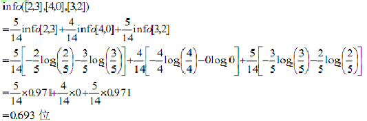
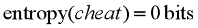
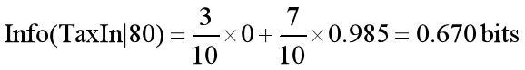
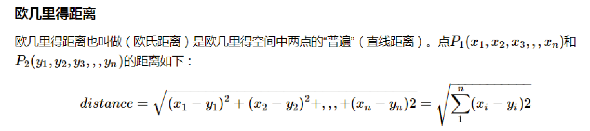

# 人工智能-决策树-6

## 划分选择与算法思想
### 决策树简介
- 决策树算法是一种**归纳分类**算法,它通过对训练集的学习,挖掘出有用的规则,用于对新集进行预测。
- **有监督的学习**。
- **非参数学习**算法。对每个输入使用由该区域的训练数据计算得到的对应的局部模型。 
- 决策树归纳的基本算法是**贪心算法**，自顶向下递归方式构造决策树。
- 在其生成过程中，**分割方法**即**属性选择度量**是关键。通过属性选择度量，选择出最好的将样本分类的属性。
> 贪心算法：在每一步选择中都采取在当前状态下最好/优的选择。

### 决策树的结构

-  决策树算法以树状结构表示数据分类的结果。每个决策点实现一个具有离散输出的测试函数，记为分支。


### 单变量树
- 每个内部节点中的测试只使用一个输入维。如果使用的输入维xj是离散的，取n个可能的值之一，则该节点检测xj的值，并取相应的分支，实现一个n路划分。
- 决策点具有离散分支，而数值输入应当离散化（将连续的离散化）。如果xj是数值的（有序的），则测试函数是比较：
- 其中wm0是适当选择阈值。该决策节点将输入空间一份为二：和，称为一个二元划分。
- 决策树根据所选取的属性是数值型还是离散型，每次将数据划分成两个或n个子集。然后使用对应的子集递归地进行划分，直到不需要划分，此时，创建一个树叶节点标记它。

### 决策树分类
1. **训练阶段**：从给定的训练数据集DB，构造出一棵决策树class = DecisionTree( DB )
2. **分类阶段**：从根开始，按照决策树的分类属性逐层往下划分，直到叶节点，获得概念（决策、分类）结果。y = DecisionTree( x )

> 1.树的划分结果要尽量的拟合训练数据，即和训练数据保持一致的分类。2.树可以有不同属性分割顺序。

### 决策树原理
#### 基本算法（贪心算法）
- 自上而下**分而治之**的方法
- 开始时，所有的数据都在根节点
- 属性都是离散值字段(如果是连续的，将其离散化)
- 所有记录用所选属性递归的进行分割
- **属性的选择**是基于一个启发式规则或者一个统计的度量 (如, information gain)[启发式规则:近似求解的最优化方法]

#### 停止分割的条件
- 一个节点上的数据都是属于同一个类别
- 没有属性可以再用于对数据进行分割

#### 算法过程（例子）

**假设选择Refund为最优分割属性：**
1. samples = { 1,2,3,4,5,6,7,8,9,10 }
    attribute_list = {Refund, MarSt, TaxInc }
2. samples = { 1,4,7 }
    attribute_list = { MarSt, TaxInc }
3. samples = {2,3,5,6,8,9,10 }
    attribute_list = { MarSt, TaxInc }

**samples中所有样本属于同一个类Cheat=No**

### 信息熵
**香农的信息论**

    - Father of information theory
    - 证明熵与信息内容的不确定程度有等价关系
    - 系统科学领域三大论之一

**熵(entropy)**

    - 描述物质系统状态:该状态可能出现的程度。
    - 平均信息量 
     若一个系统中存在多个事件E1,E2,…En
     每个事件出现的概率是p1,p2,…pn
     则这个系统的平均信息量是

**指的是系统的混乱的程度!**

### 选择分裂变量的标准
- 分类划分的优劣用==不纯性度量==来分析。如果对于所有分支，划分后选择相同分支的所有实例都属于相同的类，则这个划分是纯的。

- **一种度量不纯性的可能函数是熵函数（entropy)。**
- 系统越无序、越混乱，熵就越大。
- 构造决策树，熵定义为无序性度量。
- 选择一个属性划分数据，使得子女节点上数据的类值（例中“yes”或“no”）大部分都相同（低无序性）。
- 如果一个节点上的数据类值在可能的类值上均匀分布，则称节点的熵（无序性）最大。
- 如果一个节点上的数据的类值对于所有数据都相同，则熵最小。
- **通过分裂，得到尽可能纯的节点。这相当于降低系统的熵。**

### 构造树
1. 训练样本的信息值，即熵的描述
2. 第一棵树，属性，各叶节点的信息值
3. 第一棵树，属性，导致的信息增益
4. 依次，计算每棵树导致的信息增益
5. 选择获得最大信息增益的属性进行划分
6. 以此类推，递归，继续划分
7. 当所有叶节点都是纯的，划分过程终止

### 构造树具体例子分析
（1）训练样本的信息值(基于类的比例）训练样本（用来创建树的数据集）在包含9个yes和5个no的根节点上，对应于信息值。


==info([9,5])=0.940位== →**总的信息**

（2） 第一棵树，属性，各叶节点的信息值 基于天气(outlook)的划分，在叶节点的yes和no类的个数分别是[2,3]，[4,0]，和[3,2]，而这些节点的信息值分别是：

    info([2,3])=0.971位 →sunny
    info([4,0])=0. 0位 →overcast
    info([3,2])=0.971位 →rain

（3）第一棵树，属性，导致的信息增益。
计算平均信息值。根据天气的树导致的信息增益为：基于类比例原来信息需求-基于天气属性划分之后得到的信息需求：


    总的信息info([9,5])=0.940位
    信息增益 = 0.940-0.693=0.247 

（4）依次，计算每棵树导致的信息增益。为每个属性计算信息增益。

    gain(outlook)=0.247位
    gain(temperature)=0.029位
    gain(humidity)=0.152位
    gain(windy)=0.048位

（5）选择获得最大信息增益的属性进行划分。

    最大信息增益： gain(outlook)=0.247位
    1. 选择天气作为树的根节点的划分属性，其中一个子女节点是最纯的，并且这使它明显优于其他属性。
    2. 湿度是次佳选择，它产生了一个几乎完全纯的较大的子女节点。

（6）以此类推，递归，继续划分

    递归继续选择
    当天气为晴时，所达到的节点上的可
    能的深一层的分支除天气外，其他属性产生的信息增益分别为：
      gain(temperature)=0.571位
      gain(humidity)=0.971位
      gain(windy)=0.020位
    继续再选择湿度(humidity)作为划分属性


（6）以此类推，递归，继续划分

    天气，晴分支，气温，gain(temperature)=0.571位
    天气，晴分支，湿度，gain(humidity)=0.971位
    （纯的子女节点）
    天气，晴分支，有风，gain(windy)=0.020位
    天气，雨分支，气温，gain(temperature)=0.020位
    天气，雨分支，湿度，gain(humidity)=0.020位
    天气，雨分支，有风，gain(windy)=0.971位
    （纯的子女节点）


（7）**当所有叶节点都是纯的，划分过程终止**

    1. 理想情况下，当所有叶节点都是纯的而使过程终止时，即当它们包含的实例都具有相同类时该过程终止。
    2. 可能无法达到这种结果，因为无法避免训练集包含两个具有相同属性集，但具有不同类的实例。
    3. 当数据不能进一步划分时，停止划分过程。


### C4.5算法概述
- 上述算法是基本的ID3算法
- C4.5算法是ID3算法的扩展
- 能够处理连续型的属性。首先将连续型属性离散化，把连续型属性的值分成不同的区间，依据是比较各个分裂点Gian值的大小。
- 缺失数据的考虑：在构建决策树时，可以简单地忽略缺失数据，即在计算增益时，仅考虑具有属性值的记录。

### 连续值的处理
**选取(连续值的)哪个分界点？**
==贪婪算法！==

**1.排序**

    60  70  75  85  90  95  100  120  125  220
    若进行“二分”，则可能有9个分界点。
    分界点是前后连续两个值得均值。
    80=（75+85）/2，97.5=（95+100）/2

**2. 对每个候选的分界点，分别计算熵**

例子: 测试以80分界的情形

(1). TaxIn<=80



(2). TaxIn>80


(3). 加权平均



同理,  测试以95分界的情形, Info(TaxIn|95)=0.600 bits

**3. 比较取每个分界点的信息增益，选择最大的一个**

### 其他不纯度衡量标准

D为数据集，α为属性


### 基尼指数


### 决策树优缺点
**优点：**

    (1) 速度快：计算量相对较小，且容易转化成分类规则。只要沿着树根向下一直走到叶，沿途的分裂条件就能够唯一确定一条分类的谓词。  
    (2) 准确性高：挖掘出的分类规则准确性高，便于理解，决策树可以清晰的显示哪些字段比较重要。
    (3) 非参数学习，不需要设置参数。
    (4) 特征不需要标准化
    (5) 不容易产生过拟合

**缺点：**

    (1) 缺乏伸缩性：由于进行深度优先搜索，所以算法受内存大小限制，难于处理大训练集。一个例子：在 Irvine 机器学习知识库中，最大可以允许的数据集仅仅为 700KB ， 2000 条记录。而现代的数据仓库动辄存储几个 G-Bytes 的海量数据。用以前的方法是显然不行的。
    (2) 为了处理大数据集或连续量的种种改进算法（离散化、取样）不仅增加了分类算法的额外开销，而且降低了分类的准确性，对连续性的字段比较难预测，当类别太多时，错误可能就会增加的比较快，对有时间顺序的数据，需要很多预处理的工作。

## 决策树代码分析
```python
# In[]:
from IPython.display import Image
from sklearn import datasets
import numpy as np

iris = datasets.load_iris()
X = iris.data[:, [2, 3]]
y = iris.target

X.shape, y.shape

# In[]:
# Splitting data into 70% training and 30% test data:
from sklearn.model_selection import train_test_split

X_train, X_test, y_train, y_test = train_test_split(
    X, y, test_size=0.3, random_state=1, stratify=y)

print('Labels counts in y:', np.bincount(y))
print('Labels counts in y_train:', np.bincount(y_train))
print('Labels counts in y_test:', np.bincount(y_test))

# In[]:
from matplotlib.colors import ListedColormap
import matplotlib.pyplot as plt
# 分类决策区域函数
def plot_decision_regions(X, y, classifier, test_idx=None, resolution=0.02):

    # setup marker generator and color map
    markers = ('s', 'x', 'o', '^', 'v')
    colors = ('red', 'blue', 'lightgreen', 'gray', 'cyan')
    cmap = ListedColormap(colors[:len(np.unique(y))])

    # plot the decision surface
    x1_min, x1_max = X[:, 0].min() - 1, X[:, 0].max() + 1
    x2_min, x2_max = X[:, 1].min() - 1, X[:, 1].max() + 1
    xx1, xx2 = np.meshgrid(np.arange(x1_min, x1_max, resolution),
                           np.arange(x2_min, x2_max, resolution))
    Z = classifier.predict(np.array([xx1.ravel(), xx2.ravel()]).T)
    Z = Z.reshape(xx1.shape)
    plt.contourf(xx1, xx2, Z, alpha=0.3, cmap=cmap)
    plt.xlim(xx1.min(), xx1.max())
    plt.ylim(xx2.min(), xx2.max())

    for idx, cl in enumerate(np.unique(y)):
        plt.scatter(x=X[y == cl, 0], 
                    y=X[y == cl, 1],
                    alpha=0.8, 
                    c=colors[idx],
                    marker=markers[idx], 
                    label=cl, 
                    edgecolor='black')

    # highlight test samples
    if test_idx:
        # plot all samples
        X_test, y_test = X[test_idx, :], y[test_idx]

        plt.scatter(X_test[:, 0],
                    X_test[:, 1],
                    c='',
                    edgecolor='black',
                    alpha=1.0,
                    linewidth=1,
                    marker='o',
                    s=100, 
                    label='test set')

# In[]:
from sklearn.tree import DecisionTreeClassifier

tree = DecisionTreeClassifier(criterion='entropy',  #criterion='gini', 
                              max_depth=3, 
                              random_state=1)
tree.fit(X_train, y_train)

X_combined = np.vstack((X_train, X_test))
y_combined = np.hstack((y_train, y_test))
plot_decision_regions(X_combined, y_combined, 
                      classifier=tree, test_idx=range(105, 150))

plt.xlabel('petal length [cm]')
plt.ylabel('petal width [cm]')
plt.legend(loc='upper left')
plt.tight_layout()
plt.show()

# In[]:
# 注意：
# 在window下，pydotplus可以在anaconda的prompt/命令行下使用conda或pip命令进行安装，
# pip install pydotplus
# 而 graphviz 需要单独下载后安装,网上可以下载
# 到官网 http://www.graphviz.org 选择 download 链接
# 进入 https://graphviz.gitlab.io/download/
# 点击 Stable 2.38 Windows install packages
# graphviz-2.38.msi 和 graphviz-2.38.zip 都可以安装，时间不同，可能版本号有所不同

# 记得设置下面的环境变量要
import os
os.environ["PATH"] += os.pathsep + 'C:/Program Files/Graphviz/bin'

from pydotplus import graph_from_dot_data
from sklearn.tree import export_graphviz

dot_data = export_graphviz(tree,
                           filled=True, 
                           rounded=True,
                           class_names=['Setosa', 
                                        'Versicolor',
                                        'Virginica'],
                           feature_names=['petal length', 
                                          'petal width'],
                           out_file=None) 
graph = graph_from_dot_data(dot_data) 
mydir = 'C:/video/机器学习/'
graph.write_png(mydir + 'tree.png') 

```

**根节点说明：**
1. 针对的是105个训练数据，以熵作为分支标准。
2. 最大分支的层数按照参数设置是3层。
3. petal width和petal length都是连续数据，进行两类离散化
4. 根据上节课讲的基本原理，也是根据熵来选择分界点，
5. 通过对两个特征离散化后的熵的计算，petal width的分界点是0.75的时候熵最小，为1.585，就是说按照这个特征标准进行数据划分后，分类的效果是最纯最好的
6. 继续看根节点，samples=105，表示划分前总的样本数量
7. value=[35,35,35]表示划分前样本中每一类，即每一个label/target对应的数量
8. class=Setosa表示在这个节点上的分类结果，就是说如果没有任何划分的情况下， 对于一个测试样本，它的分类结果就是Setosa类，按照的是英文字母排序选择的分类结果

**第一个分支说明：**
1. 由于特征属性petal width离散化以后只有两类，所以按照两类划分
2. petal width 小于等于0.75的样本划分到左分支，其他右分支
3. 看左分支，所有样本的目标类别/label都是Setosa，这是最好的情况，分类结果最纯，所以根据上节公式，熵为0，这个分支的样本数量是35，全部是Setosa类。
4. 同理，class=Setosa，表示如果测试样本划分到这个分支，则测试样本的分类结果是Setosa类。
5. 看右分支，根据概念，如果结果不是最纯的，即不是所有样本都属于同一类，则继续划分，划分的方法与根节点划分的方法是一模一样的，不再讲述。
6. 关于划分何时结束，这里有两种结束方式，一是分支的所有样本都同一类/label，或者达到指定的树的层数，比如这里的参数是3层分支，所以只是划分三层
7. 关于测试样本的最终类别/label：由于可以按照指定的层数终止划分，所以最后的分支可能不是最纯的，即样本是属于多个类别的，此时最终的分类结果是按照数量多的，比如看这个例子最后一层，左分支不是最纯的，有versicolor和virginca两类，但是virginca有10个，大于versicolor的5个，所以最终分类结果是virginca。
8. 如果多个类别数量是一样的，按照顺序，即label值最小的，
比如有1和2值，则结果是1的类别/label，这个0，1，2的排序一般按照分类名的字母排序，当然也是可以自己人为设定的。

## KNN
### 惰性学习算法——k-近邻算法
**监督学习算法:k-近邻算法（k-nearest neighbor classifier，
KNN）**
- KNN是惰性学习算法的典型例子。
- 说它具有惰性不是因为它看起来简单，而是因为它仅仅对训练数据集有记忆功能，而不会从训练集中通过学习得到一个判别函数。

### 参数化模型与非参数化模型
- 机器学习算法可以划分为参数化模型和非参数化模型。当使用参数化模型时，需要我们通过训练数据估计参数，并通过学习得到一个模式，以便在无需原始训练数据信息的情况下对新的数据点进行分类操作。典型的参数化模型包括：感知器、逻辑斯谛回归和线性支持向量机等。
- 与之相反，非参数化模型无法通过一组固定的参数来进行表征，而参数的数量也会随着训练数据的增加而递增。比如：决策树（包括随即森林）和核SVM。

### KNN属于非参数化模型
- KNN属于非参数化模型的一个子类，它可以被描述为基于实例的学习（instance-based learning）。
- 此类模型的特点是会对训练数据进行记忆；而惰性学习（lazy learning）则是基于实例学习的一个特例，它在学习阶段的计算成本为0。

### KNN算法
**分为三步：**

    1）选择近邻的数量k和距离度量方法。
    2）找到待分类样本的k个最近邻居。
    3）根据最近邻的类标进行多数投票。
    
- 下图说明了新的数据点（问号所在位置）如何根据最近的5个邻居进行多数投票而被标记三角形类标：

- 基于选定的距离度量标准，KNN算法从训练数据集中找到与待预测目标点的k个距离最
近的样本（最相似）。
- 目标点的类标基于这k个最近的邻居的类标使用多数投票确定。

**优点**
- 这种基于记忆的学习算法的优点在于：分类器可以快速地适应新的训练数据。

**缺点**
- 不过其缺点也是显而易见的：计算复杂度随着样本数量的增多而增长，使用高效的数据结构（如KD树等）可以一定程度的提高计算速度。
- 此外，我们还不能忽视训练样本，因为此模型没有训练的步骤。由此一来，如果使用了大型数据集，对于存储空间来说也是一个挑战。

### KNN代码
```
from sklearn import datasets
import numpy as np

iris = datasets.load_iris()
X = iris.data[:, [2, 3]]
y = iris.target


from sklearn.model_selection import train_test_split

X_train, X_test, y_train, y_test = train_test_split(
    X, y, test_size=0.3, random_state=1, stratify=y)


from sklearn.preprocessing import StandardScaler

sc = StandardScaler()
sc.fit(X_train)
X_train_std = sc.transform(X_train)
X_test_std = sc.transform(X_test)

X_combined_std = np.vstack((X_train_std, X_test_std))
y_combined = np.hstack((y_train, y_test))

from sklearn.neighbors import KNeighborsClassifier

# minkowski 闵氏距离
knn = KNeighborsClassifier(n_neighbors=5, 
                           p=2, 
                           metric='minkowski')
knn.fit(X_train_std, y_train)

import matplotlib.pyplot as plt
from matplotlib.colors import ListedColormap
def plot_decision_regions(X, y, classifier, test_idx=None, resolution=0.02):

    # setup marker generator and color map
    # 五种标记符号
    markers = ('s', 'x', 'o', '^', 'v')
    # 五种颜色，红，蓝，浅绿，灰色，青色
    colors = ('red', 'blue', 'lightgreen', 'gray', 'cyan')
    # y存放的是预测结果，np.unique(y)得到所有的类别
    # 此处有三类，所以建立三个颜色映射对象，
    # 将三类对应colore[:3],即0，1，2对应的红，兰，浅绿三种
    # ListedColormap是处理颜色的对象，根据列表中每个字符串颜色值，比如‘red’，映射为对应可以处理的颜色对象
    cmap = ListedColormap(colors[:len(np.unique(y))])

    # plot the decision surface
    # 开始画决策面
    # 注意，决策面是针对只有两个特征变量的，因为只有二维特征才方便展示观看
    # 其中x轴方向表现一个特征值，y轴方向表现一个特征值
    # 函数的输入变量X保存的是特征值，行数是样本数，列数是特征数，从0索引列，只有0和1两列
    # 下面是获取每个特征在所有样本中的最大值和最小值，加1和减1是为了进行一定的区域扩展，
    # 保证所有样本点都可以显示的更加清楚，如果不进行扩展，在最大值最小值附件的样本就可能显示不清楚，
    # 自己可以将下面的True改为False测试下
    if True:
        x1_min, x1_max = X[:, 0].min() - 1, X[:, 0].max() + 1
        x2_min, x2_max = X[:, 1].min() - 1, X[:, 1].max() + 1
    else:
        x1_min, x1_max = X[:, 0].min(), X[:, 0].max()
        x2_min, x2_max = X[:, 1].min(), X[:, 1].max()

    # resolution是函数的输入变量，值是0.02
    xx1, xx2 = np.meshgrid(np.arange(x1_min, x1_max, resolution),
                           np.arange(x2_min, x2_max, resolution))
    Z = classifier.predict(np.array([xx1.ravel(), xx2.ravel()]).T)
    Z = Z.reshape(xx1.shape)
    plt.contourf(xx1, xx2, Z, alpha=0.3, cmap=cmap)
    plt.xlim(xx1.min(), xx1.max())
    plt.ylim(xx2.min(), xx2.max())

    for idx, cl in enumerate(np.unique(y)):
        plt.scatter(x=X[y == cl, 0], 
                    y=X[y == cl, 1],
                    alpha=0.8, 
                    c=colors[idx],
                    marker=markers[idx], 
                    label=cl, 
                    edgecolor='black')

    # highlight test samples
    if test_idx:
        # plot all samples
        X_test, y_test = X[test_idx, :], y[test_idx]

        plt.scatter(X_test[:, 0],
                    X_test[:, 1],
                    c='',
                    edgecolor='black',
                    alpha=1.0,
                    linewidth=1,
                    marker='o',
                    s=100, 
                    label='test set')

plot_decision_regions(X_combined_std, y_combined, 
                      classifier=knn, test_idx=range(105, 150))

plt.xlabel('petal length [standardized]')
plt.ylabel('petal width [standardized]')
plt.legend(loc='upper left')
plt.tight_layout()
plt.show()
```
- **闵可夫斯基距离**(Minkowski Distance)，闵氏距离不是一种距离，
而是一组距离的定义。
- 两个n维变量a(x11,x12,…,x1n)与 b(x21,x22,…,x2n)间的闵可夫斯基距离定义为：
- 其中p是一个变参数。**当p=1时，就是曼哈顿距离。当p=2时，就是欧氏距离。**根据变参数的不同，闵氏距离可以表示一类的距离。
- 通常情况下，scikit-learn中实现的KNN算法对类标的判定倾向于与样本距离最近邻居的类标。如果几个邻居的距离相同，则判定为在训练数据集中位置靠前的那个样本的类标，即类标/label值小的，比如1类和2类数量一样，则结果是1类。
- 就KNN来说，找到正确的k值是在过拟合与欠拟合之间找到平衡的关键所在。我们还必须保证所选的距离度量标准适用于数据集中的特征。相对简单的欧几里得距离度量标准常用于特征值为实数的样本，如鸢尾花数据集中的花朵，其特征值是以厘米为单位的实数。
> 注意，当我们使用欧几里得距离时，对数据进行标准化处理，保持各属性度量的尺度统一也是非常重要的。

### KNN的过拟合
- 由于**维度灾难**（curse of dimensionality）的原因，使得KNN算法易于过拟合。维度灾难是指这样一种现象：对于一个样本数量大小稳定的训练数据集，随着其特征数量的增加，样本中有具体值的特征数量变得极其稀疏（大多数特征的取值为空）。就是说，相同的样本数量，随着维度的增加， 样本将变得越来越稀疏。
- 直观地说，可以认为即使是最近的邻居，它们在高维空间中的实际距离也是非常远的，因此难以给出一个合适的类标判定。
- 高维空间训练形成的线性分类器，相当于在低维空间的一个复杂的非线性分类器，往往容易过拟合。
- 在逻辑斯谛回归和线性回归中通过正则化使其避免过拟合。不过，正则化方法并不适用于诸如决策树和KNN等算法，但可以使用特征选择和降维等技术来帮助其避免维度灾难。


## 机器学习中距离和相似性度量方法概述
### 机器学习中常见的距离公式
#### 曼哈顿距离


> 红线部分是曼哈顿距离，绿线是欧式距离

#### 欧几里得距离



#### 切比雪夫距离


#### 闵氏距离


#### 马氏距离


> 注意：协方差矩阵表达的是两两特征之间的相关性


#### 协方差
- 在概率论和统计学中，协方差用于衡量两个变量的总体误差。而方差是协方差的一种特殊情况，即当两个变量是相同的情况。
- 可以通俗的理解为：两个变量在变化过程中是否同向变化？还是反方向变化？同向或反向程度如何?你变大，同时我也变大，说明两个变量是同向变化的，这是协方差就是正的。
你变大，同时我变小，说明两个变量是反向变化的，这时协方差就是负的。
如果我是自然人，而你是太阳，那么两者没有相关关系，这时协方差是0。
- 从数值来看，协方差的数值越大，两个变量同向程度也就越大，反之亦然。
可以看出来，协方差代表了两个变量之间的是否同时偏离均值，和偏离的方向是相同还是相反。


#### 汉明距离


#### 余弦相似度


#### 编辑距离


#### Jaccard系数


#### KL散度


