# 人工智能-数据预处理-7
[toc]
## 数据预处理的意义
- 要分析处理的数据需要一定的质量
- 数据质量包括下面几个因素：
    1. 正确性（Correctness）
    2. 一致性（Consistency）
    3. 完整性（Completeness） 
    4. 可靠性（Reliability）
- 现实世界中的数据往往是这样的：
    1. 不完整的：缺少属性值或某些感兴趣的属性，或仅包含聚集数据。
    2. 含噪声的：包含错误或存在偏离均值的离群值。
    3. 不一致的：采用的编码或表示不同，如属性名称不同
    4. 冗余的：如属性之间可以相互导出

## 数据错误的不可避免性
- 数据输入和获得过程数据错误
- 数据集成所表现出来的错误
- 数据传输过程所引入的错误 
- 据统计有错误的数据占总数据的5%左右

## 数据错误的灾难
- 错误的结果
- 可能消耗更多的资源
- 导致错误的决策
- 没有揭示数据真实的规律

## 数据预处理
- 机器学习算法最终学习结果的优劣取决于两个主要因素：==数据的质量==和==数据中蕴含的有用信息的数量==。
- 因此，在将数据集应用于学习算法之前，对其进行检验及预处理是至关重要的。
- 构建优质训练集进行的数据预处理：
    1. 处理缺失数据
    2. 处理类别数据
    3. 划分数据集
    4. 数据标准化与归一化
    5. 特征选择
    6. 特征排序

## 处理缺失数据
### 什么是缺失数据
- 在实际应用过程中，样本由于各种原因缺少一个或多个值的情况并不少见。
- 其原因主要有：数据采集过程中出现了错误，常用的度量方法不适用于某些特征，或者在调查过程中某些数据未被填写，等等。
- 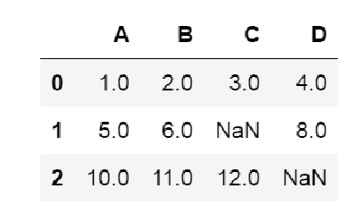
- 通常，我们见到的缺失值是数据表中的空值，或者是类似于NaN（Not ANumber，非数字）的占位符。
如果我们忽略这些缺失值，将导致大部分的计算工具无法对原始数据进行处理，或者得到某些不可预知的结果。因此，在做更深入的分析之前，必须对这些缺失值进行处理。

### 处理缺失数据代码
```
from IPython.display import Image
import pandas as pd
from io import StringIO
import sys


## 处理缺失值


# In[1]:
# 有缺失数据集的简单例子
# 一般来说一行表示一个样本，一列表示样本的一个特征
csv_data = '''A,B,C,D
1.0,2.0,3.0,4.0
5.0,6.0,,8.0
10.0,11.0,12.0,'''

# 显示数据
df = pd.read_csv(StringIO(csv_data))
# 以表格显示显示
df

# In[2]:
# 不显示表头，只是显示里面的二维数据
df.values

# In[3]:
# 统计每一列缺失数据个数
df.isnull().sum()

# In[4]:
# 如果数据量特别大的时候，可以通过删除的方式，因为大数据时代，
# 很多时候损失少量数据并不要紧。

# 删除包含缺失数据的行
df.dropna(axis=0)

# In[5]:
# 删除包含缺失数据的列
df.dropna(axis=1)

# In[6]:
# 新的测试数据
csv_data2 = '''A,B,C,D
1.0,2.0,,
,,,
10.0,11.0,12.0,'''

# 显示数据
df2 = pd.read_csv(StringIO(csv_data2))
# 以表格显示显示
df2

# In[7]:
# 其他的处理方法
# 如果一行全是NaN才删除
df2.dropna(how='all')  

# In[8]:
# thresh=3,那么一行当中至少有三个数值时才将其保留
df2.dropna(axis=0,thresh=3)

# In[9]:
# 缺省是对行进行处理。thresh=3,那么一行当中至少有三个数值时才将其保留
df2.dropna(thresh=3)

# In[10]:
# thresh=2,那么一列当中至少有两个数值时才将其保留
df2.dropna(axis=1,thresh=2)

# In[11]:
# only drop rows where NaN appear in specific columns (here: 'C')
# 只是将C列中有NaN的行删除掉
df2.dropna(subset=['C'])

# In[12]:
# 重新显示第一组数据集
df.values

# In[13]:
# 如果数据量比较少，或者不想删除，通过使用其他列值求平均的方式
# 注意这是针对连续数值数据的处理方法，如果是离散值，一般是设置数量最多/频数最高的离散值
# 比如某个属性的离散值有3个，1有5个，2有3个，3有1个，那么这个属性的缺失值就设置为1.
# 统计的方法比较多，此处留一个作业自己实现。
from sklearn.impute import SimpleImputer

imr = SimpleImputer(strategy='mean', verbose=0)
imr = imr.fit(df.values)
imputed_data = imr.transform(df.values)
imputed_data
```

## 处理类别数据
### 什么是类别数据？
- 机器学习计算处理的时候，只能处理数值！
- 现实的数据中，往往有很多非数值数据。
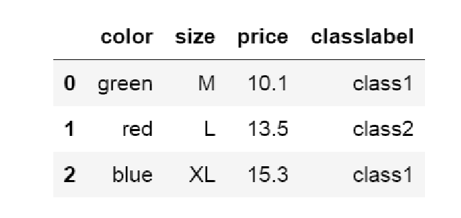

### 如何处理类别数据？
- 将类别数据直接映射到一个整数：
    1. size(衣服尺寸)：可以映射到1，2，3，因为尺寸有大小之分，可以比较的，数值的大小可以表现这个特性。
    2. classlabel（样本所属类别）：当只有两类，可以用0和1表示
    3. ==问题来了==：当有多类（超过两类）没有大小区分数据的时候，比如color（衣服颜色），红色（red）绿色（green）和蓝色（blue）没有谁大谁小之说，怎么办？？

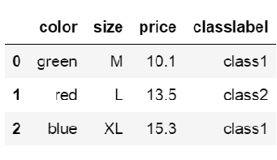
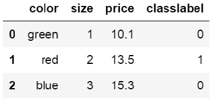

### one-hot 独热编码
- 根据出现的类别数量分成多个属性，对应的值给1值，其他的都是0值。看下面颜色color例子。

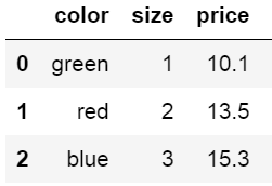
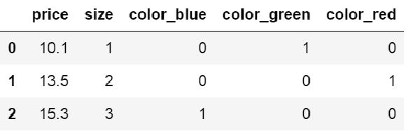

### 处理类别数据代码
```
## 处理类别数据

# In[14]:
import pandas as pd

df = pd.DataFrame([['green', 'M', 10.1, 'class1'],
                   ['red', 'L', 13.5, 'class2'],
                   ['blue', 'XL', 15.3, 'class1']])

df.columns = ['color', 'size', 'price', 'classlabel']
# 显示举例数据
df_origin = df
df


# In[15]:
# 映射size数据
size_mapping = {'XL': 3,
                'L': 2,
                'M': 1}

df['size'] = df['size'].map(size_mapping)
df

# In[16]:
import numpy as np
# 将类别设置为0和1
class_mapping = {label: idx for idx, label in enumerate(np.unique(df['classlabel']))}
class_mapping

# In[17]:
# 类别数据映射到整数
df['classlabel'] = df['classlabel'].map(class_mapping)
df

# In[18]:
# 仅仅显示二维特征数据
X = df[['color', 'size', 'price']].values
X

# numpy
# In[19]:
# 首先将color颜色数据转为数值
from sklearn.preprocessing import LabelEncoder
color_le = LabelEncoder()
# 只接受数组数据，不接受df数据
X[:, 0] = color_le.fit_transform(X[:, 0])
X

# In[20]:
# 将color颜色的数值转为one-hot数据
from sklearn.preprocessing import OneHotEncoder
ohe = OneHotEncoder(categorical_features=[0])
ohe.fit_transform(X).toarray()

# In[21]:
# 再次显示表格内容数据
df

# In[22]:
# 使用另一个方法转0ne-hot：pandas模块的get_dummies方法
pd.get_dummies(df[['price', 'color', 'size']])
```

## 划分数据集
- 很多时候，我们只是拥有一个数据集，对于未来要测试要发生的数据并不知道。
- 一般来说，对于一个已知的数据集，一部分数据用于训练模型，而另一部分用于测试模型是否有效。
- 常见的划分比例是8：2或者7：3，前面是训练集，后面是测试集。

### 划分数据集代码
```
# 查看当前路径
import os
os.getcwd()

# In[24]:
# 读取酒的数据集
data_dir = 'F:/2019-notebook/2017_2018_2/python_code/MTrain/MachineLearn/3_ML/5_Preprocess/'
df_wine = pd.read_csv(data_dir + 'wine.data', header=None)

df_wine.columns = ['Class label', 'Alcohol', 'Malic acid', 'Ash',
                   'Alcalinity of ash', 'Magnesium', 'Total phenols',
                   'Flavanoids', 'Nonflavanoid phenols', 'Proanthocyanins',
                   'Color intensity', 'Hue', 'OD280/OD315 of diluted wines',
                   'Proline']
df_wine.tail()

# In[]:
print('Class labels', np.unique(df_wine['Class label']))

# In[25]:
# 将已知的数据化为训练集和测试集
from sklearn.model_selection import train_test_split

X, y = df_wine.iloc[:, 1:].values, df_wine.iloc[:, 0].values

X_train, X_test, y_train, y_test =  train_test_split(X, y, 
                     test_size=0.3, 
                     random_state=0, 
                     stratify=y)
X.shape,X_train.shape,X_test.shape
```

## 数据标准化与归一化
### 为何要标准化和归一化
- 样本不同的特征/属性所在的数值范围差异巨大，导致训练不收敛或其他问题
- 所有数据在相同的取值空间更容易处理，方便模型的统一化和规范化
- 更容易发现数据的本质规律
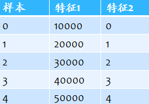
> 两个特征的数据范围差距甚大

### 归一化
- **将数据缩放到[0,1]的范围**
- **计算方法：x = (x-min)/(max-min)**
- ==特别注意：训练和测试数据一般都要归一化，min和max一定是训练集的min和max，x分别是训练和测试集的==
- ==代码中体现在测试集只有transform操作，而训练集多了一个fit操作，这个fit操作就是从训练集中得到min和max两个参数的过程，这个min和max同时会用到
测试集，所以测试集没有这个步骤。==
- ==对于下面的标准化一样道理，从训练数据中计算出均值𝜇和标准差
𝜎，也应用到测试数据。
WHY？因为我们基于的假设是：训练数据与数据整体的分布是一致的，模型来自训练数据。==
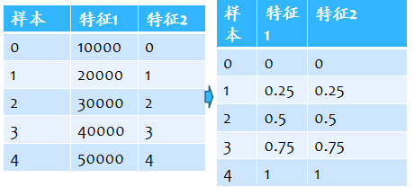

### 标准化
- 数据标准化方法经过处理后数据符合标准正态分布，即均值为0，标准差为1
- 转化函数为：x =(x - 𝜇)/𝜎
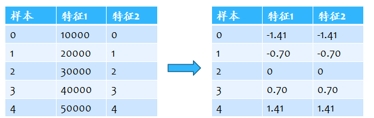
> 这里一般做了一个假设，就是特征数据（某个属性数据）是符合正态分布的，这个假设对于现实生活中大多数的连续数据（数值数据）都是成立的，事实证明，即使有的时候不成立，就是数据不是正态分布，进行标准化也是有益的。

### 数据标准化与归一化代码
```
# 归一化并展示部分数据
from sklearn.preprocessing import MinMaxScaler
mms = MinMaxScaler()
X_train_norm = mms.fit_transform(X_train)
X_test_norm = mms.transform(X_test)
X_train_norm[:5,0:3]

# In[27]:
# 标准化并展示部分数据
from sklearn.preprocessing import StandardScaler
stdsc = StandardScaler()
X_train_std = stdsc.fit_transform(X_train)
X_test_std = stdsc.transform(X_test)
X_test_std[:5,0:3]


# In[28]:
# 标准化的实际计算方法
ex = np.array([0, 1, 2, 3, 4])
print('standardized:', (ex - ex.mean()) / ex.std())

# In[29]:
# 归一化的实际计算方法 
print('normalized:', (ex - ex.min()) / (ex.max() - ex.min()))

# In[30]:
# 标准化的实际计算方法
ex = np.array([10000, 20000, 30000, 40000, 50000])
print('standardized:', (ex - ex.mean()) / ex.std())

# In[31]:
# 归一化的实际计算方法 
print('normalized:', (ex - ex.min()) / (ex.max() - ex.min()))
```

### 标准化后训练提升例子
使用一个单层神经网络：自适应线性神经网络（Adaptive Linear Neuron，Adaline）作为一个分类器。

此处分类器不是重点，先了解即可。重点是标准化对于训练的作用。

 Adaline与逻辑回归的区别在于激励函数是一个y=x的线性函数，逻辑回归是sigmoid激活。
 
Adaline与线性回归的区别在于最后需要进行量化和分类，不是连续值得回归分析。
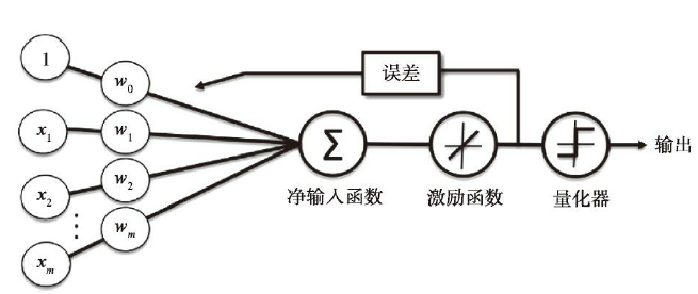

**回忆：为优化收敛效果，常常需要通过实验来找到合适的学习速率η。分别使用η＝0.1和η＝0.0001两个学习速率来绘制迭代次数与代价函数的图像，以观察Adaline通过训练数据进行学习的效果。**

**注意：这里的学习速率η和迭代次数n_iter都是算法的超参（hyperparameter）。后面还将学习自动调整超参值以得到分类性能最优模型的各种技术。**==超参是人为设置的，比如这里的学习率和迭代次数。一般说的模型的参数，是训练出来的，比如神经网络的权重。==

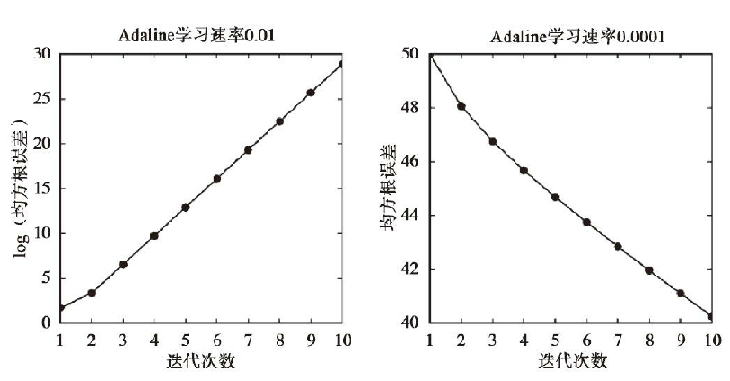
1. 从下面代价函数输出结果的图像中可以看到，面临两种不同类型的问题。左边的图
像显示了学习速率过大可能会出现的问题——并没有使代价函数的值尽可能的低，反而因为算法跳过了全局最优解，导致误差随着迭代次数增加而增大
2. 虽然在右边的图中代价函数逐渐减小，但是选择的学习速率η＝0.0001的值太小，以致为了达到算法收敛的目标，需要更多的迭代次数

**同样0.01学习率，数据标准化以后**
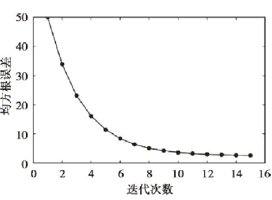

### 实例代码展示
```
# 一个例子展示数据标准化后对于训练的改善 
# In[]:
class AdalineGD(object):
    """ADAptive LInear NEuron classifier.

    Parameters
    ------------
    eta : float
      Learning rate (between 0.0 and 1.0)
    n_iter : int
      Passes over the training dataset.
    random_state : int
      Random number generator seed for random weight
      initialization.


    Attributes
    -----------
    w_ : 1d-array
      Weights after fitting.
    cost_ : list
      Sum-of-squares cost function value in each epoch.

    """
    def __init__(self, eta=0.01, n_iter=50, random_state=1):
        self.eta = eta
        self.n_iter = n_iter
        self.random_state = random_state

    def fit(self, X, y):
        """ Fit training data.

        Parameters
        ----------
        X : {array-like}, shape = [n_samples, n_features]
          Training vectors, where n_samples is the number of samples and
          n_features is the number of features.
        y : array-like, shape = [n_samples]
          Target values.

        Returns
        -------
        self : object

        """
        rgen = np.random.RandomState(self.random_state)
        self.w_ = rgen.normal(loc=0.0, scale=0.01, size=1 + X.shape[1])
        self.cost_ = []

        for i in range(self.n_iter):
            net_input = self.net_input(X)
            # Please note that the "activation" method has no effect
            # in the code since it is simply an identity function. We
            # could write `output = self.net_input(X)` directly instead.
            # The purpose of the activation is more conceptual, i.e.,  
            # in the case of logistic regression (as we will see later), 
            # we could change it to
            # a sigmoid function to implement a logistic regression classifier.
            output = self.activation(net_input)
            errors = (y - output)
            self.w_[1:] += self.eta * X.T.dot(errors)
            self.w_[0] += self.eta * errors.sum()
            cost = (errors**2).sum() / 2.0
            self.cost_.append(cost)
        return self

    def net_input(self, X):
        """Calculate net input"""
        return np.dot(X, self.w_[1:]) + self.w_[0]

    def activation(self, X):
        """Compute linear activation"""
        return X

    def predict(self, X):
        """Return class label after unit step"""
        return np.where(self.activation(self.net_input(X)) >= 0.0, 1, -1)

# 读入数据
# In[]:
import pandas as pd

data_dir = 'F:/2019-notebook/2017_2018_2/python_code/MTrain/MachineLearn/3_ML/5_Preprocess/'
df = pd.read_csv(data_dir + 'iris.data', header=None)
df.tail()

# In[]:


import matplotlib.pyplot as plt
import numpy as np

# select setosa and versicolor
y = df.iloc[0:100, 4].values  #df.iloc[0:100, 4] 从dataframe中选择0-100行的第4列，就是花的类型值
y

# In[]
# 设置为-1和1两类，Iris-setosa为-1，其他是1类
y = np.where(y == 'Iris-setosa', -1, 1)
y

# In[]
# extract sepal length and petal length
X = df.iloc[0:100, [0, 2]].values  #第0列和第2列对应花的两个特征属性
X
# In[]:
fig, ax = plt.subplots(nrows=1, ncols=2, figsize=(10, 4))

ada1 = AdalineGD(n_iter=10, eta=0.01).fit(X, y)
ax[0].plot(range(1, len(ada1.cost_) + 1), np.log10(ada1.cost_), marker='o')
ax[0].set_xlabel('Epochs')
ax[0].set_ylabel('log(Sum-squared-error)')
ax[0].set_title('Adaline - Learning rate 0.01')

ada2 = AdalineGD(n_iter=10, eta=0.0001).fit(X, y)
ax[1].plot(range(1, len(ada2.cost_) + 1), ada2.cost_, marker='o')
ax[1].set_xlabel('Epochs')
ax[1].set_ylabel('Sum-squared-error')
ax[1].set_title('Adaline - Learning rate 0.0001')

# plt.savefig('images/02_11.png', dpi=300)
plt.show()

# 数据标准化以后按照学习率0.01再训练

# In[]:
# standardize features
X_std = np.copy(X)
X_std[:, 0] = (X[:, 0] - X[:, 0].mean()) / X[:, 0].std()
X_std[:, 1] = (X[:, 1] - X[:, 1].mean()) / X[:, 1].std()


# In[]:
ada = AdalineGD(n_iter=15, eta=0.01)
ada.fit(X_std, y)

import matplotlib.pyplot as plt
plt.plot(range(1, len(ada.cost_) + 1), ada.cost_, marker='o')
plt.xlabel('Epochs')
plt.ylabel('Sum-squared-error')

plt.tight_layout()
plt.show()
```

## 特征选择
- 如果一个模型在训练数据集上的表现比在测试数据集上好很多，这意味着模型过拟合（overfitting）于训练数据。过拟合是指模型参数对于训练数据集的特定观测值拟合得非常接近，但训练数据集的分布与真实数据并不一致——我们称之为模型具有较高的方差。
- 产生过拟合的原因是建立在给定训练数据集上的模型过于复杂，而常用的降低泛化误差的方案有：
    1. **收集更多的训练数据**
    2. **通过正则化引入罚项**
    3. **选择一个参数相对较少的简单模型**
    4. **降低数据的维度**

### 正则化特征选择
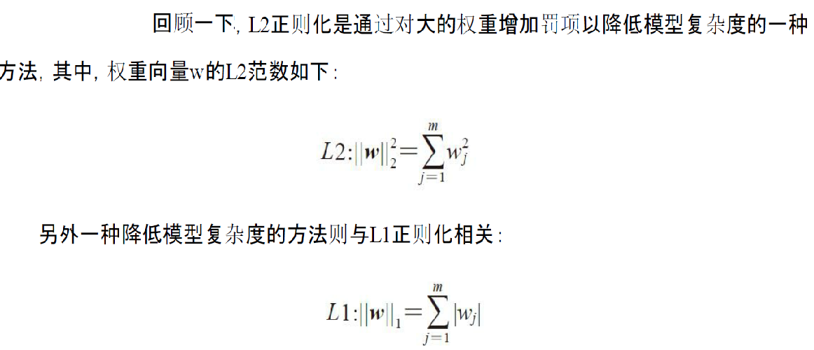
- 对于L1正则化，只是简单地将权重的平方和用权重绝对值的和来替代。
- 与L2正则化不同，L1正则化可生成稀疏的特征向量，且大多数的权值为0。
- 当高维数据集中包含许多不相关的特征，尤其是不相关的特征数量大于样本数量时，权重的稀疏化处理能够发挥很大的作用。
- 从这个角度来看，L1正则化可以被视作一种特征选择技术。

### L1和L2正则化特征选择代码
```
#### 特征选择

# ## Sparse solutions with L1-regularization
# ## 通过L1正则化的方法稀疏权重等参数，从而达到特征选择目的

# For regularized models in scikit-learn that support L1 regularization, 
# we can simply set the `penalty` parameter to `'l1'` to obtain a sparse solution:

# 读入数据
# In[]:
import numpy as np
import pandas as pd

data_dir = 'C:/video/机器学习/9 （必修）第五部分：数据预处理/'
df_wine = pd.read_csv(data_dir+'wine.data', header=None)
df_wine.columns = ['Class label', 'Alcohol', 'Malic acid', 'Ash',
                   'Alcalinity of ash', 'Magnesium', 'Total phenols',
                   'Flavanoids', 'Nonflavanoid phenols', 'Proanthocyanins',
                   'Color intensity', 'Hue', 'OD280/OD315 of diluted wines',
                   'Proline']
df_wine.head()

# In[]
df_wine.shape

# In[]:

print('Class labels', np.unique(df_wine['Class label']))

# In[]:
from sklearn.model_selection import train_test_split

X, y = df_wine.iloc[:, 1:].values, df_wine.iloc[:, 0].values

X_train, X_test, y_train, y_test =    train_test_split(X, y, 
                     test_size=0.3, 
                     random_state=0, 
                     stratify=y)

# In[]:
from sklearn.preprocessing import StandardScaler

stdsc = StandardScaler()
X_train_std = stdsc.fit_transform(X_train)
X_test_std = stdsc.transform(X_test)


# In[]:
from sklearn.linear_model import LogisticRegression
# 带有L1惩罚的逻辑回归就是lasso回归，使用的是缺省的惩罚值， C=1.0
LogisticRegression(penalty='l1')

# Applied to the standardized Wine data ...

# In[]:
from sklearn.linear_model import LogisticRegression
# c1越小 控制力度越大
lr = LogisticRegression(penalty='l1', C=1.0, solver='liblinear')

lr.fit(X_train_std, y_train)
print('Training accuracy:', lr.score(X_train_std, y_train))
print('Test accuracy:', lr.score(X_test_std, y_test))

# In[]:
# 因为输出有三类，就是最后一层有三个神经元，每个对应一个偏置量
# 就是wx+b中的b值
lr.intercept_


# In[]:
# float输出的精度，即小数点后维数
np.set_printoptions(8)

# In[]:
# 一共13个特征，即13个输入神经元，连接3个输出神经元，
# 所以有3组权重，每一组是13个权重值
lr.coef_.shape

# In[]:
# 
lr.coef_


# In[]:
# 正则化系数对权重系数的影响，可以看出C越小，影响越大，可以导致所有特征的权重系数为0
import matplotlib.pyplot as plt

fig = plt.figure()
ax = plt.subplot(111)
    
colors = ['blue', 'green', 'red', 'cyan', 
          'magenta', 'yellow', 'black', 
          'pink', 'lightgreen', 'lightblue', 
          'gray', 'indigo', 'orange']

weights, params = [], []
for c in np.arange(-4., 6.):
    lr = LogisticRegression(penalty='l1', C=10.**c, random_state=0, solver='liblinear')
    lr.fit(X_train_std, y_train)
    weights.append(lr.coef_[1])
    params.append(10**c)

weights = np.array(weights)

for column, color in zip(range(weights.shape[1]), colors):
    plt.plot(params, weights[:, column],
             label=df_wine.columns[column + 1],
             color=color)
plt.axhline(0, color='black', linestyle='--', linewidth=3)
plt.xlim([10**(-5), 10**5])
plt.ylabel('weight coefficient')
plt.xlabel('C')
plt.xscale('log')
plt.legend(loc='upper left')
ax.legend(loc='upper center', 
          bbox_to_anchor=(1.38, 1.03),
          ncol=1, fancybox=True)
plt.show()


### 直接使用L1和L2正则化的特征选择模型
# In[]
# L1正则，lasso回归特征选择
from sklearn.linear_model import Lasso
from sklearn.preprocessing import StandardScaler

# 可以设置惩罚系数，缺省是1，此处系数越大，惩罚力度越大
lasso = Lasso(0.2)
lasso.fit(X_train_std, y_train)
# 显示特征的权重系数，0的位置，表示特征可以去除
lasso.coef_

# In[]
# L2正则，ridge回归特征选择
from sklearn.linear_model import Ridge
 
ridge = Ridge(0.2)
ridge.fit(X_train_std,y_train)
# 与L1正则化对比发现，0的位置变成了较小的值
# 所以可以设置一个阈值，过滤掉权重小于某个值得特征
# 可以看出L1正则化后容易得到一个稀疏矩阵，L2正则化后系数会趋于平均
ridge.coef_
```

### 特征选择降维
- 另外一种降低模型复杂度从而解决过拟合问题的方法是通过特征选择进行降维（dimensionality reduction），该方法对未经正则化处理的模型特别有效。

- 降维技术主要分为两个大类：==特征选择和特征提取==。通过特征选择，可以选出原始特征的==一个子集==。而在特征提取中，通过对现有的特征信息进行推演，构造出一个==新的特征子空间==。在本节，将着眼于特征选择算法。

#### 序列特征选择算法
1. 序列特征选择算法系一种贪婪搜索算法，用于将原始的d维特征空间压缩到一个k维特征子空间，其中k<d。
2. 使用特征选择算法出于以下考虑：能够剔除不相关特征或噪声，自动选出与问题最相关的特征子集，从而提高计算效率或是降低模型的泛化误差。这在模型不支持正则化时尤为有效。
3. 一个经典的序列特征选择算法是序列后向选择算法（Sequential Backwar Selection，SBS），其目的是在分类性能衰减最小的约束下，降低原始特征空间上的数据维度，以提高计算效率。
4. 在某些情况下，SBS甚至可以在模型面临过拟合问题时提高模型的预测能力。
5. SBS算法背后的理念非常简单：SBS依次从特征集合中删除某些特征，直到新的特征子空间包含指定数量的特征。为了确定每一步中所需删除的特征，定义一个需要最小化的标准衡量函数J。
6. 该函数的计算准则是：比较判定分类器的性能在删除某个特定特征前后的差异。
7. 由此，每一步中待删除的特征，就是那些能够使得标准衡量函数值尽可能大的特征，或者更直观地说：每一步中特征被删除后，所引起的模型性能损失最小。
8. 遗憾的是，scikit-learn中并没有实现SBS算法。不过它相当简单，可以使用Python来实现

**在SBS的实现中，已经在fit函数内将数据集划分为测试数据集和训练数据集，依旧将训练数据集X_train输入到算法中。SBS算法在每一步中都存储了最优特征子集的分值，下面绘制出KNN分类器的分类准确率，准确率数值是在验证数据集上计算得出的。代码如下：**

```
# ## 序列特征选择算法
# ## Sequential feature selection algorithms


# In[]:
from sklearn.base import clone
from itertools import combinations
import numpy as np
from sklearn.metrics import accuracy_score
from sklearn.model_selection import train_test_split


class SBS():
    def __init__(self, estimator, k_features, scoring=accuracy_score,
                 test_size=0.25, random_state=1):
        self.scoring = scoring
        self.estimator = clone(estimator)
        self.k_features = k_features
        self.test_size = test_size
        self.random_state = random_state

    def fit(self, X, y):

        X_train, X_test, y_train, y_test = train_test_split(X, y, test_size=self.test_size,
                                                            random_state=self.random_state)

        # X_train数据shape是两维，shape[0]是行数表示样本数，shape[1]是列数表示特征数
        dim = X_train.shape[1]
        # 转为一个范围，比如如果dim=3,结果是一个元组类型(0，1，2)
        # self.indices_，是python的类的知识，转为成员变量
        self.indices_ = tuple(range(dim))
        # 转为list格式 [0,1,2]
        self.subsets_ = [self.indices_]
        # 以准确率作为度量的score，计算出以indices_作为选择特征下，训练后在测试集上准确率
        score = self._calc_score(X_train, y_train,
                                 X_test, y_test, self.indices_)
        # 保存这次的准确率，就是说，在没有特征减少的情况下的准确率先保存
        self.scores_ = [score]

        # dim是所有特征数，k_features是最少要测试保留的特征数，一般是1，
        # 但是也不绝对，比如说2也行，根据自己需要
        while dim > self.k_features:
            scores = []
            subsets = []

            # combinations是数学中的组合概念，
            # 假设indices_=(0，1，2)，r = 3-1=2,表示3中两两组合，
            # 结果是三个(0, 1) (0, 2) (1, 2)，就是说取所有特征中的两个进行测试
            # 后面dim会递减，这样就是去3个中的每个特征进行测试，计算测试集的准确率
            for p in combinations(self.indices_, r=dim - 1):
                score = self._calc_score(X_train, y_train,
                                         X_test, y_test, p)
                scores.append(score)
                subsets.append(p)

            # 获取准确率最大的索引，0表示所有特征集合，
            best = np.argmax(scores)
            self.indices_ = subsets[best]
            self.subsets_.append(self.indices_)
            dim -= 1

            self.scores_.append(scores[best])
        self.k_score_ = self.scores_[-1]

        return self

    def transform(self, X):
        return X[:, self.indices_]

    def _calc_score(self, X_train, y_train, X_test, y_test, indices):
        self.estimator.fit(X_train[:, indices], y_train)
        y_pred = self.estimator.predict(X_test[:, indices])
        score = self.scoring(y_test, y_pred)
        return score


# In[]:
# read data
data_dir = 'C:/video/机器学习/9 （必修）第五部分：数据预处理/'
df_wine = pd.read_csv(data_dir + 'wine.data', header=None)

df_wine.columns = ['Class label', 'Alcohol', 'Malic acid', 'Ash',
                   'Alcalinity of ash', 'Magnesium', 'Total phenols',
                   'Flavanoids', 'Nonflavanoid phenols', 'Proanthocyanins',
                   'Color intensity', 'Hue', 'OD280/OD315 of diluted wines',
                   'Proline']
df_wine.tail()

# In[]:
print('Class labels', np.unique(df_wine['Class label']))

# In[25]:
# 将已知的数据化为训练集和测试集
from sklearn.model_selection import train_test_split

X, y = df_wine.iloc[:, 1:].values, df_wine.iloc[:, 0].values

X_train, X_test, y_train, y_test = train_test_split(X, y,
                                                    test_size=0.3,
                                                    random_state=0,
                                                    stratify=y)
X.shape, X_train.shape, X_test.shape

# In[]:
from sklearn.preprocessing import StandardScaler

stdsc = StandardScaler()
X_train_std = stdsc.fit_transform(X_train)
X_test_std = stdsc.transform(X_test)

# In[]:

import matplotlib.pyplot as plt
from sklearn.neighbors import KNeighborsClassifier

knn = KNeighborsClassifier(n_neighbors=3)

# selecting features
sbs = SBS(knn, k_features=1)
sbs.fit(X_train_std, y_train)

# plotting performance of feature subsets
k_feat = [len(k) for k in sbs.subsets_]

plt.plot(k_feat, sbs.scores_, marker='o')
plt.ylim([0.7, 1.02])
plt.ylabel('Accuracy')
plt.xlabel('Number of features')
plt.grid()
plt.tight_layout()
plt.show()

# In[]:
# 注意，第一个表示特征最多的数据，最后一个表示特征最少
sbs.subsets_

# In[]
# 因为第一个表示特征最多的数据，最后一个表示特征最少
# 从0开始索引，索引5表示有8个特征的时候
k8 = list(sbs.subsets_[5])
print(df_wine.columns[1:][k8])

# In[]:


knn.fit(X_train_std, y_train)
print('Training accuracy:', knn.score(X_train_std, y_train))
print('Test accuracy:', knn.score(X_test_std, y_test))

# In[]:

knn.fit(X_train_std[:, k8], y_train)
print('Training accuracy:', knn.score(X_train_std[:, k8], y_train))
print('Test accuracy:', knn.score(X_test_std[:, k8], y_test))
```
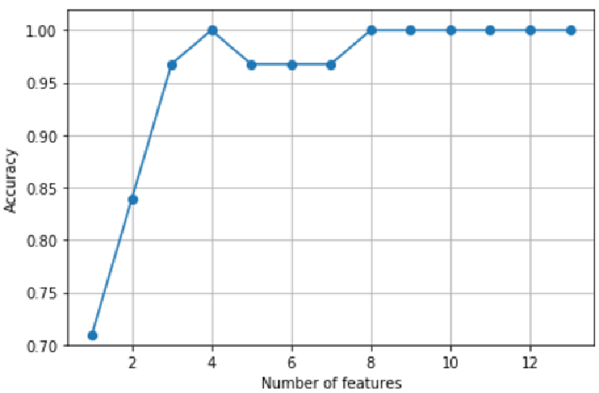

> 通过图可以看到：当增加了特征的数量后，KNN分类器在验证数据集上的准确率提高了。此外，图中还显示，当k＝{4，8，9，10，11，12}时，算法可以达到百分之百的准确率。

**我们看一下是哪8个特征在验证数据集上有如此好的表现：**
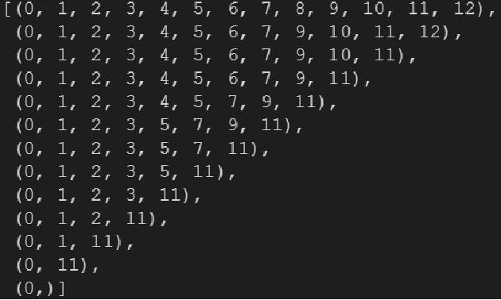

验证一下KNN分类器在原始测试集上的表现：
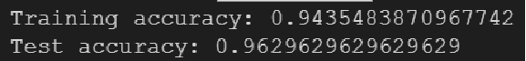
在上述代码中，在训练数据集上使用了所有的特征并得到了大约为94.4%的准确率。
不过，在测试数据集上的准确率（约为96.3%）。现在在选定的8个特征集上看一下KNN的性能：
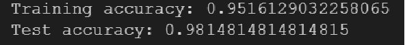
**当特征数量减少时候，都有所提高。**

## 特征排序
### 通过随机森林判定特征的重要性
- **随机森林是决策树的集成方法**，通过该算法可以对特征进行一个排序
- 另一种从数据集中选择相关特征的有效方法是使用随机森林，可以通过森林中所有决策树得到的平均不纯度衰减来度量特征的重要性，而不必考虑数据是否线性可分。
- 更加方便的是：scikit-learn中实现的随机森林已经为我们收集好了关于特征重要程度的信息，在拟合了RandomForestClassifier后，
可以通过feature_importances_得到这些内容。
- 可在葡萄酒数据集上训练500棵树，并且分别根据其重要程度对13个特征给出重要性等级。请记住：==无需对基于树的模型做标准化或归一化处理==。

### 随机森林特征选择代码
```
# # Assessing feature importance with Random Forests

# In[]:
from sklearn.ensemble import RandomForestClassifier

feat_labels = df_wine.columns[1:]

forest = RandomForestClassifier(n_estimators=500,
                                random_state=1)

forest.fit(X_train, y_train)
importances = forest.feature_importances_

# In[]:
# 每个特征重要性
importances

# In[]:
# 重要性从大到小排序后的原有索引值
# 比如返回数组的第一个值12，表示原来数组中索引是12的值最大
indices = np.argsort(importances)[::-1]
indices

# In[]:
for f in range(X_train.shape[1]):
    print("%2d) %-*s %f" % (f + 1, 30,
                            feat_labels[indices[f]],
                            importances[indices[f]]))

plt.title('Feature Importance')
plt.bar(range(X_train.shape[1]),
        importances[indices],
        align='center')

plt.xticks(range(X_train.shape[1]),
           feat_labels[indices], rotation=90)
plt.xlim([-1, X_train.shape[1]])
plt.tight_layout()
plt.show()

# In[]:
# 设置一个门限值来选择特征
from sklearn.feature_selection import SelectFromModel
# threshold 选择大于0.1的特征
sfm = SelectFromModel(forest, threshold=0.1, prefit=True)
X_selected = sfm.transform(X_train)

X_selected.shape

# Now, let's print the 3 features that met the threshold criterion for feature selection that we set earlier (note that this code snippet does not appear in the actual book but was added to this notebook later for illustrative purposes):

# In[]:
# 显示选择的5个特征
for f in range(X_selected.shape[1]):
    print("%2d) %-*s %f" % (f + 1, 30,
                            feat_labels[indices[f]],
                            importances[indices[f]]))
```
