# 人工智能-plot decision regions相关-8
[toc]
## 重要相关函数讲解：
### numpy.meshgrid()
**numpy.meshgrid()——生成网格点坐标矩阵。**
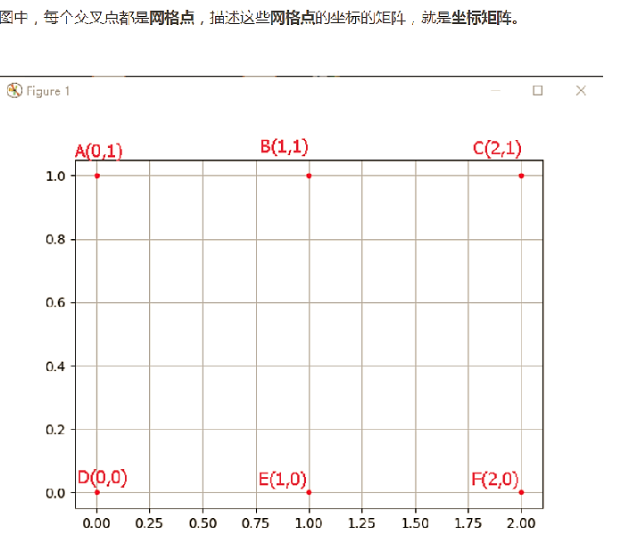

### plt.plot()
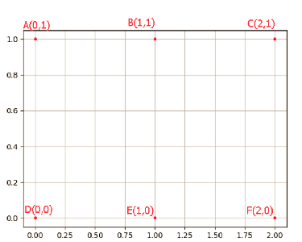
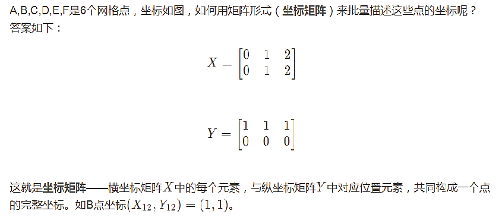
```
# 按照网格点方式画图
import numpy as np
import matplotlib.pyplot as plt

x = np.array([[0, 1, 2], [0, 1, 2]])
y = np.array([[0, 0, 0], [1, 1, 1]])

plt.plot(x, y,
         color='red',  # 全部点设置为红色
         marker='.',   # 点的形状为圆点
         linestyle='')  # 线型为空，也即点与点之间不用线连接

plt.grid(True)
plt.show()
```

```
# 按照matplotlib 常见一维数组对应关系画图
x = np.array([0, 1, 2, 0, 1, 2])
y = np.array([0, 0, 0, 1, 1, 1])

plt.plot(x, y,
         color='red',  # 全部点设置为红色
         marker='.',   # 点的形状为圆点
         linestyle='')  # 线型为空，也即点与点之间不用线连接

plt.grid(True)
plt.show()
```
> Matplotlib常见的用法是用一列横坐标（线性代数中的1维向量），一列纵坐标生成（两者元素个数相等）一些点。

**但是实际上，给matplotlib的坐标信息是矩阵也是可以的，只要横纵坐标的尺寸一样。都会按照对应关系生成点。（第一个例子显示情况）
但是有需要注意的地方，按照矩阵给坐标点信息，matplotlib会把横坐标矩阵中，每一列对应的点当做同一条线。举个例子，把上面的代码plot的linestyle=''删掉，或者变成linestyle='-'（这个操作把图的线型改为默认状态），就会发现A-D是连接的，B-E是连接的，C-F是连接的，也即，会认为你输入的是3条线，如图**

```
# 按照网格点方式画图,linestyle删除
import numpy as np
import matplotlib.pyplot as plt

x = np.array([[0, 1, 2], [0, 1, 2]])
y = np.array([[0, 0, 0], [1, 1, 1]])

plt.plot(x, y,
         color='red',  # 全部点设置为红色
         marker='.'   # 点的形状为圆点
        )

plt.grid(True)
plt.show()

```
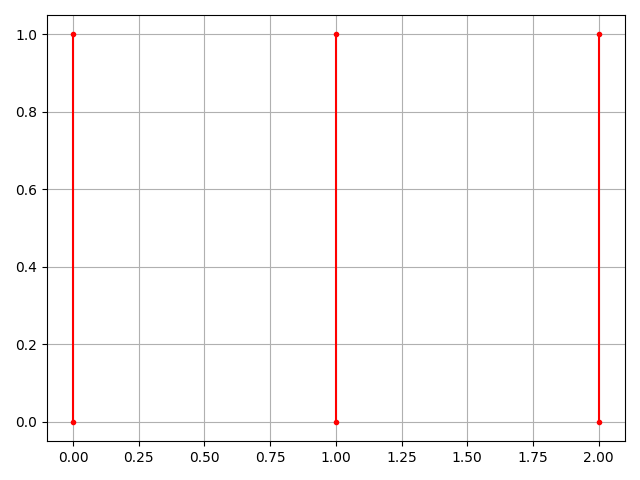

```
# 由于color参数没有设置，每个直线系统缺省分配一个不同颜色
import numpy as np
import matplotlib.pyplot as plt

x = np.array([[0, 1, 2, 3],
              [0, 1, 2, 3],
              [0, 1, 2, 3],
              [0, 1, 2, 3]])
y = np.array([[0, 0, 0, 0],
              [1, 1, 1, 1],
              [2, 2, 2, 2],
              [3, 3, 3, 3]])
plt.plot(x, y,
         marker='.',  # 点的形状为圆点
         markersize=10,  # 点设置大一点
         linestyle='-.')  # 线型为点划线
plt.grid(True)
plt.show()
```

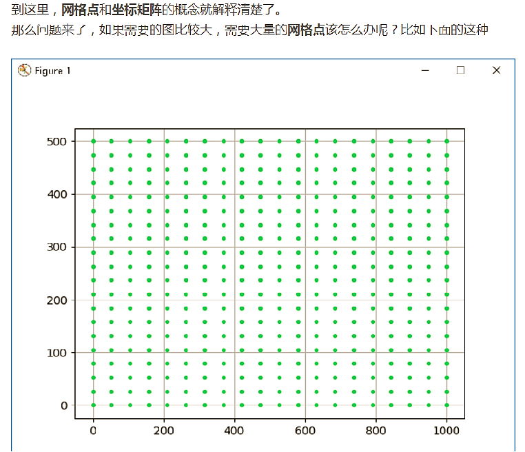
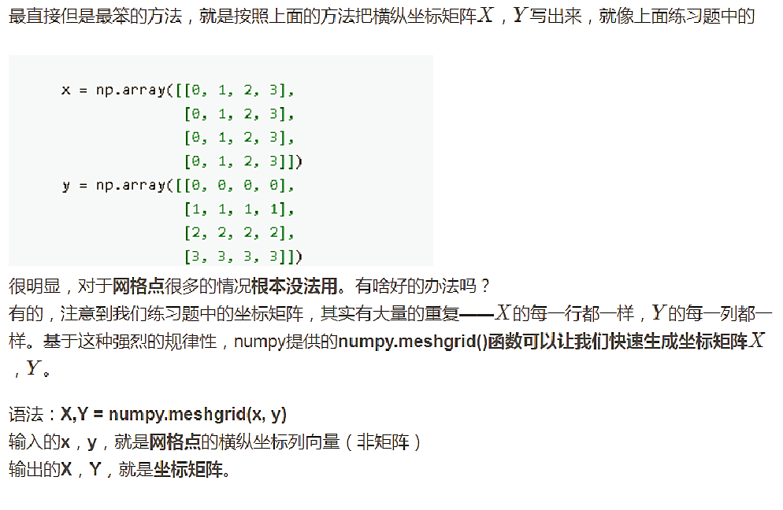
**改写第一个例子**
```
# 改写第一个例子中的代码，用numpy.meshgrid来实现。
import numpy as np
import matplotlib.pyplot as plt

x = np.array([0, 1, 2])
y = np.array([0, 1])

X, Y = np.meshgrid(x, y)
print(X)
print()
print(Y)

# In[]:
plt.plot(X, Y,
         color='red',  # 全部点设置为红色
         marker='.',  # 点的形状为圆点
         linestyle='')  # 线型为空，也即点与点之间不用线连接
plt.grid(True)
plt.show()
```

### numpy.linspace() 和 numpy.arange()
```
# 更多的网格点例子
import numpy as np
import matplotlib.pyplot as plt

# In[]:
"""
# 首先学习下numpy.linspace，产生均匀分布样本
# numpy.linspace(start, stop, num=50, endpoint=True...)
# 在指定的间隔内返回均匀间隔的数字。注意缺省是50个值
# 返回num均匀分布的样本，在[start, stop]。
# 这个区间的端点可以任意的被排除在外。

# 在[0,10]范围内，产生num从1到5的结果，arange是左闭右开区间[1,6)
# 都会包括最后一个点10
# 只有一个样本，就是起始点
# 样本如果大于1，间隔大小 = 10/(num-1)
"""

# In[]:
for i in np.arange(1, 6):
    x_t = np.linspace(0, 10, i)
    print(i)
    print(x_t)

# In[]:
# 如果不想包括最后一个点
for i in np.arange(1, 6):
    x_t = np.linspace(0, 10, i, endpoint=False)
    print(i)
    print(x_t)

# In[]:
# 在[0,1000]范围内产生均匀分布的20个点
# num=20，间隔大小 = 1000/(num-1)=1000/19=52.63
x = np.linspace(0,1000,20)
y = np.linspace(0,500,20)
print(len(x),len(y))
print(x)
print(y)

# In[]:
# 产生20行20列的网格矩阵
X,Y = np.meshgrid(x, y)

plt.plot(X, Y,
         color='limegreen',  # 设置颜色为limegreen
         marker='.',  # 设置点类型为圆点
         linestyle='')  # 设置线型为空，也即没有线连接点
plt.grid(True)
plt.show()

# In[]:
# np.arange 例子
r0 = np.arange(1,10)
print(len(r0))
print(r0)

# In[]:
# 取值都在[1,10)范围内
r1 = np.arange(1, 10, step=0.5)
print(len(r1))
print(r1)

# In[]:
r2 = np.arange(1, 10, step=2.1)
print(len(r2))
print(r2)
```
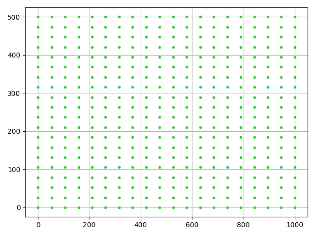

### plot_decision_regions解释
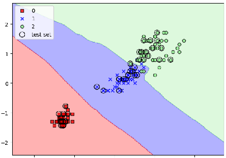
**可以看到红，蓝，绿分别对应了一类**
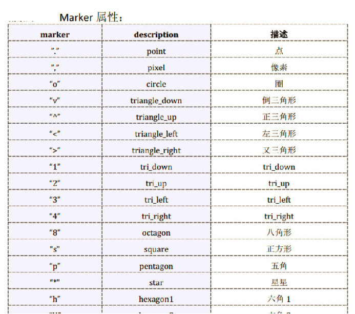

**关于画图中的marker，
网上可以查看不同的含义，
此处截取部分**

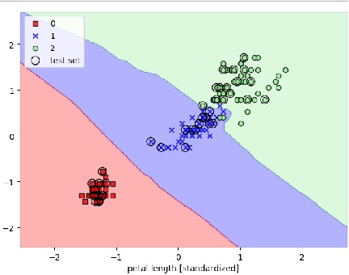
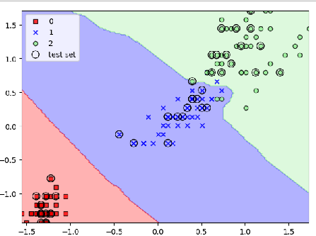

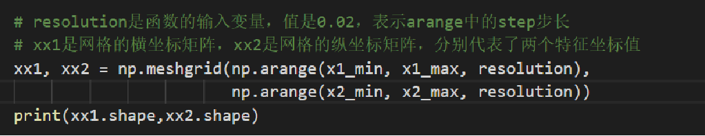

(158, 165)
(158, 165)

产生了维度为（158，165）的两个矩阵，一个是每个特征点的横坐标矩阵，
一个是每个特征点的纵坐标矩阵，两个坐标值（对应了叶子的两个特征）
就对应了一个特征点

将这所有的(158, 165)个点用分类器进行预测，根据预测结果就可以画出
分界面
```
from sklearn import datasets
import numpy as np

iris = datasets.load_iris()
X = iris.data[:, [2, 3]]
y = iris.target

from sklearn.model_selection import train_test_split

X_train, X_test, y_train, y_test = train_test_split(
    X, y, test_size=0.3, random_state=1, stratify=y)

from sklearn.preprocessing import StandardScaler

sc = StandardScaler()
sc.fit(X_train)
X_train_std = sc.transform(X_train)
X_test_std = sc.transform(X_test)

X_combined_std = np.vstack((X_train_std, X_test_std))
y_combined = np.hstack((y_train, y_test))

from sklearn.neighbors import KNeighborsClassifier

knn = KNeighborsClassifier(n_neighbors=5,
                           p=2,
                           metric='minkowski')
knn.fit(X_train_std, y_train)

import matplotlib.pyplot as plt
from matplotlib.colors import ListedColormap


# test_idx 测试数据的下标，X是train和test数据的合集，所以只需要测试数据的下标就好了。 resolution 指间隔
def plot_decision_regions(X, y, classifier, test_idx=None, resolution=0.02):
    # setup marker generator and color map
    # 五种标记符号
    markers = ('s', 'x', 'o', '^', 'v')
    # 五种颜色，红，蓝，浅绿，灰色，青色
    colors = ('red', 'blue', 'lightgreen', 'gray', 'cyan')
    # y存放的是预测结果，np.unique(y)得到所有的类别
    # 此处有三类，所以建立三个颜色映射对象，
    # 将三类对应colore[:3],即0，1，2对应的红，兰，浅绿三种
    # ListedColormap是处理颜色的对象，根据列表中每个字符串颜色值，比如‘red’，映射为对应可以处理的颜色对象
    cmap = ListedColormap(colors[:len(np.unique(y))])
    print(y.shape)
    # plot the decision surface
    # 开始画决策面
    # 注意，决策面是针对只有两个特征变量的，因为只有二维特征才方便展示观看
    # 其中x轴方向表现一个特征值，y轴方向表现一个特征值
    # 函数的输入变量X保存的是特征值，行数是样本数，列数是特征数，从0索引列，只有0和1两列
    # 下面是获取每个特征在所有样本中的最大值和最小值，加1和减1是为了进行一定的区域扩展，
    # 保证所有样本点都可以显示的更加清楚，如果不进行扩展，在最大值最小值附件的样本就可能显示不清楚，
    # 自己可以将下面的True改为False测试下
    if True:
        x1_min, x1_max = X[:, 0].min() - 1, X[:, 0].max() + 1
        x2_min, x2_max = X[:, 1].min() - 1, X[:, 1].max() + 1
    else:
        x1_min, x1_max = X[:, 0].min(), X[:, 0].max()
        x2_min, x2_max = X[:, 1].min(), X[:, 1].max()

    # resolution是函数的输入变量，值是0.02，表示arange中的step步长
    # xx1是网格的横坐标矩阵，xx2是网格的纵坐标矩阵，分别代表了两个特征坐标值
    xx1, xx2 = np.meshgrid(np.arange(x1_min, x1_max, resolution),
                           np.arange(x2_min, x2_max, resolution))
    print(xx1.shape, xx2.shape)

    # 对网格矩阵的每个坐标值，即将所有网格点作为特征值进行预测，得到预测结果
    # xx1.ravel()表示将多维数组转为一维数组
    print(xx1.ravel().shape)
    print(np.array([xx1.ravel(), xx2.ravel()]).shape)
    print(np.array([xx1.ravel(), xx2.ravel()]).T.shape)
    Z = classifier.predict(np.array([xx1.ravel(), xx2.ravel()]).T)
    # 把预测结果reshape成与网格矩阵一样的shape，这样Z矩阵的每个值就对应相同位置的网格矩阵值
    print(Z.shape)
    Z = Z.reshape(xx1.shape)

    print(Z.shape)
    # 画等高线，并对等高线之间进行颜色填充，Z是预测结果，有三种类型，
    # 本质就是根据两个特征值的预测值画不同的颜色，所谓等高，预测结果一样，就表示高度一样
    # 把（特征1，特征2，预测结果）放到一个三维空间理解，如果从等高线理解，预测结果越大，认为越高
    # cmap表示选用的三种颜色，alpha是透明度的设置，
    # 设置一定透明度，目的是将划分面的颜色与样本预测结果颜色区分出来
    plt.contourf(xx1, xx2, Z, alpha=0.3, cmap=cmap)
    # 设置坐标轴的界限值
    plt.xlim(xx1.min(), xx1.max())
    plt.ylim(xx2.min(), xx2.max())
    # plt.show()

    # 画所有数据预测结果的散点图
    # idx是所有类别索引从0开始，cl表示每个类别值
    for idx, cl in enumerate(np.unique(y)):
        # 根据cl获取每一类样本，idx获取对应的颜色和marker
        # X[y == cl, 0] 获取所有y=某个类别的x的横坐标
        plt.scatter(x=X[y == cl, 0],
                    y=X[y == cl, 1],
                    alpha=0.8,
                    c=colors[idx],
                    marker=markers[idx],
                    label=cl,
                    edgecolor='black')

    # 如果包括测试数据，在测试数据外部画一个更大的圈圈
    if test_idx:
        # 由于测试数据是按照顺序关系放到了训练数据后面，所以
        # 可以根据test_idx顺序找到
        X_test, y_test = X[test_idx, :], y[test_idx]

        plt.scatter(X_test[:, 0],
                    X_test[:, 1],
                    c='',  # 表示没有颜色填充，只是画圈的边框即可
                    edgecolor='black',
                    alpha=1.0,
                    linewidth=1,
                    marker='o',
                    s=100,  # 设置图标大小，100表示更大，可以把原有不同分类图标恰好圈住即可，测试出来
                    label='test set')


plot_decision_regions(X_combined_std, y_combined,
                      classifier=knn, test_idx=range(105, 150))

plt.xlabel('petal length [standardized]')
plt.ylabel('petal width [standardized]')
plt.legend(loc='upper left')
plt.tight_layout()
plt.show()
```