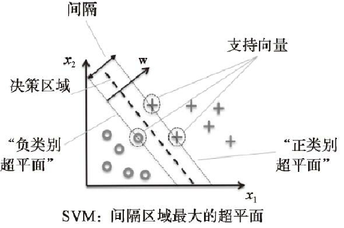

# 人工智能-支持向量机-9

## 使用支持向量机最大化分类间隔
**另一种性能强大且广泛应用的学习算法是支持向量机（support vector machine，SVM），它可以看作对感知器的扩展。在感知器算法中，我们可以最小化分类误差。而在SVM中，我们的优化目标是最大化分类间隔。此处间隔是指两个分离的超平面（决策边界）间的距离，而最靠近超平面的训练样本称作支持向量（support vector），如下图所示：**




> 此处需要知道一个超平面（在二维空间就是一条直线，在三维空间就是
一个面，多维叫超平面）的数学表达，以及一个空间点到面的距离计算
公式，计算方法是固定的数学公式，此处知道即可。

**下面公式中的正负1就体现的最大分类间隔，这里选择用正负1是为了计算方便，因为无论间隔是多少，都可以依靠伸缩w和b约为1（通过数学的线性变换）。就是规范化后的经过支持向量的两个超平面。这个公式就是SVM的最大间隔假设。**


> 在实践中，通过二次规划的方法，对目标函数的倒数项进行最小化处理。

## svm分类的例子
```
from sklearn import datasets
import numpy as np
from sklearn.model_selection import train_test_split
from sklearn.preprocessing import StandardScaler
from sklearn.svm import SVC
import matplotlib.pyplot as plt
from matplotlib.colors import ListedColormap

def plot_decision_regions(X, y, classifier, test_idx=None, resolution=0.02):

    # setup marker generator and color map
    # 五种标记符号
    markers = ('s', 'x', 'o', '^', 'v')
    # 五种颜色，红，蓝，浅绿，灰色，青色
    colors = ('red', 'blue', 'lightgreen', 'gray', 'cyan')
    # y存放的是预测结果，np.unique(y)得到所有的类别
    # 此处有三类，所以建立三个颜色映射对象，
    # 将三类对应colore[:3],即0，1，2对应的红，兰，浅绿三种
    # ListedColormap是处理颜色的对象，根据列表中每个字符串颜色值，比如‘red’，映射为对应可以处理的颜色对象
    cmap = ListedColormap(colors[:len(np.unique(y))])

    # plot the decision surface
    # 开始画决策面
    # 注意，决策面是针对只有两个特征变量的，因为只有二维特征才方便展示观看
    # 其中x轴方向表现一个特征值，y轴方向表现一个特征值
    # 函数的输入变量X保存的是特征值，行数是样本数，列数是特征数，从0索引列，只有0和1两列
    # 下面是获取每个特征在所有样本中的最大值和最小值，加1和减1是为了进行一定的区域扩展，
    # 保证所有样本点都可以显示的更加清楚，如果不进行扩展，在最大值最小值附件的样本就可能显示不清楚，
    # 自己可以将下面的True改为False测试下
    if True:
        x1_min, x1_max = X[:, 0].min() - 1, X[:, 0].max() + 1
        x2_min, x2_max = X[:, 1].min() - 1, X[:, 1].max() + 1
    else:
        x1_min, x1_max = X[:, 0].min(), X[:, 0].max()
        x2_min, x2_max = X[:, 1].min(), X[:, 1].max()

    # resolution是函数的输入变量，值是0.02
    xx1, xx2 = np.meshgrid(np.arange(x1_min, x1_max, resolution),
                           np.arange(x2_min, x2_max, resolution))
    Z = classifier.predict(np.array([xx1.ravel(), xx2.ravel()]).T)
    Z = Z.reshape(xx1.shape)
    plt.contourf(xx1, xx2, Z, alpha=0.3, cmap=cmap)
    plt.xlim(xx1.min(), xx1.max())
    plt.ylim(xx2.min(), xx2.max())

    for idx, cl in enumerate(np.unique(y)):
        plt.scatter(x=X[y == cl, 0], 
                    y=X[y == cl, 1],
                    alpha=0.8, 
                    c=colors[idx],
                    marker=markers[idx], 
                    label=cl, 
                    edgecolor='black')

    # highlight test samples
    if test_idx:
        # plot all samples
        X_test, y_test = X[test_idx, :], y[test_idx]

        plt.scatter(X_test[:, 0],
                    X_test[:, 1],
                    c='',
                    edgecolor='black',
                    alpha=1.0,
                    linewidth=1,
                    marker='o',
                    s=100, 
                    label='test set')

## main
if __name__ == '__main__':
    iris = datasets.load_iris()
    X = iris.data[:, [2, 3]]
    y = iris.target

    X_train, X_test, y_train, y_test = train_test_split(
        X, y, test_size=0.3, random_state=1, stratify=y)

    sc = StandardScaler()
    sc.fit(X_train)
    X_train_std = sc.transform(X_train)
    X_test_std = sc.transform(X_test)

    # 下面的C与逻辑回归和线性回归中的C一样，是权重w的惩罚系数，
    # 通过正则化的方法控制权重w
    svm = SVC(kernel='linear', C=1.0, random_state=1)
    svm.fit(X_train_std, y_train)

    X_combined_std = np.vstack((X_train_std, X_test_std))
    y_combined = np.hstack((y_train, y_test))

    plot_decision_regions(X_combined_std, 
                        y_combined,
                        classifier=svm, 
                        test_idx=range(105, 150))
    plt.xlabel('petal length [standardized]')
    plt.ylabel('petal width [standardized]')
    plt.legend(loc='upper left')
    plt.tight_layout()
    plt.show()
```
## 异或问题


> 重新回到了二次规划问题

**支持向量机在机器学习爱好者中广受欢迎的另一原因是：它可以很容易地使用“核技巧”来解决非线性可分问题。再通过一个例子来认识一下所谓的非线性可分问题到底是什么。**

## 异或代码
通过代码，使用NumPy中的logical_xor函数创建了一个经过“异或”操作的数据集，其中100个样本属于类别1，另外的100个样本被划定为类别-1：

> 对于蓝色样本，两个特征值x1和x2
的符号是相反的，即一正一负，
xor异或操作结果是1，看作一类，
对于红色样本，两个特征值的符号
是一样的，都是正或都是负，
异或的结果是0，看作一类

```python

# In[]:
import matplotlib.pyplot as plt
import numpy as np

# 生成200行2列的均值为0标准差是1的标准正太分布数据
# 表示200个样本，0列和1列代表两个特征值
# 生成正太分布数据 standard normal distribution
np.random.seed(1)
X_xor = np.random.randn(200, 2)
X_xor

# In[]:
# 第0列大于0为true，反之为false
X_xor[:, 0] > 0

# In[]:
# 同样第1列大于0为true，反之为false
X_xor[:, 1] > 0

# In[]:
# logical_xor对逻辑值true或false操作
# 异或是相同为0，相异为1，对于逻辑值来说，
# true和false的异或结果是true，true和true或者false和false异或结果是false
y_xor = np.logical_xor(X_xor[:, 0] > 0,
                       X_xor[:, 1] > 0)

y_xor

# In[]:
# 对于np.where(condition, x, y)
# 满足条件(condition)，输出x，不满足输出y。
# 对于y_xor的结果中（只有true或false），true则输出1，否则-1
y_xor = np.where(y_xor, 1, -1)
y_xor

# In[]:
y_xor == 1

# In[]:
# 表示0列和1列值符号相反的样本
# X_xor[y_xor == 1, 0]表示取y_xor == 1结果中为True的行
plt.scatter(X_xor[y_xor == 1, 0],
            X_xor[y_xor == 1, 1],
            c='b', marker='x',
            label='1')

# 表示0列和1列值符号相同的样本
plt.scatter(X_xor[y_xor == -1, 0],
            X_xor[y_xor == -1, 1],
            c='r',
            marker='s',
            label='-1')

plt.xlim([-3, 3])
plt.ylim([-3, 3])
plt.legend(loc='best')
plt.tight_layout()
plt.show()
```

## svm非线性分类
- 显然，如果使用前面讨论过的线性SVM模型，并将线性超平面当做决策边界，无法将样本正确地划分为正类别或负类别。
- 核方法处理此类非线性可分数据的基本理念就是：通过映射函数φ（·）将样本的原始特征映射到一个使样本线性可分的更高维空间中。如下图所示，我们可以将二维数据集通过下列映射转换到新的三维特征空间中，从而使得样本可分，图示看下页展示。


> 这使得我们可以将图中的两个类别通过线性超平面进行分割，如果我们把此超平面映射回原始特征空间，则可线性分割两类数据的超平面就变为非线性的了。

## 使用核技巧在高维空间中发现分离超平面
1. 为了使用SVM解决非线性问题，我们通过一个映射函数φ（·）将训练数据映射到更高维的特征空间，并在新的特征空间上训练一个线性SVM模型。
2. 然后将同样的映射函数φ（·）应用于新的、未知数据上（即使用此映射将未知数据映射到新的特征空间），进而使用新特征空间上的线性SVM模型对其进行分类。
3. 但是，这种映射方法面临的一个问题就是：构建新的特征空间带来非常大的计算成本，特别是在处理高维数据的时候。这时就用到了我们称作核技巧的方法。我们此处不会过多关注SVM训练中所需解决的二次规划问题
4. 一个最广为使用的核函数就是径向基函数核（Radial Basis Function kernel，RBF kernel）或高斯核（Gaussian kernel）
5. 在此，我们只是简单使用前面已经导入的scikitlearn
包中的SVM类，并将参数kernel＝'linear'替换为kernel＝'rbf'：

**正如结果图像所示，核SVM相对较好地完成了对“异或”数据的划分**

在这里将参数γ的值设定为gamma＝0.1，如果我们减小γ的值，将会增加受影响的训练样本的范围，这将导致决策边界更加宽松。为了对γ有个更好的直观认识，我们将基于RBF核的SVM应用于鸢尾花数据集。下面再看代码演示

## 核SVM分类的代码
```
import matplotlib.pyplot as plt
import numpy as np

# 生成200行2列的均值约为0标准差约为1的标准正太分布数据
# 表示200个样本，0列和1列代表两个特征值
np.random.seed(1)
X_xor = np.random.randn(200, 2)
X_xor

# In[]
X_xor[:,0].mean(), X_xor[:,0].std()

# In[]
X_xor[:,1].mean(), X_xor[:,1].std()

# In[]:
# 第0列大于0为true，反之为false
X_xor[:, 0] > 0

# In[]:
# 同样第1列大于0为true，反之为false
X_xor[:, 1] > 0

# In[]:
# logical_xor对逻辑值true或false操作，一种逻辑操作
# 异或是相同为0，相异为1，对于逻辑值来说，
# true和false的异或结果是true，true和true或者false和false异或结果是false
y_xor = np.logical_xor(X_xor[:, 0] > 0,
                       X_xor[:, 1] > 0)

# 对于两个生成的特征值，如果符号相异，则label为true，后面设置为1
# 如果符号相同，label设置为false，后面设置为-1
y_xor

# In[]:
# 对于np.where(condition, x, y)
# 满足条件(condition)，输出x，不满足输出y。
# 对于y_xor的结果中（只有true或false），true则输出1，否则-1
y_xor = np.where(y_xor, 1, -1)
y_xor

# In[]:
# 为1的输出true
y_xor == 1

# In[]:
# 对样本进行过滤
# 表示0列和1列值符号相反的样本
# X_xor[y_xor == 1, 0]表示取y_xor == 1结果中为True的行
plt.scatter(X_xor[y_xor == 1, 0],
            X_xor[y_xor == 1, 1],
            c='b', marker='x',
            label='1')

# 表示0列和1列值符号相同的样本
plt.scatter(X_xor[y_xor == -1, 0],
            X_xor[y_xor == -1, 1],
            c='r',
            marker='s',
            label='-1')

plt.xlim([-3, 3])
plt.ylim([-3, 3])
plt.legend(loc='best')
plt.tight_layout()
plt.show()

# In[]:
from sklearn.svm import SVC
import matplotlib.pyplot as plt
from matplotlib.colors import ListedColormap

def plot_decision_regions(X, y, classifier, test_idx=None, resolution=0.02):

    # setup marker generator and color map
    # 五种标记符号
    markers = ('s', 'x', 'o', '^', 'v')
    # 五种颜色，红，蓝，浅绿，灰色，青色
    colors = ('red', 'blue', 'lightgreen', 'gray', 'cyan')
    # y存放的是预测结果，np.unique(y)得到所有的类别
    # 此处有三类，所以建立三个颜色映射对象，
    # 将三类对应colore[:3],即0，1，2对应的红，兰，浅绿三种
    # ListedColormap是处理颜色的对象，根据列表中每个字符串颜色值，比如‘red’，映射为对应可以处理的颜色对象
    cmap = ListedColormap(colors[:len(np.unique(y))])

    # plot the decision surface
    # 开始画决策面
    # 注意，决策面是针对只有两个特征变量的，因为只有二维特征才方便展示观看
    # 其中x轴方向表现一个特征值，y轴方向表现一个特征值
    # 函数的输入变量X保存的是特征值，行数是样本数，列数是特征数，从0索引列，只有0和1两列
    # 下面是获取每个特征在所有样本中的最大值和最小值，加1和减1是为了进行一定的区域扩展，
    # 保证所有样本点都可以显示的更加清楚，如果不进行扩展，在最大值最小值附件的样本就可能显示不清楚，
    # 自己可以将下面的True改为False测试下
    if True:
        x1_min, x1_max = X[:, 0].min() - 1, X[:, 0].max() + 1
        x2_min, x2_max = X[:, 1].min() - 1, X[:, 1].max() + 1
    else:
        x1_min, x1_max = X[:, 0].min(), X[:, 0].max()
        x2_min, x2_max = X[:, 1].min(), X[:, 1].max()

    # resolution是函数的输入变量，值是0.02
    xx1, xx2 = np.meshgrid(np.arange(x1_min, x1_max, resolution),
                           np.arange(x2_min, x2_max, resolution))
    Z = classifier.predict(np.array([xx1.ravel(), xx2.ravel()]).T)
    Z = Z.reshape(xx1.shape)
    plt.contourf(xx1, xx2, Z, alpha=0.3, cmap=cmap)
    plt.xlim(xx1.min(), xx1.max())
    plt.ylim(xx2.min(), xx2.max())

    for idx, cl in enumerate(np.unique(y)):
        plt.scatter(x=X[y == cl, 0], 
                    y=X[y == cl, 1],
                    alpha=0.8, 
                    c=colors[idx],
                    marker=markers[idx], 
                    label=cl, 
                    edgecolor='black')

    # highlight test samples
    if test_idx:
        # plot all samples
        X_test, y_test = X[test_idx, :], y[test_idx]

        plt.scatter(X_test[:, 0],
                    X_test[:, 1],
                    c='',
                    edgecolor='black',
                    alpha=1.0,
                    linewidth=1,
                    marker='o',
                    s=100, 
                    label='test set')

# In[]:
# 使用svm核函数进行异或数据的分类
svm = SVC(kernel='rbf', random_state=1, gamma=0.10, C=10.0)
svm.fit(X_xor, y_xor)
plot_decision_regions(X_xor, y_xor,
                      classifier=svm)

plt.legend(loc='upper left')
plt.tight_layout()
plt.show()
```

## gamma对核SVM的影响
```
from sklearn import datasets
import numpy as np
from sklearn.model_selection import train_test_split
from sklearn.preprocessing import StandardScaler
from sklearn.svm import SVC
import matplotlib.pyplot as plt
from matplotlib.colors import ListedColormap

def plot_decision_regions(X, y, classifier, test_idx=None, resolution=0.02):

    # setup marker generator and color map
    # 五种标记符号
    markers = ('s', 'x', 'o', '^', 'v')
    # 五种颜色，红，蓝，浅绿，灰色，青色
    colors = ('red', 'blue', 'lightgreen', 'gray', 'cyan')
    # y存放的是预测结果，np.unique(y)得到所有的类别
    # 此处有三类，所以建立三个颜色映射对象，
    # 将三类对应colore[:3],即0，1，2对应的红，兰，浅绿三种
    # ListedColormap是处理颜色的对象，根据列表中每个字符串颜色值，比如‘red’，映射为对应可以处理的颜色对象
    cmap = ListedColormap(colors[:len(np.unique(y))])

    # plot the decision surface
    # 开始画决策面
    # 注意，决策面是针对只有两个特征变量的，因为只有二维特征才方便展示观看
    # 其中x轴方向表现一个特征值，y轴方向表现一个特征值
    # 函数的输入变量X保存的是特征值，行数是样本数，列数是特征数，从0索引列，只有0和1两列
    # 下面是获取每个特征在所有样本中的最大值和最小值，加1和减1是为了进行一定的区域扩展，
    # 保证所有样本点都可以显示的更加清楚，如果不进行扩展，在最大值最小值附件的样本就可能显示不清楚，
    # 自己可以将下面的True改为False测试下
    if True:
        x1_min, x1_max = X[:, 0].min() - 1, X[:, 0].max() + 1
        x2_min, x2_max = X[:, 1].min() - 1, X[:, 1].max() + 1
    else:
        x1_min, x1_max = X[:, 0].min(), X[:, 0].max()
        x2_min, x2_max = X[:, 1].min(), X[:, 1].max()

    # resolution是函数的输入变量，值是0.02
    xx1, xx2 = np.meshgrid(np.arange(x1_min, x1_max, resolution),
                           np.arange(x2_min, x2_max, resolution))
    Z = classifier.predict(np.array([xx1.ravel(), xx2.ravel()]).T)
    Z = Z.reshape(xx1.shape)
    plt.contourf(xx1, xx2, Z, alpha=0.3, cmap=cmap)
    plt.xlim(xx1.min(), xx1.max())
    plt.ylim(xx2.min(), xx2.max())

    for idx, cl in enumerate(np.unique(y)):
        plt.scatter(x=X[y == cl, 0], 
                    y=X[y == cl, 1],
                    alpha=0.8, 
                    c=colors[idx],
                    marker=markers[idx], 
                    label=cl, 
                    edgecolor='black')

    # highlight test samples
    if test_idx:
        # plot all samples
        X_test, y_test = X[test_idx, :], y[test_idx]

        plt.scatter(X_test[:, 0],
                    X_test[:, 1],
                    c='',
                    edgecolor='black',
                    alpha=1.0,
                    linewidth=1,
                    marker='o',
                    s=100, 
                    label='test set')

## main
if __name__ == '__main__':
    iris = datasets.load_iris()
    X = iris.data[:, [2, 3]]
    y = iris.target

    X_train, X_test, y_train, y_test = train_test_split(
        X, y, test_size=0.3, random_state=1, stratify=y)

    sc = StandardScaler()
    sc.fit(X_train)
    X_train_std = sc.transform(X_train)
    X_test_std = sc.transform(X_test)

    X_combined_std = np.vstack((X_train_std, X_test_std))
    y_combined = np.hstack((y_train, y_test))

    svm = SVC(kernel='rbf', random_state=1, gamma=0.2, C=1.0)
    svm.fit(X_train_std, y_train)

    plot_decision_regions(X_combined_std, y_combined,
                        classifier=svm, test_idx=range(105, 150))
    plt.xlabel('petal length [standardized]')
    plt.ylabel('petal width [standardized]')
    plt.legend(loc='upper left')
    plt.tight_layout()
    plt.show()

    svm = SVC(kernel='rbf', random_state=1, gamma=100.0, C=1.0)
    svm.fit(X_train_std, y_train)

    plot_decision_regions(X_combined_std, y_combined, 
                        classifier=svm, test_idx=range(105, 150))
    plt.xlabel('petal length [standardized]')
    plt.ylabel('petal width [standardized]')
    plt.legend(loc='upper left')
    plt.tight_layout()
    plt.show()

```

