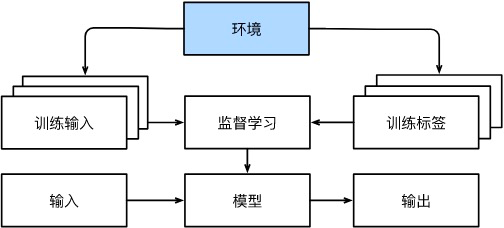
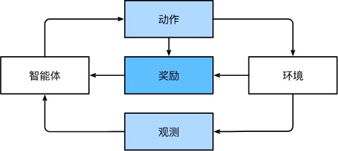

# 前言
[toc]
## 1.1 关键组建
首先，我们想让大家更清楚地了解一些核心组件。 无论我们遇到什么类型的机器学习问题，这些组件都将伴随我们左右：
1. 我们可以学习的**数据（data）**。
2. 如何转换数据的**模型（model）**。
3. 一个**目标函数（objective function）**，用来量化模型的有效性。
4. 调整模型参数以优化目标函数的**算法（algorithm）**。

### 1.1.1 数据
 每个数据集由一个个**样本**（example, sample）组成，大多时候，它们遵循**独立同分布**(independently and identically distributed, i.i.d.)。 样本有时也叫做**数据点**（data point）或者数据实例（data instance），通常每个样本由**一组称为特征**（features，或协变量（covariates））的属性组成。 机器学习模型会根据这些属性进行预测。 在上面的监督学习问题中，要预测的是一个特殊的属性，它被称为**标签**（label，或目标（target））。
 
 当每个样本的特征类别数量都是相同的时候，其特征向量是固定长度的，这个长度被称为数据的维数（dimensionality）。 固定长度的特征向量是一个方便的属性，它有助于我们量化学习大量样本。
 
 然而，并不是所有的数据都可以用“固定长度”的向量表示。 以图像数据为例，如果它们全部来自标准显微镜设备，那么“固定长度”是可取的； 但是如果图像数据来自互联网，它们很难具有相同的分辨率或形状。 这时，我们可以考虑将图像裁剪成标准尺寸，但这种办法很局限，有丢失信息的风险。 此外，文本数据更不符合“固定长度”的要求。 比如，对于亚马逊等电子商务网站上的客户评论，有些文本数据很简短（比如“好极了”），有些则长篇大论。 与传统机器学习方法相比，深度学习的一个主要优势是可以处理不同长度的数据。

请注意，仅仅拥有海量的数据是不够的，我们还需要正确的数据。 如果数据中充满了错误，或者如果数据的特征不能预测任务目标，那么模型很可能无效。 有一句古语很好地反映了这个现象：“输入的是垃圾，输出的也是垃圾。”（“Garbage in, garbage out.”） 此外，糟糕的预测性能甚至会加倍放大事态的严重性。 在一些敏感应用中，如预测性监管、简历筛选和用于贷款的风险模型，我们必须特别警惕垃圾数据带来的后果。 一种常见的问题来自不均衡的数据集，比如在一个有关医疗的训练数据集中，某些人群没有样本表示。 想象一下，假设你要训练一个皮肤癌识别模型，但它（在训练数据集中）从未“见过”黑色皮肤的人群，这个模型就会顿时束手无策。

### 1.1.2 模型
大多数机器学习会涉及到数据的转换。 比如，我们建立一个“摄取照片并预测笑脸”的系统。再比如，我们摄取一组传感器读数，并预测读数的正常与异常程度。 虽然简单的模型能够解决如上简单的问题，但本书中关注的问题超出了经典方法的极限。 深度学习与经典方法的区别主要在于：前者关注的功能强大的模型，这些模型由神经网络错综复杂的交织在一起，包含层层数据转换，因此被称为*深度学习*（deep learning）。 在讨论深度模型的过程中，我们也将提及一些传统方法。

### 1.1.3 目标函数

在机器学习中，我们需要定义模型的优劣程度的度量，这个度量在大多数情况是“可优化”的，我们称之为*目标函数*（objective function）。 我们通常定义一个目标函数，并希望优化它到最低点。 因为越低越好，所以这些函数有时被称为*损失函数*（loss function，或cost function）。 但这只是一个惯例，你也可以取一个新的函数，优化到它的最高点。 这两个函数本质上是相同的，只是翻转一下符号。

当任务在试图预测数值时，最常见的损失函数是**平方误差**（squared error），即预测值与实际值之差的平方。 当试图解决分类问题时，最常见的目标函数是最小化错误率，即预测与实际情况不符的样本比例。 有些目标函数（如平方误差）很容易被优化，有些目标（如错误率）由于不可微性或其他复杂性难以直接优化。 在这些情况下，通常会优化替代目标。

通常，损失函数是根据模型参数定义的，并取决于数据集。 在一个数据集上，我们通过最小化总损失来学习模型参数的最佳值。 该数据集由一些为训练而收集的样本组成，称为训练数据集（training dataset，或称为训练集（training set））。 然而，在训练数据上表现良好的模型，并不一定在“新数据集”上有同样的效能，这里的“新数据集”通常称为测试数据集（test dataset，或称为测试集（test set））。

### 1.1.4. 优化算法

一旦我们获得了一些数据源及其表示、一个模型和一个合适的损失函数，我们接下来就需要一种算法，它能够搜索出最佳参数，以最小化损失函数。 深度学习中，大多流行的优化算法通常基于一种基本方法–梯度下降（gradient descent）。 简而言之，在每个步骤中，梯度下降法都会检查每个参数，看看如果你仅对该参数进行少量变动，训练集损失会朝哪个方向移动。 然后，它在可以减少损失的方向上优化参数。

## 1.2 各种机器学习问题
### 1.2.1 监督学习

*监督学习*（supervised learning）擅长在“给定输入特征”的情况下预测标签。 每个“特征-标签”对都称为一个样本（example）。 有时，即使标签是未知的，样本也可以指代输入特征。 我们的目标是生成一个模型，能够将任何输入特征映射到标签，即预测。

非正式地说，监督学习的学习过程如下所示。 首先，从已知大量数据样本中随机选取一个子集，为每个样本获取基本的真实标签。 有时，这些样本已有标签（例如，患者是否在下一年内康复？）； 有时，我们可能需要人工标记数据（例如，将图像分类）。 这些输入和相应的标签一起构成了训练数据集。 随后，我们选择有监督的学习算法，它将训练数据集作为输入，并输出一个“完成学习模型”。 最后，我们将之前没见过的样本特征放到这个“完成学习模型”中，使用模型的输出作为相应标签的预测。


综上所述，即使使用简单的描述“给定输入特征的预测标签”，监督学习也可以采取多种形式的模型，并且需要大量不同的建模决策，这取决于输入和输出的类型、大小和数量。 例如，我们使用不同的模型来处理“任意长度的序列”或“固定长度的序列”。 我们将在本书中深入探讨这些问题。

### 1.2.1.1 回归

*回归*（regression）是最简单的监督学习任务之一。当标签取任意数值时，我们称之为回归问题。 我们的目标是生成一个模型，它的预测非常接近实际标签值。

### 1.2.1.2 分类

 这种“哪一个？”的问题叫做分类（classification）问题。 在分类问题中，我们希望模型能够预测样本属于哪个类别（category，正式称为类（class））。 例如，对于手写数字，我们可能有10类，分别数字0到9。**在回归中，我们训练一个回归函数来输出一个数值； 而在分类中，我们训练一个分类器，它的输出即为预测的类别。**
 
 然而模型怎么判断得出这种“是”或“不是”的硬分类预测呢？ 我们可以试着用概率语言来理解模型。 给定一个样本特征，我们的模型为每个可能的类分配一个概率。 比如，之前的猫狗分类例子中，分类器可能会输出图像是猫的概率为0.9。 0.9这个数字表达什么意思呢？ 我们可以这样解释：分类器90%确定图像描绘的是一只猫。 预测类别的概率的大小传达了一种模型的不确定性。**与解决回归问题不同，分类问题的常见损失函数被称为交叉熵（cross-entropy）**。
 
 ### 1.2.1.3 标记问题
 
 有些分类问题很适合于二元分类或多元分类。 例如，我们可以训练一个普通的二元分类器来区分猫和狗。 运用最前沿的计算机视觉的算法，我们可以轻松地训练这个模型。 尽管如此，无论我们的模型有多精确，当分类器遇到新的动物时可能会束手无策。 比如这张“不来梅的城市音乐家”的图像 （这是一个流行的德国童话故事），图中有一只猫，一只公鸡，一只狗，一头驴，背景是一些树。 取决于我们最终想用我们的模型做什么，将其视为二元分类问题可能没有多大意义。 取而代之，我们可能想让模型描绘输入图像的内容，一只猫、一只狗、一头驴，还有一只公鸡。
 
 
 
 学习预测不相互排斥的类别的问题称为多标签分类（multi-label classification）。 举个例子，人们在技术博客上贴的标签，比如“机器学习”、“技术”、“小工具”、“编程语言”、“Linux”、“云计算”、“AWS”。 一篇典型的文章可能会用5-10个标签，因为这些概念是相互关联的。 关于“云计算”的帖子可能会提到“AWS”，而关于“机器学习”的帖子也可能涉及“编程语言”。
 
 ### 1.2.1.4. 搜索
 
 有时，我们不仅仅希望输出为一个类别或一个实值。 在信息检索领域，我们希望对一组项目进行排序。换句话说，如果要求我们输出字母表中的前5个字母，返回“A、B、C、D、E”和“C、A、B、E、D”是不同的。 即使结果集是相同的，集内的顺序有时却很重要。
 
 该问题的一种可能的解决方案：首先为集合中的每个元素分配相应的相关性分数，然后检索评级最高的元素。
 
 ### 1.2.1.5. 推荐系统
 另一类与搜索和排名相关的问题是推荐系统（recommender system），它的目标是向特定用户进行“个性化”推荐。 例如，对于电影推荐，科幻迷和喜剧爱好者的推荐结果页面可能会有很大不同。 类似的应用也会出现在零售产品、音乐和新闻推荐等等。
 
 推荐系统会为“给定用户和物品”的匹配性打分，这个“分数”可能是估计的评级或购买的概率。 由此，对于任何给定的用户，推荐系统都可以检索得分最高的对象集，然后将其推荐给用户。
 
 尽管推荐系统具有巨大的应用价值，但单纯用它作为预测模型仍存在一些缺陷。 关于如何处理审查、激励和反馈循环的许多问题，都是重要的开放性研究问题。
 
 ### 1.2.1.6. 序列学习
 以上大多数问题都具有固定大小的输入和产生固定大小的输出。模型只会将输入作为生成输出的“原料”，而不会“记住”输入的具体内容。
 
 如果输入的样本之间没有任何关系，以上模型可能完美无缺。 但是如果输入是连续的，我们的模型可能就需要拥有“记忆”功能。 比如，我们该如何处理视频片段呢？ 在这种情况下，每个视频片段可能由不同数量的帧组成。 通过前一帧的图像，我们可能对后一帧中发生的事情更有把握。 语言也是如此，机器翻译的输入和输出都为文字序列。
 
 这些问题是序列学习的实例，是机器学习最令人兴奋的应用之一。 序列学习需要摄取输入序列或预测输出序列，或两者兼而有之。 具体来说，输入和输出都是可变长度的序列，例如机器翻译和从语音中转录文本。 虽然不可能考虑所有类型的序列转换，但以下特殊情况值得一提。
 
**标记和解析**。这涉及到用属性注释文本序列。 换句话说，输入和输出的数量基本上是相同的。 例如，我们可能想知道动词和主语在哪里，或者，我们可能想知道哪些单词是命名实体。 通常，目标是基于结构和语法假设对文本进行分解和注释，以获得一些注释。 这听起来比实际情况要复杂得多。 下面是一个非常简单的示例，它使用“标记”来注释一个句子，该标记指示哪些单词引用命名实体。 标记为“Ent”，是实体（entity）的简写。

```
Tom has dinner in Washington with Sally
Ent  -    -    -     Ent      -    Ent
```

**自动语音识别**。在语音识别中，输入序列是说话人的录音，输出序列是说话人所说内容的文本记录。 它的挑战在于，与文本相比，音频帧多得多（声音通常以8kHz或16kHz采样）。 也就是说，音频和文本之间没有1:1的对应关系，因为数千个样本可能对应于一个单独的单词。 这也是“序列到序列”的学习问题，其中输出比输入短得多。


 ## 1.2.2 无监督学习
 如果你的工作没有十分具体的目标，你就需要“自发”地去学习了。 （如果你打算成为一名数据科学家，你最好培养这个习惯。） 比如，你的老板可能会给你一大堆数据，然后让你用它做一些数据科学研究，却没有对结果有要求。 我们称这类数据中不含有“目标”的机器学习问题为无监督学习（unsupervised learning）， 我们将在后面的章节中讨论无监督学习技术。 那么无监督学习可以回答什么样的问题呢？我们来看看下面的例子：
 - **聚类**（clustering）问题：没有标签的情况下，我们是否能给数据分类呢？比如，给定一组照片，我们能把它们分成风景照片、狗、婴儿、猫和山峰的照片吗？同样，给定一组用户的网页浏览记录，我们能否将具有相似行为的用户聚类呢？
 - **主成分分析**（principal component analysis）问题：我们能否找到少量的参数来准确地捕捉数据的线性相关属性？比如，一个球的运动轨迹可以用球的速度、直径和质量来描述。再比如，裁缝们已经开发出了一小部分参数，这些参数相当准确地描述了人体的形状，以适应衣服的需要。另一个例子：在欧几里得空间中是否存在一种（任意结构的）对象的表示，使其符号属性能够很好地匹配?这可以用来描述实体及其关系，例如“罗马”  −  “意大利”  +  “法国”  =  “巴黎”。
 - **因果关系**（causality）和**概率图模型**（probabilistic graphical models）问题：我们能否描述观察到的许多数据的根本原因？例如，如果我们有关于房价、污染、犯罪、地理位置、教育和工资的人口统计数据，我们能否简单地根据经验数据发现它们之间的关系？
 - **生成对抗性网络**（generative adversarial networks）：为我们提供一种合成数据的方法，甚至像图像和音频这样复杂的结构化数据。潜在的统计机制是检查真实和虚假数据是否相同的测试，它是无监督学习的另一个重要而令人兴奋的领域。

## 1.2.3 与环境互动
你可能一直心存疑虑：机器学习的输入（数据）来自哪里？机器学习的输出又将去往何方？ 到目前为止，不管是监督学习还是无监督学习，我们都会预先获取大量数据，然后启动模型，不再与环境交互。 这里所有学习都是在算法与环境断开后进行的，被称为离线学习（offline learning）。



这种简单的离线学习有它的魅力。 好的一面是，我们可以孤立地进行模式识别，而不必分心于其他问题。 但缺点是，解决的问题相当有限。 如果你更有雄心壮志，那么你可能会期望人工智能不仅能够做出预测，而且能够与真实环境互动。 与预测不同，“与真实环境互动”实际上会影响环境。 这里的人工智能是“智能代理”，而不仅是“预测模型”。 因此，我们必须考虑到它的行为可能会影响未来的观察结果。

考虑“与真实环境互动”将打开一整套新的建模问题。以下只是几个例子：

- 环境还记得我们以前做过什么吗？

- 环境是否有助于我们建模？例如，用户将文本读入语音识别器。

- 环境是否想要打败模型？例如，一个对抗性的设置，如垃圾邮件过滤或玩游戏？

- 环境是否重要？

- 环境是否变化？例如，未来的数据是否总是与过去相似，还是随着时间的推移会发生变化？是自然变化还是响应我们的自动化工具而发生变化？

当训练和测试数据不同时，最后一个问题提出了**分布偏移**（distribution shift）的问题。 接下来，我们将简要描述强化学习问题，这是一类明确考虑与环境交互的问题。

## 1.2.4 强化学习
如果你对使用机器学习开发与环境交互并采取行动感兴趣，那么你最终可能会专注于*强化学习*（reinforcement learning）。 这可能包括应用到机器人、对话系统，甚至开发视频游戏的人工智能（AI）。 *深度强化学习*（deep reinforcement learning）将深度学习应用于强化学习的问题，是非常热门的研究领域。 突破性的深度Q网络（Q-network）在雅达利游戏中仅使用视觉输入就击败了人类， 以及 AlphaGo 程序在棋盘游戏围棋中击败了世界冠军，是两个突出强化学习的例子。

在强化学习问题中，agent在一系列的时间步骤上与环境交互。 在每个特定时间点，agent从环境接收一些观察（observation），并且必须选择一个动作（action），然后通过某种机制（有时称为执行器）将其传输回环境，最后agent从环境中获得奖励（reward）。 此后新一轮循环开始，agent接收后续观察，并选择后续操作，依此类推。 请注意，强化学习的目标是产生一个好的策略（policy）。 强化学习agent选择的“动作”受策略控制，即一个从环境观察映射到行动的功能。



强化学习框架的通用性十分强大。 例如，我们可以将任何监督学习问题转化为强化学习问题。 假设我们有一个分类问题，我们可以创建一个强化学习agent，每个分类对应一个“动作”。 然后，我们可以创建一个环境，该环境给予agent的奖励。 这个奖励与原始监督学习问题的损失函数是一致的。

当然，强化学习还可以解决许多监督学习无法解决的问题。 例如，在监督学习中，我们总是希望输入与正确的标签相关联。 但在强化学习中，我们并不假设环境告诉agent每个观测的最优动作。 一般来说，agent只是得到一些奖励。 此外，环境甚至可能不会告诉我们是哪些行为导致了奖励。

以强化学习在国际象棋的应用为例。 唯一真正的奖励信号出现在游戏结束时：当agent获胜时，agent可以得到奖励1；当agent失败时，agent将得到奖励-1。 因此，强化学习者必须处理学分分配（credit assignment）问题：决定哪些行为是值得奖励的，哪些行为是需要惩罚的。 就像一个员工升职一样，这次升职很可能反映了前一年的大量的行动。 要想在未来获得更多的晋升，就需要弄清楚这一过程中哪些行为导致了晋升。

最后，在任何时间点上，强化学习agent可能知道一个好的策略，但可能有许多更好的策略从未尝试过的。 强化学习agent必须不断地做出选择：是应该利用当前最好的策略，还是探索新的策略空间（放弃一些短期回报来换取知识）。

当环境可被完全观察到时，我们将强化学习问题称为马尔可夫决策过程（markov decision process）。 当状态不依赖于之前的操作时，我们称该问题为上下文赌博机（contextual bandit problem）。 当没有状态，只有一组最初未知回报的可用动作时，这个问题就是经典的多臂赌博机（multi-armed bandit problem）。
