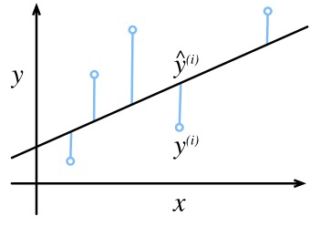
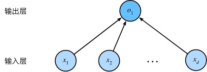

# 动深-3-线性神经网络
[toc]
## 3.1. 线性回归
回归（regression）是能为一个或多个自变量与因变量之间关系建模的一类方法。 在自然科学和社会科学领域，回归经常用来表示输入和输出之间的关系。

在机器学习领域中的大多数任务通常都与预测（prediction）有关。 当我们想预测一个数值时，就会涉及到回归问题。 
### 3.1.1. 线性回归的基本元素
线性回归（linear regression）可以追溯到19世纪初， 它在回归的各种标准工具中最简单而且最流行。 线性回归基于几个简单的假设： 首先，假设自变量 𝐱 和因变量 𝑦 之间的关系是线性的， 即 𝑦 可以表示为 𝐱 中元素的加权和，这里通常允许包含观测值的一些噪声； 其次，我们假设任何噪声都比较正常，如噪声遵循正态分布。

#### 3.1.1.1. 线性模型
线性假设是指目标（房屋价格）可以表示为特征（面积和房龄）的加权和，如下面的式子：

```math
price= w_{\mathrm{area}} \cdot \mathrm{area} + w_{\mathrm{age}} \cdot \mathrm{age} + b.
```
中的 𝑤area 和 𝑤age  称为权重（weight），权重决定了每个特征对我们预测值的影响。  𝑏 称为偏置（bias）、偏移量（offset）或截距（intercept）。 偏置是指当所有特征都取值为0时，预测值应该为多少。 即使现实中不会有任何房子的面积是0或房龄正好是0年，我们仍然需要偏置项。 如果没有偏置项，我们模型的表达能力将受到限制。

而在机器学习领域，我们通常使用的是高维数据集，建模时采用线性代数表示法会比较方便。 当我们的输入包含 𝑑 个特征时，我们将预测结果 𝑦̂   （通常使用“尖角”符号表示 𝑦 的估计值）表示为：
```math
\hat{y} = w_1  x_1 + ... + w_d  x_d + b.
```

在开始寻找最好的模型参数（model parameters） 𝐰 和 𝑏 之前， 我们还需要两个东西： （1）一种模型质量的度量方式； （2）一种能够更新模型以提高模型预测质量的方法。

#### 3.1.1.2. 损失函数
在我们开始考虑如何用模型拟合（fit）数据之前，我们需要确定一个拟合程度的度量。 损失函数（loss function）能够量化目标的实际值与预测值之间的差距。 通常我们会选择非负数作为损失，且数值越小表示损失越小，完美预测时的损失为0。 回归问题中最常用的损失函数是平方误差函数。 当样本 𝑖 的预测值为 𝑦̂ (𝑖) ，其相应的真实标签为 𝑦(𝑖) 时， 平方误差可以定义为以下公式：
```math
l^{(i)}(\mathbf{w}, b) = \frac{1}{2} \left(\hat{y}^{(i)} - y^{(i)}\right)^2.
```


由于平方误差函数中的二次方项， 估计值 𝑦̂ (𝑖) 和观测值 𝑦(𝑖) 之间较大的差异将导致更大的损失。 为了度量模型在整个数据集上的质量，我们需计算在训练集 𝑛 个样本上的损失均值（也等价于求和）。
```math
L(\mathbf{w}, b) =\frac{1}{n}\sum_{i=1}^n l^{(i)}(\mathbf{w}, b) =\frac{1}{n} \sum_{i=1}^n \frac{1}{2}\left(\mathbf{w}^\top \mathbf{x}^{(i)} + b - y^{(i)}\right)^2.
```

在训练模型时，我们希望寻找一组参数（ 𝐰∗,𝑏∗ ）， 这组参数能最小化在所有训练样本上的总损失。如下式：
```math
\mathbf{w}^*, b^* = \operatorname*{argmin}_{\mathbf{w}, b}\  L(\mathbf{w}, b).
```

#### 3.1.1.3. 解析解
线性回归刚好是一个很简单的优化问题。 与我们将在本书中所讲到的其他大部分模型不同，线性回归的解可以用一个公式简单地表达出来， 这类解叫作解析解（analytical solution）。

像线性回归这样的简单问题存在解析解，但并不是所有的问题都存在解析解。 解析解可以进行很好的数学分析，但解析解对问题的限制很严格，导致它无法广泛应用在深度学习里。

#### 3.1.1.4. 随机梯度下降
即使在我们无法得到解析解的情况下，我们仍然可以有效地训练模型。 在许多任务上，那些难以优化的模型效果要更好。 因此，弄清楚如何训练这些难以优化的模型是非常重要的。

本书中我们用到一种名为梯度下降（gradient descent）的方法， 这种方法几乎可以优化所有深度学习模型。 它通过不断地在损失函数递减的方向上更新参数来降低误差。

梯度下降最简单的用法是计算损失函数（数据集中所有样本的损失均值） 关于模型参数的导数（在这里也可以称为梯度）。 但实际中的执行可能会非常慢：因为在每一次更新参数之前，我们必须遍历整个数据集。 因此，我们通常会在每次需要计算更新的时候随机抽取一小批样本， 这种变体叫做小批量随机梯度下降（minibatch stochastic gradient descent）。

算法的步骤如下： （1）初始化模型参数的值，如随机初始化； （2）从数据集中随机抽取小批量样本且在负梯度的方向上更新参数，并不断迭代这一步骤。 对于平方损失和仿射变换，我们可以明确地写成如下形式:

在训练了预先确定的若干迭代次数后（或者直到满足某些其他停止条件后）， 我们记录下模型参数的估计值，表示为 𝐰̂ ,𝑏̂  。 但是，即使我们的函数确实是线性的且无噪声，这些估计值也不会使损失函数真正地达到最小值。 因为算法会使得损失向最小值缓慢收敛，但却不能在有限的步数内非常精确地达到最小值。

线性回归恰好是一个在整个域中只有一个最小值的学习问题。 但是对于像深度神经网络这样复杂的模型来说，损失平面上通常包含多个最小值。 深度学习实践者很少会去花费大力气寻找这样一组参数，使得在训练集上的损失达到最小。 事实上，更难做到的是找到一组参数，这组参数能够在我们从未见过的数据上实现较低的损失， 这一挑战被称为泛化（generalization）。

### 3.1.2. 矢量化加速
在训练我们的模型时，我们经常希望能够同时处理整个小批量的样本。 为了实现这一点，需要我们对计算进行矢量化， 从而利用线性代数库，而不是在Python中编写开销高昂的for循环。

为了说明矢量化为什么如此重要，我们考虑对向量相加的两种方法。 我们实例化两个全为1的10000维向量。 在一种方法中，我们将使用Python的for循环遍历向量； 在另一种方法中，我们将依赖对+的调用。

```
c = tf.Variable(tf.zeros(n))
timer = Timer()
for i in range(n):
    c[i].assign(a[i] + b[i])
f'{timer.stop():.5f} sec'

'5.05647 sec'

timer.start()
d = a + b
f'{timer.stop():.5f} sec'

'0.00037 sec'
```

结果很明显，第二种方法比第一种方法快得多。 矢量化代码通常会带来数量级的加速。 另外，我们将更多的数学运算放到库中，而无须自己编写那么多的计算，从而减少了出错的可能性。

### 3.1.4. 从线性回归到深度网络
#### 3.1.4.1. 神经网络图
深度学习从业者喜欢绘制图表来可视化模型中正在发生的事情。我们将线性回归模型描述为一个神经网络。 需要注意的是，该图只显示连接模式，即只显示每个输入如何连接到输出，隐去了权重和偏置的值。




由于模型重点在发生计算的地方，所以通常我们在计算层数时不考虑输入层。 也就是说， 图中神经网络的层数为1。 我们可以将线性回归模型视为仅由单个人工神经元组成的神经网络，或称为单层神经网络。

对于线性回归，每个输入都与每个输出（在本例中只有一个输出）相连， 我们将这种变换 称为全连接层（fully-connected layer）或称为稠密层（dense layer）。

## 3.2 线性回归的从零开始实现
https://trickygo.github.io/Dive-into-DL-TensorFlow2.0/#/chapter03_DL-basics/3.2_linear-regression-scratch


## 3.3. 线性回归的简洁实现
https://trickygo.github.io/Dive-into-DL-TensorFlow2.0/#/chapter03_DL-basics/3.3_linear-regression-tensorflow2.0


## 3.6softmax回归从零开始实现
https://trickygo.github.io/Dive-into-DL-TensorFlow2.0/#/chapter03_DL-basics/3.6_softmax-regression-scratch

## 3.7 softmax回归的简洁实现

https://trickygo.github.io/Dive-into-DL-TensorFlow2.0/#/chapter03_DL-basics/3.7_softmax-regression-tensorflow2.0

## 3.13dropout简介实现
输出层的计算无法过度依赖h1,…,h5中的任一个，从而在训练模型时起到正则化的作用，并可以用来应对过拟合。

```
model = keras.Sequential([
    keras.layers.Flatten(input_shape=(28, 28)),
    keras.layers.Dense(256,activation='relu'),
    Dropout(0.2),
    keras.layers.Dense(256,activation='relu'),
    Dropout(0.5),
    keras.layers.Dense(10,activation=tf.nn.softmax)
])

model.compile(optimizer=tf.keras.optimizers.Adam(),
              loss = 'sparse_categorical_crossentropy',
              metrics=['accuracy'])
model.fit(x_train,y_train,epochs=5,batch_size=256,validation_data=(x_test, y_test),
                    validation_freq=1)

```

## 3.15 数值稳定性和模型初始化
### 3.15.1 衰减和爆炸
当神经网络的层数较多时，模型的数值稳定性容易变差。
举个例子，假设输入和所有层的权重参数都是标量，如权重参数为0.2和5，多层感知机的第30层输出为输入XX分别与0.2^30≈1×10^−21（衰减）和5^30≈9×10^20（爆炸）的乘积。类似地，当层数较多时，梯度的计算也更容易出现衰减或爆炸。
### 3.15.2 随机初始化模型参数
假设输出层只保留一个输出单元o1（删去o2和o3以及指向它们的箭头），且隐藏层使用相同的激活函数。如果将每个隐藏单元的参数都初始化为相等的值，那么在正向传播时每个隐藏单元将根据相同的输入计算出相同的值，并传递至输出层。在反向传播中，每个隐藏单元的参数梯度值相等。因此，这些参数在使用基于梯度的优化算法迭代后值依然相等。之后的迭代也是如此。在这种情况下，无论隐藏单元有多少，隐藏层本质上只有1个隐藏单元在发挥作用。因此，正如在前面的实验中所做的那样，我们通常将神经网络的模型参数，特别是权重参数，进行随机初始化。

### 3.15.2.1 Tensorflow2.0的默认随机初始化
随机初始化模型参数的方法有很多。在3.3节（线性回归的简洁实现）中，我们使用kernel_initializer=init.RandomNormal(stddev=0.01)使模型model的权重参数采用正态分布的随机初始化方式。不过，Tensorflow中initializers的模块参数都采取了较为合理的初始化策略（不同类型的layer具体采样的哪一种初始化方法的可参考源代码），因此一般不用我们考虑。

### 3.15.2.2 Xavier随机初始化
还有一种比较常用的随机初始化方法叫作Xavier随机初始化[1]。 假设某全连接层的输入个数为aa，输出个数为bb，Xavier随机初始化将使该层中权重参数的每个元素都随机采样于均匀分布

它的设计主要考虑到，模型参数初始化后，每层输出的方差不该受该层输入个数影响，且每层梯度的方差也不该受该层输出个数影响。
### 小结
深度模型有关数值稳定性的典型问题是衰减和爆炸。当神经网络的层数较多时，模型的数值稳定性容易变差。
我们通常需要随机初始化神经网络的模型参数，如权重参数。

## 3.16 实战Kaggle比赛：房价预测
实战里面讲述了如何处理pd数据，如何进行k折验证。非常有参考价值。
https://trickygo.github.io/Dive-into-DL-TensorFlow2.0/#/chapter03_DL-basics/3.16_kaggle-house-price