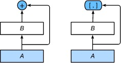

# 动深-5-卷积神经网络

## 5.1 二维卷积层
卷积神经网络（convolutional neural network）是含有卷积层（convolutional layer）的神经网络。
### 5.1.1 二维互相关运算
虽然卷积层得名于卷积（convolution）运算，但我们通常在卷积层中使用更加直观的互相关（cross-correlation）运算。在二维卷积层中，一个二维输入数组和一个二维核（kernel）数组通过互相关运算输出一个二维数组。

卷积核窗口（又称卷积窗口）的形状取决于卷积核的高和宽，即2×22×2。图5.1中的阴影部分为第一个输出元素及其计算所使用的输入和核数组元素：0×0+1×1+3×2+4×3=190×0+1×1+3×2+4×3=19。


在二维互相关运算中，卷积窗口从输入数组的最左上方开始，按从左往右、从上往下的顺序，依次在输入数组上滑动。当卷积窗口滑动到某一位置时，窗口中的输入子数组与核数组按元素相乘并求和，得到输出数组中相应位置的元素。

下面我们将上述过程实现在corr2d函数里。它接受输入数组X与核数组K，并输出数组Y。
```
def corr2d(X, K):
    h, w = K.shape
    Y = tf.Variable(tf.zeros((X.shape[0] - h + 1, X.shape[1] - w +1)))
    for i in range(Y.shape[0]):
        for j in range(Y.shape[1]):
            Y[i,j].assign(tf.cast(tf.reduce_sum(X[i:i+h, j:j+w] * K), dtype=tf.float32))
    return Y
```
我们可以构造图5.1中的输入数组X、核数组K来验证二维互相关运算的输出。
```
X = tf.constant([[0,1,2], [3,4,5], [6,7,8]])
K = tf.constant([[0,1], [2,3]])
corr2d(X, K)

<tf.Variable 'Variable:0' shape=(2, 2) dtype=float32, numpy=
array([[19., 25.],
       [37., 43.]], dtype=float32)>

```
### 5.1.2 二维卷积层
二维卷积层将输入和卷积核做互相关运算，并加上一个标量偏差来得到输出。卷积层的模型参数包括了卷积核和标量偏差。在训练模型的时候，通常我们先对卷积核随机初始化，然后不断迭代卷积核和偏差。

下面基于corr2d函数来实现一个自定义的二维卷积层。在构造函数__init__里我们声明weight和bias这两个模型参数。前向计算函数forward则是直接调用corr2d函数再加上偏差。

```
class Conv2D(tf.keras.layers.Layer):
    def __init__(self, units):
        super().__init__()
        self.units = units

    def build(self, kernel_size):
        self.w = self.add_weight(name='w',
                                shape=kernel_size,
                                initializer=tf.random_normal_initializer())
        self.b = self.add_weight(name='b',
                                shape=(1,),
                                initializer=tf.random_normal_initializer())
    def call(self, inputs):
        return corr2d(inputs, self.w) + self.b

```

### 5.1.3 图像中物体边缘检测
下面我们来看一个卷积层的简单应用：检测图像中物体的边缘，即找到像素变化的位置。首先我们构造一张6×86×8的图像（即高和宽分别为6像素和8像素的图像）。它中间4列为黑（0），其余为白（1）。

```
X = tf.Variable(tf.ones((6,8)))
X[:, 2:6].assign(tf.zeros(X[:,2:6].shape))
X

<tf.Variable 'Variable:0' shape=(6, 8) dtype=float32, numpy=
array([[1., 1., 0., 0., 0., 0., 1., 1.],
       [1., 1., 0., 0., 0., 0., 1., 1.],
       [1., 1., 0., 0., 0., 0., 1., 1.],
       [1., 1., 0., 0., 0., 0., 1., 1.],
       [1., 1., 0., 0., 0., 0., 1., 1.],
       [1., 1., 0., 0., 0., 0., 1., 1.]], dtype=float32)>

K = tf.constant([[1,-1]], dtype = tf.float32)

Y = corr2d(X, K)
Y

<tf.Variable 'Variable:0' shape=(6, 7) dtype=float32, numpy=
array([[ 0.,  1.,  0.,  0.,  0., -1.,  0.],
       [ 0.,  1.,  0.,  0.,  0., -1.,  0.],
       [ 0.,  1.,  0.,  0.,  0., -1.,  0.],
       [ 0.,  1.,  0.,  0.,  0., -1.,  0.],
       [ 0.,  1.,  0.,  0.,  0., -1.,  0.],
       [ 0.,  1.,  0.,  0.,  0., -1.,  0.]], dtype=float32)>
```
然后我们构造一个高和宽分别为1和2的卷积核K。当它与输入做互相关运算时，如果横向相邻元素相同，输出为0；否则输出为非0。

下面将输入X和我们设计的卷积核K做互相关运算。可以看出，我们将从白到黑的边缘和从黑到白的边缘分别检测成了1和-1。其余部分的输出全是0。

由此，我们可以看出，卷积层可通过重复使用卷积核有效地表征局部空间。

### 5.1.4 通过数据学习核数组
最后我们来看一个例子，它使用物体边缘检测中的输入数据X和输出数据Y来学习我们构造的核数组K。我们首先构造一个卷积层，将其卷积核初始化成随机数组。接下来在每一次迭代中，我们使用平方误差来比较Y和卷积层的输出，然后计算梯度来更新权重。简单起见，这里的卷积层忽略了偏差。

虽然我们之前构造了Conv2D类，但由于corr2d使用了对单个元素赋值（[i, j]=）的操作因而无法自动求梯度。下面我们使用tf.keras.layers提供的Conv2D类来实现这个例子。
```
# 二维卷积层使用4维输入输出，格式为(样本, 高, 宽, 通道)，这里批量大小（批量中的样本数）和通道数均为1
X = tf.reshape(X, (1,6,8,1))
Y = tf.reshape(Y, (1,6,7,1))
Y

# 构造一个输出通道数为1（将在“多输入通道和多输出通道”一节介绍通道），核数组形状是(1, 2)的二维卷积层
conv2d = tf.keras.layers.Conv2D(1, (1,2))
#input_shape = (samples, rows, cols, channels)
# Y = conv2d(X)
Y.shape

TensorShape([1, 6, 7, 1])

Y_hat = conv2d(X)
for i in range(10):
    with tf.GradientTape(watch_accessed_variables=False) as g:
        g.watch(conv2d.weights[0])
        Y_hat = conv2d(X)
        l = (abs(Y_hat - Y)) ** 2
        dl = g.gradient(l, conv2d.weights[0])
        lr = 3e-2
        update = tf.multiply(lr, dl)
        updated_weights = conv2d.get_weights()
        updated_weights[0] = conv2d.weights[0] - update
        conv2d.set_weights(updated_weights)  

        if (i + 1)% 2 == 0:
            print('batch %d, loss %.3f' % (i + 1, tf.reduce_sum(l)))

batch 2, loss 0.235
batch 4, loss 0.041
batch 6, loss 0.008
batch 8, loss 0.002
batch 10, loss 0.000

```
可以看到，10次迭代后误差已经降到了一个比较小的值。现在来看一下学习到的核数组。
```
tf.reshape(conv2d.get_weights()[0],(1,2))

<tf.Tensor: id=1012, shape=(1, 2), dtype=float32, numpy=array([[ 0.99903595, -0.9960023 ]], dtype=float32)>

```

### 5.1.5 互相关运算和卷积运算
实际上，卷积运算与互相关运算类似。为了得到卷积运算的输出，我们只需将核数组左右翻转并上下翻转，再与输入数组做互相关运算。可见，卷积运算和互相关运算虽然类似，但如果它们使用相同的核数组，对于同一个输入，输出往往并不相同。

设其他条件不变，使用卷积运算学出的核数组即图5.1中的核数组按上下、左右翻转。也就是说，图5.1中的输入与学出的已翻转的核数组再做卷积运算时，依然得到图5.1中的输出。为了与大多数深度学习文献一致，如无特别说明，本书中提到的卷积运算均指互相关运算。

### 5.1.6 特征图和感受野
二维卷积层输出的二维数组可以看作是输入在空间维度（宽和高）上某一级的表征，也叫特征图（feature map）。影响元素xx的前向计算的所有可能输入区域（可能大于输入的实际尺寸）叫做xx的感受野（receptive field）。

## 5.2 填充和步幅
在上一节的例子里，我们使用高和宽为3的输入与高和宽为2的卷积核得到高和宽为2的输出。一般来说，假设输入形状是nh×nw，卷积核窗口形状是kh×kw，那么输出形状将会是
所以卷积层的输出形状由输入形状和卷积核窗口形状决定。本节我们将介绍卷积层的两个超参数，即填充和步幅。它们可以对给定形状的输入和卷积核改变输出形状。
### 5.2.1 填充
填充（padding）是指在输入高和宽的两侧填充元素（通常是0元素）。


一般来说，如果在高的两侧一共填充p行，在宽的两侧一共填充p列，那么输出形状将会是

在很多情况下，我们会设置p=k−1来使输入和输出具有相同的高和宽。

### 5.2.2 步幅
在上一节里我们介绍了二维互相关运算。卷积窗口从输入数组的最左上方开始，按从左往右、从上往下的顺序，依次在输入数组上滑动。我们将每次滑动的行数和列数称为步幅（stride）。

目前我们看到的例子里，在高和宽两个方向上步幅均为1。我们也可以使用更大步幅。图5.3展示了在高上步幅为3、在宽上步幅为2的二维互相关运算。


```
conv2d = tf.keras.layers.Conv2D(1, kernel_size=3, padding='same',strides=2)
comp_conv2d(conv2d, X).shape

TensorShape([4, 4])

```

## 5.3 多输入通道和多输出通道
前面两节里我们用到的输入和输出都是二维数组，但真实数据的维度经常更高。例如，彩色图像在高和宽2个维度外还有RGB（红、绿、蓝）3个颜色通道。假设彩色图像的高和宽分别是hh和ww（像素），那么它可以表示为一个3×h×w3×h×w的多维数组。我们将大小为3的这一维称为通道（channel）维。本节我们将介绍含多个输入通道或多个输出通道的卷积核。
### 5.3.1 多输入通道
当输入数据含多个通道时，我们需要构造一个输入通道数与输入数据的通道数相同的卷积核，从而能够与含多通道的输入数据做互相关运算。


接下来我们实现含多个输入通道的互相关运算。我们只需要对每个通道做互相关运算，然后进行累加。
```
def corr2d_multi_in(X, K):
    return tf.reduce_sum([corr2d(X[i], K[i]) for i in range(X.shape[0])],axis=0)

X = tf.constant([[[0,1,2],[3,4,5],[6,7,8]],
                 [[1,2,3],[4,5,6],[7,8,9]]])
K = tf.constant([[[0,1],[2,3]],
                 [[1,2],[3,4]]])

corr2d_multi_in(X, K)

<tf.Tensor: id=145, shape=(2, 2), dtype=float32, numpy=
array([[ 56.,  72.],
       [104., 120.]], dtype=float32)>

```
### 5.3.2 多输出通道
**看下一节的图**


### 5.3.3 1x1 卷积层
最后我们讨论卷积窗口形状为1×11×1（kh=kw=1）的多通道卷积层。我们通常称之为1×11×1卷积层，并将其中的卷积运算称为1×11×1卷积。因为使用了最小窗口，1×11×1卷积失去了卷积层可以识别高和宽维度上相邻元素构成的模式的功能。实际上，1×11×1卷积的主要计算发生在通道维上。


```
def corr2d_multi_in_out_1x1(X, K):
    c_i, h, w = X.shape
    c_o = K.shape[0]
    X = tf.reshape(X,(c_i, h * w))
    K = tf.reshape(K,(c_o, c_i))
    Y = tf.matmul(K, X)
    return tf.reshape(Y, (c_o, h, w))

X = tf.random.uniform((3,3,3))
K = tf.random.uniform((2,3,1,1))

Y1 = corr2d_multi_in_out_1x1(X, K)
Y2 = corr2d_multi_in_out(X, K)

tf.norm(Y1-Y2) < 1e-6


<tf.Tensor: id=1392, shape=(), dtype=bool, numpy=True>

```
在之后的模型里我们将会看到1×11×1卷积层被当作保持高和宽维度形状不变的全连接层使用。于是，我们可以通过调整网络层之间的通道数来控制模型复杂度。

## 5.4 池化层
实际图像里，我们感兴趣的物体不会总出现在固定位置：即使我们连续拍摄同一个物体也极有可能出现像素位置上的偏移。这会导致同一个边缘对应的输出可能出现在卷积输出Y中的不同位置，进而对后面的模式识别造成不便。

在本节中我们介绍池化（pooling）层，它的提出是为了缓解**卷积层对位置的过度敏感性**。

### 5.4.1 二维最大池化层和平均池化层
同卷积层一样，池化层每次对输入数据的一个固定形状窗口（又称池化窗口）中的元素计算输出。不同于卷积层里计算输入和核的互相关性，池化层直接计算池化窗口内元素的最大值或者平均值。该运算也分别叫做最大池化或平均池化。在二维最大池化中，池化窗口从输入数组的最左上方开始，按从左往右、从上往下的顺序，依次在输入数组上滑动。当池化窗口滑动到某一位置时，窗口中的输入子数组的最大值即输出数组中相应位置的元素。


让我们再次回到本节开始提到的物体边缘检测的例子。现在我们将卷积层的输出作为2×22×2最大池化的输入。设该卷积层输入是X、池化层输出为Y。无论是X[i, j]和X[i, j+1]值不同，还是X[i, j+1]和X[i, j+2]不同，池化层输出均有Y[i, j]=1。也就是说，使用2×22×2最大池化层时，只要卷积层识别的模式在高和宽上移动不超过一个元素，我们依然可以将它检测出来。

```
def pool2d(X, pool_size, mode='max'):
    p_h, p_w = pool_size
    Y = tf.zeros((X.shape[0] - p_h + 1, X.shape[1] - p_w +1))
    Y = tf.Variable(Y)
    for i in range(Y.shape[0]):
        for j in range(Y.shape[1]):
            if mode == 'max':
                Y[i,j].assign(tf.reduce_max(X[i:i+p_h, j:j+p_w]))
            elif mode =='avg':
                Y[i,j].assign(tf.reduce_mean(X[i:i+p_h, j:j+p_w]))
    return Y

X = tf.constant([[0,1,2],[3,4,5],[6,7,8]],dtype=tf.float32)
pool2d(X, (2,2))

<tf.Variable 'Variable:0' shape=(2, 2) dtype=float32, numpy=
array([[4., 5.],
       [7., 8.]], dtype=float32)>
       
pool2d(X, (2,2), 'avg')

<tf.Variable 'Variable:0' shape=(2, 2) dtype=float32, numpy=
array([[2., 3.],
       [5., 6.]], dtype=float32)>


```

### 5.4.2 填充和步幅
同卷积层一样，池化层也可以在输入的高和宽两侧的填充并调整窗口的移动步幅来改变输出形状。池化层填充和步幅与卷积层填充和步幅的工作机制一样。我们将通过nn模块里的二维最大池化层MaxPool2D来演示池化层填充和步幅的工作机制。我们先构造一个形状为(1, 1, 4, 4)的输入数据，前两个维度分别是批量和通道。

注：tensorflow默认数据类型为'channels_last'，所以这里使用(1,4,4,1)而不是(1,1,4,4)

```
#tensorflow default data_format == 'channels_last'
#so (1,4,4,1) instead of (1,1,4,4)
X = tf.reshape(tf.constant(range(16)), (1,4,4,1))
X

<tf.Tensor: id=112, shape=(1, 4, 4, 1), dtype=int32, numpy=
array([[[[ 0],
         [ 1],
         [ 2],
         [ 3]],

        [[ 4],
         [ 5],
         [ 6],
         [ 7]],

        [[ 8],
         [ 9],
         [10],
         [11]],

        [[12],
         [13],
         [14],
         [15]]]])>
```
默认情况下，MaxPool2D实例里步幅和池化窗口形状相同。下面使用形状为(3, 3)的池化窗口，默认获得形状为(3, 3)的步幅。
```
默认情况下，MaxPool2D实例里步幅和池化窗口形状相同。下面使用形状为(3, 3)的池化窗口，默认获得形状为(3, 3)的步幅。

<tf.Tensor: id=113, shape=(1, 1, 1, 1), dtype=int32, numpy=array([[[[10]]]])>

# tensorflow 中 padding 有 same 和 valid 两种， same 会在窗口大小不满足时填充0，valid 会舍弃即不填充
# one of "valid" or "same" (case-insensitive). "valid" means no padding. "same" results in padding evenly to the left/right or up/down of the input such that output has the same height/width dimension as the input

pool2d = tf.keras.layers.MaxPool2D(pool_size=[3,3],padding='same',strides=2)
pool2d(X)

<tf.Tensor: id=114, shape=(1, 2, 2, 1), dtype=int32, numpy=
array([[[[10],
         [11]],

        [[14],
         [15]]]])>
```

### 5.4.3 多通道
在处理多通道输入数据时，池化层对每个输入通道分别池化，而不是像卷积层那样将各通道的输入按通道相加。这意味着池化层的输出通道数与输入通道数相等。下面将数组X和X+1在通道维上连结来构造通道数为2的输入。
```
X = tf.concat([X, X+1], axis=3)
X.shape

TensorShape([1, 4, 4, 2])

pool2d = tf.keras.layers.MaxPool2D(3, padding='same', strides=2)
pool2d(X)

<tf.Tensor: shape=(1, 2, 2, 2), dtype=int32, numpy=
array([[[[10, 11],
         [11, 12]],

        [[14, 15],
         [15, 16]]]])>
```

## 5.5 卷积神经网络（LeNet）
在 3.9 节（“多层感知机的从零开始实现”）一节里我们构造了一个含单隐藏层的多层感知机模型来对Fashion-MNIST数据集中的图像进行分类。每张图像高和宽均是28像素。我们将图像中的像素逐行展开，得到长度为784的向量，并输入进全连接层中。然而，这种分类方法有一定的局限性。

1. 图像在同一列邻近的像素在这个向量中可能相距较远。它们构成的模式可能难以被模型识别。
2. 对于大尺寸的输入图像，使用全连接层容易导致模型过大。假设输入是高和宽均为1,0001,000像素的彩色照片（含3个通道）。即使全连接层输出个数仍是256，该层权重参数的形状也是3,000,000×2563,000,000×256：它占用了大约3 GB的内存或显存。这会带来过于复杂的模型和过高的存储开销。
 
卷积层尝试解决这两个问题。一方面，卷积层保留输入形状，使图像的像素在高和宽两个方向上的相关性均可能被有效识别；另一方面，卷积层通过滑动窗口将同一卷积核与不同位置的输入重复计算，从而避免参数尺寸过大。

卷积神经网络就是含卷积层的网络。本节里我们将介绍一个早期用来识别手写数字图像的卷积神经网络：LeNet 。这个名字来源于LeNet论文的第一作者Yann LeCun。LeNet展示了通过梯度下降训练卷积神经网络可以达到手写数字识别在当时最先进的结果。这个奠基性的工作第一次将卷积神经网络推上舞台，为世人所知。

### 5.5.1 LeNet模型
LeNet分为卷积层块和全连接层块两个部分。

卷积层块里的基本单位是卷积层后接最大池化层：卷积层用来识别图像里的空间模式，如线条和物体局部，之后的最大池化层则用来降低卷积层对位置的敏感性。卷积层块由两个这样的基本单位重复堆叠构成。在卷积层块中，每个卷积层都使用5×55×5的窗口，并在输出上使用sigmoid激活函数。第一个卷积层输出通道数为6，第二个卷积层输出通道数则增加到16。这是因为第二个卷积层比第一个卷积层的输入的高和宽要小，所以增加输出通道使两个卷积层的参数尺寸类似。卷积层块的两个最大池化层的窗口形状均为2×22×2，且步幅为2。由于池化窗口与步幅形状相同，池化窗口在输入上每次滑动所覆盖的区域互不重叠。

卷积层块的输出形状为(批量大小, 通道, 高, 宽)。当卷积层块的输出传入全连接层块时，全连接层块会将小批量中每个样本变平（flatten）。也就是说，全连接层的输入形状将变成二维，其中第一维是小批量中的样本，第二维是每个样本变平后的向量表示，且向量长度为通道、高和宽的乘积。全连接层块含3个全连接层。它们的输出个数分别是120、84和10，其中10为输出的类别个数。

下面我们通过Sequential类来实现LeNet模型。
```
net = tf.keras.models.Sequential([
    tf.keras.layers.Conv2D(filters=6,kernel_size=5,activation='sigmoid',input_shape=(28,28,1)),
    tf.keras.layers.MaxPool2D(pool_size=2, strides=2),
    tf.keras.layers.Conv2D(filters=16,kernel_size=5,activation='sigmoid'),
    tf.keras.layers.MaxPool2D(pool_size=2, strides=2),
    tf.keras.layers.Flatten(),
    tf.keras.layers.Dense(120,activation='sigmoid'),
    tf.keras.layers.Dense(84,activation='sigmoid'),
    tf.keras.layers.Dense(10,activation='sigmoid')
])

```
接下来我们构造一个高和宽均为28的单通道数据样本，并逐层进行前向计算来查看每个层的输出形状。
```
X = tf.random.uniform((1,28,28,1))
for layer in net.layers:
    X = layer(X)
    print(layer.name, 'output shape\t', X.shape)

conv2d output shape     (1, 24, 24, 6)
max_pooling2d output shape     (1, 12, 12, 6)
conv2d_1 output shape     (1, 8, 8, 16)
max_pooling2d_1 output shape     (1, 4, 4, 16)
flatten output shape     (1, 256)
dense output shape     (1, 120)
dense_1 output shape     (1, 84)
dense_2 output shape     (1, 10)

```
可以看到，在卷积层块中输入的高和宽在逐层减小。卷积层由于使用高和宽均为5的卷积核，从而将高和宽分别减小4，而池化层则将高和宽减半，但通道数则从1增加到16。全连接层则逐层减少输出个数，直到变成图像的类别数10。

### 5.5.2 获取数据和训练模型
```
fashion_mnist = tf.keras.datasets.fashion_mnist

(train_images, train_labels), (test_images, test_labels) = fashion_mnist.load_data()

train_images = tf.reshape(train_images, (train_images.shape[0],train_images.shape[1],train_images.shape[2], 1))
print(train_images.shape)

test_images = tf.reshape(test_images, (test_images.shape[0],test_images.shape[1],test_images.shape[2], 1))

(60000, 28, 28, 1)

optimizer = tf.keras.optimizers.SGD(learning_rate=0.9, momentum=0.0, nesterov=False)

net.compile(optimizer=optimizer,
              loss='sparse_categorical_crossentropy',
              metrics=['accuracy'])

net.fit(train_images, train_labels, epochs=5, validation_split=0.1)


Train on 54000 samples, validate on 6000 samples
Epoch 1/5
54000/54000 [==============================] - 13s 238us/sample - loss: 1.4932 - accuracy: 0.4121 - val_loss: 0.8236 - val_accuracy: 0.6315
Epoch 2/5
54000/54000 [==============================] - 12s 229us/sample - loss: 0.6498 - accuracy: 0.7406 - val_loss: 0.5940 - val_accuracy: 0.7680
Epoch 3/5
54000/54000 [==============================] - 12s 221us/sample - loss: 0.5609 - accuracy: 0.7768 - val_loss: 0.5362 - val_accuracy: 0.7817
Epoch 4/5
54000/54000 [==============================] - 13s 233us/sample - loss: 0.5213 - accuracy: 0.7965 - val_loss: 0.5622 - val_accuracy: 0.7907
Epoch 5/5
54000/54000 [==============================] - 12s 225us/sample - loss: 0.4913 - accuracy: 0.8093 - val_loss: 0.5753 - val_accuracy: 0.7737

net.evaluate(test_images, test_labels, verbose=2)

10000/1 - 1s - loss: 0.5165 - accuracy: 0.7527

```

## 5.6 深度卷积神经网络（AlexNet）
在LeNet提出后的将近20年里，神经网络一度被其他机器学习方法超越，如支持向量机。虽然LeNet可以在早期的小数据集上取得好的成绩，但是在更大的真实数据集上的表现并不尽如人意。

神经网络可以直接基于图像的原始像素进行分类。这种称为端到端（end-to-end）的方法节省了很多中间步骤。然而，在很长一段时间里更流行的是研究者通过勤劳与智慧所设计并生成的手工特征。这类图像分类研究的主要流程是：
1. 获取图像数据集；
2. 使用已有的特征提取函数生成图像的特征；
3. 使用机器学习模型对图像的特征分类。

如果跟计算机视觉研究者交谈，则是另外一幅景象。他们会告诉你图像识别里“不可告人”的现实是：计算机视觉流程中真正重要的是数据和特征。也就是说，使用较干净的数据集和较有效的特征甚至比机器学习模型的选择对图像分类结果的影响更大。

### 学习特征表示
我们已经提到，在相当长的时间里，特征都是基于各式各样手工设计的函数从数据中提取的。事实上，不少研究者通过提出新的特征提取函数不断改进图像分类结果。这一度为计算机视觉的发展做出了重要贡献。

另一些研究者则持异议。他们认为特征本身也应该由学习得来。他们还相信，为了表征足够复杂的输入，特征本身应该分级表示。持这一想法的研究者相信，多层神经网络可能可以学得数据的多级表征，并逐级表示越来越抽象的概念或模式。

在多层神经网络中，图像的第一级的表示可以是在特定的位置和⻆度是否出现边缘；而第二级的表示说不定能够将这些边缘组合出有趣的模式，如花纹；在第三级的表示中，也许上一级的花纹能进一步汇合成对应物体特定部位的模式。这样逐级表示下去，最终，模型能够较容易根据最后一级的表示完成分类任务。需要强调的是，输入的逐级表示由多层模型中的参数决定，而这些参数都是学出来的。

尽管一直有一群执着的研究者不断钻研，试图学习视觉数据的逐级表征，然而很长一段时间里这些野心都未能实现。这其中有诸多因素值得我们一一分析。

#### 缺失要素一：数据
包含许多特征的深度模型需要大量的有标签的数据才能表现得比其他经典方法更好。限于早期计算机有限的存储和90年代有限的研究预算，大部分研究只基于小的公开数据集。2009年诞生的ImageNet数据集包含了1,000大类物体，每类有多达数千张不同的图像。这一规模是当时其他公开数据集无法与之相提并论的。

#### 缺失要素二：硬件
深度学习对计算资源要求很高。早期的硬件计算能力有限，这使训练较复杂的神经网络变得很困难。

### AlexNet
AlexNet使用了8层卷积神经网络，并以很大的优势赢得了ImageNet 2012图像识别挑战赛。它首次证明了学习到的特征可以超越手工设计的特征，从而一举打破计算机视觉研究的前状。

AlexNet与LeNet的设计理念非常相似，但也有显著的区别。

第一，与相对较小的LeNet相比，AlexNet包含8层变换，其中有5层卷积和2层全连接隐藏层，以及1个全连接输出层。下面我们来详细描述这些层的设计。

AlexNet第一层中的卷积窗口形状是11×1111×11。因为ImageNet中绝大多数图像的高和宽均比MNIST图像的高和宽大10倍以上，ImageNet图像的物体占用更多的像素，所以需要更大的卷积窗口来捕获物体。第二层中的卷积窗口形状减小到5×55×5，之后全采用3×33×3。此外，第一、第二和第五个卷积层之后都使用了窗口形状为3×33×3、步幅为2的最大池化层。而且，AlexNet使用的卷积通道数也大于LeNet中的卷积通道数数十倍。

紧接着最后一个卷积层的是两个输出个数为4096的全连接层。这两个巨大的全连接层带来将近1 GB的模型参数。由于早期显存的限制，最早的AlexNet使用双数据流的设计使一个GPU只需要处理一半模型。

第二，AlexNet将sigmoid激活函数改成了更加简单的ReLU激活函数。一方面，ReLU激活函数的计算更简单，例如它并没有sigmoid激活函数中的求幂运算。另一方面，ReLU激活函数在不同的参数初始化方法下使模型更容易训练。这是由于当sigmoid激活函数输出极接近0或1时，这些区域的梯度几乎为0，从而造成反向传播无法继续更新部分模型参数；而ReLU激活函数在正区间的梯度恒为1。因此，若模型参数初始化不当，sigmoid函数可能在正区间得到几乎为0的梯度，从而令模型无法得到有效训练。

第三，AlexNet通过丢弃法（参见“丢弃法”一节）来控制全连接层的模型复杂度。而LeNet并没有使用丢弃法。

第四，AlexNet引入了大量的图像增广，如翻转、裁剪和颜色变化，从而进一步扩大数据集来缓解过拟合。我们将在后面的“图像增广”一节详细介绍这种方法。

简化过的AlexNet。
```
import tensorflow as tf
print(tf.__version__)

for gpu in tf.config.experimental.list_physical_devices('GPU'):
    tf.config.experimental.set_memory_growth(gpu, True)
    
net = tf.keras.models.Sequential([
    tf.keras.layers.Conv2D(filters=96,kernel_size=11,strides=4,activation='relu'),
    tf.keras.layers.MaxPool2D(pool_size=3, strides=2),
    tf.keras.layers.Conv2D(filters=256,kernel_size=5,padding='same',activation='relu'),
    tf.keras.layers.MaxPool2D(pool_size=3, strides=2),
    tf.keras.layers.Conv2D(filters=384,kernel_size=3,padding='same',activation='relu'),
    tf.keras.layers.Conv2D(filters=384,kernel_size=3,padding='same',activation='relu'),
    tf.keras.layers.Conv2D(filters=256,kernel_size=3,padding='same',activation='relu'),
    tf.keras.layers.MaxPool2D(pool_size=3, strides=2),
    tf.keras.layers.Flatten(),
    tf.keras.layers.Dense(4096,activation='relu'),
    tf.keras.layers.Dropout(0.5),
    tf.keras.layers.Dense(4096,activation='relu'),
    tf.keras.layers.Dropout(0.5),
    tf.keras.layers.Dense(10,activation='sigmoid')
])

```
我们构造一个高和宽均为224的单通道数据样本来观察每一层的输出形状。
```
X = tf.random.uniform((1,224,224,1))
for layer in net.layers:
    X = layer(X)
    print(layer.name, 'output shape\t', X.shape)

conv2d output shape     (1, 54, 54, 96)
max_pooling2d output shape     (1, 26, 26, 96)
conv2d_1 output shape     (1, 26, 26, 256)
max_pooling2d_1 output shape     (1, 12, 12, 256)
conv2d_2 output shape     (1, 12, 12, 384)
conv2d_3 output shape     (1, 12, 12, 384)
conv2d_4 output shape     (1, 12, 12, 256)
max_pooling2d_2 output shape     (1, 5, 5, 256)
flatten output shape     (1, 6400)
dense output shape     (1, 4096)
dropout output shape     (1, 4096)
dense_1 output shape     (1, 4096)
dropout_1 output shape     (1, 4096)
dense_2 output shape     (1, 10)
```

### 训练
因为ImageNet数据集训练时间较长，我们仍用前面的Fashion-MNIST数据集来演示AlexNet。读取数据的时候我们额外做了一步将图像高和宽扩大到AlexNet使用的图像高和宽224。这个可以通过tf.image.resize_with_pad来实现。
```
import numpy as np

class DataLoader():
    def __init__(self):
        fashion_mnist = tf.keras.datasets.fashion_mnist
        (self.train_images, self.train_labels), (self.test_images, self.test_labels) = fashion_mnist.load_data()
        self.train_images = np.expand_dims(self.train_images.astype(np.float32)/255.0,axis=-1)
        self.test_images = np.expand_dims(self.test_images.astype(np.float32)/255.0,axis=-1)
        self.train_labels = self.train_labels.astype(np.int32)
        self.test_labels = self.test_labels.astype(np.int32)
        self.num_train, self.num_test = self.train_images.shape[0], self.test_images.shape[0]

    def get_batch_train(self, batch_size):
        index = np.random.randint(0, np.shape(self.train_images)[0], batch_size)
        #need to resize images to (224,224)
        resized_images = tf.image.resize_with_pad(self.train_images[index],224,224,)
        return resized_images.numpy(), self.train_labels[index]

    def get_batch_test(self, batch_size):
        index = np.random.randint(0, np.shape(self.test_images)[0], batch_size)
        #need to resize images to (224,224)
        resized_images = tf.image.resize_with_pad(self.test_images[index],224,224,)
        return resized_images.numpy(), self.test_labels[index]

batch_size = 128
dataLoader = DataLoader()
x_batch, y_batch = dataLoader.get_batch_train(batch_size)
print("x_batch shape:",x_batch.shape,"y_batch shape:", y_batch.shape)

def train_alexnet():
    epoch = 5
    num_iter = dataLoader.num_train//batch_size
    for e in range(epoch):
        for n in range(num_iter):
            x_batch, y_batch = dataLoader.get_batch_train(batch_size)
            net.fit(x_batch, y_batch)
            if n%20 == 0:
                net.save_weights("5.6_alexnet_weights.h5")

optimizer = tf.keras.optimizers.SGD(learning_rate=0.01, momentum=0.0, nesterov=False)

net.compile(optimizer=optimizer,
              loss='sparse_categorical_crossentropy',
              metrics=['accuracy'])

x_batch, y_batch = dataLoader.get_batch_train(batch_size)
net.fit(x_batch, y_batch)
# train_alexnet()

net.load_weights("5.6_alexnet_weights.h5")

x_test, y_test = dataLoader.get_batch_test(2000)
net.evaluate(x_test, y_test, verbose=2)


```


### 小结
- AlexNet跟LeNet结构类似，但使用了更多的卷积层和更大的参数空间来拟合大规模数据集ImageNet。它是浅层神经网络和深度神经网络的分界线。
- 虽然看上去AlexNet的实现比LeNet的实现也就多了几行代码而已，但这个观念上的转变和真正优秀实验结果的产生令学术界付出了很多年。

## 5.7 使用重复元素的网络（VGG）
AlexNet在LeNet的基础上增加了3个卷积层。但AlexNet作者对它们的卷积窗口、输出通道数和构造顺序均做了大量的调整。虽然AlexNet指明了深度卷积神经网络可以取得出色的结果，但并没有提供简单的规则以指导后来的研究者如何设计新的网络。

**本节介绍VGG，它的名字来源于论文作者所在的实验室Visual Geometry Group [1]。VGG提出了可以通过重复使用简单的基础块来构建深度模型的思路。**

### VGG块
VGG块的组成规律是：连续使用数个相同的填充为1、窗口形状为3×33×3的卷积层后接上一个步幅为2、窗口形状为2×22×2的最大池化层。卷积层保持输入的高和宽不变，而池化层则对其减半。我们使用vgg_block函数来实现这个基础的VGG块，它可以指定卷积层的数量num_convs和输出通道数num_channels。

```
import tensorflow as tf
print(tf.__version__)

for gpu in tf.config.experimental.list_physical_devices('GPU'):
    tf.config.experimental.set_memory_growth(gpu, True)

def vgg_block(num_convs, num_channels):
    blk = tf.keras.models.Sequential()
    for _ in range(num_convs):
        blk.add(tf.keras.layers.Conv2D(num_channels,kernel_size=3,
                                    padding='same',activation='relu'))

    blk.add(tf.keras.layers.MaxPool2D(pool_size=2, strides=2))
    return blk

```

### VGG网络
与AlexNet和LeNet一样，VGG网络由卷积层模块后接全连接层模块构成。卷积层模块串联数个vgg_block，其超参数由变量conv_arch定义。该变量指定了每个VGG块里卷积层个数和输出通道数。全连接模块则跟AlexNet中的一样。

现在我们构造一个VGG网络。它有5个卷积块，前2块使用单卷积层，而后3块使用双卷积层。第一块的输出通道是64，之后每次对输出通道数翻倍，直到变为512。因为这个网络使用了8个卷积层和3个全连接层，所以经常被称为VGG-11。

```
conv_arch = ((1, 64), (1, 128), (2, 256), (2, 512), (2, 512))

def vgg(conv_arch):
    net = tf.keras.models.Sequential()
    for (num_convs, num_channels) in conv_arch:
        net.add(vgg_block(num_convs,num_channels))
    net.add(tf.keras.models.Sequential([tf.keras.layers.Flatten(),
             tf.keras.layers.Dense(4096,activation='relu'),
             tf.keras.layers.Dropout(0.5),
             tf.keras.layers.Dense(4096,activation='relu'),
             tf.keras.layers.Dropout(0.5),
             tf.keras.layers.Dense(10,activation='sigmoid')]))
    return net

net = vgg(conv_arch)

X = tf.random.uniform((1,224,224,1))
for blk in net.layers:
    X = blk(X)
    print(blk.name, 'output shape:\t', X.shape)

sequential_1 output shape:     (1, 112, 112, 64)
sequential_2 output shape:     (1, 56, 56, 128)
sequential_3 output shape:     (1, 28, 28, 256)
sequential_4 output shape:     (1, 14, 14, 512)
sequential_5 output shape:     (1, 7, 7, 512)
sequential_6 output shape:     (1, 10)

```
可以看到，每次我们将输入的高和宽减半，直到最终高和宽变成7后传入全连接层。与此同时，输出通道数每次翻倍，直到变成512。因为每个卷积层的窗口大小一样，所以每层的模型参数尺寸和计算复杂度与输入高、输入宽、输入通道数和输出通道数的乘积成正比。VGG这种高和宽减半以及通道翻倍的设计使得多数卷积层都有相同的模型参数尺寸和计算复杂度。

### 小结
VGG-11通过5个可以重复使用的卷积块来构造网络。根据每块里卷积层个数和输出通道数的不同可以定义出不同的VGG模型。

## 5.8 网络中的网络（NiN）
本节我们介绍网络中的网络（NiN）[1]。它提出了另外一个思路，即串联多个由卷积层和“全连接”层构成的小网络来构建一个深层网络。

### NiN块
卷积层的输入和输出通常是四维数组（样本，通道，高，宽），而全连接层的输入和输出则通常是二维数组（样本，特征）。如果想在全连接层后再接上卷积层，则需要将全连接层的输出变换为四维。NiN使用1×11×1卷积层来替代全连接层，从而使空间信息能够自然传递到后面的层中去。


NiN块是NiN中的基础块。它由一个卷积层加两个充当全连接层的1×11×1卷积层串联而成。其中第一个卷积层的超参数可以自行设置，而第二和第三个卷积层的超参数一般是固定的。

```
import tensorflow as tf
print(tf.__version__)

for gpu in tf.config.experimental.list_physical_devices('GPU'):
    tf.config.experimental.set_memory_growth(gpu, True)

def nin_block(num_channels, kernel_size, strides, padding):
    blk = tf.keras.models.Sequential()
    blk.add(tf.keras.layers.Conv2D(num_channels, kernel_size,
                                   strides=strides, padding=padding, activation='relu')) 
    blk.add(tf.keras.layers.Conv2D(num_channels, kernel_size=1,activation='relu')) 
    blk.add(tf.keras.layers.Conv2D(num_channels, kernel_size=1,activation='relu'))    
    return blk

```

### NiN模型
NiN是在AlexNet问世不久后提出的。它们的卷积层设定有类似之处。NiN使用卷积窗口形状分别为11×1111×11、5×55×5和3×33×3的卷积层，相应的输出通道数也与AlexNet中的一致。每个NiN块后接一个步幅为2、窗口形状为3×33×3的最大池化层。

除使用NiN块以外，NiN还有一个设计与AlexNet显著不同：NiN去掉了AlexNet最后的3个全连接层，取而代之地，NiN使用了输出通道数等于标签类别数的NiN块，然后使用全局平均池化层对每个通道中所有元素求平均并直接用于分类。NiN的这个设计的好处是可以显著减小模型参数尺寸，从而缓解过拟合。然而，该设计有时会造成获得有效模型的训练时间的增加。

```
net = tf.keras.models.Sequential()
net.add(nin_block(96, kernel_size=11, strides=4, padding='valid'))
net.add(tf.keras.layers.MaxPool2D(pool_size=3, strides=2))
net.add(nin_block(256, kernel_size=5, strides=1, padding='same'))
net.add(tf.keras.layers.MaxPool2D(pool_size=3, strides=2))
net.add(nin_block(384, kernel_size=3, strides=1, padding='same'))
net.add(tf.keras.layers.MaxPool2D(pool_size=3, strides=2))
net.add(tf.keras.layers.Dropout(0.5))
net.add(nin_block(10, kernel_size=3, strides=1, padding='same'))
net.add(tf.keras.layers.GlobalAveragePooling2D())
net.add(tf.keras.layers.Flatten())


```
### 小结

- NiN重复使用由卷积层和代替全连接层的1×11×1卷积层构成的NiN块来构建深层网络。
- NiN去除了容易造成过拟合的全连接输出层，而是将其替换成输出通道数等于标签类别数的NiN块和全局平均池化层。
- NiN的以上设计思想影响了后面一系列卷积神经网络的设计。

## 5.9 含并行连结的网络（GoogLeNet）
GoogLeNet吸收了NiN中网络串联网络的思想，并在此基础上做了很大改进。在随后的几年里，研究人员对GoogLeNet进行了数次改进，本节将介绍这个模型系列的第一个版本。

### Inception 块
GoogLeNet中的基础卷积块叫作Inception块，得名于同名电影《盗梦空间》（Inception）。


Inception块里有4条并行的线路。前3条线路使用窗口大小分别是1×11×1、3×33×3和5×55×5的卷积层来抽取不同空间尺寸下的信息，其中中间2个线路会对输入先做1×11×1卷积来减少输入通道数，以降低模型复杂度。第四条线路则使用3×33×3最大池化层，后接1×11×1卷积层来改变通道数。4条线路都使用了合适的填充来使输入与输出的高和宽一致。最后我们将每条线路的输出在通道维上连结，并输入接下来的层中去。

Inception块中可以自定义的超参数是每个层的输出通道数，我们以此来控制模型复杂度。
```
import tensorflow as tf
print(tf.__version__)

for gpu in tf.config.experimental.list_physical_devices('GPU'):
    tf.config.experimental.set_memory_growth(gpu, True)

class Inception(tf.keras.layers.Layer):
    def __init__(self,c1, c2, c3, c4):
        super().__init__()
        # 线路1，单1 x 1卷积层
        self.p1_1 = tf.keras.layers.Conv2D(c1, kernel_size=1, activation='relu', padding='same')
        # 线路2，1 x 1卷积层后接3 x 3卷积层
        self.p2_1 = tf.keras.layers.Conv2D(c2[0], kernel_size=1, padding='same', activation='relu')
        self.p2_2 = tf.keras.layers.Conv2D(c2[1], kernel_size=3, padding='same',
                              activation='relu')
        # 线路3，1 x 1卷积层后接5 x 5卷积层
        self.p3_1 = tf.keras.layers.Conv2D(c3[0], kernel_size=1, padding='same', activation='relu')
        self.p3_2 = tf.keras.layers.Conv2D(c3[1], kernel_size=5, padding='same',
                              activation='relu')
        # 线路4，3 x 3最大池化层后接1 x 1卷积层
        self.p4_1 = tf.keras.layers.MaxPool2D(pool_size=3, padding='same', strides=1)
        self.p4_2 = tf.keras.layers.Conv2D(c4, kernel_size=1, padding='same', activation='relu')

    def call(self, x):
        p1 = self.p1_1(x)
        p2 = self.p2_2(self.p2_1(x))
        p3 = self.p3_2(self.p3_1(x))
        p4 = self.p4_2(self.p4_1(x))
        return tf.concat([p1, p2, p3, p4], axis=-1)  # 在通道维上连结输出

Inception(64, (96, 128), (16, 32), 32)

```
### GoogLeNet模型
GoogLeNet跟VGG一样，在主体卷积部分中使用5个模块（block），每个模块之间使用步幅为2的3×33×3最大池化层来减小输出高宽。第一模块使用一个64通道的7×7卷积层。

第二模块使用2个卷积层：首先是64通道的1×11×1卷积层，然后是将通道增大3倍的3×33×3卷积层。它对应Inception块中的第二条线路。

第三模块串联2个完整的Inception块。第一个Inception块的输出通道数为64+128+32+32=256，其中4条线路的输出通道数比例为64:128:32:32=2:4:1:1。其中第二、第三条线路先分别将输入通道数减小至96/192=1/296/192=1/2和16/192=1/1216/192=1/12后，再接上第二层卷积层。第二个Inception块输出通道数增至128+192+96+64=480，每条线路的输出通道数之比为128:192:96:64=4:6:3:2。其中第二、第三条线路先分别将输入通道数减小至128/256=1/2和32/256=1/8。

第四模块更加复杂。它串联了5个Inception块，其输出通道数分别是192+208+48+64=512\、160+224+64+64=512、128+256+64+64=512、112+288+64+64=528和256+320+128+128=832。这些线路的通道数分配和第三模块中的类似，首先含3×3卷积层的第二条线路输出最多通道，其次是仅含1×1卷积层的第一条线路，之后是含5×5卷积层的第三条线路和含3×3最大池化层的第四条线路。其中第二、第三条线路都会先按比例减小通道数。这些比例在各个Inception块中都略有不同。

第五模块有输出通道数为256+320+128+128=832和384+384+128+128=1024的两个Inception块。其中每条线路的通道数的分配思路和第三、第四模块中的一致，只是在具体数值上有所不同。需要注意的是，第五模块的后面紧跟输出层，该模块同NiN一样使用全局平均池化层来将每个通道的高和宽变成1。最后我们将输出变成二维数组后接上一个输出个数为标签类别数的全连接层。
```
b1 = tf.keras.models.Sequential()
b1.add(tf.keras.layers.Conv2D(64, kernel_size=7, strides=2, padding='same', activation='relu'))
b1.add(tf.keras.layers.MaxPool2D(pool_size=3, strides=2, padding='same'))

b2 = tf.keras.models.Sequential()
b2.add(tf.keras.layers.Conv2D(64, kernel_size=1, padding='same', activation='relu'))
b2.add(tf.keras.layers.Conv2D(192, kernel_size=3, padding='same', activation='relu'))
b2.add(tf.keras.layers.MaxPool2D(pool_size=3, strides=2, padding='same'))

b3 = tf.keras.models.Sequential()
b3.add(Inception(64, (96, 128), (16, 32), 32))
b3.add(Inception(128, (128, 192), (32, 96), 64))
b3.add(tf.keras.layers.MaxPool2D(pool_size=3, strides=2, padding='same'))

b4 = tf.keras.models.Sequential()
b4.add(Inception(192, (96, 208), (16, 48), 64))
b4.add(Inception(160, (112, 224), (24, 64), 64))
b4.add(Inception(128, (128, 256), (24, 64), 64))
b4.add(Inception(112, (144, 288), (32, 64), 64))
b4.add(Inception(256, (160, 320), (32, 128), 128))
b4.add(tf.keras.layers.MaxPool2D(pool_size=3, strides=2, padding='same'))

b5 = tf.keras.models.Sequential()
b5.add(Inception(256, (160, 320), (32, 128), 128))
b5.add(Inception(384, (192, 384), (48, 128), 128))
b5.add(tf.keras.layers.GlobalAvgPool2D())

net = tf.keras.models.Sequential([b1, b2, b3, b4, b5, tf.keras.layers.Dense(10)])

X = tf.random.uniform(shape=(1, 96, 96, 1))
for layer in net.layers:
    X = layer(X)
    print(layer.name, 'output shape:\t', X.shape)


sequential output shape:     (1, 24, 24, 64)
sequential_1 output shape:     (1, 12, 12, 192)
sequential_2 output shape:     (1, 6, 6, 480)
sequential_3 output shape:     (1, 3, 3, 832)
sequential_4 output shape:     (1, 1024)
dense output shape:     (1, 10)

```
### 训练
https://trickygo.github.io/Dive-into-DL-TensorFlow2.0/#/chapter05_CNN/5.9_googlenet?id=_59-%e5%90%ab%e5%b9%b6%e8%a1%8c%e8%bf%9e%e7%bb%93%e7%9a%84%e7%bd%91%e7%bb%9c%ef%bc%88googlenet%ef%bc%89

### 小结
- Inception块相当于一个有4条线路的子网络。它通过不同窗口形状的卷积层和最大池化层来并行抽取信息，并使用1×11×1卷积层减少通道数从而降低模型复杂度。
- GoogLeNet将多个设计精细的Inception块和其他层串联起来。其中Inception块的通道数分配之比是在ImageNet数据集上通过大量的实验得来的。
- GoogLeNet和它的后继者们一度是ImageNet上最高效的模型之一：在类似的测试精度下，它们的计算复杂度往往更低。

## 5.10 批量归一化
批量归一化（batch normalization）层，它能让较深的神经网络的训练变得更加容易 。我们对输入数据做了标准化处理：处理后的任意一个特征在数据集中所有样本上的均值为0、标准差为1。标准化处理输入数据使各个特征的分布相近：这往往更容易训练出有效的模型。

通常来说，数据标准化预处理对于浅层模型就足够有效了。随着模型训练的进行，当每层中参数更新时，靠近输出层的输出较难出现剧烈变化。但对深层神经网络来说，即使输入数据已做标准化，训练中模型参数的更新依然很容易造成靠近输出层输出的剧烈变化。这种计算数值的不稳定性通常令我们难以训练出有效的深度模型。

批量归一化的提出正是为了应对深度模型训练的挑战。在模型训练时，批量归一化利用小批量上的均值和标准差，不断调整神经网络中间输出，从而使整个神经网络在各层的中间输出的数值更稳定。批量归一化和下一节将要介绍的残差网络为训练和设计深度模型提供了两类重要思路。

### 5.10.1 批量归一化层
对全连接层和卷积层做批量归一化的方法稍有不同。
#### 5.10.1.1. 对全连接层做批量归一化
我们先考虑如何对全连接层做批量归一化。通常，我们将批量归一化层置于全连接层中的仿射变换和激活函数之间。设全连接层的输入为uu，权重参数和偏差参数分别为WW和bb，，激活函数为ϕ。设批量归一化的运算符为BNBN。那么，使用批量归一化的全连接层的输出为：ϕ(BN(x)),其中批量归一化输入由xx仿射变换
x=Wu+b得到。


#### 5.10.1.2. 对卷积层做批量归一化
对卷积层来说，批量归一化发生在卷积计算之后、应用激活函数之前。如果卷积计算输出多个通道，我们需要对这些通道的输出分别做批量归一化，且每个通道都拥有独立的拉伸和偏移参数，并均为标量。设小批量中有 m个样本。在单个通道上，假设卷积计算输出的高和宽分别为 p和 q 。我们需要对该通道中 m×p×q个元素同时做批量归一化。对这些元素做标准化计算时，我们使用相同的均值和方差，即该通道中 m×p×q个元素的均值和方差。

#### 5.10.1.3. 预测时的批量归一化
使用批量归一化训练时，我们可以将批量大小设得大一点，从而使批量内样本的均值和方差的计算都较为准确。将训练好的模型用于预测时，我们希望模型对于任意输入都有确定的输出。因此，单个样本的输出不应取决于批量归一化所需要的随机小批量中的均值和方差。一种常用的方法是通过移动平均估算整个训练数据集的样本均值和方差，并在预测时使用它们得到确定的输出。可见，和丢弃层一样，批量归一化层在训练模式和预测模式下的计算结果也是不一样的。

### 5.10.2. 从零开始实现
下面我们通过numpy中的ndarray来实现批量归一化层。
```
def batch_norm(is_training,X, gamma, beta, moving_mean, moving_var, eps, momentum):
    # 判断是当前模式是训练模式还是预测模式
    if not is_training:
        # 如果是在预测模式下，直接使用传入的移动平均所得的均值和方差
        X_hat = (X - moving_mean) / np.sqrt(moving_var + eps)
    else:
        assert len(X.shape) in (2, 4)
        if len(X.shape) == 2:
            # 使用全连接层的情况，计算特征维上的均值和方差
            mean = X.mean(axis=0)
            var = ((X - mean) ** 2).mean(axis=0)
        else:
            # 使用二维卷积层的情况，计算通道维上（axis=1）的均值和方差。这里我们需要保持
            # X的形状以便后面可以做广播运算
            mean = X.mean(axis=(0, 2, 3), keepdims=True)
            var = ((X - mean) ** 2).mean(axis=(0, 2, 3), keepdims=True)
        # 训练模式下用当前的均值和方差做标准化
        X_hat = (X - mean) / np.sqrt(var + eps)
        # 更新移动平均的均值和方差
        moving_mean = momentum * moving_mean + (1.0 - momentum) * mean
        moving_var = momentum * moving_var + (1.0 - momentum) * var
    Y = gamma * X_hat + beta  # 拉伸和偏移
    return Y, moving_mean, moving_var

```
接下来，我们自定义一个BatchNorm层。它保存参与求梯度和迭代的拉伸参数gamma和偏移参数beta，同时也维护移动平均得到的均值和方差，以便能够在模型预测时被使用。BatchNorm实例所需指定的num_features参数对于全连接层来说应为输出个数，对于卷积层来说则为输出通道数。该实例所需指定的num_dims参数对于全连接层和卷积层来说分别为2和4。
```
class BatchNormalization(tf.keras.layers.Layer):
    def __init__(self, decay=0.9, epsilon=1e-5, **kwargs):
        self.decay = decay
        self.epsilon = epsilon
        super(BatchNormalization, self).__init__(**kwargs)

    def build(self, input_shape):
        self.gamma = self.add_weight(name='gamma',
                                     shape=[input_shape[-1], ],
                                     initializer=tf.initializers.ones,
                                     trainable=True)
        self.beta = self.add_weight(name='beta',
                                    shape=[input_shape[-1], ],
                                    initializer=tf.initializers.zeros,
                                    trainable=True)
        self.moving_mean = self.add_weight(name='moving_mean',
                                           shape=[input_shape[-1], ],
                                           initializer=tf.initializers.zeros,
                                           trainable=False)
        self.moving_variance = self.add_weight(name='moving_variance',
                                               shape=[input_shape[-1], ],
                                               initializer=tf.initializers.ones,
                                               trainable=False)
        super(BatchNormalization, self).build(input_shape)

    def assign_moving_average(self, variable, value):
        """
        variable = variable * decay + value * (1 - decay)
        """
        delta = variable * self.decay + value * (1 - self.decay)
        return variable.assign(delta)

    @tf.function
    def call(self, inputs, training):
        if training:
            batch_mean, batch_variance = tf.nn.moments(inputs, list(range(len(inputs.shape) - 1)))
            mean_update = self.assign_moving_average(self.moving_mean, batch_mean)
            variance_update = self.assign_moving_average(self.moving_variance, batch_variance)
            self.add_update(mean_update)
            self.add_update(variance_update)
            mean, variance = batch_mean, batch_variance
        else:
            mean, variance = self.moving_mean, self.moving_variance
        output = tf.nn.batch_normalization(inputs,
                                           mean=mean,
                                           variance=variance,
                                           offset=self.beta,
                                           scale=self.gamma,
                                           variance_epsilon=self.epsilon)
        return output

    def compute_output_shape(self, input_shape):
        return input_shape

```

#### 5.10.2.1. 使用批量归一化层的LeNet
```
net = tf.keras.models.Sequential(
    [tf.keras.layers.Conv2D(filters=6,kernel_size=5),
    BatchNormalization(),
    tf.keras.layers.Activation('sigmoid'),
    tf.keras.layers.MaxPool2D(pool_size=2, strides=2),
    tf.keras.layers.Conv2D(filters=16,kernel_size=5),
    BatchNormalization(),
    tf.keras.layers.Activation('sigmoid'),
    tf.keras.layers.MaxPool2D(pool_size=2, strides=2),
    tf.keras.layers.Flatten(),
    tf.keras.layers.Dense(120),
    BatchNormalization(),
    tf.keras.layers.Activation('sigmoid'),
    tf.keras.layers.Dense(84),
    BatchNormalization(),
    tf.keras.layers.Activation('sigmoid'),
    tf.keras.layers.Dense(10,activation='sigmoid')]
)

```

### 5.10.3 简洁实现
与我们刚刚自己定义的BatchNorm类相比，keras中layers模块定义的BatchNorm类使用起来更加简单。它不需要指定自己定义的BatchNorm类中所需的num_features和num_dims参数值。在keras中，这些参数值都将通过延后初始化而自动获取。下面我们用keras实现使用批量归一化的LeNet。
```
net = tf.keras.models.Sequential()
net.add(tf.keras.layers.Conv2D(filters=6,kernel_size=5))
net.add(tf.keras.layers.BatchNormalization())
net.add(tf.keras.layers.Activation('sigmoid'))
net.add(tf.keras.layers.MaxPool2D(pool_size=2, strides=2))
net.add(tf.keras.layers.Conv2D(filters=16,kernel_size=5))
net.add(tf.keras.layers.BatchNormalization())
net.add(tf.keras.layers.Activation('sigmoid'))
net.add(tf.keras.layers.MaxPool2D(pool_size=2, strides=2))
net.add(tf.keras.layers.Flatten())
net.add(tf.keras.layers.Dense(120))
net.add(tf.keras.layers.BatchNormalization())
net.add(tf.keras.layers.Activation('sigmoid'))
net.add(tf.keras.layers.Dense(84))
net.add(tf.keras.layers.BatchNormalization())
net.add(tf.keras.layers.Activation('sigmoid'))
net.add(tf.keras.layers.Dense(10,activation='sigmoid'))

(x_train, y_train), (x_test, y_test) = tf.keras.datasets.mnist.load_data()
x_train = x_train.reshape((60000, 28, 28, 1)).astype('float32') / 255
x_test = x_test.reshape((10000, 28, 28, 1)).astype('float32') / 255

net.compile(loss='sparse_categorical_crossentropy',
              optimizer=tf.keras.optimizers.RMSprop(),
              metrics=['accuracy'])
history = net.fit(x_train, y_train,
                    batch_size=64,
                    epochs=5,
                    validation_split=0.2)
test_scores = net.evaluate(x_test, y_test, verbose=2)
print('Test loss:', test_scores[0])
print('Test accuracy:', test_scores[1])

Train on 48000 samples, validate on 12000 samples
Epoch 1/5
48000/48000 [==============================] - 27s 553us/sample - loss: 0.0383 - accuracy: 0.9877 - val_loss: 0.1457 - val_accuracy: 0.9581
Epoch 2/5
48000/48000 [==============================] - 25s 511us/sample - loss: 0.0342 - accuracy: 0.9890 - val_loss: 0.1359 - val_accuracy: 0.9613
Epoch 3/5
48000/48000 [==============================] - 22s 467us/sample - loss: 0.0296 - accuracy: 0.9907 - val_loss: 0.1943 - val_accuracy: 0.9402
Epoch 4/5
48000/48000 [==============================] - 23s 476us/sample - loss: 0.0285 - accuracy: 0.9910 - val_loss: 0.7860 - val_accuracy: 0.8291
Epoch 5/5
48000/48000 [==============================] - 23s 478us/sample - loss: 0.0234 - accuracy: 0.9927 - val_loss: 0.0897 - val_accuracy: 0.9732
10000/1 - 1s - loss: 0.0416 - accuracy: 0.9726
Test loss: 0.08218458472136408
Test accuracy: 0.9726

```
### 小结
- 在模型训练时，批量归一化利用小批量上的均值和标准差，不断调整神经网络的中间输出，从而使整个神经网络在各层的中间输出的数值更稳定。
- 对全连接层和卷积层做批量归一化的方法稍有不同。
- 批量归一化层和丢弃层一样，在训练模式和预测模式的计算结果是不一样的。
- keras提供的BatchNorm类使用起来简单、方便。

## 5.11 残差网络（ResNet）
让我们先思考一个问题：对神经网络模型添加新的层，充分训练后的模型是否只可能更有效地降低训练误差？理论上，原模型解的空间只是新模型解的空间的子空间。

由于新模型可能得出更优的解来拟合训练数据集，因此添加层似乎更容易降低训练误差。然而在实践中，添加过多的层后训练误差往往不降反升。即使利用批量归一化带来的数值稳定性使训练深层模型更加容易，该问题仍然存在。针对这一问题，何恺明等人提出了残差网络（ResNet） [1]。它在2015年的ImageNet图像识别挑战赛夺魁，并深刻影响了后来的深度神经网络的设计。

### 5.11.1 残差块
设我们希望学出的理想映射为f(x)f(x)，从而作为图5.9上方激活函数的输入。左图虚线框中的部分需要直接拟合出该映射f(x)f(x)，而右图虚线框中的部分则需要拟合出有关恒等映射的残差映射f(x)−xf(x)−x。残差映射在实际中往往更容易优化。

以本节开头提到的恒等映射作为我们希望学出的理想映射f(x)f(x)。我们只需将图5.9中右图虚线框内上方的加权运算（如仿射）的权重和偏差参数学成0，那么f(x)f(x)即为恒等映射。实际中，当理想映射f(x)f(x)极接近于恒等映射时，残差映射也易于捕捉恒等映射的细微波动。图5.9右图也是ResNet的基础块，即残差块（residual block）。在残差块中，输入可通过跨层的数据线路更快地向前传播。


ResNet沿用了VGG全3×3卷积层的设计。残差块里首先有2个有相同输出通道数的3×3卷积层。每个卷积层后接一个批量归一化层和ReLU激活函数。然后我们将输入跳过这两个卷积运算后直接加在最后的ReLU激活函数前。这样的设计要求两个卷积层的输出与输入形状一样，从而可以相加。如果想改变通道数，就需要引入一个额外的1×1卷积层来将输入变换成需要的形状后再做相加运算。

残差块的实现如下。它可以设定输出通道数、是否使用额外的1×11×1卷积层来修改通道数以及卷积层的步幅。

```
import tensorflow as tf
from tensorflow.keras import layers,activations
class Residual(tf.keras.Model):
    def __init__(self, num_channels, use_1x1conv=False, strides=1, **kwargs):
        super(Residual, self).__init__(**kwargs)
        self.conv1 = layers.Conv2D(num_channels,
                                   padding='same',
                                   kernel_size=3,
                                   strides=strides)
        self.conv2 = layers.Conv2D(num_channels, kernel_size=3,padding='same')
        if use_1x1conv:
            self.conv3 = layers.Conv2D(num_channels,
                                       kernel_size=1,
                                       strides=strides)
        else:
            self.conv3 = None
        self.bn1 = layers.BatchNormalization()
        self.bn2 = layers.BatchNormalization()

    def call(self, X):
        Y = activations.relu(self.bn1(self.conv1(X)))
        Y = self.bn2(self.conv2(Y))
        if self.conv3:
            X = self.conv3(X)
        return activations.relu(Y + X)

# 下面我们来查看输入和输出形状一致的情况。
blk = Residual(3)
#tensorflow input shpe     (n_images, x_shape, y_shape, channels).
#mxnet.gluon.nn.conv_layers    (batch_size, in_channels, height, width) 
X = tf.random.uniform((4, 6, 6 , 3))
blk(X).shape#TensorShape([4, 6, 6, 3])
```

### 5.11.2 ResNet模型
ResNet的前两层跟之前介绍的GoogLeNet中的一样：在输出通道数为64、步幅为2的7×77×7卷积层后接步幅为2的3×33×3的最大池化层。不同之处在于ResNet每个卷积层后增加的批量归一化层。

```
net = tf.keras.models.Sequential(
    [layers.Conv2D(64, kernel_size=7, strides=2, padding='same'),
    layers.BatchNormalization(), layers.Activation('relu'),
    layers.MaxPool2D(pool_size=3, strides=2, padding='same')])

```
一个模块的通道数同输入通道数一致。由于之前已经使用了步幅为2的最大池化层，所以无须减小高和宽。之后的每个模块在第一个残差块里将上一个模块的通道数翻倍，并将高和宽减半。

下面我们来实现这个模块。注意，这里对第一个模块做了特别处理。
```
class ResnetBlock(tf.keras.layers.Layer):
    def __init__(self,num_channels, num_residuals, first_block=False,**kwargs):
        super(ResnetBlock, self).__init__(**kwargs)
        self.listLayers=[]
        for i in range(num_residuals):
            if i == 0 and not first_block:
                self.listLayers.append(Residual(num_channels, use_1x1conv=True, strides=2))
            else:
                self.listLayers.append(Residual(num_channels))      

    def call(self, X):
        for layer in self.listLayers.layers:
            X = layer(X)
        return X
        
class ResNet(tf.keras.Model):
    def __init__(self,num_blocks,**kwargs):
        super(ResNet, self).__init__(**kwargs)
        self.conv=layers.Conv2D(64, kernel_size=7, strides=2, padding='same')
        self.bn=layers.BatchNormalization()
        self.relu=layers.Activation('relu')
        self.mp=layers.MaxPool2D(pool_size=3, strides=2, padding='same')
        self.resnet_block1=ResnetBlock(64,num_blocks[0], first_block=True)
        self.resnet_block2=ResnetBlock(128,num_blocks[1])
        self.resnet_block3=ResnetBlock(256,num_blocks[2])
        self.resnet_block4=ResnetBlock(512,num_blocks[3])
        self.gap=layers.GlobalAvgPool2D()
        self.fc=layers.Dense(units=10,activation=tf.keras.activations.softmax)

    def call(self, x):
        x=self.conv(x)
        x=self.bn(x)
        x=self.relu(x)
        x=self.mp(x)
        x=self.resnet_block1(x)
        x=self.resnet_block2(x)
        x=self.resnet_block3(x)
        x=self.resnet_block4(x)
        x=self.gap(x)
        x=self.fc(x)
        return x

mynet=ResNet([2,2,2,2])

```
这里每个模块里有4个卷积层（不计算 1×1卷积层），加上最开始的卷积层和最后的全连接层，共计18层。这个模型通常也被称为ResNet-18。通过配置不同的通道数和模块里的残差块数可以得到不同的ResNet模型，例如更深的含152层的ResNet-152。虽然ResNet的主体架构跟GoogLeNet的类似，但ResNet结构更简单，修改也更方便。这些因素都导致了ResNet迅速被广泛使用。 在训练ResNet之前，我们来观察一下输入形状在ResNet不同模块之间的变化。
```
X = tf.random.uniform(shape=(1,  224, 224 , 1))
for layer in mynet.layers:
    X = layer(X)
    print(layer.name, 'output shape:\t', X.shape)

conv2d_6 output shape:     (1, 112, 112, 64)
batch_normalization_5 output shape:     (1, 112, 112, 64)
activation_1 output shape:     (1, 112, 112, 64)
max_pooling2d_1 output shape:     (1, 56, 56, 64)
resnet_block output shape:     (1, 56, 56, 64)
resnet_block_1 output shape:     (1, 28, 28, 128)
resnet_block_2 output shape:     (1, 14, 14, 256)
resnet_block_3 output shape:     (1, 7, 7, 512)
global_average_pooling2d output shape:     (1, 512)
dense output shape:     (1, 10)

```

## 5.12 稠密连接网络（DenseNet）
ResNet中的跨层连接设计引申出了数个后续工作。本节我们介绍其中的一个：稠密连接网络（DenseNet）。


与ResNet的主要区别在于，DenseNet里模块B的输出不是像ResNet那样和模块A的输出相加，而是在通道维上连结。这样模块A的输出可以直接传入模块B后面的层。在这个设计里，模块A直接跟模块B后面的所有层连接在了一起。这也是它被称为“稠密连接”的原因。

DenseNet的主要构建模块是稠密块（dense block）和过渡层（transition layer）。前者定义了输入和输出是如何连结的，后者则用来控制通道数，使之不过大。

### 5.12.1 稠密块
DenseNet使用了ResNet改良版的“批量归一化、激活和卷积”结构，我们首先在BottleNeck函数里实现这个结构。在前向计算时，我们将每块的输入和输出在通道维上连结。
```
import tensorflow as tf

class BottleNeck(tf.keras.layers.Layer):
    def __init__(self, growth_rate, drop_rate):
        super(BottleNeck, self).__init__()
        self.bn1 = tf.keras.layers.BatchNormalization()
        self.conv1 = tf.keras.layers.Conv2D(filters=4 * growth_rate,
                                            kernel_size=(1, 1),
                                            strides=1,
                                            padding="same")
        self.bn2 = tf.keras.layers.BatchNormalization()
        self.conv2 = tf.keras.layers.Conv2D(filters=growth_rate,
                                            kernel_size=(3, 3),
                                            strides=1,
                                            padding="same")
        self.dropout = tf.keras.layers.Dropout(rate=drop_rate)

        self.listLayers = [self.bn1,
                           tf.keras.layers.Activation("relu"),
                           self.conv1,
                           self.bn2,
                           tf.keras.layers.Activation("relu"),
                           self.conv2,
                           self.dropout]

    def call(self, x):
        y = x
        for layer in self.listLayers.layers:
            y = layer(y)
        y = tf.keras.layers.concatenate([x,y], axis=-1)
        return y

```

稠密块由多个BottleNeck组成，每块使用相同的输出通道数。
```
class DenseBlock(tf.keras.layers.Layer):
    def __init__(self, num_layers, growth_rate, drop_rate=0.5):
        super(DenseBlock, self).__init__()
        self.num_layers = num_layers
        self.growth_rate = growth_rate
        self.drop_rate = drop_rate
        self.listLayers = []
        for _ in range(num_layers):
            self.listLayers.append(BottleNeck(growth_rate=self.growth_rate, drop_rate=self.drop_rate))

    def call(self, x):
        for layer in self.listLayers.layers:
            x = layer(x)
        return x

```
在下面的例子中，我们定义一个有2个输出通道数为10的卷积块。使用通道数为3的输入时，我们会得到通道数为3+2×10=233+2×10=23的输出。卷积块的通道数控制了输出通道数相对于输入通道数的增长，因此也被称为增长率（growth rate）。
```
blk = DenseBlock(2, 10)
X = tf.random.uniform((4, 8, 8,3))
Y = blk(X)
print(Y.shape)

```
### 5.12.2 过渡层
由于每个稠密块都会带来通道数的增加，使用过多则会带来过于复杂的模型。过渡层用来控制模型复杂度。它通过1×11×1卷积层来减小通道数，并使用步幅为2的平均池化层减半高和宽，从而进一步降低模型复杂度。

```
class TransitionLayer(tf.keras.layers.Layer):
    def __init__(self, out_channels):
        super(TransitionLayer, self).__init__()
        self.bn = tf.keras.layers.BatchNormalization()
        self.conv = tf.keras.layers.Conv2D(filters=out_channels,
                                           kernel_size=(1, 1),
                                           strides=1,
                                           padding="same")
        self.pool = tf.keras.layers.MaxPool2D(pool_size=(2, 2),
                                              strides=2,
                                              padding="same")

    def call(self, inputs):
        x = self.bn(inputs)
        x = tf.keras.activations.relu(x)
        x = self.conv(x)
        x = self.pool(x)
        return x

```

### 5.12.3 DenseNet模型
我们来构造DenseNet模型。DenseNet首先使用同ResNet一样的单卷积层和最大池化层。类似于ResNet接下来使用的4个残差块，DenseNet使用的是4个稠密块。同ResNet一样，我们可以设置每个稠密块使用多少个卷积层。这里我们设成4，从而与上一节的ResNet-18保持一致。稠密块里的卷积层通道数（即增长率）设为32，所以每个稠密块将增加128个通道。

ResNet里通过步幅为2的残差块在每个模块之间减小高和宽。这里我们则使用过渡层来减半高和宽，并减半通道数。

```
class DenseNet(tf.keras.Model):
    def __init__(self, num_init_features, growth_rate, block_layers, compression_rate, drop_rate):
        super(DenseNet, self).__init__()
        self.conv = tf.keras.layers.Conv2D(filters=num_init_features,
                                           kernel_size=(7, 7),
                                           strides=2,
                                           padding="same")
        self.bn = tf.keras.layers.BatchNormalization()
        self.pool = tf.keras.layers.MaxPool2D(pool_size=(3, 3),
                                              strides=2,
                                              padding="same")
        self.num_channels = num_init_features
        self.dense_block_1 = DenseBlock(num_layers=block_layers[0], growth_rate=growth_rate, drop_rate=drop_rate)
        self.num_channels += growth_rate * block_layers[0]
        self.num_channels = compression_rate * self.num_channels
        self.transition_1 = TransitionLayer(out_channels=int(self.num_channels))
        self.dense_block_2 = DenseBlock(num_layers=block_layers[1], growth_rate=growth_rate, drop_rate=drop_rate)
        self.num_channels += growth_rate * block_layers[1]
        self.num_channels = compression_rate * self.num_channels
        self.transition_2 = TransitionLayer(out_channels=int(self.num_channels))
        self.dense_block_3 = DenseBlock(num_layers=block_layers[2], growth_rate=growth_rate, drop_rate=drop_rate)
        self.num_channels += growth_rate * block_layers[2]
        self.num_channels = compression_rate * self.num_channels
        self.transition_3 = TransitionLayer(out_channels=int(self.num_channels))
        self.dense_block_4 = DenseBlock(num_layers=block_layers[3], growth_rate=growth_rate, drop_rate=drop_rate)

        self.avgpool = tf.keras.layers.GlobalAveragePooling2D()
        self.fc = tf.keras.layers.Dense(units=10,
                                        activation=tf.keras.activations.softmax)

    def call(self, inputs):
        x = self.conv(inputs)
        x = self.bn(x)
        x = tf.keras.activations.relu(x)
        x = self.pool(x)

        x = self.dense_block_1(x)
        x = self.transition_1(x)
        x = self.dense_block_2(x)
        x = self.transition_2(x)
        x = self.dense_block_3(x)
        x = self.transition_3(x,)
        x = self.dense_block_4(x)

        x = self.avgpool(x)
        x = self.fc(x)

        return x

def densenet():
    return DenseNet(num_init_features=64, growth_rate=32, block_layers=[4,4,4,4], compression_rate=0.5, drop_rate=0.5)
mynet=densenet()

X = tf.random.uniform(shape=(1,  96, 96 , 1))
for layer in mynet.layers:
    X = layer(X)
    print(layer.name, 'output shape:\t', X.shape)


conv2d_45 output shape:     (1, 48, 48, 64)
batch_normalization_45 output shape:     (1, 48, 48, 64)
max_pooling2d_5 output shape:     (1, 24, 24, 64)
dense_block_6 output shape:     (1, 24, 24, 192)
transition_layer_4 output shape:     (1, 12, 12, 96)
dense_block_7 output shape:     (1, 12, 12, 224)
transition_layer_5 output shape:     (1, 6, 6, 112)
dense_block_8 output shape:     (1, 6, 6, 240)
transition_layer_6 output shape:     (1, 3, 3, 120)
dense_block_9 output shape:     (1, 3, 3, 248)
global_average_pooling2d_1 output shape:     (1, 248)
dense output shape:     (1, 10)

```

### 小结
- 在跨层连接上，不同于ResNet中将输入与输出相加，DenseNet在通道维上连结输入与输出。
- DenseNet的主要构建模块是稠密块和过渡层。