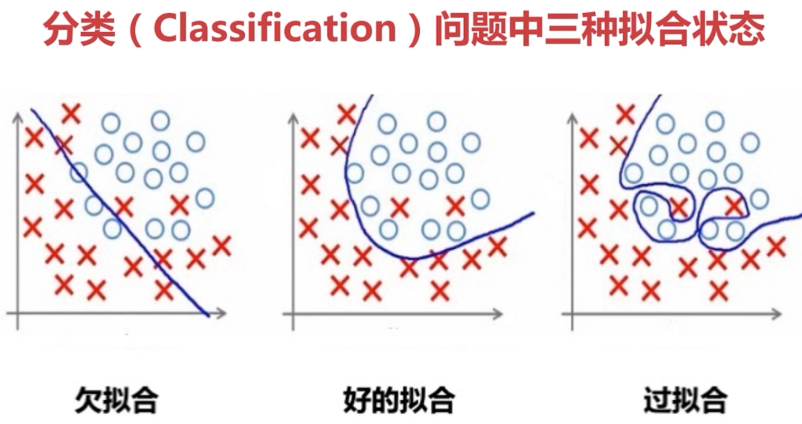

# 人工智能基础知识

## 什么是人工智能
### 人工智能之父麦卡锡给出的定义
- 构建智能机器,特别是智能计算机程序的科学和工程
- 人工智能是一种让计算机程序能够“智能地”思考的方式
- 思考的模式类似于人类

### 什么是智能
- 智能的英语是 Intelligence
- 推理、知识、规划、学习、交流、感知、移动和操作物体,等等
- 智能≠智力(IQ:智商。比较类似计算机的计算能力)

### 如何算有智能？
- 可以根据环境变化而做出相应变化的能力
- 具有“存活”这最基本的动因
- 自主能力,自我意识,等等

### 图灵测试(Turning Test)
- 图灵于1950年提出的一个关于判断机器是否足够智能的著名试验

### 智能分类
- 自然智能(人和动物的智能:纯天然,无添加)
- 人工智能(人造出来的智能)

## AI、机器学习和深度学习的关联
- 机器学习是实现人工智能的一种方法,深度学习是机器学习一个分支

## 什么是机器学习
### 什么是学习?
- ==过程==:一个系统,能够通过执行某个过程,==改善了性能==
- 说得更深入一些,学习的目的是“==减熵==”
- 热力学第二定律:一个孤立系统倾向于增加==熵==(混乱程度)

### “晦涩”的机器学习定义
- 对某类任务T(Task)和性能度量P( Performance
- 通过经验E( Experience)改进后
- 在仼务T上由性能度量P衡量的性能有所提升
- 机器学习大致等同于找一个好的函数( Function)/模型

## 机器学习分类
### 监督学习
- Supervised Learning:有标签。近义词:分类( Classification)

### 非监督学习
- Unsupervised Learning:没有标签。近义词:聚类( Cluster)

### 半监督学习
- Semi-supervised Learning:有少部分标签。最类似人的生活

### 强化学习
- Reinforcement Learning:基于环境而行动,以取得最大化预期利益

### 为什么回归叫 regression(回归)?
- 回归用于预测(比如股票),它的输出是连续的,与离散的分类不同
- 回归是英国生物学家兼统计学家高尔顿在硏究人类遗传问题时提岀的
- 两种身高父亲的儿子的身高,有向他们父辈的平均身高回归的趋势

### 机器学习六步走

### 机器学习的“关键三步”
- 找一系列函数来实现预期的功能:建模问题
- 找一组合理的评价标准,来评估函数的好坏:评价问题
- 快速找到性能最佳的函数:优化问题(比如梯度下降就是这个目的)

## 什么是过拟合？
- Under Fitting:欠拟合。样本不够或算法不精,测试样本特性没学到
- Fitting right:拟合完美。怡当地拟合测试数据,泛化能力强
- Overfitting:过拟合。“一丝不苟”拟合测试数据,泛化能力弱

## 什么是深度学习？
- 基于深度神经网络的学习研究称之为深度学习

### 深度学习能有高回报的必要条件？
- 大数据:全球每天都有海量数据产生,大公司更是“大权在握”
- 强计算力:云计算、GPU、越来越快的CPU
- 复杂模型:一般来说隐藏层越多,效果越好