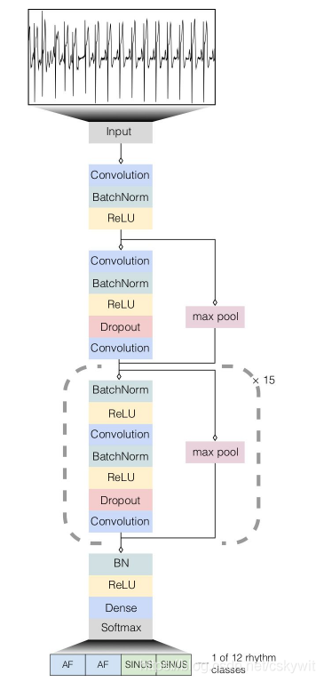
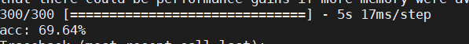

# 论文阅读笔记-吴恩达ecg论文

## 文章简介
本文开发了一个深度神经网络（DNN），使用来自使用单导联动态心电监护设备的53,549名患者的91,232个单导联心电图对12个节律类别进行分类。DNN在（ROC）下达到0.97的平均面积。 DNN的平均F1评分为0.837，超过了普通心脏病学家（0.780）。DNN的敏感性超过了心脏病学家对所有节律类别的敏感度。

30s记录，以原始心电图数据(采样频率为200hz，或每秒200个样本)作为输入，每256个样本(或每1.28 s)输出一个预测

由于DNN在每个输出区间输出一个类预测，因此它对每30秒记录进行一系列23个节奏预测。心脏病学家在记录中标注了每个节律类的开始和结束点。通过舍入注释到最近的区间边界，我们使用这个方法在每个输出区间构建一个心脏病专家标签。因此，可以在每个输出区间的水平上评估模型的准确性，我们称之为“序列水平”，或者在记录水平上评估模型的准确性，我们称之为“集水平”。为了在序列水平上比较模型预测，将每个输出区间的模型预测与同一输出区间的相应委员会共识标签进行比较。在设定的水平上，将DNN预测的给定心电记录上的一组独特的节律类与委员会共识注释的记录上的一组节律类进行比较。与序列级别不同的是，设定级别的评估不会因记录内的节奏分类的时间偏差而受到惩罚。

为了在Physionet Challenge数据(包含可变长度记录)上训练和评估我们的模型，我们对DNN做了微小的修改。在不做任何修改的情况下，DNN可以接受长度为256个样本倍数的任何记录作为输入。为了处理不是256的倍数的例子，记录被截断为最近的倍数。我们使用给定的记录标签作为大约每1.3 s输出预测的标签。为了产生可变长度记录的单一预测，我们使用了序列级预测的多数投票。

该架构将原始ECG数据（以200 Hz采样，或每秒200个样本）作为输入，并且每256个样本（或每1.28 s）输出一个预测值，称之为输出间隔。该网络仅将原始ECG样本作为输入，而不考虑其他与患者或ECG相关的特征。网络架构有34层，为了使网络的优化易于处理，使用了类似残差网络架构的方式，该网络由16个残差块组成，每个残差块跨越两个卷积层。卷积层具有16的fileter size和32 * 2k个滤波器，其中k是超参数，其从0开始并且每四个残差块递增1。每个备用残差块对其输入进行子采样2次。在每个卷积层之前，应用批量归一化和Relui激活，采用预激活块设计。由于这种预激活块结构，网络的第一层和最后一层是特殊的。另外还在卷积层之间和非线性之后应用Dropout，概率为0.2。最终完全连接的softmax层输出12类心率时长的概率。网络是从头训练的，随机初始化权重。使用Adam optimizer，默认参数为β1= 0.9，β2= 0.999，minibatch大小为128。学习率初始化为1×10-3，并且当连续两个epoch的训练损失没有改观时其降低10倍。通过grid search和手动调整的组合来选择网络架构和优化算法的超参数。对于该体系结构，主要搜索的超参数与为卷积层的数量，卷积滤波器的大小和数量，以及残差连接的使用。实验中发现，一旦模型的深度超过八层，残差连接就很有用。论文还尝试了RNN，包括LSTM和BiRNN，但发现准确性没有提高，运行时间却大幅增加;因此，因此文章抛弃了这类模型。

## 测试数据集
**用53549例患者的91232单导联心电图**
Cardiologist-labeled test dataset
This dataset contains 328, 30sec strips of ECG captured at 200 Hz. Each ECG file is saved in int16 binary format. Filenames ending in _grp[0-2] are reference labels, which are annotated by a group of cardiologists. In addition to reference files, each ECG strip also has 6 additional labels, with filenames ending in _rev[0-5] that correspond to 6 individual cardiologists annotating the data separately. Annotation files are saved in json format, with the list of rhythms saved under an "episodes" key.

## DNN结构

## PhysioNet Challenge数据
平均成绩为F1 0.83

## 修改mitdb的数据
首先该数据集是双导联的数据，需要转化为单导联，其次是360个为1秒

## f1为0.77在300个数据集上