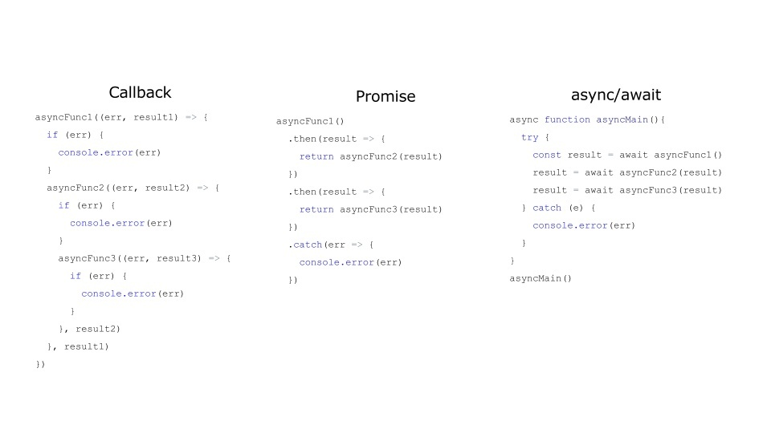
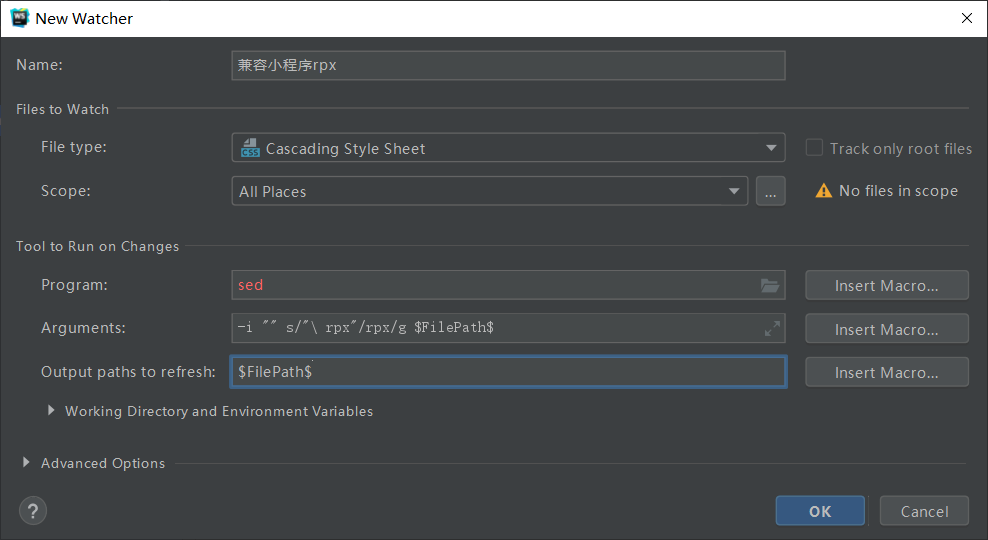

# 微信小程序开发

## Lin UI
++Lin UI 是基于 微信小程序原生语法实现的组件库。遵循简洁，易用的设计规范。++
---

[Lin UI文档](https://doc.mini.talelin.com/start/)

## Promise
1. 对象的状态不受外界影响。Promise 对象代表一个异步操作，有三种状态：
-  pending: 初始状态，不是成功或失败状态。
-  fulfilled: 意味着操作成功完成。
-  rejected: 意味着操作失败。
2. ==一旦状态改变，就不会再变，任何时候都可以得到这个结果==。Promise 对象的状态改变，只有两种可能：从 Pending 变为 Resolved 和从 Pending 变为 Rejected。只要这两种情况发生，状态就凝固了，不会再变了，会一直保持这个结果。就算改变已经发生了，你再对 Promise 对象添加回调函数，也会立即得到这个结果。==这与事件（Event）完全不同，事件的特点是，如果你错过了它，再去监听，是得不到结果的==。

## 页面是否合并HTTP请求
1. HTTP请求数量
2. **HTTP多少次数据库查询 join**
3. 接口的灵活性，接口的可维护性，粒度

## 函数式编程
**js里有find filter reduce map不要总是写for循环**

## WXS
> WXS（WeiXin Script）是小程序的一套脚本语言，结合 WXML，可以构建出页面的结构。
### WXS与JS的区别
WXS 只提供给开发者5个基础类库，分别是 console，Math，JSON，Number，Date，以及一些常用的全局变量和全局函数，可以通过文档进行查阅：https://developers.weixin.qq.com/miniprogram/dev/framework/view/wxs/07basiclibrary.html
这些 API 虽然数量不多，但已经能满足基本的数据操作要求，而对于复杂的数据操作，比如类定义和继承等，还是需要依靠逻辑层的 JS 脚本完成。

> 只支持es5的语法，es6的像const都不支持

## async&await

> 简单的一张图可以直观的表现出 callback、promise 和 async/await 在使用时的主要区别。

> 可以很明显的看到，callback 来控制异步的方式虽然非常简单，但也过于原始。在实际的使用中代码的逻辑顺序和业务的顺序是不相同的，错误控制基本靠手动检查err参数。

> 而到了 Promise 中这种情况好了很多，通过链式调用，Promise 可以直接在 then 中返回一个新的 Promise 来将异步操作串联起来，也有了统一的 catch 来做错误处理。美中不足的是，你仍然需要传递一个回调函数给 then，通过 then 来串联虽然保证了至少代码顺序上和真正的逻辑顺序一致，但和同步代码的差别仍然很大。

> async/await 则直接将其变成了同步的写法，心智负担大大降低。

> 而 async/await 和 Promise 的关系，用一句话总结，就是async function 就是返回 Promise 的 function。

**async 表示函数里有异步操作，**
**await 表示紧跟在后面的表达式需要等待结果。**

### 微信小程序原生promise的实现
- **将小程序内置非promise API转换为promise**
```
//动态类型非常常见，python
// java c# 委托 不常见
const promisic = function (func) {
  return function (params = {}) {
    return new Promise((resolve, reject) => {
      const args = Object.assign(params, {
        success: (res) => {
          resolve(res);
        },
        fail: (error) => {
          reject(error);
        }
      });
      func(args);
    });
  };
};

    static async request({url, data, callback, method='GET'}) {
        await promisic(wx.request)({
            url: `${config.apiBaseUrl}${url}`,
            data,
            method,
        })
    }
```
> 小程序使用async、await需开启==增强编译==。
## 基本配置
### 创建页面
1. 在微信开发者页面右键新建目录新建page
2. 在app.json中配置首页
3. setting里inspection关闭css的检测
4. setting里file watchers

5. setting里File Types中html配置识别wxml，css中识别wxss
6. 将其中的[wecharCode.jar](https://github.com/miaozhang9/wecharCodejar)下载下来，然后在webStorm 的 File -> import settings 中导入即可
> rpx = 2*px ctrl+alt+L 格式化代码
Ctrl+F 查找文本 ctrl+shift+o 删除无效引用 sed在Windows下要下载https://github.com/mbuilov/sed-windows 

### 本地json模拟数据
```
安装json-server

npm i json-server -g 

在WXSHOP目录下运行命令行  

json-server --watch --port 53000 all.json  

浏览器:http://localhost:53000/themes      

PS:  themes指的的是all.json里面的key

详细用法：

https://www.cnblogs.com/fly_dragon/p/9186722.html
```

### config.js和原生调用api
```
wx.request({
  url:'http://localhost:53000/themes',
  method:'GET',
  data: {
    name:'t-1'
  }
})

const config = {
    appkey:'',
    apiBaseUrl:'http://localhost:53000/'
};

export {
    config
}
```

## 功能实现
### 接口调用
```
\\home.js 在哪里使用调用接口的函数
onLoad: async function (options) {
    const data = await Theme.getHomeLocationA();
    this.setData({
      topTheme: data[0]
    })
  },
  
\\theme.js 调用接口的函数
export class Theme {
    static async getHomeLocationA() {
        return await Http.request({
            url: `themes`,
            data: {
                name: 't-1'
            }
        });
    }
}
  
\\http.js 调用接口的工具类，采用promis封装
class Http {
    static async request({url, data, method='GET'}) {
        const res = await promisic(wx.request)({
            url: `${config.apiBaseUrl}${url}`,
            data,
            method,
        });
        return res.data
    }
}

```

### 轮播图实现
```
//原生实现方式
<swiper class="swiper"
            indicator-dots
            indicator-active-color="#157658"
            autoplay
            circular>
        <block wx:for="{{bannerB.items}}">
            <swiper-item>
                <image class="swiper" src="{{item.img}}"></image>
            </swiper-item>
        </block>
    </swiper>
```

### 组件引用和传参
```
# home.json
{
  "usingComponents": {
    "s-category-grid": "/components/category-grid/index"
  }
}

<s-category-grid grid="{{grid}}"></s-category-grid>

# index.js

/**
   * 组件的属性列表
   */
  properties: {
    grid: Array
  },
```

### 给组件设置外部样式类
```
# index.wxml
<view class="container l-class">

# index.js
externalClasses:['l-class'],
  properties: {
    theme:Object,
    spuList:Array
  },
```

### observers监听器
```
# 组件的index.js

properties: {
    banner:Object
  },

  observers:{
    'banner':function (banner) {
      if(!banner){
        return
      }
      if(banner.items.length === 0){
        return
      }
      const left = banner.items.find(i=>i.name==='left')
      const rightTop = banner.items.find(i=>i.name==='right-top')
      const rightBottom = banner.items.find(i=>i.name==='right-bottom')
      this.setData({
        left,
        rightTop,
        rightBottom
      })
    }
  } ,
```

### 分页
```
import {Http} from "./http";

class Paging {

    start
    count
    req
    locker = false
    url
    moreData = true
    accumulator = []  //总数据


    constructor(req, count = 10, start = 0) {
        this.start = start
        this.count = count
        this.req = req
        this.url = req.url
    }

    async getMoreData() {
        if(!this.moreData){
            return
        }
        if(!this._getLocker()){
            return
        }
        const data =await this._actualGetData()
        this._releaseLocker()
        return data
    }


    async _actualGetData() {
        const req = this._getCurrentReq()
        let paging = await Http.request(req)
        if(!paging){
            return null
        }
        if(paging.total === 0){
            return {
                empty:true,
                items:[],
                moreData:false,
                accumulator:[]
            }
        }

        this.moreData = Paging._moreData(paging.total_page, paging.page)
        if(this.moreData){
            this.start += this.count
        }
        this._accumulate(paging.items)
        return {
            empty:false,
            items: paging.items,
            moreData:this.moreData,
            accumulator:this.accumulator
        }
    }

    _accumulate(items){
        this.accumulator = this.accumulator.concat(items)
    }

    static _moreData(totalPage, pageNum) {
        return pageNum < totalPage-1
    }

    _getCurrentReq() {
        let url = this.url
        const params = `start=${this.start}&count=${this.count}`
        if(url.includes('?')){
            url += '&' + params
            // contains
        }
        else{
            url += '?' + params
        }
        this.req.url  = url
        return this.req
    }

    //锁，防抖，防止多次访问
    _getLocker() {
        if (this.locker) {
            return false
        }
        this.locker = true
        return true
    }

    _releaseLocker() {
        this.locker = false
    }

}

export {
    Paging
}
```

### 图片比例
```
index.wxml
<image bind:load="onImgLoad" style="width:{{w}}rpx;height:{{h}}rpx;" src="{{data.img}}"></image>

index.js
onImgLoad(event) {
            const {width, height} = event.detail
            this.setData({
                w:340,
                h:340*height/width
            })
        },
```
> 或者imag的内部方法可以参考微信文档

### 跳转
```
<view data-pid="{{data.id}}"  bind:tap="onItemTap" class="container">

onItemTap(event){
            const pid = event.currentTarget.dataset.pid
            wx.navigateTo({
                url:`/pages/detail/detail?pid=${pid}`
            })
        }
```

### sku的思路
**规格值与规格名对应**，
每次选择重新计算状态，用hashmap实现。