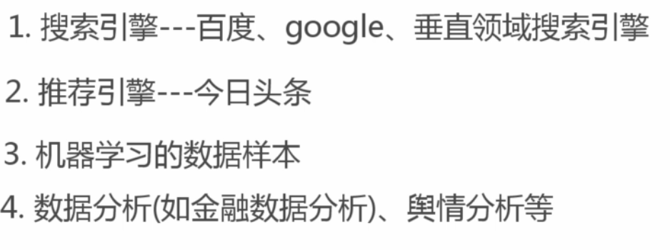
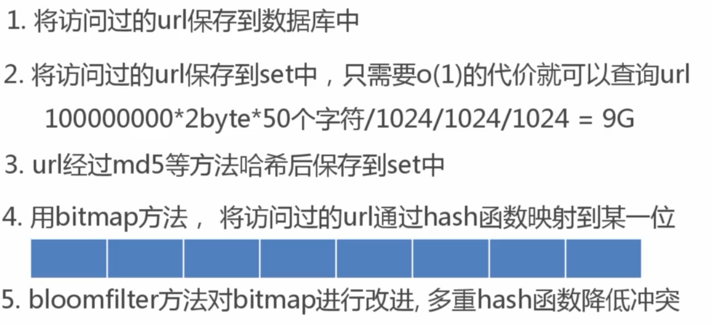
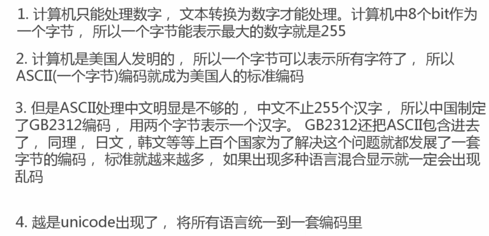
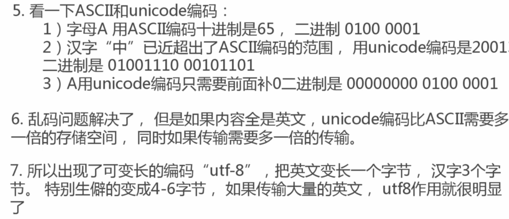
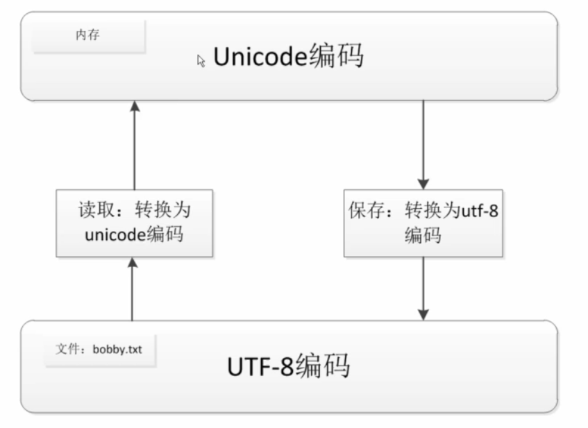

## 爬虫能做什么

## 正则表达式
- ^代表什么开头 .代表任意字符 *代表任意个数 $代表以什么结尾
- ？表示不进行贪婪匹配(默认是从后往前的贪婪匹配) +至少匹配一次
- {2} 字符出现两次 {2,5}字符出现2-5次 | 表示或者关系
- ()表示可以被提取 []满足中括号中的任意一个 [0-9]0-9中的任意一个都满足
- [^1]不等于1都可以 \s 满足空格 \S 只要不是空格都行 \w 满足a-zA-Z1-9_
- \W 与w相反 [\u4E00-\u9FA5] 所有汉字 \d 代表数字

## 爬取策略
**深度优先和广度优先**

## 爬虫去重策略

## 字符串编码

