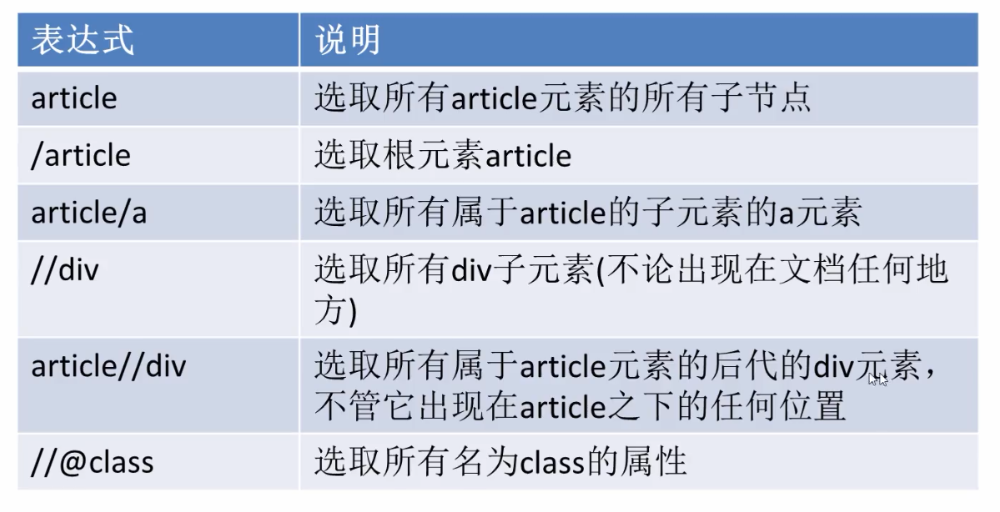
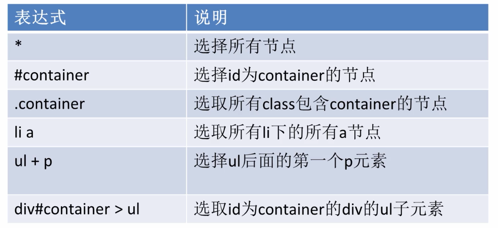

## 创建项目
```
# 创建抓取项目
scrapy startproject tutorial

# 创建抓取网站模板
scrapy genspider jobbole news.cnblogs.com

# 目录结构
tutorial/
    scrapy.cfg            # deploy configuration file

    tutorial/             # project's Python module, you'll import your code from here
        __init__.py

        items.py          # project items definition file

        middlewares.py    # project middlewares file

        pipelines.py      # project pipelines file

        settings.py       # project settings file

        spiders/          # a directory where you'll later put your spiders
            __init__.py
```
```
# 基础项目模板
import scrapy


class JobboleSpider(scrapy.Spider):
    name = 'jobbole'
    allowed_domains = ['news.cnblogs.com']
    start_urls = ['http://news.cnblogs.com/']

    def parse(self, response):
        pass
```

## scrapy 调试

**在根目录下创建main.py**
```
from scrapy.cmdline import execute

import sys
import os

sys.path.append(os.path.dirname(os.path.abspath(__file__)))

execute(["scrapy", "crawl", "jobbole"])

```
> sys.path.append 把路径添加到系统的环境变量，或把该路径的文件夹放进已经添加到系统环境变量的路径内。环境变量的内容会自动添加到模块搜索路径中。

## xpath的基础知识
### xpath简介

### 表达式



### 语法
```
# 返回selectlist
url = response.xpath('//*[@id="entry_691776"]/div[2]/h2/a/@href')
# 返回提取的list
url = response.xpath('//*[@id="entry_691776"]/div[2]/h2/a/@href').extract()
# 取出返回list的第一个元素，如果没有就返回""
url = response.xpath('//*[@id="entry_691776"]/div[2]/h2/a/@href').extract_first("")
```

## css选择器
### 表达式



### 语法
```python
# 原始语法
url = response.css('#news_list h2 a::attr(href)').extract_first("")

# scrapy 框架语法
from scrapy import selector

sel = Selector(text=response.text)
url = sel.css('#news_list h2 a::attr(href)').extract_first('')
```

## requests 辅助提取
**用requests对网页访问的接口直接进行提取**
```
>>> import requests
>>> reponse = requests.get("https://news.cnblogs.com/NewsAjax/GetAjaxNewsInfo?contentId=693026")
>>> reponse.text
'{"ContentID":693026,"CommentCount":0,"TotalView":65,"DiggCount":0,"BuryCount":0}'

>>> import json
>>> json.loads(reponse.text)
{'ContentID': 693026, 'CommentCount': 0, 'TotalView': 65, 'DiggCount': 0, 'BuryCount': 0}
>>> j_data = json.loads(reponse.text)
>>> j_data["TotalView"]
65
```

## scrapy shell
**可以直接在命令行页面进行测试**
```
scrapy shell https://news.cnblogs.com/n/693026/

[s] Available Scrapy objects:
[s]   scrapy     scrapy module (contains scrapy.Request, scrapy.Selector, etc)
[s]   crawler    <scrapy.crawler.Crawler object at 0x000001ABCFD028C8>
[s]   item       {}
[s]   request    <GET https://news.cnblogs.com/n/693026/>
[s]   response   <200 https://news.cnblogs.com/n/693026/>
[s]   settings   <scrapy.settings.Settings object at 0x000001ABCFE01D88>
[s]   spider     <DefaultSpider 'default' at 0x1abd012a248>
[s] Useful shortcuts:
[s]   fetch(url[, redirect=True]) Fetch URL and update local objects (by default, redirects are followed)
[s]   fetch(req)                  Fetch a scrapy.Request and update local objects
[s]   shelp()           Shell help (print this help)
[s]   view(response)    View response in a browser

>>> response.css("#news_title a::text").extract_first("")
'正在通往发射台：NASA Atemis I月球火箭离目标又近了一步'
```