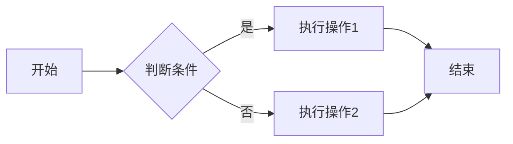
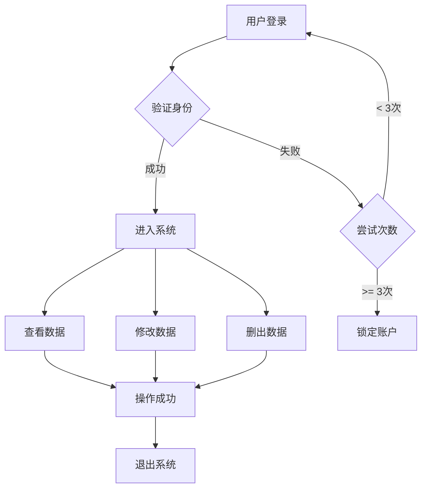
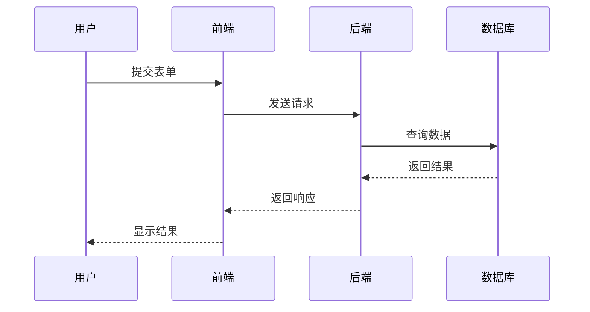
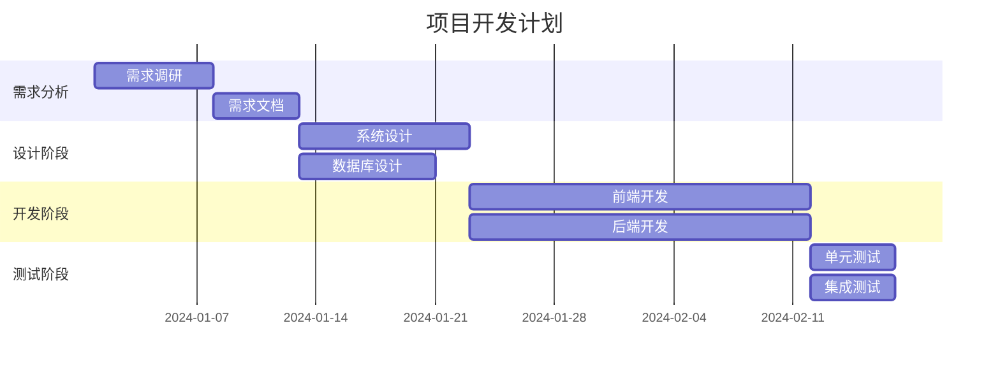
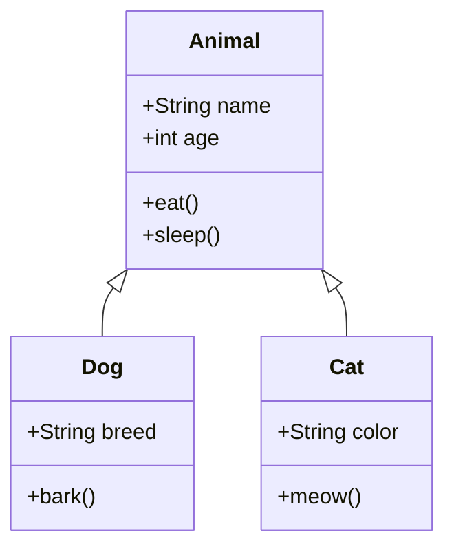
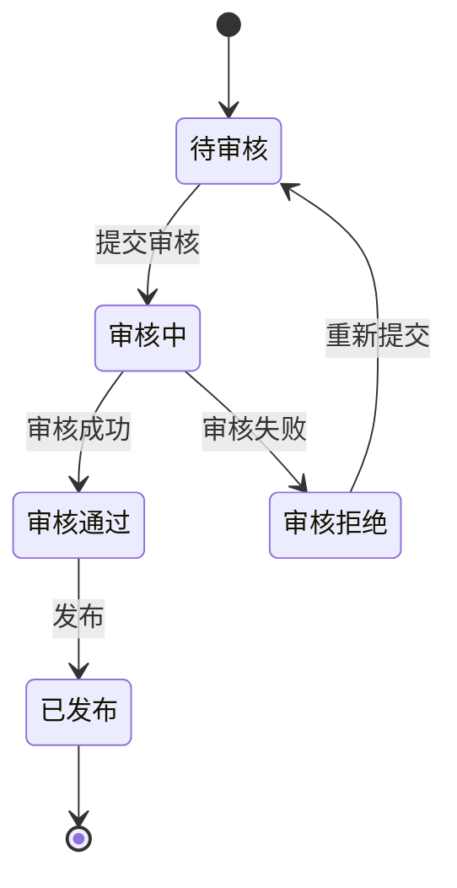
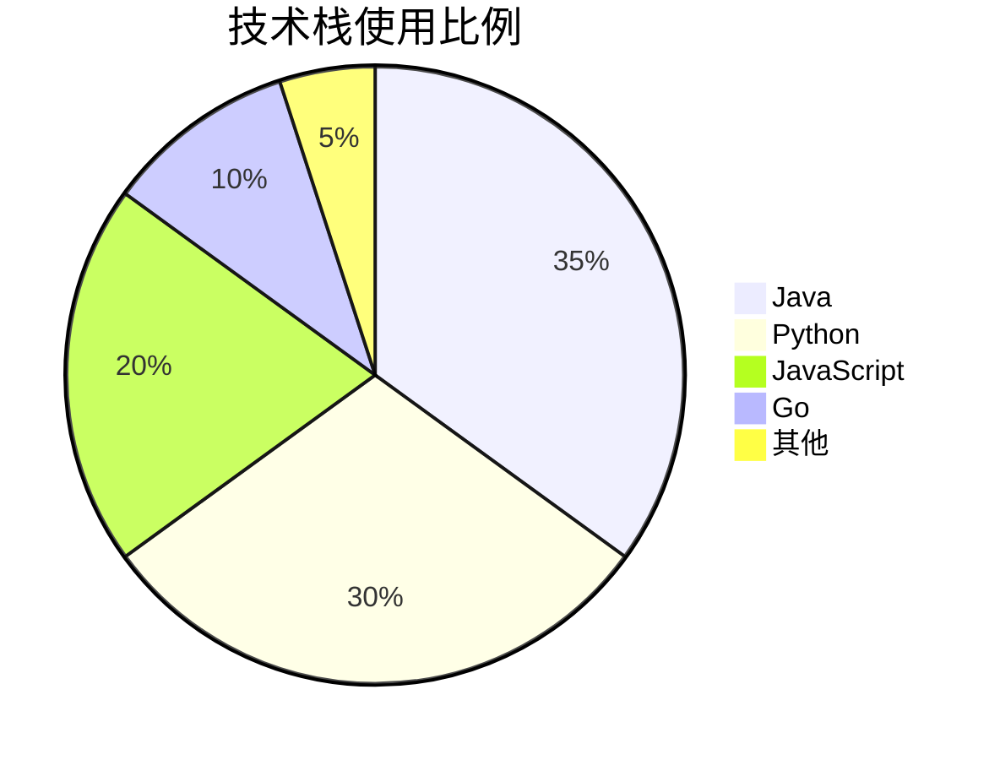
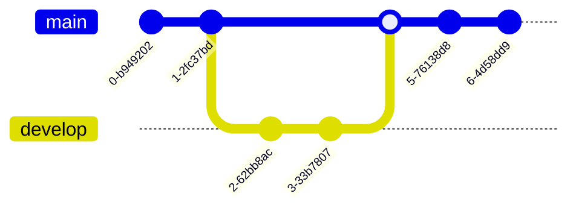

# 流程图和目录使用示例


## 📖 关于本文档

这个文档展示了如何在docsify中使用Mermaid流程图和自动生成的目录功能。

## 🎨 Mermaid 流程图示例

### 1. 基础流程图



### 2. 复杂流程图



### 3. 时序图



### 4. 甘特图



### 5. 类图



### 6. 状态图



### 7. 饼图



### 8. Git图



## 📚 目录功能说明

### 如何使用目录

在文档顶部添加 `` 标记，插件会自动生成文档目录。

目录会固定在页面右侧，方便快速导航。

### 目录特性

- ✅ 自动生成 h1-h4 标题
- ✅ 点击跳转到对应章节
- ✅ 高亮当前阅读位置
- ✅ 响应式设计（移动端自动隐藏）

## 🎯 使用技巧

### Mermaid 语法

1. 流程图使用 `graph` 或 `flowchart`
2. 时序图使用 `sequenceDiagram`
3. 甘特图使用 `gantt`
4. 类图使用 `classDiagram`
5. 状态图使用 `stateDiagram`
6. 饼图使用 `pie`

### 流程图方向

- `TB` - 从上到下
- `BT` - 从下到上
- `LR` - 从左到右
- `RL` - 从右到左

### 节点形状

- `[]` - 矩形
- `()` - 圆角矩形
- `{}` - 菱形
- `(())` - 圆形
- `[[]]` - 子程序形状
- `[()]` - 圆柱形

## 📝 代码示例

### JavaScript 示例

```javascript
function fibonacci(n) {
  if (n <= 1) return n;
  return fibonacci(n - 1) + fibonacci(n - 2);
}

console.log(fibonacci(10)); // 55
```

### Python 示例

```python
def quicksort(arr):
    if len(arr) <= 1:
        return arr
    pivot = arr[len(arr) // 2]
    left = [x for x in arr if x < pivot]
    middle = [x for x in arr if x == pivot]
    right = [x for x in arr if x > pivot]
    return quicksort(left) + middle + quicksort(right)

print(quicksort([3, 6, 8, 10, 1, 2, 1]))
```

## 🎉 总结

通过Mermaid和TOC插件，我们可以：

1. **可视化复杂流程** - 使用流程图清晰展示逻辑
2. **快速导航** - 通过目录快速定位内容
3. **提升阅读体验** - 图文并茂，结构清晰
4. **专业文档** - 打造高质量的技术文档

---

**提示**：在实际使用中，可以根据需要选择合适的图表类型来展示不同的内容！
