# 算法笔记
[toc]
## 基本工具
### 对数器
```python
import random

# 我的方法
def bubble_sort(li):
    if li is None or len(li) < 2:
        return li
    for end in range(len(li) - 1, -1, -1):
        for i in range(end):
            if li[i] > li[i + 1]:
                swap(li, i, i + 1)
    return li

# 交换两个数字，与
def swap(data, i, j):
    data[i] = data[i] ^ data[j]
    data[j] = data[i] ^ data[j]
    data[i] = data[i] ^ data[j]
    
    
'''for test'''
# 1.随机数组发生器
def generate_random_array(max_size,max_vaule):
    arr = []
    arr_len = int((max_size+1)*random.random())  # 长度随机，不能大于max_size
    for i in range(arr_len):
        arr.append(int((max_vaule + 1) * random.random()) - int(max_vaule * random.random()))  # value随机
    return arr

# 2.准备一个绝对正确的方法
def comparator(arr):
    return sorted(arr)

# 3.大样本测试 500 000
def main():
    test_time = 500
    max_size = 100
    max_value = 100
    succeed = True
    for i in range(test_time):
        arr1 = generate_random_array(max_size,max_value)
        arr2 = copy_array(arr1)

        arr1 = bubble_sort(arr1)  # 我的方法
        arr2 = comparator(arr2)   # 系统绝对正确的方法

        if not is_equal(arr1,arr2):
            succeed = False
            break

    print("Nice") if succeed else print("Fucking fucked")

    arr = generate_random_array(max_size,max_value)
    print_array(arr)
    bubble_sort(arr)
    print_array(arr)

# 3.1 copy
def copy_array(arr):
    if arr is None:
        return None
    res = []
    for i in range(len(arr)):
        res.append(arr[i])
    return res

# 3.2 验证isEqual，长度一样，每位的数字一样
def is_equal(arr1,arr2):
    if (arr1 is None and arr2 is not None) or (arr1 is not None and arr2 is None):
        return False
    if arr1 is None and arr2 is None:
        return True
    if len(arr1) != len(arr2):
        return False
    for i in range(len(arr1)):
        if arr1[i] != arr2[i]:
            return False
    return True

# 3.3 打印结果
def print_array(arr):
    if arr is None:
        return
    for i in range(len(arr)):
        print(arr[i],end=' ')
    print('\n')


if __name__ == '__main__':
    main()
```

### 比较器
1. 比较器的实质就是重载比较运算符
2. 比较器可以很好的应用在特殊标准的排序上
3. 比较器可以很好的应用在根据特殊标准排序的结构上
4. 写代码变得异常容易,还用于范型编程

### 素数
```python
import math
def prime(num):
    if num%2==0:
        return False
    for i in range(3, int(math.sqrt(num)) + 1, 2):
        if num % i == 0:
            return False
    return True
```

### 打表法
1. 问题如果返回值不太多,可以用 hardcode的方式列出,作为程序的一部分
2. 一个大问题解决时底层频繁使用规模不大的小问题的解,如果小问题的返回值满足条件1,可以把小问题的解列成一张表,作为程序的一部分
3. 打表找规律
#### 求数组质数因子的和
直接事先求一个最大数的指数，然后存进数组，每次从数组遍历（比每次都求快）
**或者如果事先有最大数的范围，直接把数组跑出来写入代码**
#### 判断一个数是不是连续数字的和
定义一种数：可以表示成若干（数量>1）连续正数和的数 。比如:5 = 2+3，5就是这样的数 ；12 = 3+4+5，12就是这样的数 。1不是这样的数，因为要求数量大于1个、连续正数和 。2 = 1 + 1，2也不是，因为等号右边不是连续正数 。给定一个参数N，返回是不是可以表示成若干连续正数和的数 。
**打表发现2的n次方都不行**

## 排序
### 选择排序

```Python
def select_sort(arr):
    for i in range(len(arr)):
        min_index = i
        for n in range(len(arr)-i):
            if arr[min_index] > arr[i+n]:
                min_index = i+n
        arr[i], arr[min_index] = arr[min_index], arr[i]
    return arr
```
### 快排
```python
# python
def selection_sort(array):
    n = len(array)
    for i in range(n):
        min_index = i
        for j in range(i + 1, n):
            if array[j] < array[min_index]:
                min_index = j
        array[i], array[min_index] = array[min_index], array[i]
```
```java
// java
public static void selectionSort(int[] arr) {
    if(arr == null || arr.length < 2) {
        return;
    }
    for(int i=0;i<arr.length-1; i++) {
        int minIndex = i;
        for(int j = i+1; j<arr.length; j++) {
            minIndex = arr[j] < arr[minIndex] ? j : minIndex;
        }
        swap(arr,i,minIndex);
    }
}
```
### 插入排序
```python
def insert_sort(array):
	n = len(array)
	for i in range(1, n):
		j=i-1
		# 和前面的相比，比较在意顺序
		while j>=0 and array[j]>array[j+1]:
			array[j+1], array[j] = array[j], array[j+1]
			j-=1
```

### 归并排序
**做题思路：右边左边有多少个数比你大**
```python
# arr[L...R] 上有序
def merge_sort(arr, L, R):
    if L == R:
        return
    mid = L + (R-L)//2
    merge_sort(arr, L, mid)
    merge_sort(arr, mid+1, R)
    merge(arr, L, mid, R)


def merge(arr, L, mid, R):
    tmp = []
    p1, p2 = L, mid+1
    while p1 <= mid and p2 <= R:
        if arr[p1] <= arr[p2]:
            tmp.append(arr[p1])
            p1 += 1
        else:
            tmp.append(arr[p2])
            p2 += 1
    while p1 <= mid:
        tmp.append(arr[p1])
        p1 += 1
    while p2 <= R:
        tmp.append(arr[p2])
        p2 += 1
    arr[L:R+1] = tmp

```
#### 求数组小和
数组中数左边比它小的数的总和,叫数的小和,所有数的小和累加起来,叫数组小和。求数组小和。
**思路：主要是用归并算法左边和右边（有序）的比较优化时间复杂度nlogn**
```python
def merge_sort(arr, L, R):
    if L == R:
        return 0
    mid = L + (R-L)//2
    return merge_sort(arr, L, mid) + merge_sort(arr, mid+1, R) + merge(arr, L, mid, R)


def merge(arr, L, mid, R):
    tmp = []
    res, p1, p2 = 0, L, mid+1
    while p1 <= mid and p2 <= R:
        if arr[p1] < arr[p2]:
            res += (R - p2 + 1) * arr[p1]
            tmp.append(arr[p1])
            p1 += 1
        else:
            tmp.append(arr[p2])
            p2 += 1
            res += 0
    while p1 <= mid:
        tmp.append(arr[p1])
        p1 += 1
    while p2 <= R:
        tmp.append(arr[p2])
        p2 += 1
    arr[L:R+1] = tmp
    return res
```

### 快速排序
**Partition过程：** 给定一个数组a,和一个整数num。请把小于等于num的数放在数组的左边大于num的数放在数组的右边。
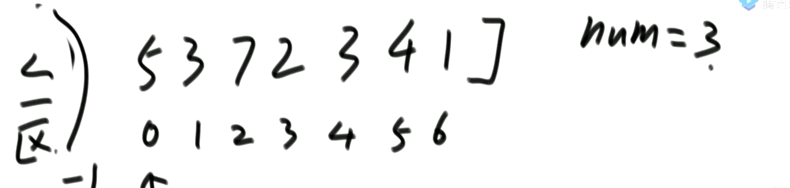

**快排1.0**
1. [i] <= num,当前数，和小于等于区域下一个交换，小于等于区域右扩，i++
2. [i] > num,i++ 

**快排2.0**
荷兰国旗问题

**快排3.0**
随机选一个数放到arr[R]
**前两种最坏情况是n^2，随机快排时间复杂度从概率期望上来说是nlogn** 
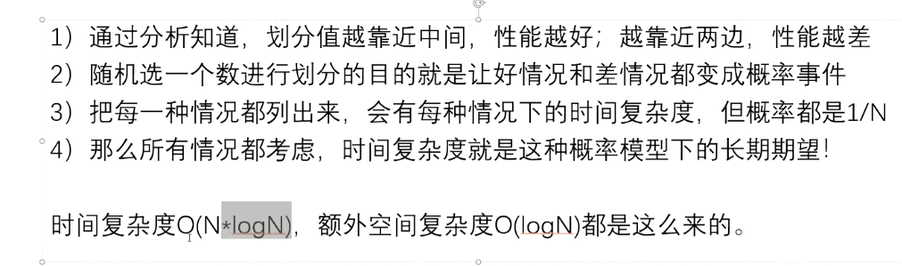
```python
def quick_sort3(arr):
    if arr is None or len(arr) < 2:
        return
    process(arr, 0, len(arr) - 1)


def process(arr, L, R):
    if L >= R:
        return
    rand = random.randint(L, R)
    arr[R], arr[rand] = arr[rand], arr[R]
    equal_area = color_sort(arr, L, R)
    process(arr, L, equal_area[0]-1)
    process(arr, equal_area[1]+1, R)


# arr[L...R] 上荷兰国旗问题划分,以arr[R]做划分值
# 返回值是list数组包含相等数字的开头和结尾坐标[l,r]
def color_sort(arr, L, R):
    if L > R:
        return [-1, -1]
    if L == R:
        return [L, R]
    less = L - 1
    more = R
    index = L
    while index < more:
        if arr[index] < arr[R]:
            arr[less + 1], arr[index] = arr[index], arr[less + 1]
            index += 1
            less += 1
        elif arr[index] == arr[R]:
            index += 1
        else:
            arr[more - 1], arr[index] = arr[index], arr[more - 1]
            more -= 1
    arr[R], arr[more] = arr[more], arr[R]
    return [less + 1, more]
```


#### 荷兰国旗问题
**要求小于的在左边，等于的在中间，大于的在右边**
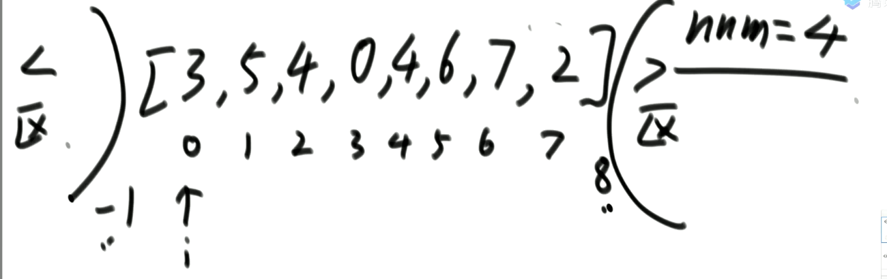

**思路**：
1. [i] == num, i++
2. [i] < num, [i]与小于区域的右一个交换，小于区域右扩，i++
3. [i] > num, [i]与大于区域的左一个交换，i不变
```python
# arr[L...R] 上荷兰国旗问题划分,以arr[R]做划分值
# 返回值是list数组包含相等数字的开头和结尾坐标[l,r]
def color_sort(arr, L, R):
    if L > R:
        return [-1, -1]
    if L == R:
        return [L, R]
    less = L - 1
    more = R
    index = L
    while index < more:
        if arr[index] < arr[R]:
            arr[less+1], arr[index] = arr[index], arr[less+1]
            index += 1
            less += 1
        elif arr[index] == arr[R]:
            index += 1
        else:
            arr[more-1], arr[index] = arr[index], arr[more-1]
            more -= 1
    arr[R], arr[more] = arr[more], arr[R]
    return [less+1, more]
```

### 堆
**数组实现一棵树下标从0开始：左孩子：2*i+1 右孩子2*i+2 父节点：(i-1)/2**

#### 大根堆
**大根堆**：头节点是子树中最大的。

**从下往上建堆是On，从上往下建堆是Onlogn**
```python
import random
 
 
class MaxHeap(object):
 
    def __init__(self):
        self._data = []
        self._count = len(self._data)
 
    def size(self):
        return self._count
 
    def isEmpty(self):
        return self._count == 0
 
    def add(self, item):
        # 插入元素入堆
        if self._count >= len(self._data):
            self._data.append(item)
        else:
            self._data[self._count] = item
 
        self._count += 1
        self._shiftup(self._count-1)
 
    def pop(self):
        # 出堆
        if self._count > 0:
            ret = self._data[0]
            self._data[0] = self._data[self._count-1]
            self._count -= 1
            self._shiftDown(0)
            return ret
        
    def _shiftup(self, index):
        # 上移self._data[index]，以使它不大于父节点
        parent = (index-1)>>1
        while index > 0 and self._data[parent] < self._data[index]:
            # swap
            self._data[parent], self._data[index] = self._data[index], self._data[parent]
            index = parent
            parent = (index-1)>>1
 
    def _shiftDown(self, index):
        # 上移self._data[index]，以使它不小于子节点
        j = (index << 1) + 1
        while j < self._count :
            # 有子节点
            if j+1 < self._count and self._data[j+1] > self._data[j]:
                # 有右子节点，并且右子节点较大
                j += 1
            if self._data[index] >= self._data[j]:
                # 堆的索引位置已经大于两个子节点，不需要交换了
                break
            self._data[index], self._data[j] = self._data[j], self._data[index]
            index = j
            j = (index << 1) + 1
 
# 元素是数值类型                
def testIntValue():
    for iTimes in range(10):
        iLen = random.randint(1,300)
        allData= random.sample(range(iLen*100), iLen)
#         allData = [1, 4, 3, 2, 5, 7, 6]
#         iLen = len(allData)
        print('\nlen =',iLen)
        
        oMaxHeap = MaxHeap()
        print('_data:\t   ', allData)
        arrDataSorted = sorted(allData, reverse=True)
        print('dataSorted:', arrDataSorted)
        for i in allData:
            oMaxHeap.add(i)
        heapData = []    
        for i in range(iLen):
            iExpected = arrDataSorted[i]
            iActual = oMaxHeap.pop()
            heapData.append(iActual)
            print('{0}, expected: {1}, actual: {2}'.format(iExpected==iActual, iExpected, iActual))
            assert iExpected==iActual, ""
        print('dataSorted:', arrDataSorted)
        print('heapData:  ',heapData)
        
# 元素是元祖类型
def testTupleValue():
    for iTimes in range(10):
        iLen = random.randint(1,300)
        listData= random.sample(range(iLen*100), iLen)
#         listData = [1, 4, 3, 2, 5, 7, 6]
#         iLen = len(listData)
        # 注意：key作为比较大小的关键
        allData = dict(zip(listData, [str(e) for e in listData]))
        print('\nlen =',iLen)
        print('allData: ', allData)
        
        oMaxHeap = MaxHeap()
        arrDataSorted = sorted(allData.items(), key=lambda d:d[0], reverse=True)
#         arrDataSorted = sorted(allData, reverse=True)
        print('dataSorted:', arrDataSorted)
        for (k,v) in allData.items():
            oMaxHeap.add((k,v)) # 元祖的第一个元素作为比较点
        heapData = []    
        for i in range(iLen):
            iExpected = arrDataSorted[i]
            iActual = oMaxHeap.pop()
            heapData.append(iActual)
            print('{0}, expected: {1}, actual: {2}'.format(iExpected==iActual, iExpected, iActual))
            assert iExpected==iActual, ""
        print('dataSorted:', arrDataSorted)
        print('heapData:  ',heapData)
        
# 元素是自定义类    
def testClassValue():
    
    class Model4Test(object):
        '''
        用于放入到堆的自定义类。注意要重写__lt__、__ge__、__le__和__cmp__函数。
        '''
        def __init__(self, sUid, value):
            self._sUid = sUid
            self._value = value
        
        def getUid(self):
            return self._sUid
        
        def getValue(self):
            return self._value
        
        # 类类型，使用的是小于号_lt_
        def __lt__(self, other):#operator < 
#             print('in __lt__(self, other)')
            return self.getValue() < other.getValue()
       
        def __ge__(self,other):#oprator >=
            return self.getValue() >= other.getValue()
     
        #下面两个方法重写一个就可以了
        def __le__(self,other):#oprator <=
            return self.getValue() <= other.getValue()
         
        def __cmp__(self,other):
            if self.getValue() < other.getValue():
                return -1
            if self.getValue() > other.getValue():
                return 1
            return 0
        
        def __str__(self):
            return '({0}, {1})'.format(self._value, self._sUid)
            
    for iTimes in range(10):
        iLen = random.randint(1,300)
        listData = random.sample(range(iLen*100), iLen)
#         listData = [1, 4, 3, 2, 5, 7, 6]
        allData = [Model4Test(str(value), value) for value in listData]
        print('allData:   ', [str(e) for e in allData])
        iLen = len(allData)
        print('\nlen =',iLen)
 
        oMaxHeap = MaxHeap()
        arrDataSorted = sorted(allData, reverse=True)
        print('dataSorted:', [str(e) for e in arrDataSorted])
        for i in allData:
            oMaxHeap.add(i)
        heapData = []    
        for i in range(iLen):
            iExpected = arrDataSorted[i]
            iActual = oMaxHeap.pop()
            heapData.append(iActual)
            print('{0}, expected: {1}, actual: {2}'.format(iExpected==iActual, iExpected, iActual))
            assert iExpected==iActual, ""
        print('dataSorted:', [str(e) for e in arrDataSorted])
        print('heapData:  ', [str(e) for e in heapData])
                        
if __name__ == '__main__':
    testIntValue()
    testTupleValue()
    testClassValue()
————————————————
版权声明：本文为CSDN博主「yuth」的原创文章，遵循CC 4.0 BY-SA版权协议，转载请附上原文出处链接及本声明。
原文链接：https://blog.csdn.net/yuhentian/article/details/80159284

```

#### 堆排序
**额外空间复杂度 o1**
**思路：**

1. 用户1个1个给你，调成大根堆，heapInsert
2. 将第一个数和最后一个数交换，然后heapfy，重复n次，即完成了排序。
```python
def heap_sort(arr):
    if arr is None or len(arr) < 2:
        return
    for i in range(len(arr)):
        heap_insert(arr, i)
        
    # # On方法构建大根堆
    # i = len(arr) -1
    # while i >= 0:
    #     heapfy(arr, i, len(arr))
    #     i -= 1

    size = len(arr)-1
    arr[size], arr[0] = arr[0], arr[size]
    while size > 0:
        heapfy(arr, 0, size)
        size -= 1
        arr[size], arr[0] = arr[0], arr[size]


def heap_insert(arr, index):
    # 不可用整除，整除是向下取整
    while arr[index] > arr[int((index-1)/2)]:
        arr[index], arr[int((index-1)/2)] = arr[int((index-1)/2)], arr[index]
        index = int((index-1)/2)


def heapfy(arr, index, size):
    left = index*2+1
    while left < size:
        # largest为左右子树中最大的
        largest = left+1 if left+1 < size and arr[left+1] > arr[left] else left
        # 比较三者中谁大
        largest = largest if arr[index] < arr[largest] else index
        if index == largest:
            break
        arr[largest], arr[index] = arr[index], arr[largest]
        index = largest
        left = index * 2 + 1

```
#### 为什么从下建堆比从上建堆快
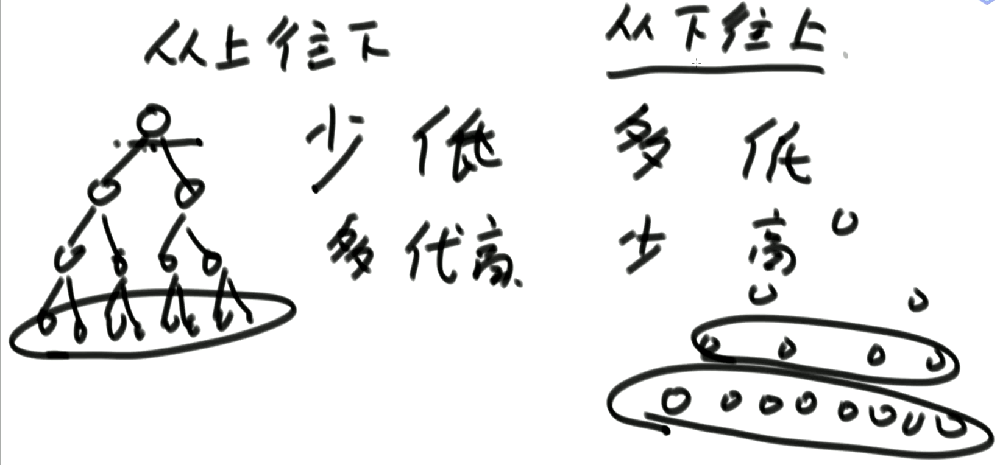
从下建堆 多的代价小 少的代价大
从上建堆 多的代价大 少的代价小

#### 语言提供的堆结构VS手写的堆结构
取决于,你有没有动态改信息的需求!

语言提供的堆结构,如果你动态改数据,不保证依然有序。

手写堆结构,因为增加了对象的位置表,所以能够满足动态改信息的需求

#### 小范围排序
已知一个几乎有序的数组，几乎有序是指，如果把数组排好顺序的话，每个元素移动的距离可以不超过k，并且k相对于数组来说比较小。请选择一个合适的排序算法针对这个数据进行排序给定一个int数组A，同时给定A的大小n和题意中的k，请返回排序后的数组。
1. 建立由k可元素的小顶堆，然后取出顶上元素
2. 堆顶用没有建堆的下一元素替代，重新建堆
3. 反复调用，完成排序，此算法因为每个元素移动都在k以内，所以时间复杂度为O（nlogk）
```java

class ScaleSort {
    public int[] sortElement(int[] A, int n, int k) {
    	if(n == 0 || n < k)
    		return A;
        int[] heap = Arrays.copyOf(A, k);
        //建立只有k个元素的小顶堆
        for(int i = k/2-1;i >= 0;i--)
        	heapCreate(heap,i,k);
        //核心：建完堆后取出堆顶，赋值给A第一元素，然后用后面从k到n个元素逐布替代
        for(int i = k;i < n;i++){
        	A[i-k] = heap[0];
        	heap[0] = A[i];
        	heapCreate(heap, 0, k);
        }
        //逐步建堆排序结束后，最后还有n-1-k+1到n-1的k个元素的完整堆
        //用普通堆排序思想输出
        //堆顶与最后一个元素交换
        for(int i = n-k;i < n;i++){
        	A[i] = heap[0];
        	//交换
        	int temp = heap[0];
        	heap[0] = heap[k-1];
        	heap[k-1] = temp;
        	//重新调整
        	heapCreate(heap, 0, --k);
        }
        return A;
    }
    //建小顶堆函数
    private void heapCreate(int[] heap,int i,int k){
    	int temp = heap[i];
    	for(int j = 2*i+1;j < k; j = 2*j+1){
    		if((j+1 < k)&&(heap[j] > heap[j+1]))
    			j++;
    		if(temp < heap[j])
    			break;
    		heap[i] = heap[j];
    		i = j;
    	}
    	heap[i] = temp;
    }
}
```

### 不基于比较的排序
桶排序思想下的排序：计数排序&基数排序
1. 桶排序思想下的排序都是不基于比较的排序
2. 时间复杂度为O(N),额外空间负载度O(M)
3. 应用范围有限需要样本的数据状况满足桶的划分

#### 计数排序
**一般来讲,计数排序要求,样本是整数,且范围比较窄**
```python
def count_sort(arr):
    if not arr or len(arr) < 2:
        return arr
    max_num = max(arr)
    count = [0] * (max_num+1)
    for i in arr:
        count[i] += 1
    index = 0
    for i, num in enumerate(count):
        for m in range(num):
            arr[index] = i
            index += 1
    return arr
```

#### 基数排序
**一般来讲,基数排序要求,样本是10进制的正整数**

java骚操作版
```java
	// only for no-negative value
	public static void radixSort(int[] arr) {
		if (arr == null || arr.length < 2) {
			return;
		}
		radixSort(arr, 0, arr.length - 1, maxbits(arr));
	}

	public static int maxbits(int[] arr) {
		int max = Integer.MIN_VALUE;
		for (int i = 0; i < arr.length; i++) {
			max = Math.max(max, arr[i]);
		}
		int res = 0;
		while (max != 0) {
			res++;
			max /= 10;
		}
		return res;
	}

	public static void radixSort(int[] arr, int begin, int end, int digit) {
		final int radix = 10;
		int i = 0, j = 0;

		int[] bucket = new int[end - begin + 1];
		for (int d = 1; d <= digit; d++) {
			int[] count = new int[radix];
			for (i = begin; i <= end; i++) {
				j = getDigit(arr[i], d);
				count[j]++;
			}
			for (i = 1; i < radix; i++) {
				count[i] = count[i] + count[i - 1];
			}
			for (i = end; i >= begin; i--) {
				j = getDigit(arr[i], d);
				bucket[count[j] - 1] = arr[i];
				count[j]--;
			}
			for (i = begin, j = 0; i <= end; i++, j++) {
				arr[i] = bucket[j];
			}
		}
	}

	public static int getDigit(int x, int d) {
		return ((x / ((int) Math.pow(10, d - 1))) % 10);
	}
```
python普通版
```python
def radix_sort(s):
    """基数排序"""
    i = 0 # 记录当前正在排拿一位，最低位为1
    max_num = max(s)  # 最大值
    j = len(str(max_num))  # 记录最大值的位数
    while i < j:
        bucket_list =[[] for _ in range(10)] #初始化桶数组
        for x in s:
            bucket_list[int(x / (10**i)) % 10].append(x) # 找到位置放入桶数组
        print(bucket_list)
        s.clear()
        for x in bucket_list:   # 放回原序列
            for y in x:
                s.append(y)
        i += 1

if __name__ == '__main__':
    a = [334,5,67,345,7,345345,99,4,23,78,45,1,3453,23424]
    radix_sort(a)
    print(a)
```

### 排序算法的稳定性稳定性
1. 对基础类型来说，稳定性毫无意义
2. 对非基础类型来说,稳定性有重要意义
3. 有些排序算法可以实现成稳定的,而有些排序算法无论如何都实现不成稳定的
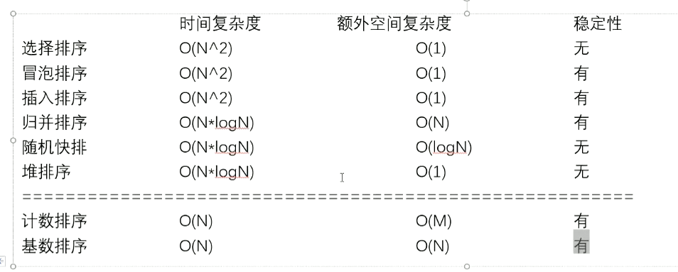

#### 常见的坑
1. 归并排序的额外空间复杂度可以变成O(1),“归并排序内部缓存法”,但是将变得不再稳定。
2. “原地归并排序"是垃圾贴,会让时间复杂度变成O(N^2)
3. 快速排序稳定性改进,“01 stable sort",但是会对样本数据要求更多。
4. 在整型数组中,请把奇数放在数组左边,偶数放在数组右边,要求所有奇数之间原始的相对次序不变,所有偶数之间原始相对次序不变。时间复杂度做到O(N),额外空间复杂度做到O(1)

**做不到，做到了快排就稳定了，类似于第三条。**

#### 工程上对排序的改进
当数据量比较小的时候，用插入排序。
当数据量比较大的时候，用快速、堆、归并排序。

## 二分
1. 确定一个区间，使得目标值一定在区间中。
2. 找一个判断条件，满足：
    1. 性质具有二段性
    2. 答案是二段性的分界点 分界点也要考虑target在前半段的终点，和后半段的起点
    3. 分析终点M在该判断条件下是否成立，如果成立，考虑答案在那个区间
    4. 如果更新方式是R=mid，则不用做任何处理，如果更新方式写的是l=mid，则需要在计算mid时加上1
> pyhton 里可以使用bisect_left来进行二分二分搜索

### **最基本的二分查找算法**：
```python
因为我们初始化 right = nums.length - 1 所以决定了我们的「搜索区间」是 [left, right] 所以决定了 while (left <= right) 同时也决定了 left = mid+1 和 right = mid-1 因为我们只需找到一个 target 的索引即可 所以当 nums[mid] == target 时可以立即返回
```
### **寻找左侧边界的二分查找**：
```python
因为我们初始化 right = nums.length 所以决定了我们的「搜索区间」是 [left, right) 所以决定了 while (left < right) 同时也决定了 left = mid + 1 和 right = mid 因为我们需找到 target 的最左侧索引 所以当 nums[mid] == target 时不要立即返回 而要收紧右侧边界以锁定左侧边界
```
### **寻找右侧边界的二分查找**：
```python
因为我们初始化 right = nums.length 所以决定了我们的「搜索区间」是 [left, right) 所以决定了 while (left < right) 同时也决定了 left = mid + 1 和 right = mid 因为我们需找到 target 的最右侧索引 所以当 nums[mid] == target 时不要立即返回 而要收紧左侧边界以锁定右侧边界 又因为收紧左侧边界时必须 left = mid + 1 所以最后无论返回 left 还是 right，必须减一
```

### 二分查找
++给定一个 n 个元素有序的（升序）整型数组 nums 和一个目标值 target  ，写一个函数搜索 nums 中的 target，如果目标值存在返回下标，否则返回 -1。++
```python
def search(self, nums: List[int], target: int) -> int:
        L = 0
        m = 0
        R = len(nums) -1
        while L <= R:
            m = L + ((R-L) >>1)
            if nums[m] == target:
                return m
            elif nums[m] > target:
                R = m-1
            else:
                L = m+1
        return -1
```
### 35.搜索插入位置
```python
# 给定一个排序数组和一个目标值，在数组中找到目标值，并返回其索引。如果目标值不存在于数组中，返回它将会被按顺序插入的位置。
# 等价于 返回的这个值是 nums 中小于 target 的元素个数。
class Solution:
    def searchInsert(self, nums: List[int], target: int) -> int:
        L = 0
        index = 0
        R = len(nums) -1
        if nums[len(nums) - 1] < target:
            return len(nums)
        while L <= R:
            m = L + ((R-L) >>1)
            if nums[m] >= target:
                index = m
                R = m-1
            else:
                L = m+1
        return index
        
# 在arr上，找满足>=value最左边值
class Solution:
    def searchInsert(self, nums: List[int], target: int) -> int:
        L = 0
        index = 0
        R = len(nums) -1
        while L <= R:
            m = L + ((R-L) >>1)
            if nums[m] >= target:
                index = m
                R = m-1
            else:
                L = m+1
        return index
```
### 二分查找-剑指 Offer 53 - I. 在排序数组中查找数字 I
++统计一个数字在排序数组中出现的次数。++
> helper() 函数旨在查找数字 tartar 在数组 numsnums 中的 插入点 ，且若数组中存在值相同的元素，则插入到这些元素的右边。
```python
# 解题思路 数字重复的次数=right−left−1 进而升级为找到左插入点和右插入点进行删减
class Solution:
    def search(self, nums: [int], target: int) -> int:
        def helper(tar):
            i, j = 0, len(nums) - 1
            while i <= j:
                m = (i + j) // 2
                if nums[m] <= tar: i = m + 1
                else: j = m - 1
            return i
        return helper(target) - helper(target - 1)
```

## 位运算
**异或：相同为0，不同为1**
**等同于不进位相加**
**满足交换律和结合律**
### 位运算的巧用
- 判断数偶： 奇数 x % 2 == 1 -> (x&1 == 1) 偶数x % 2 == 0 -> (x&1 == 0)

- 两数取平均(除2): mid = (left+right)/2 等价于 mid = (left+right) >> 1

- 清除最低位的1: x = x&(x-1)

- 得到最低位的1: n = x & (~x+1)

- 清零: x&~x
### 面试题 16.01 交换数字
```python
# python
class Solution:
    def swapNumbers(self, numbers: List[int]) -> List[int]:
        numbers[0] = numbers[0] ^ numbers[1]
        numbers[1] = numbers[0] ^ numbers[1]
        numbers[0] = numbers[0] ^ numbers[1]
        return numbers
```
### 关键方法：找到二进制最右侧的1
N: 0001100100
~N:1110011011
~N+1:1110011100
```
N&(~N+1): 0000000100
```
### 只出现一次的数字
++给定一个非空整数数组，除了某个元素只出现一次以外，其余每个元素均出现两次。找出那个只出现了一次的元素。++
```python
# python 题解思路是：异或符合交换律 相同为0 0^任何数都等于原数
class Solution:
    def singleNumber(self, nums: List[int]) -> int:
        eor = 0
        for i in range(len(nums)):
            eor ^= nums[i]
        return eor
```

```java
// java
class Solution {
    public int singleNumber(int[] nums) {
        int sum = nums[0];
        for(int i=1; i<nums.length; i++){
            sum = sum^nums[i];
        }
        return sum;

    }
}
```

### 位1的个数
++编写一个函数，输入是一个无符号整数（以二进制串的形式），返回其二进制表达式中数字位数为 '1' 的个数（也被称为汉明重量）。++
```python
# python题解：不断提取最右侧的1
class Solution:
    def hammingWeight(self, n: int) -> int:
        right_num = n & (~n + 1)
        ans = 0
        while n != 0:
            n ^= right_num
            ans += 1
            right_num = n & (~n + 1)
        return ans
```

### 2的幂
++给定一个整数，编写一个函数来判断它是否是 2 的幂次方。++
```python
# python题解： 不用logn的方法用o1的方法
# 从位运算的角度来看，题目实际上是问如何取出2进制最右边的1
# 如果取出最右边的1和本身相同那他就是2的幂次方 n & (~n + 1)
# n          101101
# (~n + 1)   010011 -> 000001
# 也可以 不是2的某次方(num & (num - 1)) != 0
# 也可以 是2的某次方(num & (num - 1)) == 0
class Solution:
    def isPowerOfTwo(self, n: int) -> bool:
        if n<=0:
            return False
        return n & (~n + 1) == n
```

### 最大数值
++编写一个方法，找出两个数字a和b中最大的那一个。不得使用if-else或其他比较运算符。++
```
class Solution {
    public int maximum(int a, int b) {
        long x = (long)a - (long)b;
        int c = (int)(x>>63);
        return (c+1)*a - b*c;
    }
}
```

### 只出现一次的数字 III
++给定一个整数数组 nums，其中恰好有两个元素只出现一次，其余所有元素均出现两次。 找出只出现一次的那两个元素。++
```Python
# python 题解：x = A ^ B 可知x!=0 所以x一定有1位是1 取出最右边的数字1(说明在这位上AB不一样)
# 然后将 a 和 b 根据最右边的1将A,B分类 一类是1 一类是0
# 之后单独异或最右边那一位是1的数，就找到ab中的一个数了
class Solution:
    def singleNumber(self, nums: List[int]) -> List[int]:
        x = 0
        for i in range(len(nums)):
            x ^= nums[i]
        # 提取出最右侧的1
        right_num = x & (~x+1)
        # 0异或任何数还是它本身
        ans = 0
        for i in range(len(nums)):
            # 找到那位不是0的相与
            if right_num & nums[i] != 0:
                ans ^= nums[i]
        return [ans, ans^x]

```

```java
// java
class Solution {
    public int[] singleNumber(int[] nums) {
        int[] ans = {0,0};
        int x = 0;
        for(int i:nums) {
            x ^= i;
        }
        //因为异或运算的结果不一定都是2的n次幂，
        //在二进制中可能会有多个1，为了方便计算
        //我们只需保留其中的任何一个1，其他的都
        //让他变为0，这里保留的是最右边的1
        // -x 在计算机存储是用x的补码存储，就是在x的值的基础上进行按位取反(~x)之后在增加1所得
        // x & -x == x & (~x + 1)
        x &= -x;
        for(int i:nums) {
            if((i&x)!=0){
                ans[0]^=i;
            }else{
                ans[1]^=i;
            }
        }
        return ans;
    }
}
```

## 数组
### 57. 插入区间
```python
class Solution:
    def insert(self, intervals: List[List[int]], newInterval: List[int]) -> List[List[int]]:
        # 这道题的思路为 判断列表中的区间有没有和目标区间重叠的
        # 1.列表中的区间在 目标区间的左边，可以直接添加
        # 2.列表中的区间在 目标区间的右边，添加目标区间，添加列表中的区间。同时目标区间只能添加一次，还要考虑目标区间为最后的区间。
        # 3.列表中的区间和 目标区间重叠，取left的最小值，right的最大值。
        # 解题关键：不要在数组上面扣边界，思维打开，像矩阵题一样不要扣边界
        left, right = newInterval
        ans = []
        place = False
        for l,r in intervals:
            if l > right:
                if not place:
                    ans.append([left, right])
                    place = True
                ans.append([l, r])
            elif r < left:
                ans.append([l, r])
            else:
                left = min(left, l)
                right = max(right,r)

        if not place:
            ans.append([left, right])
        return ans
```
### 581. 最短无序连续子数组
```python
def findUnsortedSubarray(self, nums: List[int]) -> int:
        # 先只考虑中段数组，设其左边界为L，右边界为R：
        # nums[R] 不可能是【L，R】中的最大值（否则应该将 nums[R] 并入右端数组）
        # nums[L] 不可能是【L，R】中的最小值（否则应该将 nums[L] 并入左端数组）
        # 很明显:
        # 【L，R】中的最大值 等于【0，R】中的最大值，设其为 max
        # 【L，R】中的最小值 等于 【L， nums.length-1】中的最小值，设其为 min
        # 那么有：
        # nums[R] < max < nums[R+1] < nums[R+2] < ... 所以说，从左往右遍历，最后一个小于max的为右边界
        # nums[L] > min > nums[L-1] > nums[L-2] > ... 所以说，从右往左遍历，最后一个大于min的为左边界
        n = len(nums)
        maxn, right = float("-inf"), -1
        minn, left = float("inf"), -1

        for i in range(n):
            if maxn > nums[i]:
                right = i
            else:
                maxn = nums[i]
            
            if minn < nums[n - i - 1]:
                left = n - i - 1
            else:
                minn = nums[n - i - 1]
        print(right, left)
        return 0 if right == -1 else right - left + 1
```
## 链表
### 快慢指针
1. 输入链表头节点,奇数长度返回中点,偶数长度返回上中点
2. 输入链表头节点,奇数长度返回中点,偶数长度返回下中点
3. 输入链表头节点,奇数长度返回中点前一个,偶数长度返回上中点前一个
4. 输入链表头节点,奇数长度返回中点前一个,偶数长度返回下中点前
```python
# 1
class Solution:
    def middleNode(self, head: ListNode) -> ListNode:
        if not head or not head.next or not head.next.next:
            return head
        fast = slow = head
        while fast and fast.next:
            fast = fast.next.next
            slow = slow.next
        return slow
# 2
class Solution:
    def middleNode(self, head: ListNode) -> ListNode:
        if not head or not head.next:
            return head
        fast = head.next
        slow = head
        while fast and fast.next:
            fast = fast.next.next
            slow = slow.next
        return slow
# 3
class Solution:
    def middleNode(self, head: ListNode) -> ListNode:
        if not head or not head.next or not head.next.next:
            return head
        fast = head.next.next
        slow = head
        while fast.next and fast.next.next:
            fast = fast.next.next
            slow = slow.next
        return slow
# 4
class Solution:
    def middleNode(self, head: ListNode) -> ListNode:
        if not head or not head.next:
            return head
        fast = head.next
        slow = head
        while fast.next and fast.next.next:
            fast = fast.next.next
            slow = slow.next
        return slow
```

### 多指针
#### 86. 分隔链表
给你一个链表的头节点 head 和一个特定值 x ，请你对链表进行分隔，使得所有 小于 x 的节点都出现在 大于或等于 x 的节点之前。

**两种方法：1.放入数组快排。 2.使用4个或6个空指针，指向大于区域的头尾 小于区域的头尾**

### 使用dic/map
#### 138. 复制带随机指针的链表
**思路：1.使用dic或者map 2. 在一个后面放一个**
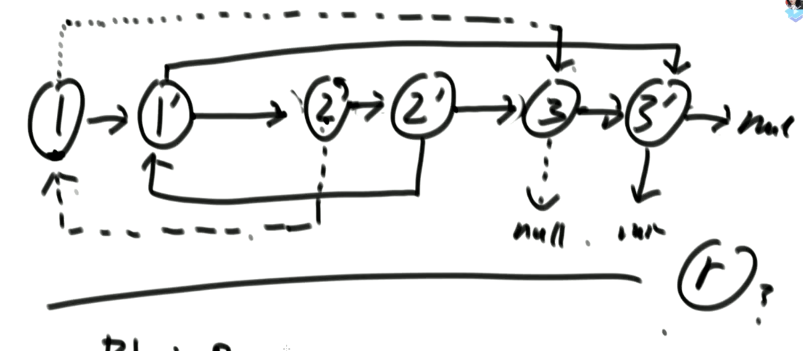

#### 141. 环形链表
**思路：1.使用map或set 放入检查 2.快慢指针如果有环他们会相遇**

> 在第二种思路下面，找到入环的点是当他们相遇时，让慢指针回到开头和快指针一次走一步，当他们再相遇时就是入环的点

#### 160. 相交链表
**如果题目要求两条链表有环，要先用141.环形链表来判断**

**1.两个都无环**
1. 方法一，使用set来进行判断
2. 方法二，先让一个链表走到末尾记录长度a，让另一个走到末尾记录长度b 让长度长的链表先走｜a-b｜步，然后两个同时开始走，一定会相交。
3. 方法三，定义两个指针,第一轮让两个到达末尾的节点指向另一个链表的头部,最后如果相遇则为交点(在第一轮移动中恰好抹除了长度差)两个指针等于移动了相同的距离,有交点就返回,无交点就是各走了两条指针的长度

**2.一个有环一个无环不可能相交**

**3.两个都有环**
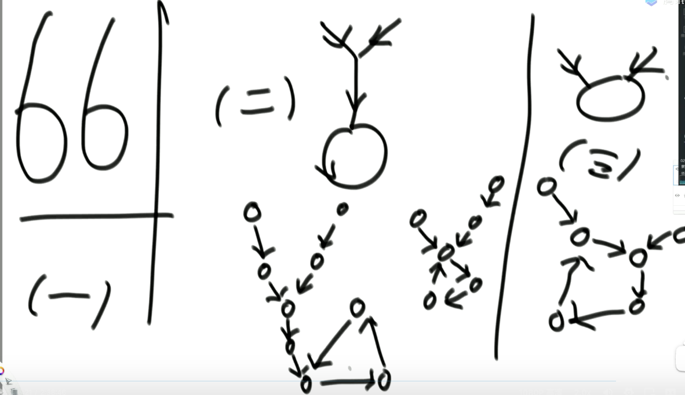
1. 先判断第二种，如果不是第二种，那么让loop1（第一个入环节点）转一圈看有没有遇到loop2，如果没有遇到那就是返回null，如果遇见返回loop1或者loop2都行
2. 第二种先判断入环节点是不是同一个，如果是就不用考虑了，光考虑前面的。
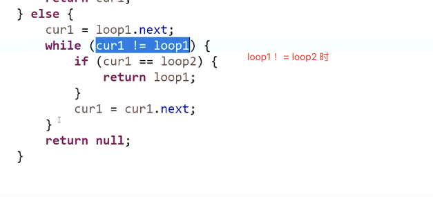

### 双向链表
#### LRU 缓存
```python
class DLinkListNode:
    def __init__(self, key=0, val=0, pre=None, next=None):
        self.key = key
        self.val = val
        self.pre = pre
        self.next = next

class LRUCache:

    def __init__(self, capacity: int):
        self.map = dict()
        self.head = DLinkListNode(-1, -1)
        self.tail = DLinkListNode(-1, -1)
        self.cap = capacity
        self.size = 0
        self.head.next = self.tail
        self.tail.pre = self.head


    def get(self, key: int) -> int:
        node = self.map.get(key, None)
        if node:
            node.next.pre = node.pre
            node.pre.next = node.next
            node.pre = self.head
            self.head.next.pre = node
            node.next = self.head.next
            self.head.next = node
            return node.val
        else:
            return -1


    def put(self, key: int, value: int) -> None:
        node = self.map.get(key, None)
        if node:
            node.val = value
            node.next.pre = node.pre
            node.pre.next = node.next

            node.pre = self.head
            self.head.next.pre = node
            node.next = self.head.next
            self.head.next = node

        else:
            if self.size == self.cap:
                del_node = self.tail.pre
                self.tail.pre = del_node.pre
                del_node.pre.next = self.tail
                self.map.pop(del_node.key)
                del_node.pre = None
                del_node.next = None
                self.size -= 1

            cur =  DLinkListNode(key, value)
            cur.pre = self.head
            self.head.next.pre = cur
            cur.next = self.head.next
            self.head.next = cur
            self.map[key] = cur
            self.size += 1
```

## 树
### 二叉树
#### 递归序
**每个节点都会返回自己三次，能从左树拿信息，右树拿信息**
#### 先序 中序 后序遍历
```python
# 先序
class Solution:
    def preorderTraversal(self, root: Optional[TreeNode]) -> List[int]:
        arr = []
        def process(root):
            if not root:
                return
            arr.append(root.val)
            process(root.left)
            process(root.right)
        process(root)
        return arr
        
# 非递归
class Solution:
    def preorderTraversal(self, root: Optional[TreeNode]) -> List[int]:
        arr = []
        if not root:
            return []
        stk = []
        stk.append(root)
        while stk:
            node = stk.pop()
            arr.append(node.val)
            if node.right:
                stk.append(node.right)
            if node.left:
                stk.append(node.left)
        return arr
# 中序
class Solution:
    def inorderTraversal(self, root: Optional[TreeNode]) -> List[int]:
        arr = []
        def process(root):
            if not root:
                return
            process(root.left)
            arr.append(root.val)
            process(root.right)
        process(root)
        return arr
# 非递归
class Solution:
    def inorderTraversal(self, root: Optional[TreeNode]) -> List[int]:
        arr = []
        stk = []
        while root or stk:
            while root:
                stk.append(root)
                root = root.left
            root = stk.pop()
            arr.append(root.val)
            root = root.right
        return arr
# 后序
class Solution:
    def inorderTraversal(self, root: Optional[TreeNode]) -> List[int]:
        arr = []
        def process(root):
            if not root:
                return
            process(root.left)
            arr.append(root.val)
            process(root.right)
        process(root)
        return arr
        
class Solution:
    def postorderTraversal(self, root: Optional[TreeNode]) -> List[int]:
        arr = []
        if not root:
            return []
        stk = []
        stk.append(root)
        while stk:
            node = stk.pop()
            arr.append(node.val)
            if node.left:
                stk.append(node.left)
            if node.right:
                stk.append(node.right)
        return arr[::-1]
        
class Solution:
    def postorderTraversal(self, root: Optional[TreeNode]) -> List[int]:
        arr = []
        if not root:
            return []
        stk = []
        node = None
        stk.append(root)
        while stk:
            node = stk[-1]
            if node.left and root != node.left and root != node.right:
                stk.append(node.left)
            elif node.right and root != node.right:
                stk.append(node.right)
            else:
                arr.append(stk.pop().val)
                root = node
        return arr
```

#### 层序遍历
##### 最大宽度
用map来实现 记录每个节点的层数
用标记不同层的最右节点来实现 **用flag标记**
```python
class Solution:
    def widthOfBinaryTree(self, root: Optional[TreeNode]) -> int:
        if not root:
            return 0
        from collections import deque
        deq = deque([root])
        res = 0
        while deq:
            size = len(deq)
            res = max(res, size)
            for i in range(size):
                node = deq.popleft()
                if node.left:
                    deq.append(node.left)
                if node.right:
                    deq.append(node.right)
        return res
```

##### 二叉树序列化与反序列化
```python
def serialize(self, root):
    arr = []
    ser(root)
    def ser(root):
        if root:
            arr.append(root.val)
            ser(root.left)
            ser(root.right)
        else:
            arr.append(None)

```

##### 给你某个节点，返回该节点的后继节点

**后继节点是指中序遍历的后一个节点**
**思路：1.如果有右孩子，则寻找右孩子最左的孩子 2.如果没有右孩子，则寻找父节点看当前节点是不是父节点的左孩子**
```python
class TreeNode:
    def __init__(self, val=0, left=None, right=None, parent=None):
        self.val = val
        self.left = left
        self.right = right
        self.parent = parent
       
        
def getsuccessorNode(node):
    if not node:
        return node
    if node.right:
        return getLeftMost(node.right)
    else:
        parent = node.parent
        while parent and parent.left != node:
            node = parent
            parent = node.parent
        return parent


def getLeftMost(node):
    if not node:
        return node
    while node.left:
        node = node.left
    return node

```

##### 折纸问题
请把一段纸条竖着放在桌子上，然后从纸条的下边向上方对折1次，压出折痕后展开。此时折痕是凹下去的，即折痕突起的方向指向纸条的背面。如果从纸条的下边向上方连续对折2次，压出折痕后展开，此时有三条折痕，从上到下依次是下折痕、下折痕和上折痕。给定一个输入参数N，代表纸条都从下边向上方连续对折N次，请从上到下打印所有折痕的方向。
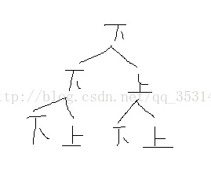

### 二叉树的递归套路
**本质是利用递归遍历二叉树的便利性。**
1. 假设以X节点为头,假设可以向X左树和X右树要任何信息
2. 在上一步的假设下,讨论以Ⅹ为头节点的树,得到答案的可能性（和x有关/和x无关）（最重要）
3. 列出所有可能性后,确定到底需要向左树和右树要什么样的信息
4. 把左树信息和右树信息求全集,就是任何一棵子树都需要返回的信息s
5. 递归函数都返回S,每一棵子树都这么要求
6. 写代码,在代码中考虑如何把左树的信息和右树信息整合出整棵树的信息

#### 派对的最大快乐值
整个公司的人员结构可以看作是一棵标准的多叉树。树的头节点是公司唯一的老板，除老板外，每个员工都有唯一的直接上级，叶节点是没有任何下属的基层员工，除基层员工外，每个员工都有一个或多个直接下级，另外每个员工都有一个快乐值。
这个公司现在要办 party，你可以决定哪些员工来，哪些员工不来。但是要遵循如下的原则：
1. 如果某个员工来了，那么这个员工的所有直接下级都不能来。
2. 派对的整体快乐值是所有到场员工快乐值的累加。
3. 你的目标是让派对的整体快乐值尽量大。

给定一棵多叉树，请输出派对的最大快乐值。
```python
def process(x):
    if x.nexts:
        return x.happy, 0
    yes = x.happy
    no = 0
    for next in x.nexts:
        y, n = process(next)
        yes += n
        no += max(yes, no)
    
    return  yes, no
```

### 前缀树
前缀树是**N叉树的一种特殊形式**。通常来说，一个前缀树是用来存储字符串的。前缀树的每一个节点代表一个字符串（前缀）。每一个节点会有多个子节点，通往不同子节点的路径上有着不同的字符。子节点代表的字符串是由节点本身的原始字符串，以及通往该子节点路径上所有的字符组成的。
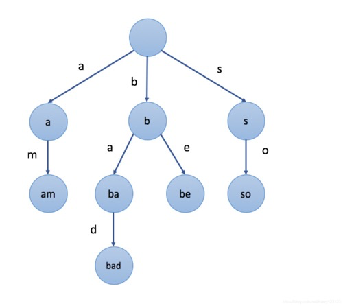

#### 数组实现
第一种方法是用数组存储子节点。

例如，如果我们只存储含有字母 a 到 z 的字符串，我们可以在每个节点中声明一个大小为26的数组来存储其子节点。对于特定字符 c，我们可以使用 c - ‘a’ 作为索引来查找数组中相应的子节点。
```python
# 简易版如果需要delete，则节点需要 将end和path元素变为int类型
class Trie:

    def __init__(self):
        self.children = [None] * 26
        self.isEnd = False

    def insert(self, word: str) -> None:
        if not word:
            return
        node = self
        for i in word:
            ch = ord(i) - ord('a')
            if not node.children[ch]:
                node.children[ch] = Trie()
            node = node.children[ch]
        node.isEnd = True


    def search(self, word: str) -> bool:
        if not word:
            return
        node = self
        for i in word:
            ch = ord(i) - ord('a')
            if not node.children[ch]:
                return False
            node = node.children[ch]
        return node.isEnd


    def startsWith(self, prefix: str) -> bool:
        if not prefix:
            return
        node = self
        for i in prefix:
            ch = ord(i) - ord('a')
            if not node.children[ch]:
                return False
            node = node.children[ch]
        return True
```

#### Map实现
第二种方法是使用 Hashmap 来存储子节点。

我们可以在每个节点中声明一个Hashmap。Hashmap的键是字符，值是相对应的子节点。
```python
class Trie:

    def __init__(self):
        """
        Initialize your data structure here.
        """
        self.map = {}


    def insert(self, word: str) -> None:
        """
        Inserts a word into the trie.
        """
        dic = self.map
        for i in word:
            dic = dic.setdefault(i, {})
        dic["end"] = True


    def search(self, word: str) -> bool:
        """
        Returns if the word is in the trie.
        """
        dic = self.map
        for i in word:
            dic = dic.get(i, None)
            if not dic:
                return False
        return dic.get("end", False)


    def startsWith(self, prefix: str) -> bool:
        """
        Returns if there is any word in the trie that starts with the given prefix.
        """
        dic = self.map
        for i in prefix:
            dic = dic.get(i, None)
            if not dic:
                return False
        return True


# Your Trie object will be instantiated and called as such:
# obj = Trie()
# obj.insert(word)
# param_2 = obj.search(word)
# param_3 = obj.startsWith(prefix)
```

## 栈
### 155. 最小栈
设计一个支持 push ，pop ，top 操作，并能在常数时间内检索到最小元素的栈。
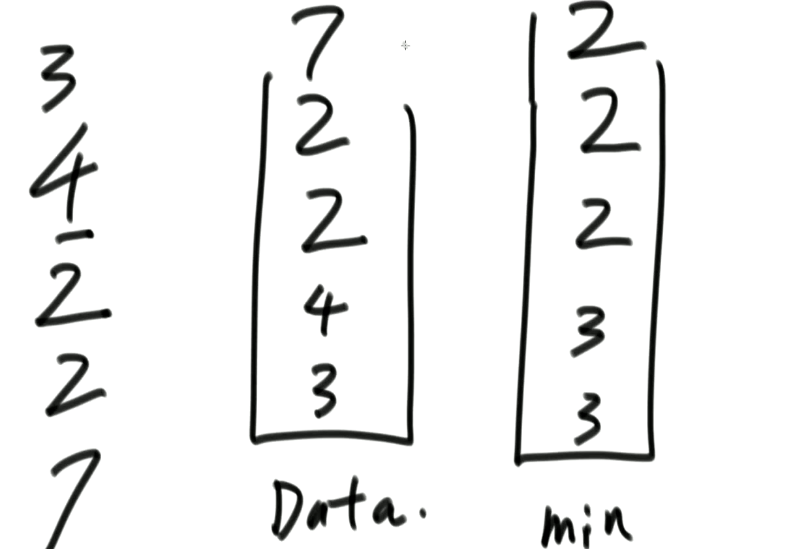
**设计一个最小栈，每次将新进入的数字与最小栈数字比，如果小雨就添加进去，如果大于就压入原来的数字**
```python
class MinStack:

    def __init__(self):
        """
        initialize your data structure here.
        """
        self.stack = []
        self.min_stack = [math.inf]


    def push(self, val: int) -> None:
        self.stack.append(val)
        self.min_stack.append(min(val, self.min_stack[-1]))

    def pop(self) -> None:
        self.stack.pop()
        self.min_stack.pop()


    def top(self) -> int:
        return self.stack[-1]

    def getMin(self) -> int:
        return self.min_stack[-1]
```

## 递归
**递归实际上利用的是系统的栈。**
### 递归时间复杂度master公式
**abd是常数**
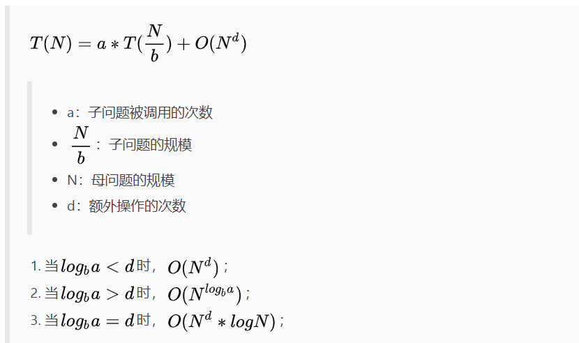

## 哈希表
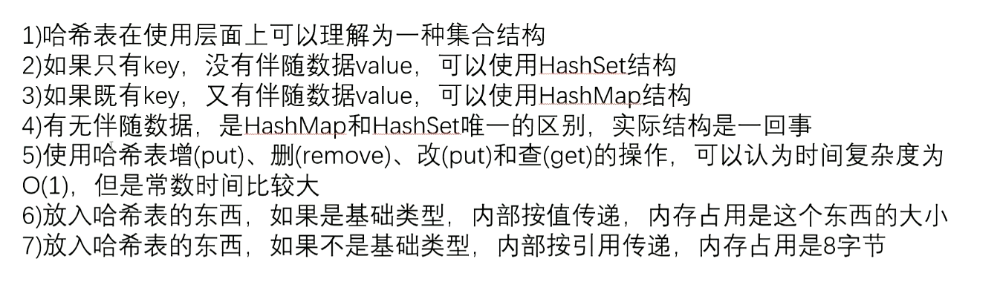
### 有序表
> java里面是treemap，python里面是collections.OrderedDict 时间复杂度是logn
```
>>> import collections

>>> x =collections.OrderedDict() #有序字典

>>> x['a'] = 3

>>> x['b'] = 5

>>> x['c'] = 8

>>> x    #输出按输入的顺序输出

OrderedDict([('a', 3), ('b', 5),('c', 8)])
```

## 贪心算法
1. 最自然智慧的算法
2. 用一种局部最功利的标准,总是做出在当前看来是最好的选择
3. 难点在于证明局部最功利的标准可以得到全局最优解
4. 对于贪心算法的学习主要以增加阅历和经验为主
5. 一般贪心的时间复杂度为n！

### 贪心算法求解的标准过程
1. 分析业务
2. 根据业务逻辑找到不同的贪心策略
3. 对于能举出反例的策略直接跳过,不能举出反例的策略要证明有效性这往往是特别困难的,要求数学能力很高且不具有统一的技巧性

### 贪心算法的解题套路
1. 实现一个不依靠贪心策略的解法X,可以用最暴力的尝试
2. 脑补岀贪心策略A、贪心策略B、贪心策略C
3. 用解法X和对数器,用实验的方式得知哪个贪心策略正确
4. 不要去纠结贪心策略的证明

### 宣讲会议室最多
**一些项目要占用一个会议室宣讲，会议室不能同时容纳两个项目的宣讲。给你每一个项目开始的时间和结束的时间 。你来安排宣讲的日程，要求会议室进行的宣讲的场次最多。 返回最多的宣讲场次。**
> 使用结束时间来选择次序
```python
class Program:
    def __init__(self, start, end):
        self.start = start
        self.end = end


def best_arrange(programs):
    from functools import cmp_to_key
    def cmp(x, y):
        return x.end - y.end

    sorted(programs, key=cmp_to_key(cmp))
    timeline = 0
    res = 0
    for i in range(len(programs)):
        if timeline <= programs[i].start:
            res += 1
            timeline = programs[i].end
    return res
```

### 点灯问题
**给定一个字符串str，只由‘X’和‘.’两种字符构成。‘X’表示墙，不能放灯，也不需要点亮，‘.’表示居民点，可以放灯，需要点亮。如果灯放在i位置，可以让i-1，i和i+1三个位置被点亮。返回如果点亮str中所有需要点亮的位置，至少需要几盏灯。**
> 对灯及灯+1位置进行判断，如果是..则放在第二个点，不管后面是什么
```python
def min_light(str):
    light = 0
    index = 0
    while index < len(str):
        if str[index] == 'x':
            index += 1
        else:
            light += 1
            if index+1 == len(str):
                break
            else:
                if str[index+1] == 'x':
                    index += 2
                else:
                    index += 3
    return light
```

### 字符串拼接结果最小字典序问题
给定字符串类型数组strs，找出一种拼接顺序来拼接str中的字符串，使得最终生成的大字符串字典序最小，并返回该大字符串。

如"ba”、“b”可以拼接为“bba”和“bab”，两者相比“bab”字典序更小，因此返回“bab”
> 对于两个字符串str1、str2，如果str1+str2 < str2 + str1,str1就要放到str2的前面。
```python
def lowest_string(strs):
    from functools import cmp_to_key
    def cmp(x, y):
        if x+y > y+x:
            return 1
        elif x+y == y+x:
            return 0
        else:
            return -1
    arr = sorted(strs, key=cmp_to_key(cmp))
    str = ''
    for i in arr:
        str += i
    return str
```
### 分金子问题
**块金条切成两半,是需要花费和长度数值一样的铜板的。比如长度为20的金条,不管怎么切,都要花费20个铜板。一群人想整分整块金条,怎么分最省铜板?例如给定数组10.2030},代表一共三个人,整块金条长度为60,金条要分成10.20,30三个部分。**
> 用堆来实现，等同于哈夫曼树
```python
import heapq
def less_money(arr):
    heapq.heapify(arr)
    sum = 0
    while len(arr) > 1:
        cur = heapq.heappop(arr) + heapq.heappop(arr)
        sum += cur
        heapq.heappush(arr, cur)
    return sum
```

## 并查集
### 概念
1. 有若干个样本a、b、c、d类型假设是v
2. 在并查集中一开始认为每个样本都在单独的集合里
3. 用户可以在任何时候调用如下两个方法boolean is_Same_Set(x,Vy):查询样本x和样本y是否属于一个集合
void union(xVy):把x和y各自所在集合的所有样本合并成一个集合
4. is_Same:和union方法的代价越低越好
5. 查询次数多了可以让时间复杂度变为O(n)
### Java实现
```java
import java.util.HashMap;
import java.util.List;
import java.util.Stack;

public class Code05_UnionFind {

	public static class Node<V> {
		V value;

		public Node(V v) {
			value = v;
		}
	}

	public static class UnionFind<V> {
		public HashMap<V, Node<V>> nodes;
		public HashMap<Node<V>, Node<V>> parents;
		public HashMap<Node<V>, Integer> sizeMap;

		public UnionFind(List<V> values) {
			nodes = new HashMap<>();
			parents = new HashMap<>();
			sizeMap = new HashMap<>();
			for (V cur : values) {
				Node<V> node = new Node<>(cur);
				nodes.put(cur, node);
				parents.put(node, node);
				sizeMap.put(node, 1);
			}
		}

		// 给你一个节点，请你往上到不能再往上，把代表返回
		public Node<V> findFather(Node<V> cur) {
			Stack<Node<V>> path = new Stack<>();
			while (cur != parents.get(cur)) {
				path.push(cur);
				cur = parents.get(cur);
			}
			while (!path.isEmpty()) {
				parents.put(path.pop(), cur);
			}
			return cur;
		}

		public boolean isSameSet(V a, V b) {
			return findFather(nodes.get(a)) == findFather(nodes.get(b));
		}

		public void union(V a, V b) {
			Node<V> aHead = findFather(nodes.get(a));
			Node<V> bHead = findFather(nodes.get(b));
			if (aHead != bHead) {
				int aSetSize = sizeMap.get(aHead);
				int bSetSize = sizeMap.get(bHead);
				Node<V> big = aSetSize >= bSetSize ? aHead : bHead;
				Node<V> small = big == aHead ? bHead : aHead;
				parents.put(small, big);
				sizeMap.put(big, aSetSize + bSetSize);
				sizeMap.remove(small);
			}
		}

		public int sets() {
			return sizeMap.size();
		}

	}
}


```
### Python实现
```python
class UF:
    def __init__(self, M):
        self.parent = {}
        self.size = {}
        self.cnt = 0
        # 初始化 parent，size 和 cnt
        # size 是一个哈希表，记录每一个联通域的大小，其中 key 是联通域的根，value 是联通域的大小
        # cnt 是整数，表示一共有多少个联通域
        for i in range(M):
            self.parent[i] = i
            self.cnt += 1
            self.size[i] = 1

    def find(self, x):
        if x != self.parent[x]:
            self.parent[x] = self.find(self.parent[x])
            return self.parent[x]
        return x
    def union(self, p, q):
        if self.connected(p, q): return
        # 小的树挂到大的树上， 使树尽量平衡
        leader_p = self.find(p)
        leader_q = self.find(q)
        if self.size[leader_p] < self.size[leader_q]:
            self.parent[leader_p] = leader_q
            self.size[leader_q] += self.size[leader_p]
        else:
            self.parent[leader_q] = leader_p
            self.size[leader_p] += self.size[leader_q]
        self.cnt -= 1
    def connected(self, p, q):
        return self.find(p) == self.find(q)
```
```python
class UnionFind:
    def __init__(self, arr):
        self.dict_parent = dict()
        self.parent_size = dict()
        for i in arr:
            self.dict_parent[i] = i
            self.parent_size[i] = 1

    def is_same_set(self, a, b):
        return self.find_parent(a) == self.find_parent(b)

    def find_parent(self, x):
        stack = []
        while x != self.dict_parent.get(x):
            stack.append(x)
            x = self.dict_parent.get(x)

        while len(stack) > 0:
            self.dict_parent[stack.pop()] = x

        return x

    def union(self, a, b):
        ahead = self.find_parent(a)
        bhead = self.find_parent(b)
        if ahead != bhead:
            big = ahead if self.parent_size.get(ahead) > self.parent_size.get(bhead) else bhead
            small = ahead if big != bhead else ahead
            self.dict_parent[small] = big
            self.parent_size[big] = self.parent_size[big]+self.parent_size[small]
            del self.parent_size[small]


if __name__ == '__main__':
    uf = UnionFind([1,2,3,4,5])
    print(uf.is_same_set(1,2))
    print(uf.union(1, 2))
    print(uf.is_same_set(1, 2))
```

## 图
### 概念
1. 由点的集合和边的集合构成
2. 虽然存在有向图和无向图的概念,但实际上都可以用有向图来表达
3. 边上可能带有权值
### 常见表达方法
1. 邻接表法
2. 邻接矩阵法
3. 除此之外还有很多种
### 图的面试题如何搞定
1. 图的算法都不算难,只不过 coding的代价比较高
2. 先用自己最熟练的方式,实现图结构的表达
3. 在自己熟悉的结构上,实现所有常用的图算法作为模板
4. 把面试题提供的图结构转化为自己熟悉的图结构,再调用模板或改写即可
### 图的代码
```python
class Node:
    def __init__(self, value):
        self.value = value
        self.enter = 0
        self.out = 0
        self.nexts = []
        self.edges = []


class Edge:
    def __init__(self, weight, fr, to):
        self.weight = weight
        self.fr = fr
        self.to = to
        

class Graph:
    def __init__(self):
        self.nodes = dict()
        self.edges = set()
```
### 宽度优先遍历&深度优先遍历
**bfs可以求两个位置之间的最短距离，第一次搜索到的距离就是最短距离**
```python
from collections import deque

# bfs可以求两个位置之间的最短距离，第一次搜索到的距离就是最短距离
def bfs(start):
    if not start:
        return
    queue = deque()
    st = set()
    queue.append(start)
    st.add(start)
    while queue:
        cur = queue.popleft()
        print(cur.value)
        for next in cur.nexts:
            if next not in set:
                set.add(next)
                queue.append(next)


def dfs(start):
    if not start:
        return
    stack = []
    st = set()
    stack.append(start)
    st.add(start)
    print(start.value)
    while stack:
        cur = stack.pop()
        for next in cur.nexts:
            if next not in st:
                stack.append(cur)
                stack.append(next)
                st.add(next)
                print(next.value)
                break
```

### 拓扑排序
```python
from collections import deque
def sorted_topology(graph):
    # key 节点 value 剩余入度
    in_map = dict()
    # 只有剩余入度为0的点，才进入这个队列
    zero_queue = deque()
    for node in graph.nodes.values():
        in_map.update({node, node.enter})
        if not node.enter:
            zero_queue.append(node)
            
    result = []
    while zero_queue:
        cur = zero_queue.popleft()
        result.append(cur)
        for next in cur.nexts:
            in_map.update({next, in_map.get(next)-1})
            if in_map.get(next) == 0:
                zero_queue.append(node)
                
    return result
```
### Floyd-Warshall
简单来说就是： **i 到 j 的最短路径 = 所有 i 到 k 的最短路径 + k 到 j 的最短路径的最小值**。其中 k 就是中间节点。我们可以枚举 k，（k 可能是除了 i 和 j 的其他所有点）然后更新答案。
```python
# graph 是邻接矩阵，n 是顶点个数
# graph 形如： graph[u][v] = w
def floyd_warshall(graph, n):
    dist = [[float("inf") for _ in range(n)] for _ in range(n)]

    for i in range(n):
        for j in range(n):
            dist[i][j] = graph[i][j]

    # check vertex k against all other vertices (i, j)
    for k in range(n):
        # looping through rows of graph array
        for i in range(n):
            # looping through columns of graph array
            for j in range(n):
                if (
                    dist[i][k] != float("inf")
                    and dist[k][j] != float("inf")
                    and dist[i][k] + dist[k][j] < dist[i][j]
                ):
                    dist[i][j] = dist[i][k] + dist[k][j]
    return dist
```
### 最小生成树Kruskal
**使用并查集！！将不同的边连起来**
1. 总是从权值最小的边开始考虑,依次考察权值依次变大的边
2. 当前的边要么进入最小生成树的集合,要么丢弃
3. 如果当前的边进入最小生成树的集合中不会形成环,就要当前边
4. 如果当前的边进入最小生成树的集合中会形成环,就不要当前边
5. 考察完所有边之后,最小生成树的集合也得到了

### 最小生成树prim
**Prim算法从任意一个顶点开始，每次选择一个与当前顶点集最近的一个顶点，并将两顶点之间的边加入到树中。Prim算法在找当前最近顶点时使用到了贪婪算法。**

### Dijkstra算法
**更好的实现是自己创建一个堆，可以边改堆上的值边维持小根堆**
*值得注意的是， Dijkstra 无法处理边权值为负的情况。*
Dijkstra算法算是贪心思想实现的，首先把起点到所有点的距离存下来找个最短的，然后松弛一次再找出最短的，所谓的松弛操作就是，遍历一遍看通过刚刚找到的距离最短的点作为中转站会不会更近，如果更近了就更新距离，这样把所有的点找遍之后就存下了起点到其他所有点的最短距离。
```python
import heapq


def dijkstra(graph, start, end):
    # 堆里的数据都是 (cost, i) 的二元祖，其含义是“从 start 走到 i 的距离是 cost”。
    heap = [(0, start)]
    visited = set()
    while heap:
        (cost, u) = heapq.heappop(heap)
        if u in visited:
            continue
        visited.add(u)
        if u == end:
            return cost
        for v, c in graph[u]:
            if v in visited:
                continue
            next = cost + c
            heapq.heappush(heap, (next, v))
    return -1
```
```java
public static HashMap<Node, Integer> dijkstra1(Node from) {
		HashMap<Node, Integer> distanceMap = new HashMap<>();
		distanceMap.put(from, 0);
		// 打过对号的点
		HashSet<Node> selectedNodes = new HashSet<>();
		Node minNode = getMinDistanceAndUnselectedNode(distanceMap, selectedNodes);
		while (minNode != null) {
			//  原始点  ->  minNode(跳转点)   最小距离distance
			int distance = distanceMap.get(minNode);
			for (Edge edge : minNode.edges) {
				Node toNode = edge.to;
				if (!distanceMap.containsKey(toNode)) {
					distanceMap.put(toNode, distance + edge.weight);
				} else { // toNode 
					distanceMap.put(edge.to, Math.min(distanceMap.get(toNode), distance + edge.weight));
				}
			}
			selectedNodes.add(minNode);
			minNode = getMinDistanceAndUnselectedNode(distanceMap, selectedNodes);
		}
		return distanceMap;
	}

	public static Node getMinDistanceAndUnselectedNode(HashMap<Node, Integer> distanceMap, HashSet<Node> touchedNodes) {
		Node minNode = null;
		int minDistance = Integer.MAX_VALUE;
		for (Entry<Node, Integer> entry : distanceMap.entrySet()) {
			Node node = entry.getKey();
			int distance = entry.getValue();
			if (!touchedNodes.contains(node) && distance < minDistance) {
				minNode = node;
				minDistance = distance;
			}
		}
		return minNode;
	}
```
#### 堆实现
```java
public static class NodeHeap {
		private Node[] nodes; // 实际的堆结构
		// key 某一个node， value 上面堆中的位置
		private HashMap<Node, Integer> heapIndexMap;
		// key 某一个节点， value 从源节点出发到该节点的目前最小距离
		private HashMap<Node, Integer> distanceMap;
		private int size; // 堆上有多少个点

		public NodeHeap(int size) {
			nodes = new Node[size];
			heapIndexMap = new HashMap<>();
			distanceMap = new HashMap<>();
			size = 0;
		}

		public boolean isEmpty() {
			return size == 0;
		}

		// 有一个点叫node，现在发现了一个从源节点出发到达node的距离为distance
		// 判断要不要更新，如果需要的话，就更新
		public void addOrUpdateOrIgnore(Node node, int distance) {
			if (inHeap(node)) {
				distanceMap.put(node, Math.min(distanceMap.get(node), distance));
				insertHeapify(node, heapIndexMap.get(node));
			}
			if (!isEntered(node)) {
				nodes[size] = node;
				heapIndexMap.put(node, size);
				distanceMap.put(node, distance);
				insertHeapify(node, size++);
			}
		}

		public NodeRecord pop() {
			NodeRecord nodeRecord = new NodeRecord(nodes[0], distanceMap.get(nodes[0]));
			swap(0, size - 1);
			heapIndexMap.put(nodes[size - 1], -1);
			distanceMap.remove(nodes[size - 1]);
			// free C++同学还要把原本堆顶节点析构，对java同学不必
			nodes[size - 1] = null;
			heapify(0, --size);
			return nodeRecord;
		}

		private void insertHeapify(Node node, int index) {
			while (distanceMap.get(nodes[index]) < distanceMap.get(nodes[(index - 1) / 2])) {
				swap(index, (index - 1) / 2);
				index = (index - 1) / 2;
			}
		}

		private void heapify(int index, int size) {
			int left = index * 2 + 1;
			while (left < size) {
				int smallest = left + 1 < size && distanceMap.get(nodes[left + 1]) < distanceMap.get(nodes[left])
						? left + 1
						: left;
				smallest = distanceMap.get(nodes[smallest]) < distanceMap.get(nodes[index]) ? smallest : index;
				if (smallest == index) {
					break;
				}
				swap(smallest, index);
				index = smallest;
				left = index * 2 + 1;
			}
		}

		private boolean isEntered(Node node) {
			return heapIndexMap.containsKey(node);
		}

		private boolean inHeap(Node node) {
			return isEntered(node) && heapIndexMap.get(node) != -1;
		}

		private void swap(int index1, int index2) {
			heapIndexMap.put(nodes[index1], index2);
			heapIndexMap.put(nodes[index2], index1);
			Node tmp = nodes[index1];
			nodes[index1] = nodes[index2];
			nodes[index2] = tmp;
		}
	}

	// 改进后的dijkstra算法
	// 从head出发，所有head能到达的节点，生成到达每个节点的最小路径记录并返回
	public static HashMap<Node, Integer> dijkstra2(Node head, int size) {
		NodeHeap nodeHeap = new NodeHeap(size);
		nodeHeap.addOrUpdateOrIgnore(head, 0);
		HashMap<Node, Integer> result = new HashMap<>();
		while (!nodeHeap.isEmpty()) {
			NodeRecord record = nodeHeap.pop();
			Node cur = record.node;
			int distance = record.distance;
			for (Edge edge : cur.edges) {
				nodeHeap.addOrUpdateOrIgnore(edge.to, edge.weight + distance);
			}
			result.put(cur, distance);
		}
		return result;
	}
```

### 二分图（染色法）
785. 判断二分图
```python
class Solution:
    def isBipartite(self, graph: List[List[int]]) -> bool:
        def dfs(colors, color, i, graph):
            colors[i] = color
            if len(graph[i]) == len(graph)-1:
                return False
            for j in graph[i]:
                if colors[j] == 0 and not dfs(colors, -1*color, j, graph):
                    return False
                if color == colors[j]:
                    return False
            return True
                
        if len(graph)==1 and len(graph[0])==0:
            return True
        colors = [0] * len(graph)
        for i in range(len(colors)):
            if colors[i]==0 and not dfs(colors, 1, i, graph):
                return False
        return True
```

## 暴力递归
**暴力递归就是尝试。大部分时候就是自然智慧的全排列**
1. 把问题转化为规模缩小了的同类问题的子问题
2. 有明确的不需要继续进行递归的条件( base case)
3. 有当得到了子问题的结果之后的决策过程
4. 不记录每一个子问题的解
### 常见的四种尝试模型
1. 从左往右的尝试模型
2. 范围上的尝试模型
3. 多样本位置全对应的尝试模型
4. 寻找业务限制的尝试模型

### 原地逆转栈
```python
def reverse(stack):
    if not stack:
        return
    i = f(stack)
    reverse(stack)
    stack.append(i)
    return stack

def f(stack):
    res = stack.pop()
    if not stack:
        return res
    else:
        last = f(stack)
        stack.append(res)
        return last

stack = []
stack.append(1)
stack.append(2)
stack.append(3)
stack.append(4)
print(reverse(stack))
```
### 51. N 皇后
**想要优化只能位运算，优化的是常数时间**
```python
class Solution:
    def solveNQueens(self, n: int) -> List[List[str]]:
        # i表示当前在排第几层 n表示总共几层
        def process(i, record, n):
            if i == n:
                res.append(generateBoard(record))
            for j in range(n):
                if is_valid(i, j, record):
                    record[i] = j
                    process(i+1, record, n)

        # 判断在i层放在j位置可行与否
        def is_valid(i, j, record):
            # x是层，y是每一层的列数
            for x in range(i):
                # 每层必须满足45度和135度不共线 同时不能出现过
                if record[x] == j or abs(x-i) == abs(record[x]-j):
                    return False
            return True
        def generateBoard(record):
            board = list()
            for n in record:
                row[n] = "Q"
                board.append("".join(row))
                row[n] = "."
            return board

        res = []
        row = ["."] * n
        record = [-1] * n
        process(0, record, n)
        return res
```
#### 位运算
```java
class Main {
    public static int num(int num) {
        if (num < 1 || num > 32) return 0;
        //limit用于限制在所有数据运算过程中保证除后num位的所有位数据均为零，来判断结束和标志结束
        int limit = num == 32 ? -1 : (1 << num) - 1;
        return process(limit, 0, 0, 0);
    }

    /**
     * @param limit    限制数据在一定的位运算范围内
     * @param coLim    该步前所有皇后纵向上已经存在皇后
     * @param leftLim  该步前所有皇后在k=-1的方向上对于我们该步皇后存在的限制
     * @param rightLim 该步前所有皇后在k=1的方向上对于我们该步皇后存在的限制
     * @return 该路径上存在的的情况，只会在成功时返回1
     * coLim/leftLim/rightLim三者的限制均是在位上为1的时候表示存在皇后
     */
    private static int process(int limit, int coLim, int leftLim, int rightLim) {
        if (limit == coLim) return 1;

        //(coLim | leftLim | rightLim)结果表示所有位上为1的位置均存在皇后，不能存放。
        //~后表示1的地方没有限制，可以存放皇后（但是，在32位的前32-num位上也为1，我们知道这是不合理的，因为不存在那么多的皇后）
        //limit&    表示将除num位的值变成0，这样就保证所有为1的元素均为空缺位置。
        int pos = limit & (~(coLim | leftLim | rightLim));
        int res = 0, mostRightOne;
        while (pos != 0) {//pos为0.说明不存在空缺位置
            mostRightOne = pos & (~pos + 1);//此时在后num位存在1，就将最右端的1取出。
            res += process(limit, coLim | mostRightOne  // 该mostRightOne位的皇后对于下一皇后纵向上的影响
                    , (leftLim | mostRightOne) << 1     // mostRightOne对于k=-1方向的影响
                    , (rightLim | mostRightOne) >> 1);  //mostRightOne对于k=1方向的影响
            pos = pos - mostRightOne;//更新pos，将取出的1减掉，表明mostRightOne中1所对应的位存在了，不能放了。
        }
        return res;
    }
}
```
### 从左往右的尝试模型
#### 全排列
**注意数组是引用类型，如果直接append进另一个数组所有的会保持一致**
```python
class Solution:
    def permute(self, nums: List[int]) -> List[List[int]]:
        ans = []
        def process(nums, index, ans):
            if len(nums) == index:
                # 注意数组是引用类型
                cop = [i for i in nums]
                ans.append(cop)
            else:
                for i in range(index, len(nums)):
                    nums[index], nums[i] = nums[i], nums[index]
                    process(nums, index+1, ans)
                    nums[index], nums[i] = nums[i], nums[index]

        process(nums, 0, ans)
        return ans
```
#### 字符串子序列
```java
// str 固定参数
	// 来到了str[index]字符，index是位置
	// str[0..index-1]已经走过了！之前的决定，都在path上
	// 之前的决定已经不能改变了，就是path
	// str[index....]还能决定，之前已经确定，而后面还能自由选择的话，
	// 把所有生成的子序列，放入到ans里去
	public static void process1(char[] str, int index, List<String> ans, String path) {
		if (index == str.length) {
			ans.add(path);
			return;
		}
		// 没有要index位置的字符
		process1(str, index + 1, ans, path);
		// 要了index位置的字符
		process1(str, index + 1, ans, path + String.valueOf(str[index]));
	}
	public static void process2(char[] str, int index, HashSet<String> set, String path) {
		if (index == str.length) {
			set.add(path);
			return;
		}
		String no = path;
		process2(str, index + 1, set, no);
		String yes = path + String.valueOf(str[index]);
		process2(str, index + 1, set, yes);
	}
```
#### 背包问题
给定两个长度都为N的数组 Weights和 values，weights和 values分别代表号物品的重量和价值。给定一个正数bag,表示一个载重bag的袋子你装的物品不能超过这个重量。返回你能装下最多的价值是多少?
```python
# rest 剩余重量，index是选过的项目
def process(w, v, rest, index):
    if rest<0:
        return -1
    if index==len(w):
        return 0
    p1 = process(w, v, rest, index+1)
    next = process(w, v, rest-w[index], index+1)
    p2 = 0
    if next!=-1:
        p2 = v[index] + next
    return max(p1, p2)

def maxValue(w, v, bag):
    if not w or not v:
        return 0
    return process(w, v, bag, 0)
```
##### 动态规划
```python
def maxValue(w, v, bag):
    if not w or not v:
        return 0
    dp = [[0 for _ in range(bag+1)] for _ in range(len(w)+1)]
    for index in range(len(w)-1, -1, -1):
        for rest in range(bag+1):
            p1 = dp[index+1][rest]
            next = -1 if rest-w[index] < 0 else dp[index+1][rest-w[index]]
            p2 = 0
            if next != -1:
                p2 = v[index] + next
            dp[index][rest] = max(p1, p2)

    return dp[0][bag]
```

### 范围上的尝试模型
#### 486. 预测赢家
给定一个整型数组ar,代表数值不同的纸牌排成一条线玩家A和玩家B依次拿走每张纸牌,规定玩家A先拿,玩家B后拿,但是每个玩家每次只能拿走最左或最右的纸牌玩家A和玩家B都绝顶聪明。请返回最后获胜者的分数。
#### 暴力递归
```python
class Solution:
    def PredictTheWinner(self, nums: List[int]) -> bool:
        def f1(L, R, nums):
            if L == R:
                return nums[L]
            p1 = nums[L] + g1(L+1,R,nums)
            p2 = nums[R] + g1(L,R-1,nums)
            return max(p1,p2)
        def g1(L, R, nums):
            if L == R:
                return 0
            p1 = f1(L+1,R,nums)
            p2 = f1(L,R-1,nums)
            return min(p1,p2)
        
        p1 = f1(0, len(nums)-1, nums)
        p2 = g1(0, len(nums)-1, nums)
        return p1 >= p2
```
#### 动态规划
```python
class Solution:
    def PredictTheWinner(self, nums: List[int]) -> bool:    
        n = len(nums)
        dp1 = [[0 for _ in range(n)] for _ in range(n)]
        dp2 = [[0 for _ in range(n)] for _ in range(n)]
        for i in range(n):
            dp1[i][i] = nums[i]
        for i in range(1, n):
            L = 0
            R = i
            while R<n:
                dp1[L][R] = max(nums[L] + dp2[L+1][R], nums[R] + dp2[L][R-1])
                dp2[L][R] = min(dp1[L+1][R], dp1[L][R-1])
                L += 1
                R += 1

        return dp1[0][n-1] >= dp2[0][n-1]
```

### 多样本位置全对应的尝试模型
#### 1143. 最长公共子序列
```python
class Solution:
    def longestCommonSubsequence(self, text1: str, text2: str) -> int:
        # 思路 设定一个二维的dp数组代表两个字符串的index 表达的是[0..i][0..j]的最长公共子序列
        dp = [[0 for _ in range(len(text2))] for i in range(len(text1))]
        dp[0][0] = 1 if text1[0] == text2[0] else 0
        # 判断 当text1只有一个和对方匹配 当text2只有一个和对方匹配
        for i in range(1, len(dp[0])):
            dp[0][i] = 1 if text1[0] == text2[i] else dp[0][i-1]
        for i in range(1, len(dp)):
            dp[i][0] = 1 if text1[i] == text2[0] else dp[i-1][0]
        # 任何一个点存在四种情况：
        # a) 最长公共子序列，一定不以str1[i]字符结尾、也一定不以str2[j]字符结尾 dp[i][j] = dp[i-1][j-1]
	    # b) 最长公共子序列，可能以str1[i]字符结尾、但是一定不以str2[j]字符结尾 dp[i][j] = dp[i][j-1]
	    # c) 最长公共子序列，一定不以str1[i]字符结尾、但是可能以str2[j]字符结尾 dp[i][j] = dp[i-1][j]
	    # d) 最长公共子序列，必须以str1[i]字符结尾、也必须以str2[j]字符结尾 str1[i]==str2[j] 同时 dp[i][j] = dp[i-1][j-1]+1
        for i in range(1, len(dp)):
            for j in range(1, len(dp[0])):
                # 可能bcd 或者 abc 三种情况都同时存在，要从三者中找出最长的子序列
                p1 = dp[i][j-1]
                p2 = dp[i-1][j]
                p3 = dp[i-1][j-1]+1 if text1[i]==text2[j] else 0
                dp[i][j] = max(max(p1, p2),p3)
                # 这么写更快
                # if text1[i] == text2[j]:
                #     dp[i][j] = dp[i - 1][j - 1] + 1
                # else:
                #     dp[i][j] = max(dp[i - 1][j], dp[i][j - 1])
        return dp[len(text1)-1][len(text2)-1]
```
### 寻找业务限制的尝试模型
#### 拿咖啡
// 每个人喝完之后咖啡杯可以选择洗或者自然挥发干净，只有一台洗咖啡杯的机器，只能串行的洗咖啡杯。
// 洗杯子的机器洗完一个杯子时间为a，任何一个杯子自然挥发干净的时间为b。
// 四个参数：arr, n, a, b
// 假设时间点从0开始，返回所有人喝完咖啡并洗完咖啡杯的全部过程结束后，至少来到什么时间点。
##### 暴力递归
```java
	// drinks 所有杯子可以开始洗的时间
	// wash 单杯洗干净的时间（串行）
	// air 挥发干净的时间(并行)
	// free 洗的机器什么时候可用
	// drinks[index.....]都变干净，最早的结束时间（返回）
	public static int bestTime(int[] drinks, int wash, int air, int index, int free) {
		if (index == drinks.length) {
			return 0;
		}
		// index号杯子 决定洗
		int selfClean1 = Math.max(drinks[index], free) + wash;
		int restClean1 = bestTime(drinks, wash, air, index + 1, selfClean1);
		int p1 = Math.max(selfClean1, restClean1);

		// index号杯子 决定挥发
		int selfClean2 = drinks[index] + air;
		int restClean2 = bestTime(drinks, wash, air, index + 1, free);
		int p2 = Math.max(selfClean2, restClean2);
		return Math.min(p1, p2);
	}
```
##### 动态规划
```java
public static int bestTimeDp(int[] drinks, int wash, int air) {
	int N = drinks.length;
	int maxFree = 0;
	for (int i = 0; i < drinks.length; i++) {
		maxFree = Math.max(maxFree, drinks[i]) + wash;
	}
	int[][] dp = new int[N + 1][maxFree + 1];
	for (int index = N - 1; index >= 0; index--) {
		for (int free = 0; free <= maxFree; free++) {
			int selfClean1 = Math.max(drinks[index], free) + wash;
			if (selfClean1 > maxFree) {
				break; // 因为后面的也都不用填了
			}
			// index号杯子 决定洗
			int restClean1 = dp[index + 1][selfClean1];
			int p1 = Math.max(selfClean1, restClean1);
			// index号杯子 决定挥发
			int selfClean2 = drinks[index] + air;
			int restClean2 = dp[index + 1][free];
			int p2 = Math.max(selfClean2, restClean2);
			dp[index][free] = Math.min(p1, p2);
		}
	}
	return dp[0][0];
}
```
## 暴力递归改动态规划
1. 将递归重复的步骤进行傻缓存（记忆化搜索）
2. 将记忆化搜索精细化组织就是经典动态规划，步骤是：直接根据暴力递归的方法找到dp的公式，直接创建好dp数组按照暴力递归的过程进行修改dp数组，不用再递归。
3. 时间复杂度（背包问题为例子）：暴力递归O2^n 记忆化搜索和经典动态规划都是On*bag （无**枚举行为**（有限几个子问题/状态），记忆化搜索和经典动态规划时间复杂度一样）
### 动态规划本质
**就是将参数组合完成结构化的过程**

### 什么暴力递归可以继续优化?
1. 有重复调用同一个子问题的解,这种递归可以优化
2. 如果每一个子问题都是不同的解,无法优化也不用优化

### 面试题和动态规划的关系
- 解决一个问题,可能有很多尝试方法
- 可能在很多尝试方法中,又有若干个尝试方法有动态规划的方式
- 一个问题可能有若干种动态规划的解法

### 面试中设计暴力递归过程的原则
1. 每一个可变参数的类型,一定不要比int类型更加复杂
2. 原则1可以违反,让类型突破到一维线性结构,那必须是唯一可变参数
3. 如果发现原则1被违反,但不违反原则2,只需要做到记忆化搜索即可
4. 可变参数的个数,能少则少

### 518. 零钱兑换 II(有枚举)
#### 暴力递归
```python
def process2(coins, index, rest):
    if index == len(coins):
        return 1 if rest == 0 else 0
    ways = 0
    zhang = 0
    while zhang * coins[index] <= rest:
        ways += process2(coins, index + 1, rest - zhang * coins[index])
        zhang += 1
    return ways
```
#### 记忆化搜索
```python
class Solution:
    def change(self, amount: int, coins: List[int]) -> int:
        def process3(coins, index, rest, dp):
            if dp[index][rest] != -1:
                return dp[index][rest]
            if index == len(coins):
                dp[index][rest] = 1 if rest == 0 else 0
                return dp[index][rest]
            ways = 0
            zhang = 0
            while zhang * coins[index] <= rest:
                ways += process3(coins, index + 1, rest - zhang * coins[index],dp)
                zhang += 1
            dp[index][rest] = ways
            return dp[index][rest]
        dp = [[-1 for _ in range(amount+1)]for _ in range(len(coins)+1)]
        return process3(coins, 0, amount, dp)
```
#### 非递归记忆化搜索
```python
def way4(coins, amount):
    dp = [[0 for _ in range(amount + 1)] for _ in range(len(coins) + 1)]
    dp[len(coins)][0] = 1
    for index in range(len(coins)-1, -1, -1):
        for rest in range(amount+1):
            ways = 0
            zhang = 0
            while zhang * coins[index] <= rest:
                ways += dp[index + 1][rest - zhang * coins[index]]
                zhang += 1
            dp[index][rest] = ways

    return dp[0][amount]

```
#### 经典动态规划
dp[index][rest] 是由 多个[index + 1][rest - zhang * coins[index]]组成的 抽象为dp[index][rest-coins[index]]+dp[index+1][rest]
```python
class Solution:
    def change(self, amount: int, coins: List[int]) -> int:

        dp = [[0 for _ in range(amount + 1)] for _ in range(len(coins) + 1)]
        dp[len(coins)][0] = 1
        for index in range(len(coins)-1, -1, -1):
            for rest in range(amount+1):
                dp[index][rest] = dp[index+1][rest]
                if rest - coins[index] >= 0:
                    dp[index][rest] += dp[index][rest-coins[index]]

        return dp[0][amount]
```

### 机器人走路
假设有排成一行的N个位置，记为1~N，N 一定大于或等于 2，开始时机器人在其中的M位置上(M 一定是 1~N 中的一个)。如果机器人来到1位置，那么下一步只能往右来到2位置；如果机器人来到N位置，那么下一步只能往左来到 N-1 位置；如果机器人来到中间位置，那么下一步可以往左走或者往右走；规定机器人必须走 K 步，最终能来到P位置(P也是1~N中的一个)的方法有多少种？给定四个参数 N、M、K、P，返回方法数。
#### 暴力递归
```python
def walk(n, aim, start, k):
    return process(n, aim, start, k)

def process(n, aim, cur, rest):
    if rest==0:
        return 1 if cur == aim else 0
    if cur == 1:
        return process(n, aim, cur+1, rest-1)
    if cur == n:
        return process(n, aim, cur-1, rest-1)
    return process(n, aim, cur+1, rest-1) + process(n, aim, cur-1, rest-1)

if __name__ == '__main__':
    print(walk(5, 3, 1, 4))
```
#### 简单动态规划
```python
def walk(n, aim, start, k):
    dp = [[-1 for _ in range(k+1)] for _ in range(n+1) ]
    return process(n, aim, start, k, dp)

def process(n, aim, cur, rest, dp):
    if dp[cur][rest] != -1:
        return dp[cur][rest]
    ans = 0
    if rest == 0:
        ans = 1 if cur == aim else 0
    elif cur == 1:
        ans = process(n, aim, cur+1, rest-1, dp)
    elif cur == n:
        ans = process(n, aim, cur-1, rest-1, dp)
    else:
        ans = process(n, aim, cur + 1, rest - 1, dp) + process(n, aim, cur - 1, rest - 1, dp)
    dp[cur][rest] = ans
    return ans
```
#### 动态规划
```python
def walk2(n, aim, start, k):
    dp = [[0 for _ in range(k+1)] for _ in range(n+1) ]
    dp[aim][0] = 1
    for r in range(1, k+1):
        print(r)
        dp[1][r] = dp[2][r-1]
        dp[n][r] = dp[n-1][r-1]
        for cur in range(2,n):
            dp[cur][r] = dp[cur+1][r-1] + dp[cur-1][r-1]
    return dp[start][k]
```

### 691. 贴纸拼词
给定一个字符串str,给定一个字符串类型的数组arr。arr里的每一个字符串,代表一张贴纸,你可以把单个字符剪开使用,目的是拼出st来。返回需要至少多少张贴纸可以完成这个任务。例子:sr=" babac",arr={"ba","c","abcd"}至少需要两张贴纸"ba"和"abcd",因为使用这两张贴纸,把每一个字符单独剪开,含有2个a、2个b、1个c。是可以拼出st的。所以返回2。
#### 暴力递归
```python
class Solution:
    def minStickers(self, stickers: List[str], target: str) -> int:
        def minus(s1, s2):
            # 处理s1和s2字符串，将s1-s2
            count = [0 for _ in range(26)]
            for ch in s1:
                count[ord(ch) - ord('a')] += 1
            for ch in s2:
                count[ord(ch) - ord('a')] -= 1
            s = []
            for i in range(26):
                if count[i] > 0:
                    for j in range(count[i]):
                        s.append(chr(ord('a')+i))
            return ''.join(s)
        def process1(stickers, target):
            # 对字典中的每一个遍历看能减去多少个取最小。
            if len(target) ==0:
                return 0
            m = float('inf')
            for st in stickers:
                rest = minus(target, st)
                if len(rest) != len(target):
                    m = min(m, process1(stickers, rest))

            return m if m == float('inf') else m+1
        res = process1(stickers, target)
        return res if res != float('inf') else -1
```
#### 动态规划
```python
class Solution:
    def minStickers(self, stickers: List[str], target: str) -> int:
        def minus(s1, s2):
            # 处理s1和s2字符串，将s1-s2
            count = [0 for _ in range(26)]
            for ch in s1:
                count[ord(ch) - ord('a')] += 1
            for ch in s2:
                count[ord(ch) - ord('a')] -= 1
            s = []
            for i in range(26):
                if count[i] > 0:
                    for j in range(count[i]):
                        s.append(chr(ord('a')+i))
            return ''.join(s)
        def process2(stickers, target, dp):
            # 对字典中的每一个遍历看能减去多少个取最小。
            if dp.get(target, -1) != -1:
                return dp[target]
            dp[target] = float('inf')
            for st in stickers:
                rest = minus(target, st)
                if len(rest) != len(target):
                    dp[target] = min(dp[target], process2(stickers, rest, dp))
            if dp[target] != float('inf'):
                dp[target] += 1
            return dp[target]

        dp = dict()
        dp[''] = 0
        res = process2(stickers, target, dp)
        return res if res != float('inf') else -1
```
## 动态规划进一步优化
1. 空间压缩
2. 状态化简
3. 四边形不等式

## 闫氏DP分析法（从集合角度分析DP问题）
1. 化零为整
2. 化整为零

## 单调栈
### 栈应用
- 函数调用栈
- 浏览器前进后退
- 匹配括号
- 单调栈用来寻找下一个更大（更小）元素


### 定义
**单调栈要求栈中的元素是单调递增或者单调递减的**。
#### 适用场景
单调栈适合的题目是求解下一个大于 xxx或者下一个小于 xxx这种题目。所有当你有这种需求的时候，就应该想到单调栈。
#### 哨兵法
> 我们可以在数组前后分别添加一个无限大的数（或者无限小的数）来充当哨兵，起到简化逻辑的作用

这个算法的过程用一句话总结就是，**如果压栈之后仍然可以保持单调性，那么直接压。否则先弹出栈的元素，直到压入之后可以保持单调性**。
这个算法的原理用一句话总结就是，**被弹出的元素都是大于当前元素的，并且由于栈是单调减的，因此在其之后小于其本身的最近的就是当前元素了**。

#### 模板
```python
class Solution:
    def monostoneStack(self, T: List[int]) -> List[int]:
        stack = []
        ans = [0] * len(T)
        for i in range(len(T)):
            while stack and T[i] > T[stack[-1]]:
                peek = stack.pop(-1)
                ans[peek] = i - peek
            stack.append(i)
        return ans
```

## 矩阵特殊轨迹问题
**核心技巧：不要扣边界条件，宏观调动，运用多个点**
### 498. 对角线遍历
**两个节点调度a往右，走的不能再走了往下。b向下走，走得不能再走往右**
```python
if not mat:
            return mat
        a = b = c = d = 0
        res = []
        re = False

        def process(arr,a,b,c,d,res,re):
            if re:
                while a<=c and b>=d:
                    res.append(arr[a][b])
                    a += 1
                    b -= 1
            else:
                while a<=c and b>=d:
                    res.append(arr[c][d])
                    c -= 1
                    d += 1
        while a <= len(mat)-1:
            process(mat,a,b,c,d,res,re)
            re = not re
            if b != len(mat[0])-1:
                b+=1
            else:
                a+=1
            if c != len(mat)-1:
                c+=1
            else:
                d+=1
        return res
```

### 剑指 Offer 29. 顺时针打印矩阵
**先解决一圈的打印问题，左上是a行b列，右下是c行d列，连着的一组**
```python
if not matrix:
            return matrix
        a,b,c,d = 0,0,len(matrix)-1, len(matrix[0])-1
        res = []

        def process(arr, a,b,c,d, res):
            if a == c:
                for i in range(b, d+1):
                    res.append(arr[a][i])
                return
            if b == d:
                for i in range(a, c+1):
                    res.append(arr[i][b])
                return
            for i in range(b, d):
                res.append(arr[a][i])
            for i in range(a, c):
                res.append(arr[i][d])
            for i in range(d, b, -1):
                res.append(arr[c][i])
            for i in range(c, a, -1):
                res.append(arr[i][b])

        while a<=c and b<=d:
            process(matrix, a,b,c,d, res)
            a+=1
            b+=1
            c-=1
            d-=1
        return res
```
### 动态规划
```python
class Solution:
    def minStickers(self, stickers: List[str], target: str) -> int:
        def minus(s1, s2):
            # 处理s1和s2字符串，将s1-s2
            count = [0 for _ in range(26)]
            for ch in s1:
                count[ord(ch) - ord('a')] += 1
            for ch in s2:
                count[ord(ch) - ord('a')] -= 1
            s = []
            for i in range(26):
                if count[i] > 0:
                    for j in range(count[i]):
                        s.append(chr(ord('a')+i))
            return ''.join(s)
        def process2(stickers, target, dp):
            # 对字典中的每一个遍历看能减去多少个取最小。
            if dp.get(target, -1) != -1:
                return dp[target]
            dp[target] = float('inf')
            for st in stickers:
                rest = minus(target, st)
                if len(rest) != len(target):
                    dp[target] = min(dp[target], process2(stickers, rest, dp))
            if dp[target] != float('inf'):
                dp[target] += 1
            return dp[target]

        dp = dict()
        dp[''] = 0
        res = process2(stickers, target, dp)
        return res if res != float('inf') else -1
```

### 48. 旋转图像
**先解决一圈的旋转问题，左上是a行b列，右下是c行d列，四个边上分开的一组**
```python
class Solution:
    def rotate(self, matrix: List[List[int]]) -> None:
        a, b, c, d = 0, 0, len(matrix) - 1, len(matrix[0]) - 1

        def process(arr, a, b, c, d):
            for i in range(d-a):
                tmp = arr[a][b+i]
                arr[a][b+i] = arr[c-i][b]
                arr[c-i][b] = arr[c][d-i]
                arr[c][d-i] = arr[a+i][d]
                arr[a+i][d] = tmp
        while a < c:
            process(matrix, a, b, c, d)
            a += 1
            b += 1
            c -= 1
            d -= 1
```

## 前缀和
- 为了快速的算出某一个范围的值。s[0] = 0 s[i] = s[i-1]+a[i]
- 由前缀和我们知道子数组 A[i:j] 的和就是 pres[j] - pres[i-1]，其中 pres 为 A 的前缀和。

### 求余数（1590. 使数组和能被 P 整除）
**看到被 x 整除，求余数等问题都可以尝试考虑是否可以使用数学中的同余定理，看到连续子数组就可以考虑用前缀和进行优化。**
- 同余定理我们知道两个模 k 余数相同的数字相减，得到的值定可以被 k 整除。
- (pres[j]-pres[i])%k = sum(nums)%k
- 推理过程
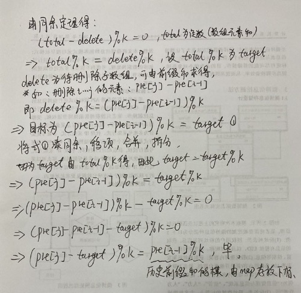
```python
class Solution:
    def minSubarray(self, nums: List[int], p: int) -> int:
        s = sum(nums)
        if s < p:
            return -1
        target = s % p
        if target == 0:
            return 0
        dic = {0:-1}
        pres = 0
        ans = len(nums)
        for i in range(len(nums)):
            pres += nums[i]
            cur = (pres-target)%p
            if cur in dic:
                ans = min(ans, i-dic[cur])
            dic[pres%p] = i
        return ans if ans != len(nums) else -1
```

## 滑动窗口之后做
https://lucifer.ren/blog/2020/09/27/atMostK/
https://lucifer.ren/blog/2021/02/20/2d-pre/
https://leetcode-cn.com/problems/continuous-subarray-sum/
https://leetcode-cn.com/problems/subarray-sums-divisible-by-k/

## 树状数组和线段数
**能用树状数组用树状数组**
### 树状数组
- Ologn 某个位置上的数加上一个数 **单点修改**
- Ologn 求某个前缀和 **区间查询**

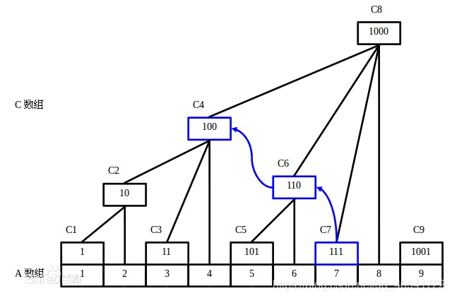

> C1 = A1
C2 = C1 + A2 = A1 + A2
C3 = A3
C4 = C2 + C3 + A4 = A1 + A2 + A3 + A4
C5 = A5
C6 = C5 + A6 = A5 + A6
C7 = A7
C8 = C4 + C6 + C7 + A8 = A1 + A2 + A3 + A4 + A5 + A6 + A7 + A8

### 代码（主要是三个函数）
```python
n, m = map(int, input().split())
tr = [0 for i in range(n + 1)]
a = [0] + list(map(int, input().split()))

# 当一个偶数与它的负值向与时，结果是能被这个偶数整除的最大的2的n次幂
# 当一个奇数与它的负值向与时结果一定是1.
def lowbit(x):
    return x & (-x)

# x表示要更新的索引值 v表示增加的位数
def add(x, v):
    while x <= n:
        tr[x] += v
        x += lowbit(x)
        
def query(x):
    res = 0
    while x > 0:
        res += tr[x]
        x -= lowbit(x)
    return res
    
# 初始化树状数组，可以看做原数组a是全0数组，每次改变a数组一位的值
for i in range(1, n+1):
    add(i, a[i])
    

for _ in range(m):  
    k, a, b = map(int,input().split())
    if k:
        add(a, b)
    else:
        print(query(b)-query(a-1))
```

### 线段树
- **线段树主要是用于区间问题，比如求区间和、区间修改、区间最值等。**
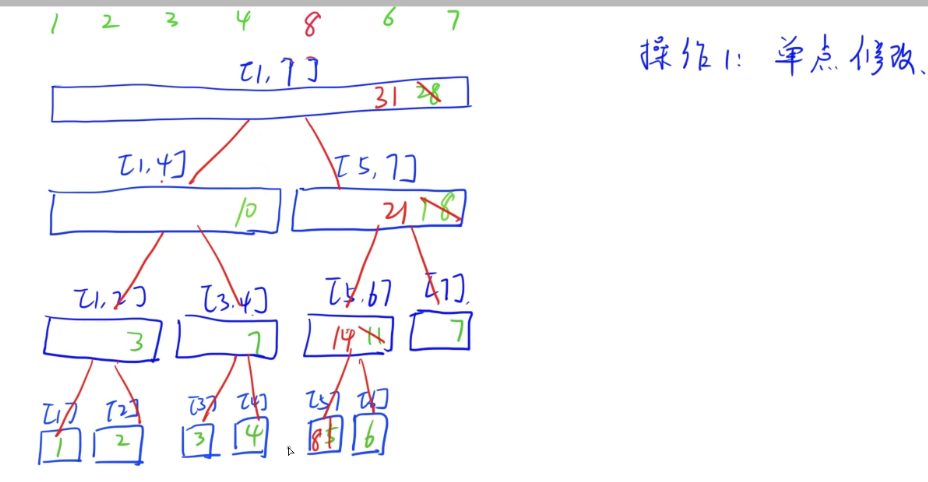
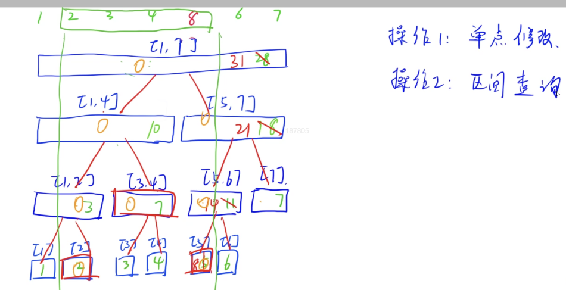
### 代码
```python
class Node:
    def __init__(self, l=0, r=0, s=0):
        self.l = l
        self.r = r
        self.sum = s

def push_up(u):
    """
    :param u: 根节点
    :return: 左右儿子之和
    """
    tr[u].sum = tr[u << 1].sum + tr[u << 1 | 1].sum
    
def build(u, l, r):
    """
    :param u: 当前结点编号
    :param l: 左边界
    :param r: 右边界
    """
    if l == r:
        tr[u] = Node(l, r, w[r])
    else:
        tr[u] = Node(l, r)
        mid = l+r>>1
        build(u<<1,l,mid)
        build(u<<1|1,mid+1,r)
        push_up(u)


def query(u, l, r):
    """
    :param u: 根节点编号
    :param l: 查询左端点
    :param r: 查询右端点
    :return: 区间和
    """
    if tr[u].l >= l and tr[u].r <= r:
        # 当前区间被完全包含
        return tr[u].sum
    mid = tr[u].l + tr[u].r >> 1
    sum = 0
    if l <= mid:
        # 和左边有交集
        sum += query(u << 1, l, r)
    if r > mid:
        # 和右边有交集
        sum += query(u << 1 | 1, l, r)
    return sum


def modify(u, x, v):
    """
    :param u: 根节点编号
    :param x: 插入位置
    :param v: 插入的值
    """
    if tr[u].l == tr[u].r:
        tr[u].sum += v
    else:
        mid = tr[u].l + tr[u].r >> 1
        if x <= mid:
            modify(u << 1, x, v)
        else:
            modify(u << 1 | 1, x, v)
        push_up(u)


n, m = map(int, input().split())
tr = [0 for i in range((n+1)*4)]
w = [0] + list(map(int, input().split()))
build(1, 1, n)

for _ in range(m):
    k, a, b = map(int, input().split())
    if k == 0:
        print(query(1, a, b))
    else:
        modify(1, a, b)


```

## KMP
```python
class Solution:
    def strStr(self, haystack: str, needle: str) -> int:
        if not needle:
            return 0
        # 找到相等前缀和数组
        def kmpNext(needle):
            nex = [0] * len(needle)
            i = 0
            for j in range(1, len(needle)):
                while needle[i] != needle[j]:
                    if i > 0:
                        i = nex[i-1]
                    else:
                        nex[j] = 0
                        break
                if needle[i] == needle[j]:
                    i += 1
                    nex[j] = i
            return nex
        nex = kmpNext(needle)
        i, j = 0, 0
        while i < len(haystack) and j < len(needle):
            if haystack[i] == needle[j]:
                i += 1
                j += 1
            else:
                if j > 0:
                    j = nex[j-1]
                else:
                    i += 1
            if j == len(needle):
                return i - j
        return -1
```