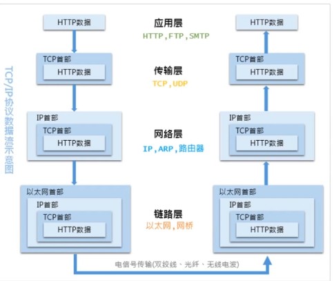
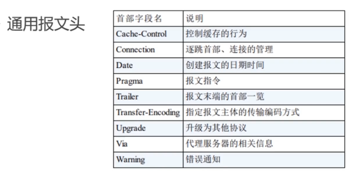
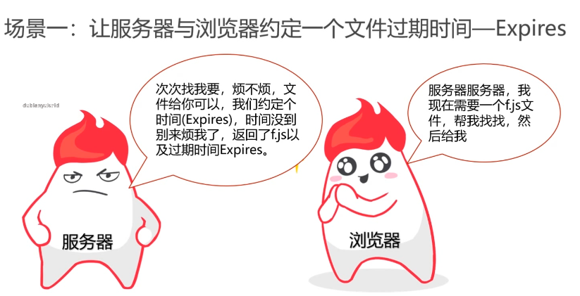

# HTTP协议详解
[toc]
## HTTP协议入门
> ### 浏览器背后的故事
- #### 浏览器访问的过程

- #### HTTP定义
    - **超文本传输协议（HTTP）是一种通信协议，它允许将超文本标记语言（HTML）文档从web服务器传送到客户端的浏览器。**
    - **HTTP是一个属于==应用层==的面向对象的协议，由于其简捷、快速的方式，适用于分布式超媒体信息系统。它于1990年提出，经过几年的使用与发展，得到不断地完善和扩展**。
- #### Web与HTTP的关系
    - **WEB是一种基于超文本和HTTP的、全球性的、动态交互的、跨平台的分布式==图形信息系统==**
    - **建立在Internet上的一种==网络服务==，为浏览者在Internet上查找和浏览信息提供了图形化的、易于访问的直观界面，其中的文档及超级链接将Internet上的信息节点组织成一个互为关联的网状结构**
> ### HTTP协议的前世今生

> ### 透过TCP/IP看HTTP
- HTTP协议是构建在TCP/IP协议之上的，是TCP/IP协议的一个子集
- #### TCP/IP协议族
    - **TCP/IP协议其实是一系列与互联网相关联的协议集合起来的总称**
    - **分层管理是TCP/IP协议的重要特征**
    - **TCP/IP协议族是由一个四层协议组成的系统，这四层分别为：==应用层、传输层、网络层和数据链路层==**
    
    1. **应用层一般是我们编写的应用程序，决定了向用户提供的应用服务。应用层可以通过系统调用与传输层进行通信。如：FTP、DNS、HTTP等。**
    2. **传输层通过系统调用向应用层提供处于网络连接中的两台计算机之间的数据传输功能。**
    3. **在传输层有两个性质不同的协议:TCP和UDP。**
    4. **网络层用来处理在网络上流动的数据包,数据包是网络传输的最小数据单位。该层规定了通过怎样的路径(传输路线)到达对方计算机并把数据包传输给对方。**
    5. **链路层用来处理连接网络的硬件部分,包括控制操作系统、硬件设备驱动、NIC(Network Interface Card, X络适配器)以及光纤等物理可见部分。硬件上的范畴均在链路层的作用范围之内。**
- #### 数据包的封装过程
    
- #### HTTP数据传输过程
    - **发送端发送数据时,数据会从上层传输到下层,且每经过一层都会被打上该层的头部信息。而接收端接收数据时,数据会从下层传输到上层,传输前会把下层的头部信息删除。**
    
- #### 传输层-TCP三次握手
    - 使用TCP协议进行通信的双方必须先建立连接,然后才能开始传输数据。为了确保连接双方可靠性,在双方建立连接时,TCP协议采用了三次握手策略。
    
    1. **第一次握手**：客户端发送带有SYN标志的连接请求报文段,然后进入 SYN SEND状态,等待服务端的确认。
    2. **第二次握手**：服务端接收到客户端的SYN报文段后需要发送ACK信息对这SYN报文段进行确认。同时,还要发送自己的SYN请求信息。服务端会将上述的信息放到一个报文段(SYN+ACK报文段)中,一并发送给客户端此时服务端将会进入SYN RECV状态。
    3. **第三次握手**：客户端接收到服务端的SYN+ACK报文段后会想服务端发送ACK确认报文段,这个报文段发送完毕后,客户端和服务端都进入ESTABLISHED状态,完成TCP三次握手。

> ### DNS域名解析
- **已经介绍了与HTTP协议有着密切关系的TCP/P协议,接下来介绍的DNS服务也是与HTP协议有着密不可分的关系。**
- **通常我们访问一个网站,使用的是主机名或者域名来进行访问的。因为相对于IP地址(一组纯数字),域名更容易让人记住但TCP/P协议使用的是IP地址进行访问的,所以必须有个机制或服务把域名转换成P地址。DNS服务就是用来解决这个问题的,它提供域名到IP地址之间的解析服务。**
- **进行DNS解析，会优先从HOST文件里查找访问IP。**
- **可以在DNS服务器上面加上CDN服务，加速DNS地区的分发。**

> ### HTTP事务处理过程
- **当客户端访词Web站点时,首先会通过DNS服务查询到域名的IP地址。然后浏览器生成HTP请求,并通过TCP/IP协议发送给Web服务器。Web服务器接收到请求后会根据请求生成响应内容,并通过TCP/IP协议返回给客户端。**


## HTTP协议结构和通讯原理
> ### HTTP协议特点
- **支持客户/服务器模式**:客户/服务器模式工作的方式是由客户端向服务器发出请求,服务器端响应请求,并进行相应服务。
- **简单快速**:客户向服务器请求服务时,只需传送请求方法和路径请求方法常用的有GET、HEAD、POST。每种方法规定了客户与服务器联系的类型不同。由于HTTP协议筒单,使得HTTP服务器的程序规模小,因而通信速度很快。
- **灵活**:HTTP允许传输任意类型的数据对象正在传输的类型由Content-type(content-Type是HTTP包中用来表示内容类型的标识)加以标记.
- **无连接**:无连接的含义是限制每次连接只处理一个请求T服务器处理完客户的请求,并收到客户的应答后,即断开连接。采用这种方式可以节省传输时间。
- **无状态**:HTTP协议是无状态协议无状态是指协议对于事务处理没有记忆能力。缺少状态意味着如果后续处理需要前面的信息,则它必须重传,这样可能导致每次连接传送的数据量增大。另一方面,在服务器不需要先前信息时它的应答就较快

> ### URI和URL 

- **URI：一个紧凑的字符串用来表示抽象或物力资源**
- **A URI可以进一步被分为定位符、名字或两者都是**
- **术语" Uniform Resource Locator"(URL)是URI的子集,除了确定一个资源还提供一种定位该资源的主要访问机制(如其网络“位置”**
- **URI可以分为 URL URN或同时具备 locators和 namesi特性的一个东西**
- **URN作用就好像一个人的名字,URL就像一个人的地址**
- **URI和URL最大的差别是“访问机制”，URN是唯一标识的一部分,是身份信息**

> ### HTTP报文结构分析-请求报文

- #### HTTP报文头
    - **HTTP的报文头大体可以分为四类,分别是通用报文头、请求报文头、响应报文头和实体报文头。**
    - 在HTTP/1.1里一共规范了47种报文头字段。
- ##### 通用报文头

- ##### 请求报文头

- ##### 响应报文头


- ##### 实体报文头

- ##### ACCEPT
    - 作用:浏览器端可以接受的媒体类型
    - Accept:text/html代表浏览器可以接受服务器回发的类型为text/htm也就是我们常说的html文档,如果服务器无法返回text/html类型的数据,服务器应该返回一个406错误( Non Acceptable)
    - Accept:*/*代表浏览器可以处理所有类型
    - 如果想要给显示的媒体类型増加优先级,则使用q=来额外表示权重值)重值q的范围是0~1(可精确到小数点后3位),且1为最大值。不指定权重q值时,默认权重为q=1.0。当服务器提供多种内容时,将会首先返回权重值最高的媒体类型。
- ##### ACCEPT-Encoding
    - 作用:浏览器申明自己接收的编码方法,通常指定压缩方法,是否支持压缩,支持什么压缩方法(gzip, deflate)
- ##### ACCEPT-Language
    - 作用:浏览器申明自己接收的语言
    - Accept-language: zh-cn, zh: q=0. 7, en-us, en: q=0. 3
    - 客户端在服务器有中文版资源的情况下,会请求其返回中文版对应的响应,没有中文版时,则请求返回英文版响应。
- ##### Connection
    - Connection:keep- alive当一个网页打开完成后,客户端和服务器之间用于传输HTP数据的TCP连接不会关闭,如果客户端再次访可这个服务器上的网页,会继续使用这一条已经建立的连接。
    - Connection: close代表一个 Requests完成后,客户端和服务器之间用于传输HTTP数据的TCP连接会关闭,当客户端再次发送Request,需要重新建立TCP连接。
- ##### Host
    - 作用:请求报头域主要用于指定被请求资源的 Iinternet主机和端口号,它通常从HTTPURL中提取出来的
    - 我们在浏览器中输入:htp://www.fljf.com:8080浏览器发送的请求消息中,就会包含Host请求报头域,如下:Host:www.fljf.com:8080
- ##### Referer
    - 当浏览器向Web服务器发送请求的时候,一般会带上 Referer,告诉服务器我是从哪个页面链接过来的,服务器籍此可以获得一些信息用于处 理
- ##### User-Agent
    - 作用:告诉HTTP服务器,客户端使用的操作系统和浏览器的名称和版本
    - 很多情况下我们会通过∪ser- Agnet?判断浏览器类型,从而进行不同的兼容设计
- ##### Content-Type
    - 作用:说明了报文体内对象的媒体类型

```
    text/html:HTML格式
    text/ plain:纯文本格式
    text/xml:XML格式
    Image/gif:gif图片格式
    Image/jpeg:jpg图片格式
    Image/png:png图片格式
    application/ xhtml+xml:XHTML格式
    application/xmXML数据格式
    application/atom+xml: Atom XML聚合格式
    application/j son:JSON数据格式
    application/pdfpdf格式
    application/ msword:Word文档格式
    application/ octet-stream:二进制流数据(如常见的文件下载)
    application/x-wWw-form- urlencode:表单提交
```

> ### HTTP请求方法剖析
- #### HTTP/1.1常用方法
    1. GET
    2. POST
    3. PUT
    4. HEAD
    5. DELETE
    6. OPTIONS
    7. TRACE
    8. CONNECT
    
- #### GET获取资源
    - GET方法用来请求访问已被URI识别的资源
    - 指定的资源经服务器端解析后返回响应内容
    - 数据是放在url里的，同时是限定长度的。
    
- #### POST传递数据
    - POST方法与GET功能类似,一般用来传输实体的主体
    - POST方法的主要目的不是获取响应主体的内容
    
- #### PUT
    - 从客户端向服务器传送的数据取代指定的文档的内容
    - PUT方法与POST方法最大的不同是:PUT是幕等的,而POST是不幕等的
    - 因此,我们更多时候将PUT方法用作传输资源
    - **一般POST用来创建对象，PUT用来更新对象**
- #### HEAD
    - 类似于GET请求,只不过返回的响应中没有具体的内容,用于获取报头
- #### DELETE
    - 请求服务器删除指定的资源
- #### DELETE
    - 用来查询针对请求URI指定的资源支持的方法
    
- #### TRACE
    - 回显服务器收到的请求,主要用于测试或诊断
- #### CONNECT
    - 开启一个客户端与所请求资源之间的双向沟通的通道,它可以用来创建隧道

> ### 状态码
- 是用以表示网页服务器超文本传输协议响应状态的3位数字代码。


> ### HTTP状态管理：Cookie与Session
- #### Cookie
    - Cookie实际上是一小段的文本信息。客户端请求服务器,如果服务器需要记录该用户状态,就向客户端浏览器颁发一个Cookie。
    - 客户端浏览器会把 Cookie保存起来。当浏览器再请求该网站时浏览器把请求的网址连同该 Cookie一同提交给服务器。服务器检查该 Cookie,以此来辨认用户状态。
    
    
- #### Session
    - Session是另一种记录客户状态的机制,保存在服务器上。客户端浏览器访问服务器的时候,服务器把客户端信息以某种形式记录在服务器上。
    - 客户端浏览器再次访问时只需要从该 Session中查找该客户的状态就可以了
    
- #### 保存Session ID的方式
    - Cookie
    - URL重写
    - 隐藏表单
- #### Session的有效期   
    - Session超时失效
    - 程序调用HttpSession.invalidate()
    - 服务器进程异常终止
- #### Cookie 与 Session
    - 存放位置不同
    - 安全性不同
    - 有效期上的不同
    - 对服务器压力的不同
## HTTP协议的特性和使用方法
> ### 常见编码规范介绍

- #### URL的编码与解码
    - URL是采用ASCII字符集进行编码的,所以如果URL中含有非ASCI字符集中的字符,要对其进行编码。
    - URL中一些保留字符,如“&"表示参数分隔符,如果想要在URL中使用这些保留字,那就需要编码。
    - “%编码”规范
    - 对URL中属于AS川字符集的非保留字不做编码;对URL中的保留字需要取其ASCI内码,然后加上“%”前缀将该字符进行编码;对于URL中的非ASCI字符需要取其 Unicode内码,然后加上“%”前缀将该字符进行编码。
    
> ### HTTP协议之身份认证
- #### 身份认证信息
1. 密码
2. 动态令牌
3. 数字证书
4. 生物认证
5. IC卡等
- #### 常见认证方式
1. BASIC认证（基本认证）


2. DIGEST认证（摘要认证）


3. SSL客户端认证
    - **SSL客户端认证是借由HTTPS的客户端证书完成认证的方式。凭借客户端证书认证,服务器可确认访问是否来自已登录的客户端。**
4. FormBase认证（基于表单认证）
    - 基于表单的认证方法并不是在HTTP协议中定义的。
    - 使用由Web应用程序各自实现基于表单的认证方式。
    - 通过 Cookie和 Session的方式来保持用户的状态。

> ### HTTP的长连接与短连接
    - HTTP协议是基于请求/向应模式的,因此只要服务端给了应,本次HTTP请求就结束了。
    - HTTP的长连接和短连接本质上是TCP长连接和短连接。
    - HTTP/1.0中,默认使用的是短连接。也就是说,浏览器和服务器每进行一次HTTP操作,就建立一次连接,结束就中断。
    - HTTP/1.1起,默认使用长连接,用以保持连接特性。
    
    **◆短连接**：建立连接数据传输一关闭连接...建立连接一数据传输一关闭连接
    **◆长连接**：建立连接数据传输…(保持连接)…数据传输一关闭连接

> ### HTTP中介之代理

- #### 代理的作用
    - 抓包
    - 翻墙
    - 匿名访问
    - 过滤器

> ### HTTP中介之网关
- 网关可以作为某种翻译器使用,它抽象出了一种能够到达资源的方法。网关是资源和应用程序之间的粘合剂。
- 网关扮演的是“协议转換器”的角色。

- #### web网关
    - Web网关在一侧使用HTP协议,在另一侧使用另一种协议。<客户端协议>/<服务器端协议>。
    1. (HTTP/)服务器端网关:通过HTTP协议与客户端对话,通过其他协议与服务器通信。
    2. (/HTTP)客户端网关:通过其他协议与客户端对话,通过HTTP协议与服务器通信。
- #### 常见的网关类型
    1. (HTTP*)服务器端Web网关
    2. (HTTP/HTPS)服务器端安全网关
    3. (HTTPS/HTTP)客户端安全加速器网关
    4. 资源网关
> ### HTTP缓存


- #### HTTP缓存工作方式

 

- #### 缓存改进方案
    - **md5/hash缓存**：
    通过不缓存html,为静态文件添加MD5或者hash标识,解决浏览器无法跳过缓存过期时间主动感知文件变化的问题。
    - **CDN缓存**：CDN是构建在网络之上的内容分发网络,依靠部署在各地的边绿服务器,通过中心平台的负载均衡、内容分发、调度等功能模块,使用户就近获取所需内容,降低网络拥塞,提高用户访问响应速度和命中率。
- #### CDN缓存工作方式


- #### 浏览器操作对缓存的影响 


> ### 内容协商机制
**指客户端和服务器端就响应的资源內容进行交涉,然后提供给客户端最为适合的资源。内容协商会以响应资源的语言,字符集,编码方式等作为判断的基准。**
- **客户端驱动**：客户端发起请求,服务器发送可选项列表,客户端作出选择后在发送第二次请求。
- **服务器驱动**：服务器检查客户端的请求头部集并決定提供哪个版本的页面。
- **透明协商**：某个中间设备(通常是缓存代理)代表客户端进行协商。


> ### 断点续传和多线程下载
- **HTTP是通过在Header里两个参数实现的,客户端发请求时对应的是 Range,服务器端响应时对应的是 Content-range。**
- ####  Range
    - 用于请求头中,指定第一个字节的位置和最后一个字节的位置般格式Range: (unit=first byte pos)-[last byte pos]
    
- ####  Content- Range
    - 用于响应头中,在发出带 Range的请求后,服务器会在Content- Range头部返回当前接受的范围和文件总大小。一般格式:Content-range: bytes(unit first byte pos)-[last bytepos)/entity legth
    
- ####  断点续传过程

## 安全的HTTPS
> ### HTTPs协议概述
- **HTTPS可以认为是HTP+TLS。**
- **TLS是传输层加密协议,它的前身是SSL协议。**

- ####  HTTPs功能介绍
    - 内容加密
        1. 对称内容加密
        2. 非对称密匙加密
    - 身份认证
        - 数字证书
    - 数据完整性
    
> ### HTTPs使用成本
- 证书费用以及更新维护
- HTTPS降低用户访问速度
- 消耗CPU资源，需要增加大量机器 

> ### HTTPs对性能的影响
- 协议交互所增加的网络RTT
- 加解密相关的计算耗时


- ####  计算耗时
    - 浏览器计算耗时
    - 服务端计算耗时
    
## 基于 HTTP 的功能追加协议
> ### HTTP协议的瓶颈
- 一条连接上只可发送一个请求请求只能从客户端开始。
- 客户端不可以接受除响应以外的指令请求
- 响应头部不经压缩就发送
- 每次互相发送相同的头部造成的浪费较多
- 非强制压缩发送
- #### 影响HTTP网络请求的因素
- 带宽
- 延迟
> ### 双工通信的WebScoket
- #### websocket和HTTP

- #### 非持久化的HTTp

- #### WebScoket的握手


- #### ajax轮询

**复读机，不停的访问**
- #### Long Poll

**有阻塞的存在**
- #### websocket


- #### websocket的特点
    - 真正的==全双工方式==
    - 减少通信量
    
> ### SPDY（谷歌研发的增强HTTP的协议）

**现有架构不用进行修改**
- #### HTTP缺陷
    - 单路连接请求低效
    - HTTP只允许由客户端主动发起
    - 请求HTTP头部冗余
- #### SPDY的改进
    - 多路复用，请求优化，请求带有优先级
    
    - 支持服务器推送技术
    - SPDY压缩了HTTP头
    - 强制使用SSL传输协议
    
> ### HTTP2.0
 
- #### HTTP2.0 性能增强的核心：二进制分帧


- #### HTTP2.0 多路复用

- #### 单链接多资源的优势
    - 可以减少服务链接压力,内存占用少了,连接吞吐量大了
    - 由于TCP连接减少而使网络拥塞状況得以改观
    - 慢启动时间減少,拥塞和丟包恢复速度更快
- #### 并行双向字节流的请求和响应（乱序发送）
    
    - 并行交错地发送请求,请求之间互不影响
    - 并行交错地发送响应,响应之间互不干扰
    - 只使用一个连接即可并行发送多个请求和响应
    - 消除不必要的延退,减少页面加载的时间
- #### 请求优先级
    - 高优先级的流都应该优先发送
    - 优先级不是绝对的
    - 不同优先级混合也是必须的
- #### 服务器推送
    
    
> ### WebDAV协议


> ### QUIC&HTTP3.0

- #### HTTP2.0的问题
    - 队头阻塞
    - 建立连接的握手延迟大
- #### QUIC的特性
    - 0 RTT
    
    - 没有队头阻塞的多路复用
    
    
    - 前项纠错
    

## Web安全威胁解析
- #### web应用的概念
    - Web应用是由动态脚本、编译过的代码等组合而成
    - 它通常架设在Web服务器上,用户在Web浏览器上发送请求
    - 这些请求使用HTTP协议,由Web应用和企业后台的数据库及其他动态内容通信
- #### web应用的三层架构
      
- #### WASC的定义
    - Web Application Security Consortium
    - 是一个由安全专家、行业顾问和诸多组织的代表组成的国际团体
    - 他们负责为WWW制定被广为接受的应用安全标准
- #### WASC将Web应用安全威胁分为六大类
    1. Authentication(验证):用来确认某用户、服务或是应用身份的攻击手段
    2. Authorization(授权):用来決定是否某用户、服务或是应用具有执行请求动作必要权限的攻击手段
    3.  Client-side Attacks(客户侧攻击):用来抗乱或是探测Web站点用户的攻击手段
    4.  Command Execution(命令执行):在Web站点上执行远程命令的攻击手段
    5.  Information Disclosure(信息暴露):用来获取Web站点具体系统信息的攻击手段
    6.  Logical Attacks(逻辑性攻击):用来抗乱或是探测Web应用逻辑流程的攻击手段
- #### OWASPI的定义
    - Open Web Application Security Proiect
    - 该组织致力于发现和解决不安全Web应用的根本原因
    - 它们最重要的项目之一是"Web应用的十大安全隐患”
    - 总结了目前Web应用最常受到的十种攻击手段,并且按照攻击发生的概率进行了排序
    
    
    