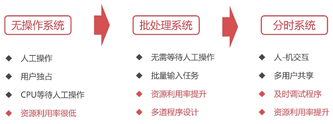
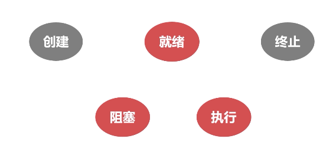
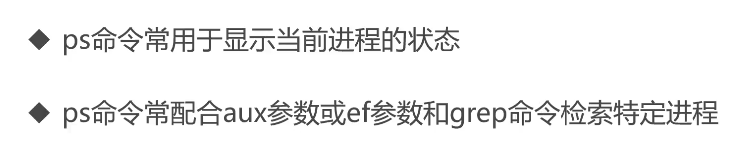
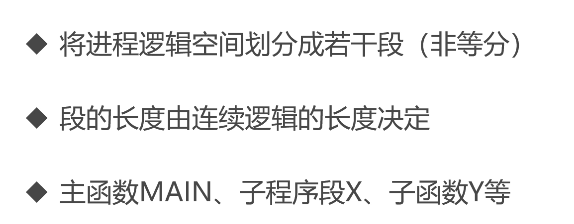

# 操作系统

[toc]
## 概述篇

> ### 操作系统的演进
>
> 
> ### 多道程序设计的概念
> 
- 多道程序设计是指在计算机内存中同时存放多个程序
- 多道程序在计算机的管理程序之下相互穿插运行
> ### 操作系统概览
- #### What&Why

    **what**
    - 操作系统是管理计算机硬件和软件资源的计算机程序
    - 管理配置内存、决定资源供需顺序、控制输入输出设备等
    - 操作统系提供让用户和系统交互的操作界面
    - 操作系统的种类是多种多样的，不局限于计算机
    - 从手机到超级计算机，操作系统可简单也可复杂
    - 在不同的设备上，操作系统可向用户呈现多种操作手段
    
    **why**
    - 我们不可能直接操作计算机硬件
    - 设备种类繁多复杂，需要统一界面
    - 操作系统的简易性使得更多人可以使用计算机
    
- #### 操作系统的基本功能
     
    
    
- #### 操作系统相关概念
  
    **并发性**
    
    
    
    **共享性**
    - 共享性表现为操作系统中的资源可供多个并发的程序共同使用
    - 这种共同使用的形式称之为资源共享
    
    
    
    **虚拟性**
    - 虚拟性表现为把一个物理实体转变为若干个逻辑实体
    - 物理实体是真实存在的，逻辑实体是虚拟的
    - 虚拟的技术主要有时分复用技术和空分复用技术
    
    
    
    
    **异步性**
    
    

> ### 进程管理之进程实体
- #### 为什么需要进程
    
    
- #### 进程的实体
  
    **主存中的进程形态**
    
    
    
    
    
    
    
    
    
    
    
    
    **进程与线程**
    
    
    
    

> ### 进程管理之五状态模型
 


> ### 进程管理之进程同步
- #### 为什么需要进程同步


- 根源问题：彼此相互之间没有通信
- “如果生产者通知消费者我已经完成一件生产”
- “哲学家向旁边哲学家说我要进餐了”


- #### 进程同步的原则
    **临界资源**
    
    

    **消息队列**

    **共享存储**
    
    **信号量**

- #### 线程同步
    

    **互斥量**
    
    **读写锁**
    
    **自旋锁**
    
    **条件变量**

> ### Linux的进程管理
- #### Linux进程的相关概念
  
    **进程的类型**
    1. 前台进程：具有终端，可以和用户交互的进程
    2. 后台进程：后台程序基本上不和用户交互，优先级比前台进程低
    3. 守护进程：特殊的后台进程，在系统引导的时候启动，一直运行直到系统关闭
    
    *linux中进程名字以d结尾的一般都是守护进程，crond、httpd、sshd、mysqld*
    
    **进程的标记**
    1. 进程ID是进程的唯一标记，每个进程拥有不同的ID
    2. 进程ID表现为一个非负整数，最大值由操作系统限定
    
    
    
    
- #### 操作Linux进程的相关命令
  
    **ps命令**
    ```
    ps -aux 打印详细进程
    ps -u root 查看用户的进程
    ps -aux | grep 'python3' 查询python3的进程
    ps -ef --forest 查询进程树
    ```
    
    
    **kill命令**
    ```
    kill -9 xxxx(uid)
    ```
    
    
> ### 作业管理直进程调度
- #### 进程调度概述
  

    - 就绪队列的排队机制
      
    - 选择运行进程的委派机制
      
    - 新老进程的上下文切换机制
      
  
- #### 进程调度的方式
  
    **非抢占式调度**
    
    
    **抢占式调度**
    

    
    
- #### 进程调度算法

    - 先来先服务调度算法
    - 短进程优先调度算法
    
    - 高优先权优先调度算法
    
    - 时间片轮转调度算法
    
    
> ### 作业管理之死锁
>
> 
- #### 死锁的产生
  
    **竞争资源**
    - 共享资源数量不满足各个进程需求
    - 各个进程之间发生资源竞争导致死锁
    
    
    **进程调度顺序不当**
    
    
- #### 死锁的四个必要条件
    **互斥条件**
    
    
    **请求保持条件**
    

    **不可剥夺条件**
    
    
    **环路等待条件**
    
    
- #### 死锁的处理
  
    **预防死锁的方法**
    - 摒弃请求保持条件
    
    - 摒弃不可剥夺条件
    
    - 摒弃环路等待条件
    
    
    **银行家算法**
    - 是一个可操作的著名的避免死锁的算法
    - 以银行借贷系统分配策略为基础的算法
    
    
    

> ### 存储管理之内存分配与回收

- #### 内存分配的过程


- ##### 首次适应算法（FF算法）

- ##### 最佳适应算法（BF算法）

- ##### 快速适应算法（QF算法）


- #### 内存回收的过程


> ### 存储管理之段页式存储管理
- #### 页式存储管理


- #### 段式存储管理



- #### 段页式存储管理


> ### 存储管理之虚拟内存
- #### 虚拟内存概述
    
    
    
    
- #### 程序的局部性原理
    
    

- #### 程序的局部性原理
    - 先进先出算法（FIFO）
    - 最不经常使用算法（LFU）
    - 最近最少使用算法（LRU
    

> ### LInux的存储管理
- #### Buddy内存管理算法
    
    
    
    
    
    
    
    
    
    
     
    
- #### Linux交换空间
    
    
    

> ### 操作系统的文件管理
- #### 文件的逻辑结构
- ##### 逻辑结构的文件类型


- ##### 顺序文件

- ##### 索引文件


- ##### 辅存的存储空间分配


- #### 辅存的存储空间分配


- #### 目录管理


> ### Linux文件基本操作
- #### Linux目录


> ### Linux的文件系统
- #### 文件系统概览
- ##### FAT
    - FAT(File Allocation Table)
    - FAT16、FAT32等，微软Dos/Windows使用的文件系统
    - 使用一张表保存盘块的信息
- ##### NTFS
    - NTFS (New Technology File System)
    - WindowsNT环境的文件系统
    - NTFS对FAT进行了改进，取代了旧的文件系统
- ##### EXT
    - EXT(Extended file system)：扩展文件系统
    - Linux的文件系统
    - EXT2/3/4 数字表示第几代
    
- #### EXT文件系统
    
    
    
    
    
    
    
    
    

> ### 操作系统的设备管理
- #### 广义的IO设备
    
    
    
    
    
    
- #### IO设备的缓冲区
    - 减少CPU处理IO请求的频率
    - 提高CPU与IO设备之间的并行性
    
    -  专用缓冲区只适用于特定的IO进程
    -  当这样的IO进程比较多时，对内存的消耗也很大
    -  操作系统划出可供多个进程使用的公共缓冲区，称之为缓冲池
    

- #### SPOOLing技术
    - 是关于慢速字符设备如何与计算机主机交换信息的一种技术
    - 利用高速共享设备将低速的独享设备模拟为高速的共享设备
    - 逻辑上，系统为每一个用户都分配了一台独立的高速独享设备
    - 在输入、输出之间增加了排队转储环节（输入井、输出井）
    - SPOOLing负责输入（出）井与低速设备之间的调度
    - 逻辑上，进程直接与高速设备交互，减少了进程的等待时间
    

## 提高篇
> ### 线程同步之互斥量


- #### 原子性
    - 原子性是指一系列操作不可被中断的特性
    -  这一系列操作要么全部执行完成，要么全部没有执行
    -  不存在部分执行部分未执行的情况 

- #### 互斥量
    - 互斥量是最简单的线程同步的方法
    - 互斥量（互斥锁），处于两态之一的变量：解锁和加锁
    - 两个状态可以保证资源访问的串行
    - 操作系统直接提供了互斥量的API
    - 开发者可以直接使用API完成资源的加锁、解锁操作
    
> ### 线程同步之自旋锁

- 自旋锁也是一种多线程同步的变量
- 使用自旋锁的线程会反复检查锁变量是否可用
- 自旋锁不会让出CPU，是一种忙等待状态
- 死循环等待锁被释放
- 自旋锁避免了进程或线程上下文切换的开销
- 操作系统内部很多地方使用的是自旋锁
- 自旋锁不适合在单核CPU使用 

> ### 线程同步之读写锁

- 读写锁是一种特殊的自旋锁
- 允许多个读者同时访问资源以提高读性能
- 对于写操作则是互斥的


> ### 线程同步之条件变量
- 条件变量是一种相对复杂的线程同步方法
- 条件变量允许线程睡眠，直到满足某种条件
- 当满足条件时，可以向该线程信号，通知唤醒

```c++
#include <iostream>
#include <stdio.h>
#include <stdlib.h>
#include <vector>
#include <queue>
#include <unistd.h>
#include <pthread.h>

int MAX_BUF = 100;
int num = 0;


pthread_cond_t cond = PTHREAD_COND_INITIALIZER;
pthread_mutex_t mutex = PTHREAD_MUTEX_INITIALIZER;

void* producer(void*){
    while(true){
        pthread_mutex_lock(&mutex);
        while (num >= MAX_BUF){
            // 等待
            printf("缓冲区满了, 等待消费者消费...\n");
            pthread_cond_wait(&cond, &mutex);
        }
        num += 1;
        printf("生产一个产品，当前产品数量为：%d\n", num);
        sleep(1);
        pthread_cond_signal(&cond);
        printf("通知消费者...\n");
        pthread_mutex_unlock(&mutex);
        sleep(1);
    }

}

void* consumer(void*){
    while(true){
        pthread_mutex_lock(&mutex);
        while (num <= 0){
            // 等待
            printf("缓冲区空了, 等待生产者生产...\n");
            pthread_cond_wait(&cond, &mutex);
        }
        num -= 1;
        printf("消费一个产品，当前产品数量为：%d\n", num);
        sleep(1);
        pthread_cond_signal(&cond);
        printf("通知生产者...\n");
        pthread_mutex_unlock(&mutex);
    }
}

int main(){
    pthread_t thread1, thread2;
    pthread_create(&thread1, NULL, &consumer, NULL);
    pthread_create(&thread2, NULL, &producer, NULL);
    pthread_join(thread1, NULL);
    pthread_join(thread2, NULL);
    return 0;
}
```


> ### 使用fork系统调用创建进程
- fork系统调用是用于创建进程的
- fork创建的进程初始化状态与父进程一样
- 系统会为fork的进程分配新的资源
- fork系统调用无参数
- fork会返回两次，分别返回子进程id和0
- 返回子进程id的是父进程，返回0的是子进程

> ### 进程同步之共享内存

- 在某种程度上，多进程是共同使用物理内存的
- 由于操作系统的进程管理，进程间的内存空间是独立的
- 进程默认是不能访问进程空间之外的内存空间的

- 共享存储允许不相关的进程访问同一片物理内存
- 共享内存是两个进程之间共享和传递数据最快的方式
- 共享内存未提供同步机制，需要借助其他机制管理访问


> ### 进程同步之Unix域套接字
- 域套接字是一种高级的进程间通信的方法
- Unix域套接字可以用于同一机器进程间通信
- 套接字(socket)原是网络通信中使用的术语
- Unix系统提供的域套接字提供了网络套接字类似的功能
- 提供了单机简单可靠的进程通信同步服务
- 只能在单机使用，不能跨机器使用


## 计算篇
> ### Python同步原语
- #### 互斥锁
```python
lock = threading.Lock()
lock.acquire() # 加锁
lock.release() # 开锁
```
- #### 条件变量
```python
condition = threading.Condition()
condition.acquire() # 加锁
condition.release() # 开锁
condition.wait() # 等待
condition.notify() # 唤醒
```

> ### 实现线程安全的队列Queue
- 队列用于存放多个元素，是存放各种元素的“池”


```python
import time
import threading


class ThreadSafeQueueException(Exception):
    pass


# 线程安全的队列
class ThreadSafeQueue(object):

    def __init__(self, max_size=0):
        self.queue = []
        self.max_size = max_size
        self.lock = threading.Lock()
        self.condition = threading.Condition()

    # 当前队列元素的数量
    def size(self):
        self.lock.acquire()
        size = len(self.queue)
        self.lock.release()
        return size

    # 往队列里面放入元素
    def put(self, item):
        if self.max_size != 0 and self.size() > self.max_size:
            return ThreadSafeQueueException()
        self.lock.acquire()
        self.queue.append(item)
        self.lock.release()
        self.condition.acquire()
        self.condition.notify()
        self.condition.release()
        pass

    def batch_put(self, item_list):
        if not isinstance(item_list, list):
            item_list = list(item_list)
        for item in item_list:
            self.put(item)

    # 从队列取出元素
    def pop(self, block=True, timeout=None):
        if self.size() == 0:
            # 需要阻塞等待
            if block:
                self.condition.acquire()
                self.condition.wait(timeout=timeout)
                self.condition.release()
            else:
                return None
        self.lock.acquire()
        item = None
        if len(self.queue) > 0:
            item = self.queue.pop()
        self.lock.release()
        return item

    def get(self, index):
        self.lock.acquire()
        item = self.queue[index]
        self.lock.release()
        return item


if __name__ == '__main__':
    queue = ThreadSafeQueue(max_size=100)

    def producer():
        while True:
            queue.put(1)
            time.sleep(3)

    def consumer():
        while True:
            item = queue.pop(block=True, timeout=-1)
            print('get item from queue: %d' % item)
            time.sleep(1)

    thread1 = threading.Thread(target=producer)
    thread2 = threading.Thread(target=consumer)
    thread1.start()
    thread2.start()
    thread1.join()
    thread2.join()
```

> ### 实现基本任务对象Task
- #### 任务处理逻辑

  
```python
import uuid
import threading


# 基本任务对象
class Task:

    def __init__(self, func, *args, **kwargs):
        # 任务具体逻辑，通过函数引用传递进来
        self.callable = func
        self.id = uuid.uuid4()
        self.args = args
        self.kwargs = kwargs

    def __str__(self):
        return 'Task id: ' + str(self.id)
```

> ### 线程池简介
- #### 什么是线程池
    - 线程池是存放多个线程的容器
    - CPU调度线程执行后不会销毁线程
    - 将线程放回线程池重复利用
    
- #### 为什么使用线程池
    - 线程是稀缺资源，不应该频繁创建和销毁
    - 架构解耦，线程创建和业务处理解耦，更加优雅
    - 线程池是使用线程的最佳实践
    
    
> ### 实现任务处理线程ProcessThread
- 任务处理线程需要不断的从任务队列里取任务执行
- 任务处理线程需要有一个标记，标记线程什么时候应该停止

```python
class ProcessThread(threading.Thread):

    def __init__(self, task_queue, *args, **kwargs):
        threading.Thread.__init__(self, *args, **kwargs)
        # 线程停止的标记
        self.dismiss_flag = threading.Event()
        # 任务队列（处理线程不断从队列取出元素处理）
        self.task_queue = task_queue
        self.args = args
        self.kwargs = kwargs

    def run(self):
        while True:
            # 判断线程是否被要求停止
            if self.dismiss_flag.is_set():
                break

            task = self.task_queue.pop()
            if not isinstance(task, Task):
                continue
            # 执行task实际逻辑（是通过函数调用引进来的）
            result = task.callable(*task.args, **task.kwargs)
            if isinstance(task, AsyncTask):
                task.set_result(result)


    def dismiss(self):
        self.dismiss_flag.set()

    def stop(self):
        self.dismiss()
```

> ### 实现任务处理线程池Pool
- 存放多个任务处理线程
- 负责多个线程的启停
- 管理向线程池的提交任务，下发给线程去执行

```python
# 线程池
class ThreadPool:

    def __init__(self, size=0):
        if not size:
            # 约定线程池的大小为CPU核数的两倍（最佳实践）
            size = psutil.cpu_count() * 2
        # 线程池
        self.pool = ThreadSafeQueue(size)
        # 任务队列
        self.task_queue = ThreadSafeQueue()

        for i in range(size):
            self.pool.put(ProcessThread(self.task_queue))

    # 启动线程池
    def start(self):
        for i in range(self.pool.size()):
            thread = self.pool.get(i)
            thread.start()

    # 停止线程池
    def join(self):
        for i in range(self.pool.size()):
            thread = self.pool.get(i)
            thread.stop()
        while self.pool.size():
            thread = self.pool.pop()
            thread.join()

    # 往线程池提交任务
    def put(self, item):
        if not isinstance(item, Task):
            raise TaskTypeErrorException()
        self.task_queue.put(item)

    # 批量提交
    def batch_put(self, item_list):
        if not isinstance(item_list, list):
            item_list = list(item_list)
        for item in item_list:
            self.put(item)

    def size(self):
        return self.pool.size()
```

> ### 编写测试用例
```python
import time

from operate_system import task, pool


class SimpleTask(task.Task):
    def __init__(self, callable):
        super(SimpleTask, self).__init__(callable)


def process():
    time.sleep(1)
    print('This is a SimpleTask callable function 1.')
    time.sleep(1)
    print('This is a SimpleTask callable function 2.')


def test():
    # 1. 初始化一个线程池
    test_pool = pool.ThreadPool()
    test_pool.start()
    # 2. 生成一系列的任务
    for i in range(10):
        simple_task = SimpleTask(process)
        # 3. 往线程池提交任务执行
        test_pool.put(simple_task)
    pass
```

> ### 实现异步任务处理AsyncTask
>
> 
```python
# 异步任务对象
class AsyncTask(Task):

    def __init__(self, func, *args, **kwargs):
        self.result = None
        self.condition = threading.Condition()
        super().__init__(func, *args, **kwargs)

    # 设置运行结果
    def set_result(self, result):
        self.condition.acquire()
        self.result = result
        self.condition.notify()
        self.condition.release()

    # 获取任务结果
    def get_result(self):
        self.condition.acquire()
        if not self.result:
            self.condition.wait()
        result = self.result
        self.condition.release()
        return result 
```
```python
def test_async_task():

    def async_process():
        num = 0
        for i in range(100):
            num += i
        return num

    # 1. 初始化一个线程池
    test_pool = pool.ThreadPool()
    test_pool.start()
    # 2. 生成一系列的任务
    for i in range(10):
        async_task = task.AsyncTask(func=async_process)
        test_pool.put(async_task)
        result = async_task.get_result()
        print('Get result: %d' % result)


# 测试是否可以正在的等待(wait)
def test_async_task2():

    def async_process():
        num = 0
        for i in range(100):
            num += i
        time.sleep(5)
        return num

    # 1. 初始化一个线程池
    test_pool = pool.ThreadPool()
    test_pool.start()
    # 2. 生成一系列的任务
    for i in range(1):
        async_task = task.AsyncTask(func=async_process)
        test_pool.put(async_task)
        print('get result in timestamp: %d' % time.time())
        result = async_task.get_result()
        print('Get result in timestamp: %d: %d' % (time.time(), result))


# 测试没有等待是否也可以正常获取结果
def test_async_task3():

    def async_process():
        num = 0
        for i in range(100):
            num += i
        return num

    # 1. 初始化一个线程池
    test_pool = pool.ThreadPool()
    test_pool.start()
    # 2. 生成一系列的任务
    for i in range(1):
        async_task = task.AsyncTask(func=async_process)
        test_pool.put(async_task)
        print('get result in timestamp: %d' % time.time())
        # time.sleep(5)
        # 转而去处理别的逻辑
        result = async_task.get_result()
        print('Get result in timestamp: %d: %d' % (time.time(), result))
```