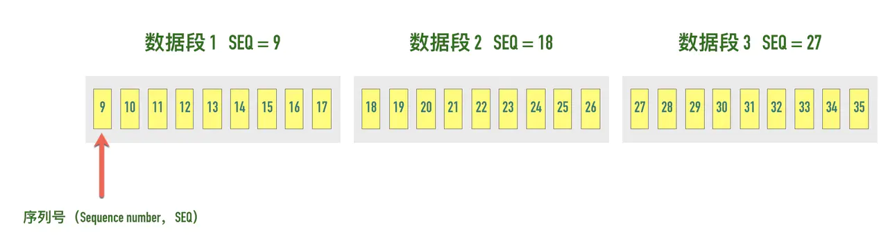

# 深入理解tcp协议

## TCP/IP 网络分层

### 应用层（Application Layer）
应用层的本质是规定了应用程序之间如何相互传递报文， 以 HTTP 协议为例，它规定了

- 报文的类型，是请求报文还是响应报文
- 报文的语法，报文分为几段，各段是什么含义、用什么分隔，每个部分的每个字段什么什么含义
- 进程应该以什么样的时序发送报文和处理响应报文

很多应用层协议都是由 RFC 文档定义，比如 HTTP 的 RFC 为 RFC 2616 - Hypertext Transfer Protocol -- HTTP/1.1。

HTTP 客户端和 HTTP 服务端的首要工作就是根据 HTTP 协议的标准组装和解析 HTTP 数据包，每个 HTTP 报文格式由三部分组成：

- 起始行（start line），起始行根据是请求报文还是响应报文分为「请求行」和「响应行」。这个例子中起始行是==GET / HTTP/1.1==，表示这是一个 ==GET== 请求，请求的 URL 为/，协议版本为==HTTP 1.1==，起始行最后会有一个空行 CRLF（\r\n) 与下面的首部分隔开。
- 首部（header），首部采用形如==key:value==的方式，比如常见==的User-Agent==、==ETag==、==Content-Length==都属于 HTTP 首部，每个首部直接也是用空行分隔。
- 可选的实体（entity），实体是 HTTP 真正要传输的内容，比如下载一个图片文件，传输的一段 HTML等。


除了我们熟知的 HTTP 协议，还有下面这些非常常用的应用层协议：
- 域名解析协议 DNS
- 收发邮件 SMTP 和 POP3 协议
- 时钟同步协议 NTP
- 网络文件共享协议 NFS

### 传输层（Transport Layer）
传输层的作用是为两台主机之间的「应用进程」提供端到端的逻辑通信，相隔几千公里的两台主机的进程就好像在直接通信一样。

虽然是叫传输层，但是并不是将数据包从一台主机传送到另一台，而是对「传输行为进行控制」， TCP 协议就被称为传输控制协议（Transmission Control Protocol），为下面两层协议提供数据包的重传、流量控制、拥塞控制等。


假设你正在电脑上用微信跟女朋友聊天，用 QQ 跟技术大佬们讨论技术细节，当电脑收到一个数据包时，它怎么知道这是一条微信的聊天内容，还是一条 QQ 的消息呢？

这就是端口号的作用。传输层用端口号来标识不同的应用程序，主机收到数据包以后根据目标端口号将数据包传递给对应的应用程序进行处理。比如这个例子中，目标端口号为 80，百度的服务器就根据这个目标端口号将请求交给监听 80 端口的应用程序（可能是 Nginx 等负载均衡器）处理


### 网络互连层（Internet Layer）
网络互连层提供了主机到主机的通信，将传输层产生的的数据包封装成分组数据包发送到目标主机，并提供路由选择的能力


IP 协议是网络层的主要协议，TCP 和 UDP 都是用 IP 协议作为网络层协议。这一层的主要作用是给包加上源地址和目标地址，将数据包传送到目标地址。

IP 协议是一个无连接的协议，也不具备重发机制，这也是 TCP 协议复杂的原因之一就是基于了这样一个「不靠谱」的协议。

### 网络访问层（Network Access Layer）
网络访问层也有说法叫做网络接口层，以太网、Wifi、蓝牙工作在这一层，网络访问层提供了主机连接到物理网络需要的硬件和相关的协议。这一层我们不做重点讨论。

整体的分层图如下图所示


### 分层的好处是什么呢？
分层的本质是通过分离关注点而让复杂问题简单化，通过分层可以做到：

- 各层独立：限制了依赖关系的范围，各层之间使用标准化的接口，各层不需要知道上下层是如何工作的，增加或者修改一个应用层协议不会影响传输层协议
- 灵活性更好：比如路由器不需要应用层和传输层，分层以后路由器就可以只用加载更少的几个协议层
- 易于测试和维护：提高了可测试性，可以独立的测试特定层，某一层有了更好的实现可以整体替换掉
- 能促进标准化：每一层职责清楚，方便进行标准化

## TCP 协议概述
**TCP 是一个可靠的（reliable）、面向连接的（connection-oriented）、基于字节流（byte-stream）、全双工的（full-duplex）协议。**
### TCP 是面向连接的协议
- 面向连接（connection-oriented）：面向连接的协议要求正式发送数据之前需要通过「握手」建立一个逻辑连接，结束通信时也是通过有序的四次挥手来断开连接。
- 无连接（connectionless）：无连接的协议则不需要
#### 三次握手
建立连接的过程是通过「三次握手」来完成的，顾名思义，通过三次数据交换建立一个连接。 通过三次握手协商好双方后续通信的起始序列号、窗口缩放大小等信息。


### TCP 协议是可靠的

IP 是一种无连接、不可靠的协议：它尽最大可能将数据报从发送者传输给接收者，但并不保证包到达的顺序会与它们被传输的顺序一致，也不保证包是否重复，甚至都不保证包是否会达到接收者。  

TCP 要想在 IP 基础上构建可靠的传输层协议，必须有一个复杂的机制来保障可靠性。 主要有下面几个方面：

- 对每个包提供校验和
- 包的序列号解决了接收数据的乱序、重复问题
- 超时重传
- 流量控制、拥塞控制

**校验和（checksum）** 每个 TCP 包首部中都有两字节用来表示校验和，防止在传输过程中有损坏。如果收到一个校验和有差错的报文，TCP 不会发送任何确认直接丢弃它，等待发送端重传。


**包的序列号保证了接收数据的乱序和重复问题** 假设我们往 TCP 套接字里写 3000 字节的数据导致 TCP发送了 3 个数据包，每个数据包大小为 1000 字节：第一个包序列号为[1~1001)，第二个包序列号为 [1001~ 2001)，第三个包序号为[2001~3001)


假如因为网络的原因导致第二个、第三个包先到接收端，第一个包最后才到，接收端也不会因为他们到达的顺序不一致把包弄错，TCP 会根据他们的序号进行重新的排列然后把结果传递给上层应用程序。

如果 TCP 接收到重复的数据，可能的原因是超时重传了两次但这个包并没有丢失，接收端会收到两次同样的数据，它能够根据包序号丢弃重复的数据。

**超时重传 TCP** 发送数据后会启动一个定时器，等待对端确认收到这个数据包。如果在指定的时间内没有收到 ACK 确认，就会重传数据包，然后等待更长时间，如果还没有收到就再重传，在多次重传仍然失败以后，TCP 会放弃这个包。后面我们讲到超时重传模块的时候会详细介绍这部分内容。

### TCP 是面向字节流的协议
TCP 是一种字节流（byte-stream）协议，流的含义是没有固定的报文边界。

假设你调用 2 次 write 函数往 socket 里依次写 500 字节、800 字节。write 函数只是把字节拷贝到内核缓冲区，最终会以多少条报文发送出去是不确定的，如下图所示


- 情况 1：分为两条报文依次发出去 500 字节 和 800 字节数据，也有
- 情况 2：两部分数据合并为一个长度为 1300 字节的报文，一次发送
- 情况 3：第一部分的 500 字节与第二部分的 500 字节合并为一个长度为 1000 字节的报文，第二部分剩下的 300 字节单独作为一个报文发送
- 情况 4：第一部分的 400 字节单独发送，剩下100字节与第二部分的 800 字节合并为一个 900 字节的包一起发送。
- 情况 N：还有更多可能的拆分组合

上面出现的情况取决于诸多因素：路径最大传输单元 MTU、发送窗口大小、拥塞窗口大小等。

当接收方从 TCP 套接字读数据时，它是没法得知对方每次写入的字节是多少的。接收端可能分2 次每次 650 字节读取，也有可能先分三次，一次 100 字节，一次 200 字节，一次 1000 字节进行读取。

### TCP 是全双工的协议

在 TCP 中发送端和接收端可以是客户端/服务端，也可以是服务器/客户端，通信的双方在任意时刻既可以是接收数据也可以是发送数据，每个方向的数据流都独立管理序列号、滑动窗口大小、MSS 等信息。


## 剖析首部字段
### 源端口号、目标端口号
通过抓包百度网页本地源端口号为 61024，百度目标端口号是 80。


**TCP 报文头部里没有源 ip 和目标 ip 地址，只有源端口号和目标端口号**

TCP 的报文里是没有源 ip 和目标 ip 的，因为那是 IP 层协议的事情，TCP 层只有源端口和目标端口。

源 IP、源端口、目标 IP、目标端口构成了 TCP 连接的「四元组」。一个四元组可以唯一标识一个连接。

### 序列号（Sequence number）
TCP 是面向字节流的协议，通过 TCP 传输的字节流的每个字节都分配了序列号，序列号（Sequence number）指的是本报文段第一个字节的序列号。


序列号加上报文的长度，就可以确定传输的是哪一段数据。序列号是一个 32 位的无符号整数，达到 2^32-1 后循环到 0。

在 SYN 报文中，序列号用于交换彼此的初始序列号，在其它报文中，序列号用于保证包的顺序。

因为网络层（IP 层）不保证包的顺序，TCP 协议利用序列号来解决网络包乱序、重复的问题，以保证数据包以正确的顺序组装传递给上层应用。

如果发送方发送的是四个报文序列号分别是1、2、3、4，但到达接收方的顺序是 2、4、3、1，接收方就可以通过序列号的大小顺序组装出原始的数据。

### 初始序列号（Initial Sequence Number, ISN）
在建立连接之初，通信双方都会各自选择一个序列号，称之为初始序列号。在建立连接时，通信双方通过 SYN 报文交换彼此的 ISN，如下图所示


初始建立连接的过程中 SYN 报文交换过程如下图所示


其中第 2 步和第 3 步可以合并一起，这就是三次握手的过程  


**初始序列号是如何生成的**
```
__u32 secure_tcp_sequence_number(__be32 saddr, __be32 daddr,
				 __be16 sport, __be16 dport)
{
	u32 hash[MD5_DIGEST_WORDS];

	net_secret_init();
	hash[0] = (__force u32)saddr;
	hash[1] = (__force u32)daddr;
	hash[2] = ((__force u16)sport << 16) + (__force u16)dport;
	hash[3] = net_secret[15];
	
	md5_transform(hash, net_secret);

	return seq_scale(hash[0]);
}

static u32 seq_scale(u32 seq)
{
	return seq + (ktime_to_ns(ktime_get_real()) >> 6);
}
```

代码中的 net_secret 是一个长度为 16 的 int 数组，只有在第一次调用 net_secret_init 的时时候会将将这个数组的值初始化为随机值。在系统重启前保持不变。

可以看到初始序列号的计算函数 secure_tcp_sequence_number() 的逻辑是通过源地址、目标地址、源端口、目标端口和随机因子通过 MD5 进行进行计算。如果仅有这几个因子，对于四元组相同的请求，计算出的初始序列号总是相同，这必然有很大的安全风险，所以函数的最后将计算出的序列号通过 seq_scale 函数再次计算。

seq_scale 函数加入了时间因子，对于四元组相同的连接，序列号也不会重复了。
#### 序列号回绕了怎么处理
序列号是一个 32 位的无符号整数，从前面介绍的初始序列号计算算法可以知道，ISN 并不是从 0 开始，所以同一个连接的序列号是有可能溢出回绕（sequence wraparound）的。TCP 的很多校验比如丢包、乱序判断都是通过比较包的序号来实现的，我们来看看 linux 内核是如何处理的，代码如下所示。
```
static inline bool before(__u32 seq1, __u32 seq2)
{
        return (__s32)(seq1-seq2) < 0;
}
```
其中 __u32 表示无符号的 32 位整数，__s32 表示有符号的 32 位整数。为什么 seq1 - seq2 转为有符号的 32 位整数就可以判断 seq1 和 seq2 的大小了呢？

以 seq1 为 0xFFFFFFFF、seq2 为 0x02（回绕）为例，它们相减的结果如下。
```
seq1 - seq2 = 0xFFFFFFFF - 0x02 = 0xFFFFFFFD
```
0xFFFFFFFD 最高位为 1，表示为负数，实际值为 -(0x00000002 + 1) = -3，这样即使 seq2 回绕了，也可以知道 seq1<seq2。

### 确认号

TCP 使用确认号（Acknowledgment number, ACK）来告知对方下一个期望接收的序列号，小于此确认号的所有字节都已经收到。


关于确认号有几个注意点：

- 不是所有的包都需要确认的
- 不是收到了数据包就立马需要确认的，可以延迟一会再确认
- ACK 包本身不需要被确认，否则就会无穷无尽死循环了
- 确认号永远是表示小于此确认号的字节都已经收到

### TCP Flags
TCP 有很多种标记，有些用来发起连接同步初始序列号，有些用来确认数据包，还有些用来结束连接。TCP 定义了一个 8 位的字段用来表示 flags，大部分都只用到了后 6 个，如下图所示


最常见的有下面这几个：

- SYN（Synchronize）：用于发起连接数据包同步双方的初始序列号
- ACK（Acknowledge）：确认数据包
- RST（Reset）：这个标记用来强制断开连接，通常是之前建立的连接已经不在了、包不合法、或者实在无能为力处理
- FIN（Finish）：通知对方我发完了所有数据，准备断开连接，后面我不会再发数据包给你了。
- PSH（Push）：告知对方这些数据包收到以后应该马上交给上层应用，不能缓存起来


### 最大传输单元（Maximum Transmission Unit, MTU）

数据链路层传输的帧大小是有限制的，不能把一个太大的包直接塞给链路层，这个限制被称为「最大传输单元（Maximum Transmission Unit, MTU）」

下图是以太网的帧格式，以太网的帧最小的帧是 64 字节，除去 14 字节头部和 4 字节 CRC 字段，有效荷载最小为 46 字节。最大的帧是 1518 字节，除去 14 字节头部和 4 字节 CRC，有效荷载最大为 1500，这个值就是以太网的 MTU。因此如果传输 100KB 的数据，至少需要 （100 * 1024 / 1500) = 69 个以太网帧。


### IP 分段

IPv4 数据报的最大大小为 65535 字节，这已经远远超过了以太网的 MTU，而且有些网络还会开启巨帧（Jumbo Frame）能达到 9000 字节。 当一个 IP 数据包大于 MTU 时，IP 会把数据报文进行切割为多个小的片段(小于 MTU），使得这些小的报文可以通过链路层进行传输


IP 头部中有一个表示分片偏移量的字段，用来表示该分段在原始数据报文中的位置，如下图所示


### 网络中的木桶效应：路径 MTU

一个包从发送端传输到接收端，中间要跨越很多个网络，每条链路的 MTU 都可能不一样，这个通信过程中最小的 MTU 称为「路径 MTU（Path MTU）」。就好比开车有时候开的是双向 4 车道，有时候可能是乡间小路一样。

比如下图中，第一段链路 MTU 大小为 1500 字节，第二段链路 MTU 为 800 字节，第三段链路 MTU 为 1200 字节，则路径 MTU 为三段 MTU 的最小值 800。


路径 MTU 就跟木桶效应是一个道理，木桶的盛水量由最短的那条短板决定，路径 MTU 也是由通信链条中最小的 MTU 决定。


https://juejin.im/book/5c70dbbe51882562046911bc/section/5ce495166fb9a07eeb137def


## 面试习题
### 收到 IP 数据包解析以后，它怎么知道这个分组应该投递到上层的哪一个协议（UDP 或 TCP）
- IP 头中有个字段 protocol 可用来表示上层用的哪个协议
### TCP提供了一种字节流服务，而收发双方都不保持记录的边界，应用程序应该如何提供他们自己的记录标识呢？
- 应用程序自己控制消息边界，定义自己的消息分割符
### 客户端的使用 ISN=2000 打开一个连接，服务器端使用 ISN=3000 打开一个连接，经过 3 次握手建立连接。连接建立起来以后，假定客户端向服务器发送一段数据Welcome the server!（长度 20 Bytes），而服务器的回答数据Thank you!（长度 10 Bytes ），试画出三次握手和数据传输阶段报文段序列号、确认号的情况。
```
client                                                   server
                 S seq = 2000
          ------------------------------>
                 S. seq = 3000 ack = 2001
          <------------------------------
                  . seq = 2001 ack = 3001
           ------------------------------->
                 P. seq = 2001 ack = 3001 len=20
           ------------------------------->
                  . seq = 3001 ack = 2021
           <------------------------------
                 P . seq = 3001 ack = 2021 len=10
           <------------------------------
                   . seq = 2021 ack = 3011
            ------------------------------->
```

