# 计算机组成原理
[toc]
## 概述篇
> ### 计算机的发展简史
- #### 计算机发展的四个阶段

    
    1. **第一个阶段：电子管计算机**
    
        第二次世界大战是电子管计算机产生的催化剂。英国为了解密德国海军的密文。（最早的计算机埃尼阿克）
        
        **特点：**
        - 集成度小，空间占用大
        - 功耗高，运行速度慢
        - 操作复杂，更换程序需要接线
        
    2. **第二个阶段：晶体管计算机**
    
        贝尔实验室三个人发明了晶体管。世界上第一款晶体管计算机是MIT林肯实验室发明的TX-0。
        
        **特点：**
        - 集成度相对较高，空间占用相对小
        - 功耗相对较低，运行速度较快
        - 操作相对简单，交互更加方便
        
    3. **第三个阶段：集成电路计算机**
        
        德州仪器的工程师发明了集成电路（IC）。
        
        **特点：**
        - 计算机变得更小
        - 功耗变得更低
        - 计算速度变得更快
        
        ***计算机剧本了进入千家万户的条件。***     
        
        同时这个阶段操作系统诞生了，IBM推出兼容的产品system/360(操作系统的雏形)。
        
    4. **第四个阶段：超大规模集成电路计算机**
    
        CPU在这个阶段出现。
        
        **特点：**
        - 一个芯片继承了上百万的晶体管
        - 速度更快，体积更小，价格更低，更能被大众接受
        - 用途丰富：文本处理、表格处理、高交互的游戏与应用
        
    5. **第五个阶段：未来的计算机**
    
        - **生物计算机**：以蛋白质分子作为主要原材料。
            
            **特点：**
            - 体积小，效率高
            - 不易损坏，生物级别的自动修复
            - 不受信号干扰，无热损耗
            
        - **量子计算机**：遵循量子力学的物理计算机
            
- #### 微型计算机的发展历史
    1. 受限于性能：单核CPU
    2. 摩尔定律：集成电路的性能，每18-24个月就会提升一倍
    3. 推出多核CPU

> ### 计算机的分类
- #### 超级计算机

    **特点：**
    1. 功能最强、运算速度最快、储存容量最大的计算机
    2. 多用于国家高科技领域和尖端技术研究
    3. 标记他们运算速度的单位是TFlop/s(1TFlop/s=每秒一万亿次浮点计算)
    
- #### 大型计算机
    
    **特点：**
    1. 又称大型机、大型主机、主机等
    2. 具有高性能，可处理大量数据与复杂的运算
    3. 在大型机市场领域，IBM占据着很大的份额
    
    **去“IOE”行动：** I（IBM） O（Oracle） E（EMC）
    1. 去“IOE”是阿里巴巴提出的概念
    2. 代表了高维护费用的存储系统
    3. 不够灵活，伸缩性弱
    4. 促成了阿里云的安生
    5. 把大型机替换成普通服务器
     
- #### 迷你计算机（服务器）
    
    **特点：**
    1. 也称为小型机，普通服务器
    2. 不需要特殊的空调场所
    3. 具备不错的算力，可以完成较为复杂的运算
     
- #### 工作站
    
    **特点：**
    1. 高端的通用微型计算机，提供比个人计算机更强大的性能
    2. 类似于普通台式电脑，体积较大，但性能强劲
    
- #### 微型计算机

    **特点：**
    1. 个人计算机，是普通的一类计算机
    2. 分为台式机、笔记本电脑、一体机
    3. 麻雀虽小五脏俱全，和之前的计算机一样

> ### 计算机的体系结构
- #### 冯诺依曼体系

    **解释**：将程序指令和数据一起存储的计算机设计概念结构。
    
    
    **构成**：
    - 必须有一个存储器 
    - 必须有一个控制器
    - 必须有一个运算器
    - 必须有输入设备
    - 必须有输出设备
    
    **现代计算机都是冯诺依曼机**
    
    **作用**：
    - 能够把需要的程序和数据送至计算机中
    - 能够长期记忆程序、数据、中间结果及最终运算结果的能力
    - 能够具备算术、逻辑运算和数据传送等数据加工处理的能力
    - 能够按照要求将处理结果输出给用户
    
    
    **问题**：CPU和存储器速率之间的问题无法调和。
    
    
- #### 现在计算机的结构
    - 现代计算机在冯诺依曼体系结构基础上进行修改
    - **解决CPU与存储设备之间的性能差异问题**
    
    > 运算器、控制器和存储器都在一块芯片上，这里的存储器是更高速度的设备——内存/CPU的寄存器。现代计算机可以理解为以存储器为核心。

> ### 计算机的层次与编程语言
- #### 程序翻译与程序解释

    **为什么需要程序翻译与程序解释？**
    
    人类语言与计算机语言不相通，需要进行语言之间的转换。
    
    
    **程序翻译是怎么运行的？**
    
    
    
    
    **程序解释是怎么运行的？**
    
    
    
    **程序翻译与程序解释的异同：**
    - 计算机执行的指令都是l0
    - 翻译过生成的新的l0程序，解释过程不生成新的l0程序
    - 解释的过程由l0编写的解释器去解释l1的程序
    
    程序翻译 | 程序解释
    ---|---
    c/c++ | Python
    Object-C | PHP
    golang | JavaScript
    
    

- #### 计算机的层次与编程语言

    **七个层次：**
    
    
    
    1. **硬件逻辑层：**
        - 门、触发器等逻辑电路组成
        - 属于电子工程的领域
        
    2. **微程序机器层：**
        - 编程语言是微指令集
        - 微指令所组成的微程序直接交由硬件执行
        - 一般是硬件公司程序员干的
        
    3. **传统机器层**
        - 编程语言是CPU指令集（机器指令）
        - 编程语言和硬件是直接相关
        - 不同架构的CPU使用不同的CPU指令集（Intel和AMD）
    
    4. **操作系统层**
        - 向上提供了简易的操作界面
        - 向下对接了指令系统，管理硬件资源
        - 操作系统层是在硬件和软件之间的适配层
        
    5. **汇编语言层**
        - 编程语言是汇编语言
        - 汇编语言可以翻译成可直接执行的机器语言
        - 完成翻译的过程的程序就是汇编器
        
    6. **高级语言层：**
        - 编程语言为广大程序员接受的高级语言
        - 高级语言种类非常多
        - Python、Java、golang、c/c++
        
    7. **应用层：**
        - 满足计算机针对某种用途而专门设计（例如office）
        
    
> ### 计算机的计算单位
- #### 容量单位
    
    **原理：**
    - 在物理层面，高低电平记录信息
    - 理论上只认识0/1两种状态
    - 0/1称为bit（比特位）
    - 0/1能够表示的内容太少了，需要更大的容量表示方法
    
    **字节：** 1byte = 8bits
    
- #### 速度单位

    **网络速度**
    
    
    
    **CPU频率**
    - CPU的速度一般体现为CPU的时钟频率
    - CPU的时钟频率的单位一般是赫兹（Hz）
    - 主流CPU的时钟频率都在2GHz以上
    
    **赫兹**
    - Hz是秒分之一，每秒中周期性变动重复次数的计量，15Hz就是每秒十五次
    - 并不是描述计算机领域专有的单位
    
  **2GHz = 2\*1000^3Hz = 每秒20亿次**
        
> ### 计算机的字符与编码集
- #### 字符编码集的历史

    **ACSII码**
    - 使用7个bits就可以完全表示ASCII码
    - 包含95个可打印字符
    - 33个不可打印字符（包括控制字符）
    
    ```math
    33+85=128 = 2^7
    ```
    
    
    **Extended ASCII码**
    
    
    
    **字符编码集的国际化**
    - **欧洲、中亚、东亚、拉丁美洲国家的语言多样性**
    - **语言体系不一样，不以有限字符组合的语言**
    - **中国、韩国、日本等的语言最为复杂**
    
- #### 中文编码集

    **GB2312/国标2312**
    - 《信息交换用汉字编码字符集——基本集》
    - 一共收录了7445个字符
    - 包括6763个汉字和682个其他符号
    
    **GBK**
    - 《汉字内码扩展规范》
    - 向下兼容GB2312，向上支持国标ISO标准
    - 收录了21003个汉字，支持全部中日韩汉字
    
    **Unicode**
    - Unicode：统一码、万国码、单一码
    - Unicode定义了世界通用的符号集，UTF-*实现了编码
    - UTF-8以字节为单位对Unicode进行编码
    
    
    
## 组成篇
> ### 计算机的总线与IO设备
- ####总线的概述

    USB = Universal Serial Bus 通用串行总线
    - 提供了对外连接的接口
    - 不同设备可以通过USB接口进行连接
    - 连接的标准，促使外围设备接口的统一
    
    
    
    
    
    
    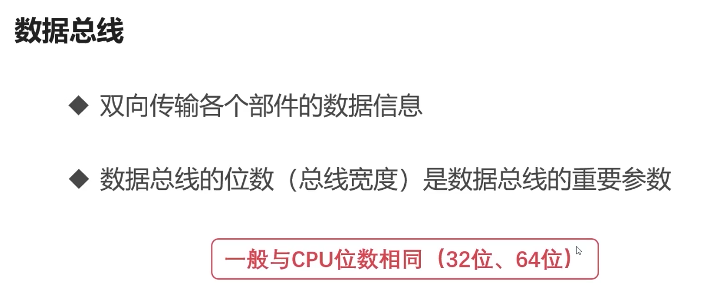
    
    
    
- #### 总线的仲裁
    
    
    
    
    
    
    
    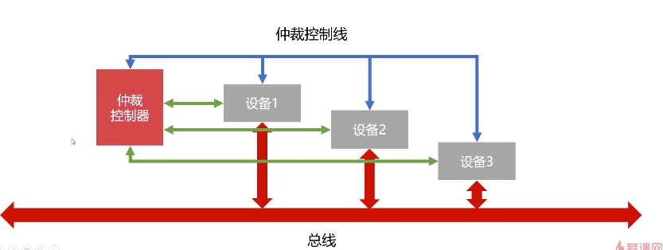
    

- #### 计算机的输入输出设备
    
    **常见的输入输出设备**
    - 字符输入设备————键盘（薄膜键盘，机械键盘，电容键盘）
    - 图形输入设备————鼠标、数位板、扫描仪

    **输入输出接口的通用设计**
    - **数据线**
        1. 是I/O设备与主机之间进行数据交换的传送线
        2. 单向传输数据线
        3. 双向传输数据线
    - **状态线**
        1. io设备状态向主机报告的信号线
        2. 查询设备是否已经正常连接并就绪
        3. 查询设备是否已经被占用
    - **命令线**
        1. CPU向设备发送命令的信号线
        2. 发送读写信号
        3. 发送启动停止信号
    - **设备选择线**
        1. 主机选择I/O设备进行操作的信号线
        2. 对连在总线上的设备进行选择
        
    **CPU与IO设备的通信**CPU速度与IO设备速度不一致
    - **程序中断**
        1. 当外围IO设备就绪时，向CPU发出中断信号
        2. CPU有专门的电路响应中断信号
        
        **提供低速设备通知CPU的一种异步的方式，CPU可以在高速运转的同时兼顾低速设备的响应**
    - **DMA（直接存储器访问）**
        1. DMA直接连接主存与IO设备
        2. DMA工作时不需要CPU的参与
        3. 硬盘、显卡中都有DMA
        

> ### 计算机的存储器
- #### 存储器的分类 

    按存储介质分类：半导体存储器、磁存储器
    
    按存取方式分类：随机存储器（RAM）、串行存储器、只读存储器（ROM）
    
- #### 存储器的层次结构
    
    **影响因素**
    - 读写速度
    - 存储容量
    - 价格
    
    

    **层次结构**
    
    
    
    
    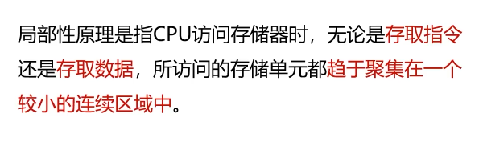
    
    
    
- #### 主存储器-内存


- #### 辅助存储器-磁盘


- #### 计算机的高速缓存

    **高速缓存的工作原理**
        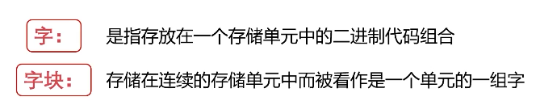
        
        
        
        
        
        
        
        
        
    **高速缓存的替换策略**
        
        
        
        
        
        
        
        
> ### 计算机的CPU

- #### 计算机的指令系统

    **机器指令的形式**
    
    
    
    
    
    
    
    
    **机器指令的操作类型**
    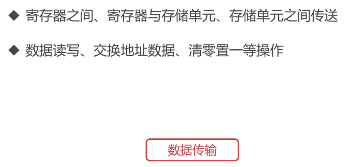
    
    
    
    
    **机器指令的寻址方式**
    
    
    
    
    
    
    
- #### 计算机的控制器
    
    
    
    、
    
    
    
    

- #### 计算机的运算器
    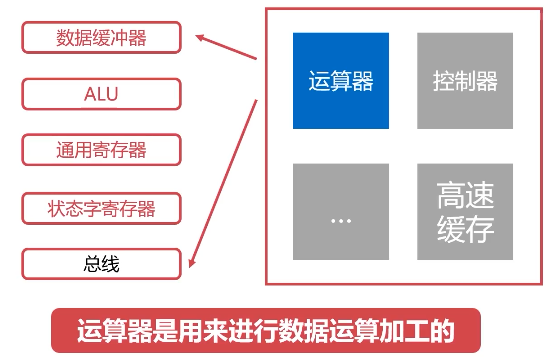
    

    **ALU**
    - ALU：算术逻辑单元，是运算器的主要组成
    - 常见的位运算（左右移、与或非等）
    - 算术运算（加减乘除等）
    
    
    
    
    
- #### 计算机指令的执行过程
    
    **指令执行过程**

    取指令-->分析指令-->分析指令
    
    
    
    **CPU的流水线设计**
    - 类似工厂的装配线
    - 工厂的装配线使得多个产品可以同时被加工
    - 在同一个时刻，不同产品均位于不同的加工阶段
    
    
    
## 计算篇
> ### 进制运算的基本知识
- #### 进制运算的基础

    **进制概述**
    - 进位制是一种记数方式，亦称进位记数法或位置计数法
    - 有限种数字符号来表示无限的数值
    - 使用的数字符号的数目称为这种进位制的基数或底数
    - 计算机喜欢二进制,但是二进制表达太长了
    - 使用大进制位可以解决这个问题
    - 八进制、十六进制满足2的n次方的要求
    
    **二进制运算的基础**
    
    
    
    
    
    
> ### 二进制数据的表示方法
- #### 有符号数与无符号数


- #### 二进制的补码表示法

 

- #### 二进制的反码表示法


- #### 小数的二进制补码表示


> ### 二进制数据的运算
- #### 定点数与浮点数

    **定点数的表示方法**
    
    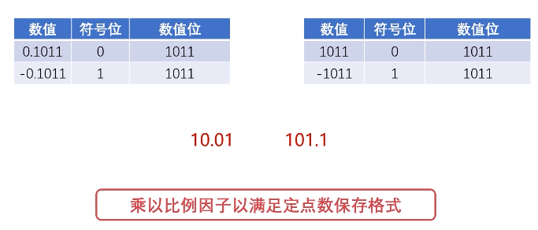
    **浮点数的表示方法**
    
    - **浮点数的表示格式**
    
    
    
    

    - **浮点数的表示范围**
    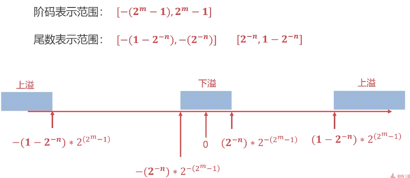
    
    - **浮点数的格式化**
    
    - **定点数与浮点数的对比**
    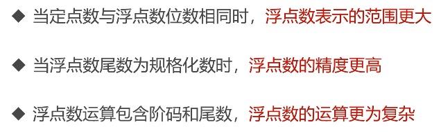
    
    
- #### 定点数的加减法运算
    
    
    
    
- #### 浮点数的加减法运算
    
    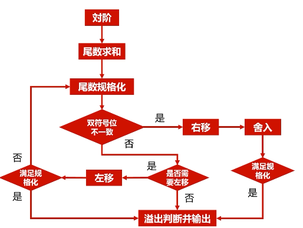
- #### 浮点数的乘除法运算
    

## 综合实践
> ### 实现双向链表
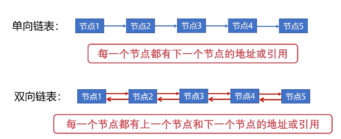

```python
class Node:
    def __init__(self, key, value):
        self.key = key
        self.value = value
        self.prev = None
        self.next = None

    def __str__(self):
        val = '{%d: %d}' % (self.key, self.value)
        return val

    def __repr__(self):
        val = '{%d: %d}' % (self.key, self.value)
        return val


class DoubleLinkedList:
    def __init__(self, capacity=0xffff):
        self.capacity = capacity
        self.head = None
        self.tail = None
        self.size = 0

    # 从头部添加
    def __add_head(self, node):
        if not self.head:
            self.head = node
            self.tail = node
            self.head.next = None
            self.head.prev = None
        else:
            node.next = self.head
            self.head.prev = node
            self.head = node
            self.head.prev = None
        self.size += 1
        return node

    # 从尾部添加
    def __add_tail(self, node):
        if not self.tail:
            self.tail = node
            self.head = node
            self.tail.next = None
            self.tail.prev = None
        else:
            self.tail.next = node
            node.prev = self.tail
            self.tail = node
            self.tail.next = None
        self.size += 1
        return node

    # 从尾部删除
    def __del_tail(self):
        if not self.tail:
            return
        node = self.tail
        if node.prev:
            self.tail = node.prev
            self.tail.next = None
        else:
            self.tail = self.head = None
        self.size -= 1
        return node

    # 从头部删除
    def __del_head(self):
        if not self.head:
            return
        node = self.head
        if self.head.next:
            self.head.next.prev = None
            self.head = self.head.next
        else:
            self.head = self.tail = None
        self.size -= 1
        return node

    # 任意节点删除
    def __remove(self, node):
        # 如果node=None, 默认删除尾部节点
        if not node:
            node = self.tail
        if node == self.tail:
            self.__del_tail()
        elif node == self.head:
            self.__del_head()
        else:
            node.prev.next = node.next
            node.next.prev = node.prev
            self.size -= 1
        return node

    def pop(self):
        return self.__del_head()

    def append(self, node):
        return self.__add_tail(node)

    def append_front(self, node):
        return self.__add_head(node)

    def remove(self, node=None):
        return self.__remove(node)

    def print(self):
        p = self.head
        line = ''
        while p:
            line += '%s' % (p)
            p = p.next
            if p:
                line += '->'
        print(line)


if __name__ == '__main__':
    l = DoubleLinkedList(10)
    nodes = []
    for i in range(10):
        node = Node(i, i)
        nodes.append(node)

    l.append(nodes[0])
    l.print()
    l.append(nodes[1])
    l.print()
    l.pop()
    l.print()
    l.append(nodes[2])
    l.print()
    l.append_front(nodes[3])
    l.print()
    l.append(nodes[4])
    l.print()
    l.remove(nodes[2])
    l.print()
    l.remove()
    l.print()

```
> ### 实现置换算法
> ### 先进先出/FIFO算法
```python
from computer_principle.DoubleLinkedList import DoubleLinkedList, Node


class FIFOCache(object):
    def __init__(self, capacity):
        self.capacity = capacity
        self.size = 0
        self.map = {}
        self.list = DoubleLinkedList(self.capacity)

    def get(self, key):
        if key not in self.map:
            return -1
        else:
            node = self.map.get(key)
            return node.value

    def put(self, key, value):
        if self.capacity == 0:
            return

        if key in self.map:
            node = self.map.get(key)
            self.list.remove(node)
            node.value = value
            self.list.append(node)
        else:
            if self.size == self.capacity:
                node = self.list.pop()
                del self.map[node.key]
                self.size -= 1
            node = Node(key, value)
            self.list.append(node)
            self.map[key] = node
            self.size += 1

    def print(self):
        self.list.print()


if __name__ == '__main__':
    cache = FIFOCache(2)
    cache.put(1, 1)
    cache.print()
    cache.put(2, 2)
    cache.print()
    print(cache.get(1))
    cache.put(3, 3)
    cache.print()
    print(cache.get(2))
    cache.print()
    cache.put(4, 4)
    cache.print()
    print(cache.get(1))
```
> ### 最近最少使用/LRU算法
 
 ```python
class DLinkListNode:
    def __init__(self, key=0, val=0, pre=None, next=None):
        self.key = key
        self.val = val
        self.pre = pre
        self.next = next

class LRUCache:

    def __init__(self, capacity: int):
        self.map = dict()
        self.head = DLinkListNode(-1, -1)
        self.tail = DLinkListNode(-1, -1)
        self.cap = capacity
        self.size = 0
        self.head.next = self.tail
        self.tail.pre = self.head


    def get(self, key: int) -> int:
        node = self.map.get(key, None)
        if node:
            node.next.pre = node.pre
            node.pre.next = node.next
            node.pre = self.head
            self.head.next.pre = node
            node.next = self.head.next
            self.head.next = node
            return node.val
        else:
            return -1


    def put(self, key: int, value: int) -> None:
        node = self.map.get(key, None)
        if node:
            node.val = value
            node.next.pre = node.pre
            node.pre.next = node.next

            node.pre = self.head
            self.head.next.pre = node
            node.next = self.head.next
            self.head.next = node

        else:
            if self.size == self.cap:
                del_node = self.tail.pre
                self.tail.pre = del_node.pre
                del_node.pre.next = self.tail
                self.map.pop(del_node.key)
                del_node.pre = None
                del_node.next = None
                self.size -= 1

            cur =  DLinkListNode(key, value)
            cur.pre = self.head
            self.head.next.pre = cur
            cur.next = self.head.next
            self.head.next = cur
            self.map[key] = cur
            self.size += 1

  
 ```
> ### 最不经常使用/LFU算法 


```python
from computer_principle.DoubleLinkedList import DoubleLinkedList, Node


class LFUNode(Node):
    def __init__(self, key, value):
        self.freq = 0
        super(LFUNode, self).__init__(key, value)


class LFUCache(object):

    def __init__(self, capacity):
        self.capacity = capacity
        self.map = {}
        # key: 频率, value: 频率对应的双向链表
        self.freq_map = {}
        self.size = 0

    # 更新节点频率的操作
    def __update_freq(self, node):
        freq = node.freq

        # 删除
        node = self.freq_map[freq].remove(node)
        if self.freq_map[freq].size == 0:
            del self.freq_map[freq]

        # 更新
        freq += 1
        node.freq = freq
        if freq not in self.freq_map:
            self.freq_map[freq] = DoubleLinkedList()
        self.freq_map[freq].append(node)

    def get(self, key):
        if key not in self.map:
            return -1
        node = self.map.get(key)
        self.__update_freq(node)
        return node.value

    def put(self, key, value):
        if self.capacity == 0:
            return

        # 缓存命中
        if key in self.map:
            node = self.map.get(key)
            node.value = value
            self.__update_freq(node)

        # 缓存没有命中
        else:
            if self.capacity == self.size:
                min_freq = min(self.freq_map)
                node = self.freq_map[min_freq].pop()
                del self.map[node.key]
                self.size -= 1
            node = LFUNode(key, value)
            node.freq = 1
            self.map[key] = node
            if node.freq not in self.freq_map:
                self.freq_map[node.freq] = DoubleLinkedList()
            node = self.freq_map[node.freq].append(node)
            self.size += 1

    def print(self):
        print('***************************')
        for k, v in self.freq_map.items():
            print('Freq = %d' % k)
            self.freq_map[k].print()
        print('***************************')
        print()
```