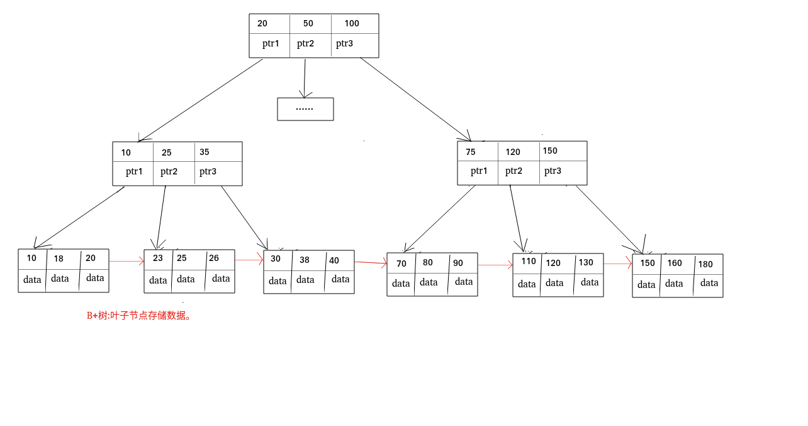
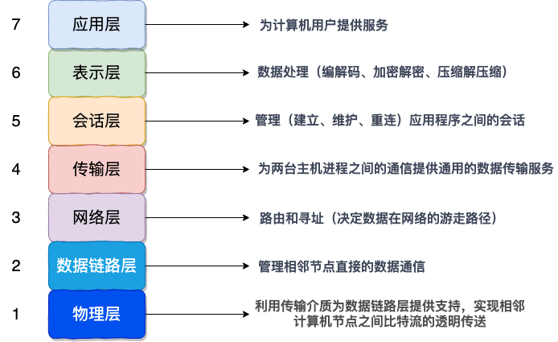

# 自我介绍
面试官，您好。我叫韦语轩。大学期间我主要学习了Java 以及spring 、mybatis等框架。在校期间参加过两个实验室，主要是利用Springboot mybtis redis以及python的Django 技术进行后端的开发，之后做好的项目代表实验室参加比赛，获得了多次的奖。之后在大三进行了实习，在公司担任开发实习，从事前端react和后端的开发，参与了优惠券系统，拉新系统、微信登陆系统的重构与开发。参加了多个第三方库的开发。研究生期间在一边帮导师做横向项目，一边参加了蓝桥杯算法竞赛获得了研究生组国二省一的成绩。积极参加了社团学生会活动。平常喜欢看变成书籍和视频做笔记，博客已经在github上面开源。我一直都非常希望能加入贵公司，我觉得贵公司的文化和技术氛围我都非常喜欢（IBM说自己的导师是IBM出身）。期待与您共事。

# HR反问

## HR

1. 能不能谈谈你作为一个公司老员工对公司的感受?
2. 你有什么建议或者评价给我吗?
3. 接下来我会有一段空档期,有什么值得注意或者建议学习的吗?
4. 这个岗位为什么还在招人?(岗位真实性和价值咨询)
5. 大概什么时候能给我回复呢?(终面的时候,如果面试官没有说的话,可以问一下)
6. 如果通过的话,下一面会在什么时候举行,什么形式?

## 部门领导

1. 公司对新员工的培养机制是什么呢？
2. 在您看来，这个岗位在未来公司发展怎么样呢？
3. 团队现在面临的最大挑战是什么呢？

## 老板/总裁

1. 贵公司的发展目标和方向是什么?
2. 与同行业的竞争者相比,贵公司的核心竞争优势在什么地方?
3. 公司现在面临的最大挑战是什么?

# 简历问答
## 底层CPython的内建对象的底层实现
Python是由C实现的，Python万物皆对象，但实际上在C的层面来看，每一个对象都是pyobject的struct，同时pyobject内部维护着属于这个对象的类型，比如说float，就会有一个structs 是pyfloat_object,同时他会有自己的内部实现方式，比如说int就是大数，他永远不会溢出，因为底层是由一个数组组成的。Python的实现和redis很相似。

## Python虚拟机的基本机制
python的虚拟机被称之为解释器，他和java可以对比，这个解释器包含了一个编译器一个虚拟机，而java是分开的。
pyc文件就是python编译成的代码对象，对应java的.class对象。在知道了这个运行机制的前提下，可以通过dis这个包反编译出字节码，然后可以看看哪种写法好，别入直接交换赋值比引入中间变量在字节码层面快。

## GIL全局锁
gil锁保证了一个进程中只有一个线程在运行。比如python的底层append实现，有时候是需要扩容的，但是却并不能在底层代码中发现所得存在，是因为gil锁的存在，gil锁保证了python的一条代码就是一条代码，不管底层是几条实现的，在执行完这一条都必然是原子性的。并行环境下对象锁和的开销和gil差不多，但是单线程gil锁更优。我们可以多核cpu运行计算密集型，多线程运行io密集型来打消其中影响。

## 内存池的实现思路

内存分为六层，引入内存池是因为python对象的频繁创建，如果使用c原生的，会带来非常大的压力。最大程度避免内存碎片。 为了避免内存碎片，python底层是按尺寸分类进行管理的。以 _512_ 字节为限，小于 _512_ 的内存分配才会被内存池接管，_Python_ 以 _8_ 字节为梯度，将内存块分为：_8_ 字节、_16_ 字节、_24_ 字节，以此类推。总共 _64_ 种。当 _Python_ 通过内存池申请内存时，如果没有可用 _pool_ ，内存池将新申请一个 _4K_ 页，并进行初始化。每个pool相连，当一个池子完全没有占用时就会释放。

## 垃圾回收机制

会用引用计数法来进行垃圾回收，当引用计数为零时会进行回收，也会有标记法进行检查循环引用。如果进行了循环引用就进行回收。同时不同的对象通过垃圾回收链串在一起可以不断的发现。分代回收机制，每次只处理某个代中的对象，因此 _GC_ 卡顿时间更短。一个对象存在的时间越长，它的代就越大，回收的概率就越低。每触发701次gc对象，触发一次新生代gc，每执行11次新生代，触发1次中生代，每执行11次中生代，触发一次老生代。执行每个代前面的代也得gc。不是连续的以链表的方式连接。

## springboot自动装配

启动过程本质上都是在做容器的初始化，并将对应的bean初始化出来放入容器。在spring环境中，每个bean的初始化都要开发者自己添加设置，但是切换成springboot程序后，自动配置功能的添加帮助开发者提前预设了很多bean的初始化过程。
1.  springboot启动流程是先初始化容器需要的各种配置，并加载成各种对象，初始化容器时读取这些对象，创建容器
2.  整体流程采用事件监听的机制进行过程控制，开发者可以根据需要自行扩展，添加对应的监听器绑定具体事件，就可以在事件触发位置执行开发者的业务代码

## redis网络模型

基于epoll的io多路复用模型
服务器启动以后，服务端会去调用epoll_create，创建一个epoll实例，epoll实例中包含两个数据

1、红黑树（为空）：rb_root 用来去记录需要被监听的FD

2、链表（为空）：list_head，用来存放已经就绪的FD

创建好了之后，会去调用epoll_ctl函数，此函数会会将需要监听的数据添加到rb_root中去，并且对当前这些存在于红黑树的节点设置回调函数，当这些被监听的数据一旦准备完成，就会被调用，而调用的结果就是将红黑树的fd添加到list_head中去(但是此时并没有完成)

3、当第二步完成后，就会调用epoll_wait函数，这个函数会去校验是否有数据准备完毕（因为数据一旦准备就绪，就会被回调函数添加到list_head中），在等待了一段时间后(可以进行配置)，如果等够了超时时间，则返回没有数据，如果有，则进一步判断当前是什么事件，如果是建立连接时间，则调用accept() 接受客户端socket，拿到建立连接的socket，然后建立起来连接，如果是其他事件，则把数据进行写出。

## redis内存回收机制

- 内存过期策略
RedisKey的TTL记录方式：

在RedisDB中通过一个Dict记录每个Key的TTL时间

过期key的删除策略：

惰性清理：每次查找key时判断是否过期，如果过期则删除

定期清理：定期抽样部分key，判断是否过期，如果过期则删除。
定期清理的两种模式：

SLOW模式执行频率默认为10，每次不超过25ms

FAST模式执行频率不固定，但两次间隔不低于2ms，每次耗时不超过1ms

- 内存淘汰策略有很多，主要是下面两个
  * LRU（Least Recently Used），最少最近使用。用当前时间减去最后一次访问时间，这个值越大则淘汰优先级越高。
  * LFU（Least Frequently Used），最少频率使用。会统计每个key的访问频率，值越小淘汰优先级越高。（逻辑访问次数）

# spring
## Spring,Spring MVC,Spring Boot 之间什么关系

- Spring 包含了多个功能模块，其中最重要的是 Spring-Core（主要提供 IoC 依赖注入功能的支持） 模块， Spring 中的其他模块（比如 Spring MVC）的功能实现基本都需要依赖于该模块。
- Spring MVC 是 Spring 中的一个很重要的模块，主要赋予 Spring 快速构建 MVC 架构的 Web 程序的能力。MVC 是模型(Model)、视图(View)、控制器(Controller)的简写，其核心思想是通过将业务逻辑、数据、显示分离来组织代码。
- Spring 旨在简化 J2EE 企业应用程序开发。Spring Boot 旨在简化 Spring 开发（减少配置文件，开箱即用！）。
- Spring Boot 只是简化了配置，如果你需要构建 MVC 架构的 Web 程序，你还是需要使用 Spring MVC 作为 MVC 框架，只是说 Spring Boot 帮你简化了 Spring MVC 的很多配置

## 简述Spring MVC

-   Model:系统涉及的数据，也就是 dao 和 bean。
-   View：展示模型中的数据，只是用来展示。
-   Controller：处理用户请求都发送给 ，返回数据给 JSP 并展示给用户。

由jsp -> jsp+servlet -> ssh -> ssm ->Spring MVC 下我们一般把后端项目分为 Service 层（处理业务）、Dao 层（数据库操作）、Entity 层（实体类）、Controller 层(控制层，返回数据给前台页面)。

## SpringMVC工作原理

**流程说明（重要）：**

1.  客户端（浏览器）发送请求， `DispatcherServlet`拦截请求。
2.  `DispatcherServlet` 根据请求信息调用 `HandlerMapping` 。`HandlerMapping` 根据 uri 去匹配查找能处理的 `Handler`（也就是我们平常说的 `Controller` 控制器） ，并会将请求涉及到的拦截器和 `Handler` 一起封装。
3.  `DispatcherServlet` 调用 `HandlerAdapter`适配执行 `Handler` 。
4.  `Handler` 完成对用户请求的处理后，会返回一个 `ModelAndView` 对象给`DispatcherServlet`，`ModelAndView` 顾名思义，包含了数据模型以及相应的视图的信息。`Model` 是返回的数据对象，`View` 是个逻辑上的 `View`。
5.  `ViewResolver` 会根据逻辑 `View` 查找实际的 `View`。
6.  `DispaterServlet` 把返回的 `Model` 传给 `View`（视图渲染）。
7.  把 `View` 返回给请求者（浏览器）

# docker

## 什么是容器？

**一句话概括容器：容器就是将软件打包成标准化单元，以用于开发、交付和部署。**

## 什么是docker？

-  Docker 是世界领先的软件容器平台，基于 **Go 语言** 进行开发实现。
- Docker 可以**对进程进行封装隔离，属于操作系统层面的虚拟化技术。** 由于隔离的进程独立于宿主和其它的隔离的进程，因此也称其为容器。

# Mysql
## MySQL的索引？二级索引？

**索引是一种用于快速查询和检索数据的数据结构。常见的索引结构有: B 树， B+树和 Hash**。

主键索引(Primary Key)
数据表的主键列使用的就是主键索引。

一张数据表有只能有一个主键，并且主键不能为 null，不能重复。

在 MySQL 的 InnoDB 的表中，当没有显示的指定表的主键时，InnoDB 会自动先检查表中是否有唯一索引且不允许存在null值的字段，如果有，则选择该字段为默认的主键，否则 InnoDB 将会自动创建一个 6Byte 的自增主键。

二级索引又称为辅助索引，是因为二级索引的叶子节点存储的数据是主键。也就是说，通过二级索引，可以定位主键的位置。

唯一索引，普通索引，前缀索引等索引属于二级索引。

## 索引的底层数据结构

Hash表 & B+树
哈希表是键值对的集合，通过键(key)即可快速取出对应的值(value)，因此哈希表可以快速检索数据（接近 O（1））。

Hash 索引不支持顺序和范围查询(Hash 索引不支持顺序和范围查询是它最大的缺点

## B 树& B+树的区别

B 树也称 B-树,全称为 多路平衡查找树 ，B+ 树是 B 树的一种变体。B 树和 B+树中的 B 是 Balanced （平衡）的意思。

目前大部分数据库系统及文件系统都采用 B-Tree 或其变种 B+Tree 作为索引结构。

*   B 树的所有节点既存放键(key) 也存放 数据(data)，而 B+树只有叶子节点存放 key 和 data，其他内节点只存放 key。
*   B 树的叶子节点都是独立的;B+树的叶子节点有一条引用链指向与它相邻的叶子节点。
*   B 树的检索的过程相当于对范围内的每个节点的关键字做二分查找，可能还没有到达叶子节点，检索就结束了。而 B+树的检索效率就很稳定了，任何查找都是从根节点到叶子节点的过程，叶子节点的顺序检索很明显。

在 MySQL 中，MyISAM 引擎和 InnoDB 引擎都是使用 B+Tree 作为索引结构，但是，两者的实现方式不太一样。

## MySQL的ACID

1.  原子性（Atomicity） ： 事务是最小的执行单位，不允许分割。事务的原子性确保动作要么全部完成，要么完全不起作用；
2.  一致性（Consistency）： 执行事务前后，数据保持一致，例如转账业务中，无论事务是否成功，转账者和收款人的总额应该是不变的；
3.  隔离性（Isolation）： 并发访问数据库时，一个用户的事务不被其他事务所干扰，各并发事务之间数据库是独立的；
4.  持久性（Durability）： 一个事务被提交之后。它对数据库中数据的改变是持久的，即使数据库发生故障也不应该对其有任何影响。

## 数据事务的实现原理呢？

我们这里以 MySQL 的 InnoDB 引擎为例来简单说一下。

MySQL InnoDB 引擎使用 redo log(重做日志) 保证事务的持久性，使用 undo log(回滚日志) 来保证事务的原子性。

MySQL InnoDB 引擎通过 锁机制、MVCC 等手段来保证事务的隔离性（ 默认支持的隔离级别是 REPEATABLE-READ ）。

## MyISAM 和 InnoDB 有什么区别？

-   InnoDB 支持行级别的锁粒度，MyISAM 不支持，只支持表级别的锁粒度。
-   MyISAM 不提供事务支持。InnoDB 提供事务支持，实现了 SQL 标准定义了四个隔离级别。
-   MyISAM 不支持外键，而 InnoDB 支持。
-   MyISAM 不支持 MVVC，而 InnoDB 支持。
-   虽然 MyISAM 引擎和 InnoDB 引擎都是使用 B+Tree 作为索引结构，但是两者的实现方式不太一样。
-   MyISAM 不支持数据库异常崩溃后的安全恢复，而 InnoDB 支持。
-   InnoDB 的性能比 MyISAM 更强大。

## 索引设计规范
- 限制每张表上的索引数量 索引可以增加查询效率，但同样也会降低插入和更新的效率，甚至有些情况下会降低查询效率。
- 禁止使用全文索引
- 不要使用更新频繁的列作为主键，不适用多列主键（相当于联合索引）
- 不要使用 UUID,MD5,HASH,字符串列作为主键（无法保证数据的顺序增长）
- 主键建议使用自增 ID 值

## 为什么不推荐使用外键与级联?

外键与级联更新适用于单机低并发，不适合分布式、高并发集群; 级联更新是强阻塞，存在数据库更新风暴的风 险; 外键影响数据库的插入速度。对分库分表不友好。

# Python

## __slots__节约内存

如果在一个类中定义了__slots__属性，那么这个类的实例将不会拥有__dict__属性，没有__dict__的实例也就不能添加实例属性了。简单来说，__slots__的作用就是阻止类在实例化时为实例分配__dict__属性，限制该实例能添加的属性。

## 偏函数

把一个函数的某些参数给固定住（也就是设置默认值），返回一个新的函数，调用这个新函数会更简单。int2 = functools.partial(int, base=2)

# 计算机网络

##  OSI 七层模型

OSI 七层模型 是国际标准化组织提出一个网络分层模型，其大体结构以及每一层提供的功能如下图所示：

## TCP 三次握手和四次挥手

### 为什么要三次握手?

三次握手的目的是建立可靠的通信信道，说到通讯，简单来说就是数据的发送与接收，而三次握手最主要的目的就是双方确认自己与对方的发送与接收是正常的。

### 为什么要四次挥手？

TCP是全双工通信，可以双向传输数据。任何一方都可以在数据传送结束后发出连接释放的通知，待对方确认后进入半关闭状态。当另一方也没有数据再发送的时候，则发出连接释放通知，对方确认后就完全关闭了 TCP 连接。

# Redis

## 常见的缓存更新策略

- 旁路缓存
	- 想更新db，再删除缓存。虽然也会出现缓存不一致的情况，但是对缓存的操作要快于db的操作，可能性很小。
	- 写操作频繁会导致，频繁删除key。可以在强一致性的环境下采用加锁更新缓存的方法。
- 读写穿透
	- 写和读都操作cache，写的时候由ca che

## 缓存穿透
缓存穿透：缓存穿透是指客户端请求的数据在缓存中和数据库中都不存在，这样缓存永远不会生效，这些请求都会打到数据库。

常见解决方案有两种：
1. 缓存控对象 （额外的内存消耗，可能造成短期不一致）
2. 布隆过滤 （使用哈希的方式来判断这个key是否存在，可能存在误判）

## 缓存雪崩

同一时间大量缓存的key同时失效、服务宕机。

解决方案：
-   给不同的Key的TTL添加随机值
-   利用Redis集群提高服务的可用性
-   给缓存业务添加降级限流策略
-   给业务添加多级缓存

## 缓存击穿

热点key过期问题，就是一个高并发访问并且缓存重建业务较复杂的key突然失效了，无数的请求访问会在瞬间给数据库带来巨大的冲击。

解决方案：
-   互斥锁
-   逻辑过期(不设置实际过期时间，在value加入过期时间，用代码逻辑去解决，新开一个线程去重建，没有获得互斥锁的，直接返回过期数据。)

## 超卖问题

悲观锁:
导致数据串行化执行。

乐观锁:
在sql的时候进行库存的判断保证大于0，不要先取出来在java里判断。

## 一人一单问题

如果是分布式环境下，有多个服务，那么加锁的一人一单会失败，需要使用分布式锁，setnx。

## redis网络中断怎么办

如果是数据库网络中断，就先直接查询数据库或着看是否有多级缓存。如果是获取分布式锁网络中断。redission可以使用超时重试的方法进行抢锁。

# juc

## java的线程通信

当多个线程共同操作共享的资源时，线程间通过某种方式互相告知自己的状态，以避免无效的资源争夺。

1.  **互斥量(Mutex)**：采用互斥对象机制，只有拥有互斥对象的线程才有访问公共资源的权限。因为互斥对象只有一个，所以可以保证公共资源不会被多个线程同时访问。比如 Java 中的 synchronized 关键词和各种 Lock 都是这种机制。
2.  **信号量(Semaphore)** ：它允许同一时刻多个线程访问同一资源，但是需要控制同一时刻访问此资源的最大线程数量。
3.  **事件(Event)** :Wait/Notify：通过通知操作的方式来保持多线程同步，还可以方便的实现多线程优先级的比较操作。

## 线程池饱和的策略
-   **`ThreadPoolExecutor.AbortPolicy`：** 抛出 `RejectedExecutionException`来拒绝新任务的处理。
-   **`ThreadPoolExecutor.CallerRunsPolicy`：** 调用执行自己的线程运行任务，也就是直接在调用`execute`方法的线程中运行(`run`)被拒绝的任务，如果执行程序已关闭，则会丢弃该任务。因此这种策略会降低对于新任务提交速度，影响程序的整体性能。如果您的应用程序可以承受此延迟并且你要求任何一个任务请求都要被执行的话，你可以选择这个策略。
-   **`ThreadPoolExecutor.DiscardPolicy`：** 不处理新任务，直接丢弃掉。
-   **`ThreadPoolExecutor.DiscardOldestPolicy`：** 此策略将丢弃最早的未处理的任务请求。

# 操作系统

## 死锁的四个条件

-   **互斥**：资源必须处于非共享模式，即一次只有一个进程可以使用。如果另一进程申请该资源，那么必须等待直到该资源被释放为止。
-   **占有并等待**：一个进程至少应该占有一个资源，并等待另一资源，而该资源被其他进程所占有。
-   **非抢占**：资源不能被抢占。只能在持有资源的进程完成任务后，该资源才会被释放。
-   **循环等待**：有一组等待进程 `{P0, P1,..., Pn}`， `P0` 等待的资源被 `P1` 占有，`P1` 等待的资源被 `P2` 占有，......，`Pn-1` 等待的资源被 `Pn` 占有，`Pn` 等待的资源被 `P0` 占有。

## 进程的通讯方式

-   **管道/匿名管道(Pipes)** ：用于具有亲缘关系的父子进程间或者兄弟进程之间的通信。
-   **有名管道(Named Pipes)** : 匿名管道由于没有名字，只能用于亲缘关系的进程间通信。为了克服这个缺点，提出了有名管道。有名管道严格遵循**先进先出(first in first out)**。有名管道以磁盘文件的方式存在，可以实现本机任意两个进程通信。
-   **信号(Signal)** ：信号是一种比较复杂的通信方式，用于通知接收进程某个事件已经发生；
-   **消息队列(Message Queuing)** ：消息队列是消息的链表,具有特定的格式,存放在内存中并由消息队列标识符标识。管道和消息队列的通信数据都是先进先出的原则。与管道（无名管道：只存在于内存中的文件；命名管道：存在于实际的磁盘介质或者文件系统）不同的是消息队列存放在内核中，只有在内核重启(即，操作系统重启)或者显式地删除一个消息队列时，该消息队列才会被真正的删除。消息队列可以实现消息的随机查询,消息不一定要以先进先出的次序读取,也可以按消息的类型读取.比 FIFO 更有优势。**消息队列克服了信号承载信息量少，管道只能承载无格式字 节流以及缓冲区大小受限等缺点。**
-   **信号量(Semaphores)** ：信号量是一个计数器，用于多进程对共享数据的访问，信号量的意图在于进程间同步。这种通信方式主要用于解决与同步相关的问题并避免竞争条件。
-   **共享内存(Shared memory)** ：使得多个进程可以访问同一块内存空间，不同进程可以及时看到对方进程中对共享内存中数据的更新。这种方式需要依靠某种同步操作，如互斥锁和信号量等。可以说这是最有用的进程间通信方式。
-   **套接字(Sockets)** : 此方法主要用于在客户端和服务器之间通过网络进行通信。套接字是支持 TCP/IP 的网络通信的基本操作单元，可以看做是不同主机之间的进程进行双向通信的端点，简单的说就是通信的两方的一种约定，用套接字中的相关函数来完成通信过程。