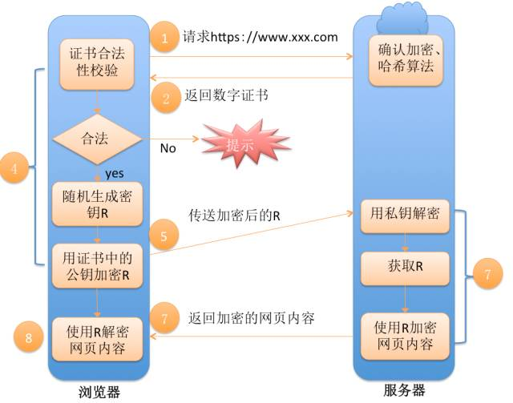

# 自我介绍
**面试官**
面试官，您好。我叫韦语轩。山西运城人。大学是浙江传媒学院，研究生是北京石油化工学院，大学期间我利用课外时间主要学习了Java 以及spring 、mybatis等框架。在校期间参加过两个实验室，主要是利用Springboot mybtis redis以及python技术进行后端的开发，之后做好的项目代表实验室参加比赛，获得了多次的奖。之后在大三进行了实习，在公司担任开发实习，从事前端react和后端的开发，参与了优惠券系统，拉新系统、微信登陆系统的重构与开发。参加了多个第三方库的开发。研究生期间以小组负责人身份一直带领组员做横向项目，主要负责技术选型和前后端开发的实现。还参加了蓝桥杯算法竞赛获得了研究生组国二省一的成绩。同时也在人工智能公司实习过，担任后端开发的职责，独立完成了一个核心项目和多个模块项目。介绍一下openai的网关项目。在校积极参加了社团学生会活动。平常喜欢看编程书籍和视频做笔记，博客已经在github上面开源，也开源了一些项目，有几十个star。我一直都非常希望能加入贵公司。期待与您共事。

**hr**
面试官，您好。我叫韦语轩。大学期间我主要学习了多门编程技术。在校期间参加过两个实验室，主要是利用Springboot mybtis redis以及python技术进行后端的开发，之后做好的项目代表实验室参加比赛，获得了多次的奖。之后在大三进行了实习，在公司担任开发实习，从事前端react和后端的开发，参与了优惠券系统，拉新系统、微信登陆系统的重构与开发。参加了多个第三方库的开发。研究生期间以小组负责人身份一直带领组员做横向项目，主要负责技术选型和前后端开发的实现。还参加了蓝桥杯算法竞赛获得了研究生组国二省一的成绩。同时也在人工智能公司实习过，担任后端开发的职责，独立完成了一个核心项目和多个模块项目。在校积极参加了社团学生会活动。平常喜欢看编程书籍和视频做笔记，博客已经在github上面开源，也开源了一些项目，有几十个star。我一直都非常希望能加入贵公司。期待与您共事。

# 性格测试
## **定位**

乐观，自信，守时，抗压性强，有良好团队合作精神，勤奋刻苦。
“不确定，轻微不同意，轻微同意” 出现概率不要太高


## boss直聘打招呼
我是北京石油化工人工智能研究院2024级的硕士研究生，曾在上海数字大脑研究院、九章算法杭州科技有限公司有过后端开发实习的相关实习经验，负责openai网关项目的开发、营销平台项目的开发、ascvd智能医疗系统–横向课题、实时心电检测项目–横向课题，我有意向在后端开发方向发展。本人有较强的自学能力，喜欢对技术进行钻研，且具有高执行度和一定的抗压能力，希望您能看一下我的简历。

本人对JVM,并发编程，微服务，中间件，数据库等相关技术都有深入的理解和储备，平常除了满足业务开发的基本需要之外，在业务时间也会进行技术实力的提升，具备了比较完善的技术体系
## 自我评价
本人有良好的心理素质，能正确的认识和评价自己，虚心接受他人的建议。拥有良好表达和沟通能力，性情温和，易于与他人合作。积极进取、注意细节、工作态度认真、责任心强、对工作精益求精、时间观念强，有上进心。有较强的自学能力，喜欢对技术进行钻研。喜欢阅读书籍丰富自己的知识。

## 说明自己的职业规划
面试官是这样的，我个人的职业规划是希望能够沿着技术这条路一直走下去，我现在给自己的定位是中级或者高级开发工程，自己的技术体系和深度还是不够完善，所以希望能够继续加深自己的技术储备，同时能够想着架构师这个方向去发展，当然在储备技术的同时，也想增加自己的管理能力，之前有过带五六个人的经验，但是不够，我希望自己能够带领更多人的团队，打造一个高效的研发团队，以技术为支撑，管理作为赋能，当然我也希望自己之后能够扎根到某一个行业中，储备这个行业相关的背景和专业知识，能够在更大的平台贡献自己的能力，也希望自己有更好的发展

也可以按年限来聊。

## 如何谈缺点
有些固执，在做项目的时候，总是会想该项目或者该技术有没有最佳实践，想要知道最佳实践并运用在项目中。我个人觉得有必要了解最佳实践为什么会是这样。

同时可能有些慢热，对于同事需要多交流，尤其是技术方面的，多交流技术方面的，有助于加深程序员之间的关系，慢慢成为朋友就会关系特别好，实习的时候和之前的同事在离开后也都有联系。
# HR反问

## 如何谈薪
我期望的薪水是18k,是根据我的经验和目前的面试反馈得到的这样一个数值，其实我已经收到16k的offr了，但
是在最近几次的面试中，跟面试官的交流比较融洽，我感觉他是一个技术很牛逼的人，我也希望能在他手下获得更多的发展，同时跟您的交流，包括看到咱们公司的场地，人文这些都是我比较喜欢的，而且咱们公司的平台和现在做的业务方向也是我一直想要尝试的方向，所以我期望能拿到18k,如果说给不到这样的薪水的话，我也希望能够跟我上一个off的薪水持平，相对比之下，我还是比较喜欢咱们公司的，您能公司这边能否接受？

## HR

1. 能不能谈谈你作为一个公司老员工对公司的感受?
2. 你有什么建议或者评价给我吗?
3. 接下来我会有一段空档期,有什么值得注意或者建议学习的吗?
4. 这个岗位为什么还在招人?(岗位真实性和价值咨询)
5. 大概什么时候能给我回复呢?(终面的时候,如果面试官没有说的话,可以问一下)
6. 如果通过的话,下一面会在什么时候举行,什么形式?

## 部门领导

1. 公司对新员工的培养机制是什么呢？
2. 在您看来，这个岗位在未来公司发展怎么样呢？
3. 团队现在面临的最大挑战是什么呢？

## 技术面试官
1、咱们公司内部的技术栈是什么样的，如果我有幸入职咱们公司的话，需要提前做什么准备
2、咱们公司技术团队内部有没有什么技术分享会之类的内容，关注于大家的技术提升
3、之前看过咱们公司的官网，了解过咱们公司是做XX行业解决方案的，您能详细给我说一下嘛
4、如果我有幸入职咱们公司的话，主要做哪些方面的工作
5、咱们公司技术团队的规模是什么样的
6、在咱们公司，有什么样的内部晋升的空间和方式
7、面试官，能否指点一下，我个人技术层面有哪些可以提升的。

## 老板/总裁

1. 贵公司的发展目标和方向是什么?
2. 与同行业的竞争者相比,贵公司的核心竞争优势在什么地方?
3. 公司现在面临的最大挑战是什么?

# 简历问答

1. 您在实习期间参与的核心项目开发是什么？您在项目中的具体角色和贡献是什么？ 2. 您在公司完成的核心项目openai网关是如何实现群发和私聊消息卡片的飞书告警机器人的？您对这个项目有什么具体的想法和改进？ 3. 您在九章算法实习期间参与的优惠券系统开发中，使用了哪些设计模式进行重构？您觉得这些重构对系统的扩展性有何影响？ 4. 您在九章算法实习期间参与的微信扫码登录系统重新梳理与开发中，如何使前端与后端的登录交互更加合理？您对后端查询优化有做过哪些工作？ 5. 您在开发对接飞书聊天机器人的项目中，如何将飞书oauth认证与网关服务相结合，实现身份认证和调用转发？您对这个项目有哪些具体的贡献？ 6. 您在拉新平台的用户抽奖微服务中，使用了哪些设计模式对抽奖过程和多类型抽奖服务进行构建？您觉得这些设计模式对系统的可维护性和扩展性有何影响？ 7. 您在手写Spring源码学习项目中，通过抽象、设计模式和设计原则实现了Spring的核心功能，您觉得这个项目对您的收获有哪些？ 8. 您在职业技能方面，熟练掌握了Java编程语言、Spring框架、MySQL数据库等技术，您能否举例说明您在实际项目中如何应用这些技术？ 9. 您在Linux相关方面有相关开发经验，进行过web与深度学习模型的部署，有运用Docker容器的经验，接触过k8s相关开发，能否具体介绍一下您在这方面的工作经验和项目经历？ 10. 您在工具方面熟练使用Python，有进行过多线程/io多路复用爬虫的开发，能否举例说明一下您在实际项目中如何应用Python进行开发？ 11. 您在团队协作开发方面有使用过Git进行版本控制，能否具体介绍一下您在团队协作中的角色和贡献？您对CI/CD有过哪些经验？ 12. 您在前端开发方面熟悉React框架，有用React+Less开发过实际项目，能否具体介绍一下您在前端开发中的角色和贡献？您对前端组件化开发有什么理解和经验？ 13. 您在Spring Cloud微服务方面有了解和经验，能否具体介绍一下您对Spring Cloud常见微服务组件的了解和应用经验？

## 如何回答自己会的问题？
- 总分——延伸


## 如何回答自己不会的问题？
**稍微懂一点**
先如实回答不太会，如果有些了解的，按照总分的来说自己知道的，最后加上这是我对这个问题的理解，您看有什么问题。
**完全不会**
直接承认自己不会
非常抱歉，在自己的工作经历和项目中没有接触过，之后我下去详细了解一下，自学一下。希望您能简单介绍一下这个技术大致在咱项目中的技术架构中是如何使用的。

## 底层CPython的内建对象的底层实现
Python是由C实现的，Python万物皆对象，但实际上在C的层面来看，每一个对象都是pyobject的struct，同时pyobject内部维护着属于这个对象的类型，比如说float，就会有一个structs 是pyfloat_object,同时他会有自己的内部实现方式，比如说int就是大数，他永远不会溢出，因为底层是由一个数组组成的。Python的实现和redis很相似。

## Python虚拟机的基本机制
python的虚拟机被称之为解释器，他和java可以对比，这个解释器包含了一个编译器一个虚拟机，而java是分开的。
pyc文件就是python编译成的代码对象，对应java的.class对象。在知道了这个运行机制的前提下，可以通过dis这个包反编译出字节码，然后可以看看哪种写法好，别入直接交换赋值比引入中间变量在字节码层面快。

## GIL全局锁
gil锁保证了一个进程中只有一个线程在运行。比如python的底层append实现，有时候是需要扩容的，但是却并不能在底层代码中发现所得存在，是因为gil锁的存在，gil锁保证了python的一条代码就是一条代码，不管底层是几条实现的，在执行完这一条都必然是原子性的。并行环境下对象锁和的开销和gil差不多，但是单线程gil锁更优。我们可以多核cpu运行计算密集型，多线程运行io密集型来打消其中影响。

## 内存池的实现思路


内存分为六层，引入内存池是因为python对象的频繁创建，如果使用c原生的，会带来非常大的压力。最大程度避免内存碎片。 为了避免内存碎片，python底层是按尺寸分类进行管理的。以 _512_ 字节为限，小于 _512_ 的内存分配才会被内存池接管，_Python_ 以 _8_ 字节为梯度，将内存块分为：_8_ 字节、_16_ 字节、_24_ 字节，以此类推。总共 _64_ 种。当 _Python_ 通过内存池申请内存时，如果没有可用 _pool_ ，内存池将新申请一个 _4K_ 页，并进行初始化。每个pool相连，当一个池子完全没有占用时就会释放。


## 垃圾回收机制

会用引用计数法来进行垃圾回收，当引用计数为零时会进行回收，也会有标记法进行检查循环引用。如果进行了循环引用就进行回收。同时不同的对象通过垃圾回收链串在一起可以不断的发现。分代回收机制，每次只处理某个代中的对象，因此 _GC_ 卡顿时间更短。一个对象存在的时间越长，它的代就越大，回收的概率就越低。每触发701次gc对象，触发一次新生代gc，每执行11次新生代，触发1次中生代，每执行11次中生代，触发一次老生代。执行每个代前面的代也得gc。不是连续的以链表的方式连接。

## springboot自动装配

启动过程本质上都是在做容器的初始化，并将对应的bean初始化出来放入容器。在spring环境中，每个bean的初始化都要开发者自己添加设置，但是切换成springboot程序后，自动配置功能的添加帮助开发者提前预设了很多bean的初始化过程。
1.  主要是依靠@EnableAutoConfiguration来实现自动装配的，
2. 原理是通过@import 借助AutoConfigurationImportSelector 调用SpringFactoriesLoader的loadfactiryNames方法， 从classpath 中寻找所有META-INF/spring.factories配置文件（spring.factories配置了自动装配的类），将所有符合条件的@Configuration配置都加载到IOC容器。

## starter开发

1. 引入所必须的包，然后自定义自己的properties类，读取配置文件。
2. 写功能核心类
3. 定义自动配置类，命名规则“名字+AutoConfiguration”，写一些注解确保在没有这个bean的情况下自动配置这个类
4. 在spring.factories配置刚才写的自动配置类

## 优惠券系统的完善
通过对uuid或者雪花算法进行16进制或者某些进制的转换，变成8位或12位字符串。

# spring
## Spring,Spring MVC,Spring Boot, Spring Cloud 之间什么关系

- Spring 包含了多个功能模块，其中最重要的是 Spring-Core（主要提供 IoC 依赖注入功能的支持） 模块， Spring 中的其他模块（比如 Spring MVC）的功能实现基本都需要依赖于该模块。
- Spring MVC 是 Spring 中的一个很重要的模块，主要赋予 Spring 快速构建 MVC 架构的 Web 程序的能力。MVC 是模型(Model)、视图(View)、控制器(Controller)的简写，其核心思想是通过将业务逻辑、数据、显示分离来组织代码。
- Spring 旨在简化 J2EE 企业应用程序开发。Spring Boot 旨在简化 Spring 开发（减少配置文件，开箱即用！）。
- Spring Boot 只是简化了配置，如果你需要构建 MVC 架构的 Web 程序，你还是需要使用 Spring MVC 作为 MVC 框架，只是说 Spring Boot 帮你简化了 Spring MVC 的很多配置。去servlet化，能自己运行，部署也简单了。
- Spring Cloud: 分布式开发框架，注册中心、服务发现、监控、配置中心、负载、熔断，打造一个生态，一站式


## 简述Spring MVC

-   Model:系统涉及的数据，也就是 dao 和 bean。
-   View：展示模型中的数据，只是用来展示。
-   Controller：处理用户请求都发送给 ，返回数据给 JSP 并展示给用户。

由jsp -> jsp+servlet -> ssh -> ssm ->Spring MVC 下我们一般把后端项目分为 Service 层（处理业务）、Dao 层（数据库操作）、Entity 层（实体类）、Controller 层(控制层，返回数据给前台页面)。

## SpringMVC工作原理


**流程说明（重要）：**

1.  客户端（浏览器）发送请求， `DispatcherServlet`拦截请求。
2.  `DispatcherServlet` 根据请求信息调用 `HandlerMapping` 。`HandlerMapping` 根据 uri 去匹配查找能处理的 `Handler`（也就是我们平常说的 `Controller` 控制器） ，并会将请求涉及到的拦截器和 `Handler` 一起封装。
3.  `DispatcherServlet` 调用 `HandlerAdapter`适配执行 `Handler` 。
4.  `Handler` 完成对用户请求的处理后，会返回一个 `ModelAndView` 对象给`DispatcherServlet`，`ModelAndView` 顾名思义，包含了数据模型以及相应的视图的信息。`Model` 是返回的数据对象，`View` 是个逻辑上的 `View`。
5.  `ViewResolver` 会根据逻辑 `View` 查找实际的 `View`。
6.  `DispaterServlet` 把返回的 `Model` 传给 `View`（视图渲染）。
7.  把 `View` 返回给请求者（浏览器）

## BeanFactory与FactoryBean与ApplicationContext的区别
1. ApplicationContext是BeanFactory的实现类
2. BeanFactory]顶层设计(抽象)，而ApplicationContext是User Interface，是用户使用的接口
3. 功能会非常丰富，API是最全的, 一般会认为ApplicationContext就是IoC
4. Ioc的功能是在DefaultListableBeanFactory类中完成的，但是有共同的接口

ApplicationContext是Spring提供的一个高级的IoC容器，它除了能够提供IoC容器的基本功能，还为用户提供了以下附加服务。
（1）支持信息源，可以实现国际化（实现MessageSource接口）。
（2）访问资源（实现ResourcePatternResolver接口，后面章节会讲到）。
（3）支持应用事件（实现ApplicationEventPublisher接口）。

`FactoryBean` ：创建对象的工厂 Bean ，可以使用它来直接创建一些初始化流程比较复杂的对象

## 请解释Spring Bean的生命周期

所谓生命周期，从创建，到调用，到销毁
singleton: 从Spring容器的启动到Spring容器的销毁，如果是延时加载，在调用前创建对象
prototype:在调用前创建，调用后销毁,作用域决定了生命周期的长短

## Spring Bean各作用域之间的区别？

1、singleton: 作用域全局，在任何地方可以通过Ioc容器拿到它
2、prototype: 全局的，
3、request: 在一次请求发起和结束之间
4、session: 一个session创建和session失效之间，一般默认是30分钟
5、global-session:可以理解为容器中的一个应用(Spring5不再支持)

## Spring中的Bean是线程安全的吗？

你自己写的Bean是线程安全的吗？
Spring中的Bean是否线程安全和Spring无关，和你自己写的代码有关

## Spring中用到了哪些设计模式？
工厂模式(beanFactory)、单例模式（容器式单例），原型（多例）模式（容器式多例）、代理模式(Aop)、建造者模式（通过调用BeanDefinitionBuilder获得BeanDefinition）
享元模式、门面模式、适配器模式()、委派模式(BeanDefinitionDocmentReader)、装饰器模式(事务的装饰器)、责任链模式(拦截器的责任链)


# docker

## 什么是容器？

**一句话概括容器：容器就是将软件打包成标准化单元，以用于开发、交付和部署。**

## 什么是docker？

-  Docker 是世界领先的软件容器平台，基于 **Go 语言** 进行开发实现。
- Docker 可以**对进程进行封装隔离，属于操作系统层面的虚拟化技术。** 由于隔离的进程独立于宿主和其它的隔离的进程，因此也称其为容器。

## docker的具体命令

- docker images
- docker pull
- docker rmi
- docker run
- docker ps -a
- docker rm

## dockerfile的使用， 如何减少打包的容量
1. 用distroless去除容器中所有不必要的东西
2. 通过Docker多阶段构建将多个层压缩为一个


## jekins是什么，怎么使用
持续集成自动部署的工具。

## 创建一个docker，怎么挂载数据卷，怎么映射端口
通过-p来映射端口，通过-v来挂载数据卷。
```docker
docker run \ --name mn \ -v html:/root/html \ -p 8080:80 nginx \
```


# Mysql

## PostgreSQL与MySQL对比

- Mysql: 多线程，PostgreSQL：多进程
- PostgreSQL支持存储过程，要比MySQL好，具备本地缓存执行计划的能力；
- mysql到现在也是异步复制，pgsql可以做到同步，异步，半同步复制。

## 三大范式
1. 属性不可再分
2. 消除非主属性对码的部分依赖 (两个元素表达含义相同，存在对应关系，都依赖于主键，就可以拆成另一个表)
3. 在2基础上消除非主属性对码的传递依赖

## sql语句在mysql中的执行过程

连接器权限验证 -> 查询缓存 -> 词法分析语法分析 -> 优化器（选择运行方案） -> 执行器执行语句 与 存储引擎交互


## mysql存储引擎架构

MySQL 存储引擎采用的是 **插件式架构** ，支持多种存储引擎，我们甚至可以为不同的数据库表设置不同的存储引擎以适应不同场景的需要。**存储引擎是基于表的，而不是数据库。**

## MySQL的索引？二级索引？

索引是为了加快数据访问而存在，因此在进行索引设计的时候必须要考虑效率

数据和索引的数据都是存储在磁盘的，磁盘在跟内存交互的时候会有io的问题，i0本质上是硬件的问题，但是我们在设计的时候也要考虑效率的提升，一般有两个方式，减少i0量和减少i0次数

**索引是一种用于快速查询和检索数据的数据结构。常见的索引结构有: B 树， B+树和 Hash**。

主键索引(Primary Key)
数据表的主键列使用的就是主键索引。

一张数据表有只能有一个主键，并且主键不能为 null，不能重复。

在 MySQL 的 InnoDB 的表中，当没有显示的指定表的主键时，InnoDB 会自动先检查表中是否有唯一索引且不允许存在null值的字段，如果有，则选择该字段为默认的主键，否则 InnoDB 将会自动创建一个 6Byte 的自增主键。

一级索引就是聚集索引，聚集索引是按照数据在磁盘上的物理顺序来组织数据的，其叶子节点保存着完整的数据行信息。InnoDB 中，如果表定义了主键，则主键索引是聚集索引。

二级索引又称为辅助索引，是因为二级索引的叶子节点存储的数据是主键。也就是说，通过二级索引，可以定位主键的位置。

唯一索引，普通索引，前缀索引等索引属于二级索引。

## 索引的底层数据结构

Hash表 & B+树
哈希表是键值对的集合，通过键(key)即可快速取出对应的值(value)，因此哈希表可以快速检索数据（接近 O（1））。

Hash 索引不支持顺序和范围查询(Hash 索引不支持顺序和范围查询是它最大的缺点

## B 树& B+树的区别

B 树也称 B-树,全称为 多路平衡查找树 ，B+ 树是 B 树的一种变体。B 树和 B+树中的 B 是 Balanced （平衡）的意思。

**主要问题还是b树的节点既存键又存值，会导致一次io 16KB里面没有多少索引，增加IO的次数。如果都是键就能装很多了。**

目前大部分数据库系统及文件系统都采用 B-Tree 或其变种 B+Tree 作为索引结构。

*   B 树的所有节点既存放键(key) 也存放 数据(data)，而 B+树只有叶子节点存放 key 和 data，其他内节点只存放 key。
*   B 树的叶子节点都是独立的;B+树的叶子节点有一条引用链指向与它相邻的叶子节点。
*   B 树的检索的过程相当于对范围内的每个节点的关键字做二分查找，可能还没有到达叶子节点，检索就结束了。而 B+树的检索效率就很稳定了，任何查找都是从根节点到叶子节点的过程，叶子节点的顺序检索很明显。


在 MySQL 中，MyISAM 引擎和 InnoDB 引擎都是使用 B+Tree 作为索引结构，但是，两者的实现方式不太一样。

> B数没有冗余节点，删除必变动，B+树有冗余节点，删除有概率只删除叶子节点，不动非叶子节点。

## MySQL的ACID

1.  原子性（Atomicity） ： 事务是最小的执行单位，不允许分割。事务的原子性确保动作要么全部完成，要么完全不起作用；
2.  一致性（Consistency）： 执行事务前后，数据保持一致，例如转账业务中，无论事务是否成功，转账者和收款人的总额应该是不变的；
3.  隔离性（Isolation）： 并发访问数据库时，一个用户的事务不被其他事务所干扰，各并发事务之间数据库是独立的；
4.  持久性（Durability）： 一个事务被提交之后。它对数据库中数据的改变是持久的，即使数据库发生故障也不应该对其有任何影响。
只有保证了原子性、隔离性、持久性才能实现一致性。

## 数据事务的实现原理呢？

我们这里以 MySQL 的 InnoDB 引擎为例来简单说一下。

MySQL InnoDB 引擎使用 redo log(重做日志) 保证事务的持久性，使用 undo log(回滚日志) 来保证事务的原子性。

MySQL InnoDB 引擎通过 锁机制、MVCC 等手段来保证事务的隔离性（ 默认支持的隔离级别是 REPEATABLE-READ ）。

## MyISAM 和 InnoDB 有什么区别？

-   InnoDB 支持行级别的锁粒度，MyISAM 不支持，只支持表级别的锁粒度。
-   MyISAM 不提供事务支持。InnoDB 提供事务支持，实现了 SQL 标准定义了四个隔离级别。
-   MyISAM 不支持外键，而 InnoDB 支持。
-   MyISAM 不支持 MVVC，而 InnoDB 支持。
-   虽然 MyISAM 引擎和 InnoDB 引擎都是使用 B+Tree 作为索引结构，但是两者的实现方式不太一样。
-   MyISAM 不支持数据库异常崩溃后的安全恢复，而 InnoDB 支持。
-   InnoDB 的性能比 MyISAM 更强大。

## InnoDB 有哪些特性？
1. **插入缓冲(insert buffer)**: 对于非聚集索引的插入和更新，会先判断是不是在缓存池中，如果在就插入缓存池，**能将多个插入合并到一个操作中**。
2. redo log 在写入数据库之前，先将数据写入redolog，方便在宕机之后恢复，为什么要先写入磁盘再写入磁盘，因为数据库数据刷盘是随机IO，而redolog是连续的IO，更快。
3. **两次写(double write)**： 就是在写数据页之前，先把这个数据页写到一块独立的物理文件位置（ibdata），然后再写到数据页。在宕机出现数据页损坏，应用redolog没用，在应用redo log之前，需要通过该页的副本来还原该页，然后再进行redo log重做，这就是double write。double write技术带给innodb存储引擎的是数据页的可靠性。
4. **自适应哈希索引**: InnoDB 不支持 hash 索引，但在某些情况下 hash 索引的效率很高， InnoDB 存储引擎会监控对表上索引的查找，如果观察到建立 hash 索引可以提高性能的时候，则自动建立 hash 索引。

## Binlog

Server 层也有一个日志文件，叫做binlog，它可以被所有的存储引擎使用。

binlog以事件的形式记录了所有的DDL和DML语句（因为它记录的是操作而不是数据值，属于逻辑日志)，可以用来做主从复制和数据恢复。


1. 先记录到内存，再写日志文件。
2. 记录redo log分为两个阶段。
3. 存储引擎和Server记录不同的日志。
4.  先记录redo,再记录binlog。

## 什么是独立表空间和共享表空间？它们的区别是什么？
- **共享表空间**：索引文件全部放在一个文件中。
- **独立表空间**：每一个表都将会生成以独立的文件方式来进行存储。
独立表空间如果删除表就会清除空间,共享表空间，删除表不会清除空间。

## Mysql 事务

**事务是逻辑上的一组操作，要么都执行，要么都不执行**。

### 并发事务带来的问题

- 脏读， 读到其他事务没有提交的数据
- 修改丢失，一个事务修改的内容被另一个覆盖。
- 不可重复读，一个事务在读， 另一个事物在修改，导致读到两次不一样。
- 幻读，一个事务在读， 另一个事物在插入，导致读到两次不一样。


## 并发事务的控制方式

MySQL 中并发事务的控制方式无非就两种：**锁** 和 **MVCC**。锁可以看作是悲观控制的模式，多版本并发控制（MVCC，Multiversion concurrency control）可以看作是乐观控制的模式。
-   **共享锁（S 锁）** ：又称读锁，事务在读取记录的时候获取共享锁，允许多个事务同时获取（锁兼容）。
-   **排他锁（X 锁）** ：又称写锁/独占锁，事务在修改记录的时候获取排他锁，不允许多个事务同时获取。如果一个记录已经被加了排他锁，那其他事务不能再对这条记录加任何类型的锁（锁不兼容）。

根据根据锁粒度的不同，又被分为 **表级锁(table-level locking)** 和 **行级锁(row-level locking)**, 还有间隙锁，可以用for update来加锁 。InnoDB 不光支持表级锁，还支持行级锁，默认为行级锁。行级锁的粒度更小，仅对相关的记录上锁即可（对一行或者多行记录加锁），所以对于并发写入操作来说， InnoDB 的性能更高。不论是表级锁还是行级锁，都存在共享锁（Share Lock，S 锁）和排他锁（Exclusive Lock，X 锁）这两类。

**MVCC** 是多版本并发控制方法，即对一份数据会存储多个版本，通过事务的可见性来保证事务能看到自己应该看到的版本。通常会有一个全局的版本分配器来为每一行数据设置版本号，版本号是唯一的。

MVCC 在 MySQL 中实现所依赖的手段主要是: **隐藏字段、read view、undo log**。

-   undo log : undo log 用于记录某行数据的多个版本的数据。
-   read view 和 隐藏字段 : 用来判断当前版本数据的可见性。

## MVCC

MVCC（Multi-Version Concurrency Control，多版本并发控制）是一种并发控制机制，用于在数据库系统中处理并发读写操作时保持数据的一致性和隔离性（**主要是用来解决幻读问题的**）。MVCC 通过在每个数据行上保存多个版本的数据来实现并发读取和写入的一致性。

MVCC 的核心思想是将每个事务的读操作与写操作解耦，通过保存数据的历史版本来实现并发控制。每个事务在开始时会创建一个读视图（Read View），用于确定在事务开始时可见的数据版本。读视图包含一个事务开始时的系统版本号，用于与数据行的版本号进行比较，以确定数据行是否对事务可见。

在 MVCC 中，当一个事务执行写操作时，会生成一个新的数据版本，并将旧版本的数据保存在回滚日志（Undo Log）中。这样，其他事务在读取数据时仍然可以访问到旧版本的数据，从而避免了幻读问题。

MVCC 工作流程如下：

1. 读操作：当一个事务执行 SELECT 语句时，会根据读视图的系统版本号和数据行的版本号进行比较，只读取在事务开始之前已经提交的数据行。这样，即使其他事务正在并发地插入或删除数据，事务仍然可以读取到一致的数据。
2. 写操作：当一个事务执行 INSERT、UPDATE 或 DELETE 语句时，会生成新的数据版本，并将旧版本的数据保存在回滚日志中。这样，其他事务在读取数据时仍然可以访问到旧版本的数据，从而避免了幻读问题。

它的实现原理简单来说，是通过 SQL 中隐藏的字段事务 ID（自己的版本号）和 Read View 中的属性版本号进行对比，对比之后决定使用 Read View 中的快照或 undo log 中的历史数据（对比的规则是 MVCC 机制的规定，本文不展开讨论），最后再将符合的数据返回。


## 如何彻底解决幻读？

想要彻底解决幻读问题，有两个方案：

1. **使用串行化（Serializable）隔离级别**：官方推荐方案，但这种解决方案，并发性能比较低。
2. **RR + 锁**：使用 RR 隔离级别，但在事务开启之后立即加锁


## 事务的隔离级别

-   **READ-UNCOMMITTED(读取未提交)** ： 最低的隔离级别，允许读取尚未提交的数据变更，可能会导致脏读、幻读或不可重复读。
-   **READ-COMMITTED(读取已提交)** ： 允许读取并发事务已经提交的数据，可以阻止脏读，但是幻读或不可重复读仍有可能发生。
-   **REPEATABLE-READ(可重复读)** ： 对同一字段的多次读取结果都是一致的，除非数据是被本身事务自己所修改，可以阻止脏读和不可重复读，但幻读仍有可能发生。
-   **SERIALIZABLE(可串行化)** ： 最高的隔离级别，完全服从 ACID 的隔离级别。所有的事务依次逐个执行，这样事务之间就完全不可能产生干扰，也就是说，该级别可以防止脏读、不可重复读以及幻读。


## 索引设计规范
- 限制每张表上的索引数量 索引可以增加查询效率，但同样也会降低插入和更新的效率，甚至有些情况下会降低查询效率。
- 禁止使用全文索引
- 不要使用更新频繁的列作为主键，不适用多列主键（相当于联合索引）
- 不要使用 UUID,MD5,HASH,字符串列作为主键（无法保证数据的顺序增长）
- 主键建议使用自增 ID 值
- 过长的字段，建立前缀索引。
- 区分度低的字段，例如性别，不要建索引。
- 组合索引把散列性高（区分度高）的值放在前面
- 创建复合索引，而不是修改单列索引

## 什么时候索引失效？
1. 未遵循最左匹配原则
2. 使用列运算
3. 使用函数方法
4. 类型转换
5. 使用 is not null
6. 错误的模糊匹配

## 为什么不推荐使用外键与级联?

外键与级联更新适用于单机低并发，不适合分布式、高并发集群; 级联更新是强阻塞，存在数据库更新风暴的风险; 外键影响数据库的插入速度。对分库分表不友好。

## Mysql 慢查询语句如何优化？
1. 打开慢查询，慢查询会消耗性能，默认是关闭的，然后看一下慢查询的文件，也可以用mysql自带的工具看。
2. 找到慢的查询语句以后，适用explain来进行语句的分析，看看会查几次，查询类型，看看查询用到了哪些索引，如果用的是all就是全表扫描，想办法优化一下。看看扫描了多少行，需要过滤多少内容。

## Mysql优化的手段有哪些？


可以从两个方面来解决连接数不够的问题:
1. 从服务端来说，我们可以增加服务端的可用连接数
	1. 增加可用连接数，修改max_connections的大小
	2. 及时释放不活动连接，交互武和非交豆式的客广蹦的默以超的时 间都是28800 秒，8 小时，我们可以把这个值调小。
2. 从客户端来说，可以减少从服务端获取的连接数。如果我们想要不是每一次执行SQL都创建一个新的连接。**引入连接池，实现连接的重用**。阿里的Druid、Hikari。
	连接池并不是越大越好，只要维护一定数量大小的连接池，其他的客户端排队等待获取连接就可以了。有的时候连接池越大，效率反而越低。

每一个连接，服务端都需要创建一个线程去处理它。连接数越多，服务端创建的线程数就会越多。CPU的核数是有限的，频繁的上下文切换会造成比较大的性能开销。
# Python

## __slots__节约内存

如果在一个类中定义了__slots__属性，那么这个类的实例将不会拥有__dict__属性，没有__dict__的实例也就不能添加实例属性了。简单来说，__slots__的作用就是阻止类在实例化时为实例分配__dict__属性，限制该实例能添加的属性。

## 偏函数

把一个函数的某些参数给固定住（也就是设置默认值），返回一个新的函数，调用这个新函数会更简单。int2 = functools.partial(int, base=2)

## python有哪些中间件

中间件顾名思义，是介于request与response处理之间的一道处理过程，相对比较轻量级，并且在全局上改变[django](https://so.csdn.net/so/search?q=django&spm=1001.2101.3001.7020)的输入与输出。因为改变的是全局，所以需要谨慎实用，用不好会影响到性能。

## python的消息队列(django)
- Celery 是一个功能完备即插即用的任务队列。它使得我们不需要考虑复杂的问题，使用非常简单。
- **Task Queue**

# 计算机网络

## tcp/ip 五层模型
TCP/IP 协议包括两个部分：传输控制协议（TCP）和互联网协议（IP）。IP 协议负责数据包在网络中的传输，而TCP协议则负责在数据传输过程中对数据的可靠性进行保证，确保数据能够被正确地传输到目的地。

**物理层、数据链路层、网络层、传输层和应用层**。

##  OSI 七层模型

OSI 七层模型 是国际标准化组织提出一个网络分层模型，其大体结构以及每一层提供的功能如下图所示：


## TCP 三次握手和四次挥手


### 为什么要三次握手?

三次握手的目的是建立可靠的通信信道，说到通讯，简单来说就是数据的发送与接收，而三次握手最主要的目的就是双方确认自己与对方的发送与接收是正常的。

### 为什么要四次挥手？

TCP是全双工通信，可以双向传输数据。任何一方都可以在数据传送结束后发出连接释放的通知，待对方确认后进入半关闭状态。当另一方也没有数据再发送的时候，则发出连接释放通知，对方确认后就完全关闭了 TCP 连接。

## 常见应用层协议
- HTTP：超文本传输协议，用于 Web 服务器和 Web 浏览器之间的数据交换
- FTP：文件传输协议，用于在客户端和服务器之间传输文件
- SMTP：简单邮件传输协议
- POP3：邮局协议版本3，
- DNS：域名系统，用于将域名转换成IP地址
- Telnet：远程终端协议，用于在客户端和服务器之间建立远程连接
- SSH

## DNS的执行流程
1. 先浏览浏览器的DNS缓存
2. 查询操作系统的缓存
3. 查看本地host文件
4. 请求本地的DNS服务器，由运营商提供
5. 去根域名服务器查询，会根据.com.cn分给下面的服务器查询

DNS 查询分为递归查询和迭代查询两种方式：

1. 递归查询：本地域名服务器向其他 DNS 服务器发送 DNS 查询请求，并要求对方返回域名的 IP 地址。如果对方无法返回 IP 地址，则继续向更高级别的 DNS 服务器发送查询请求，直到查询到最终的 IP 地址为止。
2. 迭代查询：本地域名服务器向其他 DNS 服务器发送 DNS 查询请求，对方只返回指向下一级 DNS 服务器的 IP 地址，本地域名服务器再向该下一级服务器发送查询请求，直到查询到最终的IP地址为止。

## URL 执行流程

-  1.解析协议

URL 以协议开头，如 http://、https://、ftp:// 等。浏览器会根据协议类型来决定采用何种方式获取资源。

-  2.解析域名

URL 中包含了一个域名或 IP 地址，浏览器需要解析这个域名或 IP 地址，将其转换为 IP 地址。这个过程通常包含了以下步骤：

1. 浏览器首先会查询本地 DNS 缓存，看是否有缓存该域名对应的 IP 地址。
2. 如果本地 DNS 缓存中没有该域名对应的 IP 地址，则浏览器会向本地 DNS 服务器发出请求，以获取域名对应的 IP 地址。
3. 如果本地 DNS 服务器也没有该域名对应的 IP 地址，则会向根 DNS 服务器发送请求，以获取该域名的权威 DNS 服务器。
4. 接着本地 DNS 服务器会向权威 DNS 服务器发出请求，获取该域名对应的 IP 地址，并将结果返回给浏览器。

-  3.解析端口号

URL中可以包含端口号，如果没有指定端口号，浏览器会默认使用协议的默认端口号。

-  4.解析路径

URL中包含了资源的路径，浏览器会向服务器请求这个路径对应的资源。

- 5.传递查询字符串

URL 中还可以包含查询字符串，它是用来传递参数的。浏览器会将查询字符串中的参数发送给服务器，以便服务器进行处理。

-  6.解析锚点

URL 中还可以包含锚点，用于定位页面的特定位置。浏览器会将锚点信息保存在浏览器历史记录中，以便用户在后续访问时能够直接跳转到指定位置。

-  7.请求资源

当浏览器解析完 URL 之后，就会向服务器发送请求，请求相应的资源。

-  8.接收资源

服务器接收到浏览器的请求之后，会返回相应的资源。浏览器会将资源下载到本地，然后解析和渲染页面，最终呈现给用户。

## GET和POST有什么区别？

- 数据传输方式,get 在url后面有大小限制，post没有大小限制。
- 数据传输安全性，get明文，post放在请求体
- 缓存，get会被缓存，post不会被缓存。
- 安全性，get会保存在历史记录和服务器日志中，post不会
- get获取数据，post提交数据

## 请求转发和请求重定向有什么区别？
1. 定义不同，**请求转发（Forward）：发生在服务端程序内部，当服务器端收到一个客户端的请求之后，会先将请求，转发给目标地址，再将目标地址返回的结果转发给客户端。** **请求重定向（Redirect）：请求重定向指的是服务器端接收到客户端的请求之后，会给客户端返回了一个临时响应头，这个临时响应头中记录了，客户端需要再次发送请求（重定向）的 URL 地址**
2. 数据共享不同，请求转发能共享这次的数据，请求重定向不能
3. 最终url不同

## tcp和udp的区别

TCP（Transmission Control Protocol，传输控制协议）和 UDP（User Data Protocol，用户数据报协议） 都是传输层的重要协议，它们都是用来将数据从源主机发送到目标主机的，但它们存在以下几点不同：

1. **连接机制不同**：TCP 是面向连接的协议，需要在客户端和服务器之间建立一个稳定的连接，然后再进行数据传输；而 UDP 是无连接的协议，数据包可以直接发送给目标主机，不需要事先建立连接。
2. **数据传输方式不同**：TCP 采用可靠的数据传输方式，即在传输过程中使用序号、确认号和重传机制等控制手段来保证数据的可靠传输；而 UDP 采用不可靠的数据传输方式，数据包可能会丢失或重复，不提供数据可靠性保障。
3. **数据传输效率不同**：由于 TCP 需要进行连接、序号确认等额外的数据包传输，因此在数据传输效率方面相对于 UDP 要低一些。
4. **数据大小限制不同**：UDP 对数据包的大小有限制，最大只能传输 64KB 的数据，而 TCP 的数据包大小没有限制。
5. **应用场景不同**：TCP 适用于要求数据传输可靠性高的场景，如网页浏览、文件下载、电子邮件等；而 UDP 适用于实时性要求较高的场景，如视频会议、在线游戏等。

## HTTPS和http
**HTTPS = HTTP + 加密 + 认证 + 完整性保护。**
- HTTPS可以认为是HTP+TLS。TLS是传输层加密协议,它的前身是SSL协议。

## 输入www.baidu.com后的过程详解
(1) 应用层：HTTP(WWW访问协议)，DNS(域名解析服务)
DNS解析域名为目的IP，通过IP找到服务器路径，客户端向服务器发起HTTP会话，然后通过运输层TCP协议封装数据包，在TCP协议基础上进行传输。
(2) 传输层：TCP(为HTTP提供可靠的数据传输)，UDP(DNS使用UDP传输)，HTTP会话会被分成报文段，添加源、目的端口；TCP协议进行主要工作。
(3)网络层：IP(IP数据数据包传输和路由选择)，ICMP(提供网络传输过程中的差错检测)，ARP(将本机的默认网关IP地址映射成物理MAC地址)为数据包选择路由，IP协议进行主要工作，相邻结点的可靠传输，ARP协议将IP地址转成MAC地址。
(4)数据链路层，封装成帧，加入帧首部和尾部
# Redis

## Redis 为什么快

- **数据存储在内存中**：Redis 的数据存储在内存中，而内存的读写速度远远快于硬盘。这使得 Redis 能够实现非常快速的读写操作。
- **单线程处理请求**：Redis 是单线程的，因此可以避免线程切换和锁竞争等问题，提高了 CPU 的利用率和性能。
- **高效的数据结构**：Redis 提供了多种高效的数据结构，如哈希表、有序集合等，这些数据结构能够快速地进行插入、删除、查找和排序等操作。
- **异步 I/O**：Redis 使用异步 I/O 技术，可以在等待客户端输入或输出时继续处理其他请求，从而提高了系统的吞吐量。
- **高效的持久化机制**：Redis 提供了多种持久化机制，如 RDB、AOF 和混合持久化机制，这些机制运行都非常高效，可以在不影响性能的情况下保证数据的安全。

## Redis有哪些数据类型？
Redis 常用的数据类型有 5 种：String 字符串类型、List 列表类型（简单消息队列）、Hash 哈希表类型、Set 集合类型（谁关注了我，我关注了谁）、Sorted Set 有序集合类型（给set加了个分数，储存排名信息），如下图所示：


和python一样，都是c实现的。
- 简单字符串

- intset 整形数组

- dict 空的哈希表是用来rehash的

- ZipList 压缩链表是一种特殊的“双端链表” ，由一系列特殊编码的连续内存块组成。可以在任意一端进行压入/弹出操作, 并且该操作的时间复杂度为 O(1)。(虽然节省内存，但申请内存必须是连续空间，有最佳上限)

- QuickList是一个节点为ZipList的双端链表
- SkipList（跳表）首先是链表，元素按照升序排列


## Redis 如何实现消息队列
- 发布订阅：优点是可以实现一对多的消息传递，支持分组订阅和模式匹配订阅；缺点是无法保证消息的顺序和可靠性，消费者无法感知到生产者是否已经处理完该消息。
- List 数据结构：队尾进队首出，优点是可以保证消息的顺序和可靠性，消费者可以在处理完一个消息后再获取下一个消息；缺点是不适用于一对多的消息传递。

## Redis如何实现分布式锁？

在 Redis 中实现分布式锁可以使用 SETNX 和 EXPIRE 命令来实现，用于在指定的 key 不存在时设置 key 的值。如果 key 已经存在，SETNX 操作将不做任何事情，返回失败；如果 key 不存在，SETNX 操作会设置 key 的值，并返回成功。而 EXPIRE 是设置锁的过期时间的，主要为了防止死锁的发生。

> 如果过期时间小于执行时间，就会在执行完删除锁时发现没有锁了，锁误删，可以使用lua脚本来判断是不是自己的锁，在java中可以直接使用Redission来实现，有简单API，底层也是lua的实现。

## Redis持久化
- 快照方式（RDB, Redis DataBase）将某一个时刻的内存数据，以二进制的方式写入磁盘；
- 文件追加方式（AOF, Append Only File），记录所有的操作命令，并以文本的形式追加到文件中；
- 混合持久化方式，Redis 4.0 之后新增的方式，混合持久化是结合了 RDB 和 AOF 的优点，在写入的时候，先把当前的数据以 RDB 的形式写入文件的开头，再将后续的操作命令以 AOF 的格式存入文件，这样既能保证 Redis 重启时的速度，又能减低数据丢失的风险。
> 恢复 RDB 文件比恢复 AOF 文件快，AOF需要逐条执行。RDB 文件保存的是 Redis 在某个时间点的数据快照，可能会丢失最后一次数据，AOF不会。RDB小，AOF大。AOF可能影响写的性能，但是RDB可能会阻塞线程。
## 常见的缓存更新策略

- 旁路缓存
	- 想更新db，再删除缓存。虽然也会出现缓存不一致的情况，但是对缓存的操作要快于db的操作，可能性很小。
	- 写操作频繁会导致，频繁删除key。可以在强一致性的环境下采用加锁更新缓存的方法。
- 读写穿透
	- 写和读都操作cache，写的时候由cache写入数据库。
- 异步缓存写入
	- 不直接更新db，才用异步的方式更新db。


## Redis有集群吗？
Redis 有集群（功能），它的多机部署有以下 3 种：

1. 主从同步：主从同步 (主从复制) 是 Redis 高可用服务的基石，也是多机运行中最基础的一个。我们把主要存储数据的节点叫做主节点 (master)，把其他通过复制主节点数据的副本节点叫做从节点 (slave)。在 Redis 中一个主节点可以拥有多个从节点，一个从节点也可以是其他服务器的主节点；
2. 哨兵模式：哨兵模式 Redis Sentinel 是 Redis 的一种运行模式，它专注于对 Redis 实例（主节点、从节点）运行状态的监控，并能够在主节点发生故障时通过一系列的机制实现选主及主从切换，实现故障转移，确保整个 Redis 系统的可用性；
3. 集群模式：集群模式 Redis Cluster 是 Redis 3.0 版本推出的 Redis 集群方案，它将数据分布在不同的服务区上，以此来降低系统对单主节点的依赖，并且可以大大的提高 Redis 服务的读写性能。**集群模式也具备自动容灾恢复、自主选主的功能，所以集群模式才是 Redis 多机部署的最终形态**。


## 如何保证Redis服务高可用

- 采用主从复制，主节点负责写，从节点负责读。
- 如果master 宕机，就从slave里面选出一个做故障转移。

## Redis优化方案有哪些？
1. 缩短健值长度
2. 设置合理的过期时间
3. 避免查询所有key
4. showlog查看耗时命令
5. 避免大量数据同时失效
6. 使用redis批处理
7. 使用 Redis 连接池
8. 限制redis内存大小，因为不设置就会无限大超过物理内存，占用swap空间
9. 使用物理机而非虚拟机安装 Redis
10. 集群模式

## 主从节点之间如何进行同步数据？

早期方案：
1. 传送rdb文件全量复制。slave节点会和master保持通信，这个时候master会将bgsave之后的命令缓存起来，然后再把这部分发给slave。后续会通过长命令保持写命令的同步。

2.8版本的方案：
1. 解决了主从断开之后要进行全量同步的问题。slave会记录master的id 和 复制的偏移量。
2. master有一个环形的复制积压缓冲区。

4.0新方案：
1. 2.8新选出来的master， 要进行全量同步，现在可以尝试进行增量同步。只要判断出来是同一个集群就可以尝试。

## 为什么主从全量复制使用RDB而是AOF?

- RDB文件存储的内容是经过压缩的二进制数据,文件很小。AOF文件存储的是每一次写命令,类似于MSQL的 binlog日志,通常会必RDB文件大很多。
- 使用RDB文件恢复数据,直接解析还原数据即可,不需要一条一条地执行命令,速度非常快。而AOF则需要依次执行每个写命令,速度非常慢。
- ·AOF需要选择合适的刷盘策略,如果刷盘策略选择不当的话,会影响 Redis的正常运行。并且,根据所使用的刷盘策略,AOF的速度可能会慢于RDB。

## 缓存穿透
缓存穿透：缓存穿透是指客户端请求的数据在缓存中和数据库中都不存在，这样缓存永远不会生效，这些请求都会打到数据库。

常见解决方案有两种：
1. 缓存控对象 （额外的内存消耗，可能造成短期不一致）
2. 布隆过滤 （使用哈希的方式来判断这个key是否存在，可能存在误判）

## 缓存雪崩

同一时间大量缓存的key同时失效、服务宕机。

解决方案：
-   给不同的Key的TTL添加随机值
-   利用Redis集群提高服务的可用性
-   给缓存业务添加降级限流策略
-   给业务添加多级缓存

## 缓存击穿

热点key过期问题，就是一个高并发访问并且缓存重建业务较复杂的key突然失效了，无数的请求访问会在瞬间给数据库带来巨大的冲击。

解决方案：
-   互斥锁 只有一个线程去数据库查，然后其他线程从缓存中查
-   逻辑过期(不设置实际过期时间，在value加入过期时间，用代码逻辑去解决，新开一个线程去重建，没有获得互斥锁的，直接返回过期数据。)

## 超卖问题

悲观锁:
导致数据串行化执行。

乐观锁:
在sql的时候进行库存的判断保证大于0，不要先取出来在java里判断。

## 一人一单问题

如果是分布式环境下，有多个服务，那么加锁的一人一单会失败，需要使用分布式锁，setnx。

## redis网络中断怎么办

如果是数据库网络中断，就先直接查询数据库或着看是否有多级缓存。如果是获取分布式锁网络中断。redission可以使用超时重试的方法进行抢锁。

## redis网络模型

基于epoll的io多路复用模型
服务器启动以后，服务端会去调用epoll_create，创建一个epoll实例，epoll实例中包含两个数据

1、红黑树（为空）：rb_root 用来去记录需要被监听的FD

2、链表（为空）：list_head，用来存放已经就绪的FD

创建好了之后，会去调用epoll_ctl函数，此函数会会将需要监听的数据添加到rb_root中去，并且对当前这些存在于红黑树的节点设置回调函数，当这些被监听的数据一旦准备完成，就会被调用，而调用的结果就是将红黑树的fd添加到list_head中去(但是此时并没有完成)

3、当第二步完成后，就会调用epoll_wait函数，这个函数会去校验是否有数据准备完毕（因为数据一旦准备就绪，就会被回调函数添加到list_head中），在等待了一段时间后(可以进行配置)，如果等够了超时时间，则返回没有数据，如果有，则进一步判断当前是什么事件，如果是建立连接时间，则调用accept() 接受客户端socket，拿到建立连接的socket，然后建立起来连接，如果是其他事件，则把数据进行写出。

## redis内存回收机制

- 内存过期删除策略
RedisKey的TTL记录方式：

在RedisDB中通过一个Dict记录每个Key的TTL时间

过期key的删除策略：

惰性清理：每次查找key时判断是否过期，如果过期则删除

定期清理：定期抽样部分key，判断是否过期，如果过期则删除。
定期清理的两种模式：

SLOW模式执行频率默认为每秒10次，每次不超过25ms

FAST模式执行频率不固定，但两次间隔不低于2ms，每次耗时不超过1ms

- 内存淘汰策略(内存被用完)有很多，主要是下面两个
  * LRU（Least Recently Used），最少最近使用。用当前时间减去最后一次访问时间，这个值越大则淘汰优先级越高。
  * LFU（Least Frequently Used），最少频率使用。会统计每个key的访问频率，值越小淘汰优先级越高。（逻辑访问次数）


# Java基础

## 为什么要设计封装类

Java会通过自动拆箱装箱实现类型的转换。封装类是对象类型，封装了一些方法和属性，可以利用方法来操作数据。封装类默认值是null，int 默认值是0。

同时Java是一个面向对象语言，随时在使用对象，集合里面装的就是封装类。封装类安全性好，可以避免随意修改成员变量的值。int 在栈空间， integer在堆空间。

## 为什么100\==100为True 1000\==1000为False
因为integer的valueof，在-128-127之间会从缓存中获取，不在这个区间会新建对象。

## new String("hello"),到底创建了几个对象
1. 如果常量池里有hello，那么只会创建string实例对象
2. 如果常量池没有hello字符串常量，那么会创建hello常量和实力对象
hello在常量池，实力对象在堆。

new string("hello").intern()
将堆里的字符串运行时动态的加入字符串常量池，如果字符串常量池已经有就用原来的，没有就新建一个。

## 什么是方法重载？返回值算重载吗？
- 方法重载是指在同一个类中定义多个方法，它们具有相同的名称但参数列表不同。
> 返回值不同不算方法重载,JVM通过方法名称 + 参数类型 + 参数个数组成的一个唯一值方法签名，和返回值没关系。

## ArrayList和LinkedList和Vector有什么区别？
- ArrayList 和 LinkedList 和Vector都是 Java 中的 List 接口的实现类。
- 底层实现不同 ArrayList和Vector底层都是动态数组 Vector线程安全性能差，Vector翻倍扩容，ArrayList扩容百分之五十。
- 随机访问性能不同
- 插入和删除性能不同

## String StringBuffer StringBuilder的区别是什么？
1. 可变性：string value使用final修饰的，每次修改String的值会产生一个新的对象。buffer和builder是可变类，不会产生新的对象
2. 线程安全：String不可变类，线程安全。buffer是线程安全的，因为每个方法都加了synchronized。builder不是线程安全的。
3. String性能最低，频繁创建对象。buffer性能比string 高，因为加了锁比builder低。
4. 存储方面，string在常量池，buffer和builder都在堆。

## 如何理解java对象的创建过程
1. class loading 加载类对象
2. class linking 链接(verification验证class是否符合jvm语法, preparation静态成员变量赋默认值, resolution符号引用变直接引用)
3. class initializing 给静态成员变量赋初始值
4. 申请对象内存
5. 成员变量赋默认值
6. 调用构造方法\<init\>
	1. 成员变量顺序赋初始值
	2. 执行构造方法语句

## 深拷贝和浅拷贝

- **浅拷贝(copy/beanutils)**：拷贝父对象，不会拷贝对象的内部的子对象。（子对象的内存地址还是一样。）
- **深拷贝(deepcopy/重写clone方法或者json工具类实现)**：copy 模块的 deepcopy 方法，完全拷贝了父对象及其子对象。

## 强引用、弱引用、软引用、虚引用
- 强引用：只要引用关系存在，对象就不会被回收
- 弱引用：非必需存活的对象，下一次GC一定回收的对象
- 软引用：非必需存活的对象，JVM在内存溢出的前会进行回收。
- 虚引用：相当于没有引用，在被回收前会收到通知，类似于回收前可以做一些钩子函数的事情。

## 为什么重写equals 要重写hashcode方法
1. 用\==号比较两个对象的内存地址，地址相同返回true。
2. 否则继续对比字符串的值

同时java任何一个对象都有native方法hashcode方法。是为了在hashtable添加元素的时候判断元素是否存在，如果用equals方法速度太慢。如果有相同hash值存在，再比较equals。

如果不重写hashcode可能导致equals相同hash值不同，没法用于散列集合。

## 受检异常和非受检异常

Error(程序底层或硬件错误)和RunTimeException 属于非受检异常，其他都是受检异常，需要自己用try catch来进行捕获抛出
## 协程 纤程

纤程和线程的本质区别是一个通过内核态，一个不通过内核态。

java使用quasar实现的，要设定vm options，使用instrumentation这个类库做了一个agent代理，然后把class内部改动了，自动生成对应栈，帮你管理栈。
## java有哪些中间件

- **中间件是一种独立的系统软件或服务程序，分布式应用软件借助这种软件在不同的技术之间共享资源。**

- 中间件屏蔽了底层操作系统的复杂性，使程序开发人员面对一个简单而统一的开发环境，减少程序设计的复杂性，将注意力集中在自己的业务上

- Redis、ElasticSearch、JWT、RabbitMQ、Kafka、RocketMQ、ActiveMQ、Redis、Dubbo

## java的消息队列
kafka、rocketmq、rabbitmq

## HashMap 和 Hashtable的区别
map线程不安全，table线程安全。
table慢，底层加了锁。
table的值不能为null，map可以，map源码，null 为 0

## 什么是负载因子？为什么是0.75？

负载因子 load factor，也叫做扩容因子和装载因子，它是 HashMap 在进行扩容时的一个阈值，当 HashMap 中的元素个数超过了容量乘以负载因子时，就会进行扩容。默认的负载因子是 0.75。

可以通过构造函数来指定负载因子。

简单来说是默认负载因子为 0.75，是因为它提供了空间和时间复杂度之间的良好平衡。 负载因子太低会导致大量的空桶浪费空间，负载因子太高会导致大量的碰撞，降低性能。0.75 的负载因子在这两个因素之间取得了良好的平衡。

## HashMap底层是如何实现的？


HashMap 在 JDK 1.7 时，是通过数组 + 链表实现的，而在 JDK 1.8 时，HashMap 是通过数组 + 链表或红黑树实现的。在 JDK 1.8 之后，如果链表的数量大于阈值（默认为 8），并且数组长度大于 64 时，为了查询效率会将链表升级为红黑树，但当红黑树的节点小于等于 6 时，为了节省内存空间会将红黑树退化为链表。

## 为什么HashMap会死循环？

HashMap 死循环发生在 JDK 1.7 版本中，形成死循环的原因是 HashMap 在 JDK 1.7 使用的是头插法，头插法 + 多线程并发操作 + HashMap 扩容，这几个点加在一起就形成了 HashMap 的死循环，解决死循环可以采用线程安全容器 ConcurrentHashMap 替代。

## 解决哈希冲突的方法
在 Java 中，解决哈希冲突的常用方法有以下三种：链地址法、开放地址法和再哈希法。

1. **链地址法（Separate Chaining）**：将哈希表中的每个桶都设置为一个链表，当发生哈希冲突时，将新的元素插入到链表的末尾。这种方法的优点是简单易懂，适用于元素数量较多的情况。缺点是当链表过长时，查询效率会降低。
2. **开放地址法（Open Addressing）**：当发生哈希冲突时，通过一定的探测方法（如线性探测、二次探测、双重哈希等）在哈希表中寻找下一个可用的位置。这种方法的优点是不需要额外的存储空间，适用于元素数量较少的情况。缺点是容易产生聚集现象，即某些桶中的元素过多，而其他桶中的元素很少。
3. **再哈希法（Rehashing）**：当发生哈希冲突时，使用另一个哈希函数计算出一个新的哈希值，然后将元素插入到对应的桶中。这种方法的优点是简单易懂，适用于元素数量较少的情况。缺点是需要额外的哈希函数，且当哈希函数不够随机时，容易产生聚集现象。

## 什么是反射？使用场景有哪些？

反射是指在运行时检查和操作类、接口、字段、方法等程序结构的能力。通过反射，可以在运行时获取类的信息，创建类的实例，调用类的方法，访问和修改类的字段等。通过反射可以提高程序的灵活性和可扩展性，可以实现更多的功能。但在使用反射时需要考虑性能问题以及安全等问题。

## 说一下Java内存模型？

Java 内存模型（Java Memory Model，JMM）是一种规范，定义了 Java 程序中多线程环境下内存访问和操作的规则和语义，开发者可以利用 JMM 提供的同步机制（如关键字 volatile、synchronized、Lock 等）来实现线程之间的同步和通信，以确保线程安全和数据一致性。主要是解决 CPU 缓存一致性问题和操作系统优化指令重排序的问题的。

- 所有的变量都存储在主内存（Main Memory）中。
- 每个线程都有一个私有的本地内存（Local Memory），本地内存中存储了该线程以读/写共享变量的拷贝副本。
- 线程对变量的所有操作都必须在本地内存中进行，而不能直接读写主内存。
- 不同的线程之间无法直接访问对方本地内存中的变量。
- **内存间交互操作**：线程通过读取和写入操作与主内存进行交互。读操作将数据从主内存复制到工作内存，写操作将修改后的数据刷新到主内存。
- **原子性（Atomicity）**：JMM 保证基本数据类型（如 int、long）的读写操作具有原子性，即不会被其他线程干扰，保证操作的完整性。
- **可见性（Visibility）**：JMM 确保一个线程对共享变量的修改对其他线程可见。这意味着一个线程在工作内存中修改了数据后，必须将最新的数据刷新到主内存，以便其他线程可以读取到更新后的数据。
- **有序性（Ordering）**：JMM 保证程序的执行顺序按照一定的规则进行，不会出现随机的重排序现象。这包括了编译器重排序、处理器重排序和内存重排序等。

# JVM

## 一个空对象占多大内存
对象头+实例数据+对齐填充
markword 8
ClassPointer指针: 8 -> 4
对齐填充：4

一共16字节

# juc

## 为什么HashMap线程不安全？

> 线程安全是指在多线程（并发）环境下，多个线程同时操作同一个对象时，不会出现不符合预期的错误结果。

- HashMap 非线程安全主要是因为 HashMap 的设计中，未采用任何同步机制（锁机制）来保证其安全性。
- 1. 在 JDK 1.7 中的死循环问题(头插法)
- 1. 所有版本中的数据覆盖问题（两个线程插入同一个位置，一个休息然后活了把中间插入的覆盖了。）

## ConcurrentHashMap如何实现线程安全？

ConcurrentHashMap 在 JDK 1.7 时，使用的是分段锁(每个segment类似于数据库)也就是 Segment 来实现线程安全的。 然而它在 JDK 1.8 之后，使用的是 CAS + synchronized 或 CAS + volatile 来实现线程安全的。(ConcurrentHashMap 是在头节点加锁来保证线程安全的，锁的粒度相比 Segment 来说更小了)
> 不允许存入null，因为多线程下不要有歧义
> 


## java的线程通信

当多个线程共同操作共享的资源时，线程间通过某种方式互相告知自己的状态，以避免无效的资源争夺。

1.  **互斥量(Mutex)/锁机制**：采用互斥对象机制，只有拥有互斥对象的线程才有访问公共资源的权限。因为互斥对象只有一个，所以可以保证公共资源不会被多个线程同时访问。比如 Java 中的 synchronized 关键词和各种 Lock 都是这种机制。
2.  **信号量(Semaphore)** ：它允许同一时刻多个线程访问同一资源，但是需要控制同一时刻访问此资源的最大线程数量。
3.  **事件(Event)** :Wait/Notify：通过通知操作的方式来保持多线程同步，还可以方便的实现多线程优先级的比较操作。
4. **栅栏机制**：使用 Java 中的 CyclicBarrier 类来实现多个线程之间的同步，它允许多个线程在指定的屏障处等待，并在所有线程都达到屏障时继续执行。

## 线程池饱和的策略
-   **`ThreadPoolExecutor.AbortPolicy`：** 抛出 `RejectedExecutionException`来拒绝新任务的处理。
-   **`ThreadPoolExecutor.CallerRunsPolicy`：** 调用执行自己的线程运行任务，也就是直接在调用`execute`方法的线程中运行(`run`)被拒绝的任务，如果执行程序已关闭，则会丢弃该任务。因此这种策略会降低对于新任务提交速度，影响程序的整体性能。如果您的应用程序可以承受此延迟并且你要求任何一个任务请求都要被执行的话，你可以选择这个策略。
-   **`ThreadPoolExecutor.DiscardPolicy`：** 不处理新任务，直接丢弃掉。
-   **`ThreadPoolExecutor.DiscardOldestPolicy`：** 此策略将丢弃最早的未处理的任务请求。

## 线程等待和唤醒有几种实现？

- Object 类下的 wait()、notify() 和 notifyAll() 方法；
- Condition 类下的 await()、signal() 和 signalAll() 方法；
- LockSupport 类下的 park() 和 unpark() 方法。

- **LockSupport 存在的必要性**：前两种方法 notify 方法以及 signal 方法都是随机唤醒，如果存在多个等待线程的话，可能会唤醒不应该唤醒的线程，因此有 LockSupport 类下的 park 和 unpark 方法指定唤醒线程是非常有必要的。
- **Condition 存在的必要性**：Condition 相比于 Object 类的 wait 和 notify/notifyAll 方法，前者可以创建多个等待集，例如，我们可以创建一个生产者等待唤醒对象，和一个消费者等待唤醒对象，这样我们就能实现生产者只能唤醒消费者，而消费者只能唤醒生产者的业务逻辑了，如下代码所示：


## 如何停止线程

在 Java 中，可以通过调用线程的 interrupt() 方法来中止线程。但是，这并不意味着线程会立即停止执行，它只是设置了一个中断标志，线程可以通过检查这个标志来自行终止。 具体来说，当线程被中断时，可以通过以下方式来检查中断标志：

1. 调用 Thread.currentThread().isInterrupted() 方法检查当前线程是否被中断。
2. 调用 Thread.interrupted() 方法检查当前线程是否被中断，并清除中断状态。

## 线程池有什么优点？

Java中线程池的创建方式主要有以下几种：

1. 使用 ThreadPoolExecutor 类手动创建：通过 ThreadPoolExecutor 类的构造函数自定义线程池的参数，包括核心线程数、最大线程数、线程存活时间、任务队列等。
2. 使用 Executors 类提供的工厂方法创建：通过 Executors 类提供的一些静态工厂方法创建线程池，例如 newFixedThreadPool、newSingleThreadExecutor、newCachedThreadPool 等。
3. 使用 Spring 框架提供的 ThreadPoolTaskExecutor 类：在 Spring 框架中可以通过 ThreadPoolTaskExecutor 类来创建线程池。

线程池是一种管理和复用线程资源的机制。相比于线程，它具备四个主要优势：1.复用线程，降低了资源消耗；2.提高响应速度；3.提供了管理线程数和任务数的能力；4.更多增强功能。


## 说一下线程池参数的含义？
1. corePoolSize：核心线程数。**是指线程池中长期存活的线程数。**
2. maximumPoolSize：最大线程数。
3. keepAliveTime：空闲线程存活时间。
4. TimeUnit：时间单位。
5. BlockingQueue：线程池任务队列。
6. ThreadFactory：创建线程的工厂。
7. RejectedExecutionHandler：拒绝策略。

## 线程池的运行流程


## 如何停止线程池？
- 调用方法停止线程池：
    1. 调用线程池的 shutdown() 方法来关闭线程池。该方法会停止线程池的接受新任务，并尝试将所有未完成的任务完成执行；
    2. 调用线程池的 shutdownNow() 方法来关闭线程池。该方法会停止线程池的接受新任务，并尝试停止所有正在执行的任务。该方法会返回一个未完成任务的列表，这些任务将被取消。
- 等待线程池停止：在关闭线程池后，通过调用 awaitTermination() 方法来等待所有任务完成执行。该方法会阻塞当前线程，直到所有任务完成执行或者等待超时。

```java
ExecutorService executor = Executors.newFixedThreadPool(10);
// 提交任务到线程池
for (int i = 0; i < 100; i++) {
    executor.submit(new MyTask());
}
// 关闭线程池
executor.shutdown();
try {
    // 等待所有任务完成执行
    if (!executor.awaitTermination(60, TimeUnit.SECONDS)) {
        // 如果等待超时，强制关闭线程池
        executor.shutdownNow();
    }
} catch (InterruptedException e) {
    // 处理异常
}
```

## 如何判断线程池执行完成？

在实现判断线程池任务是否执行完成的方案中，通过统计线程池执行完任务的方式（getCompletedTaskCount() 统计已经执行完的任务，和 getTaskCount() 线程池的总任务进行对比），以及实现（CountDownLatch 或 CyclicBarrier）等统计，都是“不记名”的，只关注数量，不关注（具体）对象，所以这些方式都有可能受到外界代码的影响，因此使用 FutureTask 等待具体任务执行完的方式是最推荐的判断方法。

## 什么是volatile？
volatile 是 Java 并发编程的重要组成部分，它的主要作用有两个：保证内存的可见性和禁止指令重排序。volatile 常使用在一写多读的场景中，不会进行指令重排，操作完成后就可以对其他线程可见了。比较经典的例子就是double check的单例模式，要加volatile 防止指令重排。

## volatile实现原理？

volatile 关键字在底层的实现主要是通过内存屏障（memory barrier）来实现的。内存屏障是一种 CPU 指令，用于强制执行 CPU 的内部缓存与主内存之间的数据同步。

在 Java 中，当线程读取一个 volatile 变量时，会从主内存中读取变量的最新值，并把它存储到线程的工作内存中。当线程写入一个 volatile 变量时，会把变量的值写入到线程的工作内存中，并强制将这个值刷新到主内存中。这样就保证了 volatile 变量的可见性和有序性。

内存屏障是一种硬件机制，用于控制 CPU 缓存和主内存之间的数据同步。在 Java 中，内存屏障通常有两种：读屏障和写屏障。

> sfence：store| 在sfence指令前的写操作当必须在sfence指令后的写操作前完成。 lfence：load | 在lfence指令前的读操作当必须在lfence指令后的读操作前完成。 mfence：modify/mix | 在mfence指令前的读写操作当必须在mfence指令后的读写操作前完成。

> 原子指令，如x86上的”lock …” 指令是一个Full Barrier，执行时会锁住内存子系统来确保执行顺序，甚至跨多个CPU。Software Locks通常使用了内存屏障或原子指令来实现变量可见性和保持程序顺序

CPU 缓存一致性，MESI 协议这 4 个字母代表 4 个状态，分别是：Modified（已修改）、Exclusive（独占）、Shared（共享）、Invalidated（已失效）。
## 线程在实际项目中的应用

1. 发短信
2. 读取文件，python多线程读取io，多进程计算密集型
3. 爬虫

## 保证线程安全的手段有哪些？

- 使用锁机制：锁机制是一种用于控制多个线程对共享资源进行访问的机制。在 Java 中，锁机制主要有两种：synchronized 关键字和 Lock 接口。
- 使用线程安全的容器：如 ConcurrentHashMap、Hashtable、Vector。需要注意的是，线程安全的容器底层通常也是使用锁机制实现的；
- 使用本地变量：线程本地变量是一种特殊的变量，它只能被同一个线程访问。在 Java 中，线程本地变量可以通过 ThreadLocal 类来实现。每个 ThreadLocal 对象都可以存储一个线程本地变量，而且每个线程都有自己的一份线程本地变量副本，因此不同的线程之间互不干扰。

## synchronized和Lock有什么区别？

synchronized 和 Lock 主要的区别有以下几个方面：

1. 锁的获取方式：synchronized 是隐式获取锁的，即在进入 synchronized 代码块或方法时自动获取锁，退出时自动释放锁；而 Lock 需要程序显式地获取锁和释放锁，即需要调用 lock() 方法获取锁，调用 unlock() 方法释放锁。
2. 锁的性质：synchronized 是可重入的互斥锁，即同一个线程可以多次获得同一把锁，而且锁的释放也只能由获得锁的线程来释放；Lock 可以是可重入的互斥锁，也可以是非可重入的互斥锁，还可以是读写锁。
3. 锁的粒度：synchronized 是以代码块和方法为单位进行加锁和解锁，而 Lock 可以精确地控制锁的范围，可以支持多个条件变量。
4. 性能：在低并发的情况下，synchronized 的性能优于 Lock，因为 Lock 需要显式地获取和释放锁，而 synchronized 是在 JVM 层面实现的；在高并发的情况下，Lock 的性能可能优于 synchronized，因为 Lock 可以更好地支持高并发和读写分离的场景。

## synchronized底层是如何实现的？

synchronized 是通过 Monitor 监视器实现的，而监视器又是通过 C++ 代码实现的，它的具体执行流程是：线程先通过自旋 CAS 的方式尝试获取锁，如果获取失败就进入 EntrySet（监控）集合，如果获取成功就拥有该锁。而拥有锁的线程当调用 wait() 方法时，会释放锁并进入 WaitSet（待授权）集合，直到其他线程调用 notify 或 notifyAll 方法时才会尝试再次获取锁。线程正常执行完成之后，就会通知 EntrySet 集合中的线程，让它们尝试获取锁。

## 锁升级的过程

synchronized 锁升级机制也叫做锁膨胀机制，此机制诞生于 JDK 6 中。在 Java 6 及之前的版本中，synchronized 的实现主要依赖于操作系统的 mutex 锁（重量级锁），而在 Java 6 及之后的版本中，Java 对 synchronized 进行了升级，引入了锁升级的机制，可以更加高效地利用 CPU 的多级缓存，提升了多线程并发性能。

synchronized 锁升级的过程可以分为以下四个阶段：无锁状态、偏向锁、轻量级锁和重量级锁。其中，无锁状态和偏向锁状态都属于乐观锁，不需要进行锁升级，锁竞争较少，能够提高程序的性能。只有在锁竞争激烈的情况下，才会进行锁升级，将锁升级为轻量级锁状态。


 
下面是 synchronized 锁升级的具体流程：

**1.无锁状态** 当一个线程访问一个同步块时，如果该同步块没有被其他线程占用，那么该线程就可以直接进入同步块，并且将同步块标记为偏向锁状态。这个过程不需要进行任何加锁操作，属于乐观锁状态。

**2.偏向锁状态** 在偏向锁状态下，同步块已经被一个线程占用，其他线程访问该同步块时，只需要判断该同步块是否被当前线程占用，如果是，则直接进入同步块。这个过程不需要进行任何加锁操作，仍然属于乐观锁状态。

**3.轻量级锁状态** 如果在偏向锁状态下，有多个线程竞争同一个同步块，那么该同步块就会升级为轻量级锁状态。此时，每个线程都会在自己的 CPU 缓存中保存该同步块的副本，并通过 CAS（Compare and Swap）操作来对同步块进行加锁和解锁。这个过程需要进行加锁操作，但相对于传统的 mutex 锁，轻量级锁的效率要高很多。

**4.重量级锁状态** 轻量级锁之后会通过自旋来获取锁，自旋执行一定次数之后还未成功获取到锁，此时就会升级为重量级锁，并且进入阻塞状态。

synchronized 锁升级的过程可以有效地减少锁竞争，提高多线程并发性。


## 死锁的四个条件

-   **互斥**：资源必须处于非共享模式，即一次只有一个进程可以使用。如果另一进程申请该资源，那么必须等待直到该资源被释放为止。
-   **占有并等待**：一个进程至少应该占有一个资源，并等待另一资源，而该资源被其他进程所占有。
-   **非抢占**：资源不能被抢占。只能在持有资源的进程完成任务后，该资源才会被释放。
-   **循环等待**：有一组等待进程 `{P0, P1,..., Pn}`， `P0` 等待的资源被 `P1` 占有，`P1` 等待的资源被 `P2` 占有，......，`Pn-1` 等待的资源被 `Pn` 占有，`Pn` 等待的资源被 `P0` 占有。

## 解决死锁

1. 按照顺序加锁：尝试让所有线程按照同一顺序获取锁，从而避免死锁。
2. 设置获取锁的超时时间：尝试获取锁的线程在规定时间内没有获取到锁，就放弃获取锁，避免因为长时间等待锁而引起的死锁。

- jstack：可以查看 Java 应用程序的线程状态和调用堆栈，可用于发现死锁线程的状态。
- jconsole 和 JVisualVM：这些是 Java 自带的监视工具，可以用于监视线程、内存、CPU 使用率等信息，从而帮助排查死锁问题。

## 什么是CAS？
CAS（Compare and Swap）是一种轻量级的同步操作，也是乐观锁的一种实现，它用于实现多线程环境下的并发算法。CAS 操作包含三个操作数：内存位置（或者说是一个变量的引用）、预期的值和新值。


- 将需要修改的值从主内存中读入本地线程缓存（工作内存）；
- 执行 CAS 操作，将本地线程缓存中的值与主内存中的值进行比较；
- 如果本地线程缓存中的值与主内存中的值相等，则将需要修改的值在本地线程缓存中修改；
- 如果修改成功，将修改后的值写入主内存，并返回修改结果；如果失败，则返回当前主内存中的值；
- 在多线程并发执行的情况下，如果多个线程同时执行 CAS 操作，只有一个线程的 CAS 操作会成功，其他线程的 CAS 操作都会失败，这也是 CAS 的原子性保证。

## 什么是AQS？
AQS（AbstractQueuedSynchronizer）是一个用于实现各种同步器的抽象类，是 JUC（java.util.concurrent）并发包中的核心类之一，JUC 中的许多并发工具类和接口都是基于 AQS 实现的。它提供了一种基于队列的、高效的、可扩展的同步机制，是实现锁、信号量、倒计时器等同步器的基础。

## 进程的通讯方式

-   **管道/匿名管道(Pipes)** ：用于具有亲缘关系的父子进程间或者兄弟进程之间的通信。
-   **有名管道(Named Pipes)** : 匿名管道由于没有名字，只能用于亲缘关系的进程间通信。为了克服这个缺点，提出了有名管道。有名管道严格遵循**先进先出(first in first out)**。有名管道以磁盘文件的方式存在，可以实现本机任意两个进程通信。
-   **信号(Signal)** ：信号是一种比较复杂的通信方式，用于通知接收进程某个事件已经发生；
-   **消息队列(Message Queuing)** ：消息队列是消息的链表,具有特定的格式,存放在内存中并由消息队列标识符标识。管道和消息队列的通信数据都是先进先出的原则。与管道（无名管道：只存在于内存中的文件；命名管道：存在于实际的磁盘介质或者文件系统）不同的是消息队列存放在内核中，只有在内核重启(即，操作系统重启)或者显式地删除一个消息队列时，该消息队列才会被真正的删除。消息队列可以实现消息的随机查询,消息不一定要以先进先出的次序读取,也可以按消息的类型读取.比 FIFO 更有优势。**消息队列克服了信号承载信息量少，管道只能承载无格式字 节流以及缓冲区大小受限等缺点。**
-   **信号量(Semaphores)** ：信号量是一个计数器，用于多进程对共享数据的访问，信号量的意图在于进程间同步。这种通信方式主要用于解决与同步相关的问题并避免竞争条件。
-   **共享内存(Shared memory)** ：使得多个进程可以访问同一块内存空间，不同进程可以及时看到对方进程中对共享内存中数据的更新。这种方式需要依靠某种同步操作，如互斥锁和信号量等。可以说这是最有用的进程间通信方式。
-   **套接字(Sockets)** : 此方法主要用于在客户端和服务器之间通过网络进行通信。套接字是支持 TCP/IP 的网络通信的基本操作单元，可以看做是不同主机之间的进程进行双向通信的端点，简单的说就是通信的两方的一种约定，用套接字中的相关函数来完成通信过程。

# 设计模式

## spring中的设计模式？

-   **工厂设计模式** : Spring 使用工厂模式通过 `BeanFactory`、`ApplicationContext` 创建 bean 对象。
-   **代理设计模式** : Spring AOP 功能的实现。
-   **单例设计模式** : Spring 中的 Bean 默认都是单例的。
-   **模板方法模式** : Spring 中 `jdbcTemplate`、`hibernateTemplate` 等以 Template 结尾的对数据库操作的类，它们就使用到了模板模式。

# 抽奖系统的面经

## dubbo
dubbo是一个rpc框架，可以定义了接口，然后在对外接口中引用， 在对外接口的模块里面把rpc定义的接口继承，完成具体的逻辑，必须用dubbo的service来进行修饰。使用的是广播模式，因为做的项目没有那么庞大，所以没有引入注册中心。在其他项目中，引用rpc的包，然后可以通过调用rpc接口中定义的方法，来操作。

## 业务描述

-   活动配置，activity：提供活动的基本配置
-   策略配置，strategy：用于配置抽奖策略，概率、玩法、库存、奖品
-   策略明细，strategy_detail：抽奖策略的具体明细配置
-   奖品配置，award：用于配置具体可以得到的奖品
-   用户参与活动记录表，user_take_activity：每个用户参与活动都会记录下他的参与信息，时间、次数
-   用户活动参与次数表，user_take_activity_count：用于记录当前参与了多少次
-   用户策略计算结果表，user_strategy_export_001~004：最终策略结果的一个记录，也就是奖品中奖信息的内容

## 抽奖算法的实现(使用的是策略模式)

-   **总体概率**：如果A奖品抽空后，B和C奖品的概率按照 `3:5` 均分，相当于B奖品中奖概率由 `0.3` 升为 `0.375` （可以理解为便利概率数组，找所在的区域，on）
-   **单项概率**：如果A奖品抽空后，B和C保持目前中奖概率，用户抽奖扔有20%中为A，因A库存抽空则结果展示为未中奖。_为了运营成本，通常这种情况的使用的比较多_ (斐波那契散列的方法, 也可以理解数组里直接找，o1)

## 模板模式定义抽奖流程

模版模式的校心点在于由抽象类定义抽象方法执行策略

定义一个具体的模板，比如说抽奖的模板，把抽奖行为的一系列逻辑都写在父方法中，标准化服务流程比如开头看数据初始化，结尾对库存进行扣减，然后子方法继承父方法，由子方法去具体实现在父方法中出现的方法。

## 状态模式定义了营销活动审核状态的流转

用类来写自动状态机，通过判断前置状态以限制状态流转。抽象类定义所有状态的流转，每一种不同的状态作为子类去实现向每种状态流转的方式。

## Id生成策略


## 分库分表中间组件

1. 自定义注解，用于放置在需要被路由操作数据库的方法上。注解可以创建AOP的切片，在这上面操作相应数据源。
2. 获取配置信息， 继承EnvironmentAware接口，获取配置文件并提取需要的配置信息。
3. 数据源切换，创建数据源，放入动态数据源中DynamicDataSource，继承自AbstractRoutingDataSource。
4. 切面拦截，在切面中获取路由的属性，然后给hashcode 增加扰动函数(HashMap的方式)，然后判断在哪个库中。
5. 针对mybtis的拦截器进行定制，用反射的方式将sql进行替换。

## 如何保证抽奖的幂等性
1. 首先用户会参加某项营销活动，用户在用户领取活动的表里设置一个state字段，记录消费情况，当用户多次刷新想在这个活动多次抽奖的时候，会对state字段进行判定。消费了就不能重复消费，没有消费就继续抽奖（兼容抽奖失败的情况）
2. 中奖结果落库的时候，需要锁定活动领取记录，将state设置为1，表明已经消费，同时会将领取活动表的takeid作为抽奖结果表的uuid，保证一次领取活动只有一次中奖结果落库，保证了幂等性。


# linux

## linux 查询进程的命令

- ps -ef
- ps -aux
- top
- `pgrep <process-name>`：根据进程名查找进程
- pidof java

## Linux查询网络的命令
- ifconfig 显示网卡的详细信息
- netstat 命令用于显示网络状态
- ss获取socket统计信息

## linux上文件关键词查询
```linux
grep -c 10 "关键字" xxx.log | tail -n 100  最后多少行 读取
```


# 人工智能

## tensorflow1和2的区别

1. TensorFlow 2 可以使用更简洁的 Keras API 来定义和训练神经网络模型。
2. TensorFlow 2 引入了 Eager Execution 模式，支持动态图计算。在 TensorFlow 1 中，需要先定义图结构，然后再运行计算图。
3. TensorFlow 2 支持更加灵活和高效的分布式训练
4. TensorFlow 2 支持更加轻量级的模型定义和导出

## cuda和cudnn的区别

1. CUDA™是一种由NVIDIA推出的通用并行计算架构，该架构使GPU能够解决复杂的计算问题。
2. cuDNN是基于CUDA的深度学习GPU加速库，有了它才能在GPU上完成深度学习的计算。