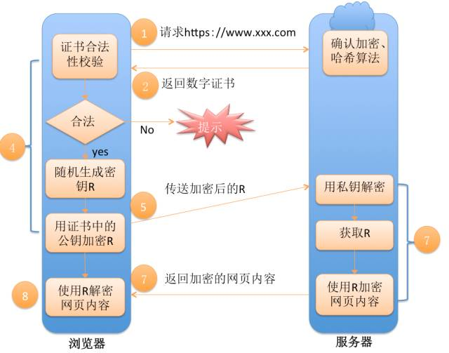

# python 面试
[toc]
## 自我介绍

## python中常用的数据类型
整型（int）、浮点型（float）、复数（complex）、字符串、列表、元组、集合、字典

## 装饰器统计某个函数的运行时间
装饰器要先说道闭包：闭包就是引用了自有变量的函数，这个函数保存了执行的上下文，可以脱离原本的作用域独立存在。
```python
import datetime


def count_time(func):
    def int_time(*args, **kwargs):
        start_time = datetime.datetime.now()  # 程序开始时间
        func()
        over_time = datetime.datetime.now()   # 程序结束时间
        total_time = (over_time-start_time).total_seconds()
        print('程序共计%s秒' % total_time)
    return int_time


@count_time
def main():
    print('>>>>开始计算函数运行时间')
    for i in range(1, 1000):　　　　　　# 可以是任意函数  ， 这里故意模拟函数的运行时间
        for j in range(i):
            print(j)


if __name__ == '__main__':
    main()
```

## python中字符串连接，“+”的效率很低
**“+”低效的原因**：Python中通过“+”进行字符串连接的方法效率极其低下，其根源在于Python中的PyStringObject对象是一个不可变对象。这就意味着当进行字符串连接时，实际上是必须要创建一个新的PyStringObject对象。这样，如果要连接N个PyStringObject对象，那么==就必须进行 N-1 次的内存申请==及内存搬运的工作。毫无疑问，这将严重影响Python的执行效率。

**join执行过程**：执行join操作时，会首先==统计出在list中一共有多少个PyStringObject对象，并统计这些PyStringObject对象所维护的字符串一共有多长==，然后申请内存，将list中所有的PyStringObject对象维护的字符串都拷贝到新开辟的内存空间中。注意：这里只进行了一次内存空间的申请，就完成了N个PyStringObject对象的连接操作。***相比于“+”操作符，待连接的PyStringObject对象越多，效率的提升也会越明显。***

## python的的参数传递，传list会有什么隐患
参数传递一般是复制一个副本传给方法，但是list的值类似于指针，是引用变量，他的副本也是指向真实的list的，所以在方法中改变list会导致外面的list的改变。

## python的内存管理机制
### （1）垃圾回收
python不像C++，Java等语言一样，他们可以不用事先声明变量类型而直接对变量进行赋值。对Python语言来讲，对象的类型和内存都是在运行时确定的。这也是为什么我们称Python语言为动态类型的原因。（把动态类型可以简单的归结为对变量内存地址的分配是在运行时自动判断变量类型并对变量进行赋值）


1、当内存中有不再使用的部分时，垃圾收集器就会把他们清理掉。它会去检查那些引用计数为0的对象，然后清除其在内存的空间。当然除了引用计数为0的会被清除，还有一种情况也会被垃圾收集器清掉：当两个对象相互引用时，他们本身其他的引用已经为0了。

2、垃圾回收机制还有一个==循环垃圾回收器==, 确保释放循环引用对象(a引用b, b引用a, 导致其引用计数永远不为0)。

### （2）引用计数

Python采用了类似Windows内核对象一样的方式来对内存进行管理。每一个对象，都维护这一个对指向该对对象的引用的计数。

对于C语言来 讲，我们创建一个变量A时就会为为该变量申请一个内存空间，并将变量值 放入该空间中,当将该变量赋给另一变量B时会为B申请一个新的内存空间，并将变量 值放入到B的内存空间中，这也是为什么A和B的指针不一致的原因。

实际上，Python 的处理方式和Javascript有点类似，如图所示，变量更像是附在对象上的标签(和引用的定义类似)。当变量被绑定在一个对象上的时候，该变量的引用 计数就是1，(还有另外一些情况也会导致变量引用计数的增加),系统会自动维护这些标签，并==定时扫描==，当某标签的引用计数变为0的时候，该对就会被回收。

**引用计数机制的缺点：**

- 维护引用计数消耗资源
- 循环引用

### （3）内存池机制（金字塔）（分层申请）


1. -1，-2层主要有操作系统进行操作，
2. 第0层是C中的malloc，free等内存分配和释放函数进行操作；
3. 第1层和第2层是内存池，有Python的接口函数PyMem_Malloc函数实现，当对象小于256K时有该层直接分配内存；
4. 第3层是最上层，也就是我们对Python对象的直接操作；在 C 中如果频繁的调用 malloc 与 free 时,是会产生性能问题的.再加上频繁的分配与释放小块的内存会产生内存碎片. Python 在这里主要干的工作有:如果请求分配的内存在1~256字节之间就使用python自己的内存管理系统,否则直接使用 malloc.

原因： Python中，许多时候申请的内存都是小块的内存，这些小块内存在申请后，很快又会被释放，由于这些内存的申请并不是为了创建对象，所以并没有对象一级的内存池机制。这就意味着Python在运行期间会大量地执行malloc和free的操作，频繁地在用户态和核心态之间进行切换，这将严重影响 Python的执行效率。为了加速Python的执行效率，Python引入了一个内存池机制，用于管理对小块内存的申请和释放。这也就是之前提到的 Pymalloc机制。

经由内存池登记的内存到最后还是会回收到内存池,并不会调用 C 的 free 释放掉。

## python 解决循环引用
**解决办法就在具体函数或方法中使用的时候去引用他。用到的时候引用。**

## python 浅拷贝 深拷贝
- **直接赋值**：其实就是对象的引用（别名）。
- **浅拷贝(copy)**：拷贝父对象，不会拷贝对象的内部的子对象。（子对象的内存地址还是一样。）
- **深拷贝(deepcopy)**：copy 模块的 deepcopy 方法，完全拷贝了父对象及其子对象。
```python
# 浅拷贝
>>>a = {1: [1,2,3]}
>>> b = a.copy()
>>> a, b
({1: [1, 2, 3]}, {1: [1, 2, 3]})
>>> a[1].append(4)
>>> a, b
({1: [1, 2, 3, 4]}, {1: [1, 2, 3, 4]})
# 深拷贝
>>>import copy
>>> c = copy.deepcopy(a)
>>> a, c
({1: [1, 2, 3, 4]}, {1: [1, 2, 3, 4]})
>>> a[1].append(5)
>>> a, c
({1: [1, 2, 3, 4, 5]}, {1: [1, 2, 3, 4]})
```
1. **b = a**: 赋值引用，a 和 b 都指向同一个对象


2. **b = a.copy()**:浅拷贝, a 和 b 是一个独立的对象，但他们的子对象还是指向统一对象（是引用）。


3. **b = copy.deepcopy(a)**:深度拷贝, a 和 b 完全拷贝了父对象及其子对象，两者是完全独立的。


## MySQL查询性能优化
1. **为什么查询速度为变慢**

如果把查询看作是一个任务，那么他由一系列子任务组成，每个子任务都会消耗一定的时间。如果要优化查询，实际上要优化其子任务，要么消除其中一些子任务，要么减少子任务的执行的次数，要么让子任务运行得更快。

查询需要在不同的地方花费时间，包括网络，CPU计算，生成统计信息和执行计划、锁等待（互斥等待）等操作，

在每一个消耗大量时间的查询案例中，我们都能看到一些不必要的额外操作、某些操作被额外地重复了很多次、某些操作执行得太慢等。优化查询的目的就是减少和消除这些操作所花费的时间。

2. **慢查询基础：优化数据库访问**

**是否想服务器请求了不需要的数据：请求过量的数据或者重复请求数据**

**一般MySQL能够使用如下三种应用WHERE条件，从好到坏一次为：**
　　　　
- 在索引中使用WHERE条件来过滤不匹配的记录。这是在存储引擎层完成的。
- 使用索引覆盖扫描来返回记录，直接从索引中过滤不需要的记录并返回命中的结果。这是在MySQL服务器层完成的，但无须在回表查询记录。
- 从数据表中返回数据，然后过滤不满足条件的记录。这是在MySQL服务器层完成，MySQL需要先从数据表读出记录然后过滤。

**如果说发现查询需要扫描大量的数据但只返回少数的行，那么通常可以尝试下面的技巧去优化它：**
- 使用索引覆盖扫描，把所有需要用到的列都放到索引中，这样存储引擎无须回表获取对应行就可以返回结果
- 改变库表结构。例如使用单独的汇总表
- 重写这个复杂的查询，让MySQL优化器能够以更优化的方式执行这个查询　

3. **重构查询方式**
    1. 一个复杂查询还是多个简单查询
    2. 分查询：将大查询切分成小查询，每个查询完全一样，只完成一小部分，每次只返回一小部分查询结果。
    3. 分解关联查询（让缓存的效率更高。将查询分解后，执行单个查询可以减少锁的竞争。）

4. **查询执行的基础**
    1. 查询缓存
    2. 查询优化器

5. **优化特定类型的查询**
    1. 优化COUNT()查询
    2. 优化关联查询：
    3. 优化子查询 用关联查询替代
    4. 优化GROUP BY和DISTINCT：


## 数据库的锁机制及原理


概要
数据库锁一般可以分为两类，一个是悲观锁，一个是乐观锁。

- 乐观锁一般是指用户自己实现的一种锁机制，假设认为数据一般情况下不会造成冲突，所以在数据进行提交更新的时候，才会正式对数据的冲突与否进行检测，如果发现冲突了，则让返回用户错误的信息，让用户决定如何去做。乐观锁的实现方式一般包括使用版本号和时间戳。

- 悲观锁一般就是我们通常说的数据库锁机制，以下讨论都是基于悲观锁。

悲观锁主要表锁、行锁、页锁。在MyISAM中只用到表锁，不会有死锁的问题，锁的开销也很小，但是相应的并发能力很差。innodb实现了行级锁和表锁，锁的粒度变小了，并发能力变强，但是相应的锁的开销变大，很有可能出现死锁。同时inodb需要协调这两种锁，算法也变得复杂。InnoDB行锁是通过给索引上的索引项加锁来实现的，只有通过索引条件检索数据，InnoDB才使用行级锁，否则，InnoDB将使用表锁。

表锁和行锁都分为共享锁和排他锁（独占锁），而更新锁是为了解决行锁升级（共享锁升级为独占锁）的死锁问题。

innodb中表锁和行锁一起用，所以为了提高效率才会有意向锁（意向共享锁和意向排他锁）。

## python GIL锁
1. **gil global interpreter lock（cpython）全局解释器锁**
2. **python中一个线程对应于c语言中的一个线程**
3. **gil时的同一时刻只有一个线程在一个cpu上执行字节码，无法将多个线程映射到多个cpu上执行**
4. **gil会根据执行的字节码行数以及时间片释放gil，gil在遇到io操作时主动释放**
5. 用锁会影响性能
6. 锁会引起死锁

## 进程，线程，协程
进程是资源最小单元，线程分配最小单元

**消耗cpu的操作，用多进程编程，对于io操作来说，使用多线程编程，进程切换代价要高于线程**

**协程--可以暂停的函数（可以向暂停的地方传入值）**

协程，又称微线程，纤程。英文名Coroutine。

**async和await原生协程**

python3.5之后，才引入了原生协程的语法 await 相当于 yield from， 在async中不能yield，await只能出现在async中

- 无需线程上下文切换的开销
- 无需原子操作锁定及同步的开销
- 高并发+高扩展性+低成本：一个CPU支持上万的协程都不是问题。所以很适合用于高并发处理。

## HTTP首部有什么？
**请求报文**

```
GET / HTTP/1.1
Host: hackr.jp
User-Agent: Mozilla/5.0 (Windows NT 6.1; WOW64; rv:13.0) Gecko/20100101 Firefox/13.0
Accept: text/html,application/xhtml+xml,application/xml;q=0.9,*/*; q=0.8
Accept-Language: ja,en-us;q=0.7,en;q=0.3
```
**响应报文**

```
HTTP/1.1 304 Not Modified
Date: Thu, 07 Jun 2012 07:21:36 GMT
Server: Apache
Connection: close
Etag: "45bae1-16a-46d776ac"　
```

## Python SQLalchemy
**SQLAlchemy是python中最著名的ORM（Object Relationship Mapping）框架了。**


## linux 内核网络分层
  在Linux内核中，对网络部分按照**网络协议层、网络设备层、设备驱动功能层和网络媒介层**的分层体系设计。

## Linux操作系统的层次


##  OSI七层模型与TCP/IP五层模型


## mac地址在哪层、ip地址在哪层、arp协议干嘛
mac地址在数据链路层，ip地址在网络层
- ### ARP协议
    - ARP(Address Resolution Protocol)地址解析协议
    - 可以将网络层IP32位地址转换为数据链路层MAC48位地址
    
    - ARP缓存表是ARP协议和RARP协议运行的关键
    - ARP缓存表缓存了IP地址到硬件地址之间的映射关系
    - ARP缓存表中的记录并不是永久有效的，有一定的期限

## 网络的路由
网络层的路由概述：
路由(route)就是分组在因特网上从一台计算机传输到另一台计算机的实际路径。
    
    dv算法，迪杰斯特拉算法
    自治系统内部路由的协议称为：内部网关协议(RIP、OSPF)
    自治系统外部路由的协议称为：外部网关协议(BGP) 

## tcp连接三次握手，为什么需要三次

**为什么发送方要发出第三个确认报文呢？**
    - 已经失效的连接请求报文传送到对方，引起错误
    
## tcp四次挥手


为什么需要等待2MSL？
    - 最后一个报文没有确认
    - 确保发送方的ACK可以到达接收方
    - 2MSL时间内没有收到，则接收方会重发
    - 确保当前连接的所有报文都已经过期

## io多路复用 
现在一般都用asyncio，以前用的是时间循环+回调+epoll的形式
```python
import asyncio
import time


async def get_html(url):
    """
    声明一个协程
    """
    print('start get url')
    await asyncio.sleep(2)
    print('end get url')


if __name__ == '__main__':
    start_time = time.time()
    # 创建loop
    loop = asyncio.get_event_loop()
    tasks = [get_html('http://www.imooc.com') for i in range(10)]
    # 将任务提交
    loop.run_until_complete(asyncio.wait(tasks))
    print(time.time() - start_time)
```

## OpenStack
**OpenStack是 模仿亚马逊 AWS 使用python开发的 IssA层实现框架，openstack遵循Apache2.0协议，使我兴奋的是它的WEB管理模块 horizon，是使用Django开发的**

## python hash的实现
**这种散列变换是一种单向运算，具有不可逆性即不能根据散列值还原出输入信息，因此严格意义上讲Hash算法是一种消息摘要算法，不是一种加密算法。**
一个最简单的hash表的实现是用数字来取模，就用长度来取模运算，但是如果长度改变里面的内容都会改变。这就是一个不一致的hash。

插入数据时，解决冲突的办法：
1. 如果key相等，且在key所对应的位置上已有数据，就进行替换；
2. 如果key不相等，就利用线性探测法，往后找一个位置，直到找到空的位置，再填入
```python
# 实现hashtable,指定在key位置存入data
class HashTable:
    def __init__(self):
        self.size=11
        self.slots=[None]*self.size  # hold the key items 
        self.data=[None]*self.size  # hold the data values
    def hashfunction(self,key,size):
        return key%size
    def rehash(self,oldhash,size):
        return (oldhash+1)%size
    def put(self,key,data):
        hashvalue=self.hashfunction(key,len(self.slots))
        if self.slots[hashvalue]==None:  # 如果slot内是empty，就存进去
            self.slots[hashvalue]=key
            self.data[hashvalue]=data
        else:  # slot内已有key
            if self.slots[hashvalue]==key: # 如果已有值等于key,更新data
                self.data[hashvalue]=data # replace
            else:  # 如果slot不等于key,找下一个为None的地方
                nextslot=self.rehash(hashvalue,len(self.slots)) 
                while self.slots[nextslot]!=None and self.slots[nextslot]!=key:
                    nextslot=self.rehash(nextslot,len(self.slots))
                    print('while nextslot:',nextslot)
                if self.slots[nextslot]==None:
                    self.slots[nextslot]=key
                    self.data[nextslot]=data
                    print('slots None')
                else:
                    self.data[nextslot]=data
                    print('slots not None')
            
    def get(self,key):
        startslot=self.hashfunction(key,len(self.slots))
        data=None
        stop=False
        found=False
        position=startslot
        while self.slots[position]!=None and not found and not stop:
            if self.slots[position]==key:
                found=True
                data=self.data[postion]
            else:
                position=self.rehash(position,len(self.slots))
                if position==startslot:
                    stop=True
        return data
    
    
    def __getitem__(self,key):
        return self.get(key)
    def __setitem__(self,key,data):
        print('key:',key)
        print('data:',data)
        self.put(key,data)
```

## 解决hash冲突的方法
1. 开放地址方法（线性探测、再平方探测、伪随机探测）
2. 链式地址法。（　对于相同的哈希值，使用链表进行连接。使用数组存储每一个链表。）
3. 建立公共溢出区（建立公共溢出区存储所有哈希冲突的数据。）
4. 再哈希法（　对于冲突的哈希值再次进行哈希处理，直至没有哈希冲突。）

## hash扩容的方法
扩容时，哈希表的容量增加为原先的两倍，将之前的数据进行重hash然后装进表中。

## 什么时候使用数组什么时候使用链表
- 数组应用场景：数据比较少；经常做的运算是按序号访问数据元素；数组更容易实现，任何高级语言都支持；构建的线性表较稳定。

- 链表应用场景：对线性表的长度或者规模难以估计；频繁做插入删除操作；构建动态性比较强的线性表。

## 匹配子链，用暴力或者kmp破解
https://www.cnblogs.com/zhangtianq/p/5839909.html

## http状态码
https://www.runoob.com/http/http-status-codes.html

## python的堆实现
用list进行堆实现

## python的栈实现
用list能进行实现

## 合并两个数组去重
```
sorted(list(set(alist+blist))

def fun4(s):
	ans = list(set(s))
	ans.sort(key = s.index)
	return ans

```

## 使用迭代器删除集合的元素抛出异常
迭代器进行迭代使用的是集合的一个拷贝，他是在另外的线程中进行的，每次进行迭代的时候都会与主线程的集合进行对比，检查是否一致。如果不一致会在调用next（）方法的时候抛出异常。如果使用的是集合本身的remove方法进行删除元素的话就会造成两个线程的集合不一致的情况，以致抛出异常。如果要移除集合中的元素需使用迭代器的移除元素的方法。

## 红黑树是一种含有红黑结点并能自平衡的二叉查找树。
二叉查找树是左小右大。

## list和set 查询x，谁复杂度低
list 是数组, append 是 O(1), 而 insert 因为要把元素往后移, 所以最坏是 O(n), 比如 insert(0, x)

set 是哈希表, 基本上加入只是求 hash 位置, 基本上是 O(1), 更细节一点的话, set 的 hash 寻址是二次散列和顺序寻址结合的, 不过基本上也可以看成算是 O(1)

## Python的可变/不可变对象


## 链表找倒数第k个
就是通过两个指针p1,p2，首先让p1往前走k-1步，然后让p1,p2一起往前走，当p1走到尾的时候，p2即为倒数第k个。总共走了n次。时间复杂度为O(n).

## 马走日问题——回溯法(python&&JAVA)
https://www.cnblogs.com/daimaxiaocai/p/12124624.html

## docker 隔离问题
unshare命令fork的新的进程里，能从namespace级别进行了父进程和fork出的子进程的隔离。 实际上docker就是宿主机上的一个进程。

## 制作Docker镜像的两种方式
- 使用docker commit命令制作docker镜像
- 使用dockerfile制作镜像
- 使用commit命令比较简单，相当于docker根据container内部执行的命令自动生成了dockerfile。docker file适合批量处理。

## Linux进程间的通信方式
- 管道
- 信号量
- 信号
- 消息队列
- 套接字
- 共享内存

## _和__的区别
- 单个下划线是一个Python命名约定，表示这个名称是供内部使用的。 它通常不由Python解释器强制执行，仅仅作为一种对程序员的提示。
- 单下划线用from + 通配符引用，引用不到
- 双下划线python会改变他的名称，前面会加上单下划线+类名

## python操作文件需要考虑哪些因素
打开方式，异常处理，要正常关闭，接收缓冲区的大小

## 多个进程都要读写一个文件，怎样避免脏读
多线程要加锁和多进程应该都要加锁

## mysql处理百万级以上的数据时如何提高其查询速度的方法
1、应尽量避免在 where 子句中使用!=或<>操作符，否则将引擎放弃使用索引而进行全表扫描。 
2、对查询进行优化，应尽量避免全表扫描，首先应考虑在 where 及 order by 涉及的列上建立索引。 
3、应尽量避免在 where 子句中对字段进行 null 值判断，否则将导致引擎放弃使用索引而进行全表扫描。
**尽量避免全表扫描**

## 僵尸进程和孤儿进程
- 孤儿进程：

#父进程在子进程还在运行前退出，最后会被init进程接管，init以父进程的身份处理子进程运行完毕后遗留状态信息


- 僵尸进程：
#一直创建子进程，不回收子进程运行完毕后的状态信息，从而导致大量的僵尸进程，不能产生新的进程

python的多进程好像封装好了处理僵尸进程的方法。会自己处理僵尸进程。

## 用到过什么调试python程序的方法（pdb，Django的debug）

## 了解过哪些web攻击
csrf，xss，SYN，DDos
跨站请求伪造、注入攻击、利用TCP协议缺陷，通过发送大量的半连接请求，耗费CPU和内存资源、分布式拒绝服务

## 500错误怎排查？
先在浏览器里面进行检查，让他先显示不友好的报错信息，大致看看什么错误，然后到服务器上看看是服务器的配置错误还是程序错误。

## mysql索引以及具体实现
索引是一种数据结构，是数据库维护的高级查找算法。MySQL就普遍使用B+Tree实现其索引结构。
**B+树相比B树的优势：**
　　1.单一节点存储更多的元素，使得查询的IO次数更少；
　　2.所有查询都要查找到叶子节点，查询性能稳定；
　　3.所有叶子节点形成有序链表，便于范围查询。

## Django后端框架的数据流程，url请求数据如何走到后端
从url里面到对应的视图里面，然后数据实际上在request里面，之后由于框架封装，可以进去看他们继承的类里面是如何运用着洗数据的。数据一般在request.data里面。

## 主键、外键的区别？
- 唯一标识一条记录，不能有重复的，不允许为空
- 表的外键是另一表的主键, 外键可以有重复的, 可以是空值

## TCP滑动窗口的作用
- 提供TCP可靠性：对发送的数据进行确认
- 流量控制：窗口大小随链路变化

## linux查看端口进程的方法
ps -ef |grep mysql/ps -aux|grep

## 你怎样获取到访问用户的真实IP地址
django 中HttpRequest.META 中 HTTP_X_FORWARDED_FOR 是真实ip REMOTE_ADDR是代理ip

## 统计列表中的字符串出现的次数，找出前3个出现最多的字符串
可以创建一个字典，然后用将每个值和将这个值传入列表的count方法组成字典的键值对，然后可以用sort key 用lambda拍下顺序

## django中的session
能通过request.session获取删除里面的值。

## selectors
epoll的方式，这种效率更高，但是这种方式在Windows下不支持，在Linux是支持的，selectors模块就是默认使用就是epoll，但是如果在windows系统上使用selectors模块，就会找不到epoll，从而使用select。

## 快速排序的核心思想
基准的选择，可以不选择最左边的选择中位数，或者随机数，就是随机快拍

## linux所有文件类型
 ls -l 命令后，第一列第一个字符为 "-" 的文件为普通文件
 第一个字符为"d"（directory） 是目录文件
 第一个符号为  "l" 是链接文件
 p 是管道文件
 
## 软连接硬链接
软连接相当于快捷方式
硬链接相当于别名，删除其中一个，另一个不会不见，改变其中一个另一个会改变。

## fork()的返回值
fork父进程返回子进程pid，子进程返回0

## linux top
top命令是Linux下常用的性能分析工具，能够实时显示系统中各个进程的资源占用状况，类似于Windows的任务管理器。

## http和https的区别
HTTPS协议是由SSL+HTTP协议构建的可进行加密传输、身份认证的网络协议，比http协议安全。

## 非对称和对称加密
对称加密两个密钥一样，加密解密一样。
非对称两个密钥不一样，一个公钥一个私钥，拥有一定数学关系。

## myisam和innodb的区别
InnoDB存储引擎的特点是：行级锁、事务安全（ACID兼容）、支持外键、
MyISAM存储引擎的特点是：表级锁、不支持事务和全文索引

## 字符串去除首尾字符
可以用strip 或者lstrip 和 rstrip

## 字符串切片和逆序
可以通过中括号，用下标切片，逆序用-1

## 两个列表去掉相同的元素
for 遍历第一个，然后判断元素是否in 第二个列表中，在就两个都删除。

## 一个数组找出第一个出现一次的元素
一个list 一个dict 每次元素没出现在dict中就把它放入dict，然后append进list。，当他
再次判断出现在dict中，就在list中删除这个元素。等到判断完，只出现一次的应该都在list中，同时list[0] 就是第一次出现一次的元素。

## classmethod 和 staticmethod
类方法

定义：使用装饰器@classmethod。第一个参数必须是当前类对象，该参数名一般约定为“cls”，通过它来传递类的属性和方法（不能传实例的属性和方法）； 调用：实例对象和类对象都可以调用。

静态方法

定义：使用装饰器@staticmethod。参数随意，没有“self”和“cls”参数，但是方法体中不能使用类或实例的任何属性和方法；

调用：实例对象和类对象都可以调用。

## 复杂度为O(n)的排序算法
桶排序和计数排序

## 16进制的正则表达式
\b0[xX][0-9a-fA-F]+\b

## 端口是属于OSI的那一层？
传输层

## mysql 端口号3306

## 为什么不所有字段都加索引
加索引是有代价的，需要更多的资源，而且在插入更新删除的时候系统要保持索引的正确性。如果索引太多这些操作就慢了。

## Linux下用netstat查看网络状态、端口状态
netstat -an 0.0.0.0的就是每个IP都有的服务，写明哪个IP的就是绑定那个IP的服务。
netstat -tln 用来查看linux的端口使用情况

## http 和 https的区别
- HTTPS可以认为是HTP+TLS。TLS是传输层加密协议,它的前身是SSL协议。

1、浏览器发起往服务器的443端口发起请求，请求携带了浏览器支持的加密算法和哈希算法。

2、服务器收到请求，选择浏览器支持的加密算法和哈希算法。

3、服务器下将数字证书返回给浏览器，这里的数字证书可以是向某个可靠机构申请的，也可以是自制的。

4、浏览器进入数字证书认证环节，这一部分是浏览器内置的TLS完成的：

4.1 首先浏览器会从内置的证书列表中索引，找到服务器下发证书对应的机构，如果没有找到，此时就会提示用户该证书是不是由权威机构颁发，是不可信任的。如果查到了对应的机构，则取出该机构颁发的公钥。

4.2 用机构的证书公钥解密得到证书的内容和证书签名，内容包括网站的网址、网站的公钥、证书的有效期等。浏览器会先验证证书签名的合法性（验证过程类似上面Bob和Susan的通信）。签名通过后，浏览器验证证书记录的网址是否和当前网址是一致的，不一致会提示用户。如果网址一致会检查证书有效期，证书过期了也会提示用户。这些都通过认证时，浏览器就可以安全使用证书中的网站公钥了。

4.3 浏览器生成一个随机数R，并使用网站公钥对R进行加密。

5、浏览器将加密的R传送给服务器。

6、服务器用自己的私钥解密得到R。

7、服务器以R为密钥使用了对称加密算法加密网页内容并传输给浏览器。

8、浏览器以R为密钥使用之前约定好的解密算法获取网页内容。

## 输入www.baidu.com后的过程详解
(1) 应用层：HTTP(WWW访问协议)，DNS(域名解析服务)
DNS解析域名为目的IP，通过IP找到服务器路径，客户端向服务器发起HTTP会话，然后通过运输层TCP协议封装数据包，在TCP协议基础上进行传输。
(2) 传输层：TCP(为HTTP提供可靠的数据传输)，UDP(DNS使用UDP传输)，HTTP会话会被分成报文段，添加源、目的端口；TCP协议进行主要工作。
(3)网络层：IP(IP数据数据包传输和路由选择)，ICMP(提供网络传输过程中的差错检测)，ARP(将本机的默认网关IP地址映射成物理MAC地址)为数据包选择路由，IP协议进行主要工作，相邻结点的可靠传输，ARP协议将IP地址转成MAC地址。
(4)数据链路层，封装成帧，加入帧首部和尾部

## 中文txt文件的词频统计:
1.用read()读出txt文件所有数据

2.对读出的数据进行结巴分词

3.将分词结果放到字典中

4.将字典中数据按照指定格式放入list中

5.如果要排序就用list(dict1.items())后将该list用lambda函数排序

ls.sort(key=lambda x: x[1], reverse=True)

6.新整个list将排序后dictlist按指定保存格式放入其中

或者还用ls,只不过换了个格式:

for i in range(100):

            ls[i] = "{}:{}".format(ls[i][0], ls[i][1])

7.用join把新list写入csv

## 还有什么要问的？
1. 公司python开发部门有多人呢？
2. 公司用的后端框架是django嘛？
3. 每个团队会有code review环节吗？
4. 假如通过了面试会有一个到岗前的培训吗？