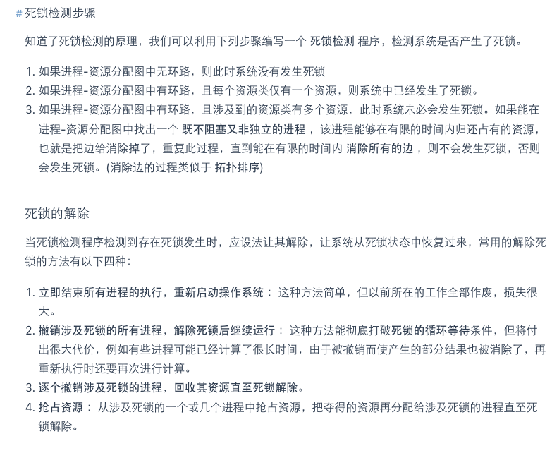

[TOC]

# 自我介绍

面试官好，我叫韦语轩，正在北京石油化工学院的人工智能学院读硕士，在学校期间一直在学习Java和Python有关的后端开发，在本科和研究生期间，都加入了学校实验室，本科期间参加了大量的比赛，从事项目中后段的开发工作。在研究生期间从事的项目是深度学习与后端相结合的项目，同时结合docker ci cd 进行维护。本科期间实习也是和后端开发有关的，同时在实习的时候也学习了前端react的知识，在实习期间完成了xx项目和xx项目，平常会比较喜欢看一些编程的书籍来丰富自己的知识。之后也打算一直从后端的开发，日后的目标是继续深入后端的开发，同时希望未来能够了解一些更深层次的知识。很希望能在贵公司有工作的机会，来积累经验得到提升，为公司创造价值。（平常会刷刷leetcode，算法还可以，看看编程类书籍）

# 进程生命周期

就绪状态：指进程得到了除CPU以外所有必要资源就等CPU开始发动了。

执行状态：得到调度被分配到CPU，就会从就绪状态转换为执行状态。单CPU只能执行单进程，多CPU可以进行多进程。

阻塞状态：指执行状态受到i/o的影响变为阻塞状态，等i/o完成后又变为就绪状态。

创建状态：指的是为程序分配合适的pcb格式，然后放入内存，如果由于内存不足，暂未放入主存，创建工作并未完成，进程不能被调用，则被成为创建状态。

终止状态：自然或非正常结束进程，将进入终止状态，先等待os处理，然后将其pcb清零，将pcb空间返还系统。

挂起状态：不接受cpu的调度

# TCP, UDP 协议的区别


UDP 在传送数据之前不需要先建立连接，远地主机在收到 UDP 报文后，不需要给出任何确认。虽然 UDP 不提供可靠交付，但在某些情况下 UDP 却是一种最有效的工作方式（一般用于即时通信），比如： QQ 语音、 QQ 视频 、直播等等

TCP 提供面向连接的服务。在传送数据之前必须先建立连接，数据传送结束后要释放连接。 TCP 不提供广播或多播服务。由于 TCP 要提供可靠的，面向连接的传输服务（TCP 的可靠体现在 TCP 在传递数据之前，会有三次握手来建立连接，而且在数据传递时，有确认、窗口、重传、拥塞控制机制，在数据传完后，还会断开连接用来节约系统资源），这难以避免增加了许多开销，如确认，流量控制，计时器以及连接管理等。这不仅使协议数据单元的首部增大很多，还要占用许多处理机资源。TCP 一般用于文件传输、发送和接收邮件、远程登录等场景。

# tcp的拥塞控制

在某段时间，若对网络中某一资源的需求超过了该资源所能提供的可用部分，网络的性能就要变坏。这种情况就叫拥塞。拥塞控制就是为了防止过多的数据注入到网络中，这样就可以使网络中的路由器或链路不致过载。

为了进行拥塞控制，TCP 发送方要维持一个 拥塞窗口(cwnd) 的状态变量。拥塞控制窗口的大小取决于网络的拥塞程度，并且动态变化。发送方让自己的发送窗口取为拥塞窗口和接收方的接受窗口中较小的一个。

TCP 的拥塞控制采用了四种算法，即 慢开始 、 拥塞避免 、快重传 和 快恢复。

*   慢开始： 慢开始算法的思路是当主机开始发送数据时，如果立即把大量数据字节注入到网络，那么可能会引起网络阻塞，因为现在还不知道网络的符合情况。经验表明，较好的方法是先探测一下，即由小到大逐渐增大发送窗口，也就是由小到大逐渐增大拥塞窗口数值。cwnd 初始值为 1，每经过一个传播轮次，cwnd 加倍。

*   拥塞避免： 拥塞避免算法的思路是让拥塞窗口 cwnd 缓慢增大，即每经过一个往返时间 RTT 就把发送放的 cwnd 加 1.

*   快重传与快恢复： 在 TCP/IP 中，快速重传和恢复（fast retransmit and recovery，FRR）是一种拥塞控制算法，它能快速恢复丢失的数据包。没有 FRR，如果数据包丢失了，TCP 将会使用定时器来要求传输暂停。在暂停的这段时间内，没有新的或复制的数据包被发送。有了 FRR，如果接收机接收到一个不按顺序的数据段，它会立即给发送机发送一个重复确认。如果发送机接收到三个重复确认，它会假定确认件指出的数据段丢失了，并立即重传这些丢失的数据段。有了 FRR，就不会因为重传时要求的暂停被耽误。 　当有单独的数据包丢失时，快速重传和恢复（FRR）能最有效地工作。当有多个数据信息包在某一段很短的时间内丢失时，它则不能很有效地工作。

# 进程与线程

# Redis有哪些数据结构，底层实现了解过吗？

Redis 提供了多种数据类型来支持不同的业务场景。Redis 还支持事务 、持久化、Lua 脚本、多种集群方案。

1.  string
    介绍 ：string 数据结构是简单的 key-value 类型。虽然 Redis 是用 C 语言写的，但是 Redis 并没有使用 C 的字符串表示，而是自己构建了一种 简单动态字符串（simple dynamic string，SDS）。相比于 C 的原生字符串，Redis 的 SDS 不光可以保存文本数据还可以保存二进制数据，并且获取字符串长度复杂度为 O(1)（C 字符串为 O(N)）,除此之外，Redis 的 SDS API 是安全的，不会造成缓冲区溢出。
2.  list
    介绍 ：list 即是 链表。链表是一种非常常见的数据结构，特点是易于数据元素的插入和删除并且可以灵活调整链表长度，但是链表的随机访问困难。许多高级编程语言都内置了链表的实现比如 Java 中的 LinkedList，但是 C 语言并没有实现链表，所以 Redis 实现了自己的链表数据结构。Redis 的 list 的实现为一个 双向链表，即可以支持反向查找和遍历，更方便操作，不过带来了部分额外的内存开销。
3.  hash
    介绍 ：hash 类似于 JDK1.8 前的 HashMap，内部实现也差不多(数组 + 链表)。不过，Redis 的 hash 做了更多优化。另外，hash 是一个 string 类型的 field 和 value 的映射表，特别适合用于存储对象，后续操作的时候，你可以直接仅仅修改这个对象中的某个字段的值。 比如我们可以 hash 数据结构来存储用户信息，商品信息等等。
4.  set
    介绍 ： set 类似于 Java 中的 HashSet 。Redis 中的 set 类型是一种无序集合，集合中的元素没有先后顺序。当你需要存储一个列表数据，又不希望出现重复数据时，set 是一个很好的选择，并且 set 提供了判断某个成员是否在一个 set 集合内的重要接口，这个也是 list 所不能提供的。可以基于 set 轻易实现交集、并集、差集的操作。比如：你可以将一个用户所有的关注人存在一个集合中，将其所有粉丝存在一个集合。Redis 可以非常方便的实现如共同关注、共同粉丝、共同喜好等功能。这个过程也就是求交集的过程。
5.  bitmap
    介绍： bitmap 存储的是连续的二进制数字（0 和 1），通过 bitmap, 只需要一个 bit 位来表示某个元素对应的值或者状态，key 就是对应元素本身 。我们知道 8 个 bit 可以组成一个 byte，所以 bitmap 本身会极大的节省储存空间。

# 事务

事务是逻辑上的一组操作，要么都执行，要么都不执行。

# MySQL的ACID

1.  原子性（Atomicity） ： 事务是最小的执行单位，不允许分割。事务的原子性确保动作要么全部完成，要么完全不起作用；
2.  一致性（Consistency）： 执行事务前后，数据保持一致，例如转账业务中，无论事务是否成功，转账者和收款人的总额应该是不变的；
3.  隔离性（Isolation）： 并发访问数据库时，一个用户的事务不被其他事务所干扰，各并发事务之间数据库是独立的；
4.  持久性（Durability）： 一个事务被提交之后。它对数据库中数据的改变是持久的，即使数据库发生故障也不应该对其有任何影响。

数据事务的实现原理呢？

我们这里以 MySQL 的 InnoDB 引擎为例来简单说一下。

MySQL InnoDB 引擎使用 redo log(重做日志) 保证事务的持久性，使用 undo log(回滚日志) 来保证事务的原子性。

MySQL InnoDB 引擎通过 锁机制、MVCC 等手段来保证事务的隔离性（ 默认支持的隔离级别是 REPEATABLE-READ ）。

# 并发事务带来哪些问题?

*   脏读（Dirty read）: 当一个事务正在访问数据并且对数据进行了修改，而这种修改还没有提交到数据库中，这时另外一个事务也访问了这个数据，然后使用了这个数据。因为这个数据是还没有提交的数据，那么另外一个事务读到的这个数据是“脏数据”，依据“脏数据”所做的操作可能是不正确的。
*   丢失修改（Lost to modify）: 指在一个事务读取一个数据时，另外一个事务也访问了该数据，那么在第一个事务中修改了这个数据后，第二个事务也修改了这个数据。这样第一个事务内的修改结果就被丢失，因此称为丢失修改。 例如：事务 1 读取某表中的数据 A=20，事务 2 也读取 A=20，事务 1 修改 A=A-1，事务 2 也修改 A=A-1，最终结果 A=19，事务 1 的修改被丢失。
*   不可重复读（Unrepeatable read）: 指在一个事务内多次读同一数据。在这个事务还没有结束时，另一个事务也访问该数据。那么，在第一个事务中的两次读数据之间，由于第二个事务的修改导致第一个事务两次读取的数据可能不太一样。这就发生了在一个事务内两次读到的数据是不一样的情况，因此称为不可重复读。
*   幻读（Phantom read）: 幻读与不可重复读类似。它发生在一个事务（T1）读取了几行数据，接着另一个并发事务（T2）插入了一些数据时。在随后的查询中，第一个事务（T1）就会发现多了一些原本不存在的记录，就好像发生了幻觉一样，所以称为幻读。

不可重复读和幻读区别：

不可重复读的重点是修改比如多次读取一条记录发现其中某些列的值被修改，幻读的重点在于新增或者删除比如多次查询同一条查询语句（DQL）时，记录发现记录增多或减少了。

# 事务隔离级别有哪些?


# mvcc是什么？

一致性非锁定读
对于 一致性非锁定读（Consistent Nonlocking Reads） 的实现，通常做法是加一个版本号或者时间戳字段，在更新数据的同时版本号 + 1 或者更新时间戳。查询时，将当前可见的版本号与对应记录的版本号进行比对，如果记录的版本小于可见版本，则表示该记录可见

在 InnoDB 存储引擎中，多版本控制 (multi versioning) 就是对非锁定读的实现。如果读取的行正在执行 DELETE 或 UPDATE 操作，这时读取操作不会去等待行上锁的释放。相反地，InnoDB 存储引擎会去读取行的一个快照数据，对于这种读取历史数据的方式，我们叫它快照读 (snapshot read)

在 Repeatable Read 和 Read Committed 两个隔离级别下，如果是执行普通的 select 语句（不包括 select ... lock in share mode ,select ... for update）则会使用 一致性非锁定读（MVCC）。并且在 Repeatable Read 下 MVCC 实现了可重复读和防止部分幻读

# MySQL的索引？二级索引？

**索引是一种用于快速查询和检索数据的数据结构。常见的索引结构有: B 树， B+树和 Hash**。

主键索引(Primary Key)
数据表的主键列使用的就是主键索引。

一张数据表有只能有一个主键，并且主键不能为 null，不能重复。

在 MySQL 的 InnoDB 的表中，当没有显示的指定表的主键时，InnoDB 会自动先检查表中是否有唯一索引且不允许存在null值的字段，如果有，则选择该字段为默认的主键，否则 InnoDB 将会自动创建一个 6Byte 的自增主键。

二级索引又称为辅助索引，是因为二级索引的叶子节点存储的数据是主键。也就是说，通过二级索引，可以定位主键的位置。

唯一索引，普通索引，前缀索引等索引属于二级索引。


## 索引的优缺点

*   优点 ：
    *   使用索引可以大大加快 数据的检索速度（大大减少检索的数据量）,这也是创建索引的最主要的原因。
    *   通过创建唯一性索引，可以保证数据库表中每一行数据的唯一性。
*   缺点 ：
    *   创建索引和维护索引需要耗费许多时间。当对表中的数据进行增删改的时候，如果数据有索引，那么索引也需要动态的修改，会降低 SQL 执行效率。
    *   索引需要使用物理文件存储，也会耗费一定空间。

## 索引的底层数据结构

Hash表 & B+树
哈希表是键值对的集合，通过键(key)即可快速取出对应的值(value)，因此哈希表可以快速检索数据（接近 O（1））。

Hash 索引不支持顺序和范围查询(Hash 索引不支持顺序和范围查询是它最大的缺点

# B 树& B+树的区别

B 树也称 B-树,全称为 多路平衡查找树 ，B+ 树是 B 树的一种变体。B 树和 B+树中的 B 是 Balanced （平衡）的意思。

目前大部分数据库系统及文件系统都采用 B-Tree 或其变种 B+Tree 作为索引结构。

*   B 树的所有节点既存放键(key) 也存放 数据(data)，而 B+树只有叶子节点存放 key 和 data，其他内节点只存放 key。
*   B 树的叶子节点都是独立的;B+树的叶子节点有一条引用链指向与它相邻的叶子节点。
*   B 树的检索的过程相当于对范围内的每个节点的关键字做二分查找，可能还没有到达叶子节点，检索就结束了。而 B+树的检索效率就很稳定了，任何查找都是从根节点到叶子节点的过程，叶子节点的顺序检索很明显。


在 MySQL 中，MyISAM 引擎和 InnoDB 引擎都是使用 B+Tree 作为索引结构，但是，两者的实现方式不太一样。

# OSI 七层模型

OSI 七层模型 是国际标准化组织提出一个网络分层模型，其大体结构以及每一层提供的功能如下图所示：


# 浏览器是多进程还是多线程比较好

相结合比较好吧，chrome 就是多进程多线程的浏览器


# 什么是死锁


# 死锁的四个条件


# 解决死锁的方法




# 判断是死锁还是死循环

①  PS 查询 相关进程的PID
②  top -P   PID   查询该进程占用资源情况    主要查看的是  cpu  和 内存  的占用率
（如果CPU占用率高就是死循环， 如果CPU占用率正常，而且内存占用正常，那就是死锁）
如果有问题，就去详分析该进程底下 各个是哪个线程出现的问题
③ top -Hp  PID     该进程底下各线程的CPU、内存占用情况

# unicode和ascii的区别

ASCII编码

ASCII 码使用指定的7 位或8 位二进制数组合来表示128 或256 种可能的字符。标准ASCII 码也叫基础ASCII码，使用7 位二进制数（剩下的1位二进制为0）来表示所有的大写和小写字母，数字0 到9、标点符号， 以及在美式英语中使用的特殊控制字符。其中最后一位用于奇偶校验。
问题：ASCII是单字节编码，无法用来表示中文（中文编码至少需要2个字节），所以，中国制定了GB2312编码，用来把中文编进去。但世界上有许多不同的语言，所以需要一种统一的编码。

Unicode

Unicode把所有语言都统一到一套编码里，这样就不会再有乱码问题了。
Unicode最常用的是用两个字节表示一个字符（如果要用到非常偏僻的字符，就需要4个字节）。现代操作系统和大多数编程语言都直接支持Unicode。
Unicode和ASCII的区别

ASCII编码是1个字节，而Unicode编码通常是2个字节。
字母A用ASCII编码是十进制的65，二进制的01000001；而在Unicode中，只需要在前面补0，即为：00000000 01000001。
新的问题：如果统一成Unicode编码，乱码问题从此消失了。但是，如果你写的文本基本上全部是英文的话，用Unicode编码比ASCII编码需要多一倍的存储空间，在存储和传输上就十分不划算。
UTF8

所以，本着节约的精神，又出现了把Unicode编码转化为“可变长编码”的UTF-8编码。
UTF-8编码把一个Unicode字符根据不同的数字大小编码成1-6个字节，常用的英文字母被编码成1个字节，汉字通常是3个字节，只有很生僻的字符才会被编码成4-6个字节。如果你要传输的文本包含大量英文字符，用UTF-8编码就能节省空间。

# 网页的一个访问过程

1.  DNS解析（浏览器缓存、路由器缓存、dns缓存）

2.  TCP连接

3.  发送HTTP请求

4.  服务器处理请求并返回HTTP报文

5.  浏览器解析渲染页面

6.  连接结束

# 数据库范式

第一范式(1NF)：属性不可分割，即每个属性都是不可分割的原子项。(实体的属性即表中的列)

第二范式(2NF)：满足第一范式；且不存在部分依赖，即非主属性必须完全依赖于主属性。(主属性即主键；完全依赖是针对于联合主键的情况，非主键列不能只依赖于主键的一部分)

第三范式(3NF)：满足第二范式；且不存在传递依赖，即非主属性不能与非主属性之间有依赖关系，非主属性必须直接依赖于主属性，不能间接依赖主属性。（A -> B, B ->C, A -> C）

# 设计测试用例的方法

1.总的设计测试用例的方法——基于需求的设计方法
测试人员接到需求之后，要对需求进行分析和验证，从合理的需求中进一步分析细化需求，从细化的需求中找出测试点，根据这些测试点再去设计测试用例。

2.等价类
把测试的输入划分为若干个等价类，从每一个等价类当中选择一个或者几个测试用例进行测试，如果这些测试用例测试通过，那么我们就说这个测试用例所在的等价类测试通过。
有效等价类：符合我们需求规格说明的数据集合
无效等价类：不符合需求规格说明的数据集合
有效等价类和无效等价类都要测

3.边界值
对边界的周围的值进行具体的测试用例的设计

4.因果图
当测试点输入有多个，并且不同的输入组合针对不同的输出，可以使用因果图来分析组合和输出之间的关系。
因果图
逻辑关系图： 恒等 、 与、 或 、非

5.正交排列
根据正交性，从多个实验因素的水平组合中选取最优的，根据这些最优的水平组合实验的结果，来判断整体实验的结果。

6.场景设计法
使用场景 如何针对一个APP或者软件系统使用场景来设计测试用例？
场景其实就是不同功能点按照一定的策略组合。

7.错误猜测法
根据测试人员的知识，经验，直觉，有针对性的设计测试用例

# Http与https区别

HTTP 协议介绍
HTTP 协议，全称超文本传输协议（Hypertext Transfer Protocol）。顾名思义，HTTP 协议就是用来规范超文本的传输，超文本，也就是网络上的包括文本在内的各式各样的消，具体来说，主要是来规范浏览器和服务器端的行为的。

HTTPS 是基于 HTTP 的，也是用 TCP 作为底层协议，并额外使用 SSL/TLS 协议用作加密和安全认证。默认端口号是 443.

HTTPS 之所以能达到较高的安全性要求，就是结合了 SSL/TLS 和 TCP 协议，对通信数据进行加密，解决了 HTTP 数据透明的问题。接下来重点介绍一下 SSL/TLS 的工作原理。

新版本被命名为 TLS 1.0。因此，TLS 是基于 SSL 之上的，但由于习惯叫法，通常把 HTTPS 中的核心加密协议混成为 SSL/TLS。

SSL/TLS 的核心要素是非对称加密。非对称加密采用两个密钥——一个公钥，一个私钥。在通信时，私钥仅由解密者保存，公钥由任何一个想与解密者通信的发送者（加密者）所知。可以设想一个场景，

非对称加密的公钥和私钥需要采用一种复杂的数学机制生成（密码学认为，为了较高的安全性，尽量不要自己创造加密方案）。公私钥对的生成算法依赖于单向陷门函数。

使用非对称加密，对对称加密的密钥进行加密，保护该密钥不在网络信道中被窃听。这样，通信双方只需要一次非对称加密，交换对称加密的密钥，在之后的信息通信中，使用绝对安全的密钥，对信息进行对称加密，即可保证传输消息的保密性。

# 状态码403，503，以及区别。

403 Forbidden——对请求资源的访问被服务器拒绝了 访问过多，ip被列入黑名单，没有权限
503 Service Unavailable——服务器暂处于超负载或正在进行停机维护，现在无法处理请求

# 进程间的通信常见的的有哪几种方式呢?


# 如果给你一组数据，你会怎么设置索引

1、索引列的类型尽量小
2、索引的选择离散性高的
3、只为用于搜索、排序或分组的列创建索引
4、主键选择少改变的列
5、处理冗余和重复索引

# 索引中的最左匹配原则。

建立索引的目的是：希望通过索引进行数据查找，减少随机 IO，增加查询性能 ，索引能过滤出越少的数据，则从磁盘中读入的数据也就越少。

区分度最高的放在联合索引的最左侧（区分度=列中不同值的数量/列的总行数）
尽量把字段长度小的列放在联合索引的最左侧（因为字段长度越小，一页能存储的数据量越大，IO 性能也就越好）
使用最频繁的列放到联合索引的左侧（这样可以比较少的建立一些索引）

# 套接字

套接字(Socket)，就是对网络中不同主机上的应用进程之间进行双向通信的端点的抽象。一个套接字就是网络上进程通信的一端，提供了应用层进程利用网络协议交换数据的机制。

# socket通信和tcp通信的区别是什么

socket通信和tcp通信的区别：1、tcp协议属于传输层协议，而socket是应用层和传输层之间的一个抽象层；2、建立一个TCP连接需要三次握手；3、socket连接可以保持长连接；4、tcp服务端和tcp客户端使用socket通信等。


# 数据传输单工,半双工,全双工之间的区别

单工通信只支持信号在一个方向上传输（正向或反向），任何时候不能改变信号的传输方向。

半双工通信允许信号在两个方向上传输，但某一时刻只允许信号在一个信道上单向传输。

全双工通信允许数据同时在两个方向上传输，即有两个信道，因此允许同时进行双向传输。

# 数据库引擎

MySQL 当前默认的存储引擎是 InnoDB
InnoDB 是事务性存储引擎

MyISAM 和 InnoDB 的区别
MyISAM 不支持事务和行级锁，而且最大的缺陷就是崩溃后无法安全恢复。
MySQL 引入了 InnoDB（事务性数据库引擎），MySQL 5.5 版本后默认的存储引擎为 InnoDB。
1.是否支持行级锁

MyISAM 只有表级锁(table-level locking)，而 InnoDB 支持行级锁(row-level locking)和表级锁,默认为行级锁。

也就说，MyISAM 一锁就是锁住了整张表，这在并发写的情况下是多么滴憨憨啊！这也是为什么 InnoDB 在并发写的时候，性能更牛皮了！

2.是否支持事务

MyISAM 不提供事务支持。

InnoDB 提供事务支持，具有提交(commit)和回滚(rollback)事务的能力。

3.是否支持外键

MyISAM 不支持，而 InnoDB 支持。

4.是否支持数据库异常崩溃后的安全恢复

MyISAM 不支持，而 InnoDB 支持。

使用 InnoDB 的数据库在异常崩溃后，数据库重新启动的时候会保证数据库恢复到崩溃前的状态。这个恢复的过程依赖于 redo log 。

5.是否支持 MVCC

MyISAM 不支持，而 InnoDB 支持。

# 锁机制与 InnoDB 锁算法


# 外键是索引吗

# LINUX:统计日志文件中ERROR出现的次数

grep  'ERROR'  xx.log |wc -l

# 反问

对测试开发没有经验的话，如何能在短时间内进行有效的学习。
面试官在测试方面的经验，以及作为一个新人，如何去为测试岗位做准备。
面试官针对我对测试的理解进行了修正，并进行了测试开发这个领域的一点小科普，主要讲了，软件质量以及客维方面的内容。

① 偏测试还是偏开发（答：都有，涉及自动化框架设计）
② 技术栈（答：python）
③ 什么时间出结果（答：一周内通过的话会有消息）

# 测试开发的工具

Selenium
模拟浏览器运行
Pytest
是 Python 的一种单元测试框架，与 Python 自带的 unittest 测试框架类似，但是比 unittest 框架使用起来更简洁，效率更高。
allure
测试报告的展示

# 对测试开发的认识

测试是整个软件开发生命周期里的一环，是质量管理的重要手段，在没有设置专职QA岗位的情况下，测试岗一般需要兼顾QA角色，从软件的全生命周期去把控整体的质量，使用的手段包括但不限于流程控制、自动化技术引入、人员素质的培养、思想的贯彻、监控与度量及持续改进等。
质量是企业的生命线，若我们的输出无法保证质量，那么输出将会变得没有意义，也无法很好的为客户交付价值。渐渐地我们就会变得没有价值。所以质量保障是一件非常重要、有价值、有意义的生命周期过程。

# 共享单车扫码测试用例

1.  功能测试：
    （1）扫码摄像头识别清晰
    （2）远距离扫码自动放大
    （3）夜晚扫码可以开手电筒
    （4）扫码识别出来的自行车定位准确
    （5）扫码之后能够正常跳转到开锁页
2.  异常测试：
    （1）扫码失败之后，提示友好
    （2）自行车有故障之后，扫码完成后有提示
    （3）自行车二维码模糊，也可以准确识别
    （4）弱网状态下，测试扫码识别
3.  专项测试：
    （1）扫码识别速度
    （2）扫码接口响应速度
    （3）扫码识别准确度

# web端自动化测试怎么使用的，怎么设计实现的自动化？

软件自动化测试就是通过测试工具或者其他手段， 按照测试人员的预定计划对软件产品进行自动化 测试，他是软件测试的一个重要组成部分，能够 完成许多手工测试无法完成或者难以实现的测试 工作，正确合理的实施自动化测试，能够快速， 全面的对软件进行测试，从而提高软件质量，节省经费，缩短软件的发布周期

Loadrunner、Jmeter等，对软件进行压力测试、负载测试等等，因为这些无法用手工进行代替，所以必须自动化。

Selenium(开源)

ThroughtWorks一个强大的基于浏览器的开源自动化测试工具，通常用来编写web应用的自动化测试

# 单元测试、集成测试、系统测试、验收测试、回归测试

单元测试：完成最小的软件设计单元（模块）的验证工作，目标是确保模块被正确的编码。
集成测试：将各个单元组合并进行测试，以验证它们在集成时是否按预期工作。这里的主要目的是测试模块之间的接口。
系统测试：是基于系统整体需求说明书的黑盒类测试，必须将系统中的软件与各种依赖的资源结合起来，在系统实际运行环境下来进行测试。
回归测试：回归测试是指在发生修改之后重新测试先前的测试用例以保证修改的正确性。
验收测试：验收测试是指系统开发生命周期方法论的一个阶段，这时相关的用户或独立测试人员根据测试计划和结果对系统进行测试和接收。

# 黑盒与白盒的测试方法

黑盒测试也称功能测试或数据驱动测试，它是在已知产品所应具有的功能，通过测试来检测每个功能是否都能正常使用，在测试时，把程序看作一个不能打开的黑盆子，在完全不考虑程序内部结构和内部特性的情况下，测试者在程序接口进行测试，它只检查程序功能是否按照需求规格说明书的规定正常使用，程序是否能适当地接收输入数锯而产生正确的输出信息，并且保持外部信息（如数据库或文件）的完整性。

白盒测试也称为结构测试或逻辑驱动测试，是针对被测单元内部是如何进行工作的测试。它根据程序的控制结构设计测试用例，主要用于软件或程序验证。白盒测试法检查程序内部逻辑结构，对所有的逻辑路径进行测试，是一种穷举路径的测试方法，但即使每条路径都测试过了，但仍然有可能存在错误。

# 如何写测试用例

1、测试人员尽早介入，彻底理解清楚需求，这个是写好测试用例的基础
2、如果以前有类似的需求，可以参考类似需求的测试用例，然后还需要看类似需求的bug情况

3、清楚输入、输出的各种可能性，以及各种输入的之间的关联关系，理解清楚需求的执行逻辑，通过等价类、边界值、判定表等方法找出大部分用例

4、找到需求相关的一些特性，补充测试用例

5、根据自己的经验分析遗漏的测试场景

6、多总结类似功能点的测试点，才能够写出质量越来越高的测试用例

7、书写格式一定要清晰

# python写一个发送https请求的函数

```python
pip install requests

import requests

url = 'http://www.baidu.com'
result = requests.get(url)


import requests

url = 'https://xxxxx.com/login'
data_ = {'username': 'test'}
result = requests.post(url, data=data_)
print(result)

```

# Linux 创建文件

1.  使用重定向符（>）创建文件
2.  使用 touch 命令创建文件
3.  使用 echo 命令创建文件
4.  使用 vi / vim 创建文件

# linux零拷贝的原理是什么？

CPU\&DMA方式
直接内存访问（Direct Memory Access），是一种硬件设备绕开CPU独立直接访问内存的机制。所以DMA在一定程度上解放了CPU，把之前CPU的杂活让硬件直接自己做了，提高了CPU效率。
目前支持DMA的硬件包括：网卡、声卡、显卡、磁盘控制器等。


# 请问linux两台机器之间传文件，用的什么端口

1、scp传输

scp传输速度较慢，但使用ssh通道保证了传输的安全性。
2、rsync差异化传输(支持断点续传,数据同步)
3、管道传输(降低IO开销)
4、nc传输(一种网络的数据流重定向)
5、建立文件服务器

# Redis 持久化机制(怎么保证 Redis 挂掉之后再重启数据可以进行恢复)

很多时候我们需要持久化数据也就是将内存中的数据写入到硬盘里面，大部分原因是为了之后重用数据（比如重启机器、机器故障之后恢复数据），或者是为了防止系统故障而将数据备份到一个远程位置。

Redis 不同于 Memcached 的很重要一点就是，Redis 支持持久化，而且支持两种不同的持久化操作。Redis 的一种持久化方式叫快照（snapshotting，RDB），另一种方式是只追加文件（append-only file, AOF）。这两种方法各有千秋，下面我会详细这两种持久化方法是什么，怎么用，如何选择适合自己的持久化方法。

# Redis哨兵模式

Redis 服务器毫无征兆的罢工是个麻烦事。那么怎办办？答曰：备份一台，你挂了它上。

那么如何得知某一台 redis 服务器挂了，如何切换，如何保证备份的机器是原始服务器的完整备份呢？这时候就需要 Sentinel 和 Replication 出场了。

Sentinel 可以管理多个 Redis 服务器，它提供了监控，提醒以及自动的故障转移的功能；Replication 则是负责让一个 Redis 服务器可以配备多个备份的服务器。

Redis 也是利用这两个功能来保证 Redis 的高可用的。此外，Sentinel 功能则是对 Redis 的发布和订阅功能的一个利用。

# 软件的分类

❗️1、按应用划分：
⭕️⭕️①系统软件：
操作系统
驱动程序
补丁程序
⭕️⭕️②应用软件
娱乐类：游戏类，播放类，社交类，阅读器

⭕️⭕️①单机软件
⭕️⭕️②分布式软件

# 软件测试过程五个步骤

1、需求分析：分析客户的需求可不可行。2、编写测试计划。3、编写测试用例：测试用例就是指导测试的文档。4、执行测试：提交bug，回归测试。5、编写测试总结报告。

# 高并发下减少事务带来的性能消耗

1.  结合业务场景，使用低级别事务隔离
    在修改用户的最后登录时间，或者用户的个人资料等数据时，这些数据都只有用户自己登录和登陆后才会修改，不存在一个事务提交的信息被覆盖的可能，所以这样的业务我们就最低的隔离级别。

如果账户的余额或者积分的消费，就可能存在多个客户端同时消费一个账户的情况，此时我们应该选择可重复读隔离级别，来保证当一个客户端在操作的时候，其他客户端不能对该数据进行操作。
2\. 避免行锁升级表锁
InnoDB中行锁是通过索引实现的，当不通过索引条件检索数据时，行锁就会升级成表锁，我们知道表锁会严重影响我们对整张表的操作，应该避免这种情况。

1.  控制事务的大小，减少锁定的资源和锁定的时间

# 读写锁

读写锁（Readers-Writer Lock）顾名思义是一把锁分为两部分：读锁和写锁，其中读锁允许多个线程同时获得，因为读操作本身是线程安全的，而写锁则是互斥锁，不允许多个线程同时获得写锁，并且写操作和读操作也是互斥的。总结来说，读写锁的特点是：读读不互斥、读写互斥、写写互斥。

# 堆和栈

栈常用于保存方法帧和局部变量，而对象总是在堆上分配。

1、栈由系统自动分配，而堆是人为申请开辟；2、栈获得的空间较小，而堆获得的空间较大；

# arp协议

arp协议的主要功能是将IP地址解析为物理地址

# TCP三次握手的安全性问题

SYN洪泛攻击
TCP三次握手的过程中，服务器为了响应一个收到的SYN，分配并初始化 连接变量 和 缓存。然后服务器发送一个 SYN ACK 进行响应，并等待来自客户端的ACK报文段。如果某客户端不发送 ACK 来完成该三次握手的第三步，最终（通常在一分多钟以后）服务器将终止该半开连接并回收资源。

如果客户是合法的，它将返回一个ACK ( 确认连接 )报文段。该报文段的 ack 值为 cookie值加1。根据这个值计算该ACK报文段是否合法，如果 判定合法，服务器才会生成一个具有套接字的全开的连接 。

# linux 内存管理机制

Linux采用虚拟内存管理技术，利用虚拟内存技术让每个进程都有4GB 互不干涉的虚拟地址空间。

进程初始化分配和操作的都是基于这个「虚拟地址」，只有当进程需要实际访问内存资源的时候才会建立虚拟地址和物理地址的映射，调入物理内存页。

不管是用户空间还是内核空间，使用的地址都是虚拟地址，当需进程要实际访问内存的时候，会由内核的「请求分页机制」产生「缺页异常」调入物理内存页。

# MySQL 执行一条查询语句的内部执行过程？

*   客户端先通过连接器连接到 MySQL 服务器。
*   连接器权限验证通过之后，先查询是否有查询缓存，如果有缓存（之前执行过此语句）则直接返回缓存数据，如果没有缓存则进入分析器。
*   分析器会对查询语句进行语法分析和词法分析，判断 SQL 语法是否正确，如果查询语法错误会直接返回给客户端错误信息，如果语法正确则进入优化器。
*   优化器是对查询语句进行优化处理，例如一个表里面有多个索引，优化器会判别哪个索引性能更好。
*   优化器执行完就进入执行器，执行器就开始执行语句进行查询比对了，直到查询到满足条件的所有数据，然后进行返回。

